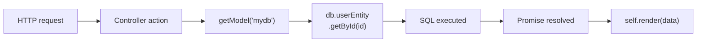
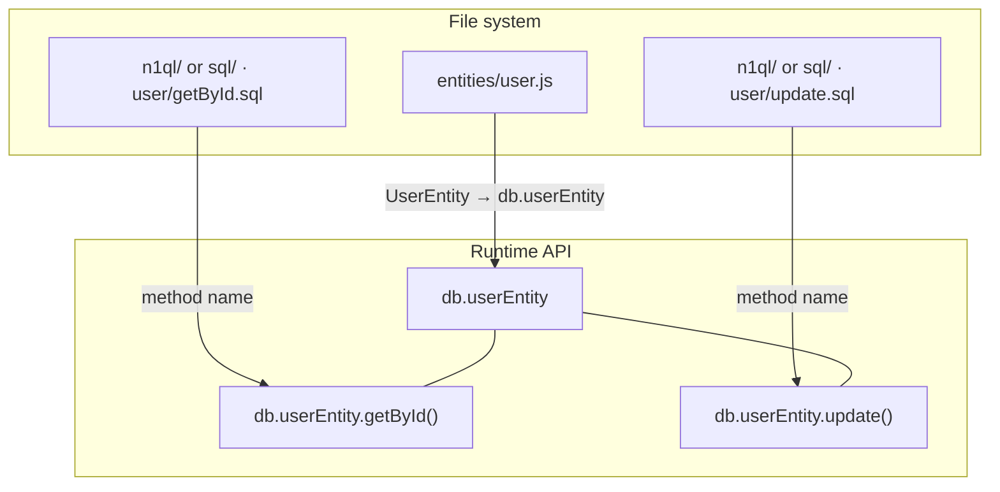
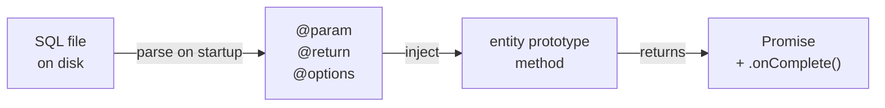
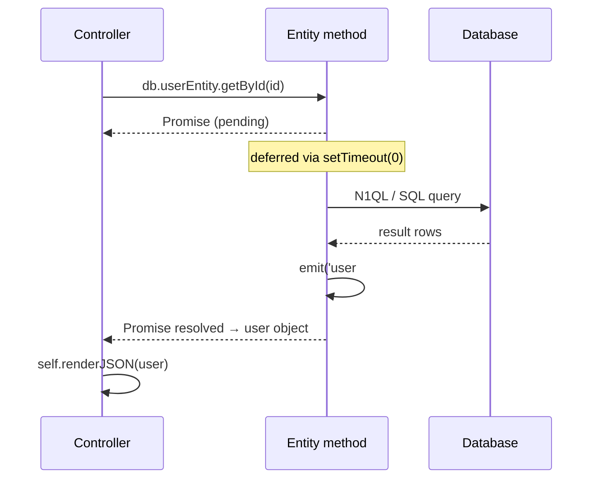
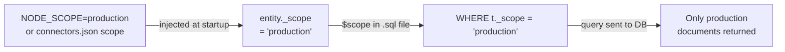

import Tabs from '@theme/Tabs';
import TabItem from '@theme/TabItem';

# Models and entities

The model layer is where database interaction lives in a Gina bundle. It is built around
**entity classes** — one class per domain object — each backed by SQL files that the
framework automatically wires up as callable methods. Controllers never touch a database
connection directly: they call entity methods and `await` the result.

---

## How it works

At startup, the framework reads every connector declared in `connectors.json`, opens the
connection, and scans the bundle's `models/` directory. For each entity class it finds,
SQL files in the matching subdirectory are converted into methods on that entity's
prototype. By the time a controller action runs, all entity methods are ready to call.



---

## Directory layout

The framework derives entity names and method names entirely from the file system. Place
a file at the right path and the entity method appears automatically — no registration,
no boilerplate.

<Tabs>
  <TabItem value="couchbase" label="Couchbase (N1QL)" default>

```
src/<bundle>/models/
  <database>/
    entities/
      user.js          ← UserEntity class
      order.js         ← OrderEntity class
    n1ql/
      user/
        getById.sql    → db.userEntity.getById()
        update.sql     → db.userEntity.update()
      order/
        getByUserId.sql → db.orderEntity.getByUserId()
```

N1QL query files live under `n1ql/`. The subdirectory name matches the entity file name;
the SQL file name (without `.sql`) becomes the method name.

  </TabItem>
  <TabItem value="sqlite" label="SQLite">

```
src/<bundle>/models/
  <database>/
    entities/
      user.js          ← UserEntity class
      order.js         ← OrderEntity class
    sql/
      user/
        getById.sql    → db.userEntity.getById()
        update.sql     → db.userEntity.update()
      order/
        getByUserId.sql → db.orderEntity.getByUserId()
```

SQL query files live under `sql/`. The same naming convention applies: subdirectory →
entity, file name → method. Statements are pre-compiled at startup via `conn.prepare()`.

  </TabItem>
</Tabs>



---

## Getting a model in a controller

`getModel()` is a global — no `require` needed. Pass the connector name as declared in
`connectors.json`:

```js
var db = getModel('mydb');
```

The returned object has one property per entity class, keyed as `<entityName>Entity`
(lower-camel-case). For a `user.js` entity file:

```js
db.userEntity       // UserEntity instance
db.orderEntity      // OrderEntity instance
db._connection      // raw database connection (avoid using directly)
```

For cross-bundle access, pass the bundle name as the second argument:

```js
var sharedDb = getModel('analytics', 'reporting-bundle');
```

---

## Entity classes

An entity class is a plain constructor function. The framework injects the `EntitySuper`
base (an EventEmitter) at startup — you do not extend it yourself.

```js
// src/api/models/mydb/entities/user.js

function UserEntity() {
    var self = this;

    this.insert = function(rec) {
        var conn = self.getConnection();

        rec._scope      = self._scope;
        rec._collection = self._collection;

        try {
            conn.insert(rec.id, rec, function(err, result) {
                if (err) return self.emit('user#insert', err);
                self.emit('user#insert', false, rec);
            });
        } catch(e) {
            self.emit('user#insert', e);
        }
    };
}

module.exports = UserEntity;
```

**Rules for JS-defined methods:**

- The method body must contain the string `<shortName>#<methodName>` (e.g. `user#insert`).
  The framework scans source text to discover which methods participate in the event system.
- Call `self.emit('<shortName>#<methodName>', err)` on failure and
  `self.emit('<shortName>#<methodName>', false, result)` on success.
- The framework wraps discovered methods in a Promise with an `.onComplete(cb)` shim —
  callers can use `await` or the callback style interchangeably.

Methods whose body does not reference the trigger string are plain functions and are not
wrapped — they have no `.onComplete()` and no Promise return.

---

## SQL files

Drop a file at the right path and the framework creates the method automatically.

<Tabs>
  <TabItem value="couchbase" label="Couchbase (N1QL)" default>

**Path convention**

```
models/<database>/n1ql/<EntityName>/<methodName>.sql
```

**Example — single row by ID**

```sql
/*
 * @param  {string} $1
 * @return {object}
 */
SELECT *
FROM `mydb` t
WHERE t.id = $1
  AND t._scope = $scope
```

Positional parameters use `$1`, `$2`, `$3`, … notation. The special `$scope` placeholder
is **not** a positional parameter — it is replaced with the literal scope value before the
query reaches Couchbase (e.g. `AND t._scope = 'production'`).

**Multi-file queries with `@include`**

Complex queries can be split across files using a subdirectory and a `_main.sql` entry point:

```
n1ql/user/getOrderSummary/
  _main.sql
  totals.sql
```

`_main.sql` pulls in sub-files at build time:

```sql
@include './totals.sql';
```

In dev mode, SQL files are re-read from disk on every call — changes take effect without
restarting the bundle.

  </TabItem>
  <TabItem value="sqlite" label="SQLite">

**Path convention**

```
models/<database>/sql/<EntityName>/<methodName>.sql
```

**Example — single row by ID**

```sql
/*
 * @param  {string} ?
 * @return {object}
 */
SELECT * FROM users WHERE id = ?
```

SQLite uses `?` positional placeholders (standard SQLite syntax). Statements are
pre-compiled at startup via `conn.prepare()` — the compiled statement is reused on every
call, giving the best performance for repeated queries.

There is no `$scope` substitution for SQLite queries. Scope filtering, if needed, must be
written as a plain `?` parameter.

`@include` directives are not supported for SQLite.

  </TabItem>
</Tabs>

---

## Annotations

A block comment at the top of each SQL file carries metadata the framework reads at
load time. All annotations are optional.



<Tabs>
  <TabItem value="couchbase" label="Couchbase (N1QL)" default>

All four annotations are supported.

**`@param` — parameter types and casting**

```sql
/*
 * @param {string}  $1   user id
 * @param {integer} $2   page number
 * @param {float}   $3   minimum rating
 */
```

Supported types: `string`, `number` / `integer` (parsed as integer), `float`. Types are
used to cast arguments before the query runs.

**`@return` — result shape**

| Annotation | What is returned |
|---|---|
| `@return {object}` | First row, or `null` if the result is empty |
| `@return {array}` | All rows (default for SELECT) |
| `@return {boolean}` | `true` if any row exists (SELECT) or any rows were affected (write) |
| `@return {number}` | Numeric value of the first key of the first row — for `COUNT(*)` queries |
| *(omitted on write)* | Raw Couchbase mutation result |

**`@options` — query-level settings**

```sql
/*
 * @options { consistency: "request_plus" }
 */
SELECT ...
```

`request_plus` forces the cluster to index all mutations before the query runs — use it
when a query must see a document written in the same request. The default is `not_bounded`
(fastest, eventual consistency), which is appropriate for most reads.

**`@include` — sub-file composition**

```sql
/*
 * Complex aggregation — pulls in shared sub-queries
 */
@include './totals.sql';
@include './filters.sql';

SELECT ...
```

Included files are expanded inline at load time. Paths are resolved relative to the
including file.

  </TabItem>
  <TabItem value="sqlite" label="SQLite">

`@param` and `@return` are supported. `@options` and `@include` are not available for
SQLite.

**`@param` — parameter types and casting**

```sql
/*
 * @param {string}  ?   user id
 * @param {integer} ?   page number
 */
```

Use `?` in the query body — the `@param` declaration order determines binding. Supported
types: `string`, `number` / `integer`, `float`.

**`@return` — result shape**

| Annotation | What is returned |
|---|---|
| `@return {object}` | First row via `stmt.get()`, or `null` if empty |
| `@return {array}` | All rows via `stmt.all()` (default for SELECT) |
| `@return {boolean}` | `true` if `length > 0` (SELECT) or `changes > 0` (write) |
| `@return {number}` | Numeric value from the first key of the first row — for `COUNT(*)` |
| *(omitted on write)* | `{ changes, lastInsertRowid }` |

  </TabItem>
</Tabs>

---

## Calling entity methods

All SQL-derived methods return a native Promise with an `.onComplete(cb)` shim. The
sequence below shows what happens inside the framework on each call:



### `await` (preferred in async actions)

```js
var Controller = function() {
    var self = this;

    this.profile = async function(req, res, next) {
        var db   = getModel('mydb');
        var user = await db.userEntity.getById(req.routing.param.id);

        if (!user) return self.throwError(404, 'User not found');
        self.renderJSON(user);
    };
};
module.exports = Controller;
```

### `.onComplete()` callback (legacy / mixed style)

```js
this.profile = function(req, res, next) {
    var db = getModel('mydb');

    db.userEntity.getById(req.routing.param.id).onComplete(function(err, user) {
        if (err) return self.render(err);
        self.renderJSON(user);
    });
};
```

### Sequential and parallel awaits

```js
// Sequential — second query runs after the first resolves
var user   = await db.userEntity.getById(userId);
var orders = await db.orderEntity.getByUserId(userId);

// Parallel — both queries run simultaneously
var [user, orders] = await Promise.all([
    db.userEntity.getById(userId),
    db.orderEntity.getByUserId(userId)
]);
```

---

## Scope-based data isolation

Every entity prototype gets a `_scope` property injected from the connector configuration
or from `process.env.NODE_SCOPE`. Scope ensures that a single database or table serves
multiple logical environments (local, beta, production) without cross-contamination.



<Tabs>
  <TabItem value="couchbase" label="Couchbase (N1QL)" default>

`$scope` is a string replacement — not a bound parameter — so it does not shift `$1`,
`$2` numbering:

```sql
-- authoring time
SELECT * FROM `mydb` t
WHERE t.id = $1
  AND t._scope = $scope

-- runtime (NODE_SCOPE=production)
SELECT * FROM `mydb` t WHERE t.id = 'abc123' AND t._scope = 'production'
```

When **writing** a document, stamp `_scope` and `_collection` explicitly so future N1QL
queries can find it:

```js
rec._scope      = self._scope;
rec._collection = self._collection;
conn.insert(rec.id, rec, cb);
```

  </TabItem>
  <TabItem value="sqlite" label="SQLite">

SQLite does not use `$scope` substitution. If your schema requires scope filtering, add
a regular column and pass the scope as a `?` parameter:

```sql
/*
 * @param {string} ?   user id
 * @param {string} ?   scope
 * @return {object}
 */
SELECT * FROM users WHERE id = ? AND scope = ?
```

```js
var user = await db.userEntity.getById(id, self._scope);
```

  </TabItem>
</Tabs>

See [Scopes — data isolation](../concepts/scopes#scopes-and-data-isolation) for the
full conceptual explanation.

---

## Related entities

Call `this.getEntity('name')` inside an entity class to get another entity instance from
the same model. Use this for operations that span more than one domain object.

```js
function OrderEntity() {
    var self       = this;
    var userEntity = self.getEntity('user');   // UserEntity instance

    this.placeOrder = function(rec) {
        userEntity.getById(rec.userId).onComplete(function(err, user) {
            if (err || !user) return self.emit('order#placeOrder', new Error('User not found'));
            // ... create order ...
            self.emit('order#placeOrder', false, order);
        });
    };
}
```

`getEntity()` returns the cached singleton for that entity within the bundle — the same
instance other callers use, with the same connection.

---

## Couchbase vs SQLite — quick reference

| | Couchbase | SQLite |
|---|---|---|
| SQL directory | `n1ql/` | `sql/` |
| Placeholders | `$1`, `$2`, … | `?` |
| `$scope` substitution | Yes — replaced with scope value | No |
| `@include` support | Yes | No |
| `@options` support | Yes | No |
| Statement preparation | At query time | At startup (`conn.prepare()`) |
| Dev hot-reload (SQL) | Re-reads file on every call | Not applicable |

---

## See also

- [connectors.json reference](../reference/connectors) — configuring database connections
- [Scopes](../concepts/scopes) — scope-based data isolation explained
- [Testing](./testing) — mocking entities and connectors in unit tests
- [Controllers](./controller) — using `await` in controller actions
