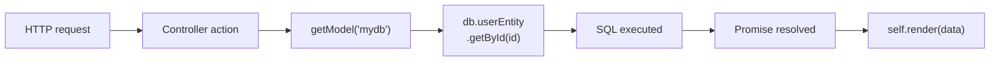
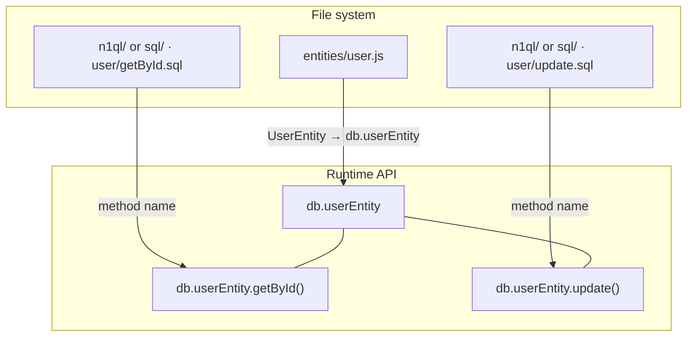
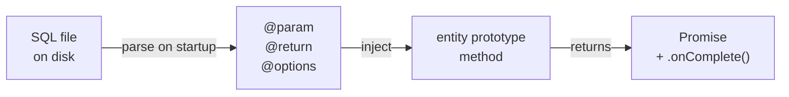
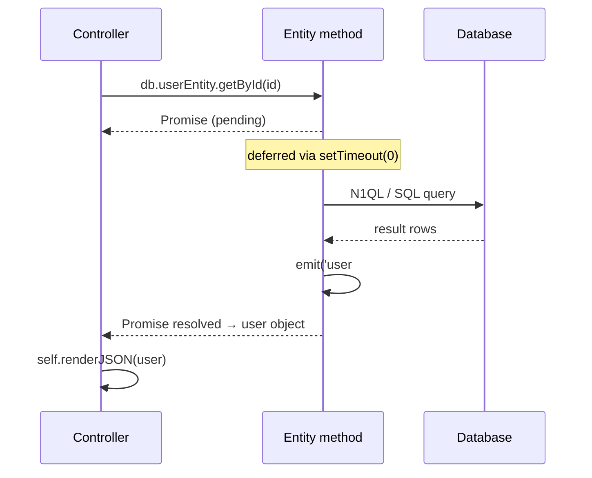
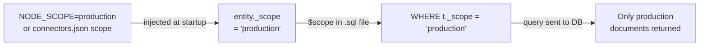

import Tabs from '@theme/Tabs';
import TabItem from '@theme/TabItem';

# Models and entities

The model layer is where database interaction lives in a Gina bundle. It is built around
**entity classes** — one class per domain object — each backed by SQL files that the
framework automatically wires up as callable methods. Controllers never touch a database
connection directly: they call entity methods and `await` the result.

This guide teaches the entity model itself, which is the same over every store. For the
per-store deep-dives — Couchbase, ScyllaDB, MongoDB, DuckDB — and a comparison of all
supported connectors, see the [Data section](/data/).

---

## How it works

At startup, the framework reads every connector declared in `connectors.json`, opens the
connection, and scans the bundle's `models/` directory. For each entity class it finds,
SQL files in the matching subdirectory are converted into methods on that entity's
prototype. By the time a controller action runs, all entity methods are ready to call.


```mermaid
flowchart LR
    A["HTTP request"] --> B["Controller action"]
    B --> C["getModel('mydb')"]
    C --> D["db.userEntity\n.getById(id)"]
    D --> E["SQL executed"]
    E --> F["Promise resolved"]
    F --> G["self.render(data)"]
```

---

## Directory layout

The framework derives entity names and method names entirely from the file system. Place
a file at the right path and the entity method appears automatically — no registration,
no boilerplate.

<Tabs groupId="database">
  <TabItem value="couchbase" label="Couchbase (N1QL)" default>

```
src/<bundle>/models/
  <database>/
    entities/
      user.js          ← UserEntity class
      order.js         ← OrderEntity class
    n1ql/
      user/
        getById.sql    → db.userEntity.getById()
        update.sql     → db.userEntity.update()
      order/
        getByUserId.sql → db.orderEntity.getByUserId()
```

N1QL query files live under `n1ql/`. The subdirectory name matches the entity file name;
the SQL file name (without `.sql`) becomes the method name.

  </TabItem>
  <TabItem value="sqlite" label="SQLite">

```
src/<bundle>/models/
  <database>/
    entities/
      user.js          ← UserEntity class
      order.js         ← OrderEntity class
    sql/
      user/
        getById.sql    → db.userEntity.getById()
        update.sql     → db.userEntity.update()
      order/
        getByUserId.sql → db.orderEntity.getByUserId()
```

SQL query files live under `sql/`. The same naming convention applies: subdirectory →
entity, file name → method. Statements are pre-compiled at startup via `conn.prepare()`.

  </TabItem>
  <TabItem value="mysql" label="MySQL">

```
src/<bundle>/models/
  <database>/
    entities/
      user.js          ← UserEntity class
      order.js         ← OrderEntity class
    sql/
      user/
        getById.sql    → db.userEntity.getById()
        update.sql     → db.userEntity.update()
      order/
        getByUserId.sql → db.orderEntity.getByUserId()
```

SQL query files live under `sql/`. The same naming convention applies: subdirectory →
entity, file name → method. Uses `?` positional placeholders (mysql2 syntax).

  </TabItem>
  <TabItem value="postgresql" label="PostgreSQL">

```
src/<bundle>/models/
  <database>/
    entities/
      user.js          ← UserEntity class
      order.js         ← OrderEntity class
    sql/
      user/
        getById.sql    → db.userEntity.getById()
        update.sql     → db.userEntity.update()
      order/
        getByUserId.sql → db.orderEntity.getByUserId()
```

SQL query files live under `sql/`. The same naming convention applies: subdirectory →
entity, file name → method. Uses `$1`, `$2`, … positional placeholders (pg syntax).

  </TabItem>
</Tabs>


```mermaid
flowchart TD
    subgraph files["File system"]
        EF["entities/user.js"]
        SF1["n1ql/ or sql/ · user/getById.sql"]
        SF2["n1ql/ or sql/ · user/update.sql"]
    end

    subgraph api["Runtime API"]
        ENT["db.userEntity"]
        M1["db.userEntity.getById()"]
        M2["db.userEntity.update()"]
    end

    EF -->|"UserEntity → db.userEntity"| ENT
    SF1 -->|"method name"| M1
    SF2 -->|"method name"| M2
    ENT --- M1
    ENT --- M2
```

---

## Getting a model in a controller

`getModel()` is a global — no `require` needed. Pass the connector name as declared in
`connectors.json`:

```js
var db = getModel('mydb');
```

The returned object has one property per entity class, keyed as `<entityName>Entity`
(lower-camel-case). For a `user.js` entity file:

```js
db.userEntity       // UserEntity instance
db.orderEntity      // OrderEntity instance
db._connection      // raw database connection (avoid using directly)
```

A bare-name alias without the `Entity` suffix is registered for every entity —
`db.user` and `db.userEntity` are the same object; use whichever reads better.

For cross-bundle access, pass the bundle name as the second argument:

```js
var sharedDb = getModel('analytics', 'reporting-bundle');
```

---

## Entity classes

An entity class is a plain constructor function. The framework injects the `EntitySuper`
base (an EventEmitter) at startup — you do not extend it yourself.

```js
// src/api/models/mydb/entities/user.js

function UserEntity() {
    var self = this;

    this.insert = function(rec) {
        var conn = self.getConnection();

        rec._scope      = self._scope;
        rec._collection = self._collection;

        try {
            conn.insert(rec.id, rec, function(err, result) {
                if (err) return self.emit('user#insert', err);
                self.emit('user#insert', false, rec);
            });
        } catch(e) {
            self.emit('user#insert', e);
        }
    };
}

module.exports = UserEntity;
```

**Rules for JS-defined methods:**

- The method body must contain the string `<shortName>#<methodName>` (e.g. `user#insert`).
  The framework scans source text to discover which methods participate in the event system.
- Call `self.emit('<shortName>#<methodName>', err)` on failure and
  `self.emit('<shortName>#<methodName>', false, result)` on success.
- The framework wraps discovered methods in a Promise with an `.onComplete(cb)` shim —
  callers can use `await` or the callback style interchangeably.

Methods whose body does not reference the trigger string are plain functions and are not
wrapped — they have no `.onComplete()` and no Promise return.

:::note Concurrency and per-call identity
This note describes the **JS-defined emit-style methods** above — the ones you write by
hand whose body calls `self.emit('<shortName>#<methodName>', …)`. Methods generated from
`.sql` files behave differently; see
[Concurrency for SQL-derived methods](#concurrency-for-sql-derived-methods).

When several calls to the **same** emit-style method are in flight at once, the framework
pairs completions to callers in **arrival order** — the first result emitted goes to the
first caller still waiting, and so on. Each caller settles (no call is ever left hanging),
and when the underlying operations complete in the order they were started, every caller
receives its own result.

If the operations can complete **out of the order they were called** — different keys with
different latencies, say — arrival-order pairing can hand one caller another's result. When
that matters, give the method **true per-call identity by returning a Promise** instead of
emitting:

```js
UserEntity.prototype.getById = function getById(id) {
    // No emit; the returned Promise is bound to THIS call.
    return this.getConnection().get(id);
};
```

A method that returns a Promise resolves the exact call that made it, regardless of
completion order. The emit + `.onComplete()` pattern remains fully supported and is correct
for the common in-order case; reach for the Promise return only when concurrent out-of-order
completion on one method is a real possibility.
:::

---

## SQL files

Drop a file at the right path and the framework creates the method automatically.

<Tabs groupId="database">
  <TabItem value="couchbase" label="Couchbase (N1QL)" default>

**Path convention**

```
models/<database>/n1ql/<EntityName>/<methodName>.sql
```

**Example — single row by ID**

```sql
/*
 * @param  {string} $1
 * @return {object}
 */
SELECT *
FROM `mydb` t
WHERE t.id = $1
  AND t._scope = $scope
```

Positional parameters use `$1`, `$2`, `$3`, … notation. The special `$scope` placeholder
is **not** a positional parameter — it is replaced with the literal scope value before the
query reaches Couchbase (e.g. `AND t._scope = 'production'`).

**Multi-file queries with `@include`**

Complex queries can be split across files using a subdirectory and a `_main.sql` entry point:

```
n1ql/user/getOrderSummary/
  _main.sql
  totals.sql
```

`_main.sql` pulls in sub-files at build time:

```sql
@include './totals.sql';
```

In dev mode, SQL files are re-read from disk on every call — changes take effect without
restarting the bundle.

  </TabItem>
  <TabItem value="sqlite" label="SQLite">

**Path convention**

```
models/<database>/sql/<EntityName>/<methodName>.sql
```

**Example — single row by ID**

```sql
/*
 * @param  {string} ?
 * @return {object}
 */
SELECT * FROM users WHERE id = ?
```

SQLite uses `?` positional placeholders (standard SQLite syntax). Statements are
pre-compiled at startup via `conn.prepare()` — the compiled statement is reused on every
call, giving the best performance for repeated queries.

There is no `$scope` substitution for SQLite queries. Scope filtering, if needed, must be
written as a plain `?` parameter.

`@include` directives are not supported for SQLite.

  </TabItem>
  <TabItem value="mysql" label="MySQL">

**Path convention**

```
models/<database>/sql/<EntityName>/<methodName>.sql
```

**Example — single row by ID**

```sql
/*
 * @param  {string} ?
 * @return {object}
 */
SELECT * FROM users WHERE id = ?
```

MySQL uses `?` positional placeholders — the same syntax as SQLite. The driver
(`mysql2`) re-uses the server-side prepared statement on repeated calls via
`pool.execute()`.

There is no `$scope` substitution for MySQL queries. `@include` and `@options` are
not supported.

  </TabItem>
  <TabItem value="postgresql" label="PostgreSQL">

**Path convention**

```
models/<database>/sql/<EntityName>/<methodName>.sql
```

**Example — single row by ID**

```sql
/*
 * @param  {string} $1
 * @return {object}
 */
SELECT * FROM users WHERE id = $1
```

PostgreSQL uses `$1`, `$2`, `$3`, … positional placeholders (standard pg syntax).
Arguments are passed in order to `pool.query()`.

There is no `$scope` substitution for PostgreSQL queries. `@include` and `@options` are
not supported.

  </TabItem>
</Tabs>

---

## Annotations

A block comment at the top of each SQL file carries metadata the framework reads at
load time. All annotations are optional.


```mermaid
flowchart LR
    A["SQL file\non disk"] -->|"parse on startup"| B["@param\n@return\n@options"]
    B -->|"inject"| C["entity prototype\nmethod"]
    C -->|"returns"| D["Promise\n+ .onComplete()"]
```

<Tabs groupId="database">
  <TabItem value="couchbase" label="Couchbase (N1QL)" default>

All four annotations are supported.

**`@param` — parameter types and casting**

```sql
/*
 * @param {string}  $1   user id
 * @param {integer} $2   page number
 * @param {float}   $3   minimum rating
 */
```

Supported types: `string`, `number` / `integer` (parsed as integer), `float`. Types are
used to cast arguments before the query runs.

**`@return` — result shape**

| Annotation | What is returned |
|---|---|
| `@return {object}` | First row, or `null` if the result is empty |
| `@return {array}` | All rows (default for SELECT) |
| `@return {boolean}` | `true` if any row exists (SELECT) or any rows were affected (write) |
| `@return {number}` | Numeric value of the first key of the first row — for `COUNT(*)` queries |
| *(omitted on write)* | Raw Couchbase mutation result |

**`@options` — query-level settings**

```sql
/*
 * @options { consistency: "request_plus" }
 */
SELECT ...
```

`request_plus` forces the cluster to index all mutations before the query runs — use it
when a query must see a document written in the same request. The default is `not_bounded`
(fastest, eventual consistency), which is appropriate for most reads.

The braces are required, and any other key (`adhoc`, `profile`, `timeout`, …) is applied
only when `consistency` is present alongside it — `@options { adhoc: true }` on its own is
ignored (silently before 0.5.26; with a logged warning from 0.5.26). Always include an
explicit `consistency`. See
[Couchbase ORM → `@options` annotations](/data/couchbase-orm) for the full table.

**`@include` — sub-file composition**

```sql
/*
 * Complex aggregation — pulls in shared sub-queries
 */
@include './totals.sql';
@include './filters.sql';

SELECT ...
```

Included files are expanded inline at load time. Paths are resolved relative to the
including file.

  </TabItem>
  <TabItem value="sqlite" label="SQLite">

`@param` and `@return` are supported. `@options` and `@include` are not available for
SQLite.

**`@param` — parameter types and casting**

```sql
/*
 * @param {string}  ?   user id
 * @param {integer} ?   page number
 */
```

Use `?` in the query body — the `@param` declaration order determines binding. Supported
types: `string`, `number` / `integer`, `float`.

**`@return` — result shape**

| Annotation | What is returned |
|---|---|
| `@return {object}` | First row via `stmt.get()`, or `null` if empty |
| `@return {array}` | All rows via `stmt.all()` (default for SELECT) |
| `@return {boolean}` | `true` if `length > 0` (SELECT) or `changes > 0` (write) |
| `@return {number}` | Numeric value from the first key of the first row — for `COUNT(*)` |
| *(omitted on write)* | `{ changes, lastInsertRowid }` |

  </TabItem>
  <TabItem value="mysql" label="MySQL">

`@param` and `@return` are supported. `@options` and `@include` are not available for
MySQL.

**`@param` — parameter types and casting**

```sql
/*
 * @param {string}  ?   user id
 * @param {integer} ?   page number
 */
```

Use `?` in the query body — the `@param` declaration order determines binding. Supported
types: `string`, `number` / `integer`, `float`.

**`@return` — result shape**

| Annotation | What is returned |
|---|---|
| `@return {object}` | First row, or `null` if the result is empty |
| `@return {array}` | All rows (default for SELECT) |
| `@return {boolean}` | `true` if `length > 0` (SELECT) or `affectedRows > 0` (write) |
| `@return {number}` | Numeric value from the first key of the first row — for `COUNT(*)` |
| *(omitted on write)* | `{ changes, insertId }` |

  </TabItem>
  <TabItem value="postgresql" label="PostgreSQL">

`@param` and `@return` are supported. `@options` and `@include` are not available for
PostgreSQL.

**`@param` — parameter types and casting**

```sql
/*
 * @param {string}  $1   user id
 * @param {integer} $2   page number
 */
```

Use `$1`, `$2`, … in the query body. The `@param` declaration order must match the
placeholder numbering. Supported types: `string`, `number` / `integer`, `float`.

**`@return` — result shape**

| Annotation | What is returned |
|---|---|
| `@return {object}` | First row (`result.rows[0]`), or `null` if the result is empty |
| `@return {array}` | All rows (`result.rows`, default for SELECT) |
| `@return {boolean}` | `true` if `rows.length > 0` (SELECT) or `rowCount > 0` (write) |
| `@return {number}` | Numeric value from the first key of the first row — for `COUNT(*)` |
| *(omitted on write)* | `{ changes, command }` — e.g. `{ changes: 1, command: 'INSERT' }` |

  </TabItem>
</Tabs>

---

## Calling entity methods

All SQL-derived methods return a native Promise with an `.onComplete(cb)` shim. The
sequence below shows what happens inside the framework on each call:


```mermaid
sequenceDiagram
    participant C as Controller
    participant E as Entity method
    participant DB as Database

    C->>E: db.userEntity.getById(id)
    E-->>C: Promise (pending)
    Note over E: deferred via setTimeout(0)
    E->>DB: N1QL / SQL query
    DB-->>E: result rows
    E->>E: emit('user#getById', false, row)
    E-->>C: Promise resolved → user object
    C->>C: self.renderJSON(user)
```

### Concurrency for SQL-derived methods

Each call to a `.sql`-derived method carries **true per-call identity**: the returned
Promise is settled by that call and no other, whichever order the underlying queries
finish in. Issuing several at once — including with `Promise.all` — is safe, and the
callback and `await` forms behave identically.

:::caution Couchbase, before 0.6.19
This guarantee is **new in 0.6.19** for the Couchbase connector. Earlier versions settled
these methods from a listener keyed on the entity and method name only, on an entity
shared process-wide — so the first query to finish woke *every* in-flight caller of that
method with its own rows, and concurrent callers could receive each other's results. It
affected `await` and `.onComplete()` equally, and applied even when the queries completed
in the order they were started.

If you are on an earlier version and cannot upgrade, the explicit trailing-callback form
was never affected:

```js
db.userEntity.getById(id, function (err, user) { /* … */ });
```

The other connectors (MySQL, PostgreSQL, SQLite, ScyllaDB, DuckDB, MongoDB) always carried
per-call identity and were never affected.
:::

### `await` (preferred in async actions)

```js
var Controller = function() {
    var self = this;

    this.profile = async function(req, res, next) {
        var db   = getModel('mydb');
        var user = await db.userEntity.getById(req.routing.param.id);

        if (!user) return self.throwError(404, 'User not found');
        self.renderJSON(user);
    };
};
module.exports = Controller;
```

### `.onComplete()` callback (legacy / mixed style)

```js
// var self = this; declared at constructor top
this.profile = function(req, res, next) {
    var db = getModel('mydb');

    db.userEntity.getById(req.routing.param.id).onComplete(function(err, user) {
        if (err) return self.render(err);
        self.renderJSON(user);
    });
};
```

### Sequential and parallel awaits

```js
// Sequential — second query runs after the first resolves
var user   = await db.userEntity.getById(userId);
var orders = await db.orderEntity.getByUserId(userId);

// Parallel — both queries run simultaneously
var [user, orders] = await Promise.all([
    db.userEntity.getById(userId),
    db.orderEntity.getByUserId(userId)
]);
```

Parallel calls are safe, including several calls to the *same* method with different
arguments — see [Concurrency for SQL-derived methods](#concurrency-for-sql-derived-methods)
for the guarantee and the Couchbase version note.

### Transient vs permanent errors

*New in 0.5.25.* When a query fails, the error you get back carries a
classification of the failure, so you can tell a self-healing condition from a
real one without string-matching vendor error text:

- `err.isTransient` — `true` when a retry after backoff can plausibly succeed: a
  datastore timeout, a dropped connection, a node warming up after a restart,
  rebalance or failover.
- `err.transientReason` — a normalized `source:condition` token naming the
  condition when `isTransient` is `true`, and `null` when it is `false`. For
  example `socket:econnrefused`, `postgres:serialization-failure`,
  `mongo:transient-transaction`, `couchbase:timeout`.

```js
db.userEntity.getById(req.routing.param.id).onComplete(function(err, user) {
    if (err) {
        if (err.isTransient) {
            // self-healing — tell the caller to come back
            return self.throwError(503, 'Store temporarily unavailable, please retry');
        }
        return self.render(err);   // permanent — the framework error page
    }
    self.renderJSON(user);
});
```

Both call styles are covered: the fields are stamped on the error a callback
receives *and* on the error an `await` call rejects with, so a `try`/`catch`
branches identically.

All six connectors classify — Couchbase, MongoDB, MySQL, PostgreSQL, ScyllaDB
and SQLite — by normalizing signals the drivers already carry: socket errno,
driver error codes and class names, ANSI SQLSTATE classes, MongoDB error labels,
Couchbase N1QL cause codes.

**The classification is deliberately conservative: anything unrecognized is
reported as permanent.** So `isTransient === true` is a positive signal you can
act on, while `false` means "not recognized as transient" — which covers
genuinely permanent failures (a query syntax error, a duplicate key, or a DNS
misconfiguration, since `ENOTFOUND` is a config error rather than a blip) *and*
any condition the classifier does not yet recognise. Treat `false` as the
default path, not as proof that a retry is pointless.

The two fields are purely additive — nothing else about the error changes — so
existing code that ignores them behaves exactly as before.

### Rendering transients as 503 + Retry-After (opt-in)

*New in 0.6.2.* The example above hand-rolls the retry response. If you would
rather have the framework do it, opt in per bundle in `settings.json`:

```js
"server": {
    "transientErrors": {
        "enabled": true,        // strict boolean — anything else leaves it off
        "retryAfter": 30,       // Retry-After delta-seconds, integer 1..86400 (default 30)
        "message": "Store temporarily unavailable — please retry."  // default: "Service Unavailable"
    }
}
```

With the opt-in on, a stamped-transient error that would have rendered as
HTTP 500 through `self.throwError()` renders as **503** with a
**`Retry-After`** header instead — on JSON/XHR responses and HTML error pages
alike, over HTTP/1.1 and HTTP/2. The user-facing `error` field carries your
configured `message` (or the standard 503 status text) instead of the raw
datastore error; the full error detail still lands in the server-side log,
paired with the incident `ref` the response carries.

What is deliberately **not** upgraded:

- an **explicit non-500 status** — `self.throwError(404, err)` stays 404;
- a **permanent** error (`isTransient` is `false` or absent) — stays 500;
- anything when the opt-in is off — the default behaviour is unchanged.

A malformed `transientErrors` block (a string `"true"`, an out-of-range
`retryAfter`, an empty `message`) is reported by a boot-time warning naming the
ignored key, and the feature stays off — it never refuses a boot. If you also
configure a [custom error page](/guides/error-pages) for `503` (or `5xx`), it
receives the cleaned-up `error` text in its template data.

### Transactions

There is no transaction annotation in the SQL-file layer — transactions are a
driver-level feature. When you need one, ask the entity for the underlying driver
handle: every data-connector entity exposes `getConnection()`, and for the SQL
connectors what it returns **is** the driver pool / database handle, so you start
the transaction on it directly. Couchbase and MongoDB return a narrower handle and
add `getCluster()` / `getClient()` for the level above. See
[Reaching the underlying driver handle](/reference/connectors#reaching-the-underlying-driver-handle)
for the per-connector table.

---

## Scope-based data isolation

Every entity prototype gets a `_scope` property injected from the connector configuration
or from `process.env.NODE_SCOPE`. Scope ensures that a single database or table serves
multiple logical environments (local, beta, production) without cross-contamination.


```mermaid
flowchart LR
    A["NODE_SCOPE=production\nor connectors.json scope"] -->|"injected at startup"| B["entity._scope\n= 'production'"]
    B -->|"$scope in .sql file"| C["WHERE t._scope = 'production'"]
    C -->|"query sent to DB"| D["Only production\ndocuments returned"]
```

<Tabs groupId="database">
  <TabItem value="couchbase" label="Couchbase (N1QL)" default>

`$scope` is a string replacement — not a bound parameter — so it does not shift `$1`,
`$2` numbering:

```sql
-- authoring time
SELECT * FROM `mydb` t
WHERE t.id = $1
  AND t._scope = $scope

-- runtime (NODE_SCOPE=production)
SELECT * FROM `mydb` t WHERE t.id = 'abc123' AND t._scope = 'production'
```

When **writing** a document, stamp `_scope` and `_collection` explicitly so future N1QL
queries can find it:

```js
rec._scope      = self._scope;
rec._collection = self._collection;
conn.insert(rec.id, rec, cb);
```

  </TabItem>
  <TabItem value="sqlite" label="SQLite">

SQLite does not use `$scope` substitution. If your schema requires scope filtering, add
a regular column and pass the scope as a `?` parameter:

```sql
/*
 * @param {string} ?   user id
 * @param {string} ?   scope
 * @return {object}
 */
SELECT * FROM users WHERE id = ? AND scope = ?
```

```js
var user = await db.userEntity.getById(id, self._scope);
```

  </TabItem>
  <TabItem value="mysql" label="MySQL">

MySQL does not use `$scope` substitution. If your schema requires scope filtering, add
a regular column and pass the scope as a `?` parameter:

```sql
/*
 * @param {string} ?   user id
 * @param {string} ?   scope
 * @return {object}
 */
SELECT * FROM users WHERE id = ? AND scope = ?
```

```js
var user = await db.userEntity.getById(id, self._scope);
```

  </TabItem>
  <TabItem value="postgresql" label="PostgreSQL">

PostgreSQL does not use `$scope` substitution. If your schema requires scope filtering,
add a regular column and pass the scope as a positional parameter:

```sql
/*
 * @param {string} $1   user id
 * @param {string} $2   scope
 * @return {object}
 */
SELECT * FROM users WHERE id = $1 AND scope = $2
```

```js
var user = await db.userEntity.getById(id, self._scope);
```

  </TabItem>
</Tabs>

See [Scopes — data isolation](../concepts/scopes#scopes-and-data-isolation) for the
full conceptual explanation.

---

## Related entities

Call `this.getEntity('name')` inside an entity class to get another entity instance from
the same model. Use this for operations that span more than one domain object.

```js
function OrderEntity() {
    var self       = this;
    var userEntity = self.getEntity('user');   // UserEntity instance

    this.placeOrder = function(rec) {
        userEntity.getById(rec.userId).onComplete(function(err, user) {
            if (err || !user) return self.emit('order#placeOrder', new Error('User not found'));
            // ... create order ...
            self.emit('order#placeOrder', false, order);
        });
    };
}
```

`getEntity()` returns the cached singleton for that entity within the bundle — the same
instance other callers use, with the same connection.

---

## Quick reference

| | Couchbase | SQLite | MySQL | PostgreSQL |
|---|---|---|---|---|
| SQL directory | `n1ql/` | `sql/` | `sql/` | `sql/` |
| Placeholders | `$1`, `$2`, … | `?` | `?` | `$1`, `$2`, … |
| `$scope` substitution | Yes | No | No | No |
| `@include` support | Yes | No | No | No |
| `@options` support | Yes | No | No | No |
| Statement preparation | At query time | At startup (`conn.prepare()`) | Per call (`pool.execute()`) | Per call (`pool.query()`) |
| Dev hot-reload (SQL) | Re-reads file on every call | No | No | No |
| npm driver | `couchbase` | built-in (`node:sqlite`) | `mysql2` | `pg` |

---

## Schema and data migrations

**gina ships no database migration tool, deliberately — your schema and its data
are yours to own.** There is no `up`/`down` runner, no migrations table, and no
framework-managed schema state. Entities read and write through the SQL files
described above; nothing in the framework creates, alters or versions the tables
they target.

:::warning `connector:migrate` is not a data migration
Despite the name, [`gina connector:migrate`](/cli/cli-connector#connectormigrate)
never touches your database. It lints `connectors.json` — the **connection
configuration** — for schema drift in that file, and with `--fix` rewrites the
JSON in place. It issues no SQL, opens no connection, and has no `up`/`down`
concept. It is a config linter whose name predates this ambiguity.
:::

**What to use instead.** Pick the migration tool that belongs to your database
rather than to your framework — they outlive any one application, and your DBAs
and your CI already know them:

| Database | Common choices |
|---|---|
| PostgreSQL / MySQL | Flyway, Liquibase, Sqitch, `node-pg-migrate`, Knex migrations |
| SQLite | Sqitch, Knex migrations, or plain versioned `.sql` applied at deploy |
| Couchbase | N1QL index/collection scripts applied by your deploy pipeline |

**Where migrations run.** Keep them out of bundle boot. A bundle that migrates on
startup races itself the moment you run more than one replica, and turns a schema
error into a crash-loop instead of a failed deploy step. Run migrations as a
discrete step *before* the new version starts serving — a CI job, a Kubernetes
`Job` or init container, or a deploy hook. See
[K8s and Docker](./k8s-docker) for the deployment shapes.

**Keeping SQL and schema in step.** The SQL files in `sql/` (or `n1ql/`) are
read against whatever schema is live, so a migration that renames a column and a
query file that still selects it will fail at call time, not at boot — the two
are versioned together in your repo but validated at different moments. Ship the
migration first, or make the change additive (add the new column, backfill,
switch the query, drop the old one) so old and new code can both run during a
rolling deploy.

---

## See also

- [connectors.json reference](../reference/connectors) — configuring database connections
- [Scopes](../concepts/scopes) — scope-based data isolation explained
- [Testing](./testing) — mocking entities and connectors in unit tests
- [Controllers](./controller) — using `await` in controller actions
