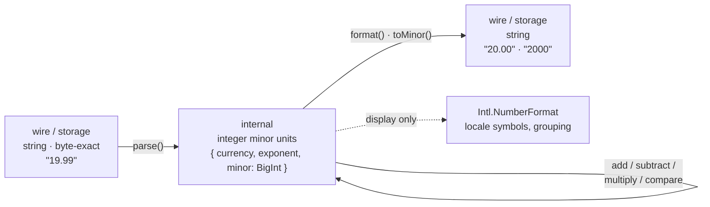

# Money

`0.1 + 0.2 === 0.30000000000000004` — JavaScript numbers are IEEE-754 floats, and float
arithmetic on monetary amounts silently corrupts totals, VAT lines and balances. The
**money module** makes the correct pattern cheap:



Amounts travel as **strings** on the wire (Gina's JSON body parser preserves them
byte-exact — they are never coerced to floats on the way in), live as **integer minor
units** (cents, fils, yen) held in a `BigInt` internally, and only become locale-specific
display through `Intl.NumberFormat`.

The same module is available on both sides:

- **Server** — `var money = require('lib/money');` (bare module, any bundle code) or
  `lib.money` from framework scope.
- **Browser** — `gina.money`, shipped in the Gina client bundle.

## Parsing wire amounts

```js
var money = require('lib/money');

var price = money.parse('19.99', 'EUR');
// { currency: 'EUR', exponent: 2, minor: 1999n }

money.parse('100', 'JPY');     // { currency: 'JPY', exponent: 0, minor: 100n }
money.parse('1.250', 'BHD');   // 3 minor-unit digits — Bahraini dinar
money.parse('-0.05', 'EUR');   // negatives, including sub-unit ones
```

`parse()` is strict on purpose:

```js
money.parse(19.99, 'EUR');    // throws — a number has already lost exactness
money.parse('1.005', 'EUR');  // throws — more digits than EUR's 2: rounding is YOUR decision
money.parse('1,50', 'EUR');   // throws — no locale formats on the wire
```

Whether `1.005` rounds up, down, or banker's is an application decision. Apply your
rounding on minor units first, then build the amount with `fromMinor()`.

## Arithmetic

All arithmetic is exact, and **same-currency only** — a currency mismatch always throws,
because silently adding euros to dollars is precisely the corruption this module exists
to prevent.

```js
var a = money.parse('0.10', 'EUR');
var b = money.parse('0.20', 'EUR');

money.format(money.add(a, b));            // '0.30' — exactly
money.format(money.subtract(a, b));       // '-0.10'
money.format(money.multiply(a, 3));       // '0.30' — integer factors only
money.compare(a, b);                      // -1

money.add(a, money.parse('1', 'USD'));    // throws TypeError: currency mismatch
```

`multiply()` accepts integer factors only (a quantity, a line count). A fractional
factor — a rate, a percentage — needs your own rounding policy, applied on minor units:

```js
// 21% VAT on 19.99 EUR, rounding half-up — the application owns this choice:
var net   = money.parse('19.99', 'EUR');
var vatMinor = (BigInt(money.toMinor(net)) * BigInt(21) + BigInt(50)) / BigInt(100);
var vat   = money.fromMinor(vatMinor, 'EUR');
money.format(vat); // '4.20'
```

Amounts stay exact past `Number.MAX_SAFE_INTEGER` minor units — ledger-scale totals
never collapse the way float math does.

## Serializing back out

```js
money.format(total);   // '20.00' — canonical wire string, exactly the currency's digits
money.toMinor(total);  // '2000' — JSON-safe minor-unit count as a string
```

`format()` is locale-independent — it is for wires, stores and logs. For what a person
sees, use the platform's own formatter with the culture your request negotiated:

```js
new Intl.NumberFormat(req.culture || 'en', { style: 'currency', currency: 'EUR' })
    .format(Number(money.format(total)));   // '€20.00' / '20,00 €' per locale
```

(The `Number()` here is safe for display because display tolerates float precision;
never feed that number back into arithmetic or storage.)

## Currency exponents

The minor-unit exponent comes from ISO 4217 — most currencies use 2, and the module
carries the exceptions internally:

```js
money.exponent('EUR'); // 2
money.exponent('JPY'); // 0 — no minor unit
money.exponent('BHD'); // 3 — fils
money.exponent('CLF'); // 4
money.exponent('EU');  // throws — not a 3-letter code
```

Unlisted well-formed codes resolve to the ISO default of 2.

## In the browser

The identical API ships as `gina.money` — parse user input exactly where it is typed,
without floats ever entering the picture:

```js
// a template handler
var amount;
try {
    amount = gina.money.parse($field.value.replace(',', '.'), 'EUR');
} catch (err) {
    // malformed or over-precise input — surface it to the user
}
// gina.money.format(amount) → the canonical string your API expects
```

## What the module deliberately does not do

| Concern | Owner |
| --- | --- |
| Display formatting (symbols, grouping) | `Intl.NumberFormat` via your negotiated culture |
| Rounding policy | Your application, on minor units |
| Currency conversion | Your application — rates are data |
| Persistence format | Your schema — store `format()` strings or `toMinor()` integers |
