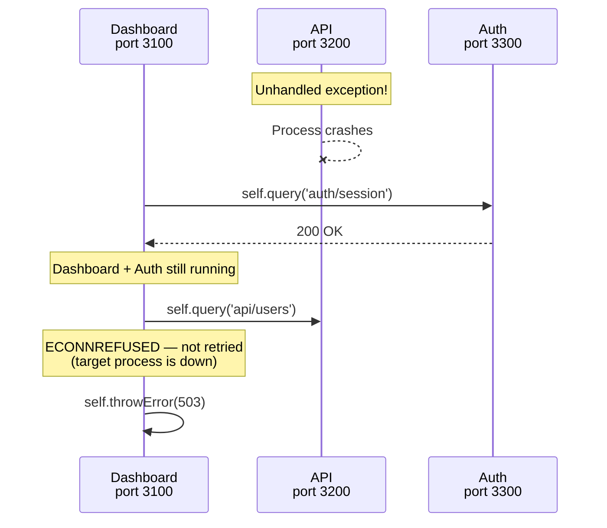

# Multi-Bundle Architecture for Node.js

Most Node.js frameworks run as a single process. All routes, controllers, models,
and middleware share one event loop, one memory space, and one failure domain. When
that process crashes, everything goes down.

Gina structures applications as **bundles** -- independent Node.js processes, each
with its own port, routing table, controllers, models, templates, and lifecycle.
Bundles communicate over HTTP/2 via `self.query()`. This is not a microservices
framework bolted onto Express -- it is the core architectural model.

---

## What is a bundle?

A bundle is a self-contained unit of functionality within a Gina project. Think of
it as a single-purpose service that has everything it needs to handle its domain:

```
project/
  src/
    dashboard/          <-- bundle
      config/
        routing.json
        settings.json
      controllers/
      models/
      views/
    api/                <-- bundle
      config/
        routing.json
        settings.json
      controllers/
      models/
    auth/               <-- bundle
      config/
        routing.json
        settings.json
      controllers/
      models/
```

Each bundle:

- Runs as a **separate OS process** with its own PID
- Listens on its **own port** (auto-assigned or configured)
- Has its **own routing table** (`routing.json`)
- Has its **own controllers, models, and views**
- Can be **started, stopped, and restarted independently**
- Can be **deployed independently** (different containers, different hosts)

---

## How bundles fit into a project

```mermaid
flowchart TD
    subgraph Project["Project: myapp"]
        direction LR
        A["dashboard<br/>port 3100<br/>HTML rendering"]
        B["api<br/>port 3200<br/>JSON API"]
        C["auth<br/>port 3300<br/>Authentication"]
    end

    Browser -->|"HTTP/2"| A
    Mobile -->|"HTTP/2"| B
    A -->|"self.query()<br/>HTTP/2"| B
    A -->|"self.query()<br/>HTTP/2"| C
    B -->|"self.query()<br/>HTTP/2"| C

    style Project fill:#1a1a2e,stroke:#f2af0d
    style A fill:#2a2a3e,stroke:#4caf50
    style B fill:#2a2a3e,stroke:#2196f3
    style C fill:#2a2a3e,stroke:#ff9800
```



A **project** is the container. It holds one or more bundles and defines shared
configuration (environments, scopes, connectors). Bundles within a project can
call each other, share database connectors, and participate in the same deployment
pipeline.

---

## Creating bundles

```bash
# Create the project
gina project:add @myapp --path=/path/to/myapp

# Add bundles
gina bundle:add dashboard @myapp
gina bundle:add api @myapp
gina bundle:add auth @myapp

# Start them independently
gina bundle:start dashboard @myapp
gina bundle:start api @myapp
gina bundle:start auth @myapp
```

Each `bundle:start` spawns a separate Node.js process. Ports are auto-assigned
from a pool managed by `ports.json`, or you can configure them explicitly in the
bundle's `settings.json`.

---

## Inter-bundle communication

Bundles call each other using `self.query()` inside controller actions. The call
travels over HTTP/2 with automatic session caching, multiplexing, and retry:

```javascript
// In dashboard/controllers/controller.content.js
var self = this;

this.home = function(req, res, next) {

    self.query('api/users/current', function(err, userData) {
        if (err) return self.throwError(err);

        self.query('api/notifications', function(err, notifications) {
            if (err) return self.throwError(err);

            self.render({
                user          : userData
              , notifications : notifications
            });
        });
    });
};
```

:::info
`self.query()` uses the same HTTP/2 session cache and resilience layers described
in [HTTP/2 Resilience](/guides/http2-resilience) -- pre-flight PING validation,
retry with backoff, and automatic dead-session eviction.
:::

### What travels between bundles

When bundle A calls bundle B, the response includes:

| Data | Purpose |
|---|---|
| Response body | The primary data (JSON or rendered HTML) |
| `__ginaQueries` (dev mode) | Database queries executed by B, for the [Inspector](/guides/inspector) Query tab |
| `__ginaFlow` (dev mode) | Timeline entries from B, for the Inspector Flow tab |

This means the Inspector can show a **full-page view** of all database queries and
timing across every bundle involved in rendering a single page.

---

## Fault isolation

Because each bundle is a separate OS process, a crash in one bundle does not affect
others:



The dashboard continues serving requests. The `self.query()` call to the crashed
API bundle receives an `ECONNREFUSED` error, which Gina does not retry (the target
process is down, not experiencing a transient network issue). The dashboard's
controller can handle this gracefully -- show a degraded page, return cached data,
or display an error message.

---

## Independent scaling

Bundles can be scaled independently based on their resource requirements:

| Bundle | Role | Scaling strategy |
|---|---|---|
| `dashboard` | HTML rendering, template compilation | Scale by CPU (template compilation is CPU-bound) |
| `api` | JSON endpoints, database queries | Scale by connection count (I/O-bound) |
| `auth` | Session validation, token verification | Low traffic, single replica often sufficient |

In Kubernetes, each bundle is a separate Deployment with its own replica count,
resource limits, and HPA (Horizontal Pod Autoscaler) policy:

```yaml
# k8s/api-deployment.yaml
apiVersion: apps/v1
kind: Deployment
metadata:
  name: myapp-api
spec:
  replicas: 3
  template:
    spec:
      containers:
        - name: api
          image: myapp:latest
          command: ["node", "bin/gina-container"]
          env:
            - name: GINA_BUNDLE
              value: "api"
            - name: GINA_PROJECT
              value: "@myapp"
```

See [K8s and Docker](/guides/k8s-docker) for the full container deployment guide.

---

## Scope-based data isolation

Each bundle inherits the project's scope configuration. Scopes (`local`, `beta`,
`production`) control which data partition a bundle reads and writes:

```mermaid
flowchart TD
    subgraph Scopes
        direction LR
        L["local<br/>(dev)"]
        B["beta<br/>(staging)"]
        P["production<br/>(live)"]
    end

    subgraph DB["Couchbase Cluster"]
        DL["Documents where<br/>_scope = 'local'"]
        DB2["Documents where<br/>_scope = 'beta'"]
        DP["Documents where<br/>_scope = 'production'"]
    end

    L --> DL
    B --> DB2
    P --> DP

    style Scopes fill:#1a1a2e,stroke:#f2af0d
    style DB fill:#2a2a3e,stroke:#666
```



The scope is set per environment in `env.json` and injected into every database
query via `$scope` substitution. A developer running bundles locally with
`scope: "local"` cannot accidentally read or write production data -- the connector
enforces it at the query level.

See [Scopes](/concepts/scopes) and [Environments](/concepts/environments) for details.

---

## Comparison with monolith patterns

| Aspect | Single Express process | Gina multi-bundle |
|---|---|---|
| Process model | One process, all routes | One process per bundle |
| Crash impact | Entire application | Only the affected bundle |
| Deployment | All-or-nothing | Per-bundle |
| Scaling | Uniform (scale the whole app) | Per-bundle (scale what needs it) |
| Port allocation | One port | One port per bundle (auto-managed) |
| Routing | Global middleware stack | Per-bundle `routing.json` |
| Database isolation | Manual (shared connection pool) | Per-bundle scope, enforced by connector |
| Dev tools | Per-process logging | Per-bundle Inspector with cross-bundle query tracing |
| Code organization | Developer decides | Convention: `src/{bundle}/config|controllers|models|views` |

---

## When to use multiple bundles

Not every application needs multiple bundles. Guidelines:

**Single bundle is fine when:**
- Small application with a handful of routes
- All routes share the same authentication and authorization model
- No need for independent scaling or deployment

**Multiple bundles make sense when:**
- Different parts of the application have different scaling needs
- You want fault isolation between services
- Different teams own different parts of the application
- You need to deploy backend API and frontend rendering independently
- You want per-service database scope isolation

:::tip
Start with one bundle. Split into multiple bundles when you have a concrete reason --
not preemptively. Gina makes it easy to extract a set of routes and controllers into
a new bundle later.
:::

---

## Further reading

- [Projects and bundles](/concepts/projects-and-bundles) -- detailed project/bundle model
- [Environments](/concepts/environments) -- env configuration across bundles
- [Scopes](/concepts/scopes) -- data isolation model
- [K8s and Docker](/guides/k8s-docker) -- deploying bundles as containers
- [HTTP/2 Resilience](/guides/http2-resilience) -- inter-bundle communication hardening
- [Inspector](/guides/inspector) -- cross-bundle query and flow instrumentation
