# Node.js MVC Without Express

Express is the de facto HTTP framework for Node.js. It is minimal, flexible, and
has a massive ecosystem. But "minimal and flexible" also means that every project
must make hundreds of small decisions: directory structure, routing patterns,
controller organization, error handling, middleware ordering, view engine setup.

Gina takes the opposite approach. It is an opinionated MVC framework that provides
**conventions for all of these decisions out of the box** -- without depending on
Express at all. Routing is declarative. Controllers follow a naming convention.
Middleware is per-route, not per-app. The built-in HTTP server (Isaac) speaks
HTTP/2 natively.

---

## Architecture comparison

```mermaid
flowchart TD
    subgraph Express["Typical Express App"]
        direction TB
        E1[app.js<br/>manual setup] --> E2[express.Router]
        E2 --> E3[app.use middleware stack]
        E3 --> E4[route handler function]
        E4 --> E5[res.render / res.json]
    end

    subgraph Gina["Gina MVC"]
        direction TB
        G1[routing.json<br/>declarative] --> G2[Router<br/>convention-based]
        G2 --> G3[Controller<br/>auto-loaded]
        G3 --> G4[self.render / self.renderJSON]
    end

    style Express fill:#2a2a2a,stroke:#666
    style Gina fill:#1a1a2e,stroke:#f2af0d
```



---

## Declarative routing

In Express, routes are defined in code, scattered across files, and the order they
are registered matters:

```javascript
// Express — imperative, order-dependent
app.get('/users/:id', authenticate, getUser);
app.get('/users', authenticate, listUsers);
app.post('/users', authenticate, validateBody, createUser);
```

In Gina, routes are declared in a single `routing.json` file:

```json
{
  "getUser": {
    "url": "/users/:id",
    "method": "GET",
    "namespace": "user",
    "param": { "control": "show", "id": ":id" },
    "middleware": ["authenticate"]
  },
  "listUsers": {
    "url": "/users",
    "method": "GET",
    "namespace": "user",
    "param": { "control": "list" },
    "middleware": ["authenticate"]
  },
  "createUser": {
    "url": "/users",
    "method": "POST",
    "namespace": "user",
    "param": { "control": "create" },
    "middleware": ["authenticate", "validateBody"]
  }
}
```

**Benefits of declarative routing:**

| Aspect | Express | Gina |
|---|---|---|
| Route overview | Scattered across files; use `express-list-routes` | Single JSON file |
| Order sensitivity | Registration order matters — wrong order = wrong match | Router evaluates all rules; no order dependency |
| Middleware per route | Inline in each route definition | Explicit `middleware` array per rule |
| Route naming | Optional, rarely used | Every route has a name (the JSON key) |
| URL generation | Manual string concatenation | `getRoute('routeName')` |

:::info
The `routing.json` file is the single source of truth for all URL patterns in a
bundle. The [Inspector](/guides/inspector) Data tab shows the matched route rule
for every request, making it easy to debug routing issues without reading code.
:::

---

## Convention-based controllers

Express routes point to arbitrary handler functions. Gina routes point to
**controller actions** using a `namespace` + `param.control` convention:

```json
{
  "namespace": "user",
  "param": { "control": "show" }
}
```

`namespace` maps to `controllers/controller.user.js`, and `param.control` maps to the method `this.show`:

```javascript
// controllers/controller.user.js
function UserController() {
    var self = this;

    this.show = function(req, res, next) {
        var userId = req.routing.param.id;
        // ... fetch user, render response
        self.render({ user: user });
    };

    this.list = function(req, res, next) {
        // ... fetch users
        self.render({ users: users });
    };
}

module.exports = UserController;
```

**What this gives you:**

- **Predictable file locations** -- given a route rule, you know exactly which file
  and method handles it
- **Automatic loading** -- controllers are loaded by convention, not by manual
  `require()` calls
- **Per-request isolation** -- each request gets a fresh controller instance with its
  own `local` closure (no shared state between concurrent requests)
- **Built-in rendering** -- `self.render()` for HTML ([Swig templates](/templating/swig)),
  `self.renderJSON()` for JSON, `self.renderStream()` for SSE

---

## Per-route middleware (no ordering bugs)

Express middleware runs in registration order. A common source of bugs:

```javascript
// Express — ordering matters
app.use(bodyParser.json());     // Must come before routes
app.use(cookieParser());        // Must come before session
app.use(session({ ... }));      // Must come before auth
app.use(authenticate);          // Runs on EVERY route — even public ones

app.get('/public', publicHandler);  // authenticate runs here too
```

In Gina, middleware is declared per-route in `routing.json`. There is no global
middleware stack. Each route explicitly lists the middleware it needs:

```json
{
  "publicPage": {
    "url": "/public",
    "namespace": "content",
    "param": { "control": "public" }
  },
  "dashboard": {
    "url": "/dashboard",
    "namespace": "content",
    "param": { "control": "dashboard" },
    "middleware": ["authenticate", "loadUserPrefs"]
  }
}
```

The public page has no middleware. The dashboard has exactly two. There is no
way for middleware to accidentally apply to the wrong route, and there is no
ordering ambiguity.

```mermaid
flowchart LR
    subgraph Public["GET /public"]
        P1[Router] --> P2[content#public]
    end

    subgraph Dashboard["GET /dashboard"]
        D1[Router] --> D2[authenticate] --> D3[loadUserPrefs] --> D4[content#dashboard]
    end

    style Public fill:#1a1a2e,stroke:#4caf50
    style Dashboard fill:#1a1a2e,stroke:#f2af0d
```



---

## What you get without Express

By not depending on Express, Gina can provide capabilities that are difficult or
impossible to retrofit:

### Native HTTP/2

The Isaac engine uses `node:http2` directly. HTTP/2 multiplexing, server push, ALPN
negotiation, and 103 Early Hints all work without adapters. See
[Native HTTP/2](/guides/http2-native).

### Multi-bundle process isolation

Each bundle runs as an independent Node.js process. One bundle crashing does not
take down others. Bundles communicate over HTTP/2 via `self.query()`. See
[Multi-bundle architecture](/guides/multi-bundle).

### Scope-based data isolation

Data is isolated by scope (`local`, `beta`, `production`) at the framework level.
N1QL queries automatically include `$scope` filters. This is enforced by the
connector, not by middleware.

### Dev-mode Inspector

The built-in [Inspector](/guides/inspector) provides real-time query instrumentation,
log streaming, request flow waterfalls, and DOM inspection -- all without installing
any additional packages.

### Smaller footprint

A Gina bundle has zero npm runtime dependencies beyond what ships with the framework.
No `express`, no `body-parser`, no `cookie-parser`, no `express-session`. The
framework handles all of this internally.

---

## The Express compatibility layer

For projects that need specific Express middleware (e.g., Passport, Multer, or a
custom company middleware library), Gina provides an optional Express adapter
(`server.express.js`). This wraps an Express app inside Gina's lifecycle:

- Gina's routing still applies
- Gina's controller convention still applies
- Express middleware can be mounted via the bundle's `setup.js`
- HTTP/2 is not available through the Express adapter (Express does not support it natively)

:::tip
Start new projects with Isaac (the default). Only switch to the Express adapter if
you have a hard dependency on a specific Express middleware package that cannot be
reimplemented as a Gina middleware function.
:::

---

## Side-by-side: Express app vs Gina bundle

| Concern | Express | Gina |
|---|---|---|
| Project structure | Developer decides | Convention: `config/`, `controllers/`, `models/`, `views/` |
| Routing | Code-based, order-sensitive | `routing.json`, order-independent |
| Controllers | Arbitrary handler functions | `controller.{name}.js` with named actions |
| Middleware | Global stack + per-route inline | Per-route in `routing.json` |
| View engine | Manual setup (`app.set('view engine', ...)`) | Built-in Swig, configured in `settings.json` |
| JSON responses | `res.json()` | `self.renderJSON()` |
| Streaming / SSE | Manual `res.write()` | `self.renderStream()` |
| HTTP/2 | Adapter required | Native (Isaac) |
| Process model | Single process | Multi-bundle (one process per bundle) |
| Dev tools | Third-party (Morgan, debug, etc.) | Built-in Inspector, logger, hot-reload |
| Database ORM | Sequelize, Mongoose, etc. (separate install) | Built-in entity system with connectors |

---

## Migrating from Express

If you have an existing Express application, you can migrate incrementally:

1. **Start with the Express adapter** -- mount your existing Express middleware in
   `setup.js` and convert routes to `routing.json` one at a time
2. **Convert controllers** -- move handler functions into `controller.{name}.js` files
   following Gina's naming convention
3. **Replace middleware** -- convert Express middleware to Gina middleware functions
   (same `(req, res, next)` signature)
4. **Switch to Isaac** -- once all Express-specific middleware is removed, switch the
   engine to Isaac for HTTP/2 support

See the [middleware guide](/guides/middleware) for details on writing Gina middleware.

---

## Further reading

- [Routing guide](/guides/routing) -- full `routing.json` reference and patterns
- [Controller guide](/guides/controller) -- action methods, rendering, error handling
- [Middleware guide](/guides/middleware) -- writing and configuring per-route middleware
- [Architecture](/concepts/architecture) -- how Gina's components fit together
- [Native HTTP/2](/guides/http2-native) -- Isaac engine deep dive
