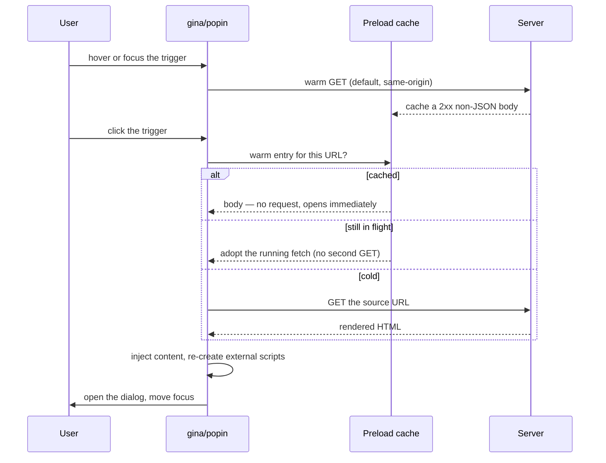

# Popins and dialogs

A **popin** is server-rendered content shown in a native `<dialog>` element. You
mark a trigger with one attribute, and Gina fetches the content, injects it,
opens the dialog, and manages focus, loading state and teardown.

The content is a normal route rendering normal templates — the server stays the
source of truth, the markup is what a designer edits, and nothing is duplicated
client-side.

:::caution The attribute you may have seen is the old one
`data-gina-popin-name` and `data-gina-popin-url` are **deprecated**. They still
work — Gina maps them onto the current path — but each emits a one-time console
warning, and they behave differently in ways that matter. The current attributes
are `data-gina-dialog` and `data-gina-dialog-src`. See
[Migrating from the legacy attributes](#migrating-from-the-legacy-attributes).
:::

---

## Quick start

**In-page dialog** — the content is already in the document:

```html
<a href="#terms" data-gina-dialog="terms">Read the terms</a>

<dialog id="terms">
  <button class="gina-popin-close">Close</button>
  <h2>Terms</h2>
  <p>…</p>
</dialog>
```

**AJAX dialog** — the content comes from a route:

```html
<a href="/terms" data-gina-dialog="terms" data-gina-dialog-src="/terms">
  Read the terms
</a>
```

The `href` is a real URL, so the link keeps working without JavaScript, in a new
tab, and for crawlers — Gina intercepts the plain left-click only. Close controls
are any element carrying the `gina-popin-close` class.

**No bundle code is required.** The declarative `data-gina-dialog` API boots
itself once the framework has loaded.

## How an open works



## Attribute reference

Two families, and the distinction matters: some attributes **you author**, and
some **Gina writes** for you to style or inspect. Never author the second group.

### Attributes you author

| Attribute | Value | Effect |
|---|---|---|
| `data-gina-dialog` | the dialog's `id` | Opens that dialog |
| `data-gina-dialog-src` | a URL | Loads the content from that route over AJAX. Valid on its own, without `data-gina-dialog` |
| `data-gina-dialog-target` | a CSS selector | **Partial swap** — replaces only that region's contents, so chrome (close button, header, footer) and its bindings survive |
| `data-gina-dialog-modal` | `"false"` ⇒ non-modal; **any** other value ⇒ modal | Overrides the modal mode for this trigger |
| `data-gina-dialog-preload` | `"false"` or `"eager"` | Controls prefetching — see [Preloading](#preloading) |

On an `<a>`, the `href` doubles as the source URL, so `data-gina-dialog-src` can
be omitted (an empty `href`, `#`, or one starting with `#` is ignored).

:::warning These two parse `"false"` differently
`data-gina-dialog-modal` compares **case-sensitively** — `"False"` is not
`"false"`, so it gives you a *modal* dialog. `data-gina-dialog-preload` matches
case-**insensitively**, deliberately, so a templated `"False"` cannot silently
fail open. Same-looking value, opposite parsing.
:::

### Attributes Gina writes

| Attribute | Where | Meaning |
|---|---|---|
| `data-gina-loading` | trigger | A request from this control is in flight |
| `data-gina-popin-loading` | container, then the dialog | This popin is filling |
| `data-gina-popin-is-link` | links inside popin content | Engine bookkeeping for link handling |
| `data-gina-popin-inert` | sibling dialogs | Marks the `inert` Gina added, so teardown removes only its own |
| `data-gina-popin-scroll-lock` | `<body>` | Non-modal scroll lock |

Gina also manages `aria-haspopup`, `aria-controls`, `aria-labelledby`,
`aria-disabled`, `inert` and `tabindex` on the elements it owns.

## Modal and non-modal

A modal dialog (`showModal()`) gets Escape-to-close, an inert background, a focus
trap and a scroll block from the browser. A non-modal dialog (`show()`) gets none
of those, so Gina supplies equivalents itself.

**Declarative `data-gina-dialog` triggers default to non-modal.** The mode is
resolved by this precedence, highest first:

1. A **legacy trigger** (`data-gina-popin-name`) — always modal, not overridable.
2. `data-gina-dialog-modal` on the trigger.
3. The per-popin constructor option, `new Popin({ modal: true })`.
4. `gina.config.popin.modal`.
5. The framework default — **non-modal**.

:::caution `gina.config.popin.modal` is not a global switch
That chain runs only for declarative triggers. Anything that opens a popin
another way — a legacy trigger, or a direct `gina.popin.open(name)` call —
**falls back to modal** regardless of your config. Setting it to `false` will not
make a programmatic open non-modal.
:::

Because non-modal is the default for the current API, opening a popin does **not**
close the one it supersedes: both stay in the page. Gina inerts sibling dialogs
that are still open so only the topmost is reachable, leaves already-closed ones
alone (the browser hides those anyway), and on teardown restores exactly what it
marked — an `inert` your own code set is never claimed or cleared.

## Preloading

**Hover and focus preloading is on by default** for every trigger with a source
URL. A click that arrives while a warm request is still running **adopts** it
instead of issuing a second identical `GET`.

| Value | Behaviour |
|---|---|
| *(absent)* | Warm on hover or focus — the default |
| `"eager"` | Also warm at browser idle after `window` load, one trigger at a time. Skipped when the browser signals Save-Data |
| `"false"` | Never warm, and never serve from a cache entry — a **hard always-refetch guarantee** |

Warm requests are same-origin only, sent without credentials, and only a `2xx`
non-JSON body is cached — a JSON redirect envelope is left for the click to
handle. A cache entry never outlives the open it warmed, so reopening fetches
current content rather than replaying the previous body.

:::warning Preload turns a hover into a GET
The warm is a real request, fired before any click. If a URL has server-side
effects, mark its trigger `data-gina-dialog-preload="false"`. This matters most
for triggers built at render time from stored data — those are invisible to a
template grep, so an audit that only reads templates will miss them.
:::

## Partial swaps

`data-gina-dialog-target` takes a CSS selector. Gina parses the response, finds
the matching region in it, and replaces **the contents of** the matching element
in the open dialog — the element itself survives, which is what preserves chrome
and its event bindings.

The selector is applied on **both** sides — it finds the region in the response
*and* the slot in the open dialog — so there are two ways it can miss, and each
has its own fallback:

- **Nothing matches in the open dialog** — including a selector the browser
  refuses as malformed — and the whole dialog is replaced, as if no target had
  been given.
- **Nothing matches in the response** and the whole response body goes into the
  slot.

Both fallbacks are deliberate: a popin open is a read the user can retry, so
working-but-wrong beats refusing. Neither is visible from the outside, so each
one now **logs a console warning in dev mode**, naming the popin, the selector
and which fallback ran. Production stays silent.

**It applies to the current API only.** A *pure* legacy trigger — one carrying
`data-gina-popin-name` / `data-gina-popin-url` and **neither**
`data-gina-dialog` nor `data-gina-dialog-src` — keeps its own open path and does
a full replace. A mixed trigger, one given `data-gina-dialog-src` alongside the
legacy attributes, goes through the current path and **does** get the partial
swap.

:::note How this compares to the form attributes
`data-gina-dialog-target` is the dialog-scoped sibling of
[`data-gina-form-select`](/guides/forms-and-validation#swapping-the-answer-into-the-page),
not of `data-gina-form-target`: it is **one plain selector applied on both
sides**, and there is nothing here to resolve relative to an element, so the
`this` / `closest x` / `find x` / `next x` grammar a form target accepts does not
apply here. All four spellings happen to be valid CSS in their own right, so
writing one here matches nothing and takes the fallback above rather than
reporting a mistake.

The form attributes also behave the opposite way on a miss: they **refuse the
submit** when the target cannot be resolved, instead of falling back. The
difference is deliberate — a popin open is a read the user can retry, while a
submit has already changed something on the server, and there
working-but-wrong is the worse outcome.
:::

## What happens to the content

Injected popin content follows the same contract as any HTML inserted through
`innerHTML`:

- **External scripts and stylesheets are re-created** in `<head>`, with a dedup
  guard against the resources the host page already had, so a fragment may safely
  re-declare the page's bundles. This is why
  [client components](/guides/client-components) work inside popins with no
  rebinding. The guard is a snapshot taken when the popin is registered, so a
  resource added to the page *after* that point will be re-injected.
- **Inline scripts never execute.** Anything a popin needs must be a `src`-bearing
  script or already present on the page.
- **Closing tears down.** Injected scripts and stylesheets are removed, AJAX
  content is wiped, focus returns to the trigger, and components'
  `disconnectedCallback` fires. An in-page dialog keeps its authored content.
  Reopening an AJAX popin refetches.

### Forms inside popins

Form binding is **not automatic** — it happens when the popin was constructed
with a validator instance:

```js
new Popin({ name: 'signup', validator: gina.validator });
```

With one, each form in the content is bound through
[validation](/guides/forms-and-validation) and gains a `close` method. Because a
form in a modal popin lives inside a `showModal()` dialog — where everything
outside is inert — its validation live region stays inside the form itself.

A contained form's `text/html` answer replaces **this popin's** content — the
popin is chosen by containment, not by whichever one happens to be open. A form
that declares its own
[`data-gina-form-target`](/guides/forms-and-validation#swapping-the-answer-into-the-page)
overrides that: the answer goes to the declared element, inside the popin or
outside it, and the popin's content is left alone. The same containment rule
places a contained form's
[staged uploads](/guides/file-uploads#the-client-upload-layer): the virtual
upload form and its staging request belong to the popin the real form is inside,
and a page form's upload stays with the page whatever popins are open.

An element of the answer carrying
[`data-gina-swap-oob`](/guides/forms-and-validation#out-of-band-swaps) updates the
page **behind** the dialog, wherever the rest of the answer goes. If the answer
held nothing else, the dialog keeps its own content rather than being blanked.

## Loading state

While a popin loads, the trigger carries a loading attribute and the container
carries `data-gina-popin-loading`. They sit on different elements and answer
different questions: the container one says *this popin is filling*, the trigger
one says *this control is busy*.

:::caution Match the value, not the presence
The trigger attribute is never removed — it is set back to `"false"`. Style
`[data-gina-loading="true"]`; a bare `[data-gina-loading]` also matches a
released trigger and pins the busy style on permanently. Its name is
configurable through `gina.config.loadingAttribute`, so read that rather than
hard-coding the literal if your project renames it.
:::

Two more details worth knowing:

- `data-gina-popin-loading` lands on the shared container for the first load, and
  on the dialog element for every load after the first open. Write CSS that
  covers both.
- An open served entirely from a warm cache issues no request, so it sets
  **neither** attribute. That is expected, not a bug — there is nothing to wait
  for.

Gina ships a default look (a `progress` cursor and an opacity pulse, the pulse
gated on `prefers-reduced-motion`) which you can replace entirely. For a popin
that should appear instantly and fill afterwards, construct it with
`preOpen: true` and optionally your own `loadingShell` markup.

A pre-opened popin is in an explicit **loading state** — `isLoading` is `true` on the
popin object — from the moment its shell shows until its content lands and the real
open runs (`isOpen` stays `false` until then). While it loads, `close()` and `destroy()`
cancel the load and take the shell down: the content still in flight is dropped, a
transport still in flight is aborted without firing `error`, and a dismissed dialog never
comes back when its answer arrives. A native Escape on the shell takes the same path. If
the load fails, `error` fires first — a listener that calls `loadContent()` on the popin
keeps the dialog open with its own content — and the shell closes if nothing handled it,
so a failed load never leaves a spinner behind. A popin without `preOpen` shows nothing
while it loads and never enters the state.

## The `gina.popin` API

```js
gina.popin.open(name);              // opens MODAL — see the caution above
gina.popin.close(name);
gina.popin.load(name, url, options);
gina.popin.loadContent(html);       // inject content you already have (into the active popin)
gina.popin.getActivePopin();        // the most recently opened OPEN popin, or null
gina.popin.getPopinContaining(el);  // the popin whose dialog contains el, or null
gina.popin.getPopinByName(name);
gina.popin.getPopinById(id);
gina.popin.destroy(name);
```

The registry is shared across every popin instance, so a form in one popin can
redirect into another. `gina.popin.activePopinId` and `gina.popin.$popins` expose
the live state, and each popin object carries `isOpen` and — for a `preOpen: true`
popin — `isLoading` (see [Loading state](#loading-state)).

`open()` throws if the name is unknown, `loadContent()` throws if the popin is
neither open nor loading, and `load()` throws if the name cannot be resolved — so
guard calls whose names come from data. Called on a popin instance —
`gina.popin.getPopinByName('details').loadContent(html)` — `loadContent()` loads
into **that** popin; called on `gina.popin` itself it loads into the active one.
Called on a popin that is still **loading**, it injects into the shell and completes
the open — `open` fires once, from that completion — and the content still in flight
lands afterwards as any later `loadContent()` would. `gina.popin.loadContent(html)`
reaches open popins only, since a loading popin is not the active one.

`getActivePopin()` returns **open** popins only: with two open it returns the most
recently opened one, and a popin that is registered but not yet open — during its
own click-time load, for instance — is never returned. Prefer looking a popin up
by name when you know which one you mean, and `getPopinContaining(el)` when what
you know is an element inside it — that is how the validator decides where a
form's HTML answer goes (see [Reacting to the result](/guides/forms-and-validation#html-answers-and-popins)).

**Events**, observable with `gina.popin.on('<event>', handler)`:

| Event | Payload |
|---|---|
| `ready` | the popin |
| `open` | the popin |
| `close` | the popin |
| `loaded` | the response body |
| `error` | `{ status, error }` |
| `destroy` | `{ name, id }` |

:::note Three names that do not fire
`success`, `progress` and `click` exist in the internal event registry but no
current code path delivers them — do not subscribe to them expecting callbacks.
Use `loaded` for content arrival and `error` for failures.
:::

## Migrating from the legacy attributes

| Legacy (deprecated) | Current |
|---|---|
| `data-gina-popin-name="X"` | `data-gina-dialog="X"` |
| `data-gina-popin-url="/u"` | `data-gina-dialog-src="/u"` |

Both still work and emit one console warning each per page. Three differences
matter when you convert:

- **Modal mode.** A legacy trigger is always modal; the current API defaults to
  non-modal. If you rely on modal behaviour, add `data-gina-dialog-modal` when
  you convert.
- **Partial swaps.** `data-gina-dialog-target` has no effect on a *pure* legacy
  trigger — one carrying neither `data-gina-dialog` nor `data-gina-dialog-src`.
  Adding `data-gina-dialog-src` moves the trigger onto the current open path,
  and the partial swap starts working.
- **Setup.** Legacy triggers only work when your code constructs the matching
  popin (`new Popin({ name: '…' })`); the current API needs no setup at all.

Only those two attributes are deprecated. `data-gina-popin-loading` and
`data-gina-popin-is-link` are written by Gina, are current, and never warn — keep
styling `data-gina-popin-loading` as you do today.

:::caution Picking this up needs a bundle rebuild
The popin plugin ships inside each bundle's browser bundle. Upgrading the
framework updates the server half only — run `gina bundle:build` for plugin
changes to reach your pages.
:::

## Related

- [Client-Side Components](/guides/client-components) — widgets that upgrade
  automatically inside popin content and tear down on close.
- [SPA Navigation](/guides/client-navigation) — whole-page fragment navigation;
  it defers to popin-owned triggers and closes an open popin on swap.
- [Forms and Validation](/guides/forms-and-validation) — the submit lifecycle and
  loading state that forms inside popins participate in.
- [Controllers](/guides/controller) — `renderWithoutLayout()` for the layoutless
  fragments popins usually load.
