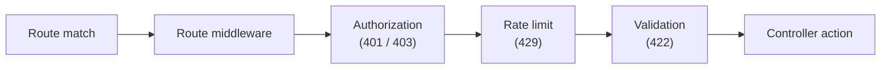

# Rate limiting

Gina ships an opt-in **quota gate** for callers it can identify: signed-in
session users and machine callers. Each identified principal gets a fixed
number of requests per time window, counted in a [key-value namespace](/guides/kv)
you declare — which is what makes the quota **replica-shared** when the
namespace is backed by redis or SQLite, or per-process when it is in-memory.

:::note Quotas, not flood control
This gate deliberately does **not** throttle anonymous traffic. A request with
no resolvable principal is skipped, never bucketed: keying unknown callers by
IP is dishonest behind a reverse proxy (every connection arrives from the
proxy's address, so one bucket would cover the whole internet). Anonymous
flood control belongs at your edge — nginx `limit_req`, your ingress
controller — and at the transport layer, where Gina's HTTP/2 rapid-reset guard
already operates. This division of labor is by design: the edge limits by
connection, Gina limits by identity.
:::

## Where the gate runs



The gate runs **after route authorization** — authorization is what resolves
the principal, so the limiter knows who is calling — and **before the
validation tier** ([message validation](/guides/message-validation) when a route
declares it, then [DTO field validation](/guides/dtos)), so a throttled caller
never receives a validation report (the same
disclosure ordering that puts the `401` above the `422`). Static assets and
`/_gina/*` endpoints never reach this band, so health checks and metrics are
unthrottled by construction.

## Enabling it

Declare a KV namespace for the counters, then arm the gate — both in
`settings.json`:

```jsonc
{
    "kv": {
        "namespaces": {
            // give the limiter its OWN namespace: its failMode is then
            // unambiguously the limiter's outage policy (see below)
            "quota": { "store": "kvstore", "failMode": "open" }
        }
    },
    "server": {
        "rateLimit": {
            "enabled"   : true,
            "namespace" : "quota",
            "keyField"  : "id",     // the session.user property that identifies a caller
            "limit"     : 100,      // requests per principal...
            "window"    : "1m"      // ...per window ("30s", "1m", or milliseconds)
        }
    }
}
```

All five keys are required when `enabled` is `true`, and a structurally
invalid value **refuses the boot** — the gate never silently runs without the
policy you asked for, and never silently disables itself. Changes need a
bundle restart (the policy is resolved once at engine start). `env.json`
`server.rateLimit` keys win over `settings.json` at the fold, like every other
`server.*` block.

### Who gets counted, and how

| Caller | Key | Notes |
|---|---|---|
| Session user | `u:<session.user[keyField]>` | You name the field (`keyField`) because the session user is your application's shape — Gina never guesses. A user record where the field is absent or empty is *unidentified*, and skipped. |
| Machine caller | `m:<name>` | Automatic — [machine callers](/guides/authentication) carry a registered name. |
| Anonymous | — | Skipped. Your edge owns this class. |

A signed-in session wins over a presented machine credential, mirroring the
authorization gate's own precedence.

### Choosing the backend is choosing the scope

The namespace's backend decides what "100 requests per minute" means:

| Backend | Quota scope |
|---|---|
| in-memory (no `store`) | **Per process** — every replica grants the full quota again. Fine for a single process; the boot resolver warns otherwise. |
| `sqlite` | Shared across processes on one host. |
| `redis` | Shared across every replica — the multi-pod shape. |

:::caution redis tuning is load-bearing
For a redis-backed namespace, set `"enableOfflineQueue": false` and a
`"commandTimeout"` on the `connectors.json` entry. With the driver's defaults,
a redis outage **queues** every gated request instead of erroring — neither
failure mode ever fires, and requests hang until the connection returns. With
the fail-fast pair in place, an outage degrades exactly as the `failMode`
below describes. The boot resolver warns when the pair is missing.
:::

## What a limited caller sees

Allowed requests on limited routes carry the current standing, using the
structured fields from
[draft-ietf-httpapi-ratelimit-headers](https://datatracker.ietf.org/doc/draft-ietf-httpapi-ratelimit-headers/)
(revision 11):

```
RateLimit-Policy: "default";q=100;w=60
RateLimit: "default";r=42
```

A denial answers **`429 Too many requests`** with a deliberately generic body
— the machine-readable detail rides the headers:

```
Retry-After: 17
RateLimit: "default";r=0;t=17
RateLimit-Policy: "default";q=100;w=60
```

`Retry-After` is derived from the counter's actual remaining window, and takes
precedence for clients that honor both (the draft requires it). The header
fields are an IETF **draft**: the shapes above are revision 11's and may evolve
with the specification until it becomes an RFC.

## Per-route overrides

Routes inherit the default policy. A route can opt out, or replace it —
top-level in `routing.json`, next to `middleware` and `requirements`:

```jsonc
{
    "status-poll@api": {
        "url": "/status",
        "rateLimit": false          // exempt — polled at high frequency by design
    },
    "report-export@api": {
        "url": "/reports/export",
        "rateLimit": { "limit": 5, "window": "1h" }   // its own, tighter budget
    }
}
```

An override **replaces** the default for that route: its requests count in
their own bucket, not against the global one. A partial object inherits the
missing key from the default. Malformed shapes refuse the boot — a typo
surfaces at deploy, never at the first throttled request.

## When the counter store is down

The namespace's own `failMode` is the limiter's outage policy — one knob, no
contradiction possible when the limiter has its own namespace:

| `failMode` | Behaviour during an outage |
|---|---|
| `"open"` | Requests are **admitted**, without rate-limit headers (there is no honest reading to report), with a warning per degraded operation. Availability-first — the usual choice for a quota. |
| `"closed"` | Requests are answered **`503`** with `Retry-After` — never `429`, because the caller is *not* over quota; the service simply cannot account. Enforcement-first. |

Either way the request always gets an answer: the gate owns every outcome of
the store call, so a backend failure can never leave a request hanging.

## Scaling notes

- **K8s / multi-replica:** use a redis-backed namespace (with the fail-fast
  tuning above) so all replicas share one quota — the same
  [stateless-service checklist](/guides/k8s-docker) item as sessions and the
  render cache.
- **Cost when off:** the feature is dormant unless `enabled` is strictly
  `true` — a disabled bundle runs the dispatch band exactly as before, with no
  store round-trips and no promise overhead.
- **Cost when on:** one KV `incr` per identified request; denials pay one
  extra `ttl` read to price the `Retry-After` honestly. Unidentified and
  exempt requests pay nothing.
