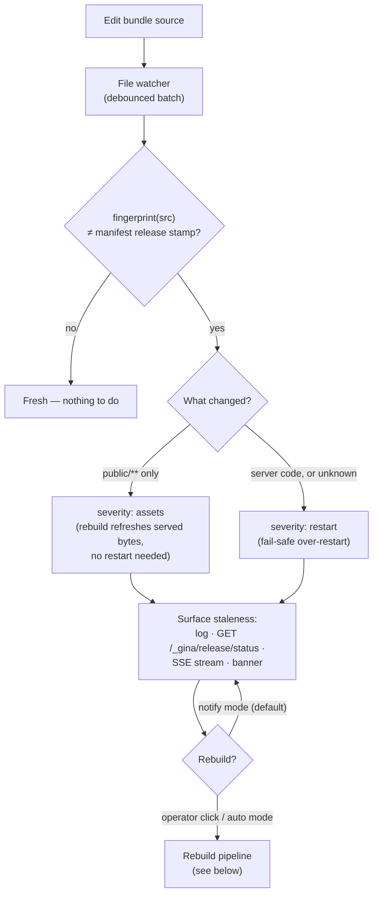
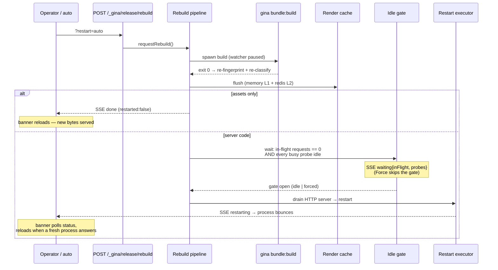

# Release Watch — Stale-Build Detection

When you run a **built release** under `local` scope and a **non-dev env** — a
*local production rehearsal* — the bundle serves the compiled release exactly
as it would in production: no `refreshCore`, no dev-mode file watcher, the
render cache is on, and templates are server-cached. That is the point of a
rehearsal, but it has a sharp edge: after you edit source, the bundle **silently
keeps serving the stale build**. A dev-env bundle hot-reloads; the prod
rehearsal has nothing.

Release Watch closes that gap. Opt in via `server.releaseWatch` in
`settings.json` and the bundle watches its **source** tree, compares fingerprints
against the manifest release stamp, and either **notifies** you (a log line, a
status endpoint, a live event stream, and a click-to-rebuild banner) or
(opt-in) **auto-rebuilds** — always with an **idle-gated restart** so an
in-flight HTTP request or a busy application job is never interrupted.

:::info When is it active?
Release Watch is **hard-gated three ways, all mandatory and all fail-closed**:

1. **`local` scope** — `NODE_SCOPE_IS_LOCAL === 'true'`. It is never active on a
   real cluster, regardless of config.
2. **A non-dev env** — `NODE_ENV_IS_DEV !== 'true'`. Built-release only; a dev
   env already hot-reloads.
3. **`server.releaseWatch.enabled === true`** — a strict, explicit opt-in.
   The default is `false`, and a truthy-but-not-boolean value (e.g. the string
   `"true"`) is rejected with a warning.

If any gate fails, the feature is completely inert — no watcher, no endpoints,
no banner.
:::

---

## How it works

A file edit is only a **trigger** — the staleness **verdict** always comes from
re-fingerprinting the source tree and comparing it to the manifest release
stamp. (Filesystem watch events are unreliable on their own — on macOS the
first watch stream in a process can replay writes made just before it started —
so the fingerprint compare is the single source of truth.)



The classification is deliberate:

- **`public/**` changes ⇒ `assets`.** Compiled statics resolve from the release
  tree, so a rebuild refreshes the served bytes with **no restart**.
- **Everything else (server code, config, or anything unrecognised) ⇒
  `restart`.** The bundle boots its server code once, so a code change needs a
  process bounce to take effect. Unknown changes over-restart on purpose —
  fail-safe.

---

## Enabling it

### 1. Opt in via `settings.json`

```json title="src/<bundle>/config/settings.json"
{
  "server": {
    "releaseWatch": {
      "enabled": true,
      "mode": "notify",
      "restartMode": "daemon",
      "debounceMs": 750,
      "reconcileIntervalMs": 0
    }
  }
}
```

Only `enabled` is required; every other key has a safe default (shown above).
Because the block lives inside `server`, it flows straight through to your
bundle config with no other change.

### 2. Build and run the local production rehearsal

```bash
gina bundle:build <bundle> @<project> --scope=local --env=prod
gina env:use prod @<project>
gina bundle:start <bundle> @<project>
```

The build stamps a fingerprint of the source tree into the project's
`manifest.json`. When the bundle boots under `local` scope + the non-dev env,
Release Watch arms itself against that stamp.

### 3. Verify

```bash
curl http://127.0.0.1:<port>/_gina/release/status
```

You should see a JSON status document with `"active": true` and
`"watching": true`. Edit a source file and poll again — `stale` flips to `true`
with a `severity` of `assets` or `restart`.

---

## What you see — the banner

For HTML bundles, Release Watch injects a slim, Shadow-DOM-isolated bar at the
bottom of every rendered page (server-side, so it survives the render cache).
It only appears once the release is stale:

| Change class | Banner message |
| --- | --- |
| `restart` | **New server code — rebuild + restart needed** |
| `assets` | **Static assets changed — rebuild needed** |

The bar is **live** — it opens a Server-Sent Events connection to
`/_gina/release/events` and re-derives staleness at runtime, so it is correct
on every page even when that page was served from the render cache. It offers:

- **Rebuild & reload** → `POST /_gina/release/rebuild?restart=auto` — rebuilds,
  and (for a code change) restarts once the server is idle, then reloads the
  page when a fresh process answers.
- **Force restart** → `POST …?restart=force` — shown only while a restart is
  *waiting* on the idle gate (the escape hatch, below).

Non-HTML bundles (a JSON API, for instance) have no banner; the log line, the
status endpoint, and the event stream are the surface.

---

## Rebuild, and the idle-gated restart

`notify` mode (the default) surfaces staleness and waits for you. `auto` mode
rebuilds on every change automatically. **Either way, the restart is
idle-gated** — it never kills in-flight work.



The **idle gate** waits for two signals to be quiet *continuously* for a grace
period before it opens:

1. **In-flight HTTP requests** — a per-request gauge. (Requests to `/_gina/*`
   are excluded — an open SSE stream never completes and would deadlock the
   gate.)
2. **Application busy probes** — your own signals that work is in progress (see
   below). The framework auto-registers a `jobs` probe from the built-in
   [async-jobs](/guides/async-jobs) queue.

If a probe or a long-lived request keeps the gate waiting, **Force restart**
(`?restart=force`) opens it immediately.

---

## `restartMode` — how the process bounces

A code rebuild has to restart the process. **How** it restarts depends on how
the bundle was launched:

| `restartMode` | What it does | Use it when |
| --- | --- | --- |
| `daemon` *(default)* | Drains the HTTP server, then spawns `gina bundle:restart`. | The bundle was started through the framework daemon (`gina bundle:start`). |
| `supervisor` | Drains the HTTP server, then **exits cleanly** (`exit(0)`) and lets a container/orchestrator respawn it. | The bundle runs daemonless (`gina-container`) under a supervisor. |

:::warning `supervisor` needs a restart-on-clean-exit policy
In `supervisor` mode the process **exits** and expects something to bring it
back. That only happens under a policy that respawns on a **clean** exit:

- ✅ a Kubernetes `Deployment` (the default `restartPolicy: Always`)
- ✅ `docker run --restart=always`
- ❌ `docker run --restart=on-failure` — a clean `exit(0)` is **not** a failure,
  so the container stays down.

See the [K8s & Docker guide](/guides/k8s-docker) for container launch details.
:::

---

## Registering busy probes

Tell the idle gate about work the HTTP gauge can't see — a batch job, a queue
drain, a long-running transaction — so a restart waits for it:

```js title="src/<bundle>/index.js — inside onInitialize"
var gina = require('gina');

// Promise-returning form
gina.registerBusyProbe('import', function () {
    return { busy: importInProgress, detail: 'import: ' + importedRows + ' rows' };
});

// Callback form (detected by arity)
gina.registerBusyProbe('export', function (done) {
    done(null, { busy: exportQueue.length > 0, detail: 'export: ' + exportQueue.length + ' queued' });
});
```

- `fn` may be **zero-arg** (returning a value or a Promise) or **callback-shaped**
  (`function (done) { done(err, result) }`) — the form is detected from the
  function's declared arity.
- The result is `{ busy: boolean, detail: string }` (a bare boolean is also
  accepted).
- **Fail-safe:** if a probe throws, rejects, or exceeds its deadline, it is
  read as **busy** — the gate would rather wait than kill work. **Force restart**
  is always available to override.
- The framework auto-registers a `jobs` probe from `lib.job.stats()` (busy when
  any job is running, queued, or retry-waiting). Registering your own probe
  named `jobs` overrides it.

---

## The endpoints

All three are dispatched before the router, behave identically on both server
engines, and are **admin-gated** — restricted to the IP allowlist in
[`app.json`](/reference/app) `admin.allowFrom` (loopback `127.0.0.1` / `::1` by
default). A caller outside the allowlist gets `403 Forbidden`. The endpoints
only exist while the feature is active (all three hard gates pass); otherwise
the paths 404 through normal routing.

| Endpoint | Method | Purpose |
| --- | --- | --- |
| `/_gina/release/status` | `GET` | Current status as JSON (see below). |
| `/_gina/release/rebuild` | `POST` | Trigger a rebuild. `?restart=auto` (default) / `skip` / `force`. |
| `/_gina/release/events` | `GET` | A `text/event-stream` (SSE) of live status + progress events. |

### `GET /_gina/release/status`

Returns the current status document. Key fields:

| Field | Meaning |
| --- | --- |
| `active` | The feature is armed in this process. |
| `watching` | At least one watch channel is live. |
| `stale` | `srcStale || processBehind` — the top-level verdict. |
| `srcStale` | Source has been edited past the running build. |
| `processBehind` | The release moved past what this process booted from. |
| `severity` | `"assets"`, `"restart"`, or `null`. |
| `changes` | The changed source paths (capped). |
| `buildId` / `releaseBuildId` | Short fingerprints of the running build vs the current release. |
| `restartMode` | `"daemon"` or `"supervisor"`. |
| `action` | The in-flight rebuild pipeline (`state`, `requestedBy`, …), or `null`. |
| `inFlight` | The current in-flight (non-`/_gina/*`) request count. |

### `POST /_gina/release/rebuild`

Starts a rebuild and returns `{ "accepted": true }`. The `?restart=` query
controls the restart:

| `?restart=` | Behaviour |
| --- | --- |
| `auto` *(default)* | Restart when the change is server code; skip the restart for assets-only changes. |
| `skip` | Build and flush the cache, but never restart. |
| `force` | Skip the idle gate. On an **already-waiting** gate, `force` opens it immediately without starting a second pipeline. |

A `409 Conflict` is returned if a rebuild is already running. An unrecognised
`?restart=` value falls back to `auto`.

### `GET /_gina/release/events`

A long-lived Server-Sent Events stream. Each frame is a JSON envelope
`{ type, data, at }`. The connection opens with the current `status`, then
streams the pipeline as it runs: `stale`, `behind`, `build` (per build-output
line), `waiting`, `flushed`, `restarting`, `done`, and `error`. This is what
powers the live banner.

---

## Configuration reference

All keys live under `settings.json` `server.releaseWatch`:

| Key | Type | Default | Notes |
| --- | --- | --- | --- |
| `enabled` | boolean | `false` | Master opt-in. Strict boolean `true`. |
| `mode` | `"notify"` \| `"auto"` | `"notify"` | `notify` surfaces staleness and waits; `auto` rebuilds on change — the restart stays idle-gated. |
| `restartMode` | `"daemon"` \| `"supervisor"` | `"daemon"` | How a code rebuild restarts (see above). |
| `debounceMs` | number | `750` | Watch-event batch debounce window. |
| `reconcileIntervalMs` | number | `0` | Optional slow re-fingerprint sweep for event-lossy mounts; `0` disables it. |

Changes to the `releaseWatch` block require a bundle restart — the feature arms
itself at boot.
