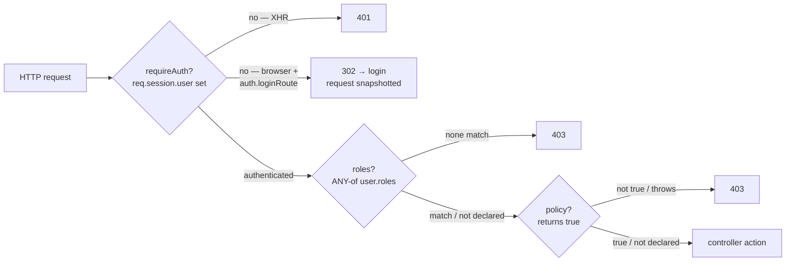
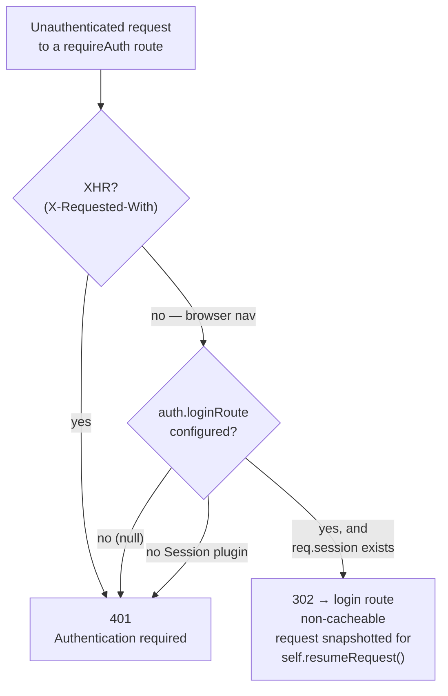
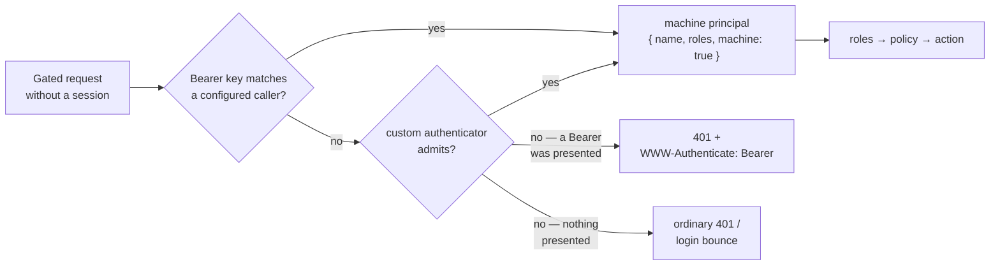

# Route authorization

*New in 0.5.19*

Gate access to a route **before** its controller action ever runs. Three `param`
keys in `routing.json` layer from coarse to fine:

1. **`requireAuth`** — the route needs any authenticated session.
2. **`roles`** — the session user must hold one of a set of roles.
3. **`policy`** — a per-bundle function makes the call (ownership and other
   record-level checks roles can't express).

Everything here is opt-in and fully additive: a route that declares none of
these keys behaves exactly as before. Author mistakes **refuse to boot** rather
than leaving a route silently open — a security control that is quietly OFF is
worse than an obvious startup error.

Service-to-service callers that cannot hold a session — another bundle, a job
runner, an external system — authenticate with a Bearer key instead: see
[Machine callers](#machine-callers).

---

## How authorization composes

The three keys are cumulative. `roles` and `policy` each **imply**
`requireAuth`, and they are evaluated in a fixed order — **authenticate →
roles → policy** — so a caller only ever learns as much as it has earned:



Two consequences fall out of that order:

- An **unauthenticated** caller gets the `401` (or login bounce) and never
  learns the route is role- or policy-restricted.
- Only an **authenticated** caller can ever see a `403`, and that `403` is
  **generic** — the required roles and the policy name are never sent to the
  client (they describe your authorization model). The reason is written to a
  server-side log line instead.

`roles` is an **ANY-of** match (hold at least one). `policy` is **AND-composed**
after roles (a route with both must pass roles *and* the policy). A route may
declare any subset; the pipeline simply skips the layers it didn't declare.

---

## `requireAuth` — require a signed-in user

Add `requireAuth: true` to a rule's `param` block:

```json title="src/<bundle>/config/routing.json"
{
  "dashboard": {
    "url":   "/dashboard",
    "param": { "control": "dashboard", "requireAuth": true }
  }
}
```

An unauthenticated request now never reaches the action. What it gets instead
depends on whether it's a browser navigation or an API call:



- **XHR requests always get `401`** (`{"status":401,"error":"Authentication required"}`),
  never a redirect. An XHR follows a `Location` transparently and would receive
  the login *page* as its response body — useless to the caller — so it needs a
  status it can read.
- A **browser navigation** is bounced to the login page with a **non-cacheable
  `302`**, but only when [`auth.loginRoute`](#auth-login-route)
  is configured *and* the bundle has a session (the `Session` plugin is
  mounted). The original request is snapshotted first, so the login action can
  replay it after sign-in with `self.resumeRequest()`. Without `auth.loginRoute`
  (the default), even a browser request gets the `401` — fail-closed.

The bounce is deliberately non-cacheable: a cached login redirect becomes a
login **loop** — the browser would replay it on the later, authenticated visit
and never reach the page.

:::note What counts as authenticated
A request is authenticated when `req.session.user` is truthy — the gate reads
that property directly. Populating it at login (verifying credentials, loading
the user record) stays your application's job; the framework only enforces the
gate. A [machine caller](#machine-callers) verified from its Bearer key counts
as authenticated too — and a signed-in session always wins over it.
:::

---

## `roles` — restrict by role

`roles` is an array of opaque role strings; the session passes if
`req.session.user.roles` contains **at least one** of them:

```json title="src/<bundle>/config/routing.json"
{
  "admin-users": {
    "url":   "/admin/users",
    "param": { "control": "list", "roles": ["admin", "editor"] }
  }
}
```

- `roles` **implies `requireAuth`** — you don't need both. An unauthenticated
  caller still gets the `401`/bounce first.
- An authenticated caller whose `user.roles` holds none of the listed roles
  gets a **generic `403`**. The required roles, the user's roles, and the rule
  name never reach the wire.
- A session with no `roles` array (absent, non-array, or empty) simply holds no
  roles, so every role-gated route `403`s for it.

Roles are plain strings you define — there is no framework role vocabulary and
no role → permission indirection in this version. `["admin", "editor"]` means
exactly "hold `admin` or `editor`".

---

## `policy` — a custom predicate

Roles answer "*what kind* of user is this". A policy answers a question roles
can't: "*is this user allowed to touch **this** record*" — ownership, tenancy,
attribute checks. Point `policy` at a function file in your bundle's
`policies/` directory:

```json title="src/<bundle>/config/routing.json"
{
  "invoice-detail": {
    "url":   "/invoice/:id",
    "param": { "control": "detail", "id": ":id", "policy": "ownsInvoice" }
  }
}
```

```js title="src/<bundle>/policies/ownsInvoice.js"
module.exports = function (user, req) {
    return String(req.params.id) === String(user.id);
};
```

The function receives the session `user` and the request, and returns a boolean.
It is loaded and registered **at boot** (a request-path lookup, never an
on-the-fly `require`), so a policy edit needs a bundle restart.

- `policy` **implies `requireAuth`** and is **composed after `roles`** — a route
  declaring both must satisfy the roles *and* the policy.
- The `403` stays **generic**: the policy name is never echoed to the client. A
  policy that **throws** denies with a `403` too (it never errors the response
  or crashes the bundle) — the thrown message goes only to the server log.

:::caution Only a literal `true` allows
The policy must return the boolean `true` to allow the request. Any other value
— `1`, a truthy string, a truthy object, a `Promise` — **denies**. This is
deliberate. An `async` policy returns a `Promise`, which is truthy but never
`=== true`; rather than silently allowing every request, an `async function`
policy is **refused at boot**. Keep policies synchronous.
:::

---

## Authorizing inside an action — `self.hasRole()`

Sometimes the decision is finer than a whole route — a single action branches on
a role, or checks it after loading data. Use the `self.hasRole(role)` controller
helper:

```js title="src/<bundle>/controllers/controller.js"
var self = this;

this.publish = function(req, res, next) {
    if (!self.hasRole('editor')) {
        return self.throwError(403, 'Editors only');
    }

    // ... editor-only logic
    self.render({ published: true });
};
```

`self.hasRole` reads the same `req.session.user.roles` the `roles` key checks
(ANY-of when you pass it several), so "holding a role" means exactly one thing
across the declarative and imperative paths. It returns `false` safely when
there is no session.

---

## Pointing the login bounce — `auth.loginRoute` {#auth-login-route}

The browser bounce is off by default. Turn it on by naming a login target in
`settings.json`:

```json title="src/<bundle>/config/settings.json"
{
  "auth": {
    "loginRoute": "login"
  }
}
```

`loginRoute` accepts either form:

- A **rule name** (`"login"`) — resolved to that rule's served URL, so the
  bundle's webroot is applied for you (`login` → `/<webroot>/login`). Naming a
  rule the bundle doesn't declare refuses the boot.
- An **absolute path** (`"/login"`) — used verbatim; you own the path.

Either way the redirect `Location` stays root-relative (same-origin), and it is
read once at boot — an `auth.loginRoute` change needs a bundle restart. The
login action itself replays the snapshotted request with `self.resumeRequest()`;
see [Pausing and resuming requests](/guides/controller#pausing-resuming-requests)
in the Controllers guide for the pause/replay mechanics.

---

## Machine callers — service-to-service authentication {#machine-callers}

*New in 0.5.25*

A service calling your gated routes — another bundle via `self.query()`, a job
runner, an external system — has no browser to sign in with. Declare it a
**machine caller** in `settings.json` and it authenticates per request with a
Bearer key:

```json title="src/<bundle>/config/settings.json"
{
  "auth": {
    "machine": {
      "enabled": true,
      "callers": {
        "billing": { "key": "${secret:BILLING_SVC_KEY}", "roles": ["service"] }
      }
    }
  }
}
```

The caller presents its key on every request — from anywhere that can set a
header, including another bundle's `self.query()`:

```bash
curl -H "Authorization: Bearer $BILLING_SVC_KEY" https://api.example.com/reports
```

```js title="from another bundle — inside a controller action"
self.query({
    hostname : 'reports@',   // name-based resolution to the target bundle
    path     : '/reports',
    method   : 'GET',
    headers  : { authorization: 'Bearer ' + process.env.BILLING_SVC_KEY }
}, {}, function (err, result) {
    // ...
});
```

A verified machine caller becomes the request's **principal** exactly where a
session user would be:

- it satisfies `requireAuth`;
- its configured `roles` ride the same **ANY-of** match as a session user's —
  which is also your per-route granularity: keep a route **human-only** by
  requiring a role no caller holds, or **machine-only** by requiring one only
  callers hold;
- a `policy` receives it as its `user` argument, shaped
  `{ name, roles, machine: true }` — branch on `user.machine === true` when a
  policy must treat services differently;
- `self.hasRole()` answers its configured roles;
- [audit records](/guides/audit-trail) carry the caller **name** as the actor
  key, marked `machine: true`.



Facts worth knowing before you enable it:

- **Session wins.** A signed-in request never consults the machine path, so a
  browser session with a stray `Authorization` header behaves exactly as
  before.
- **Enabling admits configured callers to _all_ gated routes**, subject to
  `roles` and `policy` — the fail-closed default is `enabled: false`, and
  there is deliberately no per-route opt-in key (use roles, as above).
- **Keys**: prefer `${secret:KEY}` placeholders (resolved from the environment
  at config load) and long random values (32+ bytes). The framework compares
  them in constant time against boot-computed sha256 hashes — the raw key is
  not retained in memory after boot.
- **An invalid presented key gets a clean `401`** with
  `WWW-Authenticate: Bearer` — never the login bounce (a `302` to a login page
  is meaningless to a service).
- `auth.machine` is **boot config** — changing it needs a bundle restart.

:::note mTLS is out of scope by design
Transport-level mutual TLS is not part of this feature: terminate mTLS at your
ingress or service mesh, and use machine callers (or a custom authenticator)
for application-level identity.
:::

### Custom authenticator — `auth.machine.authenticator`

When a shared key isn't the right credential — you verify JWTs, an HMAC
header, an `x-api-key` scheme — name a per-bundle authenticator module. It is
the `policies/<name>.js` shape applied to authentication:

```json title="src/<bundle>/config/settings.json"
{
  "auth": {
    "machine": {
      "enabled": true,
      "authenticator": "verifyJwt"
    }
  }
}
```

```js title="src/<bundle>/authenticators/verifyJwt.js"
var jwt = require('jsonwebtoken');

module.exports = function (req) {
    var m = /^Bearer\s+(.+)$/i.exec((req.headers && req.headers.authorization) || '');
    if (!m) { return null; }
    try {
        var claims = jwt.verify(m[1].trim(), process.env.JWT_PUBLIC_KEY);
        return { name: claims.sub, roles: claims.roles || [] };
    } catch (e) {
        return null;   // invalid signature / expired — not authenticated by me
    }
};
```

- The function is **synchronous** and returns `{ name, roles }` to admit, or
  `null` to pass. It runs **after** the built-in caller map (first success
  wins) and regardless of which header the request carries, so it can verify
  any credential a synchronous check can settle — `jwt.verify` with a local
  secret or public key is synchronous.
- The gate **normalizes** the return: the principal is always
  `{ name, roles, machine: true }`-shaped, and a non-array `roles` collapses
  to holding none.
- A missing, broken, or `async function` module **refuses to boot** (an async
  authenticator could never admit — the gate is synchronous). At request time
  a throw or a malformed return is **fail-closed unauthenticated** — logged
  server-side, never a `500`.

---

## Denials are recorded automatically

When the [audit trail](/guides/audit-trail) is enabled
(`settings.json > audit.enabled: true`), every denial this gate issues is
written to the trail as an `authz.denied` record, with `meta.outcome`
distinguishing `401` / `login-bounce` / `403-roles` / `403-policy` /
`401-machine` (an invalid machine credential). An audit
write failure can **never** change an authorization outcome — the two are fully
decoupled. See the [Audit trail guide](/guides/audit-trail) for the record
shape and how to opt out.

---

## Boot-time validation

A misconfigured authorization key is a security bug, so the framework refuses to
boot on any of these rather than serving a silently-open route:

| Author mistake | Result |
|---|---|
| `requireAuth` set to a non-boolean (`"true"`, `1`) | Refuses to boot — the gate tests `=== true`, so a truthy string would silently NOT gate |
| `auth.loginRoute` names a rule the bundle doesn't declare (or a multi-URL / parameterized target) | Refuses to boot |
| `roles` is `null`, a bare string, an empty array, or has non-string / empty members | Refuses to boot |
| `policy` is missing, not a function, a non-string name, or an `async function` | Refuses to boot |
| `auth.machine.enabled` set to a non-boolean (`"true"`, `1`) | Refuses to boot — a truthy string would silently NOT enable machine auth |
| A machine caller with a missing / empty `key`, or malformed `roles` | Refuses to boot |
| `auth.machine.authenticator` names a missing, broken, or `async function` module | Refuses to boot (linted even while `enabled` is `false`) |

:::note Authorization keys stay server-side
`requireAuth`, `roles`, and `policy` are stripped from the routing maps served
to the browser — the client never sees which routes are gated or by what.
:::

---

## See also

- [Audit trail](/guides/audit-trail) — where authorization denials are recorded (`authz.denied`)
- [Sessions](/guides/sessions) — `req.session.user` and `req.session.user.roles`
- [Controllers — pausing and resuming requests](/guides/controller#pausing-resuming-requests) — the snapshot/replay the login bounce reuses
- [routing.json reference](/reference/routing) — the `param.requireAuth` / `roles` / `policy` rows
- [settings.json reference](/reference/settings#auth) — the `auth.loginRoute` schema
- [CSRF Protection](/guides/csrf) — the sibling request-security control
- [Migration Guide — 0.5.18 → 0.5.19](/migration#0518--0519) — the release notes
