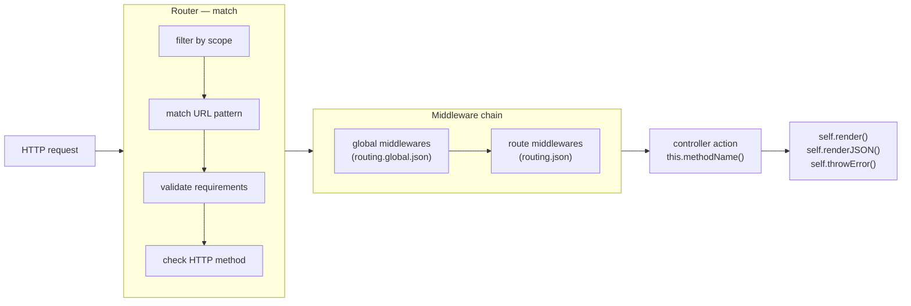

# Routing

Every HTTP request that arrives at a bundle is matched against that bundle's routing table.
Routes are declared in `src/<bundle>/config/routing.json` — they are not registered in code.

---

## How it works

When a request arrives, the router tests every route in order. The first rule whose URL
pattern, HTTP method, and scope all match wins. The matched route's middleware list (global
middlewares prepended, then route-specific) executes sequentially before the controller
action is called.



Matched route metadata is available on every request as `req.routing`.

---

## Basic example

Given this route in `src/frontend/config/routing.json`:

```json
{
  "home": {
    "url": "/",
    "param": {
      "control": "home"
    }
  }
}
```

A `GET /` request on the `frontend` bundle calls `this.home(req, res, next)` in
`controllers/controller.js`.

---

## Route fields

Each key in `routing.json` is a **rule name** (e.g. `"home"`, `"invoice"`). The framework
appends `@<bundle>` internally — `"home"` becomes `"home@frontend"` — so rule names are
unique across the project.

```json
{
  "rule-name": {
    "url": "/path/:param",
    "method": "GET",
    "namespace": "account",
    "requirements": {
      "param": "/^[a-z]+$/i"
    },
    "param": {
      "control": "methodName",
      "file": "template/path",
      "title": "Page title",
      "param": ":param"
    },
    "middleware": [
      "middlewares.passport.authentificate"
    ],
    "scopes": ["production", "beta"],
    "queryTimeout": "30s",
    "cache": {
      "type": "memory",
      "ttl": 3600
    }
  }
}
```

| Field | Required | Default | Description |
|---|:---:|---|---|
| `url` | — | `/<rule-name>` | URL pattern. Supports `:param` and multiple URLs (comma-separated) |
| `method` | — | `"GET"` | HTTP method(s). Comma-separated for multiple: `"GET, POST"` |
| `namespace` | — | — | Maps to `controller.<namespace>.js` and the views subdirectory |
| `requirements` | — | — | Regex or validator constraints per URL parameter |
| `param.control` | ✓ | — | Controller method to invoke |
| `param.file` | — | rule name | Template path relative to the namespace views dir |
| `param.title` | — | — | Page title. Supports `:param` substitution |
| `middleware` | — | `[]` | Middleware chain to run before the controller action |
| `scopes` | — | `[current scope]` | Scopes where this route is active |
| `queryTimeout` | — | `10s` | Timeout budget for outgoing sub-requests made from this route's controller action via `self.query()`. Accepts a duration string (`"30s"`, `"500ms"`) or milliseconds as a number. Used as a fallback when no timeout is set explicitly in the `query()` call |
| `cache` | — | — | Response cache strategy. See [Caching](./caching.md) for the full field reference. |
| `_comment`, `_sample` | — | — | Developer notes, ignored by the framework |

---

## URL patterns

### Static URL

```json
"about": {
  "url": "/about",
  "param": { "control": "about" }
}
```

### Parameterized URL

Parameters start with `:`. The matched value is injected into `req.routing.param`
and the appropriate method object (`req.get`, `req.post`, etc.).

```json
"invoice": {
  "url": "/invoice/:id",
  "param": {
    "control": "get",
    "id": ":id"
  }
}
```

```js
// In the controller:
this.get = function(req, res, next) {
  var id = req.routing.param.id;  // or req.get.id on GET requests
  // ...
};
```

### Multiple URLs

Comma-separate URLs to map several paths to the same controller method:

```json
"help": {
  "url": "/help, /aide",
  "param": { "control": "help" }
}
```

Both `/help` and `/aide` resolve to the same action. `req.routing.url` reflects
the URL that actually matched.

### Inline parameters

Parameters can be embedded within a segment rather than forming a full segment:

```json
"pagination": {
  "url": "/articles/page:number",
  "requirements": {
    "number": "/^[0-9]+$/"
  },
  "param": {
    "control": "list",
    "number": ":number"
  }
}
```

`/articles/page3` sets `req.routing.param.number` to `"3"`.

---

## HTTP methods

Set `method` to one or more HTTP verbs (comma-separated). Default is `"GET"`.

```json
"login": {
  "url": "/login",
  "method": "GET, POST",
  "param": { "control": "login" }
}
```

In the controller, the same method handles both verbs. Use `req.method` or the
presence of posted data to branch:

```js
this.login = function(req, res, next) {
  if (req.post && req.post.count() > 0) {
    // Handle form submission
    var credentials = req.post;
    // ...
  } else {
    // Render the login form
    self.render({ title: 'Log in' });
  }
};
```

---

## Requirements

Requirements validate URL parameter values before the route is considered a match.
A route whose requirements fail is skipped, as if it did not exist — the router
moves on to the next candidate.

### Regex requirements

The value must start with `/` and follow regex literal syntax (pattern between
slashes, flags after the last slash):

```json
"invoice": {
  "url": "/invoice/:id",
  "requirements": {
    "id": "/^[0-9a-f]{8}-[0-9a-f]{4}-[1-5][0-9a-f]{3}-[89ab][0-9a-f]{3}-[0-9a-f]{12}$/i"
  },
  "param": {
    "control": "get",
    "id": ":id"
  }
}
```

```json
"docs": {
  "url": "/docs/:section",
  "requirements": {
    "section": "/^(intro|quickstart|reference)$/i"
  },
  "param": {
    "control": "docs",
    "section": ":section"
  }
}
```

`/docs/intro` matches. `/docs/pricing` does not — the router tries the next route.

### Validator requirements

Use `validator::{ ... }` for semantic validation. Keys are validator rule names;
array values are passed as arguments:

```json
"account-email-update": {
  "url": "/account/email",
  "method": "PUT",
  "requirements": {
    "email": "validator::{ isRequired: true, isEmail: true }"
  },
  "param": { "control": "emailUpdate" }
}
```

If a requirement value starts with neither `/` nor `validator::`, the bundle fails
to start with a configuration error.

---

## Namespaces

The `namespace` field does two things:

1. **Routes to a named controller file.** `"namespace": "account"` loads
   `controllers/controller.account.js` instead of `controllers/controller.js`.
   Dot notation (`"account.settings"`) maps to `controller.account.settings.js`.
2. **Sets the views subdirectory.** Templates are resolved from `templates/<namespace>/`
   by default.

```json
"account-settings": {
  "namespace": "account",
  "url": "/account/settings",
  "param": {
    "control": "settings",
    "file": "settings/index"
  }
}
```

```js
// controllers/controller.account.js
var AccountController = function() {
  var self = this;

  this.settings = function(req, res, next) {
    self.render({ title: 'Account settings' });
    // renders templates/account/settings/index.html
  };
};
module.exports = AccountController;
```

When a namespace controller exists, the inheritance chain is:
`NamespaceController → MainController (controller.js) → SuperController`.
Without a namespace: `Controller (controller.js) → SuperController`.

---

## Webroot

The bundle's webroot is automatically prepended to every URL. Configure it in
`src/<bundle>/config/settings.json`:

```json
{
  "server": {
    "webroot": "/dashboard"
  }
}
```

With this setting, `"url": "/account/settings"` becomes `/dashboard/account/settings`
in the HTTP server. Use `param.ignoreWebRoot: true` to opt out for a specific route:

```json
"healthcheck": {
  "url": "/_health",
  "param": {
    "control": "healthcheck",
    "ignoreWebRoot": true
  }
}
```

---

## Redirect routes

Redirect a URL to another path using `param.path`. An optional `param.code` sets
the status code (default: `301`).

```json
"docs-redirect": {
  "url": "/documentation",
  "param": {
    "control": "redirect",
    "path": "/documentation/",
    "code": 301,
    "keep-params": false
  }
}
```

---

## Scopes

Routes can be restricted to specific [scopes](../concepts/scopes). A route with
`"scopes": ["beta"]` is invisible on any other scope — the router skips it entirely.

```json
"beta-dashboard": {
  "url": "/beta",
  "param": { "control": "betaDashboard" },
  "scopes": ["beta"]
}
```

If `scopes` is omitted, the route defaults to the scope that was active when the
bundle started.

---

## Per-route query timeout

By default, outgoing sub-requests made from a controller action via `self.query()` time out
after **10 seconds**. Set `queryTimeout` on a route to raise or lower that budget for a specific
endpoint without touching every call site in the controller.

```json
"report-export": {
  "url": "/reports/:id/export",
  "param": { "control": "export" },
  "queryTimeout": "120s"
}
```

The value is normalised to milliseconds at startup and exposed on `req.routing.queryTimeout`.
It is used as a fallback when no timeout is passed explicitly to `self.query()`:

```js
// routing.json declares "queryTimeout": "120s" on this route

this.export = function(req, res, next) {
  // No explicit timeout — picks up 120 s from the route
  self.query({ hostname: 'coreapi', path: '/heavy-report/' + req.routing.param.id }, function(err, data) {
    if (err) return self.throwError(res, 503, err);
    self.renderJSON(data);
  });
};
```

To override the route timeout for a specific call, pass `requestTimeout` in the options:

```js
// Route queryTimeout is 120 s, but this particular call has a tighter budget
self.query({ hostname: 'coreapi', path: '/ping', requestTimeout: '5s' }, callback);
```

**Priority order** (highest wins):

1. `requestTimeout` in the `self.query()` options object
2. `queryTimeout` on the matched route in `routing.json`
3. Framework default — `10s`

Accepted formats: duration string (`"30s"`, `"500ms"`, `"2m"`, `"1h"`) or an integer in milliseconds (`30000`).

:::note Timeout field naming
`timeout` is reserved for future incoming-request cancellation (the budget for the controller
action itself, enforced with `AbortController`). `requestTimeout` is the consistent name for
outgoing sub-request timeouts — used both in `self.query()` options and in
`app.json::proxy.<service>.requestTimeout`. `queryTimeout` scopes the fallback to a specific
route without touching every call site.
:::

---

## Global routing

`routing.global.json` defines middlewares and settings that apply to **every route**
in the bundle. The file lives at:

- `shared/config/routing.global.json` — shared across all bundles in the project
- `src/<bundle>/config/routing.global.json` — applies to one bundle only

```json
{
  "middleware": [
    "middlewares.global.getProjectVersion",
    "middlewares.maintenance.check"
  ],
  "cacheControl": {
    "max-age": 3600
  }
}
```

Global middlewares are **prepended** to every route's own middleware list. A route
that declares `"middlewares.passport.authentificate"` will run in this order:

```
getProjectVersion → maintenance.check → passport.authentificate → controller action
```

To add a middleware to every route, put it in `routing.global.json`. To add it to
specific routes only, put it in the individual route's `middleware` array.

---

## The request object

After route matching, three objects carry the request data.

### `req.routing`

Contains the matched route's resolved metadata:

```js
{
  rule:         "invoice@frontend",   // full rule name (name@bundle)
  url:          "/invoice/abc-123",   // matched URL with params resolved
  method:       "GET",                // HTTP method
  namespace:    "account",            // namespace, if set
  bundle:       "frontend",           // bundle name
  param: {
    control:    "get",                // controller method
    file:       "invoice/detail",     // template file
    id:         "abc-123"             // resolved param value
  },
  middleware:   ["middlewares.passport.authentificate"],
  requirements: { id: "/^[-a-f0-9]+$/i" },
  queryTimeout: 30000                 // normalised to ms (set via "queryTimeout": "30s" in routing.json)
}
```

### `req.get` / `req.post` / `req.put` / `req.delete`

The parsed request payload for the corresponding HTTP method. URL parameters and
query strings are merged in automatically.

```js
// GET /invoice/abc-123?page=2
req.get.id    // "abc-123"  — from URL param
req.get.page  // 2          — from query string, auto-cast from "2"
```

```js
// POST /login  { username: "alice", password: "..." }
req.post.username  // "alice"
req.post.password  // "..."
```

All four objects have a `count()` method:

```js
if (req.post.count() > 0) {
  // Form was submitted
}
```

String values `"null"`, `"true"`, and `"false"` are automatically cast to their
JavaScript equivalents.

---

## Reverse routing — `lib.routing.getRoute()`

Build a URL from a rule name in a controller or middleware:

```js
var routing = lib.routing;

// Basic — unresolved URL
var route = routing.getRoute('invoice@frontend');
route.url;       // "/invoice/:id"
route.toUrl();   // "https://app.example.com/invoice/:id"

// With params — params are substituted into the URL
var route = routing.getRoute('invoice@frontend', { id: 'abc-123' });
route.url;       // "/invoice/abc-123"
route.toUrl();   // "https://app.example.com/invoice/abc-123"

// Redirect to a resolved URL
self.redirect(route.toUrl(), true);
```

Extra params not present in the URL pattern are appended as a query string:

```js
var route = routing.getRoute('search@frontend', { q: 'gina', page: 2 });
route.url;  // "/search?q=gina&page=2"
```

When called from within the same bundle, the `@bundle` suffix can be omitted —
the current bundle is appended automatically:

```js
// Inside the frontend bundle
var route = routing.getRoute('invoice', { id: 'abc-123' });
```

---

## See also

- [Middleware guide](./middleware) — Writing and configuring middlewares
- [Views and templates](./views) — Template rendering from controller actions
- [Routing API reference](/api/routing) — `getRoute()` and `getRouteByUrl()` signatures
