# ScyllaDB / Cassandra ORM for Node.js

ScyllaDB and Apache Cassandra are wide-column stores that share the same wire
protocol (CQL — Cassandra Query Language). Gina's `scylladb` connector wraps
the official `cassandra-driver` (Apache Software Foundation) so you can write
entity classes with CQL files, the same way you'd write SQL files for MySQL or
PostgreSQL.

- **Entities** — JavaScript classes that map to CQL tables, with generated CRUD
  methods and the standard `EventEmitter` / `.onComplete()` shim
- **CQL files** — prepared statements stored as `.sql` files alongside entity code
- **Type-safe parameters** — `@param` annotations cast inputs to the right CQL type
  (uuid, timestamp, bigint, list, map, etc.)
- **LWT support** — lightweight transactions (`IF NOT EXISTS`, `IF version = ?`)
  return `[applied]` boolean for `@return {boolean}` annotations
- **Session store** — express-session-compatible store using CQL `USING TTL` for
  automatic expiry

---

## Driver choice — token-aware vs shard-aware

The Node.js ecosystem has **no** first-party shard-aware ScyllaDB driver. ScyllaDB
publishes shard-aware drivers for Python, Java, Go, and Rust, but on Node.js they
recommend `cassandra-driver`, the upstream Apache project.

`cassandra-driver` provides **token-aware routing**: the client knows which node
owns each partition and routes the request directly. This is sufficient for most
workloads. **Shard-aware routing** — additionally routing to the specific shard
(thread) on each node — gives a 30–50% latency reduction in tight inner loops but
is only available in the non-Node.js drivers.

If shard-aware latency is critical for a specific high-throughput path, run that
path via a separate Python / Java / Go / Rust service.

:::caution Node 20 required

`cassandra-driver@>=4.0.0` requires Node `>=20`. If your project runs on Node
16-19, upgrade Node before adopting the connector.

:::

---

## Installation

```bash
npm install cassandra-driver
```

The driver is loaded from your project's `node_modules` at runtime — Gina has
zero hard dependency on it.

---

## Architecture

```mermaid
flowchart TD
    subgraph Bundle["Bundle Process"]
        C[Controller] -->|"entity.find()"| E[Entity<br/>EventEmitter]
        E -->|"prepared CQL"| CN[ScyllaDB Connector]
        CN -->|"client.execute"| CD[cassandra-driver<br/>token-aware routing]
        CD -->|"CQL native protocol"| SC[(ScyllaDB / Cassandra<br/>Cluster)]
    end

    subgraph DevMode["Dev Mode"]
        CN -->|"push _queryEntry"| QI[Query Instrumentation]
        QI --> INS[Inspector<br/>Query Tab]
    end

    style Bundle fill:#1a1a2e,stroke:#f2af0d
    style DevMode fill:#2a2a3e,stroke:#4caf50
```



---

## Connector config (connectors.json)

```json
{
  "primary": {
    "connector": "scylladb",
    "contactPoints": ["127.0.0.1:9042"],
    "localDataCenter": "datacenter1",
    "keyspace": "mykeyspace",
    "credentials": { "username": "cassandra", "password": "${SCYLLA_PASSWORD}" }
  }
}
```

Connection options:

| Option | Default | Notes |
|---|---|---|
| `contactPoints` | `["127.0.0.1:9042"]` | Array of `host:port` strings, comma-separated string, or a `host`+`port` pair |
| `localDataCenter` | `"datacenter1"` | Required by cassandra-driver 4.x for token-aware routing |
| `keyspace` | (required) | Falls back to `database` for parity with other connectors |
| `credentials` | (none) | `{ username, password }` — wraps in `PlainTextAuthProvider` |
| `ssl` | (none) | Object passed through to cassandra-driver as `sslOptions` |

You can also use `connector:add` to write the entry:

```bash
gina connector:add primary @myproject \
    --connector=scylladb \
    --driver-version='>=4.0.0'
```

---

## Defining an entity

Entities live under `bundle/models/<keyspace>/entities/`. The class extends the
gina `Entity` super-class via `inherits`:

```javascript
// bundle/models/mykeyspace/entities/user.js
var lib    = require('gina').lib;
var Entity = lib.entities.Entity;

function User(conn, caller) {
    Entity.call(this, conn, caller);
}

module.exports = User;
```

CQL methods are attached automatically from `bundle/models/<keyspace>/cql/User/*.sql`:

```text
bundle/models/mykeyspace/
├── entities/
│   └── user.js
└── cql/
    └── User/
        ├── findById.sql
        ├── insert.sql
        └── upsertUnique.sql
```

The directory is `cql/` (not `sql/` or `n1ql/`) but files keep the `.sql`
extension so editor syntax highlighting and the shared comment-stripper work.

---

## CQL file format

```sql
/*
 * @param  {uuid}      ?    user id
 * @return {object}
 */
SELECT id, name, email, created_at
FROM users
WHERE id = ?
```

The annotations:

- `@param {<type>} <pos> <description>` — pre-execute coercion of positional
  arguments. CQL types supported: `text`, `varchar`, `ascii`, `int`, `smallint`,
  `tinyint`, `counter`, `bigint`, `varint`, `decimal`, `double`, `float`,
  `boolean`, `uuid`, `timeuuid`, `timestamp`, `inet`, `blob`. Collection types
  (`list<text>`, `map<text,int>`, etc.) pass through.
- `@return {<shape>}` — controls the response shape:

| Annotation | SELECT | Write op | LWT (`IF` clause) |
|---|---|---|---|
| `{object}` | first row or `null` | — | — |
| `{Array}` (default for SELECT) | all rows or `null` | — | — |
| `{boolean}` | `rows.length > 0` | `true` (always) | `[applied]` value |
| `{number}` (with COUNT) | first column of first row | — | — |
| (none) for write op | — | `null` | row when applied / `null` otherwise |

---

## Lightweight transactions

CQL's lightweight transactions (`IF NOT EXISTS`, `IF version = ?`) return a
single row with an `[applied]` boolean column:

```sql
/*
 * @return {boolean}
 */
INSERT INTO users (id, email)
VALUES (?, ?)
IF NOT EXISTS
```

```javascript
var inst = new User(conn);
inst.upsertUnique(uuid, 'alice@example.com').onComplete(function(err, applied) {
    if (err) return next(err);
    if (!applied) {
        // Email already exists — handle conflict
    }
});
```

For default `@return` (no annotation), an LWT returns the existing row when
`[applied]` is `false`, so you can read the conflicting values directly.

---

## Calling entity methods

Methods return a native `Promise` with `.onComplete()` shim for backward
compatibility:

```javascript
// Promise + await
var user = await new User(conn).findById(uuid);

// EventEmitter-style callback
new User(conn).findById(uuid).onComplete(function(err, user) {
    if (err) return next(err);
    self.renderJSON(user);
});

// Direct callback (util.promisify-compatible)
new User(conn).findById(uuid, function(err, user) {
    // ...
});
```

---

## Session store via CQL `USING TTL`

CQL has no Redis-EXPIRE equivalent — TTL is set per-row at INSERT/UPDATE time.
The store wraps that idiom for express-session compatibility.

**Required schema** (the store does not auto-create):

```cql
CREATE TABLE IF NOT EXISTS sessions (
    sid  TEXT PRIMARY KEY,
    sess TEXT
) WITH default_time_to_live = 86400;
```

**Configuration**:

```json
{
  "session": {
    "connector": "scylladb",
    "contactPoints": ["127.0.0.1:9042"],
    "localDataCenter": "datacenter1",
    "keyspace": "session_store",
    "table": "sessions",
    "ttl": 86400
  }
}
```

**Bundle bootstrap**:

```javascript
var session       = require('express-session');
session.name      = 'session';
var ScylladbStore = require('gina/framework/v0.3.11-alpha.2/core/connectors/scylladb/lib/session-store')(session, 'mybundle');

app.use(session({
    store : new ScylladbStore(),
    secret: process.env.SESSION_SECRET,
    resave: false,
    saveUninitialized: false
}));
```

**API mapping**:

| Express-session method | CQL statement |
|---|---|
| `set(sid, sess, fn)` | `INSERT INTO sessions (sid, sess) VALUES (?, ?) USING TTL <maxAge>` |
| `touch(sid, sess, fn)` | `UPDATE sessions USING TTL <maxAge> SET sess = ? WHERE sid = ?` |
| `get(sid, fn)` | `SELECT sess FROM sessions WHERE sid = ?` |
| `destroy(sid, fn)` | `DELETE FROM sessions WHERE sid = ?` |
| `length(fn)` | `SELECT COUNT(*) AS n FROM sessions` |
| `clear(fn)` | `TRUNCATE sessions` |
| `all(fn)` | `SELECT sid, sess FROM sessions` |

`touch()` rewrites the row with both data + fresh TTL — CQL has no way to
extend TTL without rewriting. Functionally equivalent to redis SETEX.

`length()`, `clear()`, and `all()` are full-table scans — expensive on large
tables. Avoid in hot paths.

---

## Trade-offs

**Pros**:

- Massive horizontal scaling (linear with node count up to thousands of nodes)
- Predictable low-latency single-partition reads/writes
- Native TTL support — automatic session expiry without a sweeper job
- Same wire protocol on ScyllaDB and Cassandra — zero migration cost between them

**Cons**:

- No JOINs — denormalize at write time or join in the application
- Partition key + clustering key data model — not relational
- Token-aware routing only on Node.js (shard-aware requires Python / Java / Go / Rust)
- `COUNT(*)`, `TRUNCATE`, full-table SELECT are expensive cluster operations

If your workload is heavily relational, prefer
[PostgreSQL](/guides/models) or [MySQL](/guides/models). If you need a
document store, prefer [Couchbase](/guides/couchbase-orm) or MongoDB
(coming in `0.4.0`).

---

## Reference reading

- [cassandra-driver API documentation](https://docs.datastax.com/en/developer/nodejs-driver/latest/)
- [CQL syntax reference (ScyllaDB)](https://docs.scylladb.com/stable/cql/)
- [Cassandra data modeling guide](https://cassandra.apache.org/doc/latest/cassandra/data_modeling/intro.html)
- [Connectors reference](/reference/connectors)
