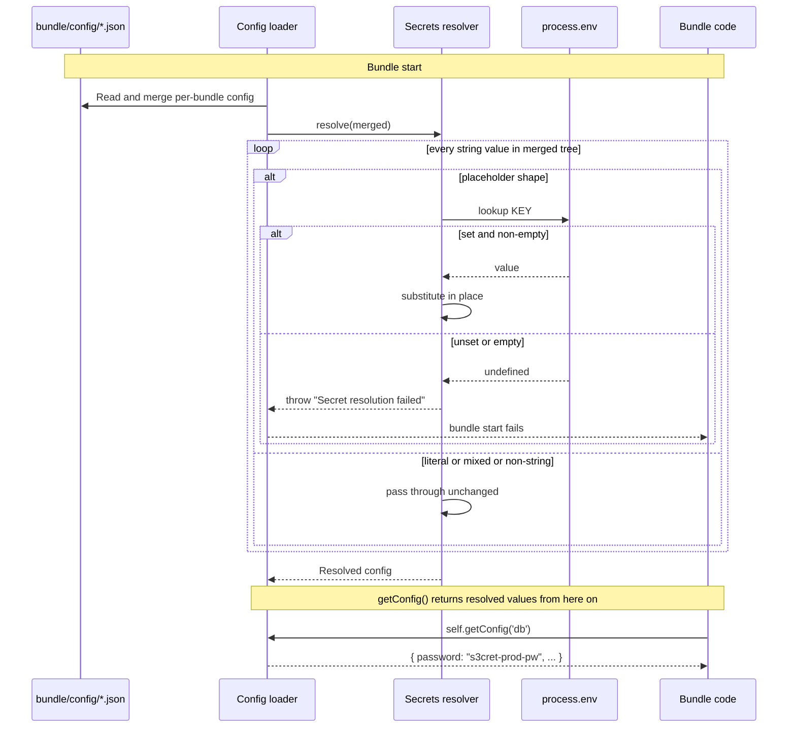

# Secrets in bundle config

Bundle config files (`<bundle>/config/*.json`) live in your repo as tracked
plaintext — perfect for non-sensitive values like ports, feature flags, or
template paths, but a problem for database passwords, API keys, signing
secrets, or any other value that must not appear in `git log`. Gina's
secrets resolver replaces those values with a `${secret:KEY}` placeholder
that the framework substitutes from `process.env[KEY]` at config-load
time.

The pattern is the standard 12-factor split:

- **Tracked config** declares the *shape* — which knobs exist, which
  fields the bundle expects, sensible defaults for non-sensitive values.
- **Environment** supplies the *values* — the runtime injects
  per-environment secrets via the deployment platform's native mechanism
  (Kubernetes Secret, ECS task-definition secrets, Cloud Run
  env-from-secret, SOPS + container entrypoint, Vault sidecar, etc.).

Substitution runs **once per bundle** during the config-load cycle. After
the first pass, downstream consumers — `getConfig()` calls in controllers,
`self.getConfig(...)` inside controller actions, plugin / middleware code
that reads through the same `getConfig` API — see resolved values
transparently. There's nothing to wire up in your code.

---

## Syntax

A `${secret:KEY}` placeholder must be the **entire** value of a JSON
string field. The connectors registry is a typical adoption surface:

```json title="<bundle>/config/connectors.json"
{
  "$schema": "https://gina.io/schema/connectors.json",
  "myDb": {
    "connector": "couchbase",
    "protocol": "couchbase://",
    "host":     "localhost",
    "database": "api",
    "username": "appuser",
    "password": "${secret:COUCHBASE_PASSWORD}",
    "ping":     "2m"
  }
}
```

Per-environment overrides go in sibling files alongside the base
`connectors.json` — `connectors.dev.json`, `connectors.production.json`,
etc. — and need only contain the keys that differ from the base.
Placeholders are resolved in every variant before they merge into
`self.envConf`:

```json title="<bundle>/config/connectors.production.json"
{
  "myDb": {
    "host":     "cb.prod.internal",
    "password": "${secret:COUCHBASE_PASSWORD_PROD}"
  }
}
```

`KEY` must match `^[A-Z_][A-Z0-9_]*$` — uppercase letters, digits, and
underscores, starting with a letter or underscore (the standard env-var
name shape). At runtime:

```bash
export COUCHBASE_PASSWORD='s3cret-prod-pw'
gina bundle:start api @myproject
```

The connector then sees `password === 's3cret-prod-pw'` without any
additional code.

### Mixed-content strings pass through

The placeholder must be the **entire** string value. Anything else —
embedded, prefixed, suffixed — is returned unchanged:

```json
{
  "url": "https://${secret:DB_HOST}/path"
}
```

This value is **not** substituted. The framework treats it as a literal
string. The design avoids the ambiguity of "is the `{` here a
substitution attempt, or just literal JSON content the author intended?"
— if you need composition, build the string in your bundle code after
reading the resolved value:

```javascript
var conf = self.getConfig('db');
var url  = 'https://' + conf.host + '/path';
```

---

## How it works



The resolver walks the merged config recursively — every object key,
every array element. It mutates the singleton in place, so all
downstream readers (`getConfig`, `Config#getInstance`, controller
`self.getConfig(...)`) see resolved values without further
substitution.

Resolution happens **once per bundle restart**. Mutating the
environment variable after the bundle has started does not affect any
already-resolved value — that's not a bug, it's the explicit contract.
See [Rotation](#rotation) below.

### One flat environment per process

The resolver reads the **single, flat `process.env` of the bundle's own
process** — there is no per-bundle and no per-scope secret namespace. Two
consequences worth knowing:

- **Per bundle.** The canonical deployment runs one bundle per container
  (`gina-container` is the container's foreground process), so each bundle
  gets its own injected environment and the *same* key name resolves to a
  per-bundle value automatically. Under a single local `gina start` daemon,
  every bundle instead inherits that one daemon environment — so if two
  co-hosted bundles need *different* values for the *same* logical secret
  there, give them **distinct key names** (`ADMIN_DB_PASSWORD`,
  `API_DB_PASSWORD`).
- **Per scope.** `scope` (`NODE_SCOPE`) is one runtime value per process, and
  the resolver stays scope-agnostic: it reads a fixed `<bundle>/config/` and
  `shared/config/` and resolves once per `[bundle][env]`, with no scope
  dimension. Scope plays two roles, and neither requires the resolver to be
  scope-aware:
    - As a **data-partition tag** (the `_scope` column and `$scope` query
      filter), local, beta, and production rows coexist behind the *same*
      connection, filtered at query time — here a scope change needs **no new
      secret**: the credentials are shared, only the visible rows differ.
    - As a **deployment-target marker**, a scope often maps to different
      infrastructure (a production cluster vs local) with its own
      credentials. Because the framework reads a fixed config dir and a flat
      environment, that difference is produced at **deploy time** — deploy
      the scope-appropriate config and inject the scope-appropriate
      environment (`NODE_SCOPE` plus matching secrets), exactly as for
      per-bundle isolation.

Differentiating secrets by bundle or scope is the **deployment layer's**
job (per-container environment, `NODE_SCOPE` set per deployment) — not the
resolver's. The resolver only reads `process.env`, which is what keeps the
framework out of storing or namespacing secrets.

---

## Fail-closed semantics

If a `${secret:KEY}` placeholder cannot be resolved — `process.env[KEY]`
is unset, or set to an empty string — the resolver throws:

```text
Error: Secret resolution failed
```

The error surfaces during bundle start, before any request is handled.
**The error message intentionally does not include the key name.**
Logging the missing key on a user-facing surface (HTTP 500 body, stderr
on a shared host) would defeat the point of keeping secrets out of
visible content. The framework's internal logger has access to the key
via a non-enumerable `_ginaSecretKey` annotation on the thrown Error for
diagnostic logging only — it never reaches user-visible output.

The strictness is deliberate: silent empty-string substitution masks
configuration mistakes that would otherwise surface much later (and
much more confusingly) — a database connect failing with an
empty-password error two layers deep, or worse, a route handler that
"works" by treating an empty value as anonymous auth.

---

## Adoption

Three steps for an existing bundle:

### 1. Inventory sensitive fields

Grep your bundle config for plaintext credentials:

```bash
grep -rE 'password|secret|key|token|api_key' bundle/config/
```

For every match: if the value should not appear in `git log`, it's a
candidate for a placeholder.

### 2. Rewrite values as placeholders

Replace each plaintext value with a `${secret:KEY}` placeholder. Pick
key names that match the field's role (`DB_PASSWORD`, `STRIPE_API_KEY`,
`JWT_SIGNING_SECRET`). Per-environment values use the same key name in
all environments — your deployment platform supplies the per-environment
value:

```diff
 {
   "production": {
     "stripe": {
-      "apiKey": "sk_live_redacted...",
+      "apiKey": "${secret:STRIPE_API_KEY}",
       "webhookEndpoint": "/webhooks/stripe"
     }
   }
 }
```

The `webhookEndpoint` field stays as plaintext — it's not sensitive.

### 3. Populate `process.env` at runtime

Use your deployment platform's native secret-injection mechanism:

- **Kubernetes:** `envFrom: secretRef` on the bundle's Pod / Deployment
  spec — the Secret object holds the values; the framework reads them
  via `process.env`.
- **Docker Compose (local dev):** an `.env` file gitignored at the
  project root, sourced by Compose before `gina bundle:start`. Never
  commit `.env`.
- **ECS / Fargate:** `secrets` block in the task definition pointing
  to AWS Secrets Manager or SSM Parameter Store entries.
- **Cloud Run:** `--update-secrets ENV_VAR=secret-name:latest`.
- **systemd / bare metal:** an `EnvironmentFile=` directive pointing
  to a decrypt step's output, with the decrypt happening at unit start.
- **CI / CD:** the platform's native secret store (GitHub Actions
  Secrets, GitLab CI variables) injected as env at runtime.

The framework does not care which mechanism you pick — the resolver
only reads `process.env`. Encryption-at-rest is the deployment layer's
concern, not the framework's.

### 4. Rotate any plaintext that previously lived in `git log`

The placeholder pattern protects **future** values. Anything that was
plaintext in git history — even a stale value from a long-deleted
commit — is still discoverable via `git log -p`. After adopting the
resolver, rotate every secret that was historically plaintext, since
the rotation invalidates the old value wherever it leaked.

---

## Inspecting required secrets

Two read-only CLI commands answer "which secrets does this bundle need,
and are they set?" — without resolving, and therefore without ever
exposing, a single value. They never read a secret's value, never write
anything, and never touch a running bundle. Use `secrets:scan` while
adopting the pattern (step 1 above) and `secrets:check` as a pre-deploy
gate.

### `secrets:scan` — discover required keys

`scan` walks each bundle's `<src>/config/*.json` plus the project's
`shared/config/*.json`, then reports every `${secret:KEY}` placeholder it
finds, grouped by the config file that declares it:

```bash
$ gina secrets:scan @myproject

@myproject:
  demo:
    Required secrets (3):
      API_KEY          <-  src/demo/config/settings.json
      DB_PASSWORD      <-  src/demo/config/connectors.json
      STRIPE_API_KEY   <-  shared/config/app.json
```

Scope it to one bundle with `gina secrets:scan <bundle> @myproject`, or
omit the project to scan every registered project. Add `--format=json`
for tooling. Only **bare** placeholders are reported — a mixed-content
string like `"https://${secret:API_HOST}/v1"` is not a placeholder
(see [Mixed-content strings pass through](#mixed-content-strings-pass-through))
and is not listed, mirroring exactly what the resolver would substitute.

### `secrets:check` — verify the environment before deploy

`check` runs the same enumeration, then cross-references the **current**
`process.env`, marking each key `SET` or `UNSET`:

```bash
$ export DB_PASSWORD=... API_KEY=...   # STRIPE_API_KEY left unset on purpose
$ gina secrets:check @myproject

@myproject:
  demo:
      API_KEY          SET
      DB_PASSWORD      SET
      STRIPE_API_KEY   UNSET
    (3 required: 2 set, 1 unset)

$ echo $?
1
```

`check` **exits non-zero when any required key is unset**, so it gates a
CI / pre-deploy step: export the secrets, run `secrets:check`, and fail
the pipeline before shipping a bundle that would crash at start. A key
counts as `SET` only when it is a **non-empty string** — the same
condition under which the resolver succeeds — so an `UNSET` here is
precisely a key that would throw `Secret resolution failed` at bundle
start.

:::note What `check` can and cannot see
`check` validates the environment of the **CLI process you run it in** — a
CI runner that exported the secrets, or a shell that sourced the same env
file. It cannot introspect the environment of an already-running, detached
bundle (a different process, often in a different container). And `scan`
reports the placeholders **authored on disk**, not a merged runtime
config. Both are correct for the placeholder model, where every
`${secret:KEY}` is an authored literal.
:::

Run `gina secrets:help` for the full command reference.

---

## Rotation

Resolution happens at bundle start. A rotated env var requires a **new
process** to be picked up:

| Platform | Action |
| -------- | ------ |
| Kubernetes | Roll the Deployment (`kubectl rollout restart deployment/<name>`) — the new Pod's container starts with the rotated env. |
| Docker / Compose | `docker compose up -d --force-recreate <service>` |
| systemd | `systemctl restart <unit>` |
| Bare process | `gina bundle:stop` then `gina bundle:start` (or a `bundle:restart` that re-spawns under a fresh entrypoint — see [Bundle CLI](/cli/cli-bundle)) |

A `gina bundle:restart` under an existing supervisor inherits the
supervisor's env from the original container init — to pick up a
rotated env var, the **container itself** must restart (re-running the
entrypoint). This is OS/Node-level behavior, not framework-specific,
and applies symmetrically to plain Node processes outside Gina.

---

## At-rest encryption (deployment-side note)

**Do not put encrypted-at-rest content inside `<bundle>/config/`.** The
framework's config-load path tries to JSON-parse every `.json` file in
that directory; formats that decorate JSON with metadata blocks (SOPS,
encrypted git-crypt blobs that survive as `.json` extensions, etc.)
trip the parser before the resolver ever runs.

Keep encryption-at-rest out of the bundle's config dir. Populate
`process.env` from a decrypt step at container entrypoint — a few
common shapes:

```bash title="entrypoint.sh (SOPS example)"
#!/bin/sh
# Decrypt the encrypted env file (mounted as a Secret / volume), source it,
# then exec the bundle. The decrypted values live in this process only.
sops -d /etc/secrets/env.enc > /tmp/env.sh
. /tmp/env.sh
rm /tmp/env.sh
exec gina-container api @myproject
```

`gina-container` takes `<bundle> @<project>` positional arguments —
see [K8s & Docker](/guides/k8s-docker) for the full container-runtime
shape.

The framework only cares about what's in `process.env` by the time it
reads bundle config. Storage layer is fully decoupled.

---

## `getResolvedPaths()` (advanced)

`lib/secrets` tracks the dotted paths it substituted during the walk
via an internal `WeakMap`. The list is queryable for tooling — for
example, a future log-redaction wrapper, a debug-export tool, or a
config-audit that wants to know "which fields originated as
secrets?":

```javascript
var secrets = require('lib/secrets');

var conf = {
    db   : { password: '${secret:DB_PASSWORD}' },
    items: ['${secret:K1}', 'literal'],
    port : 8080
};

process.env.DB_PASSWORD = 'pw';
process.env.K1          = 'va';

secrets.resolve(conf);
secrets.getResolvedPaths(conf);
// → ['db.password', 'items[0]']
```

Paths use dotted notation for object keys (`'db.password'`) and
bracketed indices for array elements (`'items[0]'`). The list is the
field-path only — never the resolved value, so logging it is safe.

You typically don't need to call this directly — the framework's
internal hook in `loadBundleConfig` handles substitution
transparently. The accessor is exposed for tooling and future
redaction wrappers.

---

## Out of scope (this iteration)

Things the resolver deliberately does **not** do:

- **Backends other than `process.env`.** The function signature is
  ready for a future pluggable selector (file, Vault, SOPS, K8s
  Secrets API, etc.) but only the env-var backend ships today.
- **Mixed-content substitution** like `'prefix-${secret:KEY}-suffix'`.
  Either rewrite the composition into bundle code, or wait for a
  future iteration that takes a closer look at the ambiguity question.
- **Dynamic re-resolution per request.** Substitution runs once at
  config-load time. Rotation needs a process restart.
- **Encrypted-at-rest storage.** Handled at the deployment layer (see
  above). The framework only sees what `process.env` returns.

---

## Framework integration

Three framework surfaces participate in the placeholder story today:

| Surface | How the resolver flows through |
| ------- | ------------------------------ |
| Bundle JSON configs under `<bundle>/config/*.json` and `shared/config/*.json` | Resolved by `core/config.js::loadBundleConfig` after the per-bundle merge. Every read via `getConfig` / `self.getConfig(...)` / `Config#getInstance` sees resolved values. |
| `gina.plugins.Csrf()` HMAC secret | Reads from `settings.json > csrf.secret` first (placeholder-compatible — `lib/secrets` fills the placeholder at config-load time), with fallback to `process.env.GINA_CSRF_SECRET` for back-compat. See [CSRF Protection](/guides/csrf). |
| `mcp.json > server.authToken` for `gina bundle:mcp-start` | The cmd handler reads `mcp.json` outside the bundle-config load path, so it explicitly calls `secrets.resolve(mcpDoc)` after the parse. `${secret:KEY}` placeholders in `mcp.json` get filled before downstream readers pick them up. Fallback to `process.env.GINA_MCP_AUTH_TOKEN` stays in place. |

Bundle-author code that consumes secrets via `self.getConfig(...)` is
covered automatically — whatever JSON file you put the placeholder in
flows through the same resolver. Code that reads `process.env`
directly does not — adopt the placeholder pattern by routing the read
through a config slot.

`gina.plugins.Session()` (the cookie-hardening session wrapper) does
not own a session-signing secret of its own — the bundle's `index.js`
passes the secret into `expressSession(...)`. To bring that secret
under the placeholder story, read it via `self.getConfig('session').secret`
with a `bundle/config/session.json` like `{"secret": "${secret:SESSION_SECRET}"}`.
See [Sessions](/guides/sessions).

---

## See also

- [Sessions](/guides/sessions) — session signing secret participates
  when read via `self.getConfig('session').secret`.
- [CSRF Protection](/guides/csrf) — the new `settings.csrf.secret`
  slot is placeholder-compatible; `process.env.GINA_CSRF_SECRET`
  remains the back-compat fallback.
- [settings.json reference](/reference/settings) — config layout for
  framework-level settings.
- [Scopes](/concepts/scopes) — how per-environment config slices are
  composed before the resolver runs.
