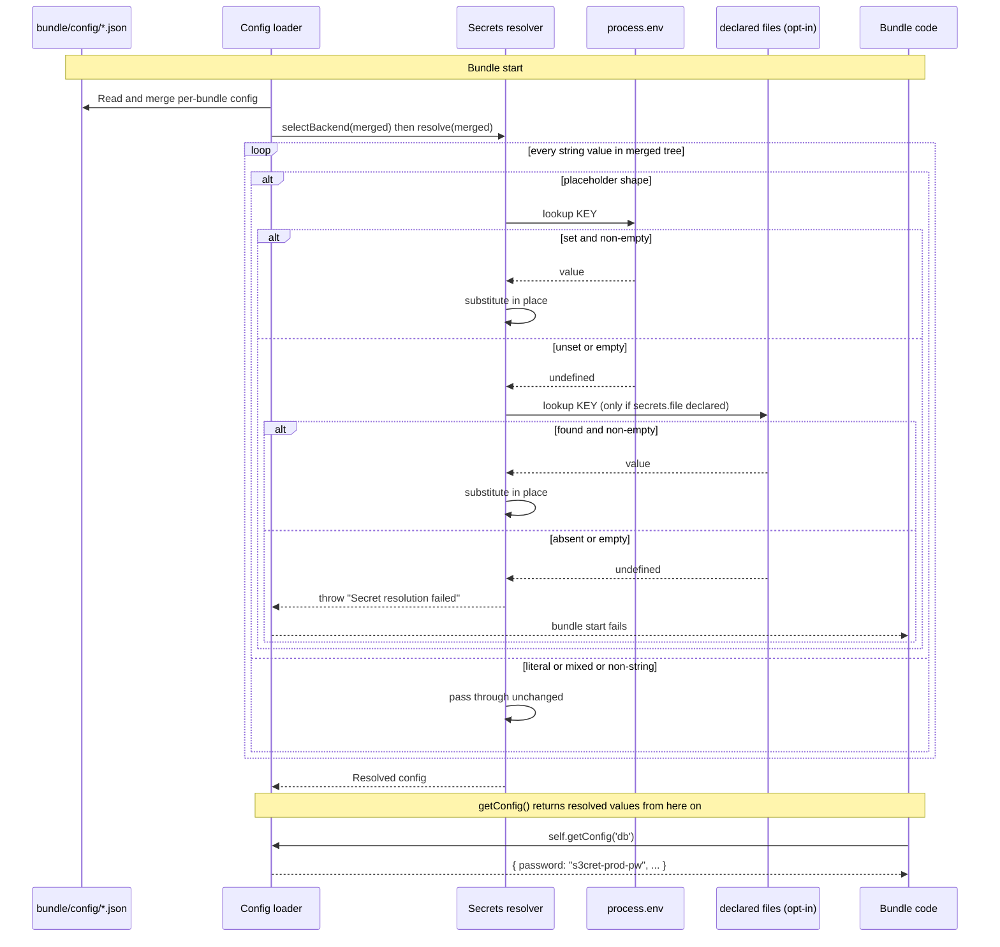

# Secrets in bundle config

Bundle config files (`<bundle>/config/*.json`) live in your repo as tracked
plaintext — perfect for non-sensitive values like ports, feature flags, or
template paths, but a problem for database passwords, API keys, signing
secrets, or any other value that must not appear in `git log`. Gina's
secrets resolver replaces those values with a `${secret:KEY}` placeholder
that the framework substitutes at config-load time — from `process.env[KEY]`
by default, and from
[declared files beneath it](#file-backed-secrets-settingssecretsfile) when a
bundle opts in.

The pattern is the standard 12-factor split:

- **Tracked config** declares the *shape* — which knobs exist, which
  fields the bundle expects, sensible defaults for non-sensitive values.
- **Environment** supplies the *values* — the runtime injects
  per-environment secrets via the deployment platform's native mechanism
  (Kubernetes Secret, ECS task-definition secrets, Cloud Run
  env-from-secret, SOPS + container entrypoint, Vault sidecar, etc.). This
  is the top tier and always wins; an opt-in file tier can only fill a gap
  it leaves.

Substitution runs **once per bundle** during the config-load cycle. After
the first pass, downstream consumers — `getConfig()` calls in controllers,
`self.getConfig(...)` inside controller actions, plugin / middleware code
that reads through the same `getConfig` API — see resolved values
transparently. There's nothing to wire up in your code.

---

## Syntax

A `${secret:KEY}` placeholder must be the **entire** value of a JSON
string field. The connectors registry is a typical adoption surface:

```json title="<bundle>/config/connectors.json"
{
  "$schema": "https://gina.io/schema/connectors.json",
  "myDb": {
    "connector": "couchbase",
    "protocol": "couchbase://",
    "host":     "localhost",
    "database": "api",
    "username": "appuser",
    "password": "${secret:COUCHBASE_PASSWORD}",
    "ping":     "2m"
  }
}
```

Per-environment overrides go in sibling files alongside the base
`connectors.json` — `connectors.dev.json`, `connectors.production.json`,
etc. — and need only contain the keys that differ from the base.
Placeholders are resolved in every variant before they merge into
`self.envConf`:

```json title="<bundle>/config/connectors.production.json"
{
  "myDb": {
    "host":     "cb.prod.internal",
    "password": "${secret:COUCHBASE_PASSWORD_PROD}"
  }
}
```

`KEY` must match `^[A-Z_][A-Z0-9_]*$` — uppercase letters, digits, and
underscores, starting with a letter or underscore (the standard env-var
name shape). At runtime:

```bash
export COUCHBASE_PASSWORD='s3cret-prod-pw'
gina bundle:start api @myproject
```

The connector then sees `password === 's3cret-prod-pw'` without any
additional code.

### Mixed-content strings pass through

The placeholder must be the **entire** string value. Anything else —
embedded, prefixed, suffixed — is returned unchanged:

```json
{
  "url": "https://${secret:DB_HOST}/path"
}
```

This value is **not** substituted. The framework treats it as a literal
string. The design avoids the ambiguity of "is the `{` here a
substitution attempt, or just literal JSON content the author intended?"
— if you need composition, build the string in your bundle code after
reading the resolved value:

```javascript
var conf = self.getConfig('db');
var url  = 'https://' + conf.host + '/path';
```

---

## How it works


```mermaid
sequenceDiagram
    participant F as bundle/config/*.json
    participant L as Config loader
    participant R as Secrets resolver
    participant E as process.env
    participant D as declared files (opt-in)
    participant A as Bundle code

    Note over F,A: Bundle start
    L->>F: Read and merge per-bundle config
    L->>R: selectBackend(merged) then resolve(merged)
    loop every string value in merged tree
        alt placeholder shape
            R->>E: lookup KEY
            alt set and non-empty
                E-->>R: value
                R->>R: substitute in place
            else unset or empty
                E-->>R: undefined
                R->>D: lookup KEY (only if secrets.file declared)
                alt found and non-empty
                    D-->>R: value
                    R->>R: substitute in place
                else absent or empty
                    D-->>R: undefined
                    R-->>L: throw "Secret resolution failed"
                    L-->>A: bundle start fails
                end
            end
        else literal or mixed or non-string
            R->>R: pass through unchanged
        end
    end
    R-->>L: Resolved config
    Note over L,A: getConfig() returns resolved values from here on
    A->>L: self.getConfig('db')
    L-->>A: { password: "s3cret-prod-pw", ... }
```

The resolver walks the merged config recursively — every object key,
every array element. It mutates the singleton in place, so all
downstream readers (`getConfig`, `Config#getInstance`, controller
`self.getConfig(...)`) see resolved values without further
substitution.

Resolution happens **once per bundle restart**. Mutating the
environment variable after the bundle has started does not affect any
already-resolved value — that's not a bug, it's the explicit contract.
Declared files are layered once in the same cycle, so editing one after
start is equally inert. See [Rotation](#rotation) below.

### One flat environment per process

The resolver's primary source is the **single, flat environment of the
bundle's own process** — that environment is `process.env`, plus the
framework's own environment for `GINA_`-prefixed names (see
[`GINA_`-prefixed key names](#gina_-prefixed-key-names) below). A bundle may
additionally declare [a file tier](#file-backed-secrets-settingssecretsfile)
beneath it, but the environment is always consulted first and always wins.

Within the environment itself there is no per-bundle and no per-scope
namespace. Two consequences worth knowing:

- **Per bundle.** The canonical deployment runs one bundle per container
  (`gina-container` is the container's foreground process), so each bundle
  gets its own injected environment and the *same* key name resolves to a
  per-bundle value automatically. Under a single local `gina start` daemon,
  every bundle instead inherits that one daemon environment — so if two
  co-hosted bundles need *different* values for the *same* logical secret
  there, give them **distinct key names** (`ADMIN_DB_PASSWORD`,
  `API_DB_PASSWORD`).
- **Per scope.** `scope` (`NODE_SCOPE`) is one runtime value per process. The
  config loader itself stays scope-agnostic — it reads a fixed
  `<bundle>/config/` and `shared/config/`, never a `config_<scope>/` sibling,
  and resolves once per `[bundle][env]`. (A declared secrets *file path* may
  still vary by scope, because it can embed `${scope}`; that is a path
  template, not a config-directory dimension.) Scope plays two roles, and
  neither requires the loader to be scope-aware:
    - As a **data-partition tag** (the `_scope` column and `$scope` query
      filter), local, beta, and production rows coexist behind the *same*
      connection, filtered at query time — here a scope change needs **no new
      secret**: the credentials are shared, only the visible rows differ.
    - As a **deployment-target marker**, a scope often maps to different
      infrastructure (a production cluster vs local) with its own
      credentials. The primary way to produce that difference is still at
      **deploy time** — deploy the scope-appropriate config and inject the
      scope-appropriate environment (`NODE_SCOPE` plus matching secrets),
      exactly as for per-bundle isolation. Where injecting an environment is
      not practical, a `${scope}`-templated entry in
      [`secrets.file`](#file-backed-secrets-settingssecretsfile) can select a
      per-scope file instead — a fallback beneath the environment, not a
      replacement for it.

Differentiating secrets by bundle or scope is still primarily the
**deployment layer's** job (per-container environment, `NODE_SCOPE` set per
deployment). The framework never *stores* a secret: it reads the process
environment, and — only when a bundle asks it to — a plaintext file the
deployment put on disk.

### `GINA_`-prefixed key names

The CLI keeps its own environment — `process.gina`, read through the
`getEnvVar()` global — and on start it **moves** every `GINA_*`, `USER_*` and
`VENDOR_*` variable there out of `process.env`. So in a CLI process a
`GINA_`-prefixed name is no longer in `process.env` by the time config loads.

Since `0.6.3` the resolver reads **the framework environment first, then
`process.env`**, so `${secret:GINA_MCP_AUTH_TOKEN}` and friends resolve in both
kinds of process. Two things follow:

- **You do not need to avoid `GINA_` prefixes.** Earlier releases effectively
  required it — a `GINA_`-named placeholder failed closed under any CLI-loaded
  config (`gina bundle:mcp-start`, `gina audit:verify`, the connector commands).
- **Nothing else changes.** A non-`GINA_` name is untouched by the move and
  resolves from `process.env` exactly as before.

---

## File-backed secrets (`settings.secrets.file`)

A bundle can declare one or more `.env`-style files to fall back on when a
key is not in the environment. It is opt-in: omit the block and resolution
behaves exactly as it always has.

```json title="<bundle>/config/settings.json"
{
  "secrets": {
    "file": [
      "${homedir}/secrets.env",
      "${homedir}/${scope}/secrets.env"
    ]
  }
}
```

### One chain for the whole project

Declaring it per bundle rarely makes sense — secrets are usually a property of
the *deployment*, not of one bundle. Put the block in the project's
`shared/config/settings.json` instead and **every bundle inherits it**:

```json title="shared/config/settings.json"
{
  "secrets": {
    "file": ["${homedir}/credentials/secrets.env"]
  }
}
```

That is the recommended shape. A bundle can still override it, and the rules
are worth knowing because two of them look alike and mean opposite things:

| The bundle's own `settings.json` | Effective chain |
| --- | --- |
| declares its own `secrets.file` | **the bundle's** — it replaces the shared one outright; the arrays do *not* concatenate |
| declares no `secrets` block | the shared one — inherited |
| declares `"secrets": {}` | the shared one — an empty block **does not** disable an inherited chain |
| declares `"secrets": { "file": null }` | **none** — this is the explicit opt-out |
| declares `"secrets": { "file": [] }` | **none** — an empty array disables the tier just like `null`, and warns at boot so it is not mistaken for "drop one layer" |

The pair to be careful with is `{}` against `null`: `{}` inherits, `null` opts out.

An empty **array** is the one shape that tends to surprise: emptying it to
remove a single layer removes the whole tier, not one entry. It is accepted
rather than refused — an empty list genuinely means "no files", and refusing
boot over it would turn a harmless config into an outage — but since `0.6.9`
it says so at boot. Prefer `null` when you mean to opt out.

Paths are written with the ordinary config tokens and may be a single string
instead of an array.

:::tip Declaring this for a containerised deployment?
The multi-entry form assumes a filesystem where both files can sit side by
side. A Kubernetes `Secret` does not layer, and most pipelines pick the
artifact by scope before it ever reaches the pod — so the right declaration
there is usually a single entry, or none at all. See
[Containers and Kubernetes](#containers-and-kubernetes).
:::

### The environment always wins

This is the opposite of what most `.env` tooling does, and the inversion is
deliberate. Every production mechanism for delivering a secret to a bundle —
a Kubernetes `envFrom: secretRef`, an ECS task-definition secret,
`sops exec-env`, a CI-exported variable — arrives through the environment. If
a file could win, a stale plaintext copy baked into an image would silently
shadow the credential the platform injected, and the bundle would run with
the wrong value while looking perfectly healthy. As a *fallback* a file can
only ever fill a gap.

Within the array, **later entries win over earlier ones**, so a shared base
file and a per-scope file combine naturally.

| Order | Source |
| --- | --- |
| 1 | Framework environment (`GINA_`-prefixed names) |
| 2 | `process.env` |
| 3 | Declared files, last entry first |
| — | otherwise: fail closed |

### What it does not do

**It does not decrypt.** Pointed at an encrypted file it yields ciphertext,
silently — the value will be wrong in a way nothing detects until whatever
consumes it fails. For SOPS, Vault or a KMS, keep decrypting at the container
entrypoint so the values land in the environment, which this tier already
prefers. See [At-rest encryption](#at-rest-encryption-deployment-side-note).

A network-backed backend (Vault, SOPS with a cloud KMS) is not simply
unimplemented — it is structurally blocked today. `lib/secrets` is fully
synchronous and the config loader holds a synchronous initialisation
contract, so such a backend would put a network round-trip inside a
synchronous boot path, where a KMS hiccup becomes a *hung* boot rather than a
failed one. The entrypoint decrypt is the right answer for those, and keeping
it there is what keeps a KMS call off the boot path.

### Behaviour worth knowing

- **A declared file that does not exist contributes nothing** and is not an
  error. A project may ship a base file and add the per-scope one only on
  some targets.
- **Resolution stays fail-closed.** A key in neither the environment nor any
  declared file still throws at bundle start.
- **Files are layered once per config-load cycle**, so editing one after the
  bundle has started changes nothing until a restart — the same contract as
  the environment.
- **Boot refuses loudly** on a non-string or empty entry, on a
  `${secret:…}` placeholder inside the path (the backend that would resolve
  it is the one being built), and on any `${…}` token the substitution pass
  did not know. Unknown tokens are preserved verbatim by design, so a typo
  would otherwise become a silent lookup for a literally-named file that
  never exists.
- **Keep declared files out of `git`.** They are plaintext by definition.
  Since `0.6.9` `gina project:add` writes a `.gitignore` when the project has
  none, carrying `.env`, `.env.*` and `*.env` (with `!.env.example` and
  `!*.example.env` so a sample can still be committed). All three forms are
  needed: a bare `.env` matches neither `secrets.env` nor `.env.production`.
  **Before `0.6.9` no `.gitignore` was scaffolded at all**, and the command
  never replaces one you already have — so on any project created earlier, or
  one that brought its own, verify the patterns yourself before committing.

#### The file syntax

A declared file is read the way a POSIX shell would `source` it — the same
file the container-entrypoint pattern (`set -a; . secrets.env; set +a`) feeds
into the environment. That is the point: one file, one meaning, whichever
route it arrives by.

```sh
# a whole-line comment
export DB_PASSWORD=s3cret        # a trailing comment is not part of the value
API_KEY="quoted value"
HASH_IN_VALUE=abc#def            # no space before '#', so this hash IS the value
SPACED_HASH="abc # def"          # quote it when the value contains ' #'
```

The rules, in the order they bite:

- A `#` starts a comment **only when preceded by whitespace and not inside
  quotes.** `abc#def` keeps its hash; `abc # note` does not.
- **Quoting is the escape hatch.** If a secret legitimately contains ` #`,
  wrap the value in single or double quotes and it is preserved intact.
- `KEY= # comment` is therefore an **empty** value — and an empty value counts
  as unset, so the placeholder fails closed and `secrets:check` reports the
  key `UNSET`.
- A leading `export ` is ignored, the key is everything before the first `=`,
  and a later duplicate key wins.

:::caution Two shapes where this is *not* a shell
`KEY = value` (spaces around the `=`) is accepted here and trimmed, while a
shell would try to execute `KEY`. And `KEY="a"b"` yields `a"b` here where a
shell concatenates to `ab`. Neither is worth writing deliberately — quote any
value whose meaning could depend on shell word-splitting.
:::

#### Checking files written before this rule

Earlier releases kept a trailing comment as part of the value, so a file
written against them can change meaning on upgrade. The case worth finding is
`KEY= # comment`: it now resolves **empty**, and an empty value counts as
unset — so the placeholder fails closed at bundle start and `secrets:check`
reports the key `UNSET` where it previously reported `SET`.

Run this against every file you declare in `secrets.file`, and anything you
pass to `secrets:check --env-file`:

```sh
grep -nE '^[[:space:]]*(export[[:space:]]+)?[A-Za-z_][A-Za-z0-9_]*=.*[[:space:]]#' <file>
```

Reading the result:

- **No hits — nothing to do.**
- **A hit is not automatically a break.** It also flags values whose hash is
  quoted (`KEY="a # b"`) or that carry both a hash and a comment
  (`KEY=abc#def # note`), and those parse identically before and after. Check
  whether the hash is quoted (safe) or bare (its value changes).
- If a value genuinely contains ` #`, **quote it** — that is the supported
  form, not a workaround.

:::tip Use this pattern as written
A narrower variant using `[^#]*` in place of `.*` looks equivalent and is not:
it silently misses values containing a double quote on some `grep` builds
(measured: `ugrep` skips `KEY="abc" # note`, which GNU and BSD `grep` both
find). For a check whose whole purpose is to be trusted when it returns
nothing, the broader pattern is the safe one.
:::

---

## Fail-closed semantics

If a `${secret:KEY}` placeholder cannot be resolved — it is unset or empty in
the environment, and absent or empty in every declared file — the resolver
throws:

```text
Error: Secret resolution failed
```

The error surfaces during bundle start, before any request is handled.
**The error message intentionally does not include the key name.**
Logging the missing key on a user-facing surface (HTTP 500 body, stderr
on a shared host) would defeat the point of keeping secrets out of
visible content. The framework's internal logger has access to the key
via a non-enumerable `_ginaSecretKey` annotation on the thrown Error for
diagnostic logging only — it never reaches user-visible output.

The strictness is deliberate: silent empty-string substitution masks
configuration mistakes that would otherwise surface much later (and
much more confusingly) — a database connect failing with an
empty-password error two layers deep, or worse, a route handler that
"works" by treating an empty value as anonymous auth.

---

## Adoption

Three steps for an existing bundle:

### 1. Inventory sensitive fields

Grep your bundle config for plaintext credentials:

```bash
grep -rE 'password|secret|key|token|api_key' bundle/config/
```

For every match: if the value should not appear in `git log`, it's a
candidate for a placeholder.

### 2. Rewrite values as placeholders

Replace each plaintext value with a `${secret:KEY}` placeholder. Pick
key names that match the field's role (`DB_PASSWORD`, `STRIPE_API_KEY`,
`JWT_SIGNING_SECRET`). Per-environment values use the same key name in
all environments — your deployment platform supplies the per-environment
value:

```diff
 {
   "production": {
     "stripe": {
-      "apiKey": "sk_live_redacted...",
+      "apiKey": "${secret:STRIPE_API_KEY}",
       "webhookEndpoint": "/webhooks/stripe"
     }
   }
 }
```

The `webhookEndpoint` field stays as plaintext — it's not sensitive.

### 3. Supply the values at runtime

The primary path is your deployment platform's native secret-injection
mechanism, which populates `process.env`:

- **Kubernetes:** `envFrom: secretRef` on the bundle's Pod / Deployment
  spec — the Secret object holds the values; the framework reads them
  via `process.env`.
- **Docker Compose (local dev):** an `.env` file gitignored at the
  project root, sourced by Compose before `gina bundle:start`. Never
  commit `.env`.
- **ECS / Fargate:** `secrets` block in the task definition pointing
  to AWS Secrets Manager or SSM Parameter Store entries.
- **Cloud Run:** `--update-secrets ENV_VAR=secret-name:latest`.
- **systemd / bare metal:** an `EnvironmentFile=` directive pointing
  to a decrypt step's output, with the decrypt happening at unit start.
- **CI / CD:** the platform's native secret store (GitHub Actions
  Secrets, GitLab CI variables) injected as env at runtime.

The framework does not care which mechanism you pick — it reads the
environment those mechanisms populate. Where injecting an environment is
impractical, a bundle can additionally declare
[`secrets.file`](#file-backed-secrets-settingssecretsfile) to fall back on a
plaintext file the deployment placed on disk; the environment still wins, so
adding it never changes what an injected value resolves to.

Encryption-at-rest remains the deployment layer's concern, not the
framework's — the file tier does not decrypt.

### 4. Rotate any plaintext that previously lived in `git log`

The placeholder pattern protects **future** values. Anything that was
plaintext in git history — even a stale value from a long-deleted
commit — is still discoverable via `git log -p`. After adopting the
resolver, rotate every secret that was historically plaintext, since
the rotation invalidates the old value wherever it leaked.

---

## Inspecting required secrets

Two read-only CLI commands answer "which secrets does this bundle need,
and are they set?" — without resolving, and therefore without ever
exposing, a single value. They never read a secret's value, never write
anything, and never touch a running bundle. Use `secrets:scan` while
adopting the pattern (step 1 above) and `secrets:check` as a pre-deploy
gate.

### `secrets:scan` — discover required keys

`scan` walks each bundle's `<src>/config/*.json` plus the project's
`shared/config/*.json`, then reports every `${secret:KEY}` placeholder it
finds, grouped by the config file that declares it:

```bash
$ gina secrets:scan @myproject

@myproject:
  demo:
    Required secrets (3):
      API_KEY          <-  src/demo/config/settings.json
      DB_PASSWORD      <-  src/demo/config/connectors.json
      STRIPE_API_KEY   <-  shared/config/app.json
```

Scope it to one bundle with `gina secrets:scan <bundle> @myproject`, or
omit the project to scan every registered project. Add `--format=json`
for tooling. Only **bare** placeholders are reported — a mixed-content
string like `"https://${secret:API_HOST}/v1"` is not a placeholder
(see [Mixed-content strings pass through](#mixed-content-strings-pass-through))
and is not listed, mirroring exactly what the resolver would substitute.

### `secrets:check` — verify the environment before deploy

`check` runs the same enumeration, then cross-references the **current**
`process.env`, marking each key `SET` or `UNSET`:

```bash
$ export DB_PASSWORD=... API_KEY=...   # STRIPE_API_KEY left unset on purpose
$ gina secrets:check @myproject

@myproject:
  demo:
      API_KEY          SET     env
      DB_PASSWORD      SET     env
      STRIPE_API_KEY   UNSET
    (3 required: 2 set, 1 unset)

$ echo $?
1
```

`check` **exits non-zero when any required key is unset**, so it gates a
CI / pre-deploy step: export the secrets, run `secrets:check`, and fail
the pipeline before shipping a bundle that would crash at start. A key
counts as `SET` only when it is a **non-empty string** — the same
condition under which the resolver succeeds — so an `UNSET` here is
precisely a key that would throw `Secret resolution failed` at bundle
start.

`check` reads the **same two tiers the runtime reads, in the same order**:
the environment first, then any file the bundle declares in
[`secrets.file`](#file-backed-secrets-settingssecretsfile). When a chain is
declared, the report lists it, marks each layer `loaded` or `ABSENT`, and
names the tier each key came from — so a `SET` sourced from a plaintext file
on the local disk is never mistaken for one your deployment will inject:

```bash
$ gina secrets:check @myproject --scope=production

@myproject (scope: production):
  demo:
    settings.secrets.file (assuming scope=production, env=prod):
      [1] /home/deploy/.myproject/secrets.env              loaded (2 keys)
      [2] /home/deploy/.myproject/production/secrets.env   ABSENT
      API_KEY          SET     env
      DB_PASSWORD      SET     file[1]
      STRIPE_API_KEY   UNSET
    (3 required: 2 set, 1 unset)
```

:::note What `check` can and cannot see
`check` validates the environment of the **CLI process you run it in** — a
CI runner that exported the secrets, or a shell that sourced the same env
file. It cannot introspect the environment of an already-running, detached
bundle (a different process, often in a different container).

For the same reason it cannot know a detached bundle's `NODE_SCOPE` /
`NODE_ENV`. Those are set by whatever launches the bundle, so when a declared
path embeds `${scope}` or `${env}` the report **names the values it assumed**
(`--scope` / `--env` override them). If a token cannot be resolved at all,
the file tier is reported and skipped rather than opened blindly — that can
only make the gate stricter than the runtime, never laxer.

And `scan` reports the placeholders **authored on disk**, not a merged
runtime config — correct for the placeholder model, where every
`${secret:KEY}` is an authored literal.
:::

**Per-scope deploys.** If you keep per-scope config in sibling `config_<scope>/`
directories that your deploy merges, `secrets:scan --scope=<s>` and
`secrets:check --scope=<s>` read-only overlay those dirs over the base config
(deep-merge, scope wins) so the report reflects the *effective* secrets that
scope's deploy needs; and `secrets:check --env-file=<path>` stands in for the
live `process.env` with a decrypted/exported env file (e.g. a SOPS output).
Because `--env-file` occupies the environment tier, it still wins over a
declared `secrets.file`. The runtime loader stays scope-agnostic **about
config directories** — it never reads a `config_<scope>/` sibling, so this
part only inspects what your deploy applies. See the
[secrets CLI reference](/cli/cli-secrets).

Run `gina secrets:help` for the full command reference.

---

## Rotation

Resolution happens at bundle start. A rotated env var requires a **new
process** to be picked up:

| Platform | Action |
| -------- | ------ |
| Kubernetes | Roll the Deployment (`kubectl rollout restart deployment/<name>`) — the new Pod's container starts with the rotated env. |
| Docker / Compose | `docker compose up -d --force-recreate <service>` |
| systemd | `systemctl restart <unit>` |
| Bare process | `gina bundle:stop` then `gina bundle:start` (or a `bundle:restart` that re-spawns under a fresh entrypoint — see [Bundle CLI](/cli/cli-bundle)) |

A `gina bundle:restart` under an existing supervisor inherits the
supervisor's env from the original container init — to pick up a
rotated env var, the **container itself** must restart (re-running the
entrypoint). This is OS/Node-level behavior, not framework-specific,
and applies symmetrically to plain Node processes outside Gina.

---

## At-rest encryption (deployment-side note)

**Do not put encrypted-at-rest content inside `<bundle>/config/`.** The
framework's config-load path tries to JSON-parse every `.json` file in
that directory; formats that decorate JSON with metadata blocks (SOPS,
encrypted git-crypt blobs that survive as `.json` extensions, etc.)
trip the parser before the resolver ever runs.

:::danger Nor point `secrets.file` at an encrypted file
That failure is louder than the one it looks like. A malformed `.json` in the
config dir at least *crashes* the parser; a `secrets.file` entry aimed at
ciphertext is parsed as an ordinary `.env` file and yields **ciphertext as
the secret value, silently**. Nothing detects it until whatever consumes the
credential fails, somewhere far from the cause. The file tier does not
decrypt — decrypt at the entrypoint, as below.
:::

Keep encryption-at-rest out of the bundle's config dir. Populate
`process.env` from a decrypt step at container entrypoint — which is also
where SOPS, Vault and KMS belong, since a network-backed backend inside the
framework's synchronous boot path would turn a KMS hiccup into a hung boot.
A few common shapes:

```bash title="entrypoint.sh (SOPS example)"
#!/bin/sh
# Decrypt the encrypted env file (mounted as a Secret / volume), source it,
# then exec the bundle. The decrypted values live in this process only.
sops -d /etc/secrets/env.enc > /tmp/env.sh
. /tmp/env.sh
rm /tmp/env.sh
exec gina-container api @myproject
```

`gina-container` takes `<bundle> @<project>` positional arguments —
see [K8s & Docker](/guides/k8s-docker) for the full container-runtime
shape.

The framework reads the environment by the time it loads bundle config —
and, if the bundle declares one, the file tier beneath it. Storage remains
fully decoupled either way.

---

## Containers and Kubernetes {#containers-and-kubernetes}

The file tier is designed for a **filesystem-shaped** deployment: a host, a
VM, a bind-mounted dev tree — somewhere a base file and a per-scope file can
sit side by side and be layered. Container platforms often are not shaped that
way, so a chain that is right on a laptop can be the wrong declaration in a
cluster.

### A Kubernetes Secret does not layer

A `Secret` is a flat key→value map, and `subPath` projects **one key as one
file**. A nested `credentials/<scope>/secrets.env` layout is not expressible
from a single Secret, and most pipelines already choose the artifact by scope
at push time rather than merging two of them.

So in a cluster, prefer a **single-entry chain** — or no chain at all, keeping
the entrypoint-to-environment route below. The multi-entry form buys nothing
where the platform has already selected the artifact.

:::caution `subPath` is not optional here
Without `subPath` the mount is a **directory**, so a guard like
`[ -f /run/secrets.env ]` silently no-ops and the container starts with
nothing loaded. That surfaces later as a fail-closed resolution error a long
way from its cause.
:::

### Do not materialise a merged file

It is tempting to have the framework (or an init script) merge the layers into
one file at start. Don't:

- **Secret volumes are read-only**, and bind mounts carrying secrets normally
  are too — there is nowhere correct to write.
- On a bind mount, a container writing there puts **plaintext secrets onto the
  host filesystem**, outside whatever manages them.
- Services sharing the mount would race to produce the same file at boot.
- It goes stale the moment a source changes, reintroducing a cache-invalidation
  problem the resolve-once-per-process contract deliberately avoids.
- And it makes the framework a secrets **store**, which is precisely what it
  stays out of.

### Source the layers in order instead — the shell is the merge

Sourcing two files in sequence gives the *same* later-wins precedence as the
chain, with no intermediate artifact:

```bash title="entrypoint.sh — layered, no merged file"
#!/bin/sh
for f in /run/secrets/base.env /run/secrets/"${NODE_SCOPE}".env; do
    [ -f "$f" ] || continue
    set -a; . "$f"; set +a
done
exec gina-container api @myproject
```

This works unchanged on Docker or Podman (two bind mounts, or one directory
mount) and on Kubernetes (two `subPath` mounts, or two keys in one Secret).
Nothing is written, so read-only mounts are fine.

It also lands the values in the **environment** — the top tier — so they
outrank any declared file chain and there is never a question about which
source won.

### If you do want one artifact per scope

Build it **host-side, in the tooling that already decrypts**. That is the
deployment layer doing its job: it is already scope-aware, runs with the right
ownership, and lets the container keep a single-file mount. The framework
never needs to know.

---

## `getResolvedPaths()` (advanced)

`lib/secrets` tracks the dotted paths it substituted during the walk
via an internal `WeakMap`. The list is queryable for tooling — for
example a debug-export tool, or a config-audit that wants to know
"which fields originated as secrets?":

```javascript
var secrets = require('lib/secrets');

var conf = {
    db   : { password: '${secret:DB_PASSWORD}' },
    items: ['${secret:K1}', 'literal'],
    port : 8080
};

process.env.DB_PASSWORD = 'pw';
process.env.K1          = 'va';

secrets.resolve(conf);
secrets.getResolvedPaths(conf);
// → ['db.password', 'items[0]']
```

Paths use dotted notation for object keys (`'db.password'`) and
bracketed indices for array elements (`'items[0]'`). The list is the
field-path only — never the resolved value, so logging it is safe.

You typically don't need to call this directly — the framework's
internal hook in `loadBundleConfig` handles substitution
transparently.

:::note Scope — this is not a redaction hook
It is tempting to read this accessor as a substrate for masking secrets in
logs or developer tooling, and it will not serve that purpose. Two limits,
either one sufficient: the paths address **that config object** and no
other, and the lookup is keyed on the object's **identity**, so a caller
must hold the very object `resolve()` mutated — a structural clone
(`JSON.parse(JSON.stringify(conf))`) returns an empty list. A surface that
holds *values* rather than the config therefore cannot use it; masking
there needs a value-based pass, which is why connector bind-parameter
redaction is a separate mechanism rather than an extension of this one.
:::

---

## Out of scope (this iteration)

Things the resolver deliberately does **not** do:

- **Network-backed backends** (Vault, SOPS with a cloud KMS, a K8s Secrets
  API client). The backend seam exists and the opt-in
  [file tier](#file-backed-secrets-settingssecretsfile) ships on it, but a
  network-backed one is **structurally blocked**, not merely unwritten:
  `lib/secrets` is fully synchronous and the config loader holds a
  synchronous initialisation contract, so such a backend would put a network
  round-trip inside a synchronous boot path — where a KMS hiccup becomes a
  *hung* boot rather than a failed one. Decrypt at the container entrypoint
  instead; that is the supported answer, not a workaround.
- **Decryption of any kind.** The file tier reads plaintext. Pointed at
  ciphertext it yields ciphertext, silently.
- **Mixed-content substitution** like `'prefix-${secret:KEY}-suffix'`.
  Either rewrite the composition into bundle code, or wait for a
  future iteration that takes a closer look at the ambiguity question.
- **Dynamic re-resolution per request.** Substitution runs once at
  config-load time. Rotation needs a process restart.
- **Encrypted-at-rest storage.** Handled at the deployment layer (see
  above). The framework never stores a secret — it reads the environment,
  and only if a bundle opts in, a plaintext file the deployment placed on
  disk.

---

## Framework integration

Three framework surfaces participate in the placeholder story today:

| Surface | How the resolver flows through |
| ------- | ------------------------------ |
| Bundle JSON configs under `<bundle>/config/*.json` and `shared/config/*.json` | Resolved by `core/config.js::loadBundleConfig` after the per-bundle merge. It first selects the backend (env-only, or env-over-file when the bundle declares `secrets.file`) as its own step, so an invalid `secrets` block reports as a config error rather than as a missing secret; then it resolves. Every read via `getConfig` / `self.getConfig(...)` / `Config#getInstance` sees resolved values. |
| `gina.plugins.Csrf()` HMAC secret | Reads from `settings.json > csrf.secret` first (placeholder-compatible — `lib/secrets` fills the placeholder at config-load time), with fallback to `process.env.GINA_CSRF_SECRET` for back-compat. See [CSRF Protection](/guides/csrf). |
| `mcp.json > server.authToken` for `gina bundle:mcp-start` | The cmd handler reads `mcp.json` outside the bundle-config load path, so it explicitly calls `secrets.resolve(mcpDoc)` after the parse. `${secret:KEY}` placeholders in `mcp.json` get filled before downstream readers pick them up. Fallback to `process.env.GINA_MCP_AUTH_TOKEN` stays in place. Since `0.6.3` the `GINA_`-prefixed placeholder resolves here too — this is a CLI process, so before then it always failed closed. **This route is environment-only:** because it runs outside the bundle-config load path it does not select a backend, so a bundle's `secrets.file` does **not** apply to `mcp.json`. The same holds for the connector commands (`connector:infer` / `connector:test` / `connector:models`), which resolve a `connectors.json` entry directly. Keep any secret those paths need in the environment. |

Bundle-author code that consumes secrets via `self.getConfig(...)` is
covered automatically — whatever JSON file you put the placeholder in
flows through the same resolver. Code that reads `process.env`
directly does not — adopt the placeholder pattern by routing the read
through a config slot.

`gina.plugins.Session()` (the cookie-hardening session wrapper) does
not own a session-signing secret of its own — the bundle's `index.js`
passes the secret into `expressSession(...)`. To bring that secret
under the placeholder story, read it via `self.getConfig('session').secret`
with a `bundle/config/session.json` like `{"secret": "${secret:SESSION_SECRET}"}`.
See [Sessions](/guides/sessions).

---

## See also

- [Sessions](/guides/sessions) — session signing secret participates
  when read via `self.getConfig('session').secret`.
- [CSRF Protection](/guides/csrf) — the new `settings.csrf.secret`
  slot is placeholder-compatible; `process.env.GINA_CSRF_SECRET`
  remains the back-compat fallback.
- [settings.json reference](/reference/settings) — config layout for
  framework-level settings.
- [Scopes](/concepts/scopes) — how per-environment config slices are
  composed before the resolver runs.
