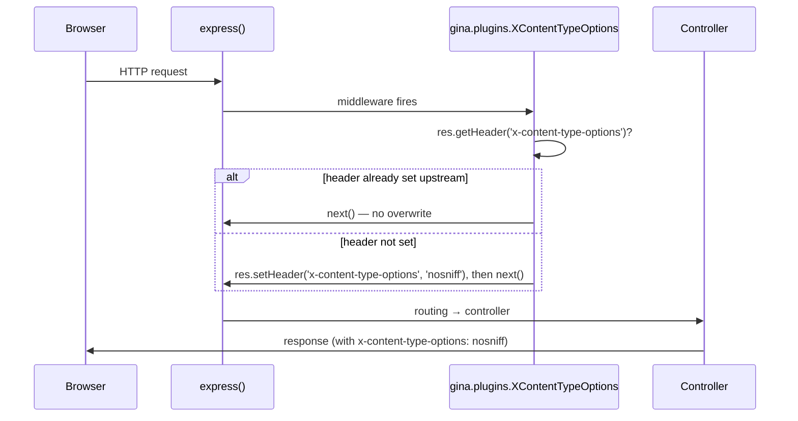

# Security Headers

Opt-in `gina.plugins.*` middlewares that emit individual HTTP security response headers. Each plugin is single-concern, opt-in by default-off, and reads its configuration from a flat top-level `settings.json` key. Native implementation — no `helmet` dependency.

The pattern mirrors the existing `Session` ([#CSRF1](/guides/sessions#hardened-cookie-defaults)) and `Csrf` ([#CSRF2/#CSRF3](/guides/csrf)) plugin shape: import via `gina.plugins.<Name>`, mount via `app.use(...)`, configure via `settings.json`. Bundles that don't adopt these plugins continue to work unchanged.

## How it works



Each plugin is idempotent — if an earlier middleware already set the header, the existing value is preserved and `next()` is called immediately. First-writer-wins. Safe to stack with helmet-style upstream gates or with multiple registrations of the same plugin.

## X-Content-Type-Options (`#HDR1`)

`gina.plugins.XContentTypeOptions()` emits `X-Content-Type-Options: nosniff` on every response. The header instructs browsers to honour the declared `Content-Type` strictly, blocking MIME-sniffing attacks where a `text/plain` response whose body starts with `<script>` could be upgraded to HTML and the script executed in the page's origin.

### Adoption

One block in the bundle bootstrap:

```js title="src/<bundle>/index.js"
var myapp               = require('gina');
var xContentTypeOptions = require('gina').plugins.XContentTypeOptions();

myapp.onInitialize(function(event, app) {
    app.use(xContentTypeOptions);
    event.emit('complete', app);
});
```

Order with other gina security plugins does not matter — the header is emitted on the response, not consumed from the request.

### Configuration

```jsonc title="src/<bundle>/config/settings.json"
{
  "xContentTypeOptions": {}
}
```

The block is reserved for future fields (e.g. per-route opt-out). Today the plugin has no tunable options — the only valid header value is `nosniff` per RFC 7034 and the WHATWG Fetch Standard. There is no `enabled` flag; register the plugin to opt in, do not register to opt out.

### Failure modes

| Condition                                                | Outcome                                  |
|----------------------------------------------------------|------------------------------------------|
| Plugin not registered                                    | Header not emitted; browser may sniff    |
| Header already set by an earlier middleware              | Existing value preserved (idempotent)    |
| Response already sent (`res.headersSent === true`)       | Node's `setHeader` no-ops; request resumes |

## X-Frame-Options (`#HDR2`)

`gina.plugins.XFrameOptions({ value })` emits the `X-Frame-Options` response header on every response, defending against clickjacking by controlling whether the page may be rendered inside a `<frame>`, `<iframe>`, `<embed>` or `<object>`. The browser refuses to render the page inside a frame at all (`DENY`) or only when the framing page shares the same origin (`SAMEORIGIN`).

`Content-Security-Policy: frame-ancestors` is the modern replacement (more expressive, cross-browser since ~2015), but `X-Frame-Options` is still emitted by every defensive HTTP stack because legacy clients and some intermediaries honour the older header and ignore CSP.

### Adoption

One block in the bundle bootstrap:

```js title="src/<bundle>/index.js"
var myapp         = require('gina');
var xFrameOptions = require('gina').plugins.XFrameOptions();

myapp.onInitialize(function(event, app) {
    app.use(xFrameOptions);
    event.emit('complete', app);
});
```

### Configuration

```jsonc title="src/<bundle>/config/settings.json"
{
  "xFrameOptions": {
    "value": "SAMEORIGIN"
  }
}
```

| Field   | Type   | Default       | Valid values            |
|---------|--------|---------------|-------------------------|
| `value` | string | `SAMEORIGIN`  | `DENY` or `SAMEORIGIN`  |

Caller-supplied options always win over settings:

```js
var xFrameOptions = require('gina').plugins.XFrameOptions({ value: 'DENY' });
```

Values are normalised to uppercase before validation — `"deny"` is accepted and emitted as `DENY`.

### Rejected: `ALLOW-FROM <uri>`

The legacy `ALLOW-FROM <uri>` value is rejected at factory call time. Modern browsers ignore it: Chrome / Edge / Safari never supported it, Firefox dropped it in 70 (October 2019). Use `Content-Security-Policy: frame-ancestors <source-list>` instead — it works cross-browser and accepts richer source expressions.

The factory throws with a message pointing at the [MDN reference for `frame-ancestors`](https://developer.mozilla.org/en-US/docs/Web/HTTP/Headers/Content-Security-Policy/frame-ancestors).

### Failure modes

| Condition                                                | Outcome                                              |
|----------------------------------------------------------|------------------------------------------------------|
| `value` omitted                                          | Defaults to `SAMEORIGIN`                             |
| `value` is not "DENY" or "SAMEORIGIN" (or alias of)      | Factory throws at call time (bundle won't start)     |
| `value` starts with `ALLOW-FROM`                         | Factory throws with dedicated `frame-ancestors` hint |
| Plugin not registered                                    | Header not emitted; page is framable by any origin   |
| Header already set by an earlier middleware              | Existing value preserved (idempotent)                |
| Response already sent (`res.headersSent === true`)       | Node's `setHeader` no-ops; request resumes           |

## Referrer-Policy (`#HDR3`)

`gina.plugins.ReferrerPolicy({ value })` emits the `Referrer-Policy` response header on every response, controlling how much referrer information the browser includes when navigating away from the page or fetching sub-resources. The `Referer` request header reveals the previous page's URL — including path and query string — to the destination, which can leak sensitive information: session tokens in URLs, internal page paths, account IDs, search queries.

Modern browsers (Chrome 85+, Firefox 87+, Safari 14.5+, Edge 85+) default to `strict-origin-when-cross-origin` since ~2021 — a sensible privacy / compatibility balance. Emitting the header explicitly locks the policy in regardless of the user's browser default and signals intent.

### Adoption

One block in the bundle bootstrap:

```js title="src/<bundle>/index.js"
var myapp          = require('gina');
var referrerPolicy = require('gina').plugins.ReferrerPolicy();

myapp.onInitialize(function(event, app) {
    app.use(referrerPolicy);
    event.emit('complete', app);
});
```

### Configuration

```jsonc title="src/<bundle>/config/settings.json"
{
  "referrerPolicy": {
    "value": "strict-origin-when-cross-origin"
  }
}
```

| Field   | Type   | Default                              | Valid values         |
|---------|--------|--------------------------------------|----------------------|
| `value` | string | `strict-origin-when-cross-origin`    | One of the 8 tokens  |

The eight valid tokens per the [W3C Referrer Policy spec](https://www.w3.org/TR/referrer-policy/):

| Token                                | Behaviour                                                            |
|--------------------------------------|----------------------------------------------------------------------|
| `no-referrer`                        | Never send the Referer header.                                       |
| `no-referrer-when-downgrade`         | Strip Referer only on HTTPS→HTTP. Pre-2021 browser default.          |
| `origin`                             | Send origin only (no path / query).                                  |
| `origin-when-cross-origin`           | Full Referer same-origin; origin only cross-origin.                  |
| `same-origin`                        | Send Referer only on same-origin requests.                           |
| `strict-origin`                      | Send origin only; no Referer at all on HTTPS→HTTP.                   |
| `strict-origin-when-cross-origin`    | **Default**. Full Referer same-origin; origin only cross-origin; no Referer on HTTPS→HTTP. |
| `unsafe-url`                         | Always send the full URL. **Dangerous** — leaks paths and queries.   |

Caller-supplied options always win over settings:

```js
var referrerPolicy = require('gina').plugins.ReferrerPolicy({ value: 'no-referrer' });
```

Tokens are case-insensitive per the spec — values are normalised to lowercase before validation and emission (so `"NO-REFERRER"` is accepted and emitted as `no-referrer`). Invalid tokens throw at factory call time with the full eight-token list + W3C spec URL in the message.

### Choosing a policy

- **Sites that handle authenticated user data** — `strict-origin-when-cross-origin` (default) or `same-origin`. The default leaks no path / query info cross-origin, which protects most session-token-in-URL anti-patterns.
- **Privacy-focused sites** — `no-referrer`. Maximum privacy at the cost of breaking some analytics flows that rely on referrer attribution.
- **Public marketing / documentation sites** — `strict-origin-when-cross-origin` is also a good default; only use `origin-when-cross-origin` if you have a specific cross-origin partner that needs full path info.
- **Never use `unsafe-url`** unless you've confirmed that every URL the page can link out to is safe to leak in full.

### Failure modes

| Condition                                                | Outcome                                              |
|----------------------------------------------------------|------------------------------------------------------|
| `value` omitted                                          | Defaults to `strict-origin-when-cross-origin`        |
| `value` is not one of the 8 W3C tokens                   | Factory throws at call time (bundle won't start)     |
| Plugin not registered                                    | Header not emitted; browser uses its built-in default |
| Header already set by an earlier middleware              | Existing value preserved (idempotent)                |
| Response already sent (`res.headersSent === true`)       | Node's `setHeader` no-ops; request resumes           |

## HSTS (`#HDR4`)

`gina.plugins.Hsts({ maxAge, includeSubDomains, preload })` emits the `Strict-Transport-Security` response header on every response, instructing browsers to access the host exclusively over HTTPS for the next `maxAge` seconds. Once a browser receives a valid HSTS policy from a host, it refuses to make plain HTTP requests to that host for the duration — attempts get upgraded to HTTPS before the network even sees them. This defeats SSL-stripping attacks where an active MITM intercepts the client's first HTTP request and prevents it from ever escalating to HTTPS.

### Adoption

One block in the bundle bootstrap:

```js title="src/<bundle>/index.js"
var myapp = require('gina');
var hsts  = require('gina').plugins.Hsts();

myapp.onInitialize(function(event, app) {
    app.use(hsts);
    event.emit('complete', app);
});
```

### Configuration

```jsonc title="src/<bundle>/config/settings.json"
{
  "hsts": {
    "maxAge":            15552000,
    "includeSubDomains": false,
    "preload":           false
  }
}
```

| Field               | Type    | Default     | Notes                                      |
|---------------------|---------|-------------|--------------------------------------------|
| `maxAge`            | number  | `15552000`  | Seconds. Default = 180 days.               |
| `includeSubDomains` | boolean | `false`     | Apply HSTS to all sub-domains too.         |
| `preload`           | boolean | `false`     | Opt into the HSTS preload list.            |

Caller-supplied options always win over settings:

```js
var hsts = require('gina').plugins.Hsts({
    maxAge:            63072000,
    includeSubDomains: true,
    preload:           true
});
```

### Browser-parity invariant on `preload`

`preload: true` requires `includeSubDomains: true` AND `maxAge >= 31536000` (1 year) per the [HSTS preload-list submission requirements](https://hstspreload.org/#deployment-recommendations). The factory throws at call time when the combination is invalid:

```
[gina.plugins.Hsts] preload=true requires includeSubDomains=true per the
HSTS preload-list submission requirements — see
https://hstspreload.org/#deployment-recommendations
```

```
[gina.plugins.Hsts] preload=true requires maxAge>=31536000 (1 year)
per the HSTS preload-list submission requirements; received
maxAge=15552000. See https://hstspreload.org/#deployment-recommendations
```

The HSTS preload list is the browsers' hard-coded HSTS database. Once your hostname is in it, all browsers treat HSTS as active from the moment they install the browser update, regardless of whether they've ever fetched a response from your host. Removal takes months and isn't guaranteed — opting in is a one-way operation in practical terms.

### Choosing values

- **`maxAge`** — start small (`300` = 5 minutes) during initial rollout to bound the blast radius of a mistake; ramp to `15552000` (180 days) for steady state; `63072000` (2 years) is the conventional value for preload-list submission.
- **`includeSubDomains`** — only enable if you're certain *every* sub-domain (including ones added in the future) will be HTTPS-only. Common foot-gun: `app.example.com` enabling `includeSubDomains` and breaking `legacy.example.com` that's stuck on HTTP.
- **`preload`** — only opt in once you've run stable in steady-state for weeks, audited every sub-domain, and accepted that removal is slow.

### Spec note — transport gating

This plugin emits the header on every response regardless of transport. RFC 6797 §7.2 says "An HSTS Host MUST NOT include the STS header field in HTTP responses conveyed over non-secure transport". However, §8.1 also says the user agent "MUST ignore any present STS header field(s)" received over insecure transport — the receiver enforces the policy correctly regardless of what the server sends.

The plugin's design favours proxy-deployment robustness (no dependency on `x-forwarded-proto` being preserved by intermediaries) over sender-side spec purity. helmet's `Strict-Transport-Security` middleware takes the same approach, so adopters migrating from helmet see identical wire behaviour. Bundles that need strict §7.2 compliance can simply not register the plugin in non-HTTPS bundles.

### Failure modes

| Condition                                                | Outcome                                              |
|----------------------------------------------------------|------------------------------------------------------|
| All fields omitted                                       | Emits `max-age=15552000`                             |
| `maxAge` is not a non-negative integer                   | Factory throws at call time                          |
| `preload=true` with `includeSubDomains=false`            | Factory throws with hstspreload.org pointer          |
| `preload=true` with `maxAge<31536000`                    | Factory throws with hstspreload.org pointer          |
| `maxAge=0`                                               | Emits `max-age=0` (clears existing HSTS policy)      |
| Plugin not registered                                    | Header not emitted; browser uses no HSTS policy      |
| Header already set by an earlier middleware              | Existing value preserved (idempotent)                |
| Response already sent (`res.headersSent === true`)       | Node's `setHeader` no-ops; request resumes           |

## Content-Security-Policy (`#HDR5`)

`gina.plugins.Csp({ directives, reportOnly })` emits the `Content-Security-Policy` (or `Content-Security-Policy-Report-Only`) response header on every response, limiting which resources the browser is allowed to load and from where. CSP is the modern defense against cross-site scripting (XSS) and data injection — by declaring an allowlist of permitted source origins for scripts, styles, images, fonts, frames, and connections, the browser refuses to execute anything that doesn't match the policy, even if an attacker manages to inject content via stored XSS.

**Opens Phase 2** of the security-headers track in `0.4.0-alpha`. CSP has a larger configuration surface than the Phase 1 plugins — see the dedicated [Content-Security-Policy guide](/guides/csp) for the full reference (directive whitelist, value formats, security guidance, failure modes).

### Adoption

```js title="src/<bundle>/index.js"
var myapp = require('gina');
var csp   = require('gina').plugins.Csp({
    directives: {
        'default-src': ["'self'"],
        'script-src':  ["'self'", 'https://cdn.example.com'],
        'style-src':   ["'self'", "'unsafe-inline'"],
        'img-src':     ["'self'", 'data:', 'https:'],
        'upgrade-insecure-requests': true
    }
});

myapp.onInitialize(function(event, app) {
    app.use(csp);
    event.emit('complete', app);
});
```

`directives` is required — there is no sensible cross-bundle default since every bundle has its own resource graph. The factory throws at call time if `directives` is missing or empty.

### Configuration

```jsonc title="src/<bundle>/config/settings.json"
{
  "csp": {
    "directives": {
      "default-src": ["'self'"],
      "script-src":  ["'self'", "https://cdn.example.com"],
      "style-src":   ["'self'", "'unsafe-inline'"],
      "img-src":     ["'self'", "data:"],
      "upgrade-insecure-requests": true
    },
    "reportOnly": false
  }
}
```

| Field        | Type    | Default | Notes                                                                |
|--------------|---------|---------|----------------------------------------------------------------------|
| `directives` | object  | —       | **Required.** Throws if missing or empty.                            |
| `reportOnly` | boolean | `false` | When `true`, emits `Content-Security-Policy-Report-Only` instead.   |

### Strict whitelist on directive names

The plugin enforces a **strict whitelist of 27 CSP Level 3 standard directives**. Unknown directive names throw at factory call time — fail-fast is the only way to catch typos like `scrpt-src` (browsers silently ignore unknown directives, so without the throw the page would be unprotected with no error). Full directive list and value-format reference in the [dedicated guide](/guides/csp).

### `reportOnly` — non-enforcing migration testing

Setting `reportOnly: true` switches the response header name from `Content-Security-Policy` to `Content-Security-Policy-Report-Only`. Browsers report violations but do not block any resources. Useful when rolling out a new policy: ship it as report-only first, collect violations from real traffic for a few days, refine the policy, then flip to enforcing.

### v0 limitation — static directives only

v0 ships **static directives only**. Per-response nonce wiring (emitting `script-src 'nonce-<random>'` with a fresh nonce per render that the template engine then writes onto inline `<script>` tags) requires template-render integration and defers to a future CSP-aware view-layer plugin that can co-operate with swig / nunjucks template rendering.

For now, inline scripts and styles must use `'unsafe-inline'` (loosens the policy — only acceptable when the rest of the policy is strict enough to make XSS injection of inline content hard) or be moved to external files served from a script-src-allowed origin.

### Failure modes

| Condition                                                | Outcome                                              |
|----------------------------------------------------------|------------------------------------------------------|
| `directives` omitted / null / non-object                 | Factory throws at call time                          |
| `directives` is an empty object                          | Factory throws with directives-list pointer          |
| `directives` contains an unknown directive name          | Factory throws with full whitelist in message        |
| Boolean-only directive given a non-boolean value         | Factory throws with directive name in message        |
| Source-list directive given `true` (and not `sandbox`)   | Factory throws with directive-category explanation   |
| Source-list directive array contains a non-string entry  | Factory throws with index in message                 |
| All directives resolve to `false` (omitted)              | Factory throws — empty CSP is invalid                |
| `reportOnly` is non-boolean                              | Factory throws                                       |
| Plugin not registered                                    | Header not emitted; browser applies no CSP           |
| Header already set by an earlier middleware              | Existing value preserved (idempotent)                |
| Response already sent (`res.headersSent === true`)       | Node's `setHeader` no-ops; request resumes           |

## Cross-Origin-Embedder-Policy (`#HDR6`)

`gina.plugins.Coep({ value })` emits `Cross-Origin-Embedder-Policy` (COEP) on every response, controlling which cross-origin resources the page may embed.

COEP is half of the **cross-origin isolation** pair (the other half is `Cross-Origin-Opener-Policy` / #HDR13). Setting both to their strictest values (`COEP: require-corp` + `COOP: same-origin`) unlocks browser features gated behind isolation: `SharedArrayBuffer` (required by WebAssembly threads, multi-threaded `OffscreenCanvas`), and high-resolution `performance.now()` (sub-millisecond precision, coarsened otherwise to mitigate Spectre side-channel attacks).

COEP also independently defends against cross-site script injection: with `require-corp` set, the browser refuses to load any cross-origin resource that doesn't explicitly opt in via `Cross-Origin-Resource-Policy` (CORP, #HDR14) or CORS. An attacker who injects `<script src="https://evil.com/x.js">` can't load the script unless `evil.com` returns the matching CORP or CORS header.

Browser support: Chrome 83+, Edge 83+, Firefox 79+, Safari 15.2+.

### Adoption

One block in the bundle bootstrap:

```js title="src/<bundle>/index.js"
var myapp = require('gina');
var coep  = require('gina').plugins.Coep();

myapp.onInitialize(function(event, app) {
    app.use(coep);
    event.emit('complete', app);
});
```

### Configuration

```jsonc title="src/<bundle>/config/settings.json"
{
  "coep": {
    "value": "require-corp"
  }
}
```

| Field   | Type   | Default        | Valid values                                       |
|---------|--------|----------------|----------------------------------------------------|
| `value` | string | `require-corp` | `require-corp`, `credentialless`, `unsafe-none`    |

### Three values per the W3C HTML spec

| Token            | Behaviour                                                                                  |
|------------------|--------------------------------------------------------------------------------------------|
| `require-corp`   | **Default**. Cross-origin resources must opt-in via CORP or CORS, otherwise blocked. Required (paired with `COOP: same-origin`) for `SharedArrayBuffer` and high-res `performance.now()`. |
| `credentialless` | Cross-origin no-CORS requests sent WITHOUT credentials (cookies, HTTP auth). Less restrictive than `require-corp` but still gates the cross-origin-isolation combo. |
| `unsafe-none`    | Browser default. No restrictions; equivalent to not setting the header. Use to explicitly opt OUT (e.g. to override a stricter upstream default). |

Tokens are case-insensitive at the plugin layer — values are normalised to lowercase before validation and emission. The spec defines them as lowercase enumerated strings; browsers parse case-sensitively, so the emitted header is always lowercase.

Caller-supplied options always win over settings:

```js
var coep = require('gina').plugins.Coep({ value: 'credentialless' });
```

### Tradeoff with the `require-corp` default

The strict default `require-corp` enables the SharedArrayBuffer + cross-origin-isolation combo, but BREAKS pages that load cross-origin resources (images, fonts, scripts on a CDN, embedded videos) that don't carry the matching `Cross-Origin-Resource-Policy` (CORP) or CORS header. Symptoms: blocked resources appear as failed network requests in DevTools with a `NotSameOriginAfterDefaultedToSameOriginByCoep` error.

Three escape hatches when `require-corp` breaks an embed:

1. **Set CORP on the embedded resource** (preferred) — if you control the origin serving the embed, add `Cross-Origin-Resource-Policy: cross-origin` (or use #HDR14 `gina.plugins.Corp()` on that bundle).
2. **Downgrade to `credentialless`** — cookies and HTTP auth are stripped on cross-origin no-CORS requests, but no explicit CORP header is required. Compatible with most public CDN content (fonts, images) that don't need credentials.
3. **Downgrade to `unsafe-none`** — gives up cross-origin isolation entirely. The page can embed anything but loses `SharedArrayBuffer` and high-resolution timers.

### Pair with COOP for the SharedArrayBuffer combo

To enable `SharedArrayBuffer` and the rest of the cross-origin-isolated-context features, register BOTH plugins together (COOP ships in a follow-up slice):

```js
var coep = require('gina').plugins.Coep();                          // require-corp (default)
var coop = require('gina').plugins.Coop({ value: 'same-origin' });  // default — when #HDR13 ships
app.use(coep);
app.use(coop);
```

The page becomes cross-origin-isolated and `window.crossOriginIsolated` returns `true`. See the W3C HTML spec section on [cross-origin isolation](https://html.spec.whatwg.org/multipage/browsers.html#cross-origin-isolated) for the full feature gate.

### Failure modes

| Condition                                                | Outcome                                              |
|----------------------------------------------------------|------------------------------------------------------|
| `value` omitted                                          | Defaults to `require-corp`                            |
| `value` is not one of the 3 W3C tokens                   | Factory throws at call time (bundle won't start)     |
| `value` is not a string                                  | Factory throws at call time                          |
| Plugin not registered                                    | Header not emitted; browser uses default behaviour   |
| Header already set by an earlier middleware              | Existing value preserved (idempotent)                |
| Response already sent (`res.headersSent === true`)       | Node's `setHeader` no-ops; request resumes           |
| Cross-origin embed without matching CORP/CORS            | Embed BLOCKED (DevTools shows the `NotSameOriginAfterDefaultedToSameOriginByCoep` error) — see the three escape hatches above |

## Origin-Agent-Cluster (`#HDR7`)

`gina.plugins.OriginAgentCluster()` emits `Origin-Agent-Cluster: ?1` on every response, requesting that the browser place this page's origin in its own agent cluster (origin-keyed) rather than the default site-keyed (eTLD+1) cluster.

By default, two same-site cross-origin pages (e.g. `app.example.com` and `marketing.example.com`) share an agent cluster — they can synchronously script each other if either page sets `document.domain`. Origin-Agent-Cluster opts the page out of this: it gets its own agent, isolated from sibling-origin pages, and `document.domain` becomes a no-op. The browser may also place origin-keyed agents in their own OS process where possible, limiting the blast radius of Spectre-class side-channel attacks.

### Adoption

One block in the bundle bootstrap:

```js title="src/<bundle>/index.js"
var myapp              = require('gina');
var originAgentCluster = require('gina').plugins.OriginAgentCluster();

myapp.onInitialize(function(event, app) {
    app.use(originAgentCluster);
    event.emit('complete', app);
});
```

### Configuration

```jsonc title="src/<bundle>/config/settings.json"
{
  "originAgentCluster": {}
}
```

The block is reserved for future fields (e.g. per-route opt-out). Today the plugin has no tunable options — `?1` (Structured Header boolean true) is the only useful value per the [HTML spec](https://html.spec.whatwg.org/multipage/document-sequences.html#origin-keyed-agent-clusters); `?0` is the browser default and emitting it would be a no-op. There is no `enabled` flag; register the plugin to opt in, do not register to opt out.

### Browser support

Chrome 88+, Edge 88+, Firefox 109+, Safari 15+. Older browsers ignore the header silently — safe to register unconditionally.

### When NOT to register

If your bundle relies on `document.domain` to bridge same-site origins (e.g. `app.example.com` and `legacy.example.com` setting `document.domain = "example.com"` to script each other), Origin-Agent-Cluster will break that pattern. The pattern is rare in modern web apps but worth checking.

### Failure modes

| Condition                                                | Outcome                                              |
|----------------------------------------------------------|------------------------------------------------------|
| Plugin not registered                                    | Header not emitted; browser uses default site-keyed agent |
| Header already set by an earlier middleware              | Existing value preserved (idempotent)                |
| Response already sent (`res.headersSent === true`)       | Node's `setHeader` no-ops; request resumes           |
| Browser predates the feature                             | Header ignored silently — harmless                   |
| Same-origin policy relies on `document.domain`           | Will break; do not register the plugin               |

## Hide X-Powered-By (`#HDR8`)

`gina.plugins.HidePoweredBy()` removes the `X-Powered-By` response header that gina emits by default at `core/server.js:2425` (plus `core/template/conf/env.json > response.header`). Opens **Phase 1.5** (helmet-parity gap-fill) of the gina security-headers track.

The header reveals the framework identity AND the version to anyone inspecting the response — useful intel for attackers scanning for known-vulnerable stacks. Removing it costs zero bytes (the response is smaller) and reduces the attacker's reconnaissance surface by one fact: they no longer know what server software answered the request. They can still fingerprint via behaviour (response timing, error pages, header order, TLS fingerprint, etc.) — this isn't a silver bullet — but it raises the floor a notch.

Mirrors helmet's `hidePoweredBy` shape (no opts; helmet warns + falls back if options are passed). Different SHAPE from `#HDR1`–`#HDR7` / `#HDR13`–`#HDR14`: REMOVE pattern (`res.removeHeader`) not SET.

### Adoption

One block in the bundle bootstrap:

```js title="src/<bundle>/index.js"
var myapp         = require('gina');
var hidePoweredBy = require('gina').plugins.HidePoweredBy();

myapp.onInitialize(function(event, app) {
    app.use(hidePoweredBy);
    event.emit('complete', app);
});
```

Order with other gina middlewares: mount AFTER any middleware that might explicitly set `X-Powered-By` (otherwise the explicit set would fire after this removal and re-add the header). In practice, the framework sets the header before any user `app.use()` mount runs, so registering `HidePoweredBy` anywhere in the user middleware chain works on the Express engine.

### Configuration

No tunable options. The `settings.json > hidePoweredBy` slot is reserved for future fields:

```jsonc title="src/<bundle>/config/settings.json"
{
  "hidePoweredBy": {}
}
```

Registering opts in; not registering opts out. There is no `value` field — the only behaviour is to remove the header.

### Express engine vs Isaac engine effectiveness

The plugin's effectiveness depends on which server engine your bundle uses.

**Express engine**: works as expected. The framework's `response.setHeader('X-Powered-By', ...)` at `core/server.js:2425` runs in early framework middleware before any user-mounted plugin, so `HidePoweredBy`'s middleware fires AFTER and `res.removeHeader('x-powered-by')` removes the header cleanly before the response is written to the wire.

**Isaac engine** (gina's default built-in HTTP/HTTP2 engine): does NOT work. `server.isaac.js` has 15+ direct `response.writeHead({ 'X-Powered-By': ... })` call sites that bypass the `setHeader`/`removeHeader` interface entirely. The plugin still runs and calls `removeHeader` (no-op for Isaac since the header isn't set at middleware time); then `writeHead` emits the header directly to the response.

Bundles on the Isaac engine that need to hide the header have two options today: switch to the Express engine for the affected bundle, or open an issue against `gina-io/gina` to track a framework-level settings-flag gate that would suppress the `writeHead` `X-Powered-By` emissions natively.

To check which engine your bundle uses, look at `bundles/<name>/config/settings.json > server.engine` (defaults to the Isaac engine when absent on most installs).

### Failure modes

| Condition                                                            | Outcome                                                                          |
|----------------------------------------------------------------------|----------------------------------------------------------------------------------|
| Plugin not registered                                                | `X-Powered-By: Gina/<version>` continues to be emitted                            |
| Plugin registered on Express engine                                  | Header removed cleanly                                                            |
| Plugin registered on Isaac engine                                    | Header still emitted via direct `writeHead` (see above)                            |
| User middleware sets `X-Powered-By` AFTER this plugin runs           | Re-added; mount `HidePoweredBy` LAST in the chain to prevent                      |
| Response already sent (`res.headersSent === true`)                   | Node's `removeHeader` no-ops; request resumes                                    |

## X-DNS-Prefetch-Control (`#HDR9`)

`gina.plugins.XDnsPrefetchControl({ value })` emits the `X-DNS-Prefetch-Control` response header on every response, controlling whether the browser proactively resolves DNS for links, images, CSS, and JavaScript referenced by the page.

DNS prefetching is a browser optimisation: the browser kicks off DNS lookups for hostnames referenced by the page (in `<link>`, ``, external scripts, etc.) before the user clicks the link. Faster perceived navigation when the link is clicked; leaks the user's "intent surface" to the DNS resolver — typically the user's ISP, plus any caching resolver in between — even for links the user never visits.

`off` (the default) is the privacy-respecting choice: the browser does not pre-resolve DNS for unclicked links, so the resolver only sees the hostnames the user actually navigates to. `on` is the perceived-performance choice when DNS lookups are slow relative to the rest of the page load.

Marginal practical value in 2026 — modern Chrome / Firefox have their own DNS-prefetch heuristics that mostly ignore the header. The defense-in-depth + helmet-parity rationale is why this ships.

### Adoption

```js title="src/<bundle>/index.js"
var myapp               = require('gina');
var xDnsPrefetchControl = require('gina').plugins.XDnsPrefetchControl();

myapp.onInitialize(function(event, app) {
    app.use(xDnsPrefetchControl);
    event.emit('complete', app);
});
```

### Configuration

```jsonc title="src/<bundle>/config/settings.json"
{
  "xDnsPrefetchControl": {
    "value": "off"
  }
}
```

| Field   | Type   | Default | Valid values |
|---------|--------|---------|--------------|
| `value` | string | `off`   | `on`, `off`   |

Caller-supplied options always win over settings:

```js
var xDnsPrefetchControl = require('gina').plugins.XDnsPrefetchControl({ value: 'on' });
```

Tokens are case-insensitive at the plugin layer — values are normalised to lowercase before validation and emission. Unknown tokens throw at factory call time.

### Mapping from helmet's API

helmet's `xDnsPrefetchControl` middleware uses `{ allow: boolean }` where `allow: true` emits `on` and `allow: false` emits `off`. gina uses `{ value: 'on' | 'off' }` matching the single-token-enum convention of `#HDR2` (XFrame), `#HDR3` (ReferrerPolicy), `#HDR6` (Coep), `#HDR13` (Coop), `#HDR14` (Corp).

| helmet                                          | gina                                                       |
|-------------------------------------------------|------------------------------------------------------------|
| `helmet.xDnsPrefetchControl()`                  | `gina.plugins.XDnsPrefetchControl()`                       |
| `helmet.xDnsPrefetchControl({ allow: true })`   | `gina.plugins.XDnsPrefetchControl({ value: 'on' })`        |
| `helmet.xDnsPrefetchControl({ allow: false })`  | `gina.plugins.XDnsPrefetchControl({ value: 'off' })`       |

Same emitted header, different option shape. **Silent-fallback gotcha for migrators**: passing `{ allow: true }` to gina's `XDnsPrefetchControl` does NOT enable DNS prefetching — `merged.value` is undefined, so the factory uses the default `"off"`. Pass `{ value: 'on' }` explicitly to enable.

### Failure modes

| Condition                                                | Outcome                                              |
|----------------------------------------------------------|------------------------------------------------------|
| `value` omitted                                          | Defaults to `off`                                     |
| `value` is not one of `on` / `off`                       | Factory throws at call time (bundle won't start)     |
| `value` is not a string                                  | Factory throws at call time                          |
| Plugin not registered                                    | Header not emitted; browser uses its built-in DNS prefetch heuristics |
| Header already set by an earlier middleware              | Existing value preserved (idempotent)                |
| Response already sent (`res.headersSent === true`)       | Node's `setHeader` no-ops; request resumes           |
| `{ allow: true }` passed (helmet shape)                  | Silent fallback to default `off` — use `{ value: 'on' }` |

## X-XSS-Protection (`#HDR10`)

`gina.plugins.XXssProtection()` emits the literal header `X-XSS-Protection: 0` on every response, **DISABLING** Chrome's legacy XSS auditor.

### The value `0` is deliberate — not a typo

Chrome's `X-XSS-Protection` feature was a built-in XSS auditor in older versions of the browser. Setting the header to `1` enabled it; `1; mode=block` enabled it in block-rather-than-sanitise mode; `0` disabled it. The naming suggests "0 means no protection" — counter-intuitive for a security header.

**The auditor itself had its own vulnerabilities** — cross-site information disclosure shapes — and the modern security recommendation per [MDN](https://developer.mozilla.org/docs/Web/HTTP/Headers/X-XSS-Protection) is to DISABLE the auditor entirely (`0`) rather than rely on it. The actual XSS defense is `Content-Security-Policy` (`#HDR5`) with a strong policy (in particular, banning `'unsafe-inline'` in `script-src`).

helmet ships `xXssProtection` for the same reason — defense-in-depth against the vanishing edge case of a legacy Chrome client (pre-v78) or a security scanner that flags the absence of this header.

### Browser status in 2026

- **Chrome** dropped the XSS auditor entirely in v78 (October 2019).
- **Edge** follows Chrome.
- **Firefox** never implemented it.
- **Safari** never implemented it.
- **IE11** honoured it but is end-of-life as of 2022.

The header is effectively a no-op in modern browsers. Ships for defense-in-depth + helmet-parity narrative.

### Adoption

```js title="src/<bundle>/index.js"
var myapp          = require('gina');
var xXssProtection = require('gina').plugins.XXssProtection();

myapp.onInitialize(function(event, app) {
    app.use(xXssProtection);
    event.emit('complete', app);
});
```

### Configuration

No tunable options. The `settings.json > xXssProtection` slot is reserved for future fields:

```jsonc title="src/<bundle>/config/settings.json"
{
  "xXssProtection": {}
}
```

Registering opts in; not registering opts out.

### Why not other values?

The `X-XSS-Protection` header historically accepted `1`, `1; mode=block`, `1; report=<uri>`. gina (matching helmet) deliberately does NOT support those — the auditor mechanism is unsafe regardless of mode. If you need a working XSS defense, use the [Content-Security-Policy guide](/guides/csp) with a strong policy.

### Failure modes

| Condition                                                | Outcome                                              |
|----------------------------------------------------------|------------------------------------------------------|
| Plugin not registered                                    | Header not emitted; legacy Chrome pre-v78 may run the auditor (potential exfiltration risk on vulnerable pages) |
| Header already set by an earlier middleware (even unsafe `"1; mode=block"`) | Existing value preserved (idempotent first-writer-wins); mount BEFORE the upstream middleware to override |
| Response already sent (`res.headersSent === true`)       | Node's `setHeader` no-ops; request resumes           |
| Browser predates X-XSS-Protection (very old browsers)    | Header ignored silently — harmless                   |

## X-Download-Options (`#HDR11`)

`gina.plugins.XDownloadOptions()` emits the literal header `X-Download-Options: noopen` on every response. IE-legacy header designed to prevent Internet Explorer 8+ from opening downloads in the site's security context.

### Why (IE-vulnerability shape)

In old IE versions, the "Open" button on a download dialog opened the file in the security context of the SITE that served it, rather than the local filesystem. An attacker could trick a user into "opening" a malicious HTML file from a trusted site, and the resulting page would inherit the site's origin — XSS-equivalent from a downloaded file.

`noopen` tells IE to remove the "Open" button entirely, forcing the user to "Save" the download first. The saved file then opens in the local-filesystem security context (which has its own protections).

helmet ships `xDownloadOptions` for defense-in-depth against the vanishingly-rare IE11 holdout — typically an enterprise legacy intranet that has not upgraded. helmet-parity narrative.

### Browser status in 2026

- **Chrome, Edge, Firefox, Safari** — all ignore the header silently.
- **IE10 / IE11** — honour the header. Both are end-of-life as of June 2022.

The header is effectively a no-op in 2026. Ships for defense-in-depth + helmet-parity narrative.

### Reference

[MSDN — `X-Download-Options: noopen` for files](https://learn.microsoft.com/previous-versions/windows/internet-explorer/ie-developer/compatibility/jj542450(v=vs.85))

### Adoption

```js title="src/<bundle>/index.js"
var myapp            = require('gina');
var xDownloadOptions = require('gina').plugins.XDownloadOptions();

myapp.onInitialize(function(event, app) {
    app.use(xDownloadOptions);
    event.emit('complete', app);
});
```

### Configuration

No tunable options. The `settings.json > xDownloadOptions` slot is reserved for future fields:

```jsonc title="src/<bundle>/config/settings.json"
{
  "xDownloadOptions": {}
}
```

`noopen` is the only valid value per the MSDN spec — there is no "open" alternative.

### Failure modes

| Condition                                                | Outcome                                              |
|----------------------------------------------------------|------------------------------------------------------|
| Plugin not registered                                    | Header not emitted; IE10/IE11 use default "Open"-allowed dialog |
| Header already set by an earlier middleware              | Existing value preserved (idempotent)                |
| Response already sent (`res.headersSent === true`)       | Node's `setHeader` no-ops; request resumes           |
| Modern browser (Chrome / Firefox / Safari / Edge)        | Header ignored silently — harmless                   |

## X-Permitted-Cross-Domain-Policies (`#HDR12`)

`gina.plugins.XPermittedCrossDomainPolicies({ value })` emits the `X-Permitted-Cross-Domain-Policies` response header on every response, restricting Adobe Flash and PDF readers from honouring cross-domain policy files served from this origin.

**Closes Phase 1.5** (helmet-parity gap-fill) of the gina security-headers track.

### Why

Adobe Flash and Adobe Reader used a `crossdomain.xml` policy file served at the origin to grant permission for SWF / PDF content to load data from this origin into another. A misconfigured (or absent `X-Permitted-Cross-Domain-Policies`) origin could allow malicious Flash content on another site to read data from this one, bypassing the same-origin policy.

`X-Permitted-Cross-Domain-Policies: none` (the default) instructs the Flash / PDF reader to NOT honour any `crossdomain.xml` file from this origin — defending against the cross-domain-data-read shape regardless of what (if any) policy file is served.

Flash is end-of-life since December 2020. Adobe Reader historically honoured the header but most modern PDF readers ignore it. helmet still ships `xPermittedCrossDomainPolicies` for defense-in-depth + security-scanner-parity narrative.

### Browser / reader status in 2026

- **Modern browsers** ignore the header entirely (no native Flash support since 2020).
- **Modern PDF readers** mostly ignore the header.
- **Adobe Reader (legacy)** historically honoured the header.
- **Adobe Flash Player** end-of-life since 31 December 2020.

The header is largely a no-op in 2026. Ships for defense-in-depth + helmet-parity narrative.

### Adoption

```js title="src/<bundle>/index.js"
var myapp                         = require('gina');
var xPermittedCrossDomainPolicies = require('gina').plugins.XPermittedCrossDomainPolicies();

myapp.onInitialize(function(event, app) {
    app.use(xPermittedCrossDomainPolicies);
    event.emit('complete', app);
});
```

### Configuration

```jsonc title="src/<bundle>/config/settings.json"
{
  "xPermittedCrossDomainPolicies": {
    "value": "none"
  }
}
```

| Field   | Type   | Default | Valid values                                                          |
|---------|--------|---------|-----------------------------------------------------------------------|
| `value` | string | `none`  | `none`, `master-only`, `by-content-type`, `all`                       |

### Four values per the Adobe Cross-Domain Policy File Specification

| Token              | Behaviour                                                                                |
|--------------------|------------------------------------------------------------------------------------------|
| `none`             | **Default**. No cross-domain policy files honoured; Flash / PDF cross-origin loading blocked. The most restrictive value; recommended unless you specifically need cross-domain Flash/PDF policy loading. |
| `master-only`      | Only the master policy file at `/crossdomain.xml` is honoured. Other policy files elsewhere on the origin are ignored. |
| `by-content-type`  | Only files served with `Content-Type: text/x-cross-domain-policy` are treated as policy files. Lighter than `master-only` — non-XML files cannot accidentally be parsed as policies. |
| `all`              | ANY cross-domain policy file at any path is honoured. **NOT recommended** — the most permissive value, defeats the header's purpose. |

Caller-supplied options always win over settings:

```js
var xPermittedCrossDomainPolicies = require('gina').plugins.XPermittedCrossDomainPolicies({ value: 'master-only' });
```

Tokens are case-insensitive at the plugin layer — values are normalised to lowercase before validation and emission. Unknown tokens throw at factory call time.

### Mapping from helmet's API

helmet's `xPermittedCrossDomainPolicies` middleware uses a different option-key name: `{ permittedPolicies: <enum> }`. gina uses `{ value: <enum> }` matching the existing single-token-enum convention of `#HDR2` (XFrame), `#HDR3` (ReferrerPolicy), `#HDR6` (Coep), `#HDR9` (XDnsPrefetchControl), `#HDR13` (Coop), `#HDR14` (Corp).

| helmet                                                              | gina                                                                          |
|---------------------------------------------------------------------|-------------------------------------------------------------------------------|
| `helmet.xPermittedCrossDomainPolicies()`                            | `gina.plugins.XPermittedCrossDomainPolicies()`                                |
| `helmet.xPermittedCrossDomainPolicies({ permittedPolicies: 'master-only' })` | `gina.plugins.XPermittedCrossDomainPolicies({ value: 'master-only' })`        |

Same emitted header, different option-key name. **Silent-fallback gotcha for migrators**: passing `{ permittedPolicies: 'master-only' }` to gina does NOT switch the emission — `merged.value` is undefined, so the factory uses the default `"none"`. Pass `{ value: '...' }` explicitly.

### Failure modes

| Condition                                                | Outcome                                              |
|----------------------------------------------------------|------------------------------------------------------|
| `value` omitted                                          | Defaults to `none`                                    |
| `value` is not one of the 4 Adobe tokens                 | Factory throws at call time (bundle won't start)     |
| `value` is not a string                                  | Factory throws at call time                          |
| Plugin not registered                                    | Header not emitted; Flash / PDF readers fall back to their own default policy resolution |
| Header already set by an earlier middleware              | Existing value preserved (idempotent)                |
| Response already sent (`res.headersSent === true`)       | Node's `setHeader` no-ops; request resumes           |
| Modern browser (no Flash support)                        | Header ignored silently — harmless                   |
| `{ permittedPolicies: '...' }` passed (helmet shape)     | Silent fallback to default `none` — use `{ value: '...' }` |

## Cross-Origin-Opener-Policy (`#HDR13`)

`gina.plugins.Coop({ value })` emits `Cross-Origin-Opener-Policy` (COOP) on every response, controlling how the page's browsing context relates to popups and cross-origin `window.opener` references on top-level navigation.

COOP is half of the **cross-origin isolation** pair (the other half is `Cross-Origin-Embedder-Policy` / #HDR6). Setting both to their strictest values (`COEP: require-corp` + `COOP: same-origin`) unlocks browser features gated behind isolation: `SharedArrayBuffer` (required by WebAssembly threads, multi-threaded `OffscreenCanvas`) and high-resolution `performance.now()`.

COOP also independently defends against side-channel attacks that abuse `window.opener` references — a cross-origin popup that retains a live opener reference can probe the opener's state (frame count, navigation history length) to fingerprint or exfiltrate data. With `same-origin`, the browser severs `window.opener` on every top-level cross-origin navigation; the opener and popup live in different agent groups and can't reach each other synchronously.

Browser support: Chrome 83+, Edge 83+, Firefox 79+, Safari 15.2+. `noopener-allow-popups` (the newer fourth token) requires Chrome 119+ or Firefox 131+; older browsers ignore the token silently and fall back to no isolation.

### Adoption

One block in the bundle bootstrap:

```js title="src/<bundle>/index.js"
var myapp = require('gina');
var coop  = require('gina').plugins.Coop();

myapp.onInitialize(function(event, app) {
    app.use(coop);
    event.emit('complete', app);
});
```

### Configuration

```jsonc title="src/<bundle>/config/settings.json"
{
  "coop": {
    "value": "same-origin"
  }
}
```

| Field   | Type   | Default       | Valid values                                                                      |
|---------|--------|---------------|-----------------------------------------------------------------------------------|
| `value` | string | `same-origin` | `same-origin`, `same-origin-allow-popups`, `noopener-allow-popups`, `unsafe-none` |

### Four values per the W3C HTML spec

| Token                       | Behaviour                                                                                  |
|-----------------------------|--------------------------------------------------------------------------------------------|
| `same-origin`               | **Default**. Full isolation. Top-level navigation severs `window.opener` for any cross-origin opener. Required (paired with `COEP: require-corp`) for `SharedArrayBuffer` and high-res `performance.now()`. |
| `same-origin-allow-popups`  | Keeps `window.opener` for same-origin popups; cross-origin popups still get `null` opener. Compat-friendly for OAuth popup flows where the popup is on the same origin as the opener. |
| `noopener-allow-popups`     | Popups open normally but their `window.opener` is forced to `null` even for same-origin popups. Useful for OAuth flows that want isolation without breaking the popup window itself; the popup can still post results back via `BroadcastChannel` or `localStorage`. Spec addition (Chrome 119+, Firefox 131+). |
| `unsafe-none`               | Browser default. No isolation; equivalent to not setting the header. Use to explicitly opt OUT (e.g. to override a stricter upstream default). |

Tokens are case-insensitive at the plugin layer — values are normalised to lowercase before validation and emission.

Caller-supplied options always win over settings:

```js
var coop = require('gina').plugins.Coop({ value: 'same-origin-allow-popups' });
```

### Tradeoff with the `same-origin` default

The strict default `same-origin` fully isolates `window.opener` references across top-level navigation — the safest posture, and the prerequisite for the `SharedArrayBuffer` combo when paired with `Coep({ value: 'require-corp' })`. But it BREAKS legitimate OAuth / SSO popup flows where the popup needs to call back into the opener via `window.opener.postMessage(...)` or similar — the popup gets a `null` opener and the call fails silently.

Three escape hatches when `same-origin` breaks an OAuth / SSO popup flow:

1. **Pick `same-origin-allow-popups`** (preferred when the popup is on the same origin as the opener) — keeps `window.opener` alive for same-origin popups, while still cutting opener for cross-origin popups. The most compat-friendly choice for OAuth flows where you control both the opener and the popup origin.
2. **Pick `noopener-allow-popups`** (when the popup must work but `window.opener` is not needed) — popups open normally, but `window.opener` is forced to `null`. The popup can still send results back via `BroadcastChannel`, `localStorage` events, or `window.postMessage(...)` to a known origin via a `MessageChannel` created before the navigation. Best for OAuth flows that just need the popup to complete a redirect chain without retaining a back reference.
3. **Pick `unsafe-none`** (last resort) — gives up cross-origin isolation entirely. The opener and popup share an agent group; `window.opener` is preserved cross-origin. Loses the `SharedArrayBuffer` combo and the side-channel defense.

### Pair with COEP for the SharedArrayBuffer combo

To enable `SharedArrayBuffer` and the rest of the cross-origin-isolated-context features, register BOTH plugins together:

```js
var coep = require('gina').plugins.Coep();   // require-corp (default)
var coop = require('gina').plugins.Coop();   // same-origin (default)
app.use(coep);
app.use(coop);
```

The page becomes cross-origin-isolated and `window.crossOriginIsolated` returns `true`. See the W3C HTML spec section on [cross-origin isolation](https://html.spec.whatwg.org/multipage/browsers.html#cross-origin-isolated) for the full feature gate.

### Failure modes

| Condition                                                | Outcome                                              |
|----------------------------------------------------------|------------------------------------------------------|
| `value` omitted                                          | Defaults to `same-origin`                             |
| `value` is not one of the 4 W3C tokens                   | Factory throws at call time (bundle won't start)     |
| `value` is not a string                                  | Factory throws at call time                          |
| Plugin not registered                                    | Header not emitted; browser uses default behaviour   |
| Header already set by an earlier middleware              | Existing value preserved (idempotent)                |
| Response already sent (`res.headersSent === true`)       | Node's `setHeader` no-ops; request resumes           |
| OAuth popup flow with `same-origin`                      | Popup gets `null` opener; `window.opener.postMessage(...)` fails silently — see the three escape hatches above |

## Cross-Origin-Resource-Policy (`#HDR14`)

`gina.plugins.Corp({ value })` emits `Cross-Origin-Resource-Policy` (CORP) on every response, restricting which other origins may load this resource as a no-CORS / `` / `<script>` / `<link>` etc. embed.

CORP is the resource-side complement to #HDR6 Cross-Origin-Embedder-Policy: COEP says "I'll only load cross-origin resources that opt in"; CORP is the opt-in signal on the response. The pair together unlocks cross-origin isolation (`SharedArrayBuffer`, high-res `performance.now()`) when used alongside #HDR13 COOP.

Independently, CORP defends against side-channel attacks that load a resource cross-origin to measure its size, dimensions, or load timing for fingerprinting / exfiltration. With `same-origin`, only the exact same origin (scheme + host + port) may embed the resource; the browser refuses any cross-origin no-CORS request.

CORP is also the natural defense against XSSI (cross-site script inclusion) attacks: a sensitive JSON or JS response loaded cross-origin as a `<script>` could leak data via global side effects; `same-origin` blocks that load.

Browser support: Chrome 73+, Edge 79+, Firefox 74+, Safari 12+. Older browsers ignore the header silently — safe to register unconditionally.

### Adoption

One block in the bundle bootstrap:

```js title="src/<bundle>/index.js"
var myapp = require('gina');
var corp  = require('gina').plugins.Corp();

myapp.onInitialize(function(event, app) {
    app.use(corp);
    event.emit('complete', app);
});
```

### Configuration

```jsonc title="src/<bundle>/config/settings.json"
{
  "corp": {
    "value": "same-origin"
  }
}
```

| Field   | Type   | Default       | Valid values                              |
|---------|--------|---------------|-------------------------------------------|
| `value` | string | `same-origin` | `same-origin`, `same-site`, `cross-origin` |

### Three values per the W3C HTML spec

| Token          | Behaviour                                                                                  |
|----------------|--------------------------------------------------------------------------------------------|
| `same-origin`  | **Default**. Only the exact same origin (scheme + host + port) may embed this resource. The most restrictive practical posture; the natural mate of #HDR6 Coep's `require-corp` enforcement. |
| `same-site`    | Any same-site origin (eTLD+1 match) may embed. Allows `app.example.com` to embed resources served by `cdn.example.com` (same eTLD+1 `example.com`) while still blocking `evil.com`. |
| `cross-origin` | Any origin may embed. Required for resources intended to be publicly embeddable (CDN fonts, analytics images, shared assets, public APIs). |

Tokens are case-insensitive at the plugin layer — values are normalised to lowercase before validation and emission.

Caller-supplied options always win over settings:

```js
var corp = require('gina').plugins.Corp({ value: 'cross-origin' });
```

### Tradeoff with the `same-origin` default

The strict default `same-origin` is the safest posture — an attacker on another origin cannot embed this resource to probe its size, dimensions, or load timing for fingerprinting / side-channel attacks, and XSSI shapes are blocked. But it BREAKS legitimate cross-origin embeds when the resource serves at a separate origin from the embedding page.

Three escape hatches when `same-origin` breaks a legitimate embed:

1. **Pick `same-site`** (preferred for first-party multi-subdomain setups) — `app.example.com` can embed assets served by `cdn.example.com`, `static.example.com`, etc. (any same eTLD+1) while still blocking arbitrary third-party origins.
2. **Pick `cross-origin`** (required for publicly-embeddable assets) — for CDN fonts, analytics images, public API JSON responses, or any resource intended to be loaded by third-party sites. Use only when the resource is genuinely safe to embed anywhere.
3. **Per-bundle scoping** — typically the page-serving bundle keeps `same-origin` (or `same-site`) and the CDN / static-asset bundle adopts `cross-origin`. Each bundle picks the right value for the class of resources it serves.

### Pair with COEP for the cross-origin isolation combo

CORP is the response-side signal that satisfies COEP's `require-corp` requirement on the embedding page. For a page that:

- Sets `Coep({ value: 'require-corp' })` (#HDR6) on its own responses,
- Sets `Coop({ value: 'same-origin' })` (#HDR13) on its own responses,
- Embeds cross-origin resources (CDN fonts, etc.),

those embedded resources MUST carry a matching CORP header (e.g. their serving bundle uses `Corp({ value: 'cross-origin' })`) or the embeds will be blocked with a `NotSameOriginAfterDefaultedToSameOriginByCoep` error.

See the W3C HTML spec section on [cross-origin isolation](https://html.spec.whatwg.org/multipage/browsers.html#cross-origin-isolated) for the full feature gate.

### Failure modes

| Condition                                                | Outcome                                              |
|----------------------------------------------------------|------------------------------------------------------|
| `value` omitted                                          | Defaults to `same-origin`                             |
| `value` is not one of the 3 W3C tokens                   | Factory throws at call time (bundle won't start)     |
| `value` is not a string                                  | Factory throws at call time                          |
| Plugin not registered                                    | Header not emitted; browser uses default behaviour (modern browsers typically default cross-origin no-CORS requests to same-origin anyway) |
| Header already set by an earlier middleware              | Existing value preserved (idempotent)                |
| Response already sent (`res.headersSent === true`)       | Node's `setHeader` no-ops; request resumes           |
| Cross-origin embed with `same-origin`                    | Embed BLOCKED — pick `same-site` or `cross-origin` for the embed-target bundle |

## Security Headers combined wrapper (`#HDR15`)

`gina.plugins.SecurityHeaders({...})` composes the nine per-header plugins above into a single mount point with one `settings.json` block — the one-mount + one-config convenience layer for bundles that want the full set without the verbosity of nine individual `app.use(...)` calls. Mirrors helmet's `helmet()` orchestrator shape so bundles migrating from helmet find the API familiar.

Closes Phase 2 of the gina security-headers track.

### Adoption — default (batteries-included safe set)

```js title="src/<bundle>/index.js"
var myapp           = require('gina');
var securityHeaders = require('gina').plugins.SecurityHeaders();

myapp.onInitialize(function(event, app) {
    app.use(securityHeaders);
    event.emit('complete', app);
});
```

With no opts, mounts the **seven non-footgun plugins** with their per-plugin defaults:

| Sub-plugin                    | Header                          | Default value                          |
|-------------------------------|---------------------------------|----------------------------------------|
| `XContentTypeOptions` (HDR1)  | `X-Content-Type-Options`        | `nosniff`                              |
| `XFrameOptions` (HDR2)        | `X-Frame-Options`               | `SAMEORIGIN`                           |
| `ReferrerPolicy` (HDR3)       | `Referrer-Policy`               | `strict-origin-when-cross-origin`      |
| `Hsts` (HDR4)                 | `Strict-Transport-Security`     | `max-age=15552000` (180 days)          |
| `OriginAgentCluster` (HDR7)   | `Origin-Agent-Cluster`          | `?1`                                   |
| `Coop` (HDR13)                | `Cross-Origin-Opener-Policy`    | `same-origin`                          |
| `Corp` (HDR14)                | `Cross-Origin-Resource-Policy`  | `same-origin`                          |

The two **opt-in-only plugins** (#HDR5 Csp + #HDR6 Coep) are NOT mounted by default because they have known footguns:

- **CSP** (#HDR5) throws on missing directives — there's no sensible cross-bundle default since every bundle has its own resource graph.
- **COEP** (#HDR6) default `require-corp` BREAKS pages that load cross-origin resources without matching CORP / CORS headers.

### Opt in to CSP and COEP

```js
var myapp           = require('gina');
var securityHeaders = require('gina').plugins.SecurityHeaders({
    csp: {
        directives: {
            'default-src': ["'self'"],
            'script-src':  ["'self'", 'https://cdn.example.com'],
            'style-src':   ["'self'", "'unsafe-inline'"],
            'img-src':     ["'self'", 'data:']
        }
    },
    coep: true                              // require-corp default
});

myapp.onInitialize(function(event, app) {
    app.use(securityHeaders);
    event.emit('complete', app);
});
```

`csp: { directives: {...} }` is required when opting in — `csp: {}` or `csp: true` throws at factory call time (CSP needs directives, this is a config error). Use `csp: false` (or omit the key) to keep CSP off.

### Opt out of a safe-set plugin

```js
var myapp           = require('gina');
var securityHeaders = require('gina').plugins.SecurityHeaders({
    hsts: false                             // HTTP-only bundle
});

myapp.onInitialize(function(event, app) {
    app.use(securityHeaders);
    event.emit('complete', app);
});
```

Per-sub-config `false` (or `null`) skips that plugin even when it's in the safe set. Useful for HTTP-only bundles (skip HSTS), bundles relying on `document.domain` (skip OriginAgentCluster), or multi-domain bundles needing permissive cross-origin (skip Coop / Corp).

### Override defaults on a safe-set plugin

```js
var myapp           = require('gina');
var securityHeaders = require('gina').plugins.SecurityHeaders({
    xFrameOptions:  { value: 'DENY' },      // override SAMEORIGIN default
    referrerPolicy: { value: 'no-referrer' },
    hsts:           { maxAge: 31536000, includeSubDomains: true, preload: true }
});

myapp.onInitialize(function(event, app) {
    app.use(securityHeaders);
    event.emit('complete', app);
});
```

Sub-config objects replace the per-plugin defaults wholesale (shallow merge).

### Configuration

```jsonc title="src/<bundle>/config/settings.json"
{
  "securityHeaders": {
    "xContentTypeOptions": true,
    "xFrameOptions":       { "value": "SAMEORIGIN" },
    "referrerPolicy":      { "value": "strict-origin-when-cross-origin" },
    "hsts":                { "maxAge": 15552000, "includeSubDomains": false, "preload": false },
    "originAgentCluster":  true,
    "coop":                { "value": "same-origin" },
    "corp":                { "value": "same-origin" },

    "csp":                 { "directives": { "default-src": ["'self'"] } },
    "coep":                { "value": "require-corp" }
  }
}
```

All sub-config keys are optional. Sub-configs absent from `settings.json` fall back to the per-plugin defaults (safe-set plugins are mounted; CSP / COEP stay opt-in-only). Sub-config shapes match the standalone plugins' settings.json keys above.

### Settings precedence

Four layers, lowest-to-highest:

1. **Per-plugin defaults** (in each plugin's source — e.g. `xFrameOptions` defaults to `SAMEORIGIN`).
2. **`settings.json > <key>.*`** (each standalone plugin reads its own settings key — e.g. `xFrameOptions.value` in `settings.json`).
3. **`settings.json > securityHeaders.<key>.*`** (the wrapper reads this and passes to the per-plugin factory).
4. **Wrapper opts (`SecurityHeaders({...})`)** (caller opts override everything).

### Power-user escape hatch — individual plugins still mountable

The standalone plugins continue to work independently:

```js
var csp = require('gina').plugins.Csp({
    directives: {
        'default-src': ["'self'"],
        'script-src':  ["'self'", "'nonce-XXXXX'"]
    }
});
app.use(csp);
```

Each plugin uses the **idempotent first-writer-wins** pattern (via `res.getHeader`), so stacking the wrapper with an upstream individual mount produces no double-emit — the first one to set the header wins.

This means you can mix-and-match: use `SecurityHeaders()` for the seven safe-set plugins, mount `gina.plugins.Csp()` separately with a per-request nonce, mount nothing for COEP. All three behaviours coexist cleanly.

### Failure modes

| Condition                                                                  | Outcome                                                                       |
|----------------------------------------------------------------------------|-------------------------------------------------------------------------------|
| `SecurityHeaders()` with no opts                                           | Safe-set mounted (HDR1/2/3/4/7/13/14); CSP and COEP skipped                   |
| Sub-config = `false` or `null`                                             | That plugin skipped — explicit opt-out                                        |
| Sub-config = `true`                                                        | That plugin mounted with per-plugin defaults (boolean shorthand)              |
| Sub-config = `{}`                                                          | Same as `true` for safe-set plugins. CSP throws (directives required); COEP mounts with `require-corp` default. |
| Sub-config = object with invalid keys/values                               | Per-plugin factory throws at call time (matches standalone behaviour)         |
| Sub-config = string / number / array / function                            | Wrapper throws at call time with the offending sub-config key in the message  |
| Header already set by an earlier middleware                                | Existing value preserved (idempotent first-writer-wins, per-plugin)           |
| Stacked with an upstream individual `gina.plugins.<X>` mount               | First writer wins; the second skip is a no-op                                 |

The fail-fast posture (throws at factory call time for invalid sub-configs) is inherited from each per-plugin factory.

## Phase 1 complete (modern coverage)

All five modern Phase 1 plugins on the `#HDR` track shipped in `0.3.15-alpha`:

- `gina.plugins.XContentTypeOptions()` (#HDR1) — MIME-sniffing defense
- `gina.plugins.XFrameOptions({ value })` (#HDR2) — clickjacking defense
- `gina.plugins.ReferrerPolicy({ value })` (#HDR3) — referrer leakage control
- `gina.plugins.Hsts({ maxAge, includeSubDomains, preload })` (#HDR4) — HTTPS-only enforcement
- `gina.plugins.OriginAgentCluster()` (#HDR7) — origin-keyed isolation

**Phase 1.5 — helmet-parity gap-fill — CLOSED** (`0.3.16-alpha`): all five plugins shipped 2026-05-17 — `HidePoweredBy` (#HDR8), `X-DNS-Prefetch-Control` (#HDR9), `X-XSS-Protection` (#HDR10), `X-Download-Options` (#HDR11), and `X-Permitted-Cross-Domain-Policies` (#HDR12) — see the [Hide X-Powered-By](#hide-x-powered-by-hdr8), [X-DNS-Prefetch-Control](#x-dns-prefetch-control-hdr9), [X-XSS-Protection](#x-xss-protection-hdr10), [X-Download-Options](#x-download-options-hdr11), and [X-Permitted-Cross-Domain-Policies](#x-permitted-cross-domain-policies-hdr12) sections above. Defense-in-depth + helmet-parity narrative; the four legacy ones (#HDR10–12 + #HDR9 to a lesser extent) have minimal practical value in 2026.

**Phase 2 — dynamic / higher-break-risk** (targeted at `0.4.0-alpha`) — **CLOSED**: `Csp` (#HDR5) shipped with static directives only (per-response nonce wiring defers to a future CSP-aware view-layer plugin that can co-operate with swig / nunjucks template rendering). Cross-origin policies (#HDR6) revised to a three-plugin split (Coep / Coop / Corp = HDR6 / HDR13 / HDR14) for consistency with the combined-wrapper API; `Coep` (#HDR6), `Coop` (#HDR13) and `Corp` (#HDR14) all shipped. The combined `gina.plugins.SecurityHeaders({...})` wrapper (#HDR15) shipped to close Phase 2 — one mount + one settings block composing HDR1-7 + HDR5 + HDR6 / HDR13 / HDR14 (batteries-included safe set with CSP + COEP opt-in-only; mirrors helmet's `helmet()` orchestrator).

## Phase 2 complete (`0.4.0-alpha`)

The dynamic / higher-break-risk headers shipped in Phase 2:

- **`gina.plugins.Csp({ directives, reportOnly })` (#HDR5)** — Content-Security-Policy with static directives. **Shipped** — see the dedicated [Content-Security-Policy guide](/guides/csp) for the full reference. Per-response nonce wiring deferred to a future CSP-aware view-layer plugin.
- **`gina.plugins.Coep({ value })` (#HDR6)** — Cross-Origin-Embedder-Policy. Required for SharedArrayBuffer access (Spectre defense). **Shipped** — see the [Cross-Origin-Embedder-Policy section](#cross-origin-embedder-policy-hdr6) above.
- **`gina.plugins.Coop({ value })` (#HDR13)** — Cross-Origin-Opener-Policy. Isolates `window.opener` references on top-level navigation. **Shipped** — see the [Cross-Origin-Opener-Policy section](#cross-origin-opener-policy-hdr13) above.
- **`gina.plugins.Corp({ value })` (#HDR14)** — Cross-Origin-Resource-Policy. Restricts which other origins can fetch this resource. **Shipped** — see the [Cross-Origin-Resource-Policy section](#cross-origin-resource-policy-hdr14) above.
- **`gina.plugins.SecurityHeaders({...})` (#HDR15)** — Combined wrapper composing HDR1-7 + HDR5 + HDR6 / HDR13 / HDR14 for one-mount + one-config-block convenience. Batteries-included safe set; CSP and COEP opt-in only. Mirrors helmet's `helmet()` orchestrator. **Shipped — closes Phase 2** — see the [Security Headers combined wrapper section](#security-headers-combined-wrapper-hdr15) above.

## CORS vs response-header policies

CORS handling is a separate concern from this guide. The framework's CORS infrastructure (request-side authorization for cross-origin calls) lives in the server engine and is configured via `settings.json > server.response.header['access-control-allow-origin']`. The plugins documented here are response-side POLICY headers (clickjacking defense, sniffing defense, transport upgrade, etc.) — they apply to every response, not just cross-origin ones.

## See also

- [Sessions guide](/guides/sessions) — `gina.plugins.Session()` hardened cookie defaults (#CSRF1)
- [CSRF guide](/guides/csrf) — `gina.plugins.Csrf()` signed double-submit token middleware + Origin pre-filter (#CSRF2/#CSRF3)
- [Roadmap — Web Security Headers](/roadmap) — track status (Phase 1 + Phase 1.5 + Phase 2 closed — all 15 #HDR plugins shipped; wrapper extension to include HDR8-12 in safe-set defaults pending)
