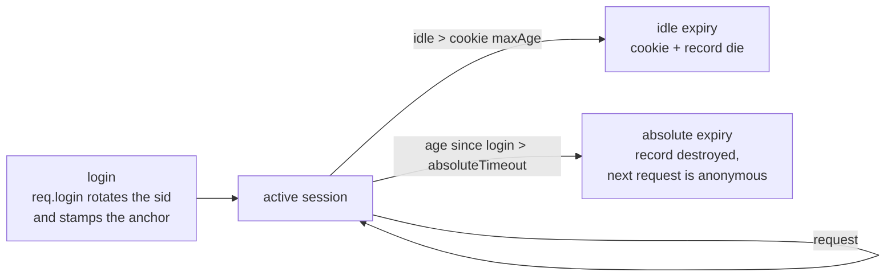

import Tabs from '@theme/Tabs';
import TabItem from '@theme/TabItem';

# Sessions

Gina uses [`express-session`](https://github.com/expressjs/session) for session
management. Sessions are opt-in — you wire the middleware yourself in
`bundle/index.js` so you control exactly how they behave.
Six store backends are documented here: in-memory for local development,
SQLite for single-process deployments, Redis for horizontally scaled
production clusters, and three database-native stores (Couchbase, ScyllaDB,
MongoDB) for bundles that already use one of those as their primary database.

---

## How it works

1. The session middleware assigns every browser a signed cookie (`connect.sid`
   by default).
2. On each request the middleware looks up the session data by cookie value from
   the configured store.
3. Your controller reads and writes `req.session.*`.
4. When the response ends the middleware saves any changes back to the store.

Session data is **never stored in the cookie itself** — only the session ID is.

---

## Quick start

Install `express-session` in your project:

```bash
npm install express-session
```

Wire it in `bundle/index.js`:

```js title="src/api/index.js"
var myapp        = require('gina');
var lib          = myapp.lib;
var session      = require('express-session');

myapp.onInitialize(function(event, app) {
    app.use(session({
        secret           : process.env.SESSION_SECRET || 'changeme'
      , resave           : false
      , saveUninitialized: false
      , cookie           : { secure: false, maxAge: 86400000 }  // 1 day
    }));

    event.emit('complete', app);
});

myapp.onError(function(err, req, res, next) { next(err); });
myapp.start();
```

This uses the **in-memory store** (default). It is fine for development but
loses all sessions on restart and does not scale across multiple processes.

:::caution In-memory store — development only
The default in-memory store leaks memory over time and resets on every restart.
For staging and production pick a persistent backend in
[Configuring the store](#configuring-the-store) instead.
:::

---

## Choosing a store

| Store | When to use |
|---|---|
| In-memory (default) | Local development only |
| [SQLite](#configuring-the-store) | Dev, staging, single-pod production |
| [Redis](#configuring-the-store) | Multi-pod / K8s horizontal scaling |
| [Couchbase](#configuring-the-store) | Bundles already using Couchbase as primary store; SDK v3 / v4 auto-selected |
| [ScyllaDB](#configuring-the-store) | Bundles already using ScyllaDB / Cassandra; CQL `USING TTL` per-row reaping |
| [MongoDB](#configuring-the-store) | Bundles already using MongoDB; TTL-index auto-created on first `set()` |

:::note Record TTL vs cookie `maxAge`
Every store resolves a session record's lifetime the same way since 0.6.0: an
explicitly configured `ttl` wins; with no `ttl` configured, the record follows
the session cookie's `maxAge`; one day (`86400` seconds) is the last resort
when the cookie has none either. The `ttl` values in the examples below are
therefore optional — set one only when the record's lifetime should be
decoupled from the cookie's.

Since 0.6.3, a configured `ttl` must be a **positive** number of seconds —
`ttl: 0` and negative values are refused at bundle init, naming the offending
channel (they previously behaved as unset). And a write whose *resolved* ttl
is `<= 0` (an already-expired cookie) is a no-op: a session record is never
stored without an expiry.
:::

---

## Configuring the store

:::note The `connectors.json` entry must be named `session`
The `SessionStore` factory resolves the connector entry from
`express-session`'s function name — which is `session` and cannot be changed
(`Function.name` is read-only; assigning to it is a silent no-op). Name the
session entry `"session"` in every example below; any other key makes the
factory throw at boot with `[SessionStore] Could not be loaded`.
:::

<Tabs groupId="session-store">
  <TabItem value="sqlite" label="SQLite — dev / staging / single-pod" default>

Uses the Node.js built-in `node:sqlite` module. **Zero npm dependencies.**
Requires Node.js ≥ 22.5.0 — or [Bun](https://bun.sh) ≥ 1.2, where the built-in
`bun:sqlite` is used automatically (*new in 0.6.1*).

**1. Configure `connectors.json`**

```json title="src/api/config/connectors.json"
{
  "session": {
    "connector"      : "sqlite",
    "database"       : ":memory:",
    "ttl"            : 86400,
    "prefix"         : "sess:",
    "cleanupInterval": 900
  }
}
```

For a persistent file store (survives restarts):

```json
{
  "session": {
    "connector": "sqlite",
    "database" : "/app/data/sessions.db",
    "ttl"      : 86400
  }
}
```

| Field | Default | Description |
|---|---|---|
| `connector` | — | Must be `"sqlite"` |
| `database` | `~/.gina/${shortVersion}/sessions-${bundle}.db` | Path to the SQLite file, or `":memory:"` |
| `ttl` | (cookie `maxAge` / 1000, then `86400`) | Session TTL in seconds |
| `prefix` | `"sess:"` | Key prefix stored in the DB |
| `cleanupInterval` | `900` | Seconds between expired-session purges. Set `0` to disable. |

**2. Wire the store in `bundle/index.js`**

```js title="src/api/index.js"
var myapp        = require('gina');
var lib          = myapp.lib;
var session      = require('express-session');
var SessionStore = lib.SessionStore;

myapp.onInitialize(function(event, app) {
    var SqliteStore = new SessionStore(session); // resolves the "session" entry → SqliteStore class

    app.use(session({
        secret           : process.env.SESSION_SECRET || 'changeme'
      , resave           : false
      , saveUninitialized: false
      , store            : new SqliteStore()
      , cookie           : { secure: false, maxAge: 86400000 }
    }));

    event.emit('complete', app);
});

myapp.onError(function(err, req, res, next) { next(err); });
myapp.start();
```

**3. Environment override**

Point dev at an in-memory store without touching `connectors.json`:

```json title="src/api/config/connectors.dev.json"
{
  "session": {
    "database": ":memory:"
  }
}
```

  </TabItem>
  <TabItem value="redis" label="Redis — production / multi-pod">

Uses [`ioredis`](https://github.com/redis/ioredis). Required for horizontal
scaling — SQLite is per-process and cannot be shared across pods.

```bash
npm install ioredis
```

**1. Configure `connectors.json`**

**Standalone Redis:**

```json title="src/api/config/connectors.json"
{
  "session": {
    "connector": "redis",
    "host"     : "127.0.0.1",
    "port"     : 6379,
    "password" : "",
    "ttl"      : 86400,
    "prefix"   : "sess:"
  }
}
```

**Redis Cluster:**

```json
{
  "session": {
    "connector": "redis",
    "cluster"  : [
      { "host": "node1.redis.internal", "port": 6379 },
      { "host": "node2.redis.internal", "port": 6379 },
      { "host": "node3.redis.internal", "port": 6379 }
    ],
    "ttl"      : 86400,
    "prefix"   : "sess:"
  }
}
```

**Managed Redis with TLS** (Upstash, ElastiCache, Cloud Memorystore):

```json
{
  "session": {
    "connector": "redis",
    "host"     : "my-instance.upstash.io",
    "port"     : 6379,
    "password" : "${REDIS_PASSWORD}",
    "tls"      : true,
    "ttl"      : 86400
  }
}
```

| Field | Default | Description |
|---|---|---|
| `connector` | — | Must be `"redis"` |
| `host` | `"127.0.0.1"` | Redis host (standalone mode) |
| `port` | `6379` | Redis port |
| `db` | `0` | Redis DB index |
| `password` | — | Redis `AUTH` password |
| `tls` | `false` | Enable TLS. Required for most managed providers. |
| `cluster` | — | Array of `{ host, port }` nodes for Redis Cluster mode |
| `ttl` | (cookie `maxAge` / 1000, then `86400`) | Session TTL in seconds |
| `prefix` | `"sess:"` | Key prefix in Redis |

**2. Wire the store in `bundle/index.js`**

```js title="src/api/index.js"
var myapp        = require('gina');
var lib          = myapp.lib;
var session      = require('express-session');
var SessionStore = lib.SessionStore;

myapp.onInitialize(function(event, app) {
    var RedisStore = new SessionStore(session);   // resolves the "session" entry → RedisStore class

    app.use(session({
        secret           : process.env.SESSION_SECRET
      , resave           : false
      , saveUninitialized: false
      , store            : new RedisStore()
      , cookie           : {
            secure  : true      // HTTPS only in production
          , maxAge  : 86400000  // 1 day in ms
        }
    }));

    event.emit('complete', app);
});

myapp.onError(function(err, req, res, next) { next(err); });
myapp.start();
```

**3. Environment overlay**

Point dev at a local Redis without changing `connectors.json`:

```json title="src/api/config/connectors.dev.json"
{
  "session": {
    "host"    : "127.0.0.1",
    "port"    : 6379,
    "password": "",
    "tls"     : false
  }
}
```

  </TabItem>
  <TabItem value="couchbase" label="Couchbase — when Couchbase is already the primary store">

Uses the same connector that powers the Couchbase ORM — literally: the model
layer opens the bucket from your `session` connector entry at boot, and you
hand that already-open handle to the store as `db`. Couchbase has native
per-document expiry — the `expiry` argument on `upsert` makes the server reap
the document automatically. No TTL index, no sweeper job. The dispatcher
auto-selects the v3 / v4 SDK based on the project's `couchbase` pin.

```bash
npm install couchbase
```

**1. Configure `connectors.json`**

```json title="src/api/config/connectors.json"
{
  "session": {
    "connector": "couchbase",
    "protocol":  "couchbase://",
    "host":      "127.0.0.1",
    "database":  "sessions",
    "username":  "appuser",
    "password":  "${COUCHBASE_PASSWORD}"
  }
}
```

For Capella / Couchbase Cloud, switch to `protocol: "couchbases://"` and pass
the cluster hostname.

These fields configure the **model-layer connection** — the same fields as any
Couchbase connector entry (see the
[Connectors reference](/reference/connectors)). The session store itself reads
none of them; it receives the open bucket through its constructor (step 2).

| Field | Default | Description |
|---|---|---|
| `connector` | — | Must be `"couchbase"` |
| `protocol` | `"couchbase://"` | `couchbases://` for TLS |
| `host` | — | Cluster hostname(s), comma-separated for multi-node |
| `database` | — | Bucket dedicated to sessions (recommended). Couchbase's bucket name — the reference field is `database`, not `bucket` |
| `username` | — | RBAC user |
| `password` | — | RBAC password. Supports `${secret:KEY}` substitution |

:::note The Couchbase store is configured through its constructor, not `connectors.json`
Unlike the SQLite, Redis, MongoDB and ScyllaDB stores — which configure
themselves from `connectors.json` — the Couchbase store takes everything from
the options object you pass to the constructor, including the connection
itself: `db` **is required** and must be the already-open bucket the model
layer created from the entry above. A `ttl` or `prefix` key placed in
`connectors.json` under a Couchbase connector is silently ignored.

```js
store: new CouchbaseStore({
    db: getModel('session').getConnection(),   // the open bucket — required
    ttl: 86400,
    prefix: 'sess:'
})
```

| Option | Default | Description |
|---|---|---|
| `db` | — (**required**) | The open Couchbase bucket for the `session` entry: `getModel('session').getConnection()` |
| `ttl` | (cookie `maxAge` / 1000, then `86400`) | Default expiry in seconds |
| `prefix` | `"sess:"` | Document key prefix. Combined with the session id (`sess:<sid>`) to form the doc key |
:::

**2. Wire the store in `bundle/index.js`**

```js title="src/api/index.js"
var myapp        = require('gina');
var lib          = myapp.lib;
var session      = require('express-session');
var SessionStore = lib.SessionStore;

myapp.onInitialize(function(event, app) {
    var CouchbaseStore = new SessionStore(session);    // resolves the "session" entry → CouchbaseStore class

    app.use(session({
        secret           : process.env.SESSION_SECRET,
        resave           : false,
        saveUninitialized: false,
        store            : new CouchbaseStore({
            db: getModel('session').getConnection()    // open bucket, created by the model layer at boot
        }),
        cookie           : { secure: true, maxAge: 86400000 }
    }));

    event.emit('complete', app);
});

myapp.onError(function(err, req, res, next) { next(err); });
myapp.start();
```

:::note SDK v2 was removed in gina 0.4.0
The dispatcher selects v3 or v4 from the project's `couchbase` pin and refuses
a `couchbase@^2` (or older) pin with an upgrade message — v2 reached upstream
end-of-life in 2021. v4 is recommended for any greenfield bundle.
:::

:::note Deleting a session that is not stored succeeds (since 0.6.33)
Logging in rotates the session, which deletes the pre-login record first. With
`saveUninitialized: false` that record was never written, and before 0.6.33 the
store reported the delete as `DocumentNotFoundError`, so the login answered
`500`. From 0.6.33 an absent session counts as deleted, as on every other store
gina ships; any other error still fails.
:::

:::caution `length()`, `clear()`, `all()` not implemented
The CouchbaseStore exposes `get` / `set` / `destroy` / `touch` only.
express-session does not call the others on the request path — they're used by
admin tooling. Run a `SELECT COUNT(*) FROM <bucket>` from the Couchbase UI or
`cbq` shell when you need a session count or sweep.
:::

  </TabItem>
  <TabItem value="scylladb" label="ScyllaDB / Cassandra — wide-column, native CQL TTL">

Uses the same connector that powers the ScyllaDB / Cassandra ORM. CQL has no
Redis-EXPIRE equivalent — TTL is set per-row at INSERT/UPDATE time via `USING
TTL`, and the server reaps rows automatically once the TTL elapses. The
underlying driver is `cassandra-driver` (Apache Software Foundation; Node.js
has no first-party shard-aware ScyllaDB driver, so token-aware routing is
used).

```bash
npm install cassandra-driver
```

**1. Configure `connectors.json`**

```json title="src/api/config/connectors.json"
{
  "session": {
    "connector":       "scylladb",
    "contactPoints":   ["127.0.0.1:9042"],
    "localDataCenter": "datacenter1",
    "keyspace":        "session_store",
    "table":           "sessions",
    "ttl":             86400
  }
}
```

| Field | Default | Description |
|---|---|---|
| `connector` | — | Must be `"scylladb"` |
| `contactPoints` | `["127.0.0.1:9042"]` | Array of `host:port` entries (or comma-separated string) |
| `localDataCenter` | `"datacenter1"` | Required by cassandra-driver 4.x for token-aware routing |
| `keyspace` | (required) | Falls back to `database` for parity with other connectors |
| `table` | `"sessions"` | Sessions table name |
| `credentials` | — | `{ username, password }` — wraps in `PlainTextAuthProvider` |
| `ttl` | (cookie `maxAge` / 1000, then `86400`) | Default session TTL in seconds. Stamped via CQL `USING TTL` |

**2. Create the sessions table** (the store does not auto-create)

```cql
CREATE TABLE IF NOT EXISTS session_store.sessions (
    sid  TEXT PRIMARY KEY,
    sess TEXT
) WITH default_time_to_live = 86400;
```

**3. Wire the store in `bundle/index.js`**

```js title="src/api/index.js"
var myapp        = require('gina');
var lib          = myapp.lib;
var session      = require('express-session');
var SessionStore = lib.SessionStore;

myapp.onInitialize(function(event, app) {
    var ScylladbStore = new SessionStore(session);    // resolves the "session" entry → ScylladbStore class

    app.use(session({
        secret           : process.env.SESSION_SECRET,
        resave           : false,
        saveUninitialized: false,
        store            : new ScylladbStore(),
        cookie           : { secure: true, maxAge: 86400000 }
    }));

    event.emit('complete', app);
});

myapp.onError(function(err, req, res, next) { next(err); });
myapp.start();
```

:::note Node 20 required
`cassandra-driver@>=4.0.0` requires Node `>=20`. Bundles using ScyllaDB
inherit that constraint.
:::

:::caution `length()`, `clear()`, `all()` are full-table operations
`length()` runs `SELECT COUNT(*)`, `clear()` runs `TRUNCATE` (a heavy cluster
operation), and `all()` runs a full scan. Avoid in hot paths — use them only
from admin tooling. See the [ScyllaDB ORM guide](/data/scylladb-orm#session-store-via-cql-using-ttl)
for the full API mapping and document shape.
:::

  </TabItem>
  <TabItem value="mongodb" label="MongoDB — document store with TTL index">

Uses the same connector that powers the MongoDB ORM. MongoDB has built-in
support for **TTL indexes** — a special index on a `Date` field with
`expireAfterSeconds: 0` causes the server to delete documents once their date
has passed. The store auto-creates the index on first `set()` (deferred so
ORM-only setups never run DDL).

```bash
npm install mongodb
```

**1. Configure `connectors.json`** — URI form (Atlas, replica set):

```json title="src/api/config/connectors.json"
{
  "session": {
    "connector":  "mongodb",
    "uri":        "mongodb+srv://<user>:<pass>@cluster0.example.net/?authSource=admin",
    "database":   "session_store",
    "collection": "sessions",
    "ttl":        86400
  }
}
```

Or decomposed form (self-hosted single node):

```json
{
  "session": {
    "connector":  "mongodb",
    "host":       "127.0.0.1",
    "port":       27017,
    "database":   "session_store",
    "collection": "sessions",
    "ttl":        86400
  }
}
```

| Field | Default | Description |
|---|---|---|
| `connector` | — | Must be `"mongodb"` |
| `uri` | — | Full connection string. Preferred when set; takes priority over decomposed fields |
| `host` | `"127.0.0.1"` | Server host (decomposed mode) |
| `port` | `27017` | Server port (decomposed mode) |
| `database` | (required) | Database name |
| `collection` | `"sessions"` | Collection name |
| `username` | — | Auth user. URL-encoded automatically when assembling the URI |
| `password` | — | Auth password. Supports `${secret:KEY}` substitution |
| `authSource` | — | Auth database, when different from `database` |
| `replicaSet` | — | Replica set name |
| `ssl` | — | `true` to enable TLS, or an object passed through to the driver as `tlsOptions` |
| `ttl` | (cookie `maxAge` / 1000, then `86400`) | Default expiry in seconds |

**2. Wire the store in `bundle/index.js`**

```js title="src/api/index.js"
var myapp        = require('gina');
var lib          = myapp.lib;
var session      = require('express-session');
var SessionStore = lib.SessionStore;

myapp.onInitialize(function(event, app) {
    var MongodbStore = new SessionStore(session);    // resolves the "session" entry → MongodbStore class

    app.use(session({
        secret           : process.env.SESSION_SECRET,
        resave           : false,
        saveUninitialized: false,
        store            : new MongodbStore(),
        cookie           : { secure: true, maxAge: 86400000 }
    }));

    event.emit('complete', app);
});

myapp.onError(function(err, req, res, next) { next(err); });
myapp.start();
```

:::note 60-second TTL-monitor lag — handled
MongoDB's TTL monitor runs on a 60-second tick, so a recently-expired document
can linger up to a minute. The store filters `get()` / `length()` / `all()` on
`expiresAt > now` to never return an expired session — the filter cost is one
indexed range scan against the existing TTL index. See the [MongoDB ORM guide](/data/connectors-mongodb#session-store-via-ttl-index)
for the full API mapping and document shape.
:::

  </TabItem>
</Tabs>

---

## Connector ORM guides

For the full ORM context of each database-native session store — entity
wiring, query / pipeline files, scope-based data isolation, dev-mode query
instrumentation — see each connector's dedicated guide:

- [Couchbase ORM](/data/couchbase-orm) — N1QL, document scope isolation, multi-node cluster
- [ScyllaDB ORM](/data/scylladb-orm) — CQL, prepared statements, lightweight transactions
- [MongoDB ORM](/data/connectors-mongodb) — JSON pipeline files, BSON type casting, aggregation
- [SQL connectors](/guides/models) — MySQL, PostgreSQL, SQLite

---

## Using sessions in controllers

```js title="src/api/controllers/controller.auth.js"
var self = this;

this.login = function(req, res, next) {
    // Validate credentials ...
    var user = { id: 42, name: 'Martin', role: 'admin' };

    req.login(user, function(err) {
        if (err) return self.throwError(res, 500, err);
        self.renderJSON({ ok: true });
    });
};

this.logout = function(req, res, next) {
    req.session.destroy(function(err) {
        if (err) return self.throwError(res, 500, err);
        self.renderJSON({ ok: true });
    });
};

this.profile = function(req, res, next) {
    if (!req.session.user) {
        return self.throwError(res, 401, new Error('Not authenticated'));
    }
    self.renderJSON({ user: req.session.user });
};
```

### `req.login(user, done)`

Since 0.6.0 the framework's own `req.login()` works without Passport, and it
**rotates the session id before binding the user** — the session-fixation
defense. In order it: regenerates the session (destroying the pre-login
record, so an id planted or leaked before authentication is dead the moment
authentication succeeds), binds the principal at `req.session.user` (what the
[route authorization](/guides/route-authorization) gate reads), stamps the
absolute-timeout anchor, persists, then fires the **required** callback:

```js
req.login(user, function(err) {
    if (err) return self.throwError(res, 500, err);
    // rotated + bound + persisted — safe to respond
});
```

Worth knowing:

- **Anything in the pre-login session is gone after `req.login()`** — that is
  the point of rotation. To carry a value across (a cart, a return-to URL),
  read it before the call and re-set it inside the callback.
- **CSRF tokens survive** — they are derived from the current session id, and
  the next response re-issues automatically after the id changes.
- **Cookie lifetime belongs inside the callback** — rotation rebuilds the
  cookie, so a `req.session.cookie.maxAge` set before this call is thrown away.
  See ["Remember me"](#remember-me).
- **Role elevation**: re-call `req.login()` with the elevated user — a
  privilege change deserves the same rotation as a login.
- **Before 0.6.0** the shim threw `passport.initialize() middleware not in
  use` without Passport — on older versions call
  `req.session.regenerate()` yourself, then bind and save inside its callback.
- **Passport bundles** — when Passport is initialized, `req.login()` is
  Passport's own (the framework shim never installs); Passport ≥ 0.6 performs
  its own regenerate.
- If the session provider exposes no `regenerate()`, the user is bound
  without rotation and a warning says the fixation defense is unavailable.

### `req.logout([done])`

Since 0.6.0 the framework's own `req.logout()` does the full job — it clears
`req.session.user` AND destroys the persisted record, so it is equivalent to
the explicit `req.session.destroy()` form above:

```js
this.logout = function(req, res, next) {
    req.logout(function(err) {
        if (err) return self.throwError(res, 500, err);
        self.renderJSON({ ok: true });
    });
};
```

The callback is optional. Before 0.6.0, `req.logout()` only cleared
`req.session.user` — the record, the session id and every other session key
stayed alive in the store until TTL — so prefer the explicit
`req.session.destroy()` form on older versions. Two things stay yours to
handle either way:

- **The cookie** — the framework cannot discover the session cookie's name.
  If you don't want the browser resending the now-dead id, expire the cookie
  yourself when responding (a `Set-Cookie` for your session-cookie name with
  an expiry in the past).
- **Passport bundles** — when Passport is initialized, `req.logout()` is
  Passport's own (the framework shim never installs); record destruction
  comes from Passport's `regenerate()` flow.

:::tip Session user vs req.user
Gina stores the authenticated user at `req.session.user`, not `req.user`.
Middleware that references `req.user` (Passport.js, etc.) will need a small
adapter if used alongside gina's session pattern.
:::

:::tip Multi-tab behaviour
All tabs of the same browser share one session — the cookie is per-origin.
`express-session` reads, mutates, and writes the entire session blob each
request, so two tabs racing on the same field will overwrite each other (lost
update). Treat `req.session` as user state (login, role, locale, CSRF token),
not as a counter or queue. This applies to every `express-session` store, not
just gina's.
:::

:::tip Deep-link before login
To send an unauthenticated visitor to `/login` and replay their original request
afterwards, snapshot it into `req.session.haltedRequest` with the controller's
[pause / resume request](/guides/controller#pausing-resuming-requests) methods.
:::

---

## Session lifetime — idle vs absolute {#session-lifetime}

Two different clocks bound a session's life, and they answer different
threats:

- **Idle timeout** — "log me out after N minutes of inactivity". This already
  exists and *rolls with activity*: the cookie's `maxAge` bounds the browser
  side (add `rolling: true` to refresh it on every response), and the store
  record's TTL follows the cookie `maxAge` and is refreshed on every request.
  An untouched session dies after one idle window on both sides.
- **Absolute timeout** — "no session lives longer than N hours, active or
  not". Rolling idle alone lets a session that keeps making requests — or a
  stolen session id an attacker keeps warm — live forever. The absolute cap
  closes that, and is what PCI-DSS-style re-authentication requirements ask
  for.



Enable the absolute cap on the Session plugin (milliseconds — it lives beside
`cookie.maxAge`, which uses the same unit):

```js title="src/api/index.js"
app.use(session({
    secret            : process.env.SESSION_SECRET,
    resave            : false,
    saveUninitialized : false,
    rolling           : true,
    cookie            : { secure: true, maxAge: 900000 },  // 15 min idle
    absoluteTimeout   : 28800000                           // 8 h hard cap
}));
```

Or set a deployment-wide default in `settings.json` — bundle code always
wins, and `absoluteTimeout: false` in bundle code disables the default:

```json title="src/api/config/settings.json"
{
  "session": {
    "absoluteTimeout": 28800000
  }
}
```

How it behaves:

- The clock starts at **login** — `req.login()` stamps an anchor on the fresh
  session at rotation. A session where you bound the user by hand is anchored
  on its next request instead (one request late).
- Anonymous sessions are never touched: no anchor is written, so
  `saveUninitialized: false` keeps meaning what it says.
- An over-age session is destroyed **on its next request**, which then
  proceeds with a fresh anonymous session — exactly what a naturally-expired
  record looks like, so protected routes 401/redirect through the same paths
  they already have. There is no timer sweeping sessions in the background.
- Fail-closed: if the record cannot be destroyed (store error), the
  authentication is dropped for the request anyway.

---

## "Remember me" — a lifetime the user picks {#remember-me}

The two clocks above are yours, set once for the whole deployment. A "remember
me" checkbox is a third: a lifetime chosen per login, by the person logging in.

Since **0.6.32** the framework can apply it for you. Declare the two durations
in the bundle's [`security.json`](/reference/security) and gina sets the cookie
at `req.login()`:

```json title="src/api/config/security.json"
{
  "session": {
    "expires"  : "3h",
    "remember" : "15d"
  }
}
```

A login counts as remembered when you say so explicitly —
`req.login(user, { remember: true }, done)` — or when the login request carries
a truthy `remember` field (`on`, `1`, `true`, `yes`), which is what an ordinary
HTML checkbox sends. The explicit option always wins over the field, so a
decision your server makes cannot be overridden by the client.

Both keys are optional and a bundle that declares neither behaves exactly as
before. A value that is not a duration string is reported at boot — naming the
bundle, environment and key — and then ignored: the bundle keeps the cookie
lifetime it already had, and the boot is never refused.

You can still set the lifetime by hand, and doing so still wins. Every session
carries its own `cookie` object, and an assignment inside your login callback
runs after the framework's, so it overrides whatever `security.json` declared.
Reach for it when the lifetime depends on something only your action knows:

```js title="src/api/controllers/controller.auth.js"
this.login = function(req, res) {
    var remember = (req.body.remember === true);   // your checkbox

    req.login(user, function(err) {
        if (err) return self.throwError(res, 500, err);

        // 30 days when ticked; null = a cookie that dies with the browser
        req.session.cookie.maxAge = remember ? 2592000000 : null;

        self.redirect('/dashboard');
    });
};
```

Four things decide whether that works, and three of them fail silently.

**Set it inside the callback, never before it.** `req.login()` rotates the
session id, and rotation builds a fresh cookie from the options you configured.
A `maxAge` assigned before the call is discarded, and the browser is sent your
configured default instead of the user's choice, with nothing logged.

**`null` is the unticked branch, not a small number.** It drops `Expires`
altogether, which is what makes a cookie last exactly as long as the browser
stays open. The store record for such a session still lives for one day — the
last-resort TTL above — so the browser forgets it well before the record does.

**Do not pin the store's `ttl` below it.** A record's lifetime is the
`connectors.json` `ttl` when one is set, and follows the cookie only when it is
not. Pair a one-day `ttl` with a thirty-day cookie and the browser keeps
presenting a valid id to a record that died three weeks earlier. Leave `ttl`
unset when the cookie should drive expiry, or raise it to the remembered
duration.

**Use a store that survives a restart.** A long-lived cookie against an
in-process store signs everyone out on the next deploy regardless. See
[Choosing a store](#choosing-a-store).

You do **not** need to call `req.session.save()` afterwards: the rotation
already makes `express-session` write the session again at the end of the
response, and the record picks up the new lifetime with it. An explicit save is
harmless if you prefer it spelled out.

`absoluteTimeout` still wins. A thirty-day remember-me under an eight-hour
absolute cap is an eight-hour session — the cap is deliberately independent of
what the user asked for.

:::caution HTTP/2 on the built-in engine, before 0.6.32
On `isaac` over HTTP/2, rendered and redirected responses did not run the
session middleware's cookie step, so a login answered that way reached the
browser with no `Set-Cookie` at all — remembered or not. The user is bound and
the record is written correctly, and the next request still arrives anonymous.
Measured on 0.6.31, but **not a 0.6.31 regression** — every earlier release
behaves the same way, so pinning back is not a workaround. Fixed in 0.6.32. On
earlier releases, confirm that a plain login survives one page load before
adding a remember-me box on top of it.
:::

---

## Cookie options

| Option | Recommended (prod) | Notes |
|---|---|---|
| `secure` | `true` | Only sends cookie over HTTPS. Set `false` behind an HTTP reverse proxy if TLS terminates there. |
| `httpOnly` | `true` (default) | Blocks client-side JS from reading the cookie. |
| `sameSite` | `'lax'` | Protects against CSRF on same-origin requests. Use `'none'` only for cross-origin with `secure: true`. |
| `maxAge` | `86400000` | Expiry in milliseconds. Must match the store TTL in seconds (`maxAge / 1000`). A single session can override it at login — see ["Remember me"](#remember-me). |

```js
cookie: {
    secure  : /^production$/i.test(process.env.NODE_ENV)
  , httpOnly: true
  , sameSite: 'lax'
  , maxAge  : 86400000
}
```

---

## Hardened cookie defaults — `gina.plugins.Session` {#hardened-cookie-defaults}

Added in `0.3.7`. A framework-supplied wrapper around `express-session` that
injects `sameSite` / `httpOnly` / `secure` defaults from `settings.json` into
the cookie options **before** express-session sees them. Bundle-supplied
`options.cookie` values still win — the plugin only fills in the flags you
didn't set.

### One-line adoption

```js
// before
// var session = require('express-session');

// after
var session = require('gina').plugins.Session(require('express-session'));
```

Everything downstream is unchanged. `session(options)`, the `SessionStore`
factory, passport integration — all identical.

### Configure the defaults in `settings.json`

```json title="src/api/config/settings.json"
{
  "session": {
    "absoluteTimeout": 28800000,
    "cookie": {
      "sameSite": "lax",
      "httpOnly": true,
      "secure":   "auto"
    }
  }
}
```

| Default | Value | Notes |
|---|---|---|
| `sameSite` | `"lax"` | `"strict"` blocks cross-origin navigation (breaks email-link logins). `"none"` permits cross-site sending and **requires** `secure: true`. |
| `httpOnly` | `true` | Override to `false` only if a validator or toolbar has to read `document.cookie`. |
| `secure`   | `"auto"` | express-session's idiom for "mirror the request security flag" — typically paired with `app.set('trust proxy', 1)`. |
| `absoluteTimeout` | *(none)* | Opt-in [absolute session cap](#session-lifetime) in ms since login. Bundle code wins; `absoluteTimeout: false` in bundle code disables the default. |

### Bundle choices always win

```js
// settings.json defaults: { sameSite: "lax", httpOnly: true, secure: "auto" }
app.use(session({
    secret: process.env.SESSION_SECRET,
    store : new SqliteStore(),
    cookie: {
        httpOnly: false,      // bundle explicitly opts out — kept as false
        maxAge  : 86400000    // unrelated flag — passes through
        // sameSite not set   — plugin fills in "lax" from settings.json
        // secure   not set   — plugin fills in "auto" from settings.json
    }
}));
```

### Cross-site cookie send (rare)

Bundles that need cross-origin cookie delivery (third-party OAuth embeds,
iframe flows) must set both flags explicitly:

```js
cookie: {
    sameSite: 'none',
    secure  : true,
    maxAge  : 86400000
}
```

Setting `sameSite: 'none'` without `secure: true` throws a clear
`[gina session] invariant violation` error at bundle startup — the same
rejection every modern browser performs silently when the cookie arrives.

### No action required for existing bundles

Bundles that continue calling `require('express-session')` directly keep
working exactly as before. Hardening is opt-in: a single-line change whenever
the bundle is ready. The plugin is the baseline for the broader CSRF track —
[`#CSRF2` signed double-submit token middleware](/guides/csrf) shipped in
`0.3.7-alpha.9` and `#CSRF3` Origin/Referer pre-filter (`0.4.0`) builds on
top of it.

---

## Secrets

Never hardcode `SECRET` in source. Inject it at runtime:

```bash
# Docker / K8s
SESSION_SECRET=<random-64-char-string>
```

Generate a secret:

```bash
node -e "console.log(require('crypto').randomBytes(64).toString('hex'))"
```

For K8s, store the secret in a Secret object and mount it as an env var:

```yaml
env:
  - name: SESSION_SECRET
    valueFrom:
      secretKeyRef:
        name: myproject-secrets
        key: session-secret
  - name: REDIS_PASSWORD
    valueFrom:
      secretKeyRef:
        name: myproject-secrets
        key: redis-password
```

---

## See also

- [K8s and Docker — session storage](./k8s-docker#session-storage) — multi-pod Redis setup and K8s Secrets
- [connectors.json reference](../reference/connectors) — full field reference for Redis and SQLite
