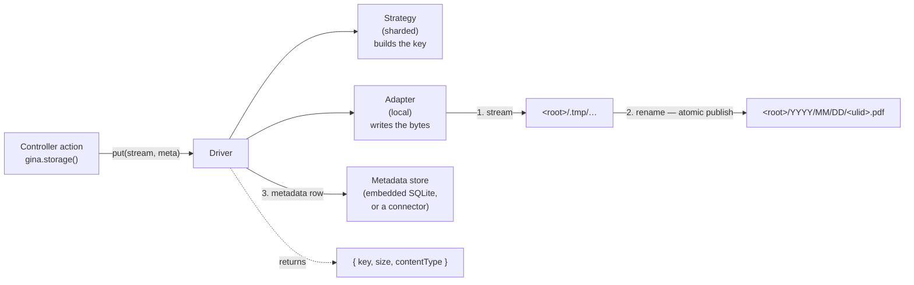

# Object storage

Applications accumulate files that are not uploads: rendered PDFs, generated exports, zip archives, thumbnails. They need a place to live, a stable way to refer to them, and a write that a reader can never catch half-finished.

The **storage layer** provides that. You declare named **drivers** in `settings.json`, each pairing an **adapter** (where the bytes live) with a **strategy** (how keys are laid out), and reach them from application code through `gina.storage()`.

:::note Not the browser `gina/storage` plugin
Gina also ships a client-side AMD module with the id `gina/storage` — a `localStorage` wrapper that runs only in the browser. It is unrelated to this guide. Everything here is server-side.
:::

---

## How it works



The write reaches its final path only through `rename(2)`, which is atomic: a concurrent reader either sees nothing or sees the complete object, never a partial one. If anything fails mid-write — the source errors, the disk fills, the size cap is exceeded — the temp file is removed and the **real** error is reported.

---

## Configure a driver

```json
// settings.json
{
  "storage": {
    "default": "assets",
    "drivers": {
      "assets": {
        "adapter": "local",
        "strategy": "sharded",
        "root": "/var/data/assets",
        "maxObjectSize": "50MB"
      }
    }
  }
}
```

| Key | Required | Meaning |
| --- | --- | --- |
| `adapter` | yes | Where bytes live. `local` = the local filesystem under `root`. |
| `strategy` | yes | How keys are laid out. `sharded` = `YYYY/MM/DD/<ulid>` with a sanitised extension. |
| `root` | yes | Absolute directory holding this driver's objects. |
| `maxObjectSize` | no | Per-object ceiling, as a **unit-suffixed string** (`"50MB"`). Defaults to `100MB`. |
| `store` | no | A `connectors.json` entry name for the metadata store. Omit for the embedded default. |

`storage.default` names the driver returned by a no-argument `gina.storage()`. Omit it and every call must name its driver.

### Two rules the boot enforces

**`root` must be absolute.** A relative root would resolve against the process working directory, which depends on how the bundle was launched.

**`root` must sit outside every web-served directory.** If it were inside a bundle's `publicPath` — or inside any target of a `content.statics` mapping — the stored objects would be fetchable directly, without passing through any authorization your application applies. The driver's own metadata database lives inside the root, so it would be downloadable too. Both cases refuse the boot with a message naming the offending pair.

### `maxObjectSize` needs an explicit unit

```json
"maxObjectSize": "50MB"   // ✅
"maxObjectSize": 50        // ⚠️ warns at boot, falls back to the default
```

This is deliberately stricter than `settings.json > upload`, where a bare number means megabytes for backward compatibility. Inside `upload` a bare number already means two different things — `maxFields: 1000` is a count, `maxFieldsSize: 50` would be megabytes — so there is no single meaning for this key to inherit. Rather than guess, it asks.

---

## Store and read an object

```javascript
var gina = require('gina');

// in a controller action
var pdf = renderInvoicePdf(order);          // any readable stream

gina.storage().put(pdf, {
    originalName : 'invoice-' + order.ref + '.pdf',
    contentType  : 'application/pdf'
}, function (err, res) {
    if (err) {
        return self.throwError(500, err);
    }
    // res => { key, size, contentType }
    order.invoiceKey = res.key;             // store the key, never parse it
    self.renderJSON({ stored: res.key, size: res.size });
});
```

Reading it back:

```javascript
gina.storage().get(order.invoiceKey, function (err, stream) {
    if (err) {
        return self.throwError(404);
    }
    stream.pipe(self.res);
});
```

### Keys are opaque

`put()` returns a key. Store it, pass it around, hand it back to `get()` — but never parse it, build one by hand, or assume it encodes a date or a filename. That opacity is what allows a future strategy to change the layout without breaking anything already stored.

The client's filename never becomes the path. It is kept verbatim in the metadata row, and only a hard-whitelisted extension (alphanumerics, at most ten characters, lowercased) is appended to the key — enough for an operator browsing the tree to tell a PDF from a PNG.

---

## The full contract

| Method | Returns | Notes |
| --- | --- | --- |
| `put(stream, meta, cb)` | `{key, size, contentType}` | `size` is measured from the published file, never taken from the client. |
| `get(key, cb)` | a readable stream | **Errors** on an unknown key — a caller wanting bytes has no use for a null stream. |
| `stat(key, cb)` | metadata, or `null` | `null` (not an error) when the key is unknown. This is the existence question. |
| `release(key, cb)` | `existed` | Removes the object and its metadata row. Idempotent. |
| `resolve(key, cb)` | `{kind: 'path', path}` | How to serve the object. Branch on `kind`. |
| `capabilities` | an object | What this driver can do. |

```javascript
gina.storage().stat(key, function (err, meta) {
    if (!meta) { return self.throwError(404); }
    // meta => { originalName, contentType, size, createdAt }
});
```

### Branch on `capabilities`, do not assume

```javascript
var driver = gina.storage();
if (driver.capabilities.ranges) {
    // serve a 206 range response
}
```

Every capability is `false` in this release: `offload`, `ranges`, `dedup`, `resumable`, `inline`. They flip as the strategies that provide them arrive, and code that branches now keeps working when they do.

---

## Metadata: embedded by default, pluggable when you need it

Each object gets a metadata row — original name, content type, size, creation time — which is what `stat()` reads. By default that lives in an embedded SQLite file inside the driver root (`<root>/.meta.db`), so moving or backing up the root moves its metadata with it.

That default is **single-process per driver root**. SQLite's locking is unreliable on a shared network filesystem, so if two bundles, or several replicas, share one root, point the driver at a connector instead:

```json
// settings.json
"storage": {
  "drivers": {
    "assets": {
      "adapter": "local",
      "strategy": "sharded",
      "root": "/mnt/shared/assets",
      "store": "assetsMeta"
    }
  }
}
```

```json
// connectors.json
{
  "assetsMeta": { "connector": "redis", "host": "127.0.0.1", "port": 6379 }
}
```

:::caution No connector ships a storage store yet
Connector backends are demand-gated. Setting `store` today refuses the boot with a clear message rather than falling back silently — the embedded SQLite backend is the supported path in this release. If you need a shared-root deployment, open an issue describing the connector you need.
:::

---

## Durability, stated plainly

`rename(2)` guarantees that a reader never observes a partial object. It does **not** guarantee the object survives a host crash: writes are not `fsync`ed, so an acknowledged write can still be lost if the machine loses power before the filesystem flushes. If your retention requirements are stricter than that, replicate to durable storage rather than relying on the local adapter alone.

---

## What is not in this release

| Not yet | What it will bring |
| --- | --- |
| `cas` strategy | Content-addressed storage with refcounts and dedup. |
| `stream` strategy | Large sequential media, resumable segment uploads. |
| `s3` adapter | Object-store backend; its client stays a project-side dependency. |
| Range serving | `206 Partial Content` for media, in both engines. |
| Size tiering | Small objects inline in the metadata store. |
| Upload integration | Routing an upload group straight to a storage driver. |

Uploads are unaffected by this release — [`self.store()`](/guides/file-uploads) keeps its current behaviour exactly.

Configuring a strategy that is designed but not yet implemented (`cas`, `stream`) refuses the boot with a message saying so, rather than treating it as a typo.
