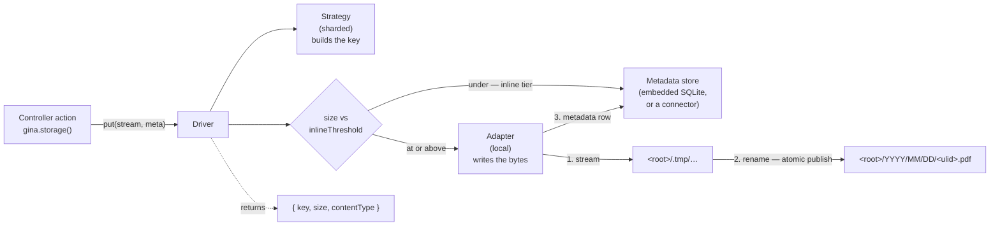
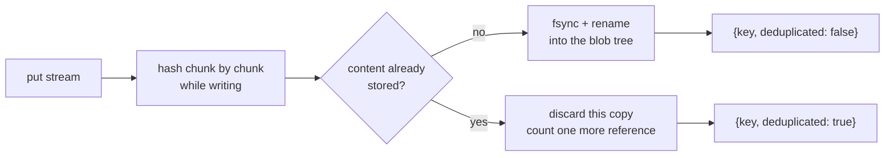

# Object storage

Applications accumulate files that are not uploads: rendered PDFs, generated exports, zip archives, thumbnails. They need a place to live, a stable way to refer to them, and a write that a reader can never catch half-finished.

The **storage layer** provides that. You declare named **drivers** in `settings.json`, each pairing an **adapter** (where the bytes live) with a **strategy** (how keys are laid out), and reach them from application code through `gina.storage()`.

:::note Not the browser `gina/storage` plugin
Gina also ships a client-side AMD module with the id `gina/storage` — a `localStorage` wrapper that runs only in the browser. It is unrelated to this guide. Everything here is server-side.
:::

---

## How it works



A file-backed write reaches its final path only through `rename(2)`, which is atomic: a concurrent reader either sees nothing or sees the complete object, never a partial one. An object smaller than the driver's [size-tiering threshold](#size-tiering) never touches the filesystem at all — its bytes land in the metadata store in a single transaction. If anything fails mid-write — the source errors, the disk fills, the size cap is exceeded — nothing is published and the **real** error is reported.

---

## Configure a driver

```json
// settings.json
{
  "storage": {
    "default": "assets",
    "drivers": {
      "assets": {
        "adapter": "local",
        "strategy": "sharded",
        "root": "/var/data/assets",
        "maxObjectSize": "50MB"
      }
    }
  }
}
```

| Key | Required | Meaning |
| --- | --- | --- |
| `adapter` | yes | Where bytes live. `local` = the local filesystem under `root`. |
| `strategy` | yes | How keys are laid out. `sharded` = `YYYY/MM/DD/<ulid>` with a sanitised extension; [`cas`](#content-addressed-storage-cas) = content-addressed, deduplicating, refcounted. |
| `root` | yes | Absolute directory holding this driver's objects. |
| `maxObjectSize` | no | Per-object ceiling, as a **unit-suffixed string** (`"50MB"`). Defaults to `100MB`. |
| `store` | no | A `connectors.json` entry name for the metadata store. Omit for the embedded default. |
| `inlineThreshold` | no | [Size-tiering](#size-tiering) boundary, as a **unit-suffixed string**. Objects strictly under it live inline in the metadata store. Defaults to `"64KB"`; `"0B"` turns tiering off for this driver. Applies to both strategies. |
| `hash` | no | **cas only.** The digest algorithm; its name becomes a namespace segment in every key. Defaults to `"sha256"`. Validated at boot against what *this runtime's* crypto provides. |
| `fsync` | no | **cas only.** Whether publishes are flushed to disk before being acknowledged. Defaults to `true` — see [Durability](#durability-stated-plainly). |
| `sweepInterval` | no | **cas only.** How often the garbage-collection sweep runs, as a **unit-suffixed duration** (`"15m"`). `"0s"` disables the periodic sweep. |
| `sweepGrace` | no | **cas only.** How long a blob must sit at zero references before the sweep may collect it (`"1h"`). Must be greater than zero. |

`storage.default` names the driver returned by a no-argument `gina.storage()`. Omit it and every call must name its driver.

### Two rules the boot enforces

**`root` must be absolute.** A relative root would resolve against the process working directory, which depends on how the bundle was launched.

**`root` must sit outside every web-served directory.** If it were inside a bundle's `publicPath` — or inside any target of a `content.statics` mapping — the stored objects would be fetchable directly, without passing through any authorization your application applies. The driver's own metadata database lives inside the root, so it would be downloadable too. Both cases refuse the boot with a message naming the offending pair.

### `maxObjectSize` needs an explicit unit

```json
"maxObjectSize": "50MB"   // ✅
"maxObjectSize": 50        // ⚠️ warns at boot, falls back to the default
```

This is deliberately stricter than `settings.json > upload`, where a bare number means megabytes for backward compatibility. Inside `upload` a bare number already means two different things — `maxFields: 1000` is a count, `maxFieldsSize: 50` would be megabytes — so there is no single meaning for this key to inherit. Rather than guess, it asks. `inlineThreshold` follows the same rule.

---

## Store and read an object

```javascript
var gina = require('gina');

// in a controller action
var pdf = renderInvoicePdf(order);          // any readable stream

gina.storage().put(pdf, {
    originalName : 'invoice-' + order.ref + '.pdf',
    contentType  : 'application/pdf'
}, function (err, res) {
    if (err) {
        return self.throwError(500, err);
    }
    // res => { key, size, contentType }
    order.invoiceKey = res.key;             // store the key, never parse it
    self.renderJSON({ stored: res.key, size: res.size });
});
```

Reading it back:

```javascript
gina.storage().get(order.invoiceKey, function (err, stream) {
    if (err) {
        return self.throwError(404);
    }
    stream.pipe(self.res);
});
```

### Keys are opaque

`put()` returns a key. Store it, pass it around, hand it back to `get()` — but never parse it, build one by hand, or assume it encodes a date or a filename. That opacity is what allows a future strategy to change the layout without breaking anything already stored.

The client's filename never becomes the path. It is kept verbatim in the metadata row, and under `sharded` only a hard-whitelisted extension (alphanumerics, at most ten characters, lowercased) is appended to the key — enough for an operator browsing the tree to tell a PDF from a PNG. Under [`cas`](#content-addressed-storage-cas), keys carry **no extension at all**: identical bytes uploaded under different names must mint the same key for deduplication to work, so the content type lives in the metadata row alone.

---

## The full contract

| Method | Returns | Notes |
| --- | --- | --- |
| `put(stream, meta, cb)` | `{key, size, contentType}` | `size` is measured by the layer from the published bytes, never taken from the client. Under `cas` the result also carries `deduplicated` — `true` when identical content already existed. |
| `get(key, cb)` | a readable stream | **Errors** on an unknown key — a caller wanting bytes has no use for a null stream. Serves both tiers. |
| `stat(key, cb)` | metadata, or `null` | `null` (not an error) when the key is unknown. This is the existence question. Never includes payload bytes. Under `cas` it includes `refs`, the live reference count. |
| `release(key, cb)` | `existed` | Under `sharded`: removes the object and its metadata row. Under `cas`: **drops one reference** — bytes are only reclaimed by the [sweep](#content-addressed-storage-cas). Idempotent either way. |
| `resolve(key, cb)` | `{kind: 'path', path}` or `{kind: 'inline'}` | How to serve the object. Branch on `kind` — an inline object has no path; stream it through `get()`. |
| `findByDigest(algo, hex, cb)` | a key, or `null` | **cas only** — gated by `capabilities.dedup`. The pre-upload existence check; see [the oracle caution](#content-addressed-storage-cas). |
| `capabilities` | an object | What this driver can do. |

```javascript
gina.storage().stat(key, function (err, meta) {
    if (!meta) { return self.throwError(404); }
    // meta => { originalName, contentType, size, createdAt }
});
```

### Branch on `capabilities`, do not assume

```javascript
var driver = gina.storage();
if (driver.capabilities.ranges) {
    // serve a 206 range response
}
```

`inline` is `true` when the driver's [size tiering](#size-tiering) is active — meaning `resolve()` may answer `{kind: 'inline'}`. `dedup` is `true` on a [`cas`](#content-addressed-storage-cas) driver and is what gates `findByDigest()`. The rest — `offload`, `ranges`, `resumable` — are `false` in this release and flip as the strategies that provide them arrive; code that branches now keeps working when they do.

---

## Binding upload groups

Server-generated files are one producer. The other is uploads — and an upload
group can publish straight into a driver instead of being moved to a directory.
Add a `driver` to the group:

```json title="config/settings.json"
"upload": {
  "groups": {
    "avatars": {
      "allowedExtensions": ["jpg", "jpeg", "png"],
      "driver": "assets"
    }
  }
}
```

`self.store()` then partitions the call: files in that group publish through the
driver and come back with an opaque `key` (plus `group`, `driver` and the
layer's on-disk `size`) instead of a `filename`, while files in groups without a
`driver` keep the historical move behaviour. A single call can carry both.

```js
self.store(targetDir, req.files, function(err, files) {
  if (err) { return self.throwError(500, err); }
  // routed:  { file, group, driver, key, size, type, encoding }
  // moved:   { file, filename, size, type, encoding }
});
```

`targetDir` may be `null` when every file in the call routes to a driver.

Two boot-time checks apply, so a misconfiguration surfaces at startup rather
than on the first upload: a group naming a driver that is not declared in
`storage.drivers` refuses the boot (as does any `driver` binding when there is
no `storage` block at all), and a group whose staging `path` sits inside its
driver's own `root` earns a warning — files staged there are stranded with no
key referencing them. Keeping `path` alongside `driver` is otherwise perfectly
valid: for a routed group it only names the parse-time staging directory.

:::note One driver set per process
Drivers are resolved from the **starting app's** `storage` block, and that set
is process-wide. When several bundles run merged into one process, every
bundle's upload groups validate against that same set of drivers — so a group in
bundle B naming a driver only bundle B declares will not resolve unless the
starting app declares it too.
:::

The full upload-side reference — group rules, ordering, failure semantics —
lives in the [file uploads guide](/guides/file-uploads#routing-a-group-to-a-storage-driver).

---

## Size tiering

Below a threshold, per-file overhead — inode, block allocation, the syscalls around open and rename — costs more than the payload itself. So objects **strictly under** a driver's `inlineThreshold` are stored *inline*: their bytes land in the metadata store as part of a single transaction, with no temp file, no directories, no filesystem round-trip. At or above the threshold, objects take the file path described above.

The default is `"64KB"`, and it is a measured number, not folklore: on the embedded store, inline writes are 2.7–13× faster than per-file writes at and below that size, and the advantage disappears above it. Set `"0B"` to turn tiering off for a driver, or raise the threshold for a metadata backend that handles larger blobs well.

Nothing else about the driver changes:

- **Keys look the same in both tiers** — still opaque, still date-ordered.
- **`get()`, `stat()` and `release()` behave identically** for inline and file-backed objects.
- **`resolve()` is where the tier shows**: `{kind: 'inline'}` instead of `{kind: 'path'}`, because an inline object has no file to hand to a sendfile-style offload — stream it through `get()`.
- **Changing the threshold is safe at any time.** Reads follow where each object's bytes actually live, so existing objects stay readable on either side of a new threshold; only new writes are placed by it. A metadata database created before tiering existed is migrated in place at open.

Two operational tradeoffs, stated plainly:

- **Sub-threshold objects are not individually visible on disk.** The "SSH in and find the file by date" property of the `sharded` layout holds only for objects at or above the threshold. If your operations depend on every object being a browsable file, set `"0B"`.
- **The metadata store carries their bytes.** Losing `<root>/.meta.db` loses inline objects themselves, not just their metadata — file-backed bytes survive an index loss. The embedded database lives inside the driver root, so any backup of the root already includes it; on a connector-backed store, the payloads land in that backend and follow *its* durability story.

---

## Content-addressed storage (cas)

For immutable content — invoices, receipts, signed documents, anything where "has this exact file been stored already?" is a meaningful question — declare `strategy: "cas"`:

```json
"drivers": {
  "invoices": {
    "adapter": "local",
    "strategy": "cas",
    "root": "/var/data/invoices",
    "maxObjectSize": "50MB"
  }
}
```

The key **is** the content address: `blobs/<algo>/<aa>/<bb>/<hex>`, derived from the object's digest and nothing else. Storing identical bytes twice yields the *same key* and *no second copy* — the blob gains a reference instead, and the second `put()`'s result says so:

```javascript
gina.storage('invoices').put(pdf, { originalName: 'invoice-991.pdf' }, function (err, res) {
    // res => { key, size, contentType, deduplicated }
    // deduplicated: true  => identical content already existed; no new bytes were stored
});
```



Because keys are content addresses, they carry **no extension** and metadata is **first-write-wins**: two uploads of identical bytes under different filenames share one row, which keeps the first `originalName` and `contentType`. And because a content address can never go stale, cas objects are ideal for `Cache-Control: immutable` serving with the key as the ETag.

Keys remain [opaque](#keys-are-opaque) even though cas keys *look* parseable — composing one by hand breaks the moment the layout changes. The one sanctioned way from a digest to a key is `findByDigest`:

```javascript
// the client hashed the file locally and asks before uploading
driver.findByDigest('sha256', clientHexDigest, function (err, key) {
    if (key) { /* already stored — skip the transfer entirely */ }
});
```

:::caution findByDigest is a dedup oracle
An answer to "do you already have this exact content?" tells the asker whether *someone* has stored that file before — across users, that is an information leak. gina ships **no HTTP endpoint** for it: if you expose one, you own its authentication, and you should scope what it reveals per driver (a single-tenant archive leaks nothing; a shared upload pool does).
:::

### Releasing and the sweep

`release()` on a cas driver **drops one reference** — it never deletes bytes. A blob whose count reaches zero is stamped and left in place for a grace window (`sweepGrace`, default `"1h"`); a periodic sweep (`sweepInterval`, default `"15m"`) then reclaims blobs that have sat at zero past the grace. Three consequences worth knowing:

- **Re-uploading just-released content is free.** Within the grace window the blob is still there; an identical `put()` resurrects it without transferring anything twice.
- **A fully-released key reads as gone immediately.** `stat()` answers `null`, `get()` errors — the grace window is a garbage-collection detail, not a visible afterlife.
- **The grace window is a correctness margin, not a convenience.** It is what keeps the sweep from racing an in-flight identical upload. Do not set it lower than your longest plausible upload.

### Changing the digest algorithm — cheap. Changing the strategy — not.

The algorithm's name is a namespace segment in every key, so changing `hash` (say `sha256` → `sha512`) is **additive**: existing blobs stay addressable — and `findByDigest`-able — under their original algorithm, new writes land under the new one, and dedup simply does not span the two. The boot notes the change once and moves on.

Changing a driver's **strategy** on populated storage is a different animal: keys are strategy-specific, so every stored reference would dangle. The boot stamps each driver root with its strategy on first start and **warns on every boot** while a mismatch stands — the fix is a re-key migration, never a config edit. This stamp check applies to `sharded` drivers too.

### What cas is not for

Content addressing makes in-place mutation impossible — editing produces a new blob under a new key, and your reference updates or the old content stays. That is exactly right for legally-immutable documents and exactly wrong for anything with random writes; use `sharded` there.

---

## Metadata: embedded by default, pluggable when you need it

Each object gets a metadata row — original name, content type, size, creation time, and, for inline objects, the payload itself — which is what `stat()` (minus the payload) reads. By default that lives in an embedded SQLite file inside the driver root (`<root>/.meta.db`), so moving or backing up the root moves its metadata with it.

That default is **single-process per driver root**. SQLite's locking is unreliable on a shared network filesystem, so if two bundles, or several replicas, share one root, point the driver at a connector instead:

```json
// settings.json
"storage": {
  "drivers": {
    "assets": {
      "adapter": "local",
      "strategy": "sharded",
      "root": "/mnt/shared/assets",
      "store": "assetsMeta"
    }
  }
}
```

```json
// connectors.json
{
  "assetsMeta": { "connector": "redis", "host": "127.0.0.1", "port": 6379 }
}
```

:::caution No connector ships a storage store yet
Connector backends are demand-gated. Setting `store` today refuses the boot with a clear message rather than falling back silently — the embedded SQLite backend is the supported path in this release. If you need a shared-root deployment, open an issue describing the connector you need.
:::

A store backing a **cas** driver additionally implements the four refcount verbs (`acquireRef` / `releaseRef` / `listZeroRefs` / `removeIfZero`) — the embedded store does, migrating pre-cas databases in place; a cas driver refuses to boot over a store that does not. Each verb must be atomic per key: that atomicity is what makes two concurrent identical uploads yield one blob with two references instead of a lost update.

---

## Durability, stated plainly

For file-backed objects, `rename(2)` guarantees that a reader never observes a partial object — under either strategy. What differs is crash durability:

- **`sharded` writes are not `fsync`ed.** An acknowledged write can still be lost if the machine loses power before the filesystem flushes. Recent writes at risk, never a partial object.
- **`cas` publishes are `fsync`ed by default** (`fsync: true`): the temp file is flushed *before* the rename publishes it — a flush failure fails the `put()` — and the parent directory is flushed after, **best-effort**: platforms that cannot fsync a directory (Windows; some network mounts) skip that half silently, and macOS honours `fsync` as the platform defines it. cas exists for immutable content where "acknowledged means durable" is the point; set `fsync: false` per driver to opt back into sharded-class durability.

Inline objects (either strategy) are in the sharded class: the embedded store runs SQLite in WAL mode with `synchronous=NORMAL`, so a crash can lose the most recent committed transaction but never yields a torn row. If your retention requirements are stricter than all of this, replicate to durable storage rather than relying on the local adapter alone.

---

## Maintenance: stats, gc and verify

Three CLI commands operate a bundle's storage, each following the cache-command
grammar (`<bundle> @<project>`, or `@<project>` alone for every bundle;
`--driver=<name>` to scope one driver; `--format=json` for scripting):

```bash
gina storage:stats  api @myproject             # per-driver counts and bytes
gina storage:gc     api @myproject             # run the cas sweep now, to drained
gina storage:gc     api @myproject --dry-run   # list what a pass would collect
gina storage:verify api @myproject             # files ↔ metadata consistency scan
gina storage:verify api @myproject --fix       # also scrub orphaned files (bundle stopped)
```

**Who does the work depends on who owns the store.** The embedded metadata
store is single-process per driver root, so the CLI never opens a store a
running bundle owns:

- **Bundle running** — the command calls the bundle's own admin-gated
  `/_gina/storage/stats`, `/_gina/storage/gc` (POST) or
  `/_gina/storage/verify` endpoint, and the owning process does the work.
  The endpoints are always-on and gated by `app.json > admin.allowFrom`
  (loopback by default) — the same allowlist as `/_gina/info` and
  `/_gina/cache/stats`.
- **Bundle stopped** (every assigned port refuses the connection) — the
  command resolves the bundle's `settings.storage` and opens the store
  directly, offline.
- **Anything else** — a timeout, an unexpected socket error — is reported as
  unknown and the store is **not** opened: the bundle may still be alive and
  owning it.

A driver backed by a connector `store` has nothing local to open, so it is
reachable through the running bundle only.

`storage:stats` reports, per driver, the identity (strategy, root,
capabilities) plus the metadata store's counts: total objects, refcounted
(cas) objects, zero-reference blobs awaiting the sweep, inline (size-tiered)
objects, and total logical bytes — a deduplicated blob counts once.

`storage:gc` drives the cas sweep immediately instead of waiting for the next
`sweepInterval` tick, looping until nothing older than `sweepGrace` remains.
`--dry-run` lists the collectable blobs and touches nothing. `sharded` drivers
have no sweep and are named and skipped, never an error.

`storage:verify` walks the blob tree against the metadata rows and reports two
finding classes — deliberately asymmetric:

- **Files without rows** — the sweep's documented crash residue (a blob file
  whose row was already claimed). Harmless and invisible to every read verb;
  `--fix` unlinks them, and only offline: `--fix` is refused while the bundle
  runs, and the HTTP endpoint does not even accept a fix flag.
- **Rows without files** — a referenced object whose bytes are gone. That is
  **loss evidence**: it is reported and never auto-fixed, because deleting
  the row would destroy the only signal that content vanished.

Both directions are age-gated past `sweepGrace`, so in-flight uploads are
never reported as findings. A root shared by several bundles appears under
each of them; `gc` and `verify` against a shared root are idempotent — the
same result from whichever bundle you point at.

---

## What is not in this release

| Not yet | What it will bring |
| --- | --- |
| `stream` strategy | Large sequential media, resumable segment uploads. |
| `s3` adapter | Object-store backend; its client stays a project-side dependency. |
| Range serving | `206 Partial Content` for media, in both engines. |
| `storage:migrate` | Strategy/hash re-key tooling for populated roots. |

Uploads that are **not** routed to a driver are unaffected — [`self.store()`](/guides/file-uploads) keeps its existing behaviour byte-for-byte for them. See [Binding upload groups](#binding-upload-groups) for routing one.

Configuring a strategy that is designed but not yet implemented (`stream`) refuses the boot with a message saying so, rather than treating it as a typo.
