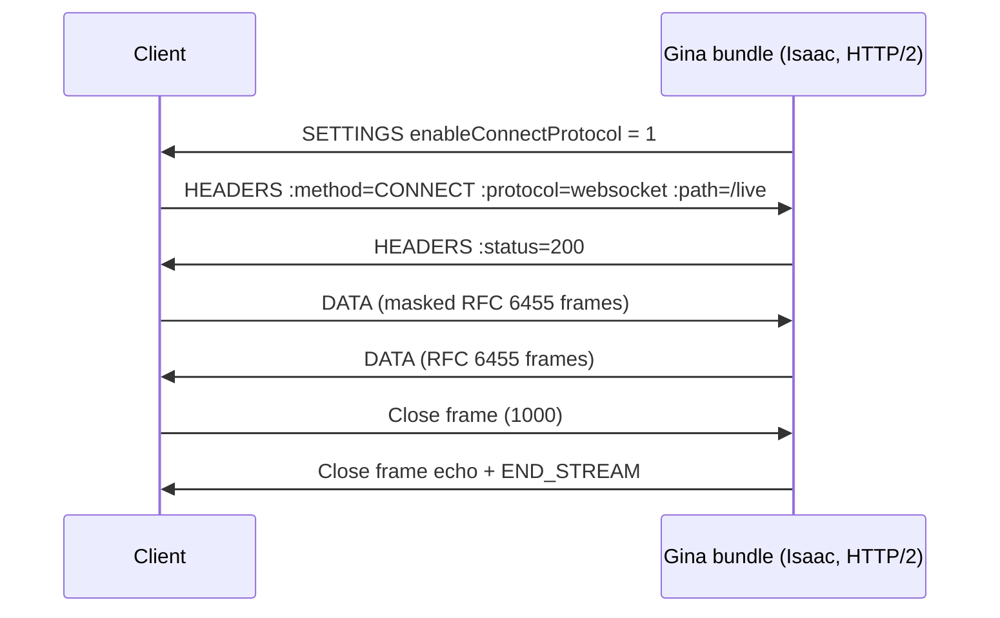

# WebSocket over HTTP/2

Since `0.5.0` (in development), Gina's Isaac engine can serve WebSocket
endpoints over **HTTP/2 extended CONNECT** (RFC 8441). The WebSocket rides an
HTTP/2 stream on the connection the browser already holds — no second TCP
connection, no HTTP/1.1 `Upgrade` dance, no external WebSocket library: the
RFC 6455 framing codec is built into the framework.



## Requirements

- An **`https` bundle running the `http/2.0` protocol** (the feature rides
  the TLS HTTP/2 server).
- The opt-in flag in `settings.json` — strictly the boolean `true`:

```json title="src/<bundle>/config/settings.json"
{
  "server": {
    "protocol": "http/2.0",
    "scheme": "https",
    "http2Options": {
      "enableConnectProtocol": true
    }
  }
}
```

With the flag off (the default) nothing changes: the server never advertises
the extended-CONNECT capability and behaves byte-identically to previous
releases.

## Registering a handler

Register WebSocket endpoints from your bundle's `onInitialize` — the `app`
argument is the raw server object:

```js title="src/<bundle>/index.js"
demo.onInitialize(function(event, app, express) {

    app.onWebSocket('/live', function(session, request) {

        session
            .onMessage(function(data, isBinary) {
                // text arrives as a UTF-8 string, binary as a Buffer
                session.send('echo: ' + data);
            })
            .onClose(function(code, reason) {
                console.log('client left', code, reason);
            });

        session.send('welcome');
    });

    event.emit('complete', app);
});
```

- Paths match the request's `:path` **exactly** (query string stripped) — no
  prefixes or patterns. An extended-CONNECT request for an unregistered path
  is refused with `404`.
- The handler receives the live `session` plus the original `request`, whose
  headers carry everything sent with the handshake (`cookie`,
  `sec-websocket-protocol`, your own headers).
- Calling `onWebSocket` on a bundle without HTTP/2 + the flag logs a warning
  and does nothing — safe across differently-configured environments.
- Like all `onInitialize` wiring, registrations are load-once: **restart the
  bundle to apply changes.**

## The session API

| Member | Behaviour |
|---|---|
| `send(data)` | `string` → TEXT frame, `Buffer` → BINARY frame. Returns `false` when the stream signalled backpressure — pause until `onDrain` fires. |
| `ping(payload)` | Sends a PING (≤ 125 bytes). Inbound PINGs are answered automatically. |
| `close(code, reason)` | Starts the close handshake; the stream is force-ended if the peer stays silent past the close timeout (5 s). |
| `onMessage(fn)` | `(data, isBinary)` — text is UTF-8-validated before delivery. |
| `onPing(fn)` / `onPong(fn)` | Control-frame visibility (the pong reply is already handled). |
| `onClose(fn)` | `(code, reason)` — the single **terminal** event, delivered exactly once: peer close, protocol failure, or transport loss (`1006`). |
| `onError(fn)` | Diagnostic, with `err.closeCode`; always followed by `onClose`. |
| `onDrain(fn)` | Backpressure relief, forwarded from the underlying stream. |
| `isClosed()` | Whether the terminal close has been delivered. |

Protocol violations (bad framing, an unmasked client frame, invalid UTF-8,
oversized messages) are answered with the RFC 6455 status code (`1002`,
`1007`, `1009`, …) and the session is torn down — your handler only ever sees
clean messages. A **throwing handler** is contained too: the session closes
with `1011` instead of crashing the bundle. Reassembled messages are capped
at 1 MiB and 100 fragments.

## Authentication

No middleware runs on the CONNECT path — sessions, CSRF, and other
`app.use` plugins never see the handshake. Authenticate **inside the
handler** from the request it receives, and close unauthenticated sessions
immediately:

```js
app.onWebSocket('/live', function(session, request) {
    if (!isAuthorized(request.headers['cookie'])) {
        session.close(1008, 'policy violation');
        return;
    }
    // ...
});
```

## Lifecycle and shutdown

- Inbound PINGs are answered automatically; send your own `session.ping()`
  as a heartbeat when you need liveness detection.
- On bundle shutdown (`SIGTERM`), live sessions are closed gracefully with
  `1001 going away` before the server drains.
- HTTP/2 stream or session loss (network drop, `GOAWAY`) surfaces as
  `onClose(1006)`.

## Limitations

- **HTTP/2 only.** A client that does not negotiate HTTP/2 falls back to the
  classic HTTP/1.1 `Upgrade` handshake, which `onWebSocket` does not serve.
  Browsers use extended CONNECT automatically when the page's origin
  connection is HTTP/2 and the server advertises the capability; for
  server-to-server use, pick a client that supports RFC 8441.
- **Isaac engine only** — the Express engine has no HTTP/2 stream seam.
- Declarative `routing.json` WebSocket routes are not supported; handlers are
  registered programmatically from `onInitialize`.

## Observability

The `/_gina/info` endpoint's `http2` block reports an `extendedConnect`
counter — the number of extended-CONNECT streams the server has seen.
WebSocket streams also count toward the per-session rapid-reset limit
(`maxStreamsPerSecond`), so a CONNECT flood trips the same `GOAWAY` defense
as any other stream flood.
