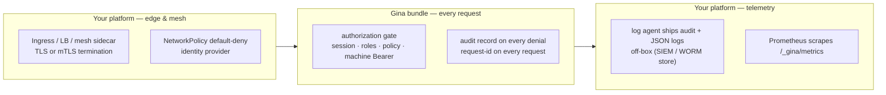
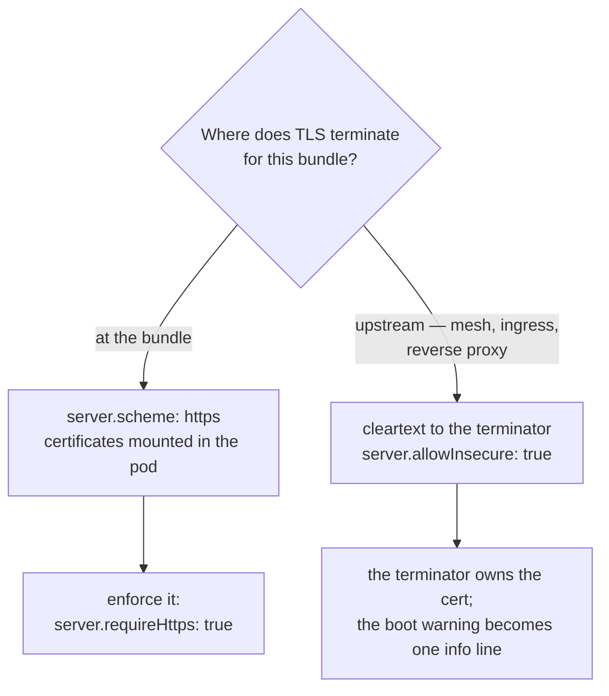

# Running Gina zero-trust

*New in 0.5.26*

Zero trust (NIST SP 800-207) replaces the perimeter model — "inside the network
means trusted" — with per-request verification: every request is authenticated
and authorized regardless of where it comes from, every hop is encrypted, and
everything is recorded on the assumption that something, somewhere, is already
compromised.

Zero trust is a **whole-system property**. No framework is "zero-trust
compliant", and Gina does not claim to be. What the framework supplies is the
in-process half: a per-request **enforcement point**, application-tier
**identity**, and the **telemetry** an assume-breach posture runs on. Your
platform supplies the other half: transport identity (mTLS), the identity
provider, and network segmentation. This page is the recipe for wiring the two
halves together — every control it names is shipped and documented; nothing
here is aspirational.

:::caution A deployment recipe, not a compliance claim
This guide tells you how to *deploy* Gina inside a zero-trust architecture. It
is the honest-boundary companion to the
[compliance control mapping](/guides/compliance): the framework reduces the
surface you have to build, and everything outside the process — mesh, policies,
identity provider, SOC — remains yours to operate.
:::

---

## The trust boundaries at a glance

Three zones, three owners. Gina owns only the middle one.



A request crosses the edge (where transport identity is established), hits the
bundle's per-request authorization gate *before* the controller action runs,
and leaves a telemetry trail your platform ships somewhere the application
cannot rewrite.

---

## Tenet by tenet — what maps where

NIST SP 800-207 §2.1 states seven tenets. For each: the shipped Gina mechanism,
and what your platform brings alongside it.

| NIST tenet | Gina mechanism | Your platform brings |
|---|---|---|
| **1. All data sources and services are resources** | One bundle = one process, one port, its own config — independently deployable and segmentable | The inventory and the segmentation policy around each resource |
| **2. All communication is secured regardless of location** | `server.scheme: https` with per-bundle certificates; a boot-time [transport posture](#transport--say-where-tls-ends) that warns on cleartext outside the local scope, refuses under `server.requireHttps`, and records the upstream-termination assertion (`server.allowInsecure`) | mTLS between workloads (mesh/sidecar); the certificates themselves |
| **3. Access is granted per-session** | The [authorization gate](/guides/route-authorization) re-reads the session on **every** request — nothing is granted per-connection | Session revocation and step-up policies at the application tier |
| **4. Access is determined by dynamic policy** | `requireAuth` / `roles` / a per-bundle [`policy`](/guides/route-authorization) function receiving the live principal | An external PDP (OPA-style) if policy must live outside the process; device-posture signals |
| **5. Monitor and measure integrity and posture** | Opt-in [Prometheus metrics](/guides/observability) with an IP allowlist; boot-time config lints that refuse silently-broken security config | Device posture, image scanning, runtime integrity |
| **6. AuthN and authZ are dynamic and strictly enforced before access** | The gate runs *before* the action and before input validation; [deny-by-default mode](/guides/route-authorization#deny-by-default) gates even the routes you forgot; [machine callers](/guides/route-authorization#machine-callers) authenticate service-to-service requests | The identity provider (OIDC/SAML) the authenticator hook verifies against |
| **7. Collect as much state as possible** | An append-only [audit trail](/guides/audit-trail) that auto-records every authorization denial; an always-on request id echoed and propagated across bundles; structured [JSON logs](/guides/logging) | The pipeline that ships it all off-box, and the SOC that watches it |

---

## Identity — authenticate every request

Zero trust starts by inverting the authorization default. Turn on
[deny-by-default mode](/guides/route-authorization#deny-by-default) so a route
you forget to annotate is gated instead of open:

```json title="config/settings.json"
{
  "auth": {
    "requireAuthByDefault": true,
    "loginRoute": "login"
  }
}
```

Routes that are genuinely public — the login page, a health probe — carry
`"public": true` in their `routing.json` `param` block, a positive marker a
reviewer can audit. The mode is recorded per bundle, the framework-injected
routes ship public, and a configuration that would lock every visitor out
refuses to boot instead of failing at the first request.

For service-to-service calls, declare
[machine callers](/guides/route-authorization#machine-callers): named Bearer
identities whose keys are hashed at boot and compared in constant time, riding
the same `requireAuth` / `roles` / `policy` gate and the same audit trail as
interactive users. To verify JWT/OIDC tokens minted by your identity provider,
plug the verification into the custom authenticator hook
(`auth.machine.authenticator`) — the framework enforces; your provider decides.

:::note Prefer short-lived credentials
A static Bearer secret is only as strong as the transport carrying it and the
store keeping it. Feed machine keys through the
[secrets resolver](/guides/secrets) (`${secret:KEY}` — fail-closed on an unset
key), rotate them, and prefer short-lived tokens verified through the
authenticator hook where your platform can mint them.
:::

---

## Transport — say where TLS ends

Zero trust encrypts every hop, but *where TLS terminates* is a topology
decision — and Gina asks you to state it rather than guess.



**TLS at the bundle.** Follow the [HTTPS guide](/guides/https) to install
certificates; on Kubernetes, mount the TLS secret into the pod at the
certificates path (the [SSL certificates](/guides/k8s-docker) section shows the
exact `volumeMounts` shape). Then assert it: `server.requireHttps: true`
refuses to boot a bundle that would serve cleartext outside the local scope —
before anything binds, so a misconfigured listener is never reachable.

**TLS upstream.** Behind a TLS-terminating mesh sidecar, ingress, or reverse
proxy, the bundle legitimately serves cleartext to the terminator — the
documented [h2c topology](/guides/https#h2c--cleartext-http2). Acknowledge it
with `server.allowInsecure: true`: the boot-time cleartext warning becomes a
single info line, and the assertion is visible in config review. Behind a
front proxy, also set
`server.proxy.requireForwardedHeaders: true` so only requests carrying
`X-Forwarded-Host` are classified as proxied (see the
[settings reference](/reference/settings#server)).

The MCP HTTP transport has the same pair of ideas: it refuses to start
token-less once exposed beyond its loopback defaults, and `--allow-insecure`
is the same "access is restricted upstream" assertion (see
[`bundle:mcp-start`](/cli/cli-bundle)).

Between workloads, transport *identity* — proving which service is calling —
is mTLS, and that belongs to your mesh (Istio, Linkerd, Cilium). Gina's
machine-caller Bearer identity works at the application tier above it; the two
compose.

---

## Segmentation — one bundle, one port, default-deny

Each bundle is its own process on its own port, so the unit of network policy
is the unit of deployment. On Kubernetes, start from default-deny and allow
only the edges you mean:

```yaml title="networkpolicy.yaml"
apiVersion: networking.k8s.io/v1
kind: NetworkPolicy
metadata:
  name: default-deny-ingress
  namespace: myproject
spec:
  podSelector: {}
  policyTypes: ["Ingress"]
---
apiVersion: networking.k8s.io/v1
kind: NetworkPolicy
metadata:
  name: allow-api-from-proxy
  namespace: myproject
spec:
  podSelector:
    matchLabels:
      app: myproject-api
  policyTypes: ["Ingress"]
  ingress:
    - from:
        - podSelector:
            matchLabels:
              app: myproject-proxy
      ports:
        - protocol: TCP
          port: 3100
```

:::note Extending the deny to egress
A full zero-trust posture also default-denies egress. If you add
`"Egress"` to `policyTypes`, allow DNS first (UDP/TCP 53 to your cluster's
DNS service) and then each upstream your bundles actually call — connectors,
webhooks, sibling bundles — or the bundle will fail in ways that look like
application bugs.
:::

**Keep the control plane private.** The framework's command socket (8124) and
log listener (8125) are a control plane, not an application surface: anything
that can reach the command socket can run framework commands. They bind
`127.0.0.1` by default — leave them there, and treat any
[`bind_host`](/concepts/ports#framework-socket-ports) widening as a deliberate,
firewalled exception. Containerized bundles launched with `gina-container`
have no socket IPC at all, so a single-bundle pod exposes only its HTTP port.

---

## Assume breach — audit, correlate, observe

Zero trust assumes the interesting question is not *whether* something gets in
but *how fast you see it*. Three shipped surfaces, all opt-in, all worth
turning on in every non-local scope:

- **[Audit trail](/guides/audit-trail)** — `audit.enabled: true` gives you an
  append-only, actor-attributed record, and every authorization denial is
  recorded automatically: the failed-access feed a SOC watches first. Ship the
  JSONL file off-box with your platform's log agent so the application cannot
  rewrite its own history — the
  [compliance guide](/guides/compliance) shows the Fluent Bit / Vector /
  Object-Lock pattern.
- **Request correlation** — every request carries an id, echoed as
  `X-Request-Id` and propagated on outbound `self.query()` calls, so one
  incident reconstructs across bundles
  (see [Observability → Request correlation](/guides/observability#request-correlation)).
- **[Metrics](/guides/observability)** — `metrics.enabled: true` exposes
  Prometheus counters at `/_gina/metrics` behind an IP allowlist that reads
  the socket address, never `X-Forwarded-For`. Alert on 401/403 rates: a
  spike in denials is the deny-by-default posture doing its job.
- **[Structured logs](/guides/logging)** — `GINA_LOG_FORMAT=json` makes every
  log line machine-parseable, with the request id on request-scoped lines.

---

## Defense-in-depth on the app surface

The perimeter may be gone, but the browser-facing surface still wants its
armor. Each of these is one registration away:

- [Security headers](/guides/security-headers) — the `SecurityHeaders`
  orchestrator applies a safe-default subset; [CSP](/guides/csp) can mint a
  per-response nonce.
- [CSRF protection](/guides/csrf) — signed double-submit token plus an
  Origin/Referer pre-filter.
- [Hardened session cookies](/guides/sessions#hardened-cookie-defaults) —
  `HttpOnly` by default, and a boot invariant rejects `SameSite=None` without
  `Secure`.
- [Secrets](/guides/secrets) — `${secret:KEY}` keeps credentials out of
  source and fails closed when a key is missing.
- Upload group gating — an upload whose group is not configured is refused
  with a 400 (see [File uploads](/guides/file-uploads)).

---

## The deployment checklist

1. Terminate **mTLS at the mesh or ingress**; decide per bundle where TLS
   ends, and record it (`server.requireHttps` or `server.allowInsecure`).
2. Turn on **deny-by-default authorization** and annotate the public routes.
3. Declare **machine callers** for every service-to-service edge; feed keys
   through `${secret:KEY}`; verify provider-minted tokens via the
   authenticator hook.
4. Apply **NetworkPolicy default-deny** and allow only the edges you mean.
5. Keep the **control plane on loopback**; never expose 8124/8125 beyond the
   host.
6. Enable **audit + metrics + JSON logs** in every non-local scope and ship
   them off-box.
7. Register the **header, CSRF, and session** plugins on browser-facing
   bundles.
8. Alert on **authorization-denial rates** and boot-time refusals — both are
   designed to be loud.

---

## What your platform must bring

Stating the boundary plainly, in the spirit of the
[compliance guide](/guides/compliance)'s rule — a control you don't have is
not a control:

- **Transport identity (mTLS)** between workloads — mesh or ingress territory;
  the framework does not hold client certificates.
- **The identity provider** — Gina verifies and enforces; it does not mint
  identities.
- **Device posture and user behavior signals** — no framework sees them.
- **Application-level rate limiting** — on the [roadmap](/roadmap); today,
  throttle at the ingress (the HTTP/2 rapid-reset limiter covers the
  transport flood case).
- **Distributed tracing** — on the roadmap; the request-id chain covers
  cross-bundle correlation today.

---

## See also

- [Route authorization](/guides/route-authorization) — the gate, roles,
  policies, machine callers, deny-by-default
- [HTTPS](/guides/https) — certificates, HTTP/2, and the h2c topology
- [Audit trail](/guides/audit-trail) — the append-only record and its
  automatic denial entries
- [Observability](/guides/observability) — metrics, the IP allowlist, request
  correlation
- [Compliance control mapping](/guides/compliance) — the shared-responsibility
  model this guide deploys
- [Kubernetes & Docker](/guides/k8s-docker) — probes, TLS secrets, and the
  container launch path
- [Migration Guide — 0.5.25 → 0.5.26](/migration#0525--0526) — the release
  notes for the posture knobs
