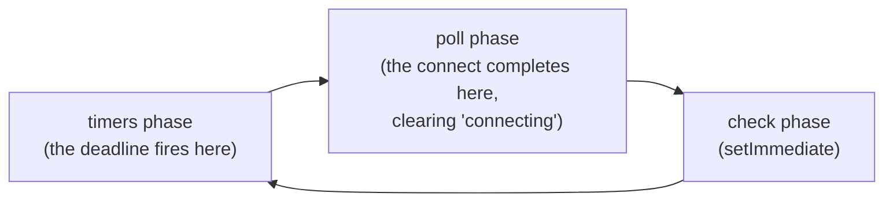

# Migration Guide

Step-by-step notes for upgrading between Gina versions. Each section lists only
the changes that require action on your part. Additive changes (new optional
fields, new features) are noted for awareness but do not require any change to
existing code. Start from the section that matches your current version and work
upward to the target version.

---

## 0.6.10 → 0.6.11

A fixes-only release: seven fixes, two of them reported through GitHub issues
(#63, #64). **One behaviour change to check** — `Collection.replace()` now
**throws** where it previously failed silently, when neither side of the
comparison carries a usable key (see below). Everything else needs no action.

Pickup is a bundle **restart AND rebuild**: the browser bundle changed in this
release (`lib/collection` and the FormValidator plugin are bundled), so a
restart alone keeps serving the old client code — run `gina bundle:build` for
each bundle as well as `gina bundle:restart`. `0.6.11` is a patch, so the
`shortVersion` stays `0.6` and your `~/.gina/0.6/settings.json` is untouched.

### Fixed — `Collection.replace()` no longer silently discards the write (check call sites that relied on the quiet no-op)

`replace(filter, set[, key])` locates each entry to overwrite by comparing a
key on the stored entry against the same key on `set`. That key used to be
resolved by inspecting the **stored entry alone**: the internal `_uuid` if the
stored entry had one, otherwise `id`, refusing only when the stored entry had
neither. So in the one combination none of those branches covered — the stored
entry **has** a `_uuid` and `set` **does not** — the comparison became
`<storedUuid> == undefined`, which is never true. Nothing matched, nothing was
replaced, no error was raised, and the call returned a chainable result that
looked entirely successful: a silent, lossy write.

Why it looked intermittent: a Collection built from fresh raw data keeps no
`_uuid` on its instance rows, so the `id` fallback fired and the call worked.
A stored `_uuid` is present exactly when you re-load an array that a previous
**chained** call returned — chained results carry the internal key on every
entry they did not replace.

The key is now resolved per entry from **both** sides:

1. the internal `_uuid`, when the stored entry **and** `set` both carry one;
2. otherwise `id`, when both carry one;
3. otherwise the call **throws** `No comparison key defined !`.

An explicitly supplied `key` argument is still honoured exactly as given — no
fallback, no refusal. The resolved key is also scoped per entry rather than
assigned to a shared variable, so a fallback taken for one entry can no longer
apply to the entries examined after it.

**What to check.** A call site that was silently replacing nothing will now
surface an error instead of failing invisibly — that is the point of the fix,
but it is a behaviour change. Calls that pass an explicit key, or where both
sides carry an `id`, are unaffected; every previously-working call is
unaffected. When you persist the result of a chained `replace()`, prefer
`toRaw()` so the internal `_uuid` does not travel into your store. Browser-bundled.

### Fixed — concurrent `util.promisify(entity.method)` calls no longer cross-deliver or hang (no action required; read the residual if you promisify under concurrency)

When an entity method is called detached — `util.promisify(entity.method)` with
`this` unbound and a trailing callback — the framework's promisify fast-path
kept a **single scalar** slot for the pending callback. Two concurrent calls on
the same method raced on that slot: the second overwrote the first, the first
result to arrive was flushed to the last-registered callback (one caller
receiving another's record), and the displaced caller's `once` listener found
its guard false, so its promise **never settled** — a request left hanging with
nothing logged, and a read-modify-write variant that could persist one key's
document under another.

The entity-context path already used a FIFO queue with a single persistent
dispatch listener; the fast-path now uses the same shape. **Starvation is
eliminated** — every concurrent caller settles — and **cross-delivery is closed
whenever the underlying operations complete in call order**.

**The residual, stated so you can decide.** When operations can complete out of
call order, results are still paired by *arrival* order, so two calls on the
same method can still swap results. That is identical to what the
entity-context path already carried; the fix aligns the two paths rather than
introducing a new mechanism. If your method can complete out of order under
concurrency, give it true per-call identity by **returning a Promise** instead
of emitting its trigger — the framework resolves the exact call that made it.
The [Models guide](/guides/models) concurrency note covers both shapes.
Server-side; a restart picks it up.

### Fixed — FormValidator: fast typing into a Safari `autocomplete="off"` field no longer scrambles the text (no action required)

On Safari, the [form validation](/guides/forms-and-validation) keydown
interception for a live-checked `autocomplete="off"` text input restored the
caret only two timer hops after each programmatic value rebuild — and a value
assignment parks the caret at the end of the field — so a quick second
keystroke read a stale position and characters landed at the end instead of at
the caret ("AXB" where you typed "ABX"). Every rebuild now commits the caret
synchronously and records the intended position on the element; while a
deferred restore is still in flight the interception trusts that recorded
position, and the restore re-asserts the latest committed position instead of a
stale per-keystroke capture. The transient-readonly autofill suppression is
mechanism-unchanged. Browser-bundled.

### Fixed — FormValidator: three position-0 edge cases in the same Safari interception (no action required)

In the same `autocomplete="off"` keydown interception, three edge defects now
match native field behaviour: **Backspace** at the start of the field deleted
the first character (native is a no-op); **Delete** with a selection starting
at position 0 removed one character more than the selection; and **ArrowLeft**
at position 0 teleported the caret to the end of the field
(`setSelectionRange(-1)` wraps to the unsigned maximum). Browser-bundled.

### Fixed — FormValidator: a refused submit's answer stays visible and focused on async-`query` forms (no action required)

On a form with an async `query` rule and a committed error, a refused submit's
answer could render, take focus, and then be hidden again milliseconds later
when the click landed while a previous validation round was still settling —
the late completion's display refresh read the answered field as "being typed
in" (it was the active element, because the answer had just focused it) and
re-hid the very message the answer had rendered. The error message and its
field focus now stay put: the framework records that the focus was placed by
the answer rather than by the user, both display-refresh paths honour that
record however late they run, and the first genuine user interaction (typing,
clicking, tabbing away) releases it — so the deliberate hide-while-typing
behaviour is unchanged. Browser-bundled.

### Fixed — FormValidator: a stale not-ready submit marker no longer refuses every click until reload (no action required)

On a form whose async `query` rule rides a field that is **not declared last**,
the display-only validation pass answering a refused submit click could
silently never complete — its result matched no completion route — so the stale
not-ready marker on the submit trigger was never re-synced and a fully valid
form kept refusing every click until reload. That pass now carries its own
completion identity and always completes: the refused click renders the current
validation state, the trigger state re-syncs from the fresh result, and the next
click on a valid form goes through. Field declaration order no longer decides
whether a stale marker can heal. Browser-bundled.

### Fixed — Inspector (development mode): the page-weight badge and late timeline bars no longer go missing (no action required)

The [Inspector](/guides/inspector)'s View tab could show two badges instead of
three — dropping the page-weight badge until the Inspector was refreshed — and
its Flow tab could be missing the template-compile, execute, response-write and
total bars. Both came from one cause: the dev statusbar hands the page payload
to the Inspector **before** the render delegates append their late-bind patch
script above `</body>`, and that patch only mutated the in-memory object, so
every channel the Inspector can read kept the emit-time payload for the life of
the page (the page weight is unknown at emit, since the body length is not
final until the render completes). The asymmetry made it look intermittent: the
server-side time IS known at emit, so the load badge always rendered while the
weight badge silently did not.

Both of the Inspector's data channels are now refreshed at the end of that
patch, after the values are written — the localStorage fallback mirror, and the
per-tab broadcast channel a statusbar-launched Inspector actually binds to. The
broadcast channel is keyed from per-tab session storage rather than the shared
cross-tab advert, so one tab can never publish onto another tab's channel. The
nunjucks delegate additionally injects its patch through a function replacer
rather than a string one, so a timeline entry containing a dollar sequence can
no longer corrupt the emitted script. Development mode only; server-side; no
configuration change is required.

## 0.6.9 → 0.6.10

### Maintenance mode (new feature — opt-in, nothing changes until you enable it)

A bundle can now be closed to the public **without being stopped**, via a new
`server.maintenance` block in `settings.json`. It is disabled by default, so
this release changes nothing for an existing project until you opt in.

```json
"maintenance": {
  "enabled": false,
  "retryAfter": 300,
  "message": "Back shortly",
  "bypassKey": "${secret:MAINTENANCE_BYPASS_KEY}",
  "allowFrom": ["127.0.0.1", "::1"]
}
```

While a window is open, every request except the framework's own `/_gina/*`
endpoints is answered `503` with `Retry-After` and `Cache-Control: no-store` —
a self-contained page for a browser navigation, and the standard JSON body for
XHR, SPA-fragment and JSON callers.

**Why this is not the same as a maintenance middleware.** Route middleware runs
only *after* a route has matched, so it cannot cover static assets or URLs that
match no route. This gate sits ahead of static serving, both output-cache serve
points and routing, so those are covered too. The liveness endpoint
`/_gina/health/check` deliberately keeps answering `200`, so an orchestrator
does not restart healthy instances over a declared window — and the toggle
itself stays reachable, so you are never stranded outside your own off switch.

**Getting yourself through.** The `bypassKey` works under any deployment: send
it as an `x-gina-maintenance-key` header, or once as `?gina-maintenance-key=…`
in the address bar — which then sets a short-lived cookie and redirects to the
same URL without the secret, so it leaves your history and `Referer`. The
supplementary `allowFrom` list applies **only** to requests that did not arrive
through a reverse proxy: behind one, every address is the proxy's, so an
unconditioned IP list would let either everybody or nobody through.

**Flipping it at runtime** is possible through the admin-gated
`POST /_gina/maintenance` with an optional `ttlSeconds`. A runtime flip is
**not persisted** — a restart returns the bundle to whatever `settings.json`
says — and a lapsed expiry reverts to your *configuration* rather than to
"off", so a forgotten timer cannot re-open a site that configuration says is
closed. For a window that must survive restarts, set `enabled: true` in
configuration.

Full detail in the [maintenance mode guide](/guides/maintenance-mode).

---

### Admin `/_gina/*` endpoints now refuse cross-origin writes (security — no action for most projects)

This release closes a **cross-site request forgery** hole present in every
version up to and including `0.6.9`.

The admin control endpoints authorise callers by IP allowlist alone
(`app.json` `admin.allowFrom`, loopback by default). That is an *ambient*
credential: a browser attaches it automatically to any request a page makes.
So an operator browsing from an allowlisted machine — by default, the machine
running the bundle — could be lured to a page that silently issued writes to
`/_gina/storage/gc`, `/_gina/cache/clear`, `/_gina/release/rebuild` or
`/_gina/maintenance`.

`/_gina/storage/gc`, `/_gina/cache/clear` and `/_gina/release/rebuild` read
their entire input from the **query string** and never read a request body, so
the attack required no JavaScript and no CORS involvement at all — a plain
auto-submitting HTML form was enough, and browsers have always permitted a
form to POST cross-origin. The attacker could not read any response, but the
write still happened.

From `0.6.10`, a cross-origin write to any `/_gina/*` endpoint is refused with
**403** on both engines. The check consults `Sec-Fetch-Site` where the browser
sends it, and otherwise compares `Origin` against the authority the client
actually connected to — never against `X-Forwarded-Host` or any other
forwarded header, which an attacker controls.

**Two things are deliberately unaffected**, so most projects need no action:

- **Requests carrying no browser origin signal still work.** `curl`, the gina
  CLI and deploy scripts send neither header, and CSRF is an attack on ambient
  *browser* credentials — so operator tooling is unchanged.
- **Safe methods are untouched** (`GET`, `HEAD`, `OPTIONS`, `TRACE`). The
  Inspector's deliberately cross-origin SSE and GET channels — `/_gina/agent`,
  `/_gina/logs`, `/_gina/indexes` — keep working exactly as before.

**You only need to act if** you drive a `/_gina/*` write from a browser page
served on a *different* origin from the bundle. That is refused now. Issue the
call from a non-browser client instead, or serve the page from the same origin
as the bundle.

:::note
This is defence in depth, not a replacement for the IP allowlist. Keep
`admin.allowFrom` as tight as your deployment allows — it remains the primary
gate on these endpoints.
:::

---

### Boot-time bundle mounts are now idempotent, atomic and concurrency-safe (awareness — no action for most projects)

Every boot used to re-create every declared bundle's mount symlink in two
non-atomic steps (unlink, then create), with no mutual exclusion. With several
processes booting **one shared project tree** — replicas over a POSIX network
filesystem, or two containers bind-mounting the same checkout — the contended
rewrites could kill a boot outright (a lost race surfaced as `EEXIST`, `ENOENT`
or, on network filesystems, `EIO` from the mount path) or abort the shared
config load for every bundle in the project.

From `0.6.10`:

- A mount link that already resolves to the intended source is **kept
  untouched** — the steady-state boot writes nothing, so concurrent boots of an
  already-correct tree no longer contend at all.
- A wrong or missing link is published **atomically** (a temp sibling in the
  same directory, then `rename(2)`), so the mount name never disappears
  mid-rewrite.
- A concurrent process publishing the **identical** link is treated as success
  instead of a fatal error.
- The project `bundles/`, `tmp/` and `cache/` directories are created
  race-free (recursive create instead of check-then-create).

No configuration is involved and the mount layout on disk is unchanged.

**One behaviour change to be aware of:** a *real directory* (not a symlink)
sitting at a bundle's mount path used to be silently deleted and replaced by
the link during config load. It now **refuses the boot loudly** instead,
naming the path. If you hit that refusal after upgrading, remove or relocate
the directory — a real directory at a mount path was almost certainly a
deployment accident the old behaviour was papering over.

---

## 0.6.8 → 0.6.9

This release fixes **one security flaw**, live in every published version that
attaches `server.ioServer`. It closes the receiver half of the axis `0.6.8`
opened, and it fails closed — so if you use targeted pushes, confirm they still
arrive after upgrading.

Two `secrets.file` shapes now **refuse to boot** (see below), so check that
config if you use the file tier. Pickup is a **bundle restart**; the browser
bundle is byte-identical to `0.6.8`, so no rebuild is needed. `0.6.9` is a
patch, so the `shortVersion` stays `0.6` and your `~/.gina/0.6/settings.json`
is untouched.

### Security — an engine.io socket's session is now proven, not claimed (verify targeted pushes still arrive)

A socket's `sessionId` — the value every targeted `self.push()` matches
against — was set from `payload.session.id`, **a field the browser sends**, on
every message, and was never checked against the connection's own session. Any
client could therefore claim another user's session and receive the pushes
addressed to it. It was also cheaper than stealing the cookie: a rendered page
carries the **bare** session id in its bootstrap script, while the cookie
carries the signed form, so impersonation required strictly less than the
cookie theft the signature exists to prevent.

The binding now happens **once, at connection**, from the upgrade request's own
cookie. The framework replays your bundle's own session middleware over that
request, so the same secret, store and cookie name apply — no new
configuration, and the framework never handles your secret. It works whether or
not the bundle adopted `gina.plugins.Session()`. The response handed to that
middleware is inert, so a socket upgrade can never emit `Set-Cookie` or persist
a session.

**It fails closed.** No session middleware, no cookie, or a cookie that does not
verify leaves the socket with no id — and an id-less socket matches no targeted
push, receiving only deliberate broadcasts. A client that still asserts an id is
logged and ignored, which doubles as an impersonation detector.

Nothing to change in your code. But because the failure direction is silence
rather than an error, **check that your targeted pushes still land** — if they
stop, the socket is not resolving a session, and the log will say so.

### Added — `gina.pushToSession()`, for pushing from outside a request

`self.push()` needs a live request-bound controller, so code that has none — a
`lib/job` handler, a cron tick, a boot hook — had no route to a user's socket at
all. The pattern reached for instead was a background worker making an HTTP hop
carrying the user's session id in the request body, and that shape *was* the
`0.6.8` vulnerability; closing it left the use case with nowhere to go. This is
the replacement:

```js
gina.pushToSession(sessionID, payload, function (err, result) {
    if (err) { return handle(err); }        // err.code is machine-readable
    // result.delivered === number of sockets written
});
```

It is deliberately narrow. The recipient is a **required** argument: an absent
or empty `sessionID` is an error, never a fan-out, and no broadcast is reachable
from this API at all — a deliberate all-clients send stays in-request as
`self.push(payload, { broadcast: true })`.

**Source the recipient from server-held state** — capture it when the work is
queued and keep it server-side. That is the default because it gives the caller
nothing to influence: a **bare** recipient id round-tripped through the browser —
in a body, a query string, any client-writable field — re-opens the `0.6.8` flaw
one layer up, because whoever writes the field chooses the target.

**A server-minted, integrity-protected token that names the recipient is a
different shape, and it is sanctioned** — it is the same pattern the `0.6.8`
entry below describes for `self.push()`'s authenticated hop. The distinction is
*who made the choice*: a signature fixes the recipient at mint time, so the
browser can only replay a decision your server already made, never make one.
Holding that line means the handler **verifies** the token and derives the
recipient **only from the verified claims** — a plaintext id travelling beside
it is never consulted, and a disagreeing one is overridden and logged, which
doubles as tamper detection — and an absent or unverifiable token fails
**closed**, never through to an unsigned fallback. Keep the token short-lived:
it is a bearer credential for pushing to one session, and targeting integrity
does not make it replay-proof. The receiver side backstops the stale case — a
token naming a session that has since been destroyed or rotated matches no
bound socket and simply delivers to zero.

Delivery is reported rather than assumed: the callback fires exactly once with
the number of sockets written, and `delivered: 0` is a **normal** outcome (the
user closed the tab), not an error. Errors carry `err.code` —
`PUSH_INVALID_RECIPIENT`, `PUSH_INVALID_PAYLOAD`, `PUSH_CHANNEL_NOT_CONFIGURED`,
`PUSH_CHANNEL_NOT_READY`, `PUSH_PAYLOAD_SERIALIZE_FAILED`.

Requires the `isaac` engine with `server.ioServer` attached; on the Express
engine there is no engine.io channel and the call now says so by name. Also
available as `lib.push.toSession()` for code holding its own server instance.

### Fixed — `engine: "express"` boots and serves on Express 5 (no action required; range now declared)

A bundle opting into the Express engine could not boot on Express 5 — the boot
aborted at mount time before ever listening, and even past the mount every
request would have died on Express 5's `req.query` getter. Both halves are
fixed, and the supported range is declared for the first time: **Express
`>= 4 < 6`**, with 4 and 5 both verified live. The engine now logs the detected
Express version at construction; an Express major outside the range logs a loud
warning but still boots.

Express remains yours to provide: install it in your project (`npm install
express@^5` or `@^4`) — the framework deliberately ships no express dependency,
and no peer dependency either. Bundles on the default `isaac` engine are
untouched.

### Fixed — `project:add` writes a `.gitignore` (new projects only; yours is never touched)

The framework has always shipped a `core/template/_gitignore` whose underscore
prefix implies a rename to the dotted form at scaffold time. Nothing performed
that rename, so the template had no consumer and **every scaffolded project came
out with no `.gitignore` at all** — which meant the secret-file globs it carries
were protecting nothing, and a new project would happily track a `secrets.env`
or `.env.production` on its first commit.

`gina project:add` now copies it to `<project>/.gitignore`, **only when the
project has none**. Your own file is never replaced or appended to, so the step
is idempotent and re-running the command over an existing project changes
nothing. It applies on the import path too, since an imported project without a
`.gitignore` has the same exposure.

Nothing to do for existing projects — they are untouched. If you created one
before `0.6.9` and want the same coverage, the globs worth having are:

```gitignore
.env
.env.*
*.env
!.env.example
!*.example.env
```

All three positive forms are needed: a bare `.env` matches neither
`secrets.env` nor `.env.production`.

### Fixed — the environment really does beat the secrets file again (no action required)

The guide has always said [the environment always
wins](/guides/secrets#the-environment-always-wins) over a `secrets.file`
tier. For one shape of key that was not true. The two environment tiers were
read as `frameworkValue || process.env[KEY]`, and the CLI stores swept
`GINA_*` / `VENDOR_*` / `USER_*` values as **real booleans** — so a key whose
swept value was boolean `true` satisfied the `||`, `process.env` was never
consulted, and the file tier won over a set environment variable. A stale
plaintext file could therefore shadow the credential the platform injected,
which is the exact failure the precedence rule exists to prevent.

The tiers are now read independently: only a non-empty **string** from the
framework environment wins, and anything else — a boolean, a number, unset,
or empty — falls through to `process.env`. Nothing to change in your config;
if you were affected you were silently on the wrong value.

### Fixed — three malformed `secrets.file` shapes are no longer silent

Two of these now **refuse to boot**, so check your config if you use the file
tier. Both are typos rather than working configurations, and each error names
the offending path:

- **A whitespace-only entry** (`"file": [" "]`) is refused. The schema's
  `minLength: 1` counts a space, so it used to pass validation and build a
  tier that could never resolve anything — visible only as a suppressed debug
  line.
- **A path containing an empty segment** (`//`) is refused, because such a path
  does not name the file it appears to — POSIX reads `<a>//<b>` as `<a>/<b>`.
  The cause worth catching is a `${...}` token that resolved to an *empty*
  value: `"${homedir}/${scope}/secrets.env"` with an empty scope collapses to
  `<home>//secrets.env`, i.e. a silent read of the file one directory **up**,
  with no unresolved token left for the existing guard to see.

  **Check this one if you set `GINA_HOMEDIR` (or any path token) with a
  trailing slash** — `"/opt/gina/"` plus `"${homedir}/secrets.env"` also
  produces `//`. That case is harmless (it resolves to the file you meant) but
  is indistinguishable from the dangerous one once the path is assembled, so
  boot refuses on both rather than risk running on the wrong credential.
  Dropping the trailing slash, or the doubled separator, fixes it.

The third is a warning, not a refusal: **an empty array** (`"file": []`)
still disables the file tier exactly like `null`, but it now says so at boot.
Emptying the array to drop one layer drops the whole tier.

`schema/settings.json` also gains `minItems: 1` for editor feedback. No
runtime validator reads that schema, so the runtime guards above are the
enforcement.

### Fixed — path-helper copy failures surface a real `Error` (check literal error-string matching)

The file copier behind `_().cp()` and `PathObject.mv()` now stages bytes to a
temp sibling and publishes with an atomic rename: a reader can no longer
observe a truncated destination mid-copy, and a pre-existing destination
survives a failed copy instead of being deleted before the copy had succeeded.
A source-side read error no longer kills the process, and a failed copy settles
its callback exactly once.

**One contract note:** failures now propagate an `Error` object instead of the
former plain string. `if (err)` checks and `err.message` reads are unaffected;
only code matching the literal pre-existing string
`Error on Path.cp(...): Not found ...` needs adjusting — and `err.stack` now
actually exists, where the string shape logged `undefined`.

### Added — a bundle can declare which scopes it is deployed in (opt-in; no action required)

Until now every bundle registered in `manifest.json` was deployed in **every**
scope, and the only way to exclude one was to leave it out of the manifest —
which removes it from all scopes at once. A bundle entry can now carry a
`scopes` allow-list:

```json
"newthing": {
  "version": "0.0.1",
  "src": "src/newthing",
  "link": "bundles/newthing",
  "scopes": ["local"]
}
```

An **absent** key means every scope, so existing manifests are unaffected and no
migration is needed. `[]` parks the bundle everywhere. A value that is not an
array is reported as a manifest error naming the bundle, rather than being read
as "no scopes".

Booting a project and `gina project:build` **skip** an excluded bundle with a
notice; starting it, or naming it explicitly in `gina bundle:build <name>
--scope=<scope>`, is **refused** by name, so a deploy script cannot mistake
"built nothing" for success.

**If you already prune `releases.<scope>` entries by hand to keep a bundle out of
an environment, stop** — it never worked: both build commands walk every scope in
the project and re-create any missing release entry, so the deletion reappears on
the next build. Use `scopes` instead. See
['Restrict a bundle to certain scopes'](/concepts/scopes#restrict-a-bundle-to-certain-scopes).

### Fixed — `project:add` / `project:import` no longer rebuild the `bundles` block destructively

Both commands used to reset a project's whole `manifest.json` `bundles` block
whenever the number of declared bundles differed from the number of directories
found on disk — and the reset applied to **every registered project on the
machine**, not just the one being added or imported. A bystander project was
left with a permanently empty `bundles` block (which fails its next boot), a
plain `project:add` lost the block with nothing rebuilding it, and on the import
path the rebuilt entries carried none of the original per-bundle data: the new
`scopes` allow-list, `gina_version` and any custom key were dropped, and each
bundle's `version`, `tag` and release targets were reset to defaults.

The commands now treat the manifest as the authority:

- **Declared bundles are preserved untouched** — `scopes` declarations,
  versions, custom keys and release targets all survive registration.
- **Bundles found on disk but missing from the manifest are still registered**
  on `project:import`, additively — the legitimate function the old reset
  served.
- **A declared bundle whose directory is absent is warned about** (naming the
  bundle and the scanned location) and **never auto-pruned** — the declaration
  may be deliberate, e.g. a bundle restricted to other scopes. Removing an
  entry for good remains `gina bundle:remove`'s job.

Two adjacent defects in the same pass are fixed with it: the rescan built a
wrong `settings.json` lookup path for every bundle after the first (the
protocol/scheme consistency check silently skipped those bundles), and
importing a project whose manifest declares a bundle with no tree on disk could
crash the port/settings pass.

If you previously re-applied `scopes` keys after running either command as a
workaround, you can stop.

:::caution Action may be required in one narrow case
Because a declared-but-absent bundle is now **preserved** rather than dropped,
one shape that previously booted can now refuse: a manifest that declares a
bundle whose directory is absent **and** carries no `scopes` key. The old reset
removed such declarations as a side effect of emptying the block; now they
survive, and the boot refuses with an error naming the bundle, environment,
scope and link path.

This is the intended behaviour — the declaration is telling gina to deploy
something that is not there — but it is a boot that used to succeed, so it is
worth checking before you upgrade. Two supported fixes, depending on intent:

- **The bundle should not be deployed at this scope** — give it a `scopes`
  allow-list. Bundles excluded from the booting scope are skipped cleanly,
  which is why this shape does not affect deployments that already use
  `scopes`.
- **The bundle is gone for good** — remove the entry with
  `gina bundle:remove <name> @<project>`.

Registration also warns about the same condition, naming the bundle and the
directory it scanned, so the state is reported before the boot ever refuses.
:::

### Fixed — registration no longer adopts invalid protocol/scheme declarations, nor reads other projects' bundles

Two related defects in the same registration pass:

- A bundle's `settings.json` could declare **any string** as `server.protocol`
  or `server.scheme`, and `project:add`/`project:import` adopted it straight
  into the project's `protocols`/`schemes` lists in `~/.gina/projects.json` —
  where `gina image:build` then baked it into the synthesized container
  image's environment. The framework's supported sets in `~/main.json` are now
  the authority: a declared value still extends the project's list when the
  framework supports it, but an unsupported one is reported by name (bundle,
  value, and the allowed set) and adopted nowhere — not even as the bundle's
  default.
- The pass resolved **every** registered project's bundles against the path of
  the project being registered — so two projects each holding a bundle of the
  same name (an `api` or `web` in both, say) leaked declarations into each
  other's registry entries, from commands that never named them. Each
  project's bundles now resolve against that project's own path.

The import-time heal that rewrites an invalid bundle declaration to the
project default still runs — it is what keeps the bundle bootable — but it now
reports each change by name (`server.protocol "x" -> "http/1.1"`) as a
warning, instead of rewriting the file behind a debug line.

No action required. If a registration now prints a warning naming a bundle's
protocol or scheme, that declaration was invalid all along — fix the bundle's
`settings.json` (allowed values: `http/1.1`, `http/2.0`; `http`, `https`).

### Fixed — the port-setup merge read the wrong list (no action required)

The pass that folds newly seen protocols and schemes into a project's registry
lists indexed the **project's own** list by the *contextual* list's position, so
once the contextual list outgrew the project's, the overshoot read `undefined`.

No user-visible consequence was demonstrated — a scene built specifically to arm
the overshoot produced none — so this ships as a correctness fix rather than a
behaviour change. The merge now reads the contextual list by its own index,
exactly as the environment merge beside it always did, and it admits only values
the framework supports: the contextual list also grows from `ports.json` keys,
which can retain a protocol a framework update has since dropped, and those no
longer re-enter a project's lists.

### Fixed — a bundle whose release path cannot be linked now says which bundle, and why

A failed release link during configuration load reported
`TypeError: Cannot set properties of undefined (setting 'env')` — an
uncaughtException pointing at framework internals rather than at the path you had
to fix. Because the configuration load is shared across a project, one bundle's
missing release tree took down **every** bundle in it, and the server never bound,
so a startup probe saw only a refused connection.

The real reason is now propagated and reported: the failure names the bundle, the
environment and the scope, keeps the underlying error, and exits cleanly instead
of dying as an unhandled exception. No action required — this is diagnosability
only, and the class of deployment that failed before still fails, just legibly.

### Fixed — `self.push()` on an engine without an engine.io channel (Express users)

Calling `self.push()` on the Express engine dereferenced an absent engine.io
channel and surfaced as an opaque 500 naming neither push nor the missing
channel. It now warns, passes a supplied `callback` a
`PUSH_CHANNEL_NOT_CONFIGURED` error, and sends nothing — **without failing the
request**, so a notification side-channel no longer takes down the response it
rode in on.

This is the first time `self.push()` honours the `callback(err, result)` contract
its documentation always described but the implementation never invoked. If you
call `self.push()` on Express and relied on the 500 to detect the misconfiguration,
check the log or pass a callback instead. The push channel requires the `isaac`
engine with `server.ioServer` attached.

## 0.6.7 → 0.6.8

This release fixes **two security flaws**, both live in every published version up
to and including `0.6.7`. One of them changes behaviour you may be relying on —
read the `self.push()` entry before upgrading.

Pickup is a **bundle restart**; the browser bundle is byte-identical to `0.6.7`, so
unlike that release this one needs no rebuild. `0.6.8` is a patch, so the
`shortVersion` stays `0.6` and your `~/.gina/0.6/settings.json` is untouched.

### Security — `self.push()` decides its own recipient (ACTION REQUIRED if you push at all)

`self.push()` used to read its recipient from the request body. A caller could aim a
push at any session by sending that session's id, and **omitting the id broadcast the
payload to every connected client**. The payload defaults to request input too, so on
any route that reached `push()` an unprivileged caller could deliver content of their
choosing to everyone, or to a chosen victim.

The recipient is now decided server-side, in this order:

1. an explicit `option.sessionID` that **your** code supplies,
2. otherwise the caller's own session,
3. otherwise nothing at all, with a warning.

Reaching every connected client now requires asking for it deliberately with
`{ broadcast: true }`. The request body cannot influence the recipient in any branch.

**What breaks.** A bare `self.push()` driven over an HTTP hop by a background worker —
a job runner reporting progress to the user who queued it, threading that user's
session id **through the request** — now resolves to the caller's own session and stops
delivering. Carrying the recipient in the request *is* the vulnerability, so that hop
cannot be preserved as written.

**The shape is recoverable when the hop is authenticated.** If the worker's hop lands in
an ordinary request-bound controller and carries a credential your own server minted —
one that names the target session — then the controller can decode what it has just
authenticated and name the recipient itself:

```js
// in the controller the worker's hop reaches
self.push(payload, { sessionID: verified.sessionID });
```

`option.sessionID` is the **first** branch of the resolution order, so it wins over the
caller's own session. The recipient is still decided server-side: it comes from a value
your code verified, never from the request body, which `push()` no longer reads for it at
all. Pass it explicitly rather than leaning on the fallback — the fallback resolves to
whatever session the *hop's own request* carries, which is not the user you are pushing
to unless your auth layer deliberately adopts it, the narrow case described below.

**`0.6.7` accepts `option` but ignores it.** Checked at the `v0.6.7` tag: `push()` already
had the `option` parameter there, but the recipient is `req[method].sessionID` and nothing
else — the argument is never read for it. So passing `{ sessionID }` on its own changes
nothing before `0.6.8`, and does so silently. If one codebase has to work against both
versions during a rollout, write **both** sinks: the request value `0.6.7` reads, and the
option `0.6.8` honours.

**What genuinely has no substitute** is a worker with no request context at all — one that
never makes such a hop. `push()` returns early once the request is released, and nothing
outside a live request-bound controller can reach the socket set, so that shape has
nothing to migrate *to*. Until an explicit out-of-request channel exists, report its
progress by polling `GET /_gina/jobs/:id`, or over a transport your application owns.

A second, narrower route also survives, but it is worth stating precisely, because the
obvious reading of it silently does not work.

`push()` resolves the caller's session from **`req.sessionID`** first, and only then
falls back to `req.session.id`. So an application that assigns `req.sessionID` — a
plain property on the request — to the target session before the controller runs will
still deliver.

Assigning **`req.session.id`** will not. Under `express-session`, `Session#id` is
defined with `Object.defineProperty(this, 'id', { value })` and no `writable`, so
outside strict mode that assignment is a **silent no-op**: no error, no warning, and
`push()` then resolves to a freshly minted per-request session id with no relation to
the target browser. Nothing is delivered.

If you are counting on session adoption to keep worker pushes alive, check which of
those two properties your code actually writes — and confirm it by driving the path,
not by reading the line.

In-request callers are unaffected unless they relied on the implicit fan-out, which
now needs `{ broadcast: true }`.

### Security — forwarded headers can no longer inject script (no action required)

`X-Forwarded-Host`, `X-Forwarded-Proto`, `X-Forwarded-Prefix` and the request's own
`Host` were spliced unescaped into the client bootstrap script gina emits on every
rendered page, where they land inside JavaScript string literals. A header containing
a single quote closed the literal and ran attacker-chosen script in the browser of
anyone served that page — with no authentication, on any route that renders a view.

These values are now validated where they are read:

- a **host** must be a hostname with an optional port, or a bracketed IPv6 literal;
- a **forwarded scheme** must be exactly `http` or `https`;
- a **forwarded path prefix** must consist of URL-path characters only.

Anything else is refused, and the request falls back to the bundle's own configured
host and webroot exactly as if the header had never been sent — including the proxied
classification itself, so a malformed `X-Forwarded-Host` no longer marks a request as
proxied.

Whether you were reachable depended on your proxy — but **check the four headers
separately, because a proxy that correctly overrides the well-known ones can still let
the vulnerable one through.**

⚠️ **`X-Forwarded-Prefix` is the one to check.** A careful edge config usually sets
`Host`, `X-Forwarded-Host`, `X-Forwarded-Proto` and `X-Forwarded-For` from its own
knowledge and never mentions `X-Forwarded-Prefix` — a mount path is a concern most
deployments never set deliberately. nginx forwards any request header it does not
explicitly override, so the prefix travels verbatim while the others are correctly
replaced. That gap is sufficient on its own: pre-`0.6.8` the prefix was read *outside*
any proxy-classification gate, so it was accepted whether or not the request counted as
proxied, and overriding `X-Forwarded-Host` correctly did not close it.

So the useful question is per-header — "is `X-Forwarded-Prefix` named in this config,
yes or no?" — asked at *every* proxy layer. The blanket version, "do we set the
`X-Forwarded-*` headers?", answers "yes, we're fine" for a config that is silent about
the prefix, which is the common case. Exposure has been reported in exactly that shape.

Beyond the prefix: a bundle exposed directly, or behind a proxy that relays client
headers verbatim, could be driven by any anonymous caller.

**No action beyond upgrading.** A deployment whose proxy sends a well-formed host,
scheme and prefix behaves identically. One edge worth knowing: a **comma-separated**
`X-Forwarded-Host`, which chained proxies sometimes emit, now fails validation and
falls back to the configured host. Before this release that input produced a public
origin like `https://a.example, b.example`, so the fallback replaces one wrong value
with a sane one. Gina deliberately does not split the list: in a trusted chain the
first element is the original client's own value and is the least trustworthy thing in
the header, and selecting any other element needs a trusted-hop count the framework
does not have.
### Added — the `s3` storage adapter (no action required)

Storage drivers can now declare `"adapter": "s3"` — objects live on any
S3-compatible provider (AWS S3, Scaleway, MinIO, R2) instead of the local
filesystem. Existing drivers are unaffected: `local` behaviour is
byte-unchanged, and `s3` is opt-in per driver.

Worth knowing if you adopt it:

- **The SDK is your project's dependency** — install `@aws-sdk/client-s3`,
  `@aws-sdk/lib-storage` and `@aws-sdk/s3-request-presigner`; a configured
  driver without them refuses the boot with that hint (the policy every
  database connector follows).
- **Storeless** — the provider carries each object's metadata on the object
  itself (immutable after upload, like the key). No `root`, no `store`, no
  tiering; `stat()` is a strongly-consistent `HeadObject`. Grant
  `s3:ListBucket`, or a missing key answers `403` where the contract says
  `404`/`null` — the guide ships the minimal IAM policy.
- **`resolve()` answers `{kind: 'url'}`** — a presigned GET (`presignExpiry`,
  default `"15m"`) — and gains an optional middle `opts` argument
  (`resolve(key[, opts], cb)`) carrying response overrides. Local strategies
  accept and ignore it, so existing two-argument calls are untouched.
- **`capabilities.offload` flips `true` for the first time**, and
  `self.serveFromStorage()` consumes it: GET/HEAD answer **307** to a presigned
  URL — after the local `If-None-Match` 304 check, with the fail-closed
  content-type downgrade riding the *signed* `response-content-type` — while
  `opts.offload: false` keeps the in-process proxy path. Code that branches on
  `capabilities.offload` keeps working, exactly as documented when the flag
  was introduced.
- **Incomplete multipart uploads bill until aborted** — a build-time sweep
  aborts uploads older than `sweepGrace`, and an
  `AbortIncompleteMultipartUpload` bucket lifecycle rule is recommended
  defense-in-depth.
- **`cas`/`stream` refuse the s3 adapter at boot** with the reason (the
  provider owns placement); `strategy` may simply be omitted there.

See [The s3 adapter](/guides/storage#the-s3-adapter--provider-owned-object-storage)
for the full section.

### Added — the stream storage strategy and resumable uploads (no action required)

Storage drivers can now declare `strategy: "stream"` — one directory per asset,
built for large sequential media, and the first strategy to support **resumable
uploads**. Existing drivers are unaffected: `sharded` and `cas` behaviour, key
shapes and durability are unchanged, and `stream` is purely opt-in per driver.

Worth knowing if you adopt it:

- **A key names an asset, not a file** (`assets/<ulid>/original<ext>`), so an
  object and anything later derived from it share one directory. Keys stay
  opaque, as under every strategy.
- **Five new verbs, gated by `capabilities.resumable`** — `createUpload()`,
  `writeSegment()`, `statUpload()`, `finalize()`, `abortUpload()`. Segments are
  written at a byte offset, so they may arrive out of order or in parallel, and
  re-sending a range that already landed is harmless. A session lives in the
  driver root, so it survives a bundle restart.
- **`createUpload()` requires the object's total size.** Without it nothing can
  verify that the received ranges cover the object, and `statUpload()` could not
  report what is *missing*. Uploading content of unknown size stays `put()`'s
  job.
- **`finalize()` refuses to publish a gap** and keeps the session alive so the
  client can complete it. The check merges ranges rather than adding them up,
  because an unwritten range reads back as zeros — a naive check would publish a
  plausible object with silently wrong bytes.
- **Segments fsync before they are recorded as durable** (`fsync: true` here as
  for `cas`). On a fast LAN, where that flush costs more than the transfer,
  `fsync: false` opts out with a documented power-loss window.
- **Three new optional per-driver keys** — `chunkSize` (`"8MB"`), `sessionTtl`
  (`"24h"`) and `sessionSweepInterval` (`"1h"`); abandoned sessions are
  reclaimed on their own schedule. `inlineThreshold` and `hash` are reported as
  ignored keys on a `stream` driver, which neither tiers nor hashes.
- **`storage:gc` and `storage:verify` stay cas-only.** A `stream` driver is
  named and skipped by both, never an error.

See [Large media and resumable uploads](/guides/storage#large-media-and-resumable-uploads-stream)
for the full section.

### Added — byte-range reads on every storage driver (no action required)

Storage drivers gained `getRange(key, start, end, cb)`, and
`capabilities.ranges` is now `true` on every local strategy where it was `false`
in every prior release. Nothing existing changes: it is a new verb beside
`get()`.

`end` is **inclusive**, matching the HTTP `Range` header, so a header's byte
offsets pass through unchanged. An `end` past the last byte is clamped rather
than refused; only a `start` at or beyond the object's size is unsatisfiable —
that is your `416`. Both size tiers answer, and under `cas` a released blob
stays invisible to `getRange()` exactly as it already is to `get()`.

This is the **driver** half only. The engines still send no `Accept-Ranges` or
`Content-Range` and never answer `206` on their own, so `capabilities.ranges`
describes what a driver can return, not what the server answers — until HTTP
Range serving lands, a controller reads with `getRange()` and sets the status
and headers itself.

### Added — a Couchbase metadata store for storage drivers (no action required)

A driver's `store` may now name a `connectors.json` entry whose connector is
`couchbase`, putting every metadata row — inline payloads included — on the
cluster instead of in `<root>/.meta.db`. Drivers that name no `store` are
unaffected and keep the embedded SQLite default.

This is what makes a driver root **shareable**: the embedded default is
documented single-process-per-root, so two bundles — or two replicas of one —
could not share a root until now.

Worth knowing if you adopt it:

- **The SDK stays a project-side dependency** (major 3 or 4), like every other
  connector; the framework declares none.
- **`cas` reference counting behaves exactly as on the embedded store**, from
  Couchbase's own CAS — two concurrent identical uploads still yield one blob
  with two references — and several replicas may run the GC sweep at once with
  no election layer: the claim step is itself compare-and-set.
- **Rows are namespaced by driver name**, so several drivers may share one
  connectors entry without colliding.
- **Two secondary indexes are created at boot when missing.** If the account may
  not create them the boot still succeeds and the exact `CREATE INDEX`
  statements are logged to run by hand.
- **Inline payloads are base64-encoded inside the document** (Couchbase cannot
  query a binary value), costing about a third more space and putting a
  practical ceiling near a 14MB `inlineThreshold`.

See [Metadata](/guides/storage#metadata-embedded-by-default-pluggable-when-you-need-it)
for the full section.

### Fixed — `renderStream()` honours a caller-set status code (no action required)

`self.renderStream()` could only ever answer **200**, on both engines. The HTTP/2
arm built its `stream.respond()` frame with a hardcoded `':status': 200`
pseudo-header, and the HTTP/1.1 arm assigned `response.statusCode = 200`
unconditionally inside its not-yet-sent block — clobbering a code the controller
had already chosen.

Both arms now resolve `response.statusCode || 200`, so a controller may set the
status before it starts streaming:

```js
// now honoured on both engines
self.response.statusCode = 206;
self.renderStream(chunks, 'application/octet-stream');
```

Nothing changes for existing callers: with no status set, the answer is still
200, and the pending-header merge still refuses to overwrite `:status`.

This is what made `206 Partial Content` and `416` unreachable through
`renderStream`, so it is a prerequisite for HTTP Range serving rather than a
feature in its own right.

:::note Why a literal is never safe in a hand-built HTTP/2 frame
`setHeader(':status', …)` throws on an HTTP/2 response, and no later header
merge can repair a pseudo-header — so a frame assembled by hand must carry
`response.statusCode || 200` at construction time. The same defect was fixed in
`renderJSON` earlier; this was the last hand-built frame still carrying a
literal.
:::

### Fixed — the webroot redirect keeps the query string (no action required)

If your bundle sets a non-root `server.webroot`, gina generates a redirect from the
bare webroot path to its trailing-slash form. That redirect used to drop the query:

```
before:  GET /dashboard?token=abc   ->  302   Location: /dashboard/
after:   GET /dashboard?token=abc   ->  302   Location: /dashboard/?token=abc
```

So any flow carrying a signed token, a redirect target or any other parameter into a
bundle lost it whenever the entry URL was written without a trailing slash. Because
the parameter was gone before the application ran, it surfaced as an unexplained
refusal — nothing on screen, and nothing in the application's own logs, pointed at
the URL.

This is a behaviour change on that redirect, but it restores the parameter the caller
sent rather than altering anything you configured, so no action is expected.

:::caution `webrootAutoredirect: false` was never a workaround
That setting only controls whether the **site root** `/` also redirects to the
webroot. The bare-webroot redirect comes from the route's own URL and happens either
way — so turning the setting off did not avoid the loss, it only removed the extra
root match.
:::

The mechanism behind the fix is `keep-params`, a redirect-route option that has been
documented since before the project moved to GitHub but was never implemented — the
value was read and then discarded, so *every* `control: "redirect"` route dropped the
caller's query. It is now honoured and still defaults to `false`, so your own redirect
routes are unaffected unless you opt in:

```json
"docs-redirect": {
  "url": "/documentation",
  "param": {
    "control": "redirect",
    "path": "/documentation/",
    "keep-params": true
  }
}
```

Only a local target inherits the query — an absolute `param.url` names another origin,
so the flag is ignored there rather than disclosing your callers' parameters to a third
party. See the [routing guide](/guides/routing#keeping-the-query-string).

### Fixed — a redirect treats `HEAD` as the safe method it is (check HEAD health-checks)

`HEAD` is `GET` without a response body. The guard that stops an **unsafe** method being
replayed against a redirect target tested only for `GET`, so `HEAD` was handled like
`POST` or `PUT`:

```
before:  HEAD /<webroot>?t=V   ->  303   Location: /<webroot>/    + a warning
after:   HEAD /<webroot>?t=V   ->  302   Location: /<webroot>/?t=V
```

It drew a `trying to redirect using the wrong method` warning even on a route that
explicitly lists `HEAD` among its own methods, it was answered `303` — telling the client
to re-issue as `GET` and fetch a body it had deliberately not asked for — and, because the
method was switched, it also received a copy of the request parameters that the same
request as a `GET` never gets.

:::note Where that parameter copy goes
It rides the **session** when one is mounted, so the `Location` looks exactly as above. In
a bundle with **no session plugin**, the session-less fallback appends it to the target in
clear instead — `Location: /<webroot>/?inheritedData=%7B…%7D`. Same mechanism, different
landing place, so a redirect's `Location` alone does not tell you whether the copy was
made. This is the long-standing `redirect()` behaviour described in the
[controller guide](/guides/controller), not something this release changes.
:::

`HEAD` now behaves exactly as `GET` does: the route's configured status code, the same
`Location`, no warning.

**Unsafe methods are unchanged.** `POST`, `PUT` and `DELETE` still get the warning, the
switch to `GET` and the `303`.

:::caution One thing to check
This is wire-visible: a `HEAD` request against a redirect route now answers the route's own
code — `302` for the framework-generated webroot redirect — instead of `303`. If you have a
monitor or health-check asserting `303` on a `HEAD` against a bare webroot, adjust it.
:::

### Added — HTTP Range serving for stored objects (no action required)

A controller can now serve a stored object over HTTP with one call.
`self.serveFromStorage(driverName, key[, opts])` answers `200`/`206`/`416`/`304`
(and `404`/`500` through `throwError`) with `Accept-Ranges`, `Content-Range`, a
strong key-derived `ETag`, `Last-Modified`, conditional GET and `If-Range`, on
both engines — see [Serving objects over HTTP](/guides/storage#serving-objects-over-http).
The storage read verbs (`get`/`getRange`/`resolve`) now also carry a
machine-readable `err.code` — `STORAGE_NO_OBJECT`, `STORAGE_RANGE_UNSATISFIABLE`,
`STORAGE_INVALID_RANGE` — with message wording unchanged, so your own serving
code can discriminate 404/416/400 without parsing message text.

### Changed — `renderStream()` is byte-serving-capable (check if you stream Buffers or HEAD streaming routes)

`renderStream()` now passes **Buffer chunks through verbatim on non-SSE
content-types**. They were previously UTF-8-decoded, which corrupted binary
payloads (every invalid-UTF-8 byte became U+FFFD); a valid-UTF-8 Buffer
re-encodes byte-identically, so text consumers see no change, and SSE keeps its
decode. Two more wire-visible refinements: a `HEAD` request to a streaming route
now answers headers-only instead of streaming a full body (the same render-layer
body suppression every other delegate already applied), and the delegate's
default headers (`cache-control`, `connection`, `x-accel-buffering`) now yield
to values you pre-set instead of silently overwriting them. Also fixed: a
swallowed post-end `TypeError` fired on every streamed response and dropped the
Inspector Flow timeline's stream entries — the timeline now survives streaming
requests.

---

### Added — Couchbase soak probes ship in the package (no action required)

The soak probes for the Couchbase metadata store now ship at `script/soak/storage/`,
so you can exercise a cluster-backed driver root against your own deployment rather
than taking ours on trust. They are test tooling — nothing loads them at runtime.

### Fixed — a `sharded` driver reclaims temp files left by a crashed `put()` (no action required)

A `put()` whose **process** died left its temp file behind in the driver root, where it
accumulated indefinitely. Local drivers now run an age-gated, best-effort sweep that
reclaims them. The sweep only touches temp files older than the driver's grace window,
so an upload in flight during a restart is never disturbed.

### Fixed — a refused or interrupted `put()` leaves no temp residue (no action required)

Distinct from the crashed-process case above: a `put()` that was **rejected or
interrupted while the process stayed alive** still left a stray temp file in a local
storage root. The failure path now removes it.

## 0.6.6 → 0.6.7

### Added — object storage (no action required)

A new optional `storage` block in `settings.json` declares named storage
drivers, reachable from application code as `gina.storage()`. Existing projects
are unaffected: with no `storage` block the feature is inert, and the upload
path — `self.store()`, the multipart handler, and every `upload` group setting —
behaves exactly as before. Routing an upload group into a driver is opt-in and
covered in its own entry below.

If you adopt it, three things are worth knowing up front because they are
enforced at boot rather than at first use:

- A driver `root` must be **absolute**, and must sit **outside every
  web-served directory** (any bundle's `publicPath`, and any `content.statics`
  target). A root inside one would make stored objects publicly fetchable
  without passing your authorization, so the boot refuses it.
- `maxObjectSize` and `inlineThreshold` take **unit-suffixed strings**
  (`"50MB"`, `"64KB"`). A bare number warns and falls back to the default —
  deliberately stricter than `upload.maxFieldsSize`, where a bare number means
  megabytes for backward compatibility.
- **Size tiering is on by default**: objects strictly under `inlineThreshold`
  (default `"64KB"`) are stored inline in the metadata store rather than as
  individual files — measurably faster for small objects, but they are not
  browsable on disk and the metadata store then carries their bytes. Set
  `inlineThreshold: "0B"` on a driver if you want every object to be a visible
  file. See [Size tiering](/guides/storage#size-tiering).
- The default metadata backend is an embedded SQLite file inside the driver
  root and is **single-process per root**. If several bundles or replicas share
  one root, point the driver's `store` at a `connectors.json` entry instead.

Keys returned by `put()` are **opaque** — store them, but never parse one or
build one by hand; that is what lets the key layout change later without
breaking anything already stored.

See [Object storage](/guides/storage) for the full guide.

### Added — the cas storage strategy (no action required)

Storage drivers can now declare `strategy: "cas"` — content-addressed,
deduplicating, refcounted storage for immutable content. Existing drivers and
projects are unaffected: `sharded` behaviour, key shapes and durability are
byte-for-byte unchanged, and cas is purely opt-in per driver.

Worth knowing if you adopt it:

- **Identical bytes stored twice yield the same key** and no second copy;
  `put()` results carry a `deduplicated` flag. Keys are extension-less by
  construction.
- **`release()` drops a reference instead of deleting.** Bytes are reclaimed
  by a periodic sweep once a blob has sat at zero references past a grace
  window (`sweepGrace`, default `"1h"`) — so releasing and immediately
  re-uploading the same content transfers nothing twice.
- **cas publishes fsync by default** (`fsync: true`) — the first fsync
  anywhere in gina. If you measure a write-latency regression on a cas driver
  and your durability requirements allow it, `fsync: false` opts back into
  sharded-class durability.
- **The boot now stamps every driver root with its strategy** — cas and
  sharded alike — and warns on every boot if the configured strategy stops
  matching the stamp, because a strategy flip on populated storage requires a
  re-key migration. A pre-existing root is stamped silently on its first boot
  after the upgrade; the embedded metadata database gains two columns in
  place, idempotently.

See [Content-addressed storage](/guides/storage#content-addressed-storage-cas)
for the full section, including the `findByDigest` dedup-oracle caution.

### Added — storage maintenance CLI and endpoints (no action required)

`gina storage:stats`, `gina storage:gc` (`--dry-run`) and `gina storage:verify`
(`--fix`) operate a bundle's storage drivers with the cache-command grammar. A
running bundle is served through new always-on, admin-gated
`/_gina/storage/stats|gc|verify` endpoints (`app.json > admin.allowFrom`,
loopback by default) so the process that owns the store does the work; a
stopped bundle is resolved offline. `storage:verify` reports orphaned blob
files (fixable, offline only) separately from rows whose bytes are missing
(loss evidence — reported, never auto-fixed). Nothing is required of existing
projects: with no `storage` block, the commands simply report storage as not
configured.

See [Maintenance: stats, gc and verify](/guides/storage#maintenance-stats-gc-and-verify)
for the full section.

### Added — upload groups can publish to a storage driver (no action required)

An upload group may now carry a `driver` key, routing that group's
`self.store()` step through the named `storage` driver instead of moving files
to the call's target directory:

```json title="config/settings.json"
"upload": {
  "groups": {
    "avatars": { "allowedExtensions": ["jpg", "png"], "driver": "assets" }
  }
}
```

This is entirely opt-in. **Groups without a `driver` keep the historical move
path byte-for-byte** — same result entry shape, same success sentinel, same
abort-on-first-error — so an existing project sees no change.

If you do adopt it, the result entries for that group change shape: a routed
file comes back as `{ file, group, driver, key, size, type, encoding }` with an
opaque storage `key` and **no `filename`**, because there is no path to hand
back. Persist the key and read the object through `gina.storage(driver)`. One
`store()` call may mix routed and moved files, with result slots staying aligned
1:1 with the input; and `target` may be `null` when every file routes.

Two boot-time checks come with it: a group naming a driver that is not declared
in `storage.drivers` refuses the boot (as does any `driver` binding when no
`storage` block exists), and a group whose `path` sits inside its driver's
`root` earns a warning — `path` remains valid beside `driver`, but for a routed
group it only names the parse-time staging directory.

See [Routing a group to a storage driver](/guides/file-uploads#routing-a-group-to-a-storage-driver).

### Fixed — `req.files[].group` carries the resolved group (action may be required)

The multipart parser already resolved each file part's upload group — a part
carrying no `group` tag resolves to `untagged` — but it pushed the **raw**
disposition parameter into the record. `req.files[].group` was therefore
`undefined` in exactly that default case, absent from the very field the group
gate had just enforced against.

The record now carries the resolved group, so an untagged part reports
`group: "untagged"`.

**Check any controller that tests the field's truthiness.** Code shaped like:

```js
if (file.group) {
  // previously skipped for untagged files — now entered
}
```

now takes the branch for untagged uploads. Code comparing against a known group
name (`file.group === 'avatars'`) is unaffected, and code that already defaulted
the value app-side keeps working.

### Fixed — the settings template no longer advertises upload keys the framework never read (no action required)

The scaffolded `settings.json` used to show per-group `filePrefix`, `subFolder`
and `maxFieldsSize` samples, plus a block-level `encoding` key. **No code path
ever read any of them** — `encoding` in particular has always been ignored in
favour of the parser's own UTF-8 parameter decoding. They are removed from the
template, three comments claiming block-level keys could be redefined per group
are corrected, and `schema/settings.json` now declares the real key set at both
block and group level.

Nothing changes at runtime, because nothing read those keys. **Applications that
declare their own per-group keys and apply them app-side are unaffected** and
should keep doing so — `additionalProperties` stays permissive precisely so
those configurations continue to validate, and the framework still does not read
them, so nothing is applied twice.

The [settings reference](/reference/settings) has been corrected accordingly: it
had documented those keys as functional, including a `:paramName` substitution
syntax for `subFolder` that never existed, a claim that a per-group
`maxFieldsSize` took precedence over the block-level one, and a `false` default
for `isMultipleAllowed` (multiple files are in fact allowed when the key is
omitted).

### Fixed — `is` regex literals compile as authored (ACTION REQUIRED if your patterns contain parentheses)

A security transform in the `is` rule removed every `(`, `)` and literal
`return` from a regex-literal condition **before** compiling it, silently
changing what the pattern matched. Grouping was destroyed and the anchors
rebound — `/^(a|b)$/` behaved as `/^a|b$/`, which accepts any value merely
*containing* a middle alternative — and a quantified group like `(#TAG)?`
became a literal `#TA` followed by an optional `G`. The transform now applies
only to the binary-comparison form (`$a >= $b`, `"x" === "y"`, …), which keeps
its grammar-locked protection; a regex literal compiles exactly as written.

**Action required:** review `is` rules whose pattern contains parentheses.
They now match as authored — stricter — so any value that was passing only
through the mangled pattern will start failing validation. Patterns without
parentheses are unaffected, as are patterns already written with each
alternative anchored independently (`/^a$|^b$/`), which behave identically
before and after this fix.

One edge case: a condition written as a parenthesis-wrapped regex — `(/foo/)`
rather than `/foo/` — previously worked because the transform unwrapped it; it
now fails the field with a console warning. Write the literal unwrapped.

---

### Fixed — submit gestures during an in-flight live-check query now wait for the verdict (no action required)

With live checking enabled, a submit gesture that landed while a field's async
`query` rule was still waiting for its server verdict used to be silently
refused: the not-yet-valid trigger gate could not tell *verdict pending* from
*invalid*, and the refusal had no errors to reveal — a dead click whose window
lasts the whole query round trip (it scales with query latency, not typing
speed). This affected a direct click, a click on markup nested inside the
button (`<button type="submit"><span>`), and a programmatic `submit()` — which
could stall without a trace.

All submit doors now recognize the pending state: the gesture starts a normal
submit cycle that waits for the verdict — the loading state arms while it
waits, a passing verdict sends exactly once after the settle, and a failing one
renders the errors and releases the form. Nothing changes for forms without
`query` rules; authored `aria-disabled` / `disabled` marks keep refusing, and a
settled field with a committed error keeps the reveal-and-focus answer. See
[the marker-gate warning](/guides/forms-and-validation) for the full contract.

### Fixed — forms with an async `query` rule complete correctly (no action required)

A cluster of defects in how a validation pass settled around an asynchronous
`query` rule. They interacted, which is why they are described together — a
form could exhibit several at once, and each masked the others. All are fixes
restoring the intended behaviour; none require a configuration change.

- **A submit could leave before the query answered.** A concurrent validation
  pass disarmed the whole pass's async waiter when the field's listener was
  already registered, so the pass completed on the sync-only verdict: the
  request went out, and the query's error rendered after the POST had already
  left. Waiters are now pass-local, stack, and detach per pass, and the engine
  marks each (field, value) request in flight so the same-value fast path
  cannot release a field whose verdict is still pending. A failing query now
  blocks the submit outright.
- **The completion carried only the query field's verdict.** On a full-form
  submit, every *other* invalid field was adjudicated but never rendered, and
  the first-invalid focus could only ever land on the query field. The inverse
  scene — the query passes but another field is invalid — dispatched an empty
  error set and refused the submit with nothing shown. The completion now
  carries the whole form's verdict. Single-element live-check passes are
  unchanged.
- **A re-click on an unchanged value cleared other fields' errors.** The two
  synchronous release paths (a cached same-value verdict, and the known-invalid
  wire skip) fired mid-validation, completing the pass before fields declared
  *after* the query field were adjudicated — so the outcome depended on field
  declaration order. Both now defer to a microtask, taking the same post-pass
  shape a real network settle always had.
- **A clean form whose query field was not declared last could never submit.**
  The async completion dispatched only when the query field was last in the
  rule set, so the submit callback starved, no request left, and the form's
  re-entry latch stranded — silently swallowing every later click until the
  page was reloaded. A latched form's completion now dispatches
  unconditionally.
- **Stale listeners could replay a submit.** Each pass left its
  `validated.<formId>` listener attached for the page's lifetime (the removal
  call carried no function reference, so it detached nothing), and every stale
  listener ran the dispatching pass's callback — one completion could replay a
  submit once per leftover listener. Listeners now register only when the pass
  carries a callback, consume only their own pass's dispatch, and detach on
  consumption.
- **A submit trigger with no markup `id` was bound twice**, so every click ran
  two full validation cycles. Control collection is deduped by node identity
  now, and the rebind guard tests the key that actually gets registered.
  Id-carrying and form-reassociated triggers were never affected.

### Fixed — `getConfig().settings` resolves path placeholders (action may be required)

A settings value written with a `${bundlePath}`, `${libPath}`, `${publicPath}`,
`${handlersPath}`, `${mountPath}`, `${gina}`, `${project}`, `${root}`,
`${source}` or `${<name>Port}` placeholder reached the **no-argument**
`getConfig()` surface as a literal, unsubstituted token. The alias was bound
before the substitution pass ran, and that pass returns a new object rather
than rewriting the original one, so `getConfig().settings` kept pointing at the
pre-substitution copy while `getConfig().content.settings` carried the resolved
values.

Both surfaces now agree. Placeholders an earlier pass already resolved
(`${homedir}`, `${scope}`, …) and `${secret:…}` references were never affected.

**Check any code that read around this.** Reading
`getConfig().content.settings` explicitly, or substituting the token app-side,
keeps working unchanged — both now receive the same resolved value. Code that
*branched on seeing a literal placeholder* (treating the raw `${…}` token as a
sentinel for "not configured") will stop taking that branch.

### Fixed — Inspector Data and Forms tabs show your data, not the framework's (no action required)

Dev-mode Inspector only; nothing on the wire or in production changes.

- **The Data tab no longer lists the `__ginaFlow` and `__ginaQueries`
  transport keys.** They are embedded in JSON responses in dev mode so a
  calling bundle can merge the upstream query log and timeline, and the Query
  and Flow tabs already present them first-class — but they also appeared as
  top-level rows in the Data tree, in raw-JSON mode, and in the download
  dialog. Any **root** key prefixed `__gina` is now hidden across every Data
  surface, including the payload size badge, which measures what the tab
  actually displays. Nested keys carrying the prefix are treated as
  application data and stay visible.
- **The Forms tab no longer renders the bundle's forms catalog as pseudo-forms.**
  The walked `forms/` directory groups (rules, mocks, validators) appeared as
  sections above the page's real forms. They are now demoted into a single
  collapsed **Bundle catalog** card at the bottom of the tab: page forms keep
  the prime space, each group stays inspectable inside the card with its fold
  state preserved, and runtime form state that outlived its DOM form (a closed
  popin's form) keeps its own card. When the payload carries no pristine
  catalog snapshot the tab falls back to the previous per-key rendering, so
  nothing is ever hidden.

### Changed — query instrumentation redacts bound parameter values by default (action rarely required)

Dev-mode console query lines and the Inspector Query tab no longer show bound
parameter values — nor a MongoDB resolved body's values, nor the document
values a Couchbase `bulkInsert` statement inlines. They carry count + type
markers instead (e.g. `3 [string, number, string]`, or `[string]` markers in
the params table). Bound values are routinely secrets owned by your
application — session or credential tokens, API keys, password hashes — and
they were reaching the process log in clear; the key-based `inspector.redact`
matching cannot cover a positional bind array, which has no key names.

**Action required only if** your debugging workflow relies on seeing real
bound values. Opt back in per bundle:

```json title="settings.json"
{
  "inspector": {
    "queries": { "captureValues": true }
  }
}
```

Statements, timings, index badges, and arity/type diagnostics are unchanged.
The opt-in follows the same contract as `inspector.ai.captureText` and
`inspector.events.captureArgs`, and also governs the instrumentation-window
capture on production-scope processes. See
[the Inspector guide](/guides/inspector) for details.

### Changed — framework default looks ship in a CSS cascade layer (action rarely required)

The default styling gina ships for its state-hook attributes —
`data-gina-loading` and `data-gina-form-submit-gated` — now lives inside a
`@layer gina` cascade layer. Any **un-layered** rule in your own stylesheets
beats it, regardless of selector specificity or stylesheet load order, so
overriding a framework default no longer needs `!important` or a
specificity-inflating selector.

Two boundaries worth knowing:

- **Functional rules stay un-layered on purpose** — popin structure and the
  scroll lock among them. Layering those would let a generic project reset
  silently break them, which is a worse failure than an unwanted default look.
- **If your project organises its own CSS in cascade layers**, order yourself
  against gina explicitly: declare `@layer gina, app;` early in your first
  stylesheet. Layered project rules otherwise resolve against gina's layer by
  declaration order, which is not what you want to leave to chance.

Browsers without cascade-layer support simply drop the default look; the
attributes are still written and project CSS keyed on them still applies.

**Action required only if** you previously fought these defaults with
`!important` or an inflated selector — those still work, and can now be
simplified. See
[the override contract](/guides/forms-and-validation) in the forms guide.

## 0.6.5 → 0.6.6

### Changed — MQ log transports always deliver to the local daemon; `host_v4` no longer affects them (action rarely required)

The MQ speaker and the file log container — the transports that carry every
runtime log line from a bundle process to the framework daemon's MQ listener —
no longer dial `host_v4`. Their listener runs on the same machine by
construction (it is started by the same install's `gina` daemon), while
`host_v4` describes the address *external* clients use to reach the machine.
On a framework home (`~/.gina`) shared across hosts — where every host
rewrites `settings.json` at boot with its own address — or after a stale
address was left behind, `host_v4` could name *another* machine, and up to
0.6.5 the transports dialled it verbatim: every application log line was
silently shipped off-host (the connect succeeds, so every boot line reads
healthy), leaving `gina tail`, the file sink, and container logs with boot
output only.

Both transports now resolve their dial from the bind side only:
`GINA_BIND_HOST` (env), then `settings.bind_host`. A concrete, non-wildcard
address of the local machine is dialled; anything else — wildcard, absent,
foreign, or a hostname — stays on loopback.

**Action required only if** you deliberately pointed `host_v4` (or
`GINA_HOST_V4`) at a remote machine to ship logs cross-host. That was never a
supported topology (the MQ listener binds loopback by default), and it no
longer has any effect on these two transports. Use structured stdout logging
(`GINA_LOG_FORMAT=json`) with a log collector, or the Inspector agent
endpoint for authenticated remote log streaming.

**Unchanged:** `gina tail` and the CLI command socket keep the 0.6.0 dial
resolution, including the ability to reach a genuinely remote daemon — remote
administration is unaffected. The bind side (`bind_host`) is untouched.

**Deployment note — the framework home is per-host state.** Do not share one
`~/.gina` across hosts or container replicas: `settings.json` carries
per-host values (`host_v4`, ports) and every boot rewrites it, so replicas
race each other's state. Give each host or replica its own `GINA_HOMEDIR`.
For containerized deployments, `bin/gina-container` with
`GINA_LOG_STDOUT=true` remains the recommended shape — it writes JSON lines
straight to container stdout and skips the MQ transport entirely.

### Fixed — a slow boot no longer silences logging, and the log transport reconnects (no action required)

Two defects in the MQ log speaker, one of them a regression introduced in
0.6.5.

**A slow boot could silence a bundle's logs permanently.** 0.6.5 added a
two-second deadline so that an unreachable MQ host could not stall a process
(see the 0.6.4 → 0.6.5 notes below). That deadline checked the socket's
`connecting` flag from a *timer* — but Node clears that flag in the **poll**
phase, which runs *after* timers within the same loop iteration:



So a boot that blocked the event loop for longer than the deadline — a
container start, or a bundle mounting off a network filesystem — resumed, ran
the now-overdue deadline **first**, read a flag that had not been updated yet,
and destroyed a connection the kernel had already established. Because the
speaker dialled only once, the bundle then logged nowhere for the rest of its
life: no error after the first, and every boot line before it still reading
healthy. The deadline now reaches its verdict one phase later, after poll has
had its turn, so it can no longer cancel a connection that completed — while a
genuinely unreachable host is still given up on just as promptly.

**The log transport now reconnects.** The speaker previously dialled the MQ
listener exactly once, ever, so anything that ended that connection — a daemon
restart, an out-of-memory kill of the listener, a container probe — left the
bundle logging nowhere with nothing to say so. It now redials when the
connection closes, backing off exponentially to a 30-second ceiling and
logging a `reconnected` notice when it recovers; a failure is reported once
per outage rather than once per attempt. Short-lived CLI processes still exit
immediately (the retry timer never holds the event loop open), and frames
emitted while the transport is down are dropped rather than queued, so a long
outage cannot grow memory — the `default` flow still carries those lines to
stdout.

**Action required:** none. If you pinned to an earlier release, or set
`GINA_LOG_STDOUT=true` purely to work around missing logs, you can lift both.

### Fixed — a link request belongs to the anchor you clicked (no action required)

Two `<a data-gina-link>` anchors sharing one url no longer collapse onto
whichever appeared first in the document. Up to 0.6.5 the plugin resolved the
request's anchor from the url — first registration wins — so clicking the
second same-url anchor armed the **first** one's `data-gina-loading`, read the
first one's `data-gina-link-event-on-*` attributes, and fired the first one's
XHR events. The clicked anchor now owns all of it, on both dispatch paths (a
direct click on the anchor, and a click on a nested child element). The
programmatic `gina.link.request(url)` call keeps resolving the first
registration matching the url — a bare url is all it has.

Also fixed in the same release: constructing the link handler a second time no
longer merges the second instance into the live published `gina.link`. The
first activated instance is published once — matching how the popin and nav
plugins already publish — and pages constructing a single handler, the common
case, behave identically.

### Fixed — the popin `success` event fires (action may be required)

A popin whose JSON response carried neither a `location` redirect nor a
`reload` instruction raised `error` instead of `success` — and because the
error branch replaces its payload with the parsed response body, that error
arrived with an HTTP `422` status carrying the *successful* response itself.
It read as a server-side validation failure that had never happened, while
subscribers to `success` received nothing at all.

Every popin JSON load taking that branch was affected, so the event has been
unreachable rather than intermittently broken.

**Action required if** you worked around this by subscribing to `error` and
inspecting its payload to detect success. Move that handler to `success`:

```js
// Before — the workaround
gina.popin.on('error', function (e, res) {
    if (res.status === 422 && looksLikeSuccess(res)) { /* … */ }
});

// After
gina.popin.on('success', function (e, res) { /* … */ });
```

The `progress` and `click` events remain registered but still never fire;
their disposition is tracked separately.

---

## 0.6.4 → 0.6.5

### Changed — the not-ready submit-trigger marker is `data-gina-form-submit-gated`, no longer `aria-disabled` (action may be required)

While live checking reports a form invalid, the submit control is now marked
`data-gina-form-submit-gated="true"` alongside the (unchanged)
`gina-form-submit-disabled` class. It no longer carries `aria-disabled="true"`:
that attribute announces "not operable" to assistive technology, while Gina
deliberately answers a click on the control — errors are revealed and focus
moves to the first invalid field. Announcing one thing and doing another was
the contradiction; the behaviour is unchanged, and the vocabulary now matches
it. The in-flight lock is untouched: while a request runs, an `<a>` trigger
still carries `aria-disabled` and other controls native `disabled`, released
when the request settles.

**CSS:** a selector like `[aria-disabled="true"]` scoped to submit triggers no
longer matches the not-ready state. Restyle on
`[data-gina-form-submit-gated="true"]`, or keep using the
`.gina-form-submit-disabled` class, which is unchanged across versions. If you
styled nothing, note that 0.6.5 ships a modest default look for the state
(`cursor: not-allowed` plus a dim; deliberately no `pointer-events`) — override
it if it clashes with your design.

**While you are restyling:** the not-ready state is deliberately not a
*disabled* state. Disabling a submit control until the form validates is the
common pattern, but it leaves the user no route to discover what is blocking
them; Gina keeps the control operable and answers a click with the error
reveal. So if you are reaching for `pointer-events: none` or the native
`disabled` property to make the new marker feel more "disabled", that is the
pattern to avoid — it would swallow the click the error reveal answers. See
[The submit control](/guides/forms-and-validation#the-submit-control) and
[Don't Disable Form Controls](https://adrianroselli.com/2024/02/dont-disable-form-controls.html).

**Authored `aria-disabled`:** an `aria-disabled="true"` you set yourself on a
submit control was previously cleared by Gina as soon as the form validated. It
is now yours: Gina enforces it (clicks are refused and answered with the error
reveal) and never auto-clears it. If your code relied on the auto-clear, remove
the attribute yourself when you re-enable the control.

**Automated tests:** a not-ready trigger no longer trips driver actionability
checks, so `force: true` / in-page-dispatch workarounds are unnecessary on that
path. A mid-flight click can still be refused by the driver while the in-flight
lock is on — wait for `data-gina-loading` to flip to `"false"` instead. See
[Automated testing: a gated submit trigger and click delivery](/guides/forms-and-validation#automated-testing-a-gated-submit-trigger-and-click-delivery).

### Fixed — required fields accept padded input; `trim` strips both sides

`isRequired` treated any value *starting* with whitespace as empty, so a
leading-padded non-empty value (`" john"`) was rejected with *Cannot be left
empty* — and when the rule set also declared `trim` (in the documented
isRequired-first order), the same validation pass then trimmed the stored value
after recording the error. `isRequired` now fails only on `undefined`, `null`,
the empty string, and whitespace-only values; the `isRequired` + `trim` pairing
accepts padded input and stores it trimmed. Trailing-padded values were always
accepted, so only the leading-whitespace case changes.

`trim` also previously rewrote only the first whitespace run it found, so a
value padded on both sides kept its trailing run (`"  x  "` came back as
`"x  "`). It now strips both ends.

No action needed unless something of yours relied on leading-whitespace input
being rejected — enforce that explicitly (a custom validator, or a server-side
check of your own) if so.

### Fixed — a double-submit guard no longer kills the submit

A form's submit trigger stopped responding to clicks when your own code set the
native `disabled` attribute on it *during* the click — the shape the common
double-submit guard uses, where a click handler disables the button to block a
second submit. Since 0.6.4 the trigger's disabled check accepted that attribute,
so the click was cancelled before anything was sent; because your handler then
cleared the attribute again, the button looked perfectly normal and every
further click was swallowed just as silently.

The native attribute is now honoured only on elements where the browser does not
already enforce it (anchors, custom elements). On a real form control the browser
suppresses the click itself, so the check was never what protected you there.
Forms gated by gina's own not-ready marker are unaffected and still cannot be
submitted while invalid.

### Fixed — a submit button keeps working after its DOM node is replaced

A submit button went permanently and silently dead once the page replaced its
node — the shape an AJAX update or a popin re-render produces when it swaps in
fresh markup. Clicking produced no request, no navigation and no error, while
submitting the same form with Enter or `submit()` still worked. Click handling is
delegated to the form and survived the swap, but the step that actually runs the
submit was attached to the original button; the replacement inherited every
attribute except that binding. Gina now recognises a replaced trigger the first
time it is clicked and re-binds it. Validation is unaffected — a replaced trigger
on an invalid form still refuses to submit.

### Fixed — an async `query` rule no longer leaves a valid form blocked

A form whose last rule is an async `query` — the uniqueness check a registration
form typically carries — stayed marked invalid after that check came back clean.
The async completion path decided the form's validity from a single field's
result, and its update step ran only when that field *failed*, so a form that had
just become valid was never re-examined: the submit trigger kept its marker and
`gina.validator.$forms[id].errors` kept listing the field. Until 0.6.4 that was
invisible, because nothing read the marker; once the submit gate began reading
it, the first click after the query settled was silently swallowed and only a
second got through. The verdict now comes from a fresh whole-form pass. A form
with another field still invalid stays correctly blocked.

### Fixed — Enter and wrapped-label clicks respect the submit gate

The form's submit proxy enforced its disabled gate against a `DOMParser` copy of
the form that could only see native `disabled`. A gated submit trigger therefore
ran the full validation cycle and **sent** from trusted gestures — a click landing
on markup wrapped inside the button, or Enter on a form whose trigger is not a
native submit button — while a native `disabled` written mid-dispatch by a
double-submit guard could kill the submit outright. Trusted gestures now hit the
live registered trigger with the same predicate and the same answer as the click
path: the send is cancelled, errors are revealed, and focus moves to the first
invalid field. Programmatic `$forms[id].submit()` deliberately keeps the
fresh-validate path and is not gated by the marker.

### Fixed — an anchor submit trigger's in-flight lock survives a second click

On an `<a data-gina-form-submit>` trigger the validity gate and the in-flight
lock both wrote `aria-disabled`, with opposite lifecycles, and each could erase
the other. A form invalidated mid-flight settled with the gate's class present but
the attribute gone — marked to the framework, operable to assistive technology;
and a second click during a live request ran the validation reveal, whose
valid-form heal stripped the lock's attribute mid-request, announcing the control
operable while the send was still running and re-running validation (async
`query` rules included) on every extra click. With the not-ready state moved to
its own attribute, the lock owns `aria-disabled` exclusively and survives
mid-flight clicks. Button triggers were never affected — their lock is native
`disabled`.

### Fixed — a popin holding several forms tears all of them down

A popin with more than one form released only every other one when it closed: the
teardown walked its list of forms while removing entries from that same list.
The skipped forms kept stale records pointing at markup the popin had already
discarded, so on the next open the validator handed back the stale record instead
of binding the fresh markup and the form — its submit control included — came up
silently inert. Only popins given a validator explicitly are affected; the ones
gina wires up for you never reached this path. Teardown is also no longer
all-or-nothing: a failure releasing one form is reported and the rest are still
torn down.

### Fixed — a popin trigger shows its busy state when it adopts a preload

Popin triggers showed no busy state when their open adopted a still-in-flight
hover/focus preload — the common path when warm-on-intent preloading is on. The
trigger is now armed for the adopted wait exactly like a cold click-time load
(`aria-disabled` on links, native `disabled` on other controls, plus the shared
`data-gina-loading` marker) and released when the preload settles, success or
failure alike. An instant open from an already-cached preload never flashes a busy
state, and a second click during the wait is refused by the existing trigger
gates.

### Fixed — a popin trigger disabled by your own handler still opens

The same double-submit guard shape broke popins: your handler disabled the
control inside the very click being handled, gina read the attribute and silently
refused to open — no popin, no error, and a control that looked completely normal
once your handler cleared the attribute again. Gina now trusts the native
`disabled` attribute only where the browser does not enforce it itself, so markup
relying on `<a disabled>` is unchanged. The fix also covers the legacy popin
dispatch path and in-popin close buttons, where a capture-phase guard could leave
a popin stuck open. Gina's own behaviour of disabling a trigger while its popin
loads is unaffected.

### Fixed — a legacy popin trigger cannot start a second load

An anchor using the older `data-gina-popin-name` markup was marked
`aria-disabled` while its popin loaded, but the code dispatching its clicks
tested only the plain `disabled` attribute, which an anchor never carries here —
so a second click during a slow load issued a second request. In practice this
reached triggers that opt out of preloading with
`data-gina-dialog-preload="false"`, the setting used for links whose request has
side effects on the server, so the duplicate could cost more than bandwidth.
Clicks landing on an icon nested inside the trigger are covered too. Buttons and
other real form controls were never affected.

### Fixed — a popin close button works with your own id and with nested markup

Two close-button shapes were silently inert. Giving the button your own id — for
styling, a test hook or an aria reference — stopped it working, because gina
recognised its close buttons by an id it had assigned itself and yours replaced
it. More commonly, putting an icon inside the button broke it too: a click
landing on the inner `svg` or `span` rather than the button's own edge was not
recognised. Neither case reported an error, and because gina suppresses the
button's default action either way, nothing at all happened on click. A close
button that also triggers another popin is unaffected.

### Fixed — `data-gina-link` leaves native affordances to the browser

A `data-gina-link` anchor no longer swallows clicks the browser should handle.
Four cases are now left alone — three properties of the anchor: one carrying
`download` saves natively instead of being buffered in memory, one carrying
`target` opens its window or tab again, and one pointing at a bare `#` fragment
moves within the page instead of requesting the literal fragment text; and one
property of the click: holding ctrl, cmd, shift or alt opens the new tab or
window the browser would normally open. Previously all four were intercepted, so
the click either did nothing visible or produced the wrong result. The anchor
tests run against the *resolved* target, so the documented placeholder form (an
empty or `#` href paired with `data-gina-link-url`) keeps working, and the
modifier test covers clicks landing on nested elements. Cross-origin links are
unaffected.

### Fixed — a `data-gina-link` with your own id dispatches again

Giving a `data-gina-link` anchor your own id stopped it working: gina kept the id
you wrote but dispatched only the links whose id it had generated itself, so
`<a id="my-link" data-gina-link>Open</a>` registered normally and was then
silently ignored on every click — and because gina had already suppressed the
default action, nothing happened at all. Links left without an id were
unaffected, as were links wrapping a `span` or an image, whose clicks reach the
plugin by a different route — which is why this could sit unnoticed. Your id is
preserved rather than overwritten.

### Fixed — disabled links are refused

`data-gina-link` anchors had no disabled gate at all: an anchor marked
`aria-disabled="true"` (or carrying the native attribute, which an anchor never
enforces) still fired its XHR on click, from both the direct-click and the
nested-element dispatch paths. Both sites now refuse the click with the same
trigger-disabled predicate the popin and validator gates use, while still
suppressing the default navigation. Programmatic `gina.link.request()`
deliberately stays ungated.

**Action:** this is an enforcement tightening. If any of your markup carries
`aria-disabled="true"` on a link you still expect to fire, remove the attribute.

### Fixed — blob-download filenames parse correctly

The client-side blob-download filename parse (both the shared XHR handler and the
validator's copy) threw mid-download on a `Content-Disposition` carrying no
`filename` parameter — the browser now derives a name instead. An RFC 6266
quoted-string filename is unquoted and unescaped rather than saved with its
surrounding quotes, and a trailing extended parameter is no longer folded into
the name.

### Fixed — `Content-Disposition` filenames are emitted as quoted-strings

Both server emitters (`downloadFromURL`'s attachment upgrade and
`downloadFromLocal`) now emit the filename as an RFC 6266 quoted-string with `"`
and `\` escaped, so a filename containing spaces, `;` or `,` produces a
conformant header instead of a bare token an intermediary may truncate or split.

### Fixed — `gina.setOptions()` writes the config the framework actually reads

`gina.setOptions()` merged its options into an orphan object nothing ever read,
and was therefore silently ignored for every key since it shipped — the
documented `loadingAttribute` rename could not work. It now merges into the
exposed `gina.config` in place, with override semantics: a top-level scalar
replaces, a top-level object merges one level deep, and keys absent from your
options are never removed. An identity guard keeps the framework boot's own call
a no-op, so page-load behaviour is unchanged.

**Action:** anything your project was already passing to `setOptions()` and
silently having ignored **will now take effect**. Review those calls before
upgrading. The `data-gina-config` script-tag attribute, documented alongside the
rename but parsed by nothing, is no longer documented.

### Fixed — the Inspector's standalone window reports its source mode

The dev Inspector's footer source-mode badge never appeared when the Inspector
ran as a standalone window opened from a `?target=` URL. The badge names where the
window's data comes from (`bound`, `agent`, or a warn-tinted `global`), but it was
painted only from the data-poll timer — which standalone mode deliberately never
starts, since its data is pushed over the stream. The same `agent` mode *did* show
up when the window was reached through the "No source" connect form, so the
badge's presence depended on how the Inspector had been opened rather than on the
mode it was in. Standalone windows now report their source mode on both entry
paths and for both agent transports. Polling is still not started there,
deliberately: it would repaint the active tab on every tick and disturb scrolling,
expanded nodes and text selection.

### Fixed — the documented SQLite and DuckDB default database path

The SQLite and DuckDB connector JSDoc and the `connectors.json` schema described
the default database-file location as version-segmented
(`~/.gina/{version}/{database}.sqlite` or `.duckdb`). The framework resolves the
gina home without a version segment, so the documented default now matches the
real path: `~/.gina/{database}.sqlite` and `~/.gina/{database}.duckdb`. Behaviour
is unchanged — only the documentation was wrong.

### Fixed — `npm test` runs the suite

The `npm test` script pointed at a glob matching no files: it reported 0 tests and
exited 0, a silent green that could pass for a healthy run. It now runs the full
suite — the same set CI gates on — with `package.json` as the single source of
truth for that file list, and the Tests workflow and `CONTRIBUTING.md` both
deferring to it instead of carrying divergent copies. Also added
`npm run test:coverage`, and a `pretest:e2e` step that installs the matching
Chromium build so `npm run test:e2e` works from a clean checkout.

### Fixed — an unreachable MQ log host no longer stalls every gina process

With the default `mq` log flow configured and the log host unreachable — a
powered-off peer, a firewalled segment, or a stale `host_v4` left behind by a
DHCP reassignment — any fresh gina process, including a bare `require()` of
framework code, hung for the OS connect timeout (about 75 seconds on macOS)
before doing anything. A *refused* connection was always handled — the peer's
reset closes the handle — it was the host that answers *nothing at all* that
held the process open: the speaker's socket was unref'd, but a still-pending
dial is a live request that keeps the event loop alive on its own. The dial now
carries its own bounded, unref'd deadline and gives up quickly, degrading
through the same error path as a refused connection. Logging stays best-effort,
never load-bearing. No action needed; this fix is server-side, so a bundle
restart delivers it (no rebuild). (#B318)

### Fixed — a refused submit keeps its error message visible

When a submit is refused — a click on a gated trigger, or an enabled trigger
whose validation fails — Gina renders the first invalid field's error message
and moves focus to that field so the refusal explains itself. That focus move
was re-entering the live-check suppression that hides a message while its field
is being edited, so the message was visually hidden the instant it was rendered
(clipped, still resolvable by assistive technology): a refused submit looked
like a dead click to sighted users. The framework's own answer focus is now
exempt from the suppression, one-shot: the message stays visible with the hard
`form-item-error` styling and the field focused, exactly as
[Forms & Validation](/guides/forms-and-validation) has always described the
committed state. The first keystroke afterwards re-engages the normal
while-editing suppression unchanged, as does clicking into an errored field
yourself. No action needed. One scene is deliberately unchanged: submitting
with Enter while focused *inside* the invalid field you are editing still keeps
that field's message hidden until blur — that is the while-editing contract
(focus never moves, so the answer path is not involved). (#B319)

## 0.6.3 → 0.6.4

### Added — a framework-owned loading state for submit-like triggers

Clicking a `<button type="submit">`, an `<input type="submit">` or an
`<a data-gina-form-submit>` now sets `data-gina-loading="true"` on that trigger,
and the attribute flips to `"false"` as soon as the action completes or is
interrupted — settled, errored, timed out, aborted, rate-limited, or rejected by
validation. That last case is the one nothing else could cover: a submit refused
before it starts sends no request at all, so no XHR lifecycle event exists to
release the state.

Enter-key and programmatic submits arm the form's registered trigger, and a click
on a wrapped label such as `<button type="submit"><span>Save</span></button>`
arms the button rather than the span.

**Style the running state with `[data-gina-loading="true"]`, never with a bare
`[data-gina-loading]`** — the attribute stays present once released, carrying
`"false"`, so a presence selector would pin the loading style on permanently.

A project already built on a `data-loading` convention renames the attribute:

```js
gina.setOptions({ loadingAttribute: 'data-loading' });
```

There is no auto-detection, so nothing changes for a project that does not opt in.
Browser-bundled — rebuild your bundles (`gina bundle:build`) to pick this up.

### Added — the loading state on `data-gina-link` anchors

Links bound with `data-gina-link` carry the same state. Clicking one sets
`data-gina-loading="true"` on the anchor and flips it to `"false"` once the
request settles — including the two outcomes that reach your handlers as silence
today: a link superseded by a second click, and a request that fails at the
network level. The state lands on the anchor itself even when the click hits an
element nested inside it, and a link driven through `gina.link.request()` is
armed the same way.

**One limit to know before you style it:** a link request that hangs never
settles and so never releases, because link requests still have no deadline.

### Added — the loading state on popin triggers

The control that opened a popin gets `data-gina-loading="true"` while the popin
loads and `"false"` once it settles, so one stylesheet covers every busy control
on a page whichever plugin started the work.

This is *in addition to* the popin container's own `data-gina-popin-loading`,
which is unchanged: the two live on different elements and answer different
questions — the container attribute says the popin is filling, the trigger
attribute says that control is busy. The trigger is released on response
completion whatever the status, on close, and on the routing teardown that tears
a popin down without closing it.

One gap remains and is deliberate: a popin opened from a hover or focus preload
that is still in flight does not yet arm its trigger, so that click shows no busy
affordance until the content lands. It cannot leave anything stuck — nothing is
armed, so nothing is left behind.

### Added — a default look for the loading state

Gina now ships a default style for the loading state it writes, so the feature is
visible without you writing any CSS. A trigger carrying
`data-gina-loading="true"` gets a `progress` cursor and a gentle opacity pulse.

The pulse is gated on `prefers-reduced-motion: no-preference`; anyone who has
asked for reduced motion gets a static dimmed state instead, rather than no
signal at all.

Two omissions are deliberate: there is **no injected spinner**, because one would
stack with a spinner you already ship and would force a positioning change on a
trigger gina does not own; and there is **no `pointer-events: none`**, because a
link deliberately accepts a second click while its request is running and
supersedes the first.

**Action required only if** the default clashes with your design. Overriding
takes one rule of your own — the selector is a single attribute, so any class
beats it — and `animation: none` drops just the motion. Renaming the attribute
with `gina.setOptions({ loadingAttribute: … })` opts out of the default styling
entirely, since it is keyed on the default name.

### Added — `gina.config.a11y` status-string overrides

`gina.config.a11y` overrides the accessibility status strings gina announces on
its own behalf:

```js
gina.config.a11y = { submitting: 'Envoi…' };
```

English defaults ship for anything a project does not translate, mirroring how
`setErrorLabels` already handles built-in rule labels. These are distinct from
rule error labels: `setErrorLabels` is keyed by rule name, while these describe
what the framework itself is doing. The strings added this release are
`submitting`, `uploadStarted`, `uploadComplete` and `fileRemoved` (which takes a
`%s` placeholder for the file name).

### Added — an opt-in `secrets.file` layer for `${secret:}` resolution

Bundle configs can resolve `${secret:KEY}` placeholders from `.env`-style files
as well as from the environment. Declare `secrets.file` in the bundle
`settings.json` — one path, or an array of them — using the usual config tokens:

```json
"secrets": {
  "file": ["${homedir}/secrets.env", "${homedir}/${scope}/secrets.env"]
}
```

**Files are layered UNDER the environment**, which inverts the usual `.env`
intuition on purpose: a non-empty environment variable always wins, so a
Kubernetes secret, a `sops exec-env` invocation or a CI-exported value can never
be shadowed by a stale file left on disk. A variable that is set but *empty*
counts as absent and the file fills it — which keeps the common
`environment: ["X=${X}"]` passthrough working — and that fall-through warns,
naming the key.

Within the array, later entries win over earlier ones, so a shared base file and
a per-scope file combine. A declared file that does not exist contributes nothing
rather than failing, resolution stays fail-closed when a key is in neither
source, and a config that does not declare `secrets.file` behaves exactly as
before.

`lib.secrets` also gains `parseEnv` / `parseEnvFile` / `readEnvFile`, which
`gina secrets:check --env-file` shares, so the CI gate and the runtime can never
disagree about how a file is read.

**This is a convenience for plaintext and pre-decrypted deployments, not a
secrets-management integration.** For SOPS, Vault or a KMS, keep decrypting at
the container entrypoint so values land in the environment.

### Security — secret files are ignored by glob, not by exact name

Ignore rules for secret files now match by glob rather than by exact name, in
both the repository ignore list and the published-package ignore list. The
previous single `.env` entry matched only that exact name. Dot-prefixed variants
such as `.env.production` were already covered by the pre-existing `.*`
catch-all, but a secret file whose name does not begin with a dot —
`secrets.env`, `db.env`, `production.env` — matched nothing and was committable
by default. `.env`, `.env.*` and `*.env` are now all covered.

**Action required:** this hardens gina's own repository and published package. If
your project keeps a non-dot-prefixed secret file at its root, check your own
`.gitignore` and `.npmignore` for the same gap.

### Fixed — a disabled submit trigger is no longer operable

A submit trigger marked disabled by live form validation (`aria-disabled="true"`
plus the `gina-form-submit-disabled` class) could still be clicked, and that
click ran the entire submit cycle — field collection, validation, the submit
latch, and the `isValid()` send gate. The trigger was inert in appearance only,
so a control announced as disabled to assistive technology stayed fully operable.

A click on a disabled trigger is now intercepted before the submit dispatch: the
submit cycle is never entered and no request can start from it. The click is
still answered by a display-only validation pass that renders every invalid field
and moves focus to the first one, so the reason the trigger is disabled remains
discoverable; that pass also re-syncs the trigger state, so a stale disabled
marker on a form that has since become valid now heals itself. The check reads
the clicked element rather than the form's registered submit trigger, so forms
carrying several submit buttons behave correctly.

### Fixed — a form's first validation error is reliably announced

Blur-time validation errors are now reliably announced to assistive technology
the first time a form reports one. The form's polite live region was created,
inserted into the page and given its text in a single synchronous step, which
reaches a screen reader as one change on an element it has never seen before and
is commonly not spoken at all. The practical effect was that the first error
announced on any form — the one most likely to matter — was the one least likely
to be heard, while every later announcement worked.

The region is now stood up when the form is bound, so by the time an error occurs
it has been present all along. A region that still has to be created at
announcement time defers its first write by a tick, which matters because the
region lives inside the form and a subtree replacement destroys it: a popin
re-render or a fragment swap leaves the next announcement to re-create the
region, which previously reproduced the original problem silently.

The region deliberately remains a child of the form rather than moving to
document level: a popin renders its form inside a native `<dialog>` opened with
`showModal()`, which leaves everything outside the top layer inert, so a
document-level region would go unspoken for exactly those forms.

### Fixed — submit lifecycle focus and `aria-busy`

Submitting a form no longer loses the keyboard user's place. Gina disables the
submit trigger for the duration of the request, which makes the browser drop
focus to the document body; focus is now returned to that trigger once the
request settles, and only when nothing else claimed it in the meantime.

Assistive technology is also told that a submit is under way: the trigger carries
`aria-busy` while the request is in flight, and the form's polite live region
announces the start once. Completion announces nothing, so an errored response
still announces its field errors uninterrupted, and a submit rejected by
validation announces nothing at all.

### Fixed — validation messages stay reachable while hidden

Gina hides a committed error's message whenever the field it belongs to regains
focus, but it kept `aria-invalid="true"` asserted on that field — so the
`aria-errormessage` association pointed at an element that `display: none` had
removed from the accessibility tree, announcing a field as invalid with no
retrievable reason.

Both hide paths now clip the message out of view instead of out of the tree, and
the `.hidden` class is still applied so consumer CSS keyed on it keeps matching.

Re-announcing the same error also works now: a polite live region ignores a
byte-identical rewrite, so blurring a field that still fails the same rule
announced nothing the second time. Finally, moving focus to the first invalid
field no longer stops on a control that cannot take focus — every element has a
`focus` method, including a custom element with neither `tabindex` nor
`delegatesFocus` whose `focus()` does nothing, so the search now confirms focus
actually moved and continues otherwise.

### Fixed — staged-upload progress, errors and reset control

Staged uploads are now announced and operable for assistive technology.

A progress indicator that is not a native `<progress>` element carries
`role="progressbar"` with `aria-valuemin`, `aria-valuemax` and `aria-valuenow`;
the value is **dropped rather than zeroed** while the upload is indeterminate or
has errored, so a screen reader reports an unknown state instead of stalled
progress. A native `<progress>` is left untouched, since it already exposes all
of this.

The start and the successful completion of an upload are announced through the
polite live region gina already owns — per-tick progress deliberately is not, as
one announcement per progress event would bury everything else on the page. An
upload error announces the server's own message through that same region, rather
than only writing it into a container that is hidden when the text lands and
revealed by a fade-in.

The auto-generated reset control is now announced as a button instead of a link,
activates with Space as well as Enter, and names the file it acts on, with the
visible label kept as a prefix so the accessible name still contains it. Focus
moves to the file input before the control is removed from the page, instead of
dropping to the document with no signal.

The three new strings are overridable per project through `gina.config.a11y`:
`uploadStarted`, `uploadComplete` and `fileRemoved` (which takes a `%s`
placeholder for the file name).

### Fixed — staged-upload preview images carry `alt` text

Upload preview images built by the staged-upload client layer now carry an `alt`
text alternative taken from the original filename. Previously neither preview
branch set `alt` at all, so assistive technology fell back to reading the
temporary upload URI aloud, once per staged file. The name used is the one the
user chose, not the server-generated preview variant, and an image with no
available name falls back to an empty `alt` so it is ignored rather than
announced.

### Fixed — a superseded non-modal popin is inerted

A popin opened while another one is still open no longer leaves the first
reachable behind it. Non-modal is the framework default for the
`data-gina-dialog` API, and opening a popin never closes the one it supersedes,
so both stay in the page — but a non-modal `<dialog>` gets none of the background
`inert` that native `showModal()` provides, and gina restores it by hand.

That restoration skipped the shared popin container wholesale, and every popin
lives inside that container, so a superseded dialog kept its links, buttons and
form fields in the tab order behind the dialog actually on screen: a keyboard or
screen-reader user could tab straight out of the popin they were looking at and
into a stale one.

The container is now descended into, and sibling open dialogs are inerted
individually. Closed ones are deliberately left alone — a `<dialog>` without the
`open` attribute is already `display: none` per the user-agent stylesheet, so it
is unreachable without help. Teardown needed no change and still restores
everything it marked, including an `inert` a project set itself, which gina never
claims.

### Fixed — built-in error pages are conforming documents

The fallback page served when a project has no custom error template emitted no
doctype (so browsers rendered it in quirks mode), no head, no title and no `lang`
attribute — and on HTTP/1.1 it closed the body with an *opening* `<html>` tag, so
the document never terminated. Both engine branches now ship a doctype, an
`<html lang>`, a `<title>`, and a `<main>` landmark; the status and incident ref
the page already showed are unchanged.

This is the default path: a scaffolded project ships no `templates/html/errors/`
directory, so it is what an unhandled 500 actually serves.

Separately, the `lang` value gina emits is now normalised to BCP-47 wherever it
appears — `en_CM` becomes `en-CM`, and an `accept-language` q-value such as
`fr;q=0.9` is reduced to `fr` — falling back to `en` rather than emitting a tag
assistive technology cannot parse. This covers `page.view.lang`, the
layoutless/iframe wrapper and the three nunjucks error fallbacks.

Server-side only — running bundles pick it up at restart, with no rebuild
required.

### Fixed — each `data-gina-link` click gets its own transport

Clicking a second `data-gina-link` no longer kills the first click's response.
The link plugin built one `XMLHttpRequest` when it initialised and reused it for
every click, and re-opening a request that is still running aborts it — an
aborted request arrives with status `0`, which the completion path has no branch
for, so the first click ended in total silence: no success callback, no error
callback, nothing.

Each link request now gets its own transport and carries a sequence number, so a
superseded response is discarded rather than acted upon and a slow first response
can never overwrite a newer one.

Two related gaps are deliberately unchanged for now, because both would alter
what your handlers receive: a link request that fails at the network level is
still silent, and a link request that hangs still has no deadline.

### Fixed — `secrets:check` consults the file tier

`gina secrets:check` now looks in the same two places a bundle would, in the same
order. It previously cross-referenced the environment only, so once a bundle
declared `settings.secrets.file` the command reported `UNSET` — and exited
non-zero — for a key that bundle would have started with perfectly well, turning
a pre-deploy gate into a false alarm.

It now resolves the bundle's declared file chain and consults it beneath the
environment, reusing the runtime's own token substitution and the shared
`lib.secrets` parser so the two sides cannot disagree about where a file lives or
what it contains. An explicit `--env-file` still wins, because it stands in for
the environment tier which outranks the files.

The report gained a per-bundle chain listing that marks each declared path
`loaded` or `ABSENT`, and each key now names the tier it was satisfied from, so a
value coming from a plaintext file on the local disk is never mistaken for one
the deployment will inject. A bundle that declares no `secrets.file` reports
exactly as before.

### Fixed — `secrets:check` resolves version- and scope-templated paths

`gina secrets:check` could not resolve a `settings.secrets.file` path that used
the project version or relied on the default scope, so for those chains it
skipped the file tier and went back to reporting `UNSET`.

It now seeds `${projectVersion}` and `${projectVersionMajor}` from the project
manifest, matching how the runtime obtains them, so a path such as
`${homedir}/v${projectVersionMajor}/credentials/secrets.env` resolves.
`${scope}` now falls back to the project's default scope when `--scope` is
absent, which is what the runtime uses when nothing overrides it; `--scope` is
still required to apply the read-only `config_<scope>/` overlay, which is never
applied by default. A new `--env` flag selects which env block `homedir` is read
from.

The project name behind `${homedir}` is now derived from the project path rather
than the resolved command argument, so the all-projects form no longer builds a
path from an undefined name. Tokens the command genuinely cannot derive are still
left in place and the tier reported and skipped, so the check can only ever be
stricter than the runtime, never laxer.

### Fixed — an unreadable secrets file refuses the boot

A declared `secrets.file` layer that **exists but cannot be read** — wrong
permissions or ownership, or a path that is actually a directory — is no longer
mistaken for a layer that is simply absent.

Previously both collapsed to "not there", so a chain like
`["${homedir}/secrets.env", "${homedir}/${scope}/secrets.env"]` whose per-scope
file lost read permission silently fell back to the shared base file: the bundle
booted healthily on the wrong credential, with only a debug line — labelled
`ABSENT`, which was itself misleading — to say so, and that line is suppressed at
the default log level.

Boot now refuses and names the path and the error code. `gina secrets:check`
reports the same distinction (`UNREADABLE` rather than `ABSENT`) so the gate and
the runtime cannot disagree.

**Action required only if** you rely on a declared file being unreadable on some
targets. A genuinely *missing* file is unchanged: it still contributes nothing
and is not an error, so shipping a base file and adding the per-scope one only on
some targets keeps working.

### Fixed — an empty environment variable warns as it falls through

When an environment variable is **set but empty**, the `${secret:KEY}` file tier
now warns as it falls through to the file.

The fall-through itself is deliberate and unchanged: an empty value counts as
absent, which is what keeps the ordinary `environment: ["X=${X}"]` passthrough
working when the outer variable is unset. But the same shape appears when a
container entrypoint runs `export X="$(fetch …)"` and the fetch *fails* — and
there a file quietly supplying a stale value is exactly the shadowing that the
environment-wins ordering exists to prevent.

Because the two are indistinguishable from inside the process, the file tier no
longer stays silent about it: it emits a warning naming the key (never the value)
at a level that survives the default log hierarchy. The documented precedence is
also corrected throughout — it is a **non-empty** environment value that always
wins.

### Fixed — a trailing `#` comment is stripped from a secrets-file value

A trailing `#` comment in a declared secrets file is no longer read as part of
the secret. `DB_PASSWORD=s3cret # rotated May` resolved to the literal
`s3cret # rotated May`, and a quoted value followed by a comment kept its quote
characters too — `DB_PASSWORD="s3cret" # note` became `"s3cret"`.

The parser now strips a trailing comment the way a POSIX shell does when sourcing
the same file, which is what the documented container-entrypoint pattern
(`set -a; . secrets.env; set +a`) already did — so the same file no longer means
two different things depending on which route delivered it.

Two cases deliberately keep their hash, because stripping them would corrupt a
legitimate password: a `#` with no whitespace before it (`abc#def`), and any `#`
inside quotes (`"abc # def"`) — which makes quoting a complete escape hatch.

**Action required — check this one before you upgrade.** `KEY= # comment` is now
an empty value rather than the string `# comment`, and an empty value counts as
unset, so a key written that way now **fails closed at bundle start**, and
`gina secrets:check` reports it `UNSET` instead of `SET`. That reversal is the
point: the shell always delivered it empty, and the previous `SET` was a false
green.

### Fixed — a contextless `require('gina')` fails cleanly instead of hanging

Requiring gina outside a bundle context now fails cleanly instead of hanging the
process. The framework bootstrap has always thrown when it cannot find the bundle
context the CLI provides, but the logger — a load-time singleton — had already
opened its MQ socket by then, and that socket kept the event loop alive: catching
the error did not let the process exit, so a plain node process (a test runner, a
one-off script, a codegen pass) stalled with no output wherever an MQ listener
happened to be running.

The speaker now unrefs its connection, so a logging transport can never be the
reason a process stays alive. The error itself also names the boundary it hit,
and points at `SuperController.createTestInstance()` for exercising controller
code without booting a bundle, instead of reporting an internal path-registry
failure (`setPath("gina.home", path): path cannot be empty or undefined`).

### Fixed — an undeclared-environment boot refusal is flushed

A bundle that starts in an environment its `env.json` does not declare now
reliably prints why. The refusal was written with `console.error` and the boot
then ended through a callback, so on a loaded or short-lived pipe — a container
start, CI — the explanation could be truncated away and the operator was left
with an exit code and no reason. The message is now flushed synchronously before
the boot unwinds, matching the other boot-refusal sites in the same file.

### Fixed — a gina command survives an MQ speaker disconnecting

A gina command no longer dies when an MQ speaker disconnects abruptly. Every CLI
invocation starts the MQ listener on the shared log port, so commands running
side by side connect to one another as speakers. When one of them ended or was
killed, the listener still held its connection socket and the next write to it
raised `EPIPE` or `ECONNRESET` on that socket — which had no error listener, so
Node threw the event and took the whole command down mid-run.

The failure was silent and looked like the command had simply not done its work:
a `bundle:add` killed this way exited non-zero after registering its ports but
before writing the rest of its state, leaving a half-created bundle.

Connection sockets now handle their own errors, dropping the departed speaker's
session (an abruptly-killed peer may never emit `end`, which is what otherwise
clears it) and carrying on. The listener-wide error handler was never a
substitute: in Node every accepted connection is its own emitter, so it never saw
these.

## 0.6.2 → 0.6.3

### Added — a Couchbase SDK soak harness

`script/soak/couchbase-soak.js` screens a Couchbase Node SDK candidate against
a caller-chosen Couchbase Server before your project adopts it: an isolated
throwaway project, the candidate SDK installed into it, and the connector's
query / KV / session-store surfaces driven under sustained load, failing on
premature process exit (a clean exit 0 counts as failure), unbounded RSS
growth, error-rate drift, or a dead arm. See the Couchbase ORM guide's
"Soaking an SDK bump candidate" section. Purely additive tooling — nothing
changes at runtime.

### Added — a configurable `Cache-Status` identifier (`server.cache.name`)

The [RFC 9211 `Cache-Status`](/guides/caching#cache-status-response-header)
identifier the render/output cache reports is now configurable via
`server.cache.name` (a sibling of `type` / `store` in the `settings.json`
`cache` block). The default stays `gina-cache` — **the wire is byte-identical
when the key is unset**, so existing monitoring keeps matching. Accepted
values are a letter followed by up to 63 of `[A-Za-z0-9._-]` (a conservative
RFC 8941 token subset); an invalid value is ignored with a boot warn.

One new boot warn to be aware of: when `server.hidePoweredBy` is `true` and
the cache is enabled, leaving `name` unset now logs that the wire still names
the framework. No behavior changes — set any token (e.g. `"cache"`) to close
the disclosure, or set `"gina-cache"` explicitly to keep the current wire and
silence the warn. See [the Cache-Status
identifier](/guides/caching#the-cache-status-identifier).

### Changed — `self.store()` failure reporting and atomic publish

On a move failure, the `store()` callback (or the `uploaded` event) now receives the
**real filesystem `Error`** — `err.code` intact (`EACCES`, `ENOSPC`, `ENOENT`, …) —
instead of the fabricated `No file to upload` that previously masked every failure
cause. The literal `No file to upload` message is now reserved for the genuinely-empty
case (calling `store()` with nothing to store).

**Action required only if** your code matches the literal `No file to upload` message
to detect *failures*: real move failures no longer carry it. Code that just checks
`if (err)` — the documented pattern — is unaffected.

Also hardened, no action required: each file is now published atomically (streamed to
a temporary sibling, then renamed into place), so a concurrent reader can no longer
observe a partially-written file under the final name; a failed move no longer deletes
the staged source file or a pre-existing destination; and a source-file read error no
longer crashes the bundle process.

### Added — opt-in content negotiation on the render path

A route can now serve the same URL as either a full page or a layoutless fragment,
chosen by the request. Declare `"negotiate": true` on the route and send
`X-Gina-Navigate: fragment` to get the content region without its layout:

```json
"dashboard": {
  "url": "/dashboard",
  "method": "GET",
  "negotiate": true,
  "param": { "control": "index" }
}
```

**No action required.** This is additive: a route that does not declare `negotiate`
behaves exactly as before — no new response header, no change to rendering, no cache
impact. Your controller action does not change either; it still calls `self.render(data)`
and the framework decides the shape.

Two things to know if you adopt it. A negotiable route always sends
`Vary: X-Gina-Navigate` (appended to any existing `Vary`), so shared caches and CDNs
know the URL has more than one representation. And a negotiable route is deliberately
**not** stored in the response cache — the cache key is built from the URL rather than
the shape, and the cache is consulted before the shape is resolved, so a cached entry
could otherwise replay a fragment to a browser asking for a full page. If a route needs
caching more than it needs negotiation, leave it a normal route and declare a separate
fragment route instead.

Only the exact value `fragment` changes the shape; any other value renders the full
page, so the vocabulary can be extended in a later release without breaking clients
that already send the header. See [Content negotiation](/guides/routing#content-negotiation).

### Added — an opt-in client-side navigation module (`gina.nav`)

The browser bundle now ships a navigation module that turns negotiation-enabled
routes into single-page navigations. Mark the swap region once in your layout —
the first element carrying `data-gina-nav` opts the page in and receives the
fragments:

```html
<main data-gina-nav>
    
</main>
```

Same-origin left-clicks on plain links are then intercepted **only** when the
URL's first matching route declares `"negotiate": true` and accepts GET: the
fragment is fetched with `X-Gina-Navigate: fragment`, swapped into the region,
and history, scroll, focus and `document.title` (from an optional
`data-gina-nav-title` attribute inside the fragment) are handled, with
popin-parity rebinding of forms and re-injection of missing scripts. Everything
else falls back to a normal full-page navigation: links owned by the link or
popin plugins, `target`/`download`/modified clicks, per-link
`data-gina-nav="false"` opt-outs, non-negotiable routes, redirects, errors and
timeouts.

**No action required** — pages without the marker behave byte-identically;
upgrading changes nothing until you add the attribute. Ships in the browser
bundle: **rebuild your bundles** to pick it up. Programmatic surface:
`gina.nav.navigate(url)` and `gina.nav.matchUrl(pathname)`. Full guide:
[Single-Page Apps Without a Frontend Framework](/guides/client-navigation).

### Changed — a non-positive session-store `ttl` is refused at bundle init

A session store configured with `ttl: 0` (or any negative value) — via store
options or the `connectors.json` session entry — now refuses to boot, naming
the offending channel. `ttl: 0` previously behaved as **unset** (the record
fell back to the cookie's `maxAge`, then one day): if you meant that, remove
the key. In the same change, a session write whose *resolved* ttl is `<= 0`
(an already-expired cookie) is now a no-op in every store — previously the
redis, Couchbase and ScyllaDB stores stored such a record **without any
expiry**, leaving an immortal session row for an already-expired session.

### Security — the client routing map is now an allowlist (action possible)

The routing table the browser fetches at boot (`/_gina/assets/routing.json`)
used to ship almost every key of every route to any anonymous visitor —
including controller dispatch names (`param.control` / `file` / `path`),
`cache` configuration with its invalidation event names, `csrfExempt`,
`scopes`, `namespace` and server-side `validator::` requirement bodies. The
map is now built from an explicit allowlist carrying only what client-side
URL building actually reads: `url`, `method`, `webroot`, `bundle`,
`hostname`/`host` (direct deployments only — proxied clients keep getting the
host-stripped variant), the `negotiate` flag, plain-regex `requirements`
entries, URL-placeholder `param` bindings, and a new derived boolean
`isRedirect` that replaces `param.control` client-side. Future route keys stay
server-side by default instead of leaking on the next feature.

**No action required for typical apps** — `getRoute()` / `toUrl()` / the
`getUrl` family, including cross-bundle `'rule@bundle'` references and
form-rule `query` URLs, work unchanged. **Action required only if** your own
page scripts read other keys off `gina.config.routing` (for example
`param.control` or `cache`): that logic must move server-side, where the full
route table still lives.

Two delivery changes ride along. The asset now answers with a validator tag
(`ETag`) and `cache-control: no-cache` instead of a 24-hour `max-age`, so each
page boot revalidates with one conditional request (normally a tiny `304`) and
a restarted app's new routes reach returning browsers immediately. And the
browser now checks the response status before installing the table, so a
transient error during a restart can no longer poison client-side routing —
this last piece ships in the browser bundle: **rebuild your bundles** to pick
it up.

### Fixed — negotiated fragments of `` templates render their content

A negotiated fragment of a template using `` (the standard
full-page idiom) used to arrive with its content missing: the layoutless render
pointed the template's extends at a shared cached-layout file and then
overwrote that file with the empty layoutless shell before compiling, so the
template's blocks extended a block-less parent and were discarded — and one
fragment request could transiently blank the layout that full-page renders
compile from (dev; it self-healed on the next full-page render). Fragment
renders now keep their own cache namespace, primed so the template's blocks
render, with the fragment's script/input tail intact, and fragment and
full-page compiles no longer share a compiled-template cache slot.

Full-page renders are byte-identical. A popin pointed at an extends-template
route changes from empty to content. Server-side only — a restart picks it up,
no bundle rebuild needed. ⚠️ On the **nunjucks** engine this class is not
healed: a negotiated fragment there still returns the full page (the layoutless
flag only filters assets on that engine) — avoid `negotiate: true` on nunjucks
extends-template routes for now.

### Fixed — `resumeRequest()` replays the halted GET at its byte-exact URL

The GET replay used to recompose its redirect target from the route pattern plus the
captured url params, which only carry query keys declared in **both** a rule's
`requirements` and `param` blocks — so a query key bound in `param` only
(`"mode": ":mode"` with no requirements entry) or an entirely undeclared key
(`?returnTo=…`) was dropped on the replay. The replayed request still matched and
rendered literal `:key` template paths as a 500 — typically surfacing on the
`requireAuth` login replay, once per visitor, on query-bearing deep links.

With a live session the replay (plain, XHR and popin flavors alike) now redirects to
the byte-exact halted URL, query string included. Two fixes compose to make that
true: the replay reads the snapshotted URL instead of recomposing it, and
`pauseRequest()` now snapshots the engine-preserved full URL (`req.originalUrl`,
falling back to `req.url`) — the default (isaac) engine strips the query string
from `req.url` before controllers run, so the snapshot itself used to be path-only
there. The session key `haltedRequestUrlResumed` records the exact replayed URL,
query string included. Snapshots taken before the upgrade replay exactly as they
were captured. Replays into a custom `requestStorage` with **no** live session keep
the recomposed URL, where the composed query params remain the halted data's only
travel channel.

**Action required only if** one of your middlewares compares
`haltedRequestUrlResumed` to `req.url` by equality (a common way to let the
replayed request through a gate): on the default engine `req.url` is path-only, so
query-bearing replays no longer match that comparison — compare against
`req.originalUrl || req.url` instead. Everything else needs no action; flows that
worked before are byte-identical, and only the replays that previously failed gain
their query back.

### Fixed — `/_gina/assets/routing.json` now serves under the express engine

The browser fetches `/_gina/assets/routing.json` at boot to populate the client
routing table (what client-side `getRoute()` / `toUrl()` read). That asset was
built and served by the default isaac engine only: a bundle running
`"engine": "express"` answered the framework 404 page for it instead — and
since the client does not check the response status before parsing, the 404
JSON body ended up installed as the routing table, so client-side URL building
failed from there. The maps (the full one and the host-stripped variant served
to proxied clients) are now built once, engine-agnostically, and served with
identical headers and byte-identical content under every engine. No action
required — isaac bundles are byte-for-byte unaffected; express bundles pick
the fix up on restart.

### Fixed — the dev Inspector follows the monitored tab across bundles

In a proxy-routed multi-bundle project, the Inspector's Flow and Query tabs
stayed empty ("No timeline data for this request.") for every page served by a
bundle the Inspector window was not opened from, and the Logs tab kept
streaming the open-time bundle's server logs. The Inspector now re-points its
server-side channels at the bundle actually serving the page you are viewing,
which also activates that bundle's dev capture. No action required — reopen
any Inspector window after upgrading. Note the first page rendered on a
newly-visited bundle still predates capture activation: its own timeline is
absent, and entries appear from the next render on.

### Fixed — Custom error pages are served with their real status code

A custom error page (`templates/html/errors/<code>.html`) rendered by the
**nunjucks** engine — or by either async-loader delegate — was served as
`200 OK` with the error page as the body. The swig engine already served the
configured status. Every engine now stamps the real code (`404.html` goes out
as HTTP 404), matching the JSON error surface, and a transient-upgraded 503
crossing a custom page now pairs meaningfully with its `Retry-After` header.

**Check your monitoring** if anything keyed on the old
`200 + error-page-body` combination from nunjucks bundles — those responses
now carry the real 4xx/5xx. The full contract (file naming, family fallbacks,
template data) is documented in the new
[Custom error pages](/guides/error-pages) guide.

### Fixed — `isInteger` digit bounds are enforced on numeric values

The optional bounds on the `isInteger` validation rule (`"isInteger": N` or
`"isInteger": [min, max]`) were silently ignored whenever the value reached the
rule as a real number rather than a string — no error was recorded, no warning
was emitted, and the field was reported **valid**. The sibling `isNumber` rule
was never affected. Values arrive as real numbers from:

- **JSON request bodies**, including a `validator::{}` routing requirement, which
  merges the parsed body into the data it validates;
- **a preceding `toInteger`**, which leaves `Math.round()`'s number on the value
  — so a `toInteger` → `isInteger` chain was affected in the browser too, where
  every other value is a string.

The bounds now measure the value's string form, as `isNumber` has always done.

**Action required — this tightens enforcement.** Input that previously slipped
past a declared bound now correctly fails validation. Review any rule file or
`validator::{}` requirement declaring a bound on `isInteger`:

```bash
grep -rn 'isInteger' <your-bundle>/config/ <your-bundle>/forms/
```

A declaration of the bare `"isInteger": true` form is unaffected — there is no
bound to enforce. Only the `N` and `[min, max]` forms change behaviour, and only
for values that arrive numerically.

Two details worth knowing before you re-check fixtures:

- A **negative** number counts its minus sign toward the length (`-123` is 4),
  exactly as it already did when the same value arrived as a string.
- The number `0` is **also bound-checked in 0.6.3** — see the next section: the
  empty-value gate that used to treat `0` as blank was fixed in the same
  release.

If server-side rejection of out-of-range values is a change you are not ready
for, drop the bound from the rule and enforce the range in your action until you
are — do not rely on it being ignored.

### Fixed — The rule engine no longer treats `0`, `false` or `[]` as "empty"

An empty value is adjudicated by `isRequired` alone — every other rule passes on
a blank field. Five rule-engine sites tested that emptiness with **loose
equality** against the empty string, and since `0`, `-0`, `false` and `[]` all
compare loosely equal to `""`, those values rode the empty-value bypass:

- **`isEmail`, `isJsonWebToken` and `isFloat` reported them VALID outright.** A
  JSON body carrying `{"email": 0}` passed email validation with no error and
  no warning.
- **The `isInteger` / `isNumber` digit bounds skipped the number zero** (for
  `isNumber` even the string `"0"`, which its entry cast turns into a number
  before the gate).

All five sites now compare **strictly**, so only the literal empty string
bypasses — which is all the designed contract ever meant. An empty string
behaves exactly as before on every rule, ordering conventions are unchanged,
and `isString`, `isInList` and `isDate` are untouched. The `is` condition rule
was untouched by *this* change, but gains an empty bypass of its own in the
same release — see "An empty required field with an `is` rule shows one
message, not two" below.

**Action required — this tightens enforcement.** Review fields whose rules
declare `isEmail`, `isJsonWebToken` or `isFloat` and whose value can
legitimately arrive as a number or boolean from a JSON body, and
bounds-carrying `isInteger`/`isNumber` fields that can receive zero. Such
values validated silently before and are rejected now. If a field genuinely
accepts "0 or an email", express that in the rule set (e.g. a [conditional
`is`](/reference/validation-rules#is) case) rather than relying on the old
conflation.

### Fixed — An empty required field with an `is` rule shows one message, not two

A field that is required and also carries an
[`is`](/reference/validation-rules#is) condition reported **two** errors when
left empty: `Cannot be left empty` from `isRequired`, plus a second
`Condition not satisfied` from the condition being evaluated against the blank
value. `is` was the last rule outside the empty-value contract every other data
rule follows — an empty value is adjudicated by `isRequired` alone — and it now
joins that contract, so a required, empty field records one message.

**Form validity is unchanged in both directions.** An empty required field was
invalid and stays invalid; an optional empty field was valid and stays valid.
Nothing that used to submit now fails, and nothing that used to fail now
submits — only the list of messages shown for that one state changes.
Consistent with the strict empty test above, only the literal empty string
bypasses the condition: `0`, `false` and `null` remain real values and are
still evaluated by it.

**Action required only if** your UI renders *every* message for a field and
something asserts on that list — a test fixture, a snapshot, or copy that reads
"two problems". A UI that renders only the first message is unaffected, and no
request payload changes.

Also in this release, the unused `isApiError` entry was removed from the
built-in error-label catalogue. Nothing ever consulted it — an API error renders
the message your server returned — so a project that had overridden or
translated `isApiError` was already getting no effect from it, and removing it
changes no rendered text.

### Fixed — `isBoolean` rejects junk instead of silently storing `false`

On the server, a value that is not a boolean was coerced **before** the
[`isBoolean`](/reference/validation-rules#isboolean) rule could judge it:
anything that did not match `true` (case-insensitively) became `false`. So a
field declared `"isBoolean": true` accepted junk without complaint and stored
the opposite of what was sent. Concretely, `"nope"` validated cleanly and
persisted as `false`; a checkbox posting the HTML default `"on"` — a **ticked**
box — stored as unticked; and the strings `"1"` and `"0"`, and case variants
like `"TRUE"`, all landed as `false`. The rule engine is now the single judge on
every surface, which is the behaviour the
[route requirements](/guides/routing#validator-requirements) already enforced
and this reference already described.

**Behaviour changes in both directions.** Values that used to be accepted and
silently stored as `false` are now rejected with *Must be a valid boolean*. In
the other direction, the **number** `1` — which the documented accept-set has
always included — used to be stored as `false` on a verdict that was already
valid; it now correctly stores `true`. Everything in the documented set
(`true`/`"true"`/`1` and `false`/`"false"`/`0`) is unaffected in both value and
verdict.

**Action required — this tightens enforcement, and one stored value changes.**
Sweep the rule files for boolean fields, and check what your clients actually
send for them:

```bash
grep -rn 'isBoolean' <your-bundle>/config/ <your-bundle>/forms/
```

A plain HTML checkbox posts `"on"` when ticked and sends nothing when unticked,
so a checkbox validated with `isBoolean` needs its value normalised to
`true`/`false` before it reaches validation. If any field currently relies on
"anything unrecognised means `false`", make that explicit. And if a field can
receive the number `1`, note that rows written before this release may hold
`false` where `true` was meant.

This fix is in the **browser bundle**: rebuild your bundles at pickup — a server
restart alone will not deliver it.

### Fixed — A blank field with `isBoolean` reports one message, not the wrong one

`isBoolean` was the last data rule outside the empty-value contract every other
rule follows — an empty value is adjudicated by
[`isRequired`](/reference/validation-rules#isrequired) alone. A blank field
carrying `isBoolean` reported *Must be a valid boolean*, and on a **required**
field that message **replaced** *Cannot be left empty*, so the user was told
their empty field held an invalid boolean rather than that it was empty. An
**optional** blank field was flagged too, where every other rule leaves it
alone. Both now behave like the rest of the contract: a required blank field
reports *Cannot be left empty* and nothing else, and an optional blank field
passes.

**No action required unless** your UI asserts on the exact message text for a
blank boolean field — a test fixture, a snapshot, or copy that reads "must be a
valid boolean". A required blank field was invalid before and stays invalid; an
optional blank field is the one verdict that changes, from invalid to valid,
which is what the contract always specified. A recognised `false` or `0` still
satisfies a required toggle, exactly as before.

See [Chaining and ordering](/reference/validation-rules#chaining-and-ordering).

### Fixed — Rules on bracket-notation and nested keys now enforce server-side

Server-side form-body validation silently skipped any rule authored on a
bracket-notation key (`account[username]`) or as a nested rule tree
(`account: { username: { ... } }`): the rule parser canonicalizes such keys to
dotted paths while the fields map kept the raw posted keys, so the lookup never
joined and the field passed with no warning — whatever the wire shape (a flat
`account[username]` key posted as JSON, or the nested object the multipart and
urlencoded parsers produce). **Every rule-keyed directive was affected**: checks
(`isRequired`, `isEmail`, …) never ran, `exclude` never dropped the field from
the validated output, and transforms (`trim`, …) never applied.

These rules now enforce, on both wire shapes, with the same behaviour the
client-side path has always had for the same rule set:

- **Error keys** come back under the bracket form (`account[username]`), the
  addressing the client-side error rendering looks up.
- **The validated data output** keeps its shape, with exclusions and transforms
  applied. A parent object emptied by an exclusion is removed; an empty object
  you posted yourself is kept.
- **Cross-field `$` references** to bracket-named fields keep resolving exactly
  as before, and payloads with only flat field names behave identically.
- The no-rules path still returns the payload verbatim.

**Action required only if** a form relied on the old silent skip: a
bracket-keyed or nested-authored rule that never fired before now rejects,
drops, or transforms those fields. Audit rule sets whose keys use bracket
notation — most authors wrote them expecting exactly the enforcement that now
happens, but a stale rule kept "because it never did anything" will wake up.

### Fixed — Server-side rule sets no longer crash on a `$` the fields do not resolve

Validating a rule set on the server threw a `TypeError` before any rule ran when
the rules still contained a `$` after field references were substituted. Three
shapes hit it: a regex end-anchor inside an
[`is`](/reference/validation-rules#is) condition (`"/^(alpha|beta)$/"`), a `$`
inside a human-readable message (`"cost is 5$ max"`), and a `$` anywhere in a
rule's argument list after the first entry. The substitution has a second pass
that reads each field from the live page, which the server does not have; it now
skips that pass instead of failing, matching what the browser does once the
first pass has resolved every known field. Ordinary cross-field comparisons like
`"$password === $passwordConfirm"` were never affected — the first pass already
resolves those.

**No action required.** Rule sets that already validated are unchanged in both
verdict and substituted values; the fix turns a crash into the result the rule
set should always have produced.

**One shape still throws:** a `$` token in the **first** argument of a rule that
takes a list, where the token names no field — for example
`"isInList": ["$100", "$200"]`. Quote such values differently or avoid a leading
`$` in list membership until that is addressed.

### Fixed — Custom-error renders no longer misreport correct routing rules

When a page render failed on a bundle with custom error pages configured, the
error renderer could lose its resolved template and try to open a bare
filename derived from the route that failed — surfacing an upstream outage as
`could not open "<file>.html"` plus a *check your routing.json* dump naming a
rule that was correct all along. The resolved template now always reaches the
error render, the dispatch no longer mutates shared routing configuration,
and a custom error template that genuinely cannot be opened falls back to the
built-in error page with a message naming the template. **No action
required** — end users saw an error page throughout; only the server-side
diagnostics change.

### Fixed — Live checking survives a rejected submit

Attempting to submit an invalid form — pressing `Enter` in a field, or
clicking the gated submit control — rendered the field errors and sent nothing,
as designed. But it also left an internal "submitting" latch set: that latch is
what keeps live checking quiet while a request is genuinely in flight, and only
the XHR settling cleared it. A rejected submit never sends, so the latch stayed
set for the rest of the page's life.

The visible result was a form that went quiet: typing a valid value never
re-ran the live check, and the submit control kept `aria-disabled="true"` and
the `gina-form-submit-disabled` class until the page was reloaded — so keyboard
and assistive-technology users were hard-blocked, while mouse users saw a
disabled-looking control that still submitted. Rebinding the form did not help,
because the latch lives on the form instance rather than on its listeners.

The rejected branch now releases the latch, so the behaviour described in
[Forms and validation](/guides/forms-and-validation) — the marker and class
being *"cleared as soon as the form validates"* — holds after a failed submit
attempt too. A real in-flight submit still suppresses live checking exactly as
before.

**Action required if you worked around this.** Anything that manually stripped
`aria-disabled` / `gina-form-submit-disabled`, forced a `reBind()` after a
failed submit, or reloaded the page to recover is now redundant and can be
removed. This fix is in the **browser bundle**, so rebuild your bundles at
pickup — a server restart alone will not deliver it.

### Fixed — Required radio groups are enforced client-side

An unchecked radio group never entered the set of collected fields — every
collection arm required a checked member, a `true`/`false`-shaped value, or an
`isBoolean` rule — so a declared `"isRequired": true` on the group never ran.
Worse, a form whose only named controls were radio groups skipped the whole
client-side validation pass and submitted its XHR with an empty payload: a
zero field count reads as nothing-to-validate, on both submit paths.

An unchecked non-boolean radio group whose rule declares `isRequired: true` is
now collected as an empty value, so the standard required check adjudicates it:
the submit control gates from page load (under default-on live checking), an
attempted submit renders the group's message and sends nothing, and picking a
member re-enables the send, which then posts the picked value.

**Action required — this tightens enforcement.** A form that has been silently
submitting with nothing picked now genuinely gates on the pick — review
rule-bound forms containing radio groups whose rule declares `isRequired`.
Everything else is byte-identical: groups with no rule, `isRequired: false`,
or an `isBoolean` declaration keep their previous shapes, and checked members
post exactly as before — the wire only changes for the newly-gated shape,
whose submits were empty anyway. This fix is in the **browser bundle**:
rebuild your bundles at pickup — a server restart alone will not deliver it.
See [Radio groups](/guides/forms-and-validation#radio-groups).

### Fixed — A field that drives its own conditional rule is validated

A rule set can key a conditional block on a field it also gives rules to:

```json
{
  "plan": { "isRequired": true },
  "_case_plan": {
    "conditions": [
      { "case": "team", "rules": { "seats": { "isRequired": true } } }
    ]
  }
}
```

In the browser, `plan`'s own `isRequired` never ran. The per-field loop skipped
any field that a `_case_` block is keyed on — and it skipped the field's own
rules along with the conditional handling — on every whole-form pass: at bind,
during live checking, and at submit. A form built on this shape did not gate,
its submit control stayed enabled with nothing picked, and an empty submit went
to the server with no client-side validation at all.

The field's own rules are now checked before the conditional block is skipped,
and the value it was collected with is preserved across that check, so the case
it drives still resolves from what the user actually picked. Which conditions
apply is unchanged. The fix is order-independent: a driver declared *before*
another `_case_` block was already being checked, so every such field is now
covered regardless of declaration order.

**Action required — this tightens enforcement.** A form built on this shape
starts gating where it silently submitted before: its required fields must now
be filled for the submit to send. Review rule sets that give rules to a field
they also key a `_case_` block on. Forms without that shape are unaffected, and
server-side form-body validation is unchanged (conditional rules were already
unsupported there). This fix is in the **browser bundle**: rebuild your bundles
at pickup — a server restart alone will not deliver it.

### Fixed — A conditional driver's value survives its own validation

A field can both carry rules of its own and key a `_case_` block. During a
whole-form pass, checking a field's own rules removes its collected value from
the pass's working set — and for every such driver except the last-declared
one, that removal was never undone. Later readers then fell back to the DOM:
for a radio group, the first member's value, regardless of which member the
user picked.

Two symptoms followed. Conditions evaluated after the driver's own check
matched a choice the user never made — spuriously requiring the other flow's
fields (a correctly-completed form could refuse to submit), or, with condition
rules that exclude, under-validating the flow the user actually picked. And
the driver's own conditional block, evaluated in the same pass, saw no value
at all, so its conditions matched nothing.

The collected value is now preserved across the driver's own check, in every
declaration position and also inside condition recursions. Conditions resolve
from what the user actually picked, consistently. Fields that do not drive a
`_case_` block are untouched, as are drivers that carry no rules of their own.

**Behaviour changes in both directions.** Requirements that only fired because
of the misread value stop firing — a form that could not be completed on a
correctly-filled flow starts submitting — and the driver's own conditional
block starts matching the collected value, so its rules now apply where they
silently did not. Review rule sets in which a field with rules of its own also
keys a `_case_` block that is not the last one declared. This fix is in the
**browser bundle**: rebuild your bundles at pickup — a server restart alone
will not deliver it.

### Fixed — `"setFlash": [null, "message"]` keeps its custom message in the browser

The two-argument `setFlash` form the
[validation reference](/reference/validation-rules#setflash) documents —
`[null, "message"]`, first argument ignored — silently lost its custom message
client-side: the browser rendered the built-in label instead, while the server
rendered the custom message correctly. The deep-merge utility classified a
`null` array element as an object (the `typeof null` trap) and dropped it
wherever rules are re-merged on the client (the `data-gina-form-rule` bind
among others), so the engine received a one-element array and bound the message
to the ignored first argument. `["", "message"]` was unaffected.

The merge now preserves `null` array elements as values, so the documented form
works as written. **No action required** — `["", "message"]` keeps working
byte-identically, and custom messages that silently fell back to the default
label start rendering. One behavioural note beyond forms: arrays containing
`null` elements are no longer silently compacted by merges anywhere in the
framework — code relying on that compaction (unlikely — it was a defect) sees
the `null` slots preserved. This fix is in the **browser bundle**: rebuild your
bundles at pickup — a server restart alone will not deliver it.

### Fixed — Inspector no longer reports multi-index Couchbase plans as unindexed

The Query tab's index badge is extracted from the query's execution plan. The
plan walker followed only the generic child containers, while the multi-index
operators — `IntersectScan`, `UnionScan`, `OrderedIntersectScan`, and
`DistinctScan` — nest their child scans under dedicated containers, so any
query the planner served with **more than one index** reported an empty index
list: the red *"no index — full bucket scan"* badge and the *"N queries
without index"* banner fired for queries that were already fully indexed.

That failure pointed in the expensive direction — the natural response to the
banner is building another index, with its cluster-wide build cost and
permanent write amplification, for a query that never needed it. Such plans
now report every index they use (one badge chip per index, as SQL connectors
already do). Single-index, primary-scan, and `USE KEYS` reporting are
unchanged, and this applies to both extraction paths (SDK profile and the
`EXPLAIN` fallback). **No action required** — but if you added an index to
silence the banner on a query that intersects two indexes, it may be worth
re-checking whether that index is redundant.

### Fixed — `${secret:GINA_*}` placeholders now resolve in CLI commands

A `${secret:VAR}` placeholder whose variable name was `GINA_`-prefixed never
resolved when the config was loaded by a **CLI process**, because the CLI moves
every `GINA_*` variable out of `process.env` into the framework environment
before handlers run — and the resolver only ever read `process.env`. The
documented `mcp.json` example (`"authToken": "${secret:GINA_MCP_AUTH_TOKEN}"`)
was the most visible casualty: it failed closed at `gina bundle:mcp-start` even
with the variable exported. The env backend, the `audit:verify` placeholder
branch, and the CSRF plugin's `GINA_CSRF_SECRET` tier now read the framework
environment **first**, then fall back to `process.env`.

**No action required, and nothing that worked before changes** — non-`GINA_`
names resolve exactly as they did. If you worked around this by renaming a
secret to drop its `GINA_` prefix, that rename is still fine; you can revert it
once every environment you deploy to runs `0.6.3` or later. The fail-closed
contract (unset **or** empty means the boot refuses) is unchanged on both tiers.

### Fixed — `GINA_*` variables now take effect on the command that sets them

`GINA_HOMEDIR=/some/home gina env:list` — and the same shape for `GINA_PORT`,
`GINA_BIND_HOST`, `GINA_HOST_V4` — used to affect only the *next* invocation.
The CLI imported the OS environment after it had already resolved the home
directory, settings file and host, so the value reached disk through the
settings rewrite and was picked up one command late. The import now happens
before that resolution.

**Check any script that relied on the one-command delay.** Precedence is
otherwise unchanged by design: the import is a copy, and the later move keeps
its original position, so a variable written during bootstrap still loses to the
shell-exported one exactly as before. Two related resolutions ride along: a
fresh home is no longer seeded with a null-laden `settings.json`, and the MQ
speaker and file logger containers now honour `GINA_HOMEDIR` instead of always
reading the invoking user's home.

### Fixed — a sub-directory in the run directory no longer fails every command

Any `gina` command could abort with `EISDIR: illegal operation on a directory,
read` when the configured run directory contained a sub-directory: the
`framework:init` pid cleanup read every entry as a pidfile with no guard, so one
unreadable entry threw out of the loop and failed the command that triggered it.
Unreadable entries are now skipped — and deliberately never pruned, since
removing a stale pidfile is only safe for entries whose contents were actually
read. **No action required.**

### Fixed — `checkSumSync` no longer throws on data with an extension-shaped tail

`lib.math.checkSumSync` routed any input whose last serialized characters
looked like a filename extension (a dot plus 3 lowercase letters — `.com`,
`.net`, `.pdf`, ...) to `fs.readFileSync`, so hashing a string or a serialized
record ending with an email address or URL threw `ENOENT` (or `ENAMETOOLONG`
for long inputs) instead of returning a checksum. The file branch is now taken
only when the input actually resolves to an existing regular file; everything
else is hashed as data. Inputs that previously succeeded return byte-identical
checksums — **no action required** for those. Two related corrections: **array**
inputs previously all collapsed to the checksum of the empty string (the
serializer returned `''` for every array) and were sorted in place; arrays now
produce a real order-insensitive content checksum (the hash of the JSON of a
sorted copy) without mutating your array — if you stored array checksums, they
were the degenerate constant and **will change**. And the file probe now
accepts any real extension shape (a dot plus 1-10 alphanumerics — `.js`,
`.json`, `.TXT`, `.c`, ...), still stat-gated: previously only dot+3-lowercase
tails fired, so a path like `file.js` or `file.json` was hashed as a **path
string** — such checksums now hash the file bytes, so stored sums for those
paths change (they never tracked content). A data string that exactly names an
existing file with an extension-shaped tail now hashes that file — an
ambiguity that already existed for dot+3-lowercase names. Extension-less paths
(`Makefile`, `LICENSE`) are still hashed as data strings — pass file contents
when you mean such a file.

### Fixed — the dev Inspector no longer shows other requests' data when opened without its statusbar link

An Inspector window opened by **direct URL or bookmark** (without the `?ch=` the
statusbar link appends) used to fall back to bundle-global data channels, so any
background request to the bundle — session pollers, other tabs — overwrote what the
data tabs showed within seconds. Most visibly: opening a dialog whose content had been
preloaded on hover never appeared to update the Query tab. Such a window now
automatically binds to the most recently active page tab (the same per-tab channel the
statusbar link provides), and a new footer badge names the active data-source mode —
`bound`, `agent`, or a warn-tinted `global` when the window genuinely has no page tab
to bind to. **No action required** — dev tooling only; opening the Inspector via the
statusbar link behaves exactly as before.

### Added — restore a single hidden Inspector tab

In the Inspector's **Custom** tab layout, tabs removed with the `×` button could
previously only be brought back all at once via the **Reset** link. Each removed tab's
dimmed, struck-through preview pill is now itself the restore control: it shows a
leading `+` glyph (amber on hover) and a `Restore <Tab> tab` tooltip, and clicking it
brings just that tab back — at the end of the tab bar, without switching to it (you
are mid-layout-editing; drag it into place from there). The Reset link is unchanged
and still restores everything at once. **No action required** — dev tooling only,
purely additive.

### Changed — the transitive `object-assign` dependency is overridden

`engine.io` → `cors` → `object-assign@4.1.1` (unmaintained since 2017) is replaced by `@socketregistry/object-assign`, a maintained two-line re-export of the native `Object.assign`, via an npm `overrides` entry. **Runtime behaviour is unchanged** — the replaced package already delegated to the native implementation at require time on any modern runtime.

**Scope — this does not reach your install.** npm and bun alike honour `overrides` only in a project's **own root** manifest, so the entry cleans gina's own tree and its supply-chain reports; a project that depends on gina still resolves `object-assign@4.x` beneath `cors`, exactly as before. To get the same substitution in your tree, add the entry to your own root `package.json`:

```json
{
  "overrides": {
    "object-assign": "npm:@socketregistry/object-assign@^1"
  }
}
```

The consumer-reaching fix is upstream ([expressjs/cors#430](https://github.com/expressjs/cors/pull/430), filed). **Nothing to do** unless you want the override locally.

### Fixed — the scaffolded bundle template no longer teaches an impossible session-store selection

`bundle:add` emitted a template that selected its session backend by re-naming the store factory:

```js
expressSession.name = 'myRedis';   // never worked
```

`Function.prototype.name` is read-only, so the assignment silently no-ops (or throws under strict mode) and the factory always resolved the literal `"session"` entry — meaning the template's own `"myRedis"` / `"myDb"` example entries could never be found, and a bundle following the template failed to boot with `[SessionStore] Could not be loaded`. The template now shows the documented shape: **one `connectors.json` entry named `"session"`, whose `connector` field selects the backend.**

```json
{
  "session": { "connector": "redis", "host": "127.0.0.1", "port": 6379 }
}
```

**Action:** only if you copied the old template's re-key idiom — replace it with a `"session"` entry as above. Existing bundles that already use the documented shape are unaffected. The four store factories' JSDoc no longer teaches the re-key either.

### Fixed — Couchbase SDK range pins resolve instead of refusing to boot

The couchbase connector and session store derive the SDK major from your project's dependency pin. A **range** pin mangled: `~4.5.0` became `~4`, `>=4.5` became `>=4`, neither parsed as a major, and the boot refused with a misdirecting `supported couchbase SDK majors are 3 and 4` — naming majors that were, in fact, exactly what you had pinned. The major is now taken as the pin's first integer, so range pins resolve.

Two related refusals are now explicit rather than confusing: a digit-less pin (`*`, `latest`) refuses with an error naming the pin, and a project `package.json` with no `dependencies` key no longer crashes the resolver.

**Action:** none if your pin was exact (`4.5.0`). If you pinned a range and worked around the refusal by pinning exactly, you can restore the range.

### Fixed — an unserializable Couchbase query parameter no longer kills the bundle

A N1QL query parameter the SDK cannot serialize — a bare `undefined`, a function, or a Symbol — used to **abort the whole bundle process**, not fail the request. The SDK maps `JSON.stringify` over the parameter list; for those values it yields no string at all, the native driver coerces the result to an empty string, fails to parse it as JSON on an internal thread, and calls `abort()`. No `try`/`catch`, `uncaughtException` or `unhandledRejection` handler can intercept that, so the process died outright where a 500 was expected.

The most reachable case needed no misuse of the driver — a query method called one argument short with a trailing callback puts the **callback itself** into a parameter slot:

```js
// one argument short: the callback lands in a parameter slot
self.getModel('MyEntity').query('findByStatus', function(err, res) { /* … */ });
```

The arity check could not catch this, because it only fires when the last argument is *not* a function. The connector now refuses an unserializable parameter **before dispatch** and surfaces a `TypeError` with code `GINA_COUCHBASE_UNSERIALIZABLE_PARAM`, naming the offending position and the likely cause — routed through the query callback when there is one, thrown otherwise.

**Action:** none. Serializable values are untouched — `null`, `0`, empty strings, `false`, and objects carrying `undefined` properties all still reach the SDK unchanged. If your bundle has been dying without a JS stack under query load, this is a likely cause worth re-testing.

### Fixed — the published `useScopeAndCollections` schema description was wrong

`schema/connectors.json` described the couchbase `useScopeAndCollections` option as *"Enable scope and collection support (SDK v3+)"*. The option is accepted but **currently inert**: the connector partitions data via `_scope` / `_collection` document fields (one bucket, default collection), and named-collection KV access is available per call via `entity.getConnection(scope, collection)`. The option is reserved for a possible future native scope/collection routing mode.

**Action:** none — a description correction only. But if you set the option expecting native routing, note that it never took effect; use `getConnection(scope, collection)` for named-collection access.

### Fixed — the Inspector tab-layout preview no longer renders new tabs as "undefined"

In the Inspector's layout settings, the preview row rendered the two newest tabs (**Stream** and **Events**) as the literal text `undefined` with a broken pill colour: both were added to the layout presets when they shipped, but the preview's label and colour maps were never extended. The maps now cover all eight tabs, and the preview resolves through fallbacks — a future tab missing from the maps renders its capitalised name in a neutral colour instead of `undefined`.

Same stale-roster family, also fixed: the saved custom tab order was validated against a hardcoded six-tab maximum, so with seven or eight tabs visible a drag-reordered custom layout was **silently rejected on the next load** and never survived a reload. The bound now derives from the preset roster itself.

**Action:** none. Dev-tool only — a bundle restart picks it up, no asset rebuild needed. If a custom layout of yours kept reverting, it will now persist.

### Fixed — the Inspector Query pane no longer freezes on the first page without index data

The Query pane and its tab badge froze on the first page whose queries still lacked index data: the live-index refetch re-rendered the tab by replacing the scroll wrapper's children, destroying the `#tree-query` container that every later render targets. Navigating the monitored tab — or any new payload, including the refresh button's forced refetch — then silently kept the **previous** page's queries and count on screen until the Inspector window was reloaded. The refetch now re-renders into `#tree-query` itself.

**Action:** none. Dev-tool only — reopen the Inspector window.

### Fixed — the Inspector footer memory gauge's track is visible again

The unfilled portion of the footer memory gauge shared the footer's own background colour in both themes, so the empty part of the track was invisible and a low fill (say 64 MB of 3.1 GB) read as a floating green dot rather than a gauge. The track now renders as a visible recessed groove — a distinct background plus a theme-scoped inset shadow — in dark and light themes. Gauge geometry and the fill's severity colours are unchanged.

**Action:** none. Dev-tool only — reopen the Inspector window.

### Fixed — `bundle:openapi` and `bundle:mcp` no longer drop three declared bound forms

Un-collapsing a `validator::{}` routing requirement into a parameter schema silently discarded three declared forms:

- the scalar `"isString": N` now maps to **`minLength`** (the engine treats it as a minimum, identically to `[N]`);
- `isInteger` and `isNumber` digit bounds now reach the generated schema as a human-readable `description` (e.g. `2-4 digits (string-form length; a negative sign counts)`) plus a machine-readable **`x-gina-digitBounds`** extension.

Digit bounds constrain the length of the value's **string form**, not its numeric range, so they are deliberately *not* emitted as `minimum` / `maximum` — wrong for any negative value, whose sign counts toward the length — nor as `minLength` / `maxLength`, which are string-only keywords and inert on numeric types.

**Action:** none, unless a downstream consumer of your generated spec should read the new `x-gina-digitBounds` extension. Schemas generated from bare `true` rules are byte-identical to before.

## 0.6.1 → 0.6.2

### Added — Opt-in 503 + Retry-After for transient datastore failures

With `server.transientErrors.enabled: true` in a bundle's `settings.json`, a
connector error stamped `isTransient` that would render as HTTP 500 through
`throwError` renders as **503** with a `Retry-After` header
(`retryAfter`, integer seconds, default 30) and a clean user-facing message
(`message`, default: the standard 503 status text) — on JSON and HTML error
surfaces, over HTTP/1.1 and HTTP/2. Explicit non-500 statuses and permanent
errors are never upgraded. **No action required**: the setting defaults to
off and the default behaviour is byte-identical to 0.6.1. A malformed
`transientErrors` block warns at boot and leaves the feature off — it never
refuses a boot. See
[Models → Rendering transients as 503 + Retry-After](/guides/models#rendering-transients-as-503--retry-after-opt-in).

### Changed — Render and request-path CPU overhead sharply reduced

Every render was deep-copying the request options twice — once for the
template-filter configuration and once for the render envelope — and
re-resolving the request locale from scratch. Those copies are now passed by
reference (each one's write surface was measured empty first), the locale
lookups are memoized per culture with the request-local copy materialized
lazily on first read, and the id generator sizes its entropy batch to the
length actually requested, so a 16-character id costs one webcrypto call
instead of three.

Measured on the profiling harness: **4.4× render throughput** on the baseline
workload (10.7 → 2.4 ms per render), deep-clone CPU share 50.31% → 1.81%, and
GC time down roughly 18×.

**Action required — rebuild, not just restart.** There is no API change, but
the browser bundle changed: the id-generator half of this work is
browser-bundled. A restart alone picks up the server-side gains only. Run
`gina bundle:build` for each bundle to pick up the rest. Nothing breaks if you
only restart — you just leave part of the speedup unclaimed.

### Fixed — An `env.json` block that omits `host` no longer breaks HTTPS/HTTP2

`host` was the only value the per-bundle configuration reads that had no
framework-side default. It was written solely by the CLI into the project
`env.json`, so a hand-written or partial block never received one — and the
`${host}` token was then left unsubstituted inside the TLS credentials paths.
An https or HTTP/2 bundle refused to start with an `ENOENT` naming a literal
`${host}` path segment, under an error message pointing at the server settings
rather than at the missing key.

The framework env template now carries the same `localhost` default the CLI
already writes, so a block that sets only a subset of keys resolves correctly.
A bundle whose project `env.json` omits `host` now logs a warning naming the
bundle and env instead of defaulting silently.

**No action required** if your project declares `host` — those projects are
unaffected. If you see the new warning, add `host` to that env block to make
the value explicit.

### Fixed — A bundle whose `env.json` has no block for its environment says so

Starting a bundle in an environment its project `env.json` does not cover
previously died with an opaque `Cannot read properties of undefined` crash
that named neither the bundle, the environment, nor the file. The boot now
refuses with all of them, plus the resolved `env.json` path and whether the
file was found at all. All three shapes that produced the same failure are
covered: an `env.json` that is absent entirely, one that is empty, and one
that declares only bundles the project manifest does not list.

The refusal exits **1**, through the same path as the missing `routing.json`
refusal, so an external supervisor can retry while a release tree settles.

**No action required.** A configuration that boots today is unaffected — the
check can only fire where the boot already crashed.

### Fixed — Starting a bundle in an env its `env.json` block does not cover

This previously surfaced as `TypeError: Cannot set properties of undefined
(setting 'bundlesPath')` at **exit 143**, naming neither the file nor the
bundle. It now refuses cleanly at **exit 1**, naming the bundle, the
environment and the resolved `env.json` path.

Separately, a bundle that *is* declared for other environments but not the one
being started is now reported as skipped and the project boots on. Previously
it took every sibling bundle in the project down with it.

**Check your supervisor config** if it keys off the old exit 143 for this
failure — the code is now 1, matching the framework's other boot refusals.
Otherwise no action required.

### Fixed — Dead process records removed under the right key in `procs.json`

`removeRunningProc()` located the entry to drop by pid but deleted it under
the constructing bundle's key. Self-removal worked by accident; a
non-coinciding dismissal rewrote the dead `gina-*` record straight back to
disk — accumulating stale entries, a documented cause of daemon and boot
confusion — and could destroy a live record instead, degrading `gina stop`,
whose graceful-kill path locates the daemon through this registry.

**Optional one-time cleanup.** Pre-existing stale entries are not cleaned
retroactively. With the daemon stopped, clearing `~/.gina/procs.json` once is
safe — it is rebuilt as bundles start.

## 0.6.0 → 0.6.1

### Added — SQLite works under the Bun runtime

The SQLite ORM connector, the SQLite session store, the SQLite async-job store and the framework state store now run under [Bun](https://bun.sh). Bun does not implement `node:sqlite`, so these previously failed at boot under Bun (and the state store silently fell back to its JSON path). Gina now resolves Bun's built-in `bun:sqlite` behind a `node:sqlite`-shaped adapter whenever `node:sqlite` is absent — nothing to install, no configuration change, and transient/permanent connector-error classification behaves identically on both runtimes. On Node.js nothing changes: `node:sqlite` is still used directly. The MongoDB connector remains unavailable under Bun (its `bson` dependency uses a `node:v8` API Bun does not implement — an upstream Bun limitation).

### Added — DuckDB connector

New embedded **analytical** (columnar / OLAP) connector: declare `"connector": "duckdb"` in `connectors.json` and write entity SQL the same way as with MySQL / PostgreSQL — including `WITH` CTEs, `SUMMARIZE`, `PIVOT`, and direct Parquet / CSV / JSON file querying without an ETL step. The `@duckdb/node-api` driver installs in your project, `readOnly` lets any number of processes share one database file, and big numeric types (BIGINT / DECIMAL / dates) arrive as JSON-safe strings. Additive — no action required. See the [DuckDB analytics guide](/data/duckdb-analytics).

### Fixed — Bun: a bundle declaring any connector boots again

Two Bun-only crashes stopped model loading outright, so under Bun *any* bundle
declaring a connector failed to start. `new require(mod)(args)` parses as
`(new require(mod))(args)` — `require` invoked as a constructor — which Node
tolerates because its `require` has a construct slot and Bun's does not, so the
call threw `TypeError: function is not a constructor`. Separately the entity
loader reassigned `arguments`, which V8 permits in sloppy mode but Bun's parser
rejects outright with `SyntaxError: Invalid assignment target`.

**No action required, and nothing changes on Node.** Both repairs are no-ops
there by construction — the plain call is exactly what Node was already doing.
The release smoke now boots a SQLite-backed bundle and round-trips a real query
on every Node leg and on the Bun leg, so connector support under Bun is gated
rather than assumed.

### Fixed — reserved-name query files now warn at startup

A query file named after an inherited prototype member — most commonly
`count.sql`, which collides with the framework's global `count()` helper — was
**silently skipped** by the MySQL, PostgreSQL, SQLite, DuckDB, ScyllaDB, and
MongoDB connectors: the method never attached, and calling it ran the inherited
member instead (returning a plausible but unrelated value). The skip now logs a
startup warning naming the file and suggesting a rename (for example
`countRows.sql`). **Behavior is unchanged** — the file is still skipped, and a
file matching a method your entity class itself defines still skips silently
(your code wins, by design). If a warning appears on upgrade, it points at a
query file that has never worked — rename it. See
[reserved method names](/data/duckdb-analytics#reserved-method-names--count-cannot-be-used).

### Fixed — form submits no longer strand a sibling form's submit button

FormValidator reused one shared `XMLHttpRequest` for every form submit on a
page. Re-opening it replayed the **previous** submit's completion handler, so
submitting form B after form A had completed re-disabled A's submit button and
re-stamped its `data-gina-form-loading` — permanently, since nothing ever
released them (the diagnostic signature: a `<select>` change revived the
button, typing did not). Every send now builds its own XHR, and a `loadend`
listener releases the submit trigger and loading flag on success, error,
timeout and abort alike. Two related corrections ship with it:
`$form.isSending` now genuinely means "a request is in flight" (it used to be
cleared almost immediately — `$form.sent` was the only flag that spanned the
request), and a timed-out form has `data-gina-form-loading` removed instead of
being left holding the truthy string `"false"`. This is a **browser-bundle**
fix — rebuild your bundles (re-bake) to pick it up. If you shipped a
consumer-side sweep that heals stranded triggers, it can be retired once your
pages run a 0.6.1 bundle.

### Fixed — the live-check opt-out is honored

A form declaring `data-gina-form-live-check-enabled="false"` with resolvable
rules was only partly opted out: two validation gates evaluated the rules-count
boolean inside their regex test, so the attribute short-circuited to that
boolean and matched. From 0.6.1 the explicit `"false"` is honored consistently,
as the guide has always described.

**What actually changes at pickup.** The attribute was not ignored outright, so
the difference is narrower than "live checking turns off":

| behaviour on an opted-out, rule-bound form | before 0.6.1 | from 0.6.1 |
| --- | --- | --- |
| text validation as you type | already off | off |
| validation when a `<select>` changes | ran | off |
| a validation pass at bind time | ran | off |
| submit button enabled | yes | yes (unchanged) |

**Check your forms:** if any form relies on the pre-0.6.1 behaviour — declaring
`"false"` while counting on select-change or bind-time validation — remove the
attribute, since live checking is on by default for rule-bound forms. A form
that declared `"false"` deliberately needs no change; it simply becomes
consistent. Note that a form whose rules do not resolve (`0` rules found) is
unaffected either way — it had no live checking before and has none now, so if
you size the affected set from observed behaviour rather than from the
attribute, you will undercount. Browser-bundle fix — re-bake to pick it up.

### Fixed — validator error labels: translating the observable key now works

A few built-in rules render their message from a more specific label key than
the one they report in the field's `errors` object: `toFloat` failing on a
non-numeric value renders the `toFloatNAN` label, and a length bound on
`isNumber` / `isInteger` / `isString` renders the `…MinLength` / `…MaxLength`
variant while reporting the generic `…Length` key. Translating the key you
could observe was therefore a silent no-op, and a partial catalog rendered a
localized message from one rule next to an English default from its neighbour
— on the same field, for the same input.

From 0.6.1 an app-supplied generic key fills the specific variants it did not
supply itself (a specific key you supply still wins, and English defaults are
untouched). Two related label fixes ride along: a failing numbered `is` alias
(`is1`, `is2`, …) with no text of its own now renders the shared `is` label
instead of an **empty** message — translate `_validator.is` once to cover every
alias — and a `_validator.<name>` catalog entry for a custom validator is no
longer overwritten by the English default at setup.

**What changes at pickup:** wherever you had translated only observable keys,
those messages switch from English to your language. If a message changes that
you wanted kept in English, remove that catalog key. Browser-bundle fix —
re-bake to pick it up (the same alias keys also apply server-side to `422`
response messages).

### Fixed — duplicate error messages and run-on screen-reader announcements

The error container renders one message per failing rule with no
deduplication, so two rules resolving to byte-identical text — canonically a
coercion paired with its validator (`toFloat` + `isNumber`), both failing on
the same non-numeric input — showed the same sentence twice. Each distinct
text now renders once (the dev inspector still records every error key).

Separately, the screen-reader announcement passed the container's raw
`textContent`, which concatenates the messages with **no separator** — a
screen reader received `…numberDoit être…` as one run-on string. Announcements
now join the messages with a sentence separator. The visible layout is
unchanged (messages already stacked as separate blocks). Browser-bundle fix —
re-bake to pick it up.

### Fixed — Couchbase warns when a query file overwrites or shadows an entity member

Couchbase is the opposite case of the six connectors above: it attaches every
N1QL query file **unconditionally**, so a colliding filename silently
**overwrote** an entity property (for example `getCluster.sql`, or a duplicate
of an already-attached method) or **shadowed** an inherited one (an `on.sql`
file replaces `EventEmitter`'s `on` for that entity and breaks its event
wiring). That clobber now logs a startup warning naming the file and suggesting
a rename. **Behavior is unchanged** — the file still attaches and still wins.
A file shadowing the framework's global `count()` / `functionCount()` helpers
stays silent: on Couchbase the query file winning there is exactly what you
want, and `count.sql` keeps working as before.

### Fixed — the `renderJSON()` `status` key now reaches the wire over HTTP/2

On a genuine HTTP/2 stream, `self.renderJSON({ status: 404, ... })` was served as
HTTP **200** with the error payload in the body: the HTTP/2 body path built its
header frame with a hardcoded `:status: 200`, discarding the resolved status code.
HTTP/1.1, HEAD requests, and HTML renders were always correct — so if your bundle
serves JSON errors over HTTP/2, clients checking `res.ok` or the status code start
seeing the real 4xx/5xx after this release. Two smaller corrections ride along:
an `errno`-only payload (no usable `status`) used to poison the status code — the
response was silently never sent on HTTP/1.1 and became a 500 on HTTP/2 — and is
now served as a normal 200 with the payload in the body; and the
[controller guide](/guides/controller) no longer suggests `errno` sets the
response code (it never did — always pass `status`). Server-side fix: a bundle
restart picks it up, no client re-bake needed.

### Security — Inspector asset path traversal fixed

The dev-mode Inspector handler (`/_gina/inspector/*`) resolved the files it serves
by joining the request path onto its asset directory without confining the result,
and the path helper it used **normalizes** `../` rather than rejecting it. A request
carrying a literal `../` could therefore read any file the bundle process had access
to — application config and credentials included. Both engines were affected.

Only bundles running in **dev mode** were exposed — production bundles never serve
this handler. A browser could not trigger it (browsers normalize `../` before the
request is sent), but any raw HTTP client could. URL-encoded forms (`%2e%2e`) were
never affected, because this handler does not decode.

**No action required beyond upgrading.** The resolved path is now confined to the
Inspector asset root, and anything resolving outside it returns the same 404 as a
missing file. Server-side fix: a bundle restart picks it up, no client re-bake
needed.

One thing worth reviewing while you are here: this endpoint has no IP allowlist,
unlike `/_gina/info` and `/_gina/cache/*`, and a dev bundle binds all interfaces by
default. If you run dev bundles on a shared or network-reachable host, restricting
access at the network layer is still worthwhile.

---

## 0.5.26 → 0.6.0

### Action required — settings reset (shortVersion bump)

`0.6.0` is a **shortVersion bump** (`0.5` → `0.6`). On install, the framework
creates a fresh `~/.gina/0.6/settings.json` from defaults — your
`~/.gina/0.5/settings.json` customizations (log level, port, culture, timezone,
etc.) are **not** carried forward. This is intentional: the per-version settings
schema can change between short versions.

After upgrading, re-apply your customizations with `gina framework:set`, or copy
the values across from `~/.gina/0.5/settings.json`. Root-level state
(`~/.gina/main.json`, `projects.json`, `ports.json`, `gina.db`) is shared across
short versions and is unaffected — only the per-version `settings.json` resets.

### Added — audit tamper-evidence hash chain (opt-in)

The audit trail can now carry a tamper-evidence HMAC hash chain. It is **opt-in
and off by default**, so no action is required on upgrade. Enable it by adding a
`chain` block with a signing key:

```json title="src/<bundle>/config/settings.json"
{
  "audit": {
    "enabled": true,
    "chain": { "enabled": true, "secret": "${secret:MY_AUDIT_KEY}" }
  }
}
```

Every record then gains a `hash` that chains to its predecessor, and
`gina audit:verify <bundle> @<project>` checks the chain offline — detecting any
edited, deleted, inserted, or reordered record made by anyone without the signing
key. This is *change-detection* (PCI-DSS v4.0.1 §10.3.4); for the stronger
adversary of a compromised writer, keep streaming the trail to WORM storage. Once
the chain is on, an unsafe configuration — two bundles pointed at the same
`audit.file`, `audit.store` combined with `chain`, or the chain enabled with no
signing key — **refuses to boot** rather than starting a chain that cannot be
trusted. See the
[audit-trail guide](/guides/audit-trail#tamper-evidence--the-hash-chain).

### Fixed — co-located CLIs reach the control plane again (no action)

0.5.26's loopback bind default had a dial-side regression: CLI-side clients
(the command socket, the MQ log containers, and `gina tail`) dialled `host_v4`
while the daemon binds `bind_host`, so any deployment whose `host_v4` was a
non-loopback address of the same machine — the common containerized shape —
could not reach its own daemon (`bundle:start` aborted;
`[MQTail] Error: connect ECONNREFUSED <host_v4>:8125`). Clients now detect
that `host_v4` names one of the machine's own interfaces and dial the bind
address instead (loopback by default). A genuinely remote `host_v4` is dialled
unchanged, so remote administration behaves exactly as before, and the bind
side is untouched — nothing is newly exposed.

If you applied the `GINA_BIND_HOST=0.0.0.0` workaround from the 0.5.26 notes
purely to un-break co-located CLIs, you can remove it after upgrading and the
control plane returns to loopback-only. Keep it only if something on another
machine genuinely needs to reach `8124`/`8125`. The connection-refused error
now also names the dial target and the `bind_host` setting, so a future
mismatch points at its own cause.

### Fixed — `gina framework:set --bind-host=` persists (no action)

The value written to `settings.json` now survives both the settings
regeneration that runs on every gina command and container bootstraps
(`gina-init`), so setting the bind address via `framework:set` works as
documented. `GINA_BIND_HOST` still takes precedence when set.

### Fixed — Couchbase session `lastModified` is refreshed and UTC (no action)

Only affects bundles using the Couchbase session store.

The store's `touch()` carried an internal throttle that was documented as
skipping the `lastModified` update for recently-touched sessions. It compared an
elapsed value in milliseconds against a TTL in seconds, so it actually fired
about a thousand times sooner than intended — and because `touch()` refreshes
the document's expiry on *every* call regardless, the stamp fell out of step
with the expiry it is supposed to describe. The throttle is gone: `lastModified`
is now re-stamped on every touch, which keeps the client-side session countdown
(`gina.session`) measuring from the right origin.

Bundles on SDK 4 also get a format correction. `lastModified` was written as a
zone-less local-time string (`2026-07-26T21:04:11`), which a browser re-parses
in *its own* timezone — so the countdown skewed by the offset between server and
visitor. It is now an ISO 8601 UTC string (`2026-07-26T20:04:11.000Z`), matching
the redis, sqlite, mongodb and scylladb stores and the shape already shown in
the [Couchbase guide](/data/couchbase-orm#document-shape).

No action is required. Sessions written before the upgrade keep their old stamp
until their next `touch()`, at which point they pick up the new format; nothing
reads the old value except the countdown, which self-corrects on that first
touch.

### Fixed — the Couchbase session store requires its open bucket (no action)

Only affects bundles using the Couchbase session store.

The store now requires `options.db` — the already-open bucket the model layer
creates from your `session` connector entry, which you obtain with
`getModel('session').getConnection()` — and fails fast with an actionable error
when it is missing or is not a bucket. Previously a missing `db` fell through to
a self-connect path that called the SDK v2 `openBucket()` API, absent from the
supported v3 and v4 SDKs, so the bundle crashed at init with an opaque error
instead. No working deployment is affected: the path that error replaces could
not succeed on any supported SDK.

The connection options that only fed that dead path — `host`, `hosts`,
`username`, `password`, `bucket` and `cachefile` — were removed with it. If your
bootstrap passes them they were already being ignored; drop them and pass `db`.

### Fixed — session records honour the cookie `maxAge` (review if you relied on the 24-hour cap)

Affects the redis, sqlite, mongodb and scylladb session stores. The Couchbase
stores already behaved this way.

These stores used to fall back to a fixed one-day record TTL whenever no `ttl`
was configured, ignoring the session cookie's `maxAge`: a 1-hour cookie left
its record alive server-side for 24 hours, while a 7-day cookie was silently
logged out after 24 hours. When neither the store options nor the
connectors.json entry set a `ttl`, the record's lifetime now follows the
cookie's `maxAge` (one day only when the cookie has none) — the same rule the
Couchbase stores have always applied.

Nothing changes for bundles that set `ttl` explicitly — an explicit value still
wins over `maxAge`. If your bundle sets neither `ttl` nor a cookie `maxAge`,
the default stays one day. But where your cookie `maxAge` and the old implicit
24-hour cap disagreed, the record lifetime moves to match the cookie — in both
directions: sessions with a longer cookie now genuinely last that long, and
records for short-lived cookies stop lingering server-side after the cookie has
expired. Set an explicit `ttl` if you were relying on the old cap.

### Fixed — the SQLite session store no longer expires the session it refreshes (no action)

Only affects bundles using the SQLite session store.

`touch()` stamped `now + ttl` without first checking the resolved ttl. Because
express-session's `cookie.maxAge` is a decaying remainder — it truncates to zero
in a session's final second and turns negative once the cookie has expired — a
session nearing its expiry had an already-past expiry written to it, ending it
early. The store now performs no write and returns cleanly on a non-positive
ttl, matching the redis, mongodb and scylladb stores which already guarded this.
Sessions with a positive ttl are refreshed exactly as before.

### Fixed — `getRoute()` no longer crashes without a resolvable proxy hostname (no action)

Server-side only. When a proxied context was active but no proxy hostname could
be resolved — both the worker-wide global and the per-render `envConf` fallback
unset, each a state the framework itself can legitimately produce — every
`getRoute()` call threw
`TypeError: Cannot read properties of null (reading 'replace')`, taking down any
render or readiness probe that resolved a route.

The route now degrades to its direct hostname, and `route.isProxyHost` flips
false so `toUrl()` cannot stringify the unset value into the emitted URL. A
once-per-process warning names the degraded state, so a recurrence is visible in
the bundle log rather than silent. The `url` template filters hold `getRoute()`'s
own resolution, so their per-request override can never replace a usable value
with an unset one.

Restart your bundles to pick it up.

### Security — `req.logout()` now destroys the session record

The gina-native `logout()` shim used to only set `req.session.user = null`:
the request de-authenticated, but the store record, the session id and every
other session key (cart, flash data, …) stayed alive in the store until TTL —
a leaked session id remained valid server-side long after logout. It now also
destroys the session record (through the session's own `destroy()` when
present) and accepts an optional callback: `req.logout(function(err) { … })`.

Review any logout flow that relied on other session keys surviving logout —
after the upgrade the whole record is gone. The session cookie is unchanged
(its name is not discoverable by the framework): expire it yourself if you
don't want the dead id resent by the browser. Passport bundles are unaffected
— the shim never installs when Passport is initialized, and Passport ≥ 0.6
already destroys the record via its own `regenerate()`.

### Added — `req.login()` rotates the session id (gina-native bundles)

**No action required, one behaviour change to know.** `req.login(user, done)`
now works without Passport: it regenerates the session id BEFORE binding the
user — the session-fixation defense — then binds at `req.session.user`, stamps
the absolute-timeout anchor, persists, and fires the required callback.
Previously the native path threw `passport.initialize() middleware not in
use`, so no working code can have depended on it. If you bind the user by
hand today (`req.session.user = user`), that keeps working — but switching to
`req.login()` is one line shorter and closes session fixation. Anything
stored in the pre-login session is destroyed by the rotation: read it before
the call and re-set it in the callback if you need it to survive. CSRF tokens
re-issue themselves on the next response. Passport bundles are unaffected —
Passport's own `req.login` still wins.

### Added — opt-in absolute session timeout

**No action required — opt-in, off by default.** `session({ absoluteTimeout:
<ms> })` on the Session plugin — or `settings.json > session.absoluteTimeout`
as the deployment default, bundle code winning (`absoluteTimeout: false`
disables it) — caps an authenticated session's total lifetime measured from
login, regardless of activity. An over-age session is destroyed on its next
request, which proceeds anonymously — indistinguishable from a
naturally-expired record. Idle expiry is unchanged and composes with it (the
cookie `maxAge` and store TTL keep rolling with activity). Declared in the
published settings.json schema.

### Added — authentication primitives (`lib.authn`)

**No action required — new surface, nothing existing changes.** Reach it with
`require('gina').lib.authn`. It introduces **no `settings.json` keys**: every
option is passed at the call site.

- **Passwords** — `hashPassword` mints scrypt hashes as self-describing PHC
  strings (`$scrypt$ln=17,r=8,p=1$<salt>$<key>`), so the cost travels with the
  hash and can be raised later without a flag day. `verifyPassword` compares in
  constant time, `needsRehash` flags stored hashes below current policy, and
  `validatePasswordPolicy` checks length first per NIST SP 800-63B.
- **Migrating an existing store** — `verifyPassword` also verifies `$argon2*$`
  and `$2a/2b/2y$` (bcrypt) hashes through your own project's `argon2` /
  `bcrypt` package, so a bundle arriving with credentials already hashed keeps
  working. Pair it with `needsRehash` to re-hash on the next successful login
  and the store migrates itself with no password resets.
- **Account lockout** — `createLockout()` counts consecutive credential
  failures per account key, defaulting to PCI-DSS v4.0.1 §8.3.4 (10 attempts,
  30 minutes). Pass `normalizeKey` when the key comes from a form, or case
  variants of an email each get their own counter; pass a shared `store` for
  multi-replica correctness. Crossing the threshold writes one `auth.lockout`
  audit record.
- **TOTP** — `generateTotpSecret`, `otpauthURL`, `generateTotp` and
  `verifyTotp` implement RFC 6238 for a second factor.

Two things are easy to get wrong, and both are the caller's responsibility:

- **`dummyVerify` needs a cost.** On the account-not-found branch, always pass
  `{ like: <a stored hash> }`. With no stored hash to read from it runs at the
  shipped defaults, so against cheaper hashes the unknown-account branch costs
  *more* than the known one — inverting the user-enumeration oracle it exists
  to close (measured at 13.9× the wrong way). Handle its
  `AUTHN_QUEUE_FULL` error exactly as you handle `verifyPassword`'s.
- **TOTP replay defence is yours.** `verifyTotp` returns the matched step as an
  absolute `counter`; persist it per user and refuse anything not strictly
  greater, or an observed code stays usable for its whole acceptance window.

Gina still owns no user record, credential store, or login route — these are
helpers, not an identity provider. See the
[authentication guide](/guides/authentication) for the full login recipe.

### Fixed — the `settings.json` schema describes the `audit` block (no action)

Editor tooling only — runtime behaviour is unchanged, and the schemas are never
enforced at boot.

All five audit keys — `enabled`, `file`, `store`, `actorKey` and `events.authz`
— were undeclared, so an editor offered no completion, no type checking and no
description on hover, and a mistyped key or a wrong type surfaced only as a boot
refusal at the next restart. The declaration mirrors the boot lint rather than
merely permitting the keys: `enabled` and `events.authz` are strictly boolean (a
truthy string such as `"true"` would leave the trail silently off), `file` and
`store` are non-empty strings and mutually exclusive, and unknown keys are
rejected — so an editor now flags the same shapes the boot would refuse.

### Fixed — the `settings.json` schema describes the `session` block (no action)

Editor tooling only — runtime behaviour is unchanged.

The three consumed keys — `session.cookie.sameSite`, `session.cookie.httpOnly`
and `session.cookie.secure` — were undeclared, so a documented configuration
surface offered no completion, no type checking and no hover description. The
declaration mirrors the plugin's own factory-time validation (`sameSite` one of
`lax` / `strict` / `none`, `httpOnly` boolean, `secure` `true`, `false` or
`"auto"`) and rejects unread keys — putting `maxAge` or a store `ttl` under
`settings.json > session` has never had any effect, and an editor now says so.

### Fixed — the `connectors.json` schema no longer mislabels `ttl` and `prefix` (no action)

Editor tooling only — runtime behaviour is unchanged.

Both keys were labelled "Redis only", steering you away from keys that do work:
`ttl` is read by the Redis, SQLite, MongoDB and ScyllaDB stores, and `prefix` by
Redis and SQLite. The `ttl` entry also still advertised a default of `86400`,
which stopped being true when an unset ttl began deferring to the cookie's
`maxAge` (above). That stale default is gone, and both descriptions now name the
stores that read them — plus the Couchbase stores, which take these as
constructor options instead.

---

## 0.5.25 → 0.5.26

### Added — deny-by-default authorization

**No action required.** Nothing changes unless you opt in, and an existing
bundle behaves exactly as before.

Route authorization has always been opt-in per route: a route you forget to
annotate is open. `settings.json > auth.requireAuthByDefault: true` inverts that
for a bundle — every route requires an authenticated session unless its
`routing.json` `param` block carries `"public": true`. Your existing
`requireAuth` / `roles` / `policy` routes are unaffected; the mode only changes
what an *un-annotated* route does, and `public` can never un-gate a route you
explicitly protected.

The setting is recorded per bundle, so in merged mode enabling it in one bundle
never changes the posture of a sibling. The routes the framework injects for you
— the webroot redirect (which also serves `/`), the custom error page,
`/_status` and the upload endpoints — ship `"public": true`, so turning the mode
on cannot take your site root or your error renderer offline.

Because the mode makes a few configurations dangerous that were previously
merely odd, the bundle refuses to start on three of them: `"public": true`
alongside an explicit gate key; a login route the mode would gate, which would
bounce to itself in an infinite redirect; and a mode-gated route that also
declares `cache`, since the render cache is read before authorization runs and
its key carries no user identity. All three are checked only while the mode is
on, so no existing bundle can newly fail to boot.

If you enable it, do so in a non-production environment first and read the boot
line — it reports how many routes were just gated. Watch for the login form's
POST, which is a separate route from the login page and needs its own
exemption. `gina bundle:openapi` follows the mode, so generated specifications
stay accurate. Server-side only — pick it up at restart, no asset re-bake. See
[Route authorization → Deny-by-default](/guides/route-authorization#deny-by-default).

### Added — boot-time transport posture

**No action required — but you may see one new boot line.** Outside the `local`
scope, a bundle resolving a cleartext scheme (anything but `https`) now says so
once at boot: a single warning naming the bundle, scheme and scope, plus the two
ways to make the posture deliberate. If TLS terminates upstream of the bundle —
a service mesh, an ingress or load balancer, a reverse proxy (the documented
[h2c topology](/guides/https#h2c--cleartext-http2)) — acknowledge it with
`settings.json > server.allowInsecure: true` and the warning becomes one info
line. To enforce https at the bundle itself, set `server.requireHttps: true`: a
cleartext bundle outside the `local` scope then refuses to start — before
anything binds, so the cleartext port is never reachable. Both are strict
booleans; a non-boolean value, or setting both, refuses to boot in every scope.
An `https://` upstream declared in `proxy.json` is named in the warning but
never silences it — only the explicit acknowledgment does. Server-side only —
pick it up at restart, no asset re-bake.

### Security — authorization keys on a WebSocket route now refuse to boot

**Action required if a `method: "ws"` route declares `requireAuth`, `roles` or
`policy`.** The bundle will not start until the key is removed.

Those keys could never do anything on a WebSocket route. A handshake is answered
by the engine's extended-CONNECT handler and never reaches the authorization
gate, so the route was accepted, started, and even counted in the boot line
`Registered N authorization-gated route(s)` — the framework confirming
protection that did not exist.

Authenticate inside the channel handler instead. It receives the full request,
so it can inspect headers and cookies and refuse the socket itself:

```js title="src/<bundle>/channels/live.js"
module.exports = function (session, request) {
    if ( !request.session || !request.session.user ) {
        return session.close(1008, 'Unauthorized');   // policy violation
    }
    // ...
};
```

Relatedly, `auth.requireAuthByDefault` no longer counts WebSocket routes among
the routes it gates — it cannot reach them either. Instead it names them once at
boot so the gap is visible:

```
[ BUNDLE ][ server ][ init ] `auth.requireAuthByDefault` does NOT cover 1
WebSocket route(s) — live. A ws handshake never reaches the authorization gate,
so these stay open unless their `wsHandler` authenticates.
```

Mark such a route `"public": true` once you have confirmed its handler
authenticates, and the notice goes away.

### Security — a gated route may no longer be cached

**Action required if you pair route authorization with `cache`.** A bundle that
declares both on the same route will not start until you change one of them.

A route that carried an authorization key — `param.requireAuth`, `param.roles`
or `param.policy` — *and* a `cache` block was serving the first authenticated
caller's rendered response to every later anonymous one. The render cache is
read before the authorization gate runs, and its key is composed from the
release namespace, the kind, the bundle and the URL — it carries no user
identity — so a cached gated page had no way to distinguish who was asking.

The boot now refuses that pairing and names the route:

```
[ SERVER ] Route `dashboard@app`: `param.requireAuth` / `param.roles` /
`param.policy` gate this route, but it also declares `cache`. The render cache
is read BEFORE authorization runs and its key carries no user identity, so the
first authenticated response would be replayed to unauthenticated callers.
Drop `cache`, or remove the authorization keys if the route is meant to be
open to everyone.
```

Pick whichever is true of the route:

- **It is genuinely per-user** (a dashboard, an account page) — remove `cache`.
  Caching it was never safe.
- **It is the same for everyone and fine to publish** — remove the
  authorization keys. If the bundle runs with
  `auth.requireAuthByDefault: true`, mark it `"public": true` instead.

`auth.requireAuthByDefault` already refused this pairing for routes it gated
implicitly; the refusal now covers explicitly annotated routes too, in both
modes. As a second layer the render delegates never store a response for a
gated route, so a configuration that somehow bypassed the boot check still
cannot populate the cache.

If a gated route was cached before you upgraded, flush the cache after fixing
the configuration — a `fs` or `redis` entry written by the previous version
outlives the restart. `gina cache:clear <bundle> @<project>` does it.

### Fixed — Couchbase client-side query timeouts classify as transient

**No action required.** On the Couchbase query path, a *client-side* driver
timeout — the SDK giving up before the server responds — classified as
**permanent**, and reached your controller with an empty `err.message`. The
connector replaced the driver error with one built from the query-error
envelope whenever that envelope was present; the driver attaches that envelope
to every query error, and a client-side timeout carries no server text, so the
replacement was an empty-message `Error` that had lost the typed timeout class
name the classifier matches on. The connector now builds a replacement only
when the envelope actually carries text, and forwards the driver error
untouched otherwise — so `err.isTransient` reports `true` with
`err.transientReason: 'couchbase:timeout'`, and `err.message` keeps the driver's
own timeout text. Server-reported query errors, socket-level failures and the
other five connectors are unchanged. If you added a workaround that treats an
empty-message Couchbase error as retryable, you can drop it. Server-side only —
pick it up at restart, no asset re-bake. See
[Models → Transient vs permanent errors](/guides/models#transient-vs-permanent-errors).

### Security — the MCP HTTP transport refuses to start once it is exposed

**Action required if you expose the MCP HTTP transport without a bearer token.**
This affects `gina bundle:mcp-start --transport=http` only; the default stdio
transport is untouched, and so is the default HTTP posture.

The transport has always relied on two ambient protections: the loopback bind
and the built-in `Origin` allowlist. A bearer token was optional because those
two were doing the work — but nothing enforced that, so removing them left the
server reachable with no authentication at all. Removing either one now
requires a token, and the server refuses to start instead of listening
unauthenticated. Nothing binds, so there is no window in which an open port is
reachable.

Concretely, you now need `--auth-token` (or `mcp.json > server > authToken`, or
`$GINA_MCP_AUTH_TOKEN`) if you pass either:

- a non-loopback `--http-host`, such as `0.0.0.0`; or
- `--cors-origin=*`, which disables the `Origin` check — the only defence
  against DNS rebinding. The loopback bind does not help there, because the
  browser driving the attack is already on the machine.

If your deployment restricts access upstream — a service mesh, a Kubernetes
NetworkPolicy, or an authenticating reverse proxy such as `oauth2-proxy` or
nginx `auth_request` — pass the new `--allow-insecure` flag (or
`mcp.json > server > allowInsecure`, a strict boolean) to assert that and keep
running token-less. The reverse-proxy topology the docs recommend is
non-loopback and token-less by design, so it wants this flag.

Unchanged: a loopback bind with the built-in allowlist still runs without a
token, so local development and MCP Inspector need no changes. Bearer
validation also now hashes both sides before its constant-time comparison, so
the comparison no longer varies with the configured token's length; this is
transparent to clients. See
[bundle:mcp-start → Default security posture](/cli/cli-bundle#default-security-posture).

### Fixed — `GINA_MCP_AUTH_TOKEN` is now actually applied

**Action required if you configured the MCP bearer token through that
environment variable.** The CLI moves every `GINA_*` variable into the framework
environment during startup, and the token resolver was reading the raw process
environment, so the value was never found and the token silently never applied
— a server configured that way ran with no authentication. The resolver now
reads through the framework environment reader.

The `--auth-token` flag and the `mcp.json > server > authToken` field were not
affected. If you used the environment variable, restart the server and confirm
the startup line reports `bearer auth: enabled`.

### Security — the framework control plane now binds to loopback by default

**Action may be required even when everything runs on one host.** The question
to ask is not "do I administer gina remotely?" — it is **"does anything dial the
control plane at an address other than loopback?"** In a containerized
deployment the answer is routinely yes even though the CLI and the daemon sit in
the same container. See
[Containerized deployments](#containerized-deployments-read-this-before-upgrading)
below, which is the case most likely to break.

The framework's two control-plane listeners — the command socket (`8124`, which
receives every online `gina` command) and the MQ listener (`8125`, which serves
`gina tail`) — previously bound whatever address the runtime defaulted to. They
now bind an explicit host, and that host defaults to loopback.

The new setting is `bind_host`, settable three ways:

```bash
gina framework:set --bind-host=127.0.0.1     # or 0.0.0.0 to expose deliberately
export GINA_BIND_HOST=127.0.0.1              # env override
```

It is **separate from `host_v4`**, which is unchanged and still means "the
address clients connect to". That separation matters on a workstation that
points `host_v4` at another machine: such a setup still starts its own daemon
normally, because the bind address is no longer inferred from the connect
address.

Existing installs inherit the loopback default, so exposing the control plane
beyond the local host is now a deliberate opt-in — the same shape a bundle
already uses for `--http-host`. If you relied on driving `gina` commands or
tailing logs across machines, set `bind_host` explicitly on the host running the
daemon, and restrict access to those ports at the network layer.

#### Containerized deployments — read this before upgrading {#containerized-deployments-read-this-before-upgrading}

The daemon binds `bind_host`; the CLI dials `host_v4`. Those are resolved
independently, so whenever `host_v4` is not loopback the two no longer meet —
**and the process that dials a non-loopback address is gina's own CLI, not a
developer on another machine.**

Container images commonly set `host_v4` to the container's own routable address
(for example from `hostname -I`) so that siblings and tooling can reach the
bundle. After upgrading, the daemon listens on `127.0.0.1:8124` while the
co-located CLI dials `<host_v4>:8124`.

**Symptom.** `bundle:start` aborts *before the HTTP server ever binds*, so the
bundle has no listener at all and every route fails at the reverse proxy.
Depending on the supervisor the container either restart-loops or reports
healthy-but-unresponsive. Note that nothing in the output names `bind_host`, so
the symptom does not point at its cause:

```text
[ gina ] not started, try to start framework with :
$ sudo gina start
[error][gina] [MQTail] Error: connect ECONNREFUSED <host_v4>:8125 - Gina might not be running, or host IP has changed.
```

**Check before upgrading.** Compare what the daemon binds against what the CLI
dials:

```bash
# on the host/container running the daemon
ss -lntp | grep -E '8124|8125'      # after upgrading: LISTEN 127.0.0.1:8124
grep -E '"(host_v4|bind_host)"' <gina-home>/<short-version>/settings.json
```

If `host_v4` is anything other than `127.0.0.1`, the control plane will be
unreachable after the upgrade.

**Fix.** Set the bind address in the environment before starting the daemon:

```bash
GINA_BIND_HOST=0.0.0.0
```

Binding all interfaces is appropriate when the container's network namespace is
your security boundary and `8124`/`8125` are not published to the host — that
restores the previous reachability without exposing anything the host can reach.
Bind the specific routable address instead if you need loopback to remain
unserved.

:::warning `gina framework:set --bind-host=` does not persist on 0.5.26

It writes the key to the home `settings.json`, but the next gina command
regenerates that file and reverts the value to its default — `bind_host` was
the only connection setting whose persisted value did not survive the
regeneration — and container bootstraps rewrite it as well. A subsequently
started daemon therefore still binds loopback. This is fixed in 0.6.0 (the
persisted value survives both paths); on 0.5.26 use `GINA_BIND_HOST`.

:::

:::warning Orchestrated rollouts — apply the environment change first

Set `GINA_BIND_HOST` in a **separate, earlier change** than the version bump. If
your deployment pins a gina version in one place and every replica converges on
it at boot, moving the pin without the environment variable already in place
fails every replica simultaneously. Apply the environment change, roll it out,
verify, and only then move the version.

:::

**Not affected:** deployments where `host_v4` is already loopback, or where the
control plane is never dialled from outside the daemon's own host and address.

### Security — a command over the framework socket resolves inside the shipped namespace

**No action required.** This changes what the daemon accepts, not what it does
for any valid command.

A command name arriving over the framework socket is now constrained to the
shipped command namespace before it is resolved to a handler, so it can only
ever resolve inside `lib/cmd/`. An unresolvable name is answered on the
connection that sent it, instead of ending the daemon process — which previously
took down service for every other connected client at the same time. A one-shot
offline CLI run still exits non-zero on an unknown command, so scripts that
check the exit code are unaffected. The MQ listener likewise skips a malformed
frame rather than letting the parse failure drop the listener.

### Fixed — an ineffective `@options` annotation now warns

**No action required, but check your logs after upgrading.** Query behaviour is
unchanged — this only makes an already-ineffective annotation visible.

On the Couchbase N1QL path, a `.sql` file's `@options` annotation that silently
did nothing now logs a warning naming the problem. Two shapes were affected:

- **The parser could not read it.** Braces are required — write
  `@options { … }`. The warning shows the working form.
- **Every key was dropped for want of `consistency`.** Keys such as `adhoc` or
  `timeout` apply only alongside a `consistency` key; without one the whole set
  is ignored. The warning lists exactly which keys were dropped.

If a query has been behaving as though its `@options` never applied, this is
why — and the warning now says so at the point it happens. Server-side only —
pick it up at restart, no asset re-bake.

### Fixed — the JSON schemas describe the route-authorization vocabulary

**No action required.** Runtime behaviour is unchanged; the schemas are editor
tooling and are never enforced at boot.

If your editor validates Gina config against the published schemas, it was
flagging valid route-authorization configuration:

- `auth.requireAuthByDefault` was missing from the `settings.json` schema, whose
  `auth` block forbids unknown keys — so a perfectly valid deny-by-default
  configuration was reported as invalid.
- `param.requireAuth`, `param.roles`, `param.policy` and `param.public` were
  undeclared in the `routing.json` schema. That block permits unknown keys, so
  they were accepted — but with no completion, no type checking and no
  description on hover.

Both are now declared, with the constraints the boot lint actually enforces.

### Fixed — `lib/merge`'s documented default was inverted

**No action required.** Only the documentation was wrong; the behaviour it
describes has not changed.

`lib/merge`'s JSDoc claimed `override` defaults to `true`. It defaults to
**`false`** — the two-argument form preserves existing target keys on a
conflict, which is what the several hundred two-argument call sites throughout
the framework rely on. The array example was wrong for the same reason: a
two-argument array merge *combines* elements (`merge([1,2],[3,4])` gives
`[1,2,3,4]`); replacing the target array requires `override=true`.

If you wrote a two-argument `merge()` call from the documented default rather
than from observed behaviour, re-read it — the call has always behaved as
target-wins.

---

## 0.5.24 → 0.5.25

### Added — cross-service request-id propagation

**No action required — additive.** The always-on request id (`req._ginaReqId`,
resolved from a sanitised inbound `X-Request-Id` or a fresh UUID) now travels
with your inter-bundle calls. Every `self.query()` forwards it as `x-request-id`
(a caller-set value is never overwritten), and every response echoes it back as
`X-Request-Id` — so one logical request stays correlatable as it fans out across
bundles, and a caller, load balancer, or APM can read the id off the wire. It is
independent of log format (the id is always-on even when the JSON-log
`requestId` field is not) and is never emitted after the response has been sent.
Server-side only — running bundles pick it up at restart, no asset re-bake. See
[Observability → Request correlation](/guides/observability#request-correlation).

### Added — `/_gina/health/check` liveness on every engine

**No action required — additive.** The built-in `GET /_gina/health/check`
liveness endpoint — which returns `200` with `{"status":"healthy","timestamp":…}`
and was previously served only by the Isaac engine — now answers on the default
(Express) engine too. It is deliberately **ungated** (no admin allowlist, no dev
gate) so a kubelet, Docker `HEALTHCHECK`, or load-balancer probe reaches it
off-loopback. If you kept a bundle on the Isaac engine only to pass a health
probe, that constraint is gone. Server-side only — pick it up at restart. See
[Kubernetes & Docker → Liveness and readiness probes](/guides/k8s-docker#liveness-and-readiness-probes).

### Added — machine-caller authentication (`auth.machine`)

**No action required — additive (opt-in, fail-closed).** Service-to-service
callers can now pass `requireAuth` / `roles` / `policy` routes **without a
session**: declare named callers under `settings.json > auth.machine.callers`
(keys are `${secret:KEY}`-capable and compared in constant time against
boot-computed sha256 hashes), and the caller presents
`Authorization: Bearer <key>` on each request — including from another bundle
via `self.query()`'s `headers` option. A verified caller is the request's
principal everywhere a session user would be: it satisfies `requireAuth`, its
configured roles ride the same ANY-of match, policies receive it as
`{ name, roles, machine: true }`, `self.hasRole()` answers its roles, and
audit records carry the caller name as the actor key (a new `401-machine`
`authz.denied` outcome covers rejected credentials, which get a clean `401`
with `WWW-Authenticate: Bearer` — never the login bounce). A signed-in session
always wins, and `enabled: false` (the default) is byte-identical to before.
For JWT / HMAC / API-key schemes, `auth.machine.authenticator` names a
per-bundle synchronous verifier module (the `policies/<name>.js` shape).
Boot config — enable it with a bundle restart; server-side only, no asset
re-bake. See [Route authorization → Machine callers](/guides/route-authorization#machine-callers).

### Added — `bundle:openapi` authorization contract

**No action required — additive.** `bundle:openapi` now documents route
authorization in the generated spec. Routes gated with `requireAuth` /
`roles` / `policy` emit a `401` response entry (plus a `403` when roles or a
policy add authorization beyond authentication), and when
[machine-caller auth](/guides/route-authorization#machine-callers) is
configured (`auth.machine.enabled: true` with at least one caller or a custom
authenticator) the spec gains a `components.securitySchemes.bearerAuth`
scheme (`http`/`bearer`) plus a per-operation `security` requirement on gated
routes. Role and policy **names** are never emitted — the spec follows the
same no-disclosure rule as the runtime (generic 403 bodies, stripped client
routing maps). Re-run `gina bundle:openapi` to refresh a bundle's spec; an
un-gated bundle without machine auth produces an unchanged spec. This is a
CLI-time change only — nothing changes at runtime.

### Fixed — absolute URLs no longer poisoned by port-less internal calls

**No action required.** A request whose `Host` header carries no `:port` — a
container health probe pointed at an app route, a service-mesh hop, a
sibling-bundle call addressed by service/DNS name — was classified as
reverse-proxied and rewrote the worker's proxy-host context, so later renders'
`getUrl`/`url` filter output and cross-bundle redirect targets could carry the
internal host (dead links, images that never load, redirects to unreachable
hosts — alternating per replica behind a load balancer). Each render now
prefers its own request's classification, on both engines; renders with no
request of their own still use the worker context — see the new opt-in below to
make that deterministic. Server-side only: running bundles pick the fix up at
restart, no asset re-bake.

### Added — `server.proxy.requireForwardedHeaders` (opt-in)

**No action required — additive (defaults to `false`).** When `true`, a request
is classified as reverse-proxied **only** when it carries an `X-Forwarded-Host`
header — the port-less-Host heuristic is disabled, so internal service-DNS
calls can never rewrite the worker's proxy-host context. This is the
deterministic option, and the only one that also protects renders with no
request of their own (e.g. worker-driven mail). Enable it only behind a front
proxy that always sends `X-Forwarded-Host`:

```json
{
  "server": {
    "proxy": {
      "requireForwardedHeaders": true
    }
  }
}
```

### Added — scaffold a namespace controller with `controller:add`

**No action required — additive.** A new [`controller:add`](/cli/cli-controller)
CLI command scaffolds a namespace controller into a bundle and prints the
paste-ready `routing.json` rules to wire it:

```bash
gina controller:add checkout demo @myproject --controls=start,confirm,cancel
```

It creates `controllers/controller.checkout.js` (one JSDoc'd action stub per
`--controls` entry) and, for a view bundle, one template per action at
`templates/html/checkout/<action>.html`, then prints the routing rules for you to
paste. The bundle flavor auto-detects (view → `render()` stubs + templates;
API-only → `renderJSON()` stubs) and is overridable with `--views` / `--api`.
`controller:add` **never edits `routing.json`** — it prints the rules and you
paste them, then restart the bundle. This is a scaffolding command, so nothing in
existing projects changes.

### Added — remove a namespace controller safely with `controller:remove`

**No action required — additive.** [`controller:remove`](/cli/cli-controller#controllerremove)
(alias `controller:rm`) deletes a namespace controller from a bundle, but only
after a reference-aware scan. Because a routing rule that names a namespace with
no matching controller file silently falls back to the default `controller.js`
rather than erroring, a bare delete is unsafe — so `controller:remove` scans
`routing.json` (rule-level `namespace` and `param.namespace`) plus
`requireController()` calls across the bundle and **refuses** the removal while
any still point at the controller, listing each one. It **never edits
`routing.json`**. When clean, it confirms interactively, then deletes the
controller file and its `templates/html/<name>/` tree. `--dry-run` previews,
`--force` deletes even with blockers (leaving the references for you to clean),
and `--format=json` emits a machine-readable envelope.

### Added — rename a namespace controller with `controller:rename`

**No action required — additive.** [`controller:rename`](/cli/cli-controller#controllerrename)
renames a namespace controller and rewrites the references that point at it.
Because a controller is named by its namespace string in several places — the file
`controllers/controller.<old>.js`, `namespace` values in `routing.json`, and
`requireController('<old>')` literals — a plain file rename would leave them
dangling (and a routing rule naming a missing namespace silently falls back to the
default `controller.js`). So `controller:rename` moves the controller file, moves
its `templates/html/<old>/` tree, and rewrites the structured references with
comment-preserving string ops:

```bash
gina controller:rename checkout basket demo @myproject --dry-run
```

Anything a static rewrite cannot safely resolve — a `param.namespace` set to a
`:variable`, or a `requireController(<expression>)` — is reported rather than
rewritten. `--dry-run` previews the full plan, `--force` applies without the
interactive confirmation, and `--format=json` emits a machine-readable envelope.
Restart the bundle after a rename.

### Added — opt into Swig output auto-escaping with `settings.swig.autoescape`

**No action required — additive; the default is unchanged.** Swig bundles render
variable output (`{{ x }}`) **raw** by default, and until now no setting could
change that. A new boolean `settings.swig.autoescape` makes HTML auto-escaping
reachable per bundle:

```json
{
  "swig": {
    "autoescape": true
  }
}
```

When `true`, Swig HTML-escapes variable output as an XSS defense — matching
Nunjucks, whose `settings.nunjucks.autoescape` already defaults to `true`. Absent
or `false`, behaviour is exactly as before (raw). A non-boolean value now fails
the bundle at startup, so the toggle can't be silently mis-typed. See
[`settings.swig`](/reference/settings#swig) for details. Swig's default stays
`false` in this release; enabling escaping globally by default is planned for a
future major.

### Added — transient-vs-permanent classification on datastore query errors

**No action required — additive.** When a datastore query fails, the error
reaching your controller is now stamped with `err.isTransient` (true when a
retry after backoff can succeed — a timeout, a dropped connection, a node
warming up after a restart, rebalance or failover) and `err.transientReason`, a
normalized token naming the condition (`socket:econnrefused`,
`postgres:serialization-failure`, `mongo:transient-transaction`,
`couchbase:timeout`, …), or `null` when the failure is permanent. Branch on it
to render an honest "temporarily unavailable, please retry" instead of a generic
500 for a condition that clears itself in seconds — without string-matching
vendor error text. The classifier normalizes signals every driver already
carries: socket errno, driver error codes and class names, ANSI SQLSTATE
classes, MongoDB error labels, Couchbase N1QL cause codes. It covers all six
datastore connectors (Couchbase, MongoDB, MySQL, PostgreSQL, ScyllaDB, SQLite)
and is deliberately conservative — an unrecognized error, or a genuinely
permanent one such as a DNS misconfiguration (`ENOTFOUND`) or a duplicate key,
classifies as permanent. It sets only those two fields, never alters existing
ones, and never throws, so nothing changes for code that ignores them.
Known limitation **in 0.5.25 only**: on the Couchbase query path, a *client-side*
driver timeout (the SDK giving up before the server responds) classifies as
permanent, because the typed timeout class is not preserved through the
connector's error forwarding. Fixed in 0.5.26 — see the `0.5.25 → 0.5.26`
section above. Server-reported errors, socket-level failures and the other five
connectors are unaffected.
Server-side only — pick it up at restart, no asset re-bake. See
[Models → Transient vs permanent errors](/guides/models#transient-vs-permanent-errors).

### Fixed — a Couchbase N1QL socket failure no longer hangs the request

**No action required.** An N1QL query that fails at the socket level —
connection refused or reset, a node still warming up after a restart or
rebalance — arrives with no vendor query-error envelope. The connector's three
query error handlers read that envelope unconditionally, so on such a failure a
swallowed `TypeError` left the query callback un-fired and the request never
settled: no response, no error page, just a hang until the client gave up. Each
handler now forwards a usable error on both paths — built from the query-error
envelope when present, otherwise the raw driver error with its code and errno
preserved — and always settles the query. This is exactly the window the new
classification above describes, so a condition that used to hang now surfaces as
a classified error you can render. Server-side only: running bundles pick the
fix up at restart, no asset re-bake.

### Added — a `processing` state on the staged upload progress indicator

**No action required — additive.** `data-gina-upload-progress-state` gains a
`processing` value, stamped the moment the browser finishes sending the bytes
(`xhr.upload.onloadend`) — the window during which the server post-processes the
upload (rendering a preview, transcoding, scanning) before it responds. On a
fast link the bytes finish in milliseconds while that server window can run for
seconds, during which the bar would otherwise sit frozen at a full `uploading`
state. The new state advances the state attribute **only**, leaving the bar full
(value, max and the percent attribute untouched), so a styled bar can show a
distinct processing affordance in CSS instead of appearing stuck, and a native
indeterminate bar keeps its animation running. The enum is now `preparing`,
`uploading`, `indeterminate`, `processing`, `complete`, `error`. No wording is
hardcoded, so this is i18n-neutral: a consumer that does not style the new state
sees the bar stay full, exactly as before. This is **browser-bundled** — rebuild
your bundles (re-bake) to pick it up. See
[File uploads → Upload progress](/guides/file-uploads#upload-progress).

### Fixed — a file input declaring only its upload action no longer warns on bind

**No action required.** A file input that declares only its staging action
(`data-gina-form-upload-action`) and relies on route defaults for the rest
emitted a spurious warning-and-error pair on every bind and re-bind — and wrote
a visible error into the form's error container. The delete action
(`data-gina-form-upload-delete-action`, which removes an already-saved file)
deliberately has no framework default, because its endpoint is app-specific, so
its absence is now a quiet debug at bind time; the requirement is still enforced
when a delete is actually triggered. If you declared the delete action purely to
silence the warning — the previous workaround — you can drop it. This is
**browser-bundled** — rebuild your bundles (re-bake) to pick it up.

### Fixed — a zero-match staged-upload removal now logs a diagnostic

**No action required.** When a staged-upload reset or delete click matched none
of the rendered previews, the framework skipped its whole cleanup path — the
server-side temp-file delete request, the progress-indicator reset, and the
removal callback — with no signal at all, so orphaned temp files could pile up
unnoticed. Such a removal now logs a diagnostic warning instead of doing nothing
silently. A normal removal (at least one preview matched) is unchanged. This is
**browser-bundled** — rebuild your bundles (re-bake) to pick it up.

---

## 0.5.23 → 0.5.24

### Added — probe the upload write-error crash-guard with `simulateWriteError`

**No action required — additive, and inert in production.** A new per-upload-group
`simulateWriteError` flag lets you re-confirm, on your own upload surface after an
upgrade, that a mid-stream write error answers a guarded **HTTP 500** for that one
request (rather than crashing the bundle). Add the flag to a throwaway group in your
bundle's `settings.json`:

```json title="config/settings.json"
"upload": {
  "groups": {
    "_probe_fail": {
      "path": "${tmpPath}",
      "allowedExtensions": "*",
      "isMultipleAllowed": true,
      "simulateWriteError": true
    }
  }
}
```

Any upload tagged with that group (`group="_probe_fail"`) then fails with the same
guarded 500 a real disk-full / permission error produces — with no filesystem or
global-config change that affects your real uploads. The flag is **honoured outside
production scope only**; in production it is ignored, and a boot warning surfaces it
so it can never ship silently. Server-side only — restart your bundles to pick it up.
See the [file uploads guide](/guides/file-uploads#probing-the-write-error-crash-guard)
for the full recipe, including why the group tag must be sent as a Content-Disposition
parameter that `curl -F` / `FormData` cannot emit.

### Added — upload progress for the staged upload client layer

**No action required — opt-in.** File inputs using the `data-gina-form-upload-*`
staging layer can now report real transfer progress: a declarative indicator
(`data-gina-form-upload-progress`, default target `<fieldId>-progress` — native
`<progress>` elements track bytes, anything else gets a percent text plus
`data-gina-upload-progress` / `data-gina-upload-progress-state` styling hooks), a
`data-gina-form-upload-on-progress` window callback (bare identifier, the
`-on-success` convention), and a registered `uploadProgress` form event carrying
`{ status, progress, loaded, total, lengthComputable, files }`. Progress is
per-request (one staging POST carries every file of a selection). The indicator
lifecycle is managed — `preparing` on selection, `complete` on success, an
emptied bar on error, and a full strip when a staged file is removed. This is
**browser-bundled**: rebuild your bundles (re-bake) to pick it up. See the
[file uploads guide](/guides/file-uploads#upload-progress).

### Added — drag-and-drop for the staged upload client layer

**No action required — opt-in.** A staged file input can now delegate a
dropzone: `data-gina-form-upload-dropzone="<elementId>"` binds the named
element, and dropped files go through the exact same staging pipeline as a
native picker selection (group tagging, staging POST, previews, hidden metadata
fields, reset/delete, upload progress). Explicit id only — there is
deliberately no default: without the attribute nothing changes. The zone gets
`data-gina-upload-dropzone` / `data-gina-upload-dropzone-state`
(`idle`/`over`/`dropped`) styling hooks; text/link drags are ignored; a
multi-file drop on a non-`multiple` input keeps the first file with a console
warning. This is **browser-bundled**: rebuild your bundles (re-bake) to pick it
up. See the [file uploads guide](/guides/file-uploads#drag-and-drop-dropzone).

### Fixed — a misconfigured upload group destination no longer crashes the bundle

**No action required — behavior fix.** When a configured upload group's custom
`path` cannot be created (a read-only or permission-denied parent directory),
the synchronous directory creation inside the multipart parser used to throw
and take the whole bundle down — an unauthenticated, single-request crash. It
now answers a guarded **HTTP 500** for that one request (a server configuration
problem, not client input; an unknown group name still answers 400) and the
bundle keeps serving. Server-side only — restart your bundles to pick it up.

### Added — an incident ref on every error response

**No action required — additive and backward-compatible.** Every `throwError`
JSON error body now carries a top-level `ref` field — a short, voice-relayable
correlation code (6 uppercase hex, e.g. `A1B2C3`, or a relay-safe
caller-supplied value) present in **all scopes**. Server-side, one error-level
log line pairs that ref with the full error detail (message + stack + cause)
plus the request correlation id, emitted **before** the stack-egress gate
strips the wire copy — so support can resolve a user-relayed ref to the exact
server-side failure, even in production (where the stack never reaches the
client). Custom error pages and the inline fallback page render the same ref
(`data.ref`). Consumers that only read `status` / `error` are unaffected until
they adopt the ref. Server-side only — restart your bundles to pick it up. See
the [controller guide](/guides/controller#incident-ref).

### Fixed — staged file uploads store binary files byte-identical

**Action needed if you upload binary files through the staged client layer
(`data-gina-form-upload-*`): re-bake your bundles AND make sure the receiving
server is on gina ≥ 0.5.22.** The staged-upload client layer used to assemble
its multipart body as a JavaScript string, which the browser then UTF-8-encoded
on the wire — so every file byte ≥ `0x80` was inflated to a two-byte sequence,
and any real binary upload (image, PDF, archive) was stored corrupted and
mis-sized server-side. (Pure-ASCII uploads were unaffected, which is what hid
it; and on servers **before** 0.5.22 a since-removed server-side decode
accidentally cancelled the inflation, so the corruption only began biting once
the server became byte-faithful at 0.5.22.) The body is now assembled as a
`Blob`, so the raw file bytes reach the wire verbatim — the multipart framing
and the upload-group tag are byte-identical, so there is **no server-contract
change**. This is **browser-bundled** — rebuild your bundles (re-bake) to pick
it up, paired with a server ≥ 0.5.22. Files already corrupted by this defect are
losslessly recoverable: the stored bytes are exactly the UTF-8 encoding of the
original byte sequence, so decoding as UTF-8 and re-encoding as latin1 restores
the exact original.

### Fixed — staged upload client layer: action fallback and missing-preview guard

**No action required — browser-bundled bug fixes; re-bake your bundles to pick
them up.** Two edge-case defects in the `data-gina-form-upload-*` staging layer:
(1) a file input that declared only its staging action
(`data-gina-form-upload-action`) and relied on a default route for its
reset/delete action had the staging action silently repointed at the delete
route, so the staging POST went to the wrong endpoint (and failed silently when
the resolved origin also differed from the page origin); (2) an upload
configured without a preview element threw in its success handler after an
otherwise-completed upload. Both are fixed. This is **browser-bundled** —
rebuild your bundles (re-bake) to pick it up.

---

## 0.5.22 → 0.5.23

### Fixed — `req.files[].size` now reports the exact stored byte count

**No action required — behavior fix. Re-check any workaround that re-measures
uploaded files.** On multipart uploads, `req.files[].size` was snapshotted while
the write pipeline could still hold uncounted chunks, so it under-reported by a
varying whole-chunk amount — the file bytes on disk were always intact and
complete; only the reported number was short. The count is now finalized once
the last chunk has been counted, strictly before your controller runs, so
`req.files[].size` — and anything persisting it, including the
`self.store()` result's `size` — is the exact on-disk byte size. If you added a
consumer-side re-measure (`fs.statSync` on the stored file) to work around the
short value, it becomes unnecessary after pickup. Server-side only: restart your
bundles to apply — no client rebuild needed.

### Fixed — multi-file uploads no longer hang when an early file finishes first

**No action required — behavior fix. Remove any client/proxy-timeout workaround
you added for stalled multi-file uploads.** A multipart request with two or
more file parts could hang forever — no response, no log line — whenever an
early small file finished writing to disk while a later, larger part was still
streaming in. The internal completion listeners were attached only after the
whole body was parsed, and a stream that had already finished never re-emits
its completion event, so the request never resumed; only a client or
front-proxy timeout severed it. Slow client connections hit this
deterministically, fast ones intermittently. The listeners are now armed the
moment each file stream is created, and the request resumes once the parse and
every file write have both completed — in any order. As part of the same
change, a disk write error during streaming (missing upload directory, disk
full) now answers a guarded 500 instead of crashing the bundle process.
Single-file uploads were never affected. Server-side only: restart your
bundles to apply — no client rebuild needed.

### Fixed — the stale-release banner now shows on bundles using a custom async template loader

**No action required — behavior fix; relevant only if you use `server.releaseWatch`
with a custom async template loader.** A bundle configured with an async template
loader (`settings.template.<engine>.loader`) doing a local production rehearsal
with `server.releaseWatch` enabled got the `/_gina/release/*` status endpoints and
the SSE event stream, but no in-page banner — the client banner was spliced in
only on the synchronous render paths. Both async render delegates (swig and
nunjucks) now inject the banner onto the finalized HTML exactly like the
synchronous delegates, carrying the per-request CSP nonce when `useNonce` is
active. The injector itself is unchanged and stays byte-inert on any request
outside the release-watch gate (non-local scope, production off, or the feature
disabled). Server-side only: restart your bundles to apply — no client rebuild
needed.

---

## 0.5.21 → 0.5.22

### Changed — runtime pins now live under the standard `engines` manifest key

**No action on supported runtimes.** Gina's `package.json` declares its runtime
floors under the standard `engines` key (formerly the non-standard singular
`engine`, which npm and Bun ignore entirely). On Node `>= 22 <27` or Bun
`>= 1.2` nothing changes. An out-of-range runtime now gets npm's standard
`EBADENGINE` **warning** at install time — it becomes a hard failure only if
your environment sets `engine-strict`. Newly scaffolded projects get the
standard object-form key in their generated `package.json` too.

### Fixed — reopening a popin no longer renders the previous open's content

**No action required — behavior fix. Re-check any workaround you built for stale
popin content.** The AJAX popin content cache outlived the open it warmed: every
open after the first paid for a network fetch yet rendered the body fetched
around the *previous* open — a one-generation lag — because no close path
invalidated the cached copy. A dialog whose content changes between opens
(a record edited elsewhere, a value updated server-side) therefore reopened
showing a stale snapshot. This was a long-standing defect, not a 0.5.21
regression — it predates the eager preload feature. The cache entry now dies
with the open: closing a popin clears its cached content — including the copy
silently re-warmed by the close-time focus return and pointer re-hover — so
every open renders current content. Default triggers pay at most one extra
idempotent GET per close. Browser-bundled: rebuild your bundles
(`gina bundle:build`) to pick it up.

### Changed — `data-gina-dialog-preload="false"` is now a hard always-refetch guarantee

**Action for volatile popins: annotate their triggers `false`.** A trigger
marked `data-gina-dialog-preload="false"` already opted out of hover/focus/idle
warming; it now also skips the cache *read* when the popin opens, on both open
paths. That makes `false` a guarantee: the trigger's popin GET happens at open
time, every time — never served from a warm, never from a same-URL sibling
trigger's cache entry. Use it for content that must be current at the moment it
is displayed.

While auditing triggers, also check the other direction: before relying on the
default hover/focus warm (or opting into `eager`), audit each popin GET route
for halting or side-effecting middlewares and session-mutating renders, and
annotate those triggers `false` too. Pay particular attention to anchors built
at render time from stored data — a query parameter baked into a stored URL can
turn a GET into a write path, and those triggers are invisible to template
greps.

### Fixed — numbered `is<N>` rules no longer collapse onto a doubled bare `is` error

**No action required — display/keying fix** (completes the 0.5.20 `is<N>`
enforcement fix). When validation re-applied rules against the same form — a
`_case_` conditional re-evaluation, nested field groups — every numbered
`is<N>` rule fell back to the bare `is` error key: the last-declared rule
overwrote its siblings, and its message rendered twice (once under its own key,
once under the mirrored `is` key). Which rule doubled depended only on
declaration order, not on the digit. Numbered rules now keep their distinct
error keys on every pass and each message renders once. Browser-bundled:
rebuild your bundles (`gina bundle:build`) to pick it up.

### Fixed — multipart binary uploads arrive byte-identical

**No action required — data-integrity fix. If you base64-encode binary files
over JSON to work around upload corruption, you can retire that workaround
after picking up this version.** Binary file payloads uploaded via native
multipart (`FormData`, `curl -F`, hand-built bodies) were string-decoded on
their way to disk, so any content that is not valid UTF-8 — images, PDFs,
archives — arrived mangled and mis-sized (pure-ASCII files were unaffected,
which is why text uploads always worked, and why the corruption could go
unnoticed). The request stream now stays raw for multipart bodies and the
write pipeline passes chunks through verbatim: files reach `req.files[].path`
byte-identical, and `req.files[].size` now reports the real on-disk byte
count instead of a decoded character count. Server-side only — no bundle
rebuild needed; restart your bundles to pick it up.

### Fixed — checkbox migration warnings: payload-only remedy + explicit opt-out

**Action only if the #49 migration warnings fire on markup you authored
deliberately.** The tick-direction warning ("`value` no longer implies the
checked state") also fired on checkboxes authored *after* the 0.5.18
state-model change — `value="true"` with no `checked`, intended to render
unticked — where both listed remedies would have done the wrong thing. Two
additions: the messages now name the third remedy — remove the `value`
attribute; a boolean-classified checkbox posts its live checked state either
way, so the posted wire is identical — and an explicit
`data-gina-form-checkbox-value-as-state="false"` on the `<form>` declares the
current state model and silences both migration warnings for that form (any
explicit value counts; `"false"` has no other effect). Browser-bundled:
rebuild your bundles (`gina bundle:build`) to pick it up.

### Fixed — a `query` rule failure can no longer hang the submit

**No action required — robustness fix.** The `query` rule's backend result is
processed asynchronously: if the form had been unbound by then (for example a
popin closed mid-flight), the response was malformed JSON under a JSON
content-type, or the field value was a boolean (a checkbox with a `query`
rule), the processing threw and the submit pass waited forever on a completion
event that never fired. Any failure while handling the result now warns in the
console and releases the pass with the field state unchanged — the server
still re-validates on submit, which remains the trust boundary. Browser-bundled:
rebuild your bundles (`gina bundle:build`) to pick it up.

### Added — the `settings.i18n.cultures` allowlist is now honoured

**No action unless you had set it — the key was documented as reserved.** A
non-empty `cultures` array under `settings.json > i18n` now constrains which
cultures the user-signal negotiation steps (URL prefix, cookie,
`Accept-Language`) may match, so a staged rollout can ship a
`locales/de.json` catalog without `de` becoming reachable until it is listed.
`null` or `[]` keep the historical behavior (available cultures derive from
the loaded catalogs), and the bundle default (`settings.region.culture`) is
never constrained. The whole `i18n` block is now declared in the published
settings.json schema. Restart the bundle to apply.

### Fixed — `page.view.locale` now carries the real country record

**No action required — a dead surface starts working.** The per-request
country-locale lookup filtered the region data on a key it does not carry, so
`page.view.locale` had always been an empty object (plus the date stamp) when
the culture carried a country code — and an arbitrary first record when it did
not. Templates now receive the real record (`countryName`, `currency`,
`capital`, …) resolved from the request culture's country code, with lowercase
country segments normalized; a country-less culture (bare `en`) yields an
explicit empty object. Nothing read the broken object before, so no existing
template changes behavior — the surface simply starts working.

### Fixed — install no longer dies on a redactor-matched npm prefix

**No action required — install robustness.** `npm install -g gina` died
whenever the effective npm prefix contained a path segment npm's redactor
masks — a UUID-shaped directory is enough (CI sandboxes, generated
workspaces): `npm config get prefix` refuses such a read as protected on
every current npm generation (10/11/12), and gina's install scripts probed it
unguarded. The probe is now guarded, falling back to the prefix npm itself
exports to the install lifecycle. The fix ships inside the tarball, so it
applies from this version's install onward — older versions cannot be
retro-fixed.

### Fixed — link HTML callbacks (`data-gina-link-event-on-*`) now work, and no longer break the link

**No action required — a dead feature starts working. If you tried these
attributes and removed them because the link stopped working, they are safe
now.** Carrying `data-gina-link-event-on-success` or
`data-gina-link-event-on-error` on a `data-gina-link` anchor used to make
every click throw before the request was even opened: no request left the
page, no callback ran, and the link was effectively dead. The callback
registration helper was unreachable from the link plugin, and the internal
success/error events were named and targeted inconsistently between
registration and dispatch. Both attributes now work as designed: name a
`window`-level function (bare identifier, no parentheses) and it receives
`(event, result)` when the link's XHR succeeds or fails. The programmatic
`gina.link.on('success'/'error')` channel is unchanged. Browser-bundled:
rebuild your bundles (`gina bundle:build`) to pick it up.

---

## 0.5.20 → 0.5.21

### Added — popin eager preload (`data-gina-dialog-preload="eager"`)

**Additive — no action required.** AJAX popin triggers can now opt into idle
warming: mark a trigger with `data-gina-dialog-preload="eager"`
(case-insensitive) and the popin plugin fetches its content after `window`
load, at browser idle — one trigger at a time, off the critical path — so the
popin opens instantly with no second GET. The pass reuses the same safety
gates as the hover/focus warm: the `"false"` opt-out and the disabled skip
apply identically, an eager warm and a hover warm coalesce into a single GET,
and the pass is skipped entirely when the browser signals Save-Data. Default
behavior is unchanged — hover/focus warm remains the default, and `"false"`
still disables warming entirely. Browser-bundled: rebuild your bundles
(`gina bundle:build`) to pick it up.

### Changed — a missing bundle `routing.json` now fails the boot (deliberate)

**Check this one if your deployment pipeline can ever produce a release tree
where a bundle's `config/routing.json` is momentarily absent** (staged file
sync, partial artifact promotion). A bundle whose `config/routing.json` was
missing at boot used to start anyway with only the framework's synthetic
routes — every app route 404'd, and a sibling bundle's cross-bundle
`getRoute('rule@bundle')` threw hours later with a bare not-found. The boot now
**refuses to start** with an error naming the bundle and environment, exactly
like a malformed `routing.json` always has; under an **external** supervisor
(Kubernetes, a container restart policy such as `--restart=always`, an init
system) the restart retries until the release tree settles, so a mid-deploy
race self-heals instead of half-booting. One caveat: a container `restart:`
policy keys on **PID 1** — if PID 1 is a supervisor-style init whose foreground
process outlives the app (a log tail, a wrapper script), a crashed bundle never
exits PID 1 and the policy never fires; make the bundle process (or an init
that propagates its exit) PID 1 for the retry loop to work. The gina daemon
itself does **not**
retry a startup crash — a bare `gina bundle:start` bundle reports
`crashed during startup` once and stays down until you restart it manually.
This is deliberate: silent partial route tables produced hours-later mystery
errors. If a boot refuses after upgrading, the deployment artifact really is
missing the file — fix the artifact. Related quality-of-life: the route-lookup
not-found error now names the bundle and its rule count
(`` …`nope@api` not found ! (bundle `api` holds 6 rules) ``), so a degraded
table is tellable from a plain mistyped rule; the browser bundle carries the
same enriched message — rebuild your bundles (`gina bundle:build`) to pick up
the client side.

### Security — 500 bodies no longer carry stack traces outside local scope

**No action required for most deployments — check your error handling only if
a service parsed stacks out of 500 response bodies.** Uncaught controller and
middleware errors route through the server-side error responder, which used to
serialize the full stack — absolute server paths and frames — into the JSON
`error` field (and the HTML error fallback) on every scope. Outside **local**
scope the wire now carries only the error's message line; the full stack goes
to the server log instead, so the diagnostic is preserved server-side.
Local scope is unchanged — the dev toolbar keeps reading the stack off the
wire. Service-to-service consumers that relied on wire stacks for debugging
should read the failing bundle's server log instead.

### Fixed — the hardcoded `accept-language` response header is gone

**Check your generated `env.json` if you have seen
`accept-language: en-US,en;q=0.8,fr;q=0.6` on responses.** `Accept-Language`
is a request header; the framework's env template declared it as a
response-header default, so every response — error responses included —
emitted the hardcoded value. The framework default is removed. If your
project's own `env.json` carries the copied line under
`server.response.header`, remove it there too — a value your project declares
deliberately keeps being emitted verbatim (the override path is intact), and
the locale fallback still honors a declared value.

### Fixed — fields with `autocomplete="off"` accept keyboard shortcuts again

**No action required — behavior fix.** On a [live-check
form](/guides/forms-and-validation), a field carrying `autocomplete="off"` (or
`"false"`) has its keystrokes intercepted to defeat the browser's
autofill/autosuggest dropdown. The interception mishandled modifier chords:
Cmd/Ctrl+A typed the chord letter into the field instead of selecting all, and
keyboard paste (Cmd/Ctrl+V) did nothing — its re-implementation relied on
`document.execCommand("paste")`, which browsers ignore in ordinary page
content (mouse and context-menu paste worked). Modifier chords now pass
through to the browser untouched: select-all, copy, paste, cut and undo behave
natively on intercepted fields, and plain typing still goes through the
interception. One deliberate delta: Cmd/Ctrl+Z on these fields is now a native
no-op (it used to reset the field to its default value, discarding input).
Browser-bundled: rebuild your bundles (`gina bundle:build`) to pick it up.

### Fixed — the `autocomplete="off"` interception no longer runs on Chromium

**Check this one only if you relied on the interception's autofill-defeat on
Chrome.** The interception is a Safari-specific workaround (Safari ignores
`autocomplete="off"`), but its browser gate tested `/safari/i` against the
user agent — and every Chromium browser (Chrome, Edge, Brave, Opera) carries
the `Safari/537.36` token, so the workaround ran there too, against its own
documented intent. The gate now matches real Safari only: Chromium users get
native typing and the browser's own autofill handling on these fields. iOS
third-party browsers (Chrome, Firefox or Edge on iOS) run Safari's WebKit
engine and are still treated as Safari. Browser-bundled: rebuild your bundles.

### Fixed — live check clears stale error messages when the form becomes valid

**No action required — display fix.** With live checking enabled, a validation
pass triggered by one control — ticking a checkbox, changing a select — that
makes the whole form valid (for example by raising a value another field's
comparison rule reads) re-enabled the submit trigger but left the other
field's error message on screen until that field's next keystroke. The
whole-form pass now clears every previously-errored field's message when it
comes back valid, on both the input/checkbox/radio path and the select path.
Error messages for untouched fields still appear only on interaction or
submit. Browser-bundled: rebuild your bundles.

### Fixed — cross-bundle links in merged-process projects

**No action required — server-side fix; applies only if several bundles share
one port.** In a merged-process project (every bundle of the project on the
same port, served by one process), the first cross-bundle
`{{ 'rule@bundle'|getUrl() }}` permanently replaced the target bundle's
routing table with the starting app's — from then on every cross-bundle link
to that bundle rendered the literal `404:[<METHOD>]<rule>@<bundle>` marker
instead of a URL, and inbound requests statics-matched to that bundle could be
resolved against the wrong table. Each bundle now keeps its own routing table
(the shared hostname is preserved). Projects with distinct per-bundle ports —
the common layout — were never affected. Server-side only: pick it up with the
version bump and a bundle restart; no rebuild of your bundles is needed for
this one.

---

## 0.5.19 → 0.5.20

### Fixed — region locale data: one standalone file per language, localized `countryName`

**Check this one if any of your bundles resolves a non-English culture and
renders country lists.** The region locale generator used to append each
requested language's rows to the previous language's output, so
`dist/region/fr.json` carried every country twice — the English copy first —
and `isoShort` lookups through `getLocales().getCountries()` always matched the
English row. Each language now ships as a standalone file, and non-English
builds localize `countryName`: a bundle resolving a `fr` culture gets
`Allemagne`, `États-Unis`, `Royaume-Uni` where it previously rendered
`Germany`, `US`, `UK`. **No application code changes** — the same
`getLocales().getCountries()` path returns the corrected data, and the
per-request [culture negotiation](/guides/i18n) keeps selecting the language,
so an `Accept-Language` flip changes the names per request as it should.

Two data notes. Rows without an ISO 3166 alpha-2 code are dropped (`en.json`
goes from 251 to 249 entries — the two dropped rows had an empty `isoShort`
*and* an empty `countryName`, so they could only ever render as blank list
entries). And the region files are read once at process start, not
hot-reloaded — restart your bundles after upgrading so they pick up the
regenerated data.

### Fixed — `getCountries(code)` honors its documented projection argument

The optional `code` argument (e.g. `capital`, `continent`, `tld`) was computed
and never applied. It now **adds** the requested field to every returned row —
the four historical fields (`isoShort`, `isoLong`, `countryName`,
`officialStateName`) are always present, so calls without an argument return
exactly what they did before. An unknown or non-string field logs a warning and
is ignored, and a bundle with no locale set now gets an empty list instead of a
throw.

### Changed — busboy is now an npm dependency

Multipart parsing uses [`@rhinostone/busboy`](https://github.com/gina-io/busboy) installed from npm instead of a patched copy vendored inside the framework tree. The fork is a strict superset of upstream busboy 1.6.0 — its only addition exposes each part's parsed Content-Disposition parameters, which is what lets the upload layer read the `group="…"` tag. **Nothing about upload behaviour or the multipart wire format changes**: files still arrive with their group, an unconfigured group is still rejected, and a file with no group still falls back to `untagged`. No application changes and no client rebuild — pickup is the version plus a bundle restart.

### Fixed — numbered `is` rules (`is1`, `is2`, …) now enforce

**Check this one if any rule file attaches `is` to a field more than once with
a numbered suffix.** [Numbered `is` aliases](/reference/validation-rules#is) —
`is1`, `is2`, and so on — were silently skipped: the alias installer sat behind
a type check that made it unreachable, so a rule keyed `is1` ran no check at
all, with no warning, on both the client and the server. They now install and
run. **A form that submitted clean because its `is2` condition was ignored may
begin failing validation** (and a server-side check may return a 422), so sweep
your rule files for `is`-with-a-number keys before upgrading and confirm each
condition is one you want enforced.

Two riders. Each alias now records its failure under its **own** error key
(`is`, `is1`, `is2`) on both client and server, so a per-field error map sees
one entry per alias instead of a single shared `is`. And a server-side rule set
that references other fields with `$name` — including a plain `is` cross-field
comparison — no longer crashes before the rules run.

### Fixed — dynamically injected forms activate live checking

When a form is added to the page after load — a popin, a dynamically loaded
fragment — and bound by id through `gina.validator.validateFormById(id)`, live
checking now activates. Before, if the form's id differed from its rule name,
that call resolved to an empty rule set and stamped the form
`data-gina-form-live-check-enabled="false"`, so keystroke validation never ran
(submit-time validation still worked, because the submit handler read the rule
independently). The call now reads the form's `data-gina-form-rule` attribute
first, matching the framework's three other rule-resolution sites. **No
application changes** — forms that relied on submit-time validation are
unaffected. An author-set `data-gina-form-live-check-enabled` attribute still
wins; the automatic stamp only applies when you leave it off.

### Fixed — boolean conditions in `_case_` rule blocks match during live checking

In a `_case_<field>` conditional rule block, a `case` written as the string
`"true"` or `"false"` now coerces to a boolean when it is evaluated during live
checking (one field at a time), the same way full-form validation on submit
already treated it. Before, such a string case silently failed to match while
the user typed, so its nested `rules` never applied until the whole form was
validated. **No application changes** unless a flow relied on that gap — live
checking and full-form submission now agree.

These three fixes change the client validator bundle, so a version bump and a
restart alone will not pick them up — **rebuild your bundles** to re-bake the
browser assets. (The numbered-`is` and `$name`-reference changes also apply
server-side, which a restart does pick up.)

## 0.5.18 → 0.5.19

### Changed — `self.redirect()` carries request data through the session by default

**Check this one if any of your routes read `req.get` values that a redirect put
there.** When a redirect carried the request's params, they used to travel in
the url as `?inheritedData=<encoded JSON>` — in clear, in the address bar, in
browser history and in your access logs, capped at 2000 characters. On a bundle
with a session mounted they now ride the session instead: nothing is appended to
the url, and the size cap no longer applies. The target action still reads them
from `req.get` exactly as before, so **no application code changes**.

Two consequences worth knowing. The session carry is **one-shot** — it is
consumed by the first routed GET that follows and then dropped, so a **page
refresh no longer replays the data** (the url form did, because it was in the
url). If a flow depended on that, read what you need on the first request and
persist it yourself. And because the first routed GET consumes it, a second tab
loading in parallel can win the race — this was equally true of the session
channel before, which already carried popin redirects.

**Session-less bundles are byte-identical to before**: no session means the url
form, the 2000-char cap, and the same `424` over it. Conversely, a redirect on a
bundle *with* a session that used to fail with `424` now succeeds.

See [Controllers → Carrying request data across the
redirect](/guides/controller#redirect-data-carry).

### Fixed — `self.redirect()` is now async; an unresolvable target answers 404 instead of crashing

Two related redirect fixes. First, the relative-path form
`self.redirect('/some/path')` — the documented primary form — resolves its
target again: the route matcher is asynchronous and the historical call was
never awaited, so a relative redirect silently matched nothing server-side.
Fixing it makes **`redirect()` itself `async`**. Redirects that pass an absolute
URL, a `route@bundle` name, or the `ignoreWebRoot` form have no await and settle
on the same tick, so existing code is unaffected; going forward prefer
`return self.redirect(...)` from your action, so a resolution error reaches the
framework's error handler instead of surfacing as an unhandled rejection.

Second, a redirect whose target cannot be resolved now returns a clean `404` for
that one request. Previously the unresolved sentinel reached the response-header
composer, which threw from inside the error path and **took the whole bundle
down** (a SIGTERM restart); the composer now tolerates a falsy routing state, so
a bad redirect target fails its own request instead of the process. No action
required.

### Fixed — `resumeRequest()` no longer drops the paused request's extra data

A GET replay dropped whatever you snapshotted with `pauseRequest(data)` unless
the request happened to be a popin XHR: the popin flavor routed through
`redirect()` and picked up its session carry, while the plain-XHR and full-page
flavors rebuilt the url from the route's params alone and silently lost the
rest. The replayed action now reads that data from `req.get` in all three
flavors. Snapshotting into a custom `requestStorage` with no live session
degrades exactly as before. No action required — a flow that worked around the
drop by stuffing data into the url or the session by hand keeps working.

### Fixed — `getRoute()` no longer throws for a requirements-less GET route with extra params

Composing a URL for a GET route that declares no `requirements` block, when
extra params are passed, threw — surfacing as a `500` at the caller. It bit the
deep-link-before-login replay (`resumeRequest()`) on any halted
requirements-less GET route that carried data, and the same crash was reachable
from the `url` template filter and the `getUrl()` family, in the browser bundle
too. Extra params now compose onto the URL as query parameters, as intended.
The client half ships in the browser bundle, so **rebuild your bundles after
upgrading** to pick up the `url` / `getUrl` fix. No code change required.

### Added — route authorization: `requireAuth`, `roles`, and `policy`

A `routing.json` rule's `param` block can now gate access before the controller
action runs — **fully additive**, so a route that declares none of these keys
behaves exactly as before:

- `"requireAuth": true` — a request is authenticated when `req.session.user` is
  set (populating it at login stays your application's job). An unauthenticated
  request gets a `401`; for a browser navigation, when
  `settings.json > auth.loginRoute` names a rule or a path, it gets a
  non-cacheable redirect to the login page with the original request snapshotted
  for `self.resumeRequest()` to replay. XHR requests always get the `401`, never
  a redirect.
- `"roles": ["admin", "editor"]` — the session user must hold one of the listed
  roles (`req.session.user.roles`, ANY-of; implies `requireAuth`). A caller
  holding none gets a generic `403` — the required roles are never echoed to the
  wire.
- `"policy": "ownsInvoice"` — delegates the decision to
  `<bundle>/policies/ownsInvoice.js`
  (`module.exports = function (user, req) { return boolean }`), AND-composed
  after roles (implies `requireAuth`). Access is granted only on a literal
  `true`; anything else — including a thrown error — denies with a generic
  `403`. The controller helper `self.hasRole(role)` is available for actions
  that authorize mid-logic.

Author mistakes refuse to boot rather than leaving a route silently open: a
non-boolean `requireAuth`, an `auth.loginRoute` the bundle does not declare, an
invalid `roles` shape, or a missing / broken / non-function / `async` policy.
The authorization keys are stripped from the client-served routing maps. No
action required unless you adopt the feature.

### Added — an audit trail (`settings.json > audit` + `self.audit()`)

A user-attributed, append-only record of "who did what to which record when",
kept separate from application logging (its own store, never the logger sinks).
Opt in with `audit.enabled: true` in `settings.json` and call
`self.audit(action, data[, cb])` from an action —
`self.audit("invoice.delete", { resource: id })` writes a record carrying the
actor (a snapshot of `session.user[audit.actorKey]`, default `"id"`, plus a copy
of `user.roles` — never the whole user object), the action, the request id, the
socket `ip` (`X-Forwarded-For` is never trusted), and the route metadata.

The default backend is an append-only JSONL file at
`<project>/logs/audit-<bundle>-<env>.jsonl` (override with `audit.file`, or point
`audit.store` at a `connectors.json` entry — no connector ships an audit-store
implementation yet, so that path refuses the boot rather than failing silently).
When the trail is on, route-authorization denials are recorded automatically as
`authz.denied` events (opt out with `audit.events.authz: false`), and an audit
failure can never change an authorization outcome. Malformed `audit` settings
refuse to boot rather than leaving a compliance control silently off.

Independently of the trail, **every request now carries an always-on request id**
(previously stamped only when JSON logging was enabled), so audit records and
JSON log lines correlate by construction; the id honours a sanitized inbound
`X-Request-Id`, making it a correlation key, not an attribution one. No action
required unless you adopt the feature.

### Fixed — Prometheus metrics no longer double-count under the isaac engine

**Check this one if you run the built-in metrics endpoint (`app.json`
`metrics.enabled`) on the isaac engine.** The request-lifecycle hook ran at both
dispatch layers for any request that reached the router, so every request
counter was incremented twice and the duration histogram observed twice. The
hook now records exactly once on either engine (the Express engine was never
affected). **The visible effect on upgrade: your request-counter rates roughly
halve** — that is the double-count disappearing, not a drop in traffic, so
re-check any alert thresholds or dashboards calibrated against the inflated
series. Request durations are now measured from engine entry, and the dev
Inspector Flow timeline keeps its accurate request-start time. See the
[Observability guide](/guides/observability).

### Added — the checkbox migration warning now covers the un-tick direction

`0.5.18` introduced a console warning for checkbox markup whose `value` used
to imply the checked state. It covered one direction only: `value="true|on"`
without a `checked` attribute (markup that used to render ticked). This
release adds the mirror: a checkbox **carrying the `checked` attribute** whose
`value` — or `data-value` — reads `false` or empty used to render **unticked**
(the old init pass cleared it) and now stays ticked; it is flagged once per
field with the same guidance. Remove the `checked` attribute if the box must
render unticked, or set `data-gina-form-checkbox-value-as-state="true"` on the
form while you migrate. No action required for markup that already renders as
intended — the warning is a migration aid, not a behaviour change.

### Fixed — `gina.emit('error', …)` no longer throws

The module-level `gina.emit` is now an inert stub: it always returns `false`,
never dispatches, and never throws. It was previously a detached copy of an
internal emitter's method — it never dispatched to any listener, and calling
it with the `'error'` event name threw its argument synchronously. The module
object is not an event surface (it exposes no `on`/`once`); for application
events, use the controller's
[`self.emitEvent()`](/guides/inspector#event). No action required — no
working code could have depended on the old behaviour.

### Added — image and container CLI: `image:list` / `image:rm` / `image:run`, and `container:ps` / `container:stop`

New verbs alongside `image:build`, all resolving the container host through the
same precedence `image:build` uses (`GINA_CONTAINER_HOST`, then native buildah,
then the `container.host` setting), so they always act on the host `image:build`
targets:

- `gina image:list` — inspect the OCI images on the host (aligned table or
  `--format=json`); `gina image:rm <ref|id>` removes one (`--force` for an image
  a container still references; no bulk delete).
- `gina image:run <image>` — run an image (via podman), detached by default and
  publishing the image's `EXPOSE`d port same-to-same (the port the gina-init
  allocator computed at build time); `--publish`, `--name`, `--rm`, `--stream`,
  `--format=json`, and `--env-var` / `--env-file` (runtime env reaches the
  container without ever entering argv or a shell). A build-only host (buildah
  present, podman absent) says so honestly instead of failing opaquely.
- `gina container:ps [--all]` — list containers on the host;
  `gina container:stop <name|id> [--time=<s>] [--force]` stops one and reports
  the rung it came down on (a `137` exit means it was SIGKILLed after the grace
  period).

No action required — these are new capabilities. See the
[image CLI reference](/cli/cli-image) and the
[container CLI reference](/cli/cli-container).

### Fixed — `image:build` for projects that depend on gina themselves

An image built for a project whose own `package.json` declares `gina` among
its `dependencies` failed at the in-image `gina-init` step with
`EACCES: permission denied … projects.json`. The project-dependency install
runs as root and re-runs the framework postinstall, which re-created the
runtime user's `~/.gina` root-owned *after* the synthesized Containerfile had
already handed the home directory back; the build then died at the first
`USER node` step. The dependency-install layer now re-hands the home back
after that last root-run npm step. Projects without their own `gina`
dependency were never affected. No action required — re-running
`gina image:build` with the fixed CLI produces a working image; the
`--gina-version` in-image pin does not need to change, since the fix lives in
the synthesis on the machine running the CLI.

### Fixed — `image:build`: the pinned framework now wins `require('gina')`

In the same gina-dependent-project images, the `node_modules/gina` link to
the pinned global install was silently bypassed: the link step cannot replace
the real directory npm extracted for the project's own `gina` dependency, so
it nested a stray symlink inside it and the bundle resolved the *project's*
gina at runtime while the CLI binaries (`gina-init`, `gina-container`) ran
from the global pin — a mixed-version container. The link now supersedes the
project-extracted copy, so the version selected at build time (the project's
registered framework pin, or `--gina-version`) is the one the bundle actually
runs. If you relied on the project's own `gina` dependency winning inside the
image, pass the version you want via `--gina-version` instead.

---

## 0.5.17 → 0.5.18

This release ships additive cache improvements, the route-DTO layer (typed,
validated payloads), repaired TypeScript declarations, and a checkbox
state-model correction in the form validator. Two behavioural changes are
worth noting: the `fs` cache backend below, and checkbox markup that relied
on `value` deciding the checked state (see the FormValidator entry at the
end of this section).

### Added — a bundle-wide default cache backend (`server.cache.type`)

`settings.json` gains a `server.cache.type` key (`"memory"` | `"fs"` |
`"redis"`, default `"memory"`) that sets the default cache backend for the
whole bundle. A route
with a `cache` block but no `type` now inherits it, mirroring the existing
`ttl` / `sliding` / `maxAge` fallbacks. A per-route `cache.type` still wins. No
action required — existing bundles behave exactly as before (a route with no
effective `type` is not cached). See [Caching → Server-level cache
config](/guides/caching#server-level-cache-config).

### Changed — the `fs` cache backend now survives a restart

Previously an `fs`-cached response was orphaned on the next boot: the
in-process index started empty, so the file on disk was never served again (and
never cleaned up). The server read path now falls back to disk on an index
miss, so `fs`-cached pages survive a restart as the backend always intended.
See [Caching → Surviving a restart](/guides/caching#surviving-a-restart).

The original expiry is preserved — a restart never extends a TTL — so entries
never live longer than configured. **If you previously restarted the server to
clear the `fs` cache, that no longer works**; evict entries with
`invalidateOnEvents`, a shorter `ttl`, or by clearing the cache directory
(`server.cache.path`) instead. The `memory` backend is unchanged (still cleared
on every restart).

Each `fs` cache file now has a sibling `<file>.meta` JSON file holding its
expiry metadata; the two are written and removed together. If your deployment
tooling copies or prunes the cache directory, treat `<file>` and `<file>.meta`
as a pair.

### Added — a `redis` cache backend: a shared L2 across replicas

Routes — or the whole bundle, via `server.cache.type` above — can now cache to
`"type": "redis"`: a **shared second tier (L2)** on top of each replica's
in-process L1. A rendered response is stored in this replica's heap
synchronously *and* pushed to a shared redis fire-and-forget (the response
never waits on redis), so every replica behind a load balancer serves the same
cached page — and a freshly-started or scaled-up replica serves content a peer
already rendered, instead of cold-starting its own cache. A request that
misses L1 warms it back from redis with the authoritative remaining TTL;
`delete` / `clear` / `invalidateByEvent` remove the matching redis keys as
well. If redis is down or a command fails, caching degrades transparently to
per-replica `memory` behaviour (fail-open) — a render is never blocked or
failed by a redis outage.

The connection is named by `server.cache.store` in `settings.json`, which
points at a `connectors.json` redis entry (`{ "cacheRedis": { "connector":
"redis", "host": …, "port": … } }`); the connector uses `ioredis`, resolved
from your project's `node_modules` (`npm install ioredis`). The resolved cache
config is validated at boot, and an unsupported shape refuses to start:
`redis` with `sliding: true`, a `redis` route with neither a `ttl` nor
`invalidateOnEvents` (a non-expiring key would be orphaned on a
release-namespace change), or a `redis` route with no `server.cache.store`.

No action required — the backend is opt-in; `memory` and `fs` bundles are
unchanged. See [Caching → redis (shared L2 across
replicas)](/guides/caching#redis-shared-l2-across-replicas).

### Changed — render/output-cache keys are release-namespaced

Cached entries are now scoped to a release namespace (`GINA_CACHE_NAMESPACE`,
or the framework version via `GINA_VERSION` when that is unset). **The practical
effect on this upgrade: your existing render/output cache is invalidated once**
(the framework version changed), and `fs`-cached files move under a new
`${cache.path}/${bundle}/${namespace}/…` subdirectory. This is a one-time
cache-cold — pages re-render and re-cache on first request; the old flat
`${cache.path}/${bundle}/html…` files are orphaned and can be deleted at your
convenience.

To invalidate the cache on your *own* deploy cadence rather than only on
framework upgrades, set `GINA_CACHE_NAMESPACE` to a per-release id (e.g. a git
SHA). See [Caching → Release namespacing](/guides/caching#release-namespacing).

### Added — flush the render cache on demand (`gina cache:clear`)

A new `gina cache:clear [<bundle>] @<project>` CLI — and the admin endpoint it
uses, `POST /_gina/cache/clear` — flushes a bundle's render/output cache (the
`static:` HTML and `data:` JSON namespaces) without touching compiled templates
or HTTP/2 sessions. It clears the live in-heap entries **and** reclaims the
on-disk cache directories, including the orphaned prior-namespace directories
left by the release-namespacing change above. `--dry-run` previews without
removing anything; `--format=json` emits a machine-readable envelope. No action
required — this is a new capability. See [Caching → Flushing the
cache](/guides/caching#flushing-the-cache).

### Fixed — event-driven cache invalidation now works (`self.cache`)

**Check this one if any of your routes declare `cache.invalidateOnEvents`.**
Those registrations were accepted but nothing ever fired them: the documented
`self.cache.invalidateByEvent()` did not exist, so a route configured to
invalidate on an event silently served stale content until its TTL expired.
`self.cache` now exists on the controller — `self.cache.invalidateByEvent(event)`
evicts the entries registered for that event and returns how many were removed,
and `self.cache.clear([bundle])` flushes the namespace. No config change is
needed; routes that already declare `invalidateOnEvents` start behaving as
documented as soon as you upgrade, so expect those pages to refresh on their
event rather than on their TTL.

Three further defects in the same path are fixed. Re-registering a key that
carried a querystring **threw** (the registry ran cache keys through a
condition evaluator, where `?` and `=` parse as operator tokens) — and under
the swig engine that throw unwound to the top-level render error handler, which
answered **500 and discarded a page that had already rendered correctly**.
Registrations were never reclaimed, so the registry grew a row on every
cache-miss re-render. And an `fs` entry read back after a restart carried no
registration at all, so firing its event silently failed to evict it.

Because `self.cache` only reaches its **own** process, cross-bundle eviction now
has a first-class path: `gina cache:clear @<project> --event=<name>` and
`POST /_gina/cache/clear?event=<name>` (both engines) evict by event and report
the count. ⚠️ `?event=` was previously **unread** on the endpoint, so passing it
flushed *every* bundle's output cache instead of evicting that event's entries —
if you were calling it that way as a blunt flush, it now does what it says, and
takes precedence over `?bundle=`. See [Caching → Event-driven
invalidation](/guides/caching#event-driven-invalidation) and [Invalidating
across bundles](/guides/caching#invalidating-across-bundles).

### Added — Cache-Status names the serving tier; `/_gina/cache/stats` reports L2 health

Every render-cache hit's `Cache-Status` header now carries an RFC 9211 `detail`
parameter naming the physical tier that served the bytes: `detail=memory` (the
in-process L1), `detail=redis` (a shared-L2 warm — a replica serving a page a
peer rendered, visible per request), or `detail=fs` (a disk read-back after a
restart). The parameter is appended after the existing `hit`/`ttl` tokens, so
anything matching on `gina-cache; hit` keeps matching. `/_gina/cache/stats`
gains an additive `l2` block on both engines reporting the redis connection's
health (`status`, `mode`, key `prefix`, connection-error count and last error);
the field is absent on `memory`/`fs`-only bundles. No action required. See
[Caching → Cache-Status response header](/guides/caching#cache-status-response-header).

### Changed — the Cache-Status miss form is now `fwd=uri-miss` (RFC 9211)

A cache miss is now reported as `gina-cache; fwd=uri-miss` — the RFC 9211
grammar, where `uri-miss` is a value of the `fwd` parameter — instead of the
bare `gina-cache; uri-miss` shipped in 0.5.17, which read as an unregistered
parameter to RFC-aware tooling. **If you match the miss header exactly (for
example `grep '; uri-miss'`), update the pattern**; a plain `uri-miss`
substring still matches. Express bundles additionally gain their first
cache-miss signal: routes served through the shared cache read path now emit
the miss form too (previously the header was Isaac-only on misses).

### Fixed — a checkbox's `value` attribute no longer decides its `checked` state

FormValidator historically treated a checkbox's `value` as the state carrier:
`value="true"` was ticked at bind time even with no `checked` attribute —
silently pre-ticking consent-style boxes — a value-less checkbox was ticked on
form *reset* through the cached default state, `value="false"` un-ticked a
server-checked box, and the posted boolean was derived from the `value` string
(so un-ticking a box from your own script could still post `true`, and a
neutral `value` could never post `true`).

The model is now the HTML standard: the **`checked` attribute decides the
initial state**, and the **live checked state decides the posted boolean**.
Boolean-classified checkboxes (no `value` attribute, `value` reading
`true`/`false`, or an `isBoolean` rule) post real JSON booleans in both
states. For a checkbox that already posted booleans the wire is unchanged; a
value-less checkbox previously posted the string `"on"` when checked and —
when its declared rule lacked `isBoolean` — was absent when unchecked (other
rule shapes already posted a coerced `false`); it now posts `true`/`false`
uniformly, so a server reading
`"on"` or testing the field's mere presence must read the boolean instead
(this holds even under the legacy opt-in below, which restores ticking only).
Value-carrying checkboxes (ids, emails + `checked`) are untouched.

**Action needed only if your markup relied on `value` deciding the state**
(e.g. `value="{{ flag }}"` with no `checked` attribute — such boxes now render
unticked): either template the standard attribute — `checked` — or set the **deprecated, transitional** opt-in
`data-gina-form-checkbox-value-as-state="true"` on the form while you migrate.
A console warning flags each checkbox whose `value` reads `true`/`on` without
a `checked` attribute. The validator is part of the browser bundle: rebuild
your bundles after upgrading. See [Forms & validation →
Checkboxes](/guides/forms-and-validation#checkboxes).

### Added — route DTOs: validated, typed request payloads (`param.dto` / `param.responseDto`)

A bundle can now author a data shape once (`<bundle>/dtos/<Name>.js`) and let
the framework validate and coerce the request payload **before** the
controller action runs (`param.dto` on the route — clean `422` with a
field-level error map on failure, coerced payload plus a strict `req.dto`
projection on success), shape 2xx JSON responses (`param.responseDto` —
`.exclude()`d fields never reach the wire or the render cache), feed
`bundle:openapi` / `bundle:mcp` request/response schemas, and emit TypeScript
declarations via the new `gina bundle:types`. **Fully additive** — a route
that declares no DTO is byte-identical to before. DTOs are registered at
bundle boot (like `routing.json`), so adding or editing one requires a bundle
restart; a missing or broken DTO refuses the boot rather than silently
skipping validation. Note the honest limits: `.min()`/`.max()` are
schema-only (documented in OpenAPI, not runtime-enforced), undeclared keys
are passed through rather than stripped (URL params ride alongside the
body), and a `dto.date()` value arrives as an ISO **string**, not a `Date`.
See the new [Route DTOs guide](/guides/dtos).

### Fixed — the published TypeScript declarations now describe the runtime

`types/index.d.ts` previously declared **no value** for the main entry, so
`import gina from 'gina'; gina.lib` (and every other member access) failed to
typecheck for all TypeScript consumers; several declared members also did not
exist at runtime (`gina.on(...)` typechecked, then threw — the module object
is not an EventEmitter — and `String.prototype.ltrim/rtrim/gtrim` were never
real). The declarations were rebuilt against the measured runtime surface:
`import gina = require('gina')` and the ESM default import both typecheck,
`gina.dto` / `gina.lib.*` / the controller's i18n, jobs, trailers and events
methods are all typed, and `GinaRequest<TDto>` types route-DTO payloads. If
you carried `// @ts-ignore` or `as any` workarounds for gina imports, they
can come off. A consumer-compile gate plus a runtime-parity test now keep the
declarations honest going forward.

### Added — stale built-release watch for local production rehearsals (`server.releaseWatch`)

Opt-in and disabled by default — purely additive, no action required unless you
want it. When you run a **built release** under `local` scope + a non-dev env (a
local production rehearsal), the bundle serves the compiled release with no
hot-reload, so editing source silently keeps serving the stale build. Enable
`server.releaseWatch` in `settings.json` and the bundle fingerprints its source
tree, surfaces staleness on `GET /_gina/release/status` (plus a live
`GET /_gina/release/events` SSE stream and a click-to-rebuild banner), and can
rebuild + restart on demand — always **idle-gated**, so an in-flight request or
a busy application job is never interrupted.

```json title="src/<bundle>/config/settings.json"
{
  "server": {
    "releaseWatch": { "enabled": true }
  }
}
```

Hard-gated on `local` scope + a non-dev env; never active on a real cluster. New
keys: `mode` (`notify` | `auto`), `restartMode` (`daemon` | `supervisor`),
`debounceMs`, `reconcileIntervalMs`. See the
[Release Watch guide](/guides/release-watch) for the full surface.

### Fixed — error and log output tells you what actually happened

No action required, but your diagnostics change for the better. At nine sites
across the HTTP server, the browser client bundle, and three CLI commands, an
error was composed with a **bitwise** `|` instead of a logical `||` — the
expression evaluated to the number `0`, so a rendered 500 page body, the
express-middleware error handler, and the `protocol:set` / `port:reset` /
`project:add` error output all reported `0` instead of the cause. They now
surface the real stack or message. Separately, the text log formatter spliced
its `%`-tokens with a string replacement, which dollar-expands `$`-sequences in
the message — a `$` followed by a backtick was replaced by the rendered log
prefix itself, recurring at each occurrence — so a message containing a `$` came
out mangled. It now renders verbatim, across every level and every sink (stdout,
mq, file). A framework error raised from a **detached context** (a scheduled
cron or timer, a worker, or a bootstrap-time `getLib()`) no longer crashes the
process with `TypeError: next is not a function` while masking the original
error, and `getLib()` / `getConfig()` no longer crash with an opaque `Cannot
read properties of undefined (reading 'conf')` when configuration is read while
the config build is still partway — for example a fail-closed `${secret:KEY}`
resolution — so the real boot error surfaces instead of a masking crash.

---

## 0.5.16 → 0.5.17

This release ships fixes — no breaking changes. If you install with npm 12,
read the first section: it unblocks the npm 12 install path.

### Fixed — `--allow-scripts=gina` no longer breaks the global install

npm exports every explicitly-set config value to install-script children as
`npm_config_*` environment variables, and npm rejects `allow-scripts` in
project-scoped installs (`EALLOWSCRIPTS`). Gina's post-install runs exactly
such an install — the framework directory's own dependencies — so following
the documented npm 12 remedy (`--allow-scripts=gina`, or `npm config set
allow-scripts=gina --location=user`) made the whole `npm install -g gina`
fail on npm 12 and late npm 11.x. The nested install no longer inherits the
allowance; nothing is lost, since the framework dependencies carry no install
scripts of their own.

This makes `0.5.17` the first Gina version installable on npm 12, where
install scripts are blocked by default and the flag is **required**: without
it, installing Gina ≤ 0.5.16 completes without running the bootstrap (no
`~/.gina`, no framework dependencies — a broken install), and with it, the
install crashed as above. On npm ≤ 11 the `allow-scripts` warning is
advisory — the scripts run without any flag, and no action is needed.

The fix ships inside the installed package itself, so it cannot be applied
retroactively to older versions: to install Gina ≤ 0.5.16, use npm ≤ 11 (or
Bun).

### Fixed — `project:rm --force` and stale-path removal

`gina project:rm @<project> --force` (the short alias) now removes the
registration instead of erroring — the alias had failed an internal `--force`
guard that only the full `project:remove` form passed. And neither
`project:remove` nor `project:rm --force` crashes with `ENOENT` when a stale
project's path can no longer be created (a top-level path such as `/app`, or one
under a read-only parent): it skips the pointless directory re-creation and
removes the registration directly, cleaning `~/.gina/projects.json`, its
state-store mirror, and the project's port assignments — without resurrecting an
empty skeleton directory. No action required; these are cleanup-path fixes.

### Fixed — `bundle:start` honours a bundle's configured default scope

A typo in the scope-resolution expression returned an undefined property, so a
bundle that declared a default scope in its manifest started with an undefined
scope instead of the configured one. `gina bundle:start` now reads the correct
property. Bundles with no configured default scope were unaffected — they
already fell back to the framework default scope. No action required.

---

## 0.5.15 → 0.5.16

This release ships fixes and additions — no breaking changes. Behaviour
notes worth reading before you upgrade: multipart request bodies are no
longer always empty (first section below), and a declared
`settings.i18n.cookieName` now takes effect where it was previously ignored.

### Added — multipart requests now carry their text fields

A `multipart/form-data` request's text (non-file) fields used to be dropped:
only `req.files` was populated, and `req.post` / `req.body` stayed empty. They
are now captured for every client (a plain HTML form, `curl`, the gina client)
and exposed on `req.body` — and, on POST, PUT and PATCH, on the method slot
(`req.post` / `req.put` / `req.patch`) — before your action runs. Values
arrive **verbatim** (no url-decoding, no `"true"`/`"false"`/`"on"`/`"null"`
coercion — the same contract as `application/json` bodies), bracket-notation
names are nested (`item[0][id]` → `{ item: [ { id: "…" } ] }`), and a
duplicated plain name keeps its last value.

**Behaviour note:** `req.post` / `req.body` are no longer always-empty on
multipart routes. A controller that spreads them generically (say, merging
`req.post` into a record on every request) now receives client-supplied fields
on upload routes too — if an upload handler must ignore text fields, ignore
them explicitly.

Two new `settings.json` keys under `upload` cap the capture; a request
breaching either is rejected with **HTTP 400** instead of silently losing
data:

| Key | Default | Effect |
|---|---|---|
| `maxTextFields` | `1000` | Maximum text fields per multipart request. `0` disables the cap. |
| `maxTextFieldSize` | `"1MB"` | Per-field value size cap (`B`/`KB`/`MB`/`GB`, bare number = MB). `0` disables the cap. |

### Fixed — `send(FormData)` keeps its non-file fields in mixed payloads

A `FormData` payload carrying **both** files and regular fields, sent through
the client's `send()`, lost the regular fields — the multipart body was
assembled from the file entries only, so the fields never reached the wire.
They now travel as standard multipart text parts (original bracket-notation
names, values verbatim) and arrive nested server-side exactly as they would on
a file-less submit. Files-only payloads are byte-identical to before.

This fix ships in the browser bundle: after upgrading, rebuild your bundles
(`gina bundle:build`) so each baked `gina.min.js` picks it up.

### Fixed — a rule's `param.title` now sets the page title

The routing-param title promotion had been silently inert since its
introduction: declaring `"param": { "title": "My Title" }` on a rule had no
effect, and the browser-tab title always showed the route name. It now works —
`param.title` lands on `page.view.title`, the stripped route name remains the
**fallback** for title-less rules, and a title set from the controller
(`data.page.view.title`) still wins over both.

If a rule in your app declares a `param.title` you never expected to apply
(because it never did), that title now takes effect — remove the `title` key
from the rule to keep the route-name behaviour.

The title is applied verbatim (no `:param` substitution inside the string);
for dynamic titles, set `data.page.view.title` from the controller. All other
static `param` keys are template-reachable as `page.view.params.<key>`.

The `view:add` layout boilerplate now reads `page.view.title` /
`page.view.lang` (previously the never-populated `page.title` / `page.lang`),
so freshly scaffolded pages render a real tab title and `lang` attribute —
existing apps keep their own layouts and are unaffected.

### Fixed — `settings.i18n.cookieName` is now honoured

The documented `i18n.cookieName` setting had no effect: locale negotiation
always read the fixed cookie name `gina_culture`. The negotiation's cookie
step (after the URL prefix, before `Accept-Language`) now reads the cookie
named by `settings.i18n.cookieName`, and an explicit `null` disables
cookie-based negotiation entirely. An absent, empty, or non-string value keeps
the historical `gina_culture` default, so bundles that never set the key are
unaffected.

**Behaviour note:** a bundle that already declares `i18n.cookieName` — or sets
it to `null` — gets the declared behaviour from this release on; previously
the setting was silently ignored.

### Fixed — locale-database fallback no longer crashes region-less bundles

When a request's negotiated culture had no entry in the framework's locale
database, the fallback path dereferenced `settings.region.shortCode` blindly:
a bundle without a `region` block threw on every affected request (an HTTP
500), and a fallback language itself missing from the loaded region set threw
one step later. The fallback is now guarded and deterministic at both
controller sites: `region.isoShort` (the schema key) wins, the legacy
`region.shortCode` is still honoured for hand-authored configs, and `en` is
the final default — with a missing entry resolving to an empty locale set
instead of crashing.

---

## 0.5.14 → 0.5.15

This release ships fixes and opt-in additions — no breaking changes, and
nothing to change. The fixes make previously failing flows work, so their notes matter
mostly if your app worked around one of them.

### Added — a trigger can opt out of the popin hover/focus preload

Popin and dialog triggers with an explicit source URL (`data-gina-dialog-src`, legacy
`data-gina-popin-url`) are warmed by a preload: the GET fires as soon as the pointer
hovers the trigger (or it gains focus), so the popin opens instantly on click. That
assumes the GET is safe to fire early, as HTTP semantics intend. If a trigger's GET has
server-side effects, declare it with `data-gina-dialog-preload="false"` (honored on
legacy triggers too; the value is matched case-insensitively): the warm-up GET no longer
fires on hover or focus, and the click loads normally, at click time. Existing triggers
are unaffected — the preload default is unchanged.

### Fixed — `gina.popin` sees every popin, so a form can redirect into a different one

The popin registry is now shared across every `Popin` instance, and `gina.popin` is
published once as a live object. Previously the published accessors were bound to the
registry of the **first** instance: `gina.popin.getPopinByName()` / `getPopinById()`
resolved only the popins that instance had registered, and `gina.popin.activePopinId`
did not track the popin actually open. In practice that broke a form submitted from a
popin whose response redirects into a **different** popin — the target could not be
resolved, so the submit always failed with a 422 `Popin with name … not found`
validation error. That flow now works end to end: the original popin closes, the
target popin opens with its content, and `gina.popin.activePopinId` follows it. Popins
registered after page load are visible to the accessors too.

Nothing to change. If your app worked around the blind accessors by walking
`gina.popin.$popins` to find a popin by name, the walk still works — keeping it or
replacing it with `gina.popin.getPopinByName()` are both fine.

### Fixed — a redirect into a popin opens it content-first

A form submit whose response redirected into a popin could open that popin before its
content arrived, flashing an empty popin — and a failed load left it open and empty.
The popin is now opened through the load handle: the response body is injected first,
and a failed load no longer opens anything. A redirect that targets a different popin
than the one currently open also closes the original popin, as intended. Nothing to
change.

### Fixed — server-side validation of a data object against a rules object works

`gina.plugins.Validator(rules, data, formId[, culture])` used to crash on its first
field with a `TypeError`, so validating a plain data object against a
[rules object](/reference/validation-rules) had never worked server-side. Plain rules
now validate and return `{ isValid(), error, data }`, and the optional trailing
`culture` localises the error labels from the bundle's locale catalog. Conditional
(`_case_`) rules remain client-only — a rules object relying on them still cannot be
validated server-side. On the client, the same guard means a rule naming a field that
is missing from the form now logs the intended console warning instead of throwing.

Nothing to change.

### Fixed — `X-Powered-By` suppression reaches static and error responses

A request for a missing file under a statics-served prefix returned gina's 404 carrying
`x-powered-by: Gina/<version>` even when every documented suppression mechanism was
configured: `server.hidePoweredBy` only gated the Isaac `/_gina/*` endpoints, the
`HidePoweredBy` middleware never runs for static requests, and an `env.json`
`server.response.header` override was applied after the HTTP/1.1 error response had
already flushed its headers. `settings.json > server.hidePoweredBy: true` now
suppresses the framework's `X-Powered-By` emission on every response it originates —
routed pages, static-asset serves, static and traversal 404s, and framework error
pages, on both engines — and an explicit `X-Powered-By` entry in
`env.json > server.response.header` now replaces the value on HTTP/1.1 error responses
exactly as it already did on routed ones.

Nothing to change: with no opt-in configured, the header is emitted exactly as before.
See the [security headers guide](/guides/security-headers) for the mechanism split.

### Fixed — upload reset/delete removes the preview, restores class-hidden inputs, and gains removal callbacks

Clicking an upload preview's **Reset**/**Delete** link now actually removes the preview
image, its trigger link, and the generated hidden fields. Previously a script error cut
the cleanup short: the preview was only hidden in place, re-uploading stacked duplicate
trigger ids, and a second remove in the same page life could throw instead of working.
The removal request still goes out before any DOM cleanup.

Two opt-in additions ride the fix. If your markup hides the file input (or its wrapper)
with a CSS class, name it in `data-gina-form-upload-hidden-class` and the add-affordance
restore removes that class from the input and its parent — the previous restore only
handled inline styles, so a class-hidden input never came back. And
`data-gina-form-upload-on-reset` / `data-gina-form-upload-on-delete` name a `window`
callback (the `data-gina-form-upload-on-success` convention) run once per removal, after
the removal request, with `{ $upload, bindingType, files }`. The documented
`data-gina-form-upload-reset-trigger` / `-delete-trigger` id override also works now —
its attribute name was previously built incorrectly, so it never matched.

Nothing to change — but if your app worked around the dead removal with its own click
handler on the trigger ids, retire that handler when you pick this up, or removals will
be handled twice. Details in the
[file uploads guide](/guides/file-uploads#previews-and-removal).

### Fixed — `$form.send(FormData)` nests bracket-notation field names

The programmatic `$form.send(FormData)` submit path now nests bracket-notation field
names (e.g. `item[0][id]`) into objects and arrays before posting, matching the
declarative submit path — previously they were transmitted as literal JSON keys, so the
server exposed `item[0][id]` as an un-nested key. File uploads and plain-object `send()`
payloads are unchanged.

Nothing to change unless your server-side code read the flattened `item[0][id]`-style
keys from a `send(FormData)` payload; with this fix the same submit arrives nested, as it
already did from the declarative form path.

### Fixed — a fields-only multipart POST no longer hangs, and a malformed multipart body no longer crashes the bundle

A `multipart/form-data` POST carrying only text fields (no file parts) previously hung
until a front-proxy timeout — the request-lifecycle continuation resumed only from inside
the per-file write-stream finish loop, which ran zero times when there were no file parts;
it now resumes directly. Separately, a malformed, empty, or non-multipart body sent with a
`multipart/form-data` content-type previously surfaced as an uncaught parser error that
triggered a SIGTERM worker shutdown — a single unauthenticated request could kill a
worker; the parser error is now caught and answered with HTTP 400. Both run before
routing, so any path was affected. Non-file fields remain dropped from `req.post` (the
documented multipart limitation) — only the hang and the crash are fixed.

Nothing to change.

---

## 0.5.13 → 0.5.14

### Fixed — a non-string error label degrades instead of taking the form down

An error label that is not a string is now **discarded**: the validator warns once in
the browser console, naming the rule, and renders that rule's English default. This
applies wherever the label came from — a `_validator` catalog entry, a
`gina.validator.setErrorLabels()` override, a rule's `errorMessage` argument, or a
per-field `error`. `0.5.13`'s boot lint only ever saw the first of those.

Previously the engine threw while rendering the message, and nothing on the path
caught it: the validation pass aborted, so no error message appeared and the form
never submitted through Gina. Worse, the same check runs when forms are first bound,
and the binding loop was unguarded — so one bad label left **every form further down
the page unbound**, silently reverting the page to plain browser submits with no
client-side validation.

Nothing to change. If a form on `0.5.13` or earlier mysteriously stopped submitting,
or a page's later forms behaved as if Gina were absent, check the boot log for the
`_validator` warning.

### Fixed — `query` responses no longer require a `{{placeholder}}`

A field-level error returned by a [`query`](/reference/validation-rules#query)
validator's endpoint is now rendered verbatim when it contains no `{{path}}`
placeholder. Previously a plain string such as `"Already taken"` threw while the
message was being compiled, taking the validation pass with it. A non-string field
error is now ignored in favour of the rule's resolved label.

### Fixed — server stack traces no longer leak into form field errors

A validation error tied to a specific form field — an
[`ApiError`](/globals/api-error) built with a `fieldName` — is no longer allowed to
carry a raw server stack trace to the browser outside `local` scope. This happens when
the underlying error has no message of its own (so Gina falls back to its stack), or
when an application passes a stack string as the message: the field now shows a neutral
**"An error occurred"** in `beta`, `testing`, and `production`, while the full stack is
kept in `local` scope for debugging. It mirrors how Gina already strips the stack from
the JSON error body outside `local` scope, and closes the one channel that strip could
not reach — the per-field message map, which the form validator renders verbatim.

Nothing to change. To show your own copy for a field, pass a real (non-stack) message
to `ApiError`; the neutral text only replaces a message that is itself a stack trace.

### Fixed — a changed validation message is re-announced to assistive technology

When a form field stays invalid but its error message changes — the value now fails a
different rule, the message depends on the value, or a
`gina.validator.setErrorLabels()` override changed the label — the new message is now
re-announced through the form's ARIA live region. Previously only the *visible* message
updated while a screen reader kept announcing the **first** message. Nothing to change.

Note on timing: register `gina.validator.setErrorLabels()` overrides **before a form's
first validation** — for example inside the validator's `ready` handler — and with the
bundle's culture configured (labels register under `gina.config.culture`, whispered from
the negotiated request culture). A `setErrorLabels()` call made *after* a field is
already showing an error, or with no culture set, does not refresh that field's current
message until it next clears and re-errors; labels registered before first validation
take effect normally.

---

## 0.5.12 → 0.5.13

`0.5.13` is a small additive release — **no breaking changes and no settings reset** (the `shortVersion` stays `0.5`). It adds one boot-time diagnostic for locale catalogs. No action is required.

### Added — unrenderable `_validator` catalog labels warn at bundle boot

Gina now warns at bundle boot when a `_validator` label in a locale catalog cannot be rendered. Built-in rule labels accept only the placeholders `%l` (field label), `%n` (field name) and `%s` (size); any other `%`-token — including a literal percent glued to letters, as in `20%sur le prix` — is substituted with the string `undefined` in the message shown to the user, and a non-string label makes the validator throw. A `_validator` section that is not an object warns too. The catalog still loads and boot is never blocked; the warning names the offending rule and the catalog file, so a translation typo surfaces in the boot log instead of in production copy. Nothing to change — a catalog whose labels use only the three supported placeholders behaves exactly as before.

---

## 0.5.11 → 0.5.12

`0.5.12` is a feature + fix release — **no breaking changes and no settings reset** (the `shortVersion` stays `0.5`). It rounds out the validator + i18n work and carries a batch of CLI, popin, and request-path fixes. Two items may want your attention: if you style form submit buttons, see the `aria-disabled` note below; and a malformed `@<project>` CLI token now errors instead of being silently ignored.

### Added — FormValidator built-in rule labels localise from the i18n catalog

Built-in validation messages (`isEmail`, `isRequired`, …) now localise per culture from `bundle/locales/<culture>.json` under a new `_validator.<rule>` namespace, on both the server-rendered and client-side paths. English defaults fill untranslated rules (culture → base-language → English fallback). An app can override per key with `gina.validator.setErrorLabels(labels[, culture])`; precedence is `setErrorLabels` > bundle catalog > English, and a per-field / per-rule message still wins over all of it. No action required — bundles without a `_validator` catalog section keep the English defaults.

### Added — per-bundle i18n catalogs now activate at boot

A bundle shipping a `locales/` directory now loads its catalogs at boot, which activates URL-prefix / cookie / `Accept-Language` culture negotiation, the `t()` global, and the `t` template filter. Opt-in (no `locales/` → unaffected) and non-fatal (a malformed catalog warns instead of blocking boot). Two negotiation bugs are fixed alongside: `req.culture` / `gina.config.culture` previously resolved to `en`/empty regardless of the configured culture (#B83), and were dropped on warm/cached page reloads (#B84). If your bundle ships `locales/` and relied on negotiation being inert, note it is now live; precedence is URL prefix → cookie → `Accept-Language` → bundle `settings.region.culture` → `GINA_CULTURE` → `en`.

### Added — `data-gina-form-rule` forms auto-boot the client validator

A form declaring `data-gina-form-rule` with a matching rule set now validates automatically in the browser at page load — no per-page boot code needed. Explicit construction (to attach submit/lifecycle handlers) still works and is idempotent with the auto-boot.

### Fixed — submit-trigger disabled state is now `aria-disabled` (action may be required)

While live-check reports a form invalid, FormValidator no longer natively `disabled`s the submit `<button>` (a natively-disabled button emits no click, so it became a dead no-op). The invalid trigger is now marked `aria-disabled="true"` + class `gina-form-submit-disabled` and stays operable — a click surfaces every field error and focuses the first invalid field, while the real submit stays gated on validity. **Action:** style the `[aria-disabled="true"]` / `.gina-form-submit-disabled` submit-trigger state, since the framework ships no button CSS. A submit button rendered `disabled` in your markup still enables on valid input (or when live-check is off).

### Fixed — an empty required field shows a single message

A required field left empty now shows only "is required" instead of also stacking "is not valid" from `isEmail` / `isFloat` / `isInList` / etc. Optional empty fields still pass; a filled-but-invalid value still reports its own rule error.

### Fixed — a malformed `@<project>` CLI token now errors (behaviour change)

An `@<project>` token starting with a character outside `[a-z0-9_.]` (an uppercase letter, a dash, or a bare `@`) used to be silently ignored — the command ran against the current-directory project or all projects with exit 0, and a mutating command like `bundle:add` could target the wrong project while reporting success. Such tokens are now rejected with `is not a valid project name` and exit 1. If a script relied on the old silent-drop behaviour, pass a valid project name.

### Fixed — other CLI and request-path fixes

- `GINA_HOMEDIR` overrides are honoured by every spawned child command — `project:add` (and its `--scope` / `--env` children) and the auto-link + `project:start` / `stop` / `restart` delegations no longer act on the default home.
- `project:start @<project>` / `service:start @<project>` delegate to their handlers instead of misparsing the reference as a framework version and hanging; the version-reject paths flush and exit non-zero instead of hanging.
- Bulk `start` / `stop` / `restart` on a project with no bundles answers cleanly instead of crashing the framework daemon; `bundle:restart <unregistered>` reports "is not registered".
- The framework-not-installed guard points at the real `gina framework:add <version>` (was a non-existent `framework:install`).
- The HTTP/1.x static directory-to-index redirect sends an unconditional 301 outside dev (was a blank 200 with a `Location` header).
- Proxied XHR / popin (`isXhrRedirect`) redirect responses carry the same `no-store` cache directives as plain redirects (#B75).

## 0.5.10 → 0.5.11

`0.5.11` is a feature + fix release — **no breaking changes and no settings reset** (the `shortVersion` stays `0.5`). It adds one CLI feature and carries one fix; neither requires a change to your code or config.

### Added — `gina image:build`: package a bundle as an OCI container image

`gina image:build [<bundle>] @<project>` synthesizes a `Containerfile` + build context from the project's registered state (bundles, entry, ports, env model, Node engine floor) and executes the build with buildah — natively on Linux, or on a container host reached over ssh (`GINA_CONTAINER_HOST=ssh://[user@]host[:port]` env override → native buildah → `container.host` in `~/.gina/<shortVersion>/settings.json`). A non-dev `--env` ships the release tree built in-image by `gina bundle:build`, so a production image never runs dev-mode hot-reload; the image boots via `gina-init` + `gina-container` (SIGTERM drain) and the `EXPOSE`d port is computed deterministically from the port allocator. `${secret:KEY}` placeholders ride byte-verbatim and resolve from the container environment at runtime — never baked. `--emit` prints the synthesized artifact without building; `--format=json` emits a one-shot machine-readable result; `--stream` emits NDJSON progress frames. See the [`image` CLI reference](/cli/cli-image). **Additive — no migration action required.**

### Fixed — proxied redirects now carry no-store cache headers

Framework-emitted redirects on requests classified as reverse-proxied now include the no-store cache set (`Cache-Control: no-cache, no-store, must-revalidate` + `Pragma` + `Expires`), so a browser never caches a proxy-context-derived redirect — previously a cacheable `301` emitted with proxy-derived content could keep replaying from the browser cache. The inter-bundle query 3xx forward path inherits the set. Direct (non-proxied) production redirects are byte-identical, and the `301` default and route-declared `param.code` are untouched. **No migration action required.**

---

## 0.5.9 → 0.5.10

`0.5.10` is a fix release — **no breaking changes and no settings reset** (the `shortVersion` stays `0.5`). It carries one bug fix; it requires no change to your code or config.

### Fixed — server-side cross-bundle `getRoute('route@bundle').toUrl()` resolves the public host on reverse-proxied deployments

On a reverse-proxied deployment, a controller building a cross-bundle URL server-side — e.g. `self.redirect(getRoute('<route>@<otherBundle>').toUrl())` — could emit an unreachable internal host with a doubled web root (`<internal-host>:<port>/<origin-web-root>//<target-web-root>`) on a proxied request. It now resolves the public host for both the Isaac and Express engines. This completes the `0.5.9` browser-side cross-bundle URL fix (#B66) on the server side; single-public-host-per-worker deployments are otherwise unchanged. **No migration action required.**

---

## 0.5.8 → 0.5.9

`0.5.9` is a fix release — **no breaking changes and no settings reset** (the `shortVersion` stays `0.5`). It carries one security fix and three bug fixes; none require a change to your code or config.

### Security — reverse-proxied deployments no longer disclose a bundle's internal host to the browser

On a reverse-proxied deployment, the client `gina.config.hostname` and the fetched `/_gina/assets/routing.json` previously serialized each bundle's internal `scheme://host:port` to the browser. A proxied client now receives a public host-only origin and a host-stripped routing map, while direct `host:port` access (no proxy) stays byte-identical. This also fixes cross-bundle client `getRoute(...).toUrl()`, which previously resolved to the unreachable internal host on such deployments and now resolves same-origin. Follow-on to the `0.5.8` host-context request-scoping fix. **No migration action required** — the browser simply stops receiving internal host addresses it could never reach.

### Fixed — server-side proxy host context is request-scoped

The server-side URL, redirect, and config resolvers (`self.getConfig()`, `self.redirect()`, server-rendered asset host resolution, and the per-request routing clone) now resolve the host of the request in hand rather than the last proxied host the worker served. A worker that serves a mix of proxied and direct traffic — or several public hostnames — no longer inherits a stale proxied host. Requests without a per-request proxy classification (the Express engine, released responses, WebSocket-query callers) fall back to the previous worker-global behaviour, so single-public-host-per-worker deployments are unchanged. **No migration action required.**

### Fixed — `connector:add` / `connector:rm` / `connector:migrate --fix` on a comment-headed `connectors.json`

Rewriting a `connectors.json` that carries a leading comment header (including the scaffolded example block) previously split the file at the first raw `{` — which landed inside the example comment — commenting out the JSON body's opening brace and dropping the rest of the header, so the file no longer parsed. The header/body split is now comment-aware and preserves the full comment header verbatim; a comment-free `connectors.json` still rewrites byte-for-byte as before. **No migration action required.**

### Fixed — latent `ReferenceError` in server-side URL resolution for redirect routes

A leftover debug statement referenced an undefined variable and would throw whenever a redirect-flagged route's `toUrl()` was resolved server-side. The stray statement has been removed. **No migration action required.**

---

## 0.5.7 → 0.5.8

`0.5.8` is an additive release — **no breaking changes and no settings reset** (the `shortVersion` stays `0.5`). The new CLI command is additive and the fixes below require no action.

### Added — `gina connector:models`

List the model catalogue a configured AI connector's provider can serve: `gina connector:models <connector> @<project> [<bundle>]`. It is the read sibling of `connector:test --connect` — the same credentialed `models.list()` call, but it returns the model list instead of only a count. Text mode prints one model id per line; `--format=json` emits `{ project, connector, provider, count, models }` with each entry passed through verbatim from the provider (only `id` is guaranteed across providers). It resolves config only and never prints credentials; offline providers such as `ollama://` work with no internet.

### Added — per-group `gina help [<group>]`

`gina help` now accepts a command group (`gina help framework`, `gina help bundle`, …) to print just that group's commands, and an unknown action prints a clean message instead of a raw stack.

### Fixed — reverse-proxy host context no longer freezes

For bundles behind a reverse proxy, the internal host context derived from a port-less `Host` header or `X-Forwarded-Host` (used when building absolute URLs and forwarding internal cross-bundle calls) was captured once at the first proxied request and reused for the life of the worker. It is now re-derived per request, so single-hop and multi-hop (`X-Forwarded-Host`) reverse-proxy deployments resolve the correct host. A bundle accessed directly on `host:port` (no proxy) is unaffected. **No migration action required.**

---

## 0.5.6 → 0.5.7

`0.5.7` is an additive release — **no breaking changes and no settings reset** (the `shortVersion` stays `0.5`). The new job-store backends and retries are opt-in; the fixes below require no action.

### Added — durable async-job stores (SQLite, MongoDB, Redis)

The async-job primitive ([`self.startJob`](/guides/async-jobs)) can now persist job records in a real backend instead of process memory: point `jobs.store` (app.json) at a `connectors.json` entry and job records survive bundle restarts and are readable cross-process — the deferred function still runs in the creating process.

- **SQLite** (`"connector": "sqlite"`) — single host; `node:sqlite` built-in, zero new dependencies. The database path goes in the entry's `file` key.
- **MongoDB** (`"connector": "mongodb"`) — shared mongod; durable and visible across processes and pods. Driver resolved from the consuming project's `node_modules` (`npm install mongodb`).
- **Redis** (`"connector": "redis"`) — shared Redis via `ioredis` (project `node_modules` fallback); per-state and expiry indexes are maintained atomically so list and sweep never scan the keyspace. Redis Cluster is supported via a hash-tagged key prefix (default `{jobs}:`).

A configured store that cannot be built **fails the boot** instead of silently degrading to the in-memory store; leaving `jobs.store` unset keeps the in-memory behaviour, unchanged.

**No action required** — opt-in. See [Durable job records](/guides/async-jobs#durable-job-records-connector-store).

### Added — failed-job retry (opt-in)

Pass `maxAttempts` to `self.startJob` / `lib.job.create` and a failed attempt is retried on the creating process with exponential backoff (`jobs.retryBackoffMs` in app.json, default 1000 ms, doubling per attempt). Between attempts the record returns to `pending` with the last error and a `nextRetryAt` timestamp visible; `failed` and `completed` remain strictly terminal, and the completion webhook fires exactly once, after the final attempt. The default stays a single attempt — behaviour is unchanged unless you opt in.

**No action required** — opt-in. See [Retries](/guides/async-jobs#retries-opt-in).

### Changed — npm 12 readiness

npm 12 blocks install scripts by default, and Gina's post-install bootstraps `~/.gina` and the framework dependencies. On npm 12+ hosts, install or upgrade with `npm install -g gina@latest --allow-scripts=gina`, or allow it once for all global installs with `npm config set allow-scripts=gina --location=user`. Gina's own release/pack tooling also accepts npm 12's changed `npm pack --json` output shape. Nothing changes on npm ≤ 11.

**Action required only on npm 12+ hosts** — add `--allow-scripts=gina` when installing or upgrading. See [Installation](/getting-started/installation).

### Security — static-asset path traversal fixed

A request URL containing `../` — or its percent-encoded forms (`%2F`, `%2e%2e`) — could escape a `statics.json` mapping's target directory and read any sibling file under the shared root (configuration, credentials, or server-side source). Both static resolvers now canonicalise the resolved path and confine it to its mapping target (or `publicPath`), returning **404** on any escape. Legitimate assets are served unchanged.

**Action: upgrade.** No configuration change is required — the confinement is automatic. If a deployment serves static assets through `statics.json` mappings on a shared root, treat this upgrade as security-relevant. See [Security](/security).

### Fixed / behaviour notes

- **Production 500 on cached swig routes.** A route carrying a `cache` setting in `routing.json` and rendered by the swig engine returned HTTP 500 on every request in production mode (a `ReferenceError` in the render cache writer). Fixed — route caching works again with no config change.
- **Cross-request isolation in the render delegates.** Under production concurrency: a swig render suspended at its template read could resume with a concurrent request's closures and merge that request's page data into its own response; a finishing stream could release a concurrent request's `req`/`res` references instead of its own and report stream errors through the wrong controller; and the JSON delegate's cache writer could report a cache-configuration error through a concurrent request's controller. All per-request state in the render delegates is now function-scoped.
- **`"connector": "redis"` entries no longer abort the boot.** The model layer treated the Redis connector's missing boot connector as fatal, so even the documented Redis session-store configuration could not boot with its entry declared. The Redis connector now ships a no-op boot connector (no connection opened, no driver required at boot).

---

## 0.5.5 → 0.5.6

`0.5.6` is an additive release — **no breaking changes and no settings reset.** Everything below is additive; the new Inspector observability aids are opt-in and dev-mode-only.

### Added — application-event Inspector signal

The dev Inspector gains an **Event** tab that surfaces the named application events a request emitted. Raise an event from a controller with `self.emitEvent(name, metadata)`, or from model / service code with `require('lib/inspector-events').emit(name, metadata)`; the tab tails them live over the authenticated agent channel while the request runs and shows an end-of-request snapshot when it finishes.

Events are captured only in dev mode (or while an instrumentation window is open). The event *name* always rides the wire, but the `metadata` values you attach are captured only when `inspector.events.captureArgs` is `true` (default `false`). A separate `inspector.events.topics` allow-list (default `[]`) can mirror selected entity-trigger emits onto the same signal, matched by exact name or a single leading or trailing `*` wildcard; bridged entity events carry only a safe `{ ok, error }` summary, never raw entity-record data.

**No action required** — additive. See the [Inspector guide](/guides/inspector#event).

### Added — AI connector streaming + Inspector "AI stream" tab

The AI connector gains a streaming API: `getModel('<name>').stream(messages, options)` returns an `EventEmitter` emitting `start` / `delta` / `done` / `error` events for token-by-token inference (plus an `.onComplete(cb)` shim mirroring `infer()`), across Anthropic and every OpenAI-compatible provider. The buffered `getModel('<name>').infer(...)` is unchanged.

The dev Inspector gains an **AI stream** tab showing the token streams a request made — live token frames (model, role, running token counts, latency) while the request runs, plus an end-of-request snapshot. Stream *metadata* is always captured in dev mode; the prompt and generated text ride the wire only when the opt-in `inspector.ai.captureText` setting is `true` (default `false`).

**No action required** — additive. See the [AI connector guide](/guides/ai) and the [Inspector guide](/guides/inspector).

### Added — `connector:infer` one-off inference CLI

A new `connector:infer` CLI command runs a single inference against a configured `ai` connector **without booting the bundle**. It resolves the project's `connectors.json` (shared, or the shared+bundle merged view when a `<bundle>` is named), resolves `${secret:KEY}` credentials from the CLI's own environment (never echoed), instantiates the connector directly, and prints the normalised result. `--format=json` emits `{ content, model, usage }` (add `--raw` to include the full provider response); `--stream` emits the inference as newline-delimited JSON (NDJSON) token frames for token-by-token consumption. Useful for smoke-testing connectivity and credentials from CI, or scripting a one-off inference from a shell. It only works with `ai` connectors (it errors cleanly on any other type), and a detached CLI sees only its own shell environment — export the key or pass `--api-key=<literal>`.

**No action required** — additive. See the [connector CLI reference](./cli/connector.md#connectorinfer) and the [AI connector guide](/guides/ai).

### Added — `connector:test` connector readiness probe CLI

A new `connector:test` CLI command probes a project's configured connectors for readiness and exits non-zero on any failure — a CI gate that complements `connector:list` (driver-install status) and `secrets:check` (env presence). By default it is **validate-only and offline**: for each connector it checks that the `connector` type / `ai` protocol is recognised, the npm driver is installed at `<project>/node_modules`, and every `${secret:KEY}` placeholder resolves from the environment — no network, no connector instantiated. `gina connector:test [<connector> [<bundle>]] @<project>` tests one connector or every connector in a project (bare → every registered project); `--format=json` emits a machine-readable report. The opt-in `--connect` flag adds a live connectivity probe: for `ai` connectors it calls the provider's `models.list` (a credentialed request that authenticates with **zero generation tokens**), while DB/cache connectors report the live probe as skipped for now (config / driver / secrets are still validated).

**No action required** — additive. See the [connector CLI reference](./cli/connector.md#connectortest) and the [Secrets guide](/guides/secrets).

### Fixed / behaviour notes

- **`getModel()` now exposes the AI inference API.** `getModel(name).infer(...)` and `getModel(name).stream(...)` work as documented. Previously an `ai` connector returned only a bare connection wrapper (so `self.inferAsync` and AI token-stream capture were unreachable). If you worked around this, you can now call `getModel()` directly.
- **`gina project:import` is now additive across release targets.** Re-importing a project for a new scope/env no longer rebuilds the per-bundle `manifest.json` release map from scratch — which previously dropped targets registered under other scopes/envs and reset custom target paths/versions. No action needed; existing targets are preserved.
- **`gina stop` reports bundles still running.** `gina stop` (alias of `framework:stop`) stops the framework socket server only; it now lists any detached bundle processes still running and points to `gina bundle:stop` / `gina project:stop`.

---

## 0.5.4 → 0.5.5

`0.5.5` is an additive release — **no breaking changes and no settings reset.** Almost everything is opt-in; the one default-behaviour change — inter-bundle `self.query()` retry safety — is called out below.

### Added — Bun runtime support

Gina now runs on the [Bun](https://bun.sh) runtime as a supported, CI-tested target. Install it globally with `bun add -g gina` (Bun `>= 1.2`), alongside the usual `npm install -g gina`. Bun skips dependency install scripts by default, but Gina needs no extra setup — it self-bootstraps on first run, so there is no `trustedDependencies` entry to add. Node.js (`>= 22, < 27`) is unchanged and remains fully supported.

One caveat applies only if you host a bundle on Bun **and** opt into WebSocket-over-HTTP/2 (off by default): Bun does not advertise the HTTP/2 extended-CONNECT capability, so standards-compliant clients won't open a WebSocket over HTTP/2 against it. This is an upstream Bun `node:http2` limitation, not a Gina one — every other path (HTTP/1.1, the standard HTTP/2 request/response cycle, and HTTP/1.1-Upgrade WebSockets) works unchanged.

**No action required** — additive. See [Installation](/getting-started/installation).

### Added — `gina framework:reset` (factory reset)

`gina framework:reset` (shorthand `gina reset`) clears `~/.gina` (settings, project registry, env config, port allocations) at runtime, so it rebuilds to defaults on the next command. It is the package-manager-agnostic counterpart to `npm install -g gina@latest --reset` and the only factory reset available under Bun, which skips the npm install lifecycle the `--reset` flag relies on. It refuses while the daemon or bundles are running unless `--force`. **No action required** — additive. See [Factory reset](/getting-started/installation#factory-reset).

### Added — WebSocket routes in `routing.json`

You can now declare a WebSocket-over-HTTP/2 endpoint directly in `routing.json` with `"method": "ws"` and a `param.wsHandler` pointing at a `channels/<name>.js` handler — no programmatic `app.onWebSocket()` call needed. Declared routes support `:param` path segments, per-route `param.wsOptions` (`maxPayload` / `protocol` / `closeTimeout`), and a new `session.query()` for cross-bundle HTTP calls from inside a handler. Requires the Isaac engine with `http2Options.enableConnectProtocol` set to `true`. **No action required** — additive and opt-in. See the [WebSocket over HTTP/2 guide](/guides/websockets).

### Added — framework version management CLI

`gina framework:add <version>` installs a published framework version side-by-side so a bundle can pin it via `--gina-version` (or a manifest `gina_version`), without changing the default; `framework:list` shows the active, side-by-side, and archived versions; `framework:remove` reverses an add; and `framework:update` reconciles the `~/.gina/` state stores to the installed framework version (dry-run by default, `--fix` to apply). Relatedly, `project:status` and `bundle:status` `--format=json` now report a `framework` field (the version each project/bundle resolves to) and a `gina_version` field (the per-bundle pin, `null` when unset). **No action required** — additive.

### Added — `project:move`, `project:backup`, `project:restore`

`gina project:move --to=<path>` relocates a project's source directory and updates its `~/.gina/` registry entry (refuses while a bundle is running or across filesystems). `project:backup` archives a project's source tree to a `.zip`, and `project:restore` rebuilds and re-registers a project from one so it is immediately startable. **No action required** — additive.

### Added — inline CLI manual pages

`gina framework:man` (and `project:man` / `bundle:man` / `service:man`) renders a command group's manual page inline in the terminal, falling back to the group's help text where no man page exists — no browser needed. **No action required** — additive.

### Changed — inter-bundle `self.query()` retries are gated on HTTP-method safety

A transient transport failure on an inter-bundle `self.query()` is now auto-retried only for the HTTP "safe" methods (`GET` / `HEAD` / `OPTIONS` / `TRACE`), so a `POST` / `PUT` / `PATCH` / `DELETE` the upstream may already have executed is no longer silently replayed when only the response was lost. **Action:** if you depend on a non-safe inter-bundle call being retried, opt that call back in with `retryUnsafe: true` in its query options. GET-style calls are unaffected.

### Fixed — popin/dialog triggers no longer fire a duplicate request

A popin or dialog trigger whose target was warmed by a hover/focus preload (`data-gina-popin-url` or `data-gina-dialog-src`) no longer fires a second identical `GET` on click — the in-flight preload is reused even while it is still loading, and `preOpen` popins keep their instant loading skeleton. **No action required** — transparent fix.

### Security

Two hardening fixes ship with `0.5.5`: a WebSocket denial-of-service fix delivered via an `ws` dependency override (reached transitively through `engine.io`), and hardening of the log-tail restart path. **No action required** — both are internal.

---

## 0.5.3 → 0.5.4

`0.5.4` is a patch release — **no breaking changes**. The only item to review is the upload-group default and `maxFieldsSize` suffix change below, and only if your bundle configures file uploads.

### Changed — Node.js 26 supported

The supported Node range now includes Node 26 — `engine.node` is `>= 22 <27`. The full test suite passes on Node 26.3.0 and Node 26 is part of the CI matrix. **No action required** — Node 22 and 24 remain supported.

### Added — `gina bundle:add --ignore-ports`

`gina bundle:add` accepts a `--ignore-ports` flag — a comma-separated list of port numbers (e.g. `--ignore-ports=3000,3001`) excluded from the availability scan when creating or importing a bundle, on top of the already-assigned ports and the reserved 4100–4199 range skipped automatically. Composable with `--start-port-from`. **No action required** — additive.

### Security — uploads to an unconfigured group rejected

A file uploaded to an upload group not configured in `settings.json` is now rejected with **HTTP 400** instead of streaming through unchecked, closing a bypass of a group's `allowedExtensions` and `isMultipleAllowed` limits. A file with no group falls back to the default `untagged` group, and `untagged` is no longer exempt from its own configured limits.

**Action required if you configure uploads:** the shipped `untagged` default now sets `isMultipleAllowed: true`. If your bundle's `settings.json` set `untagged` to `false`, or you uploaded without configuring `upload.groups` at all, review your `upload.groups` configuration so the new enforcement matches your intent.

### Fixed — file-upload directory and limits

- **Configured upload directory honoured.** Multipart uploads now write to the configured `upload.tmpPath` (or a per-group `path`), creating the directory if it does not exist, instead of always using the OS temp dir. Previously the handler read a non-existent `upload.uploadDir` key, so `tmpPath` / per-group `path` had no effect.
- **`maxFields` enforced; `maxFieldsSize` suffix honoured.** `upload.maxFields` (default 1000) is now enforced as a global per-request file-count cap, and `upload.maxFieldsSize` honours its unit suffix (`B`/`KB`/`MB`/`GB`; a bare number is read as MB). **Back-compat:** a `maxFieldsSize` with a non-MB suffix now means what it says — a tighter limit than the previous behaviour, which dropped the suffix and compared the bare number as MB (so `"512K"` was read as 512 MB). The shipped `"2MB"` default is unchanged.

### Fixed — form validation

- **`isFloat` accepts string floats.** Server-side validation of form and urlencoded input (always strings) no longer rejects valid float strings like `"1.5"`. Whole numbers still fail, preserving the rule that an integer is not a float.
- **`isDate` validates non-ISO masks.** A slash mask like `dd/mm/yyyy` with a day past 12 is no longer mis-read as US `MM/DD`; impossible dates such as `2023-02-30` are still rejected.
- **`isDate` chains.** The `isDate` rule now returns the field object on its valid path, so it chains — `field.isDate(mask).isRequired()` — and the parsed Date stays on the field's `value`.
- **Quieter live validation.** While a field is being edited only the soft warning border shows; the error message is revealed once the field is committed (on blur or submit).

### Fixed — dev-mode memory and per-request isolation

- **Two dev-mode heap fixes.** With hot-reload active, the framework no longer accumulates dead module references for five core libraries (collection / merge / uuid / cache / archiver, now loaded once like the logger / job / state singletons), and the HTTP/2 `self.query()` client now releases a settled stream at every non-retry outcome instead of retaining the per-request controller and its config clone. Both could push a long-running dev bundle toward an out-of-memory crash under sustained traffic. **Production was never affected by either.**
- **Tighter per-request config isolation.** The router now deep-clones only the routing table a matched request mutates (sharing the large immutable remainder by reference), and `getRouteByUrl` no longer mutates the shared route config in place — so a `:placeholder` route can't leak one request's resolved values into later requests for the same route.

### Fixed — dev Inspector

The Inspector data tabs now reliably track the page that opened the Inspector (a per-tab channel survives `Cross-Origin-Opener-Policy: same-origin` severing `window.opener`); the Swig render path isolates per-request query/flow capture so concurrent requests no longer cross data; `/_gina/logs` and `/_gina/indexes` resolve the right bundle in reverse-proxy multi-bundle setups; and the SPA is hardened against a corrupted `localStorage` fold-state and an unescaped form-data label. **Dev tooling only.**

### Fixed — Express-engine admin-endpoint parity

The default (Express) server engine now serves `/_gina/info` and `/_gina/cache/stats` with the same always-on, loopback-only, IP-allowlisted behaviour as the Isaac engine (they previously returned 404 there). **No action required.**

---

## 0.5.2 → 0.5.3

`0.5.3` is a patch release — **no breaking changes** and no migration action required.

### Added — `gina port:set --force`

`gina port:set <bundle> <port> --force` reassigns a port already held by another bundle, evicting the prior holder from both port maps. Without `--force`, an already-in-use port is rejected exactly as before. This makes per-bundle port pinning deterministic for one-bundle-per-container deployments. **No action required** — `port:set` is unchanged when the target port is free.

### Fixed — released-response crash family (final members)

Completing the crash-family work from `0.5.1` and `0.5.2`: the two- and three-argument forms of a late `self.throwError(statusCode, error)` (only the single-argument form was guarded before), and the HTML render delegates (swig and nunjucks, including their async variants) invoked after the response was already released, no longer crash the bundle or emit a framework-level unhandled promise rejection. They now log-and-ignore or no-op, matching `renderJSON()` and the streaming delegate. **No action required.**

### Fixed — bundle boot and startup robustness

- **Atomic state-file writes.** The five `~/.gina` state files (`main.json`, `projects.json`, `settings.json`, `env.json`, `locals.json`) are now written via a temp file plus rename, so a concurrent boot of many bundles or containers against the same home directory can no longer read a partially-written file and crash on startup.
- **Boot failures surface their cause.** The `gina-container` launcher and the framework boot path now flush the failure reason synchronously before `process.exit`, so a crash on a piped stdout/stderr (the norm under container log collectors) reports its cause instead of exiting with no message.
- **Command-socket hardening.** The framework command socket now accumulates each connection's payload and parses it only once complete; a malformed, partial, or non-JSON payload is ignored instead of throwing an uncaught exception that could drop the command or shut the framework down.
- **Framework socket port no longer corrupted by bundle flags.** A sub-topic command passed `--port` (e.g. `gina port:set`, `gina bundle:start`) no longer overwrites the framework socket port in `~/.gina/<short>/settings.json` — which previously made later online commands fail with `[ gina ] not started`. The framework-connection flags (`--port`, `--mq-port`, `--host-v4`, `--hostname`, `--debug-port`) now apply as framework settings only for framework-scoped commands (`gina start` / `stop` / `restart`, `framework:*`); other commands interpret them themselves.

### Fixed — other

- **Storage record `_id` collisions.** The storage plugin's record `_id` random suffix was widened to 16 base-62 characters (matching the collection ID convention) to prevent same-millisecond collisions.
- **Unresolved-secret diagnostics.** When a `${secret:KEY}` placeholder cannot be resolved during config load, the framework now logs the failing key name and the bundle/environment config path at debug level. The propagated error message still intentionally omits the key.

**No action required** for any of the above.

---

## 0.5.1 → 0.5.2

`0.5.2` is a patch release — **no breaking changes** and no migration action required.

### Fixed — released-response crash family completed (bundle-killing)

Building on the `throwError()` and HTTP/2 query-path guards in `0.5.1`, thirteen more synchronous controller APIs — `renderJSON()`, `redirect()`, `store()`, `push()`, `renderStream()`, `pauseRequest()` / `resumeRequest()`, `downloadFromLocal()`, and the request-method / popin / form-rule helpers — no longer crash the bundle when a controller action keeps running after a terminal exit (typically a `redirect()` that lets the middleware chain continue) and then dereferences the already-released request or response. Each now no-ops or notifies through its existing callback / event channel instead of escalating to an `uncaughtException` → SIGTERM bundle shutdown; live requests are byte-for-byte unaffected. **No action required.**

### Fixed — exhausted HTTP/2 502 retries now surface a typed error

An inter-bundle `self.query()` over HTTP/2 that exhausted its retries against an upstream returning 502 used to hand the Bad Gateway response body to the caller as if it were valid data (a JSON-shaped body was even relabelled `status: 200`). Exhausted 502s now surface `status: 502`, `code: BAD_GATEWAY` to the caller, matching how timeout, stream-error, and premature-close exhaustion are already reported; non-critical queries still swallow it. **No action required.**

---

## 0.5.0 → 0.5.1

`0.5.1` is a patch release — **no breaking changes** and no migration action required.

### Fixed — released-response crash family (bundle-killing)

A late `throwError()` after the response was already sent — e.g. an entity or query callback resuming after a `redirect()` had already issued its 301 and released the per-request response — dereferenced the released response and escalated to an `uncaughtException` → SIGTERM bundle shutdown that dropped every in-flight request. Late `throwError()` calls now log the swallowed error and no-op, and `headersSent()` treats a released response as already-sent so second render calls no-op too. The same guard family covers the HTTP/2 inter-bundle `query()` paths: retry re-entries, late upstream responses, and both 3xx redirect intercepts no longer crash when the originating request has already terminated. **No action required.**

### Fixed — dev-mode hot-reload memory leak (OOM under sustained load)

The dev-mode per-request hot-reload eviction cycles retained ~1.8 MB of live heap per request through dead `module.children` references, killing heavily-loaded dev bundles with a heap-limit OOM. Both eviction cycles now prune stale module references; production mode was never affected. **No action required.**

### Fixed — inter-bundle proxy Content-Type

`query()` over HTTP/2 no longer re-labels the raw-JSON body it serializes itself with the incoming request's Content-Type, so a urlencoded browser POST proxied between bundles no longer corrupts `+`/`%XX` sequences inside JSON string values. **No action required.**

### Also new — ROADMAP consistency release gate (maintainer tooling)

Stable publishes of the framework now abort when a ROADMAP.md row is stale relative to the version being released, alongside the existing README freshness gate. Maintainer-side only; **no action required.**

---

## 0.4.7 → 0.5.0

`0.5.0` is an additive release — **no breaking changes** for documented usage patterns; one packaging change is noted below for projects that deep-require into the gina package by path.

### What's new — native ESM entry points

`package.json` now declares an `"exports"` map with dual CJS/ESM entry points, so ESM projects and modern bundlers can import Gina natively:

```javascript
// ESM
import gina from 'gina';        // the framework entry — same object require('gina') returns
import gna from 'gina/gna';     // the explicit-exports helper module

// destructure helpers AFTER framework boot — the gna properties are
// getters that resolve at access time
const { getContext, getConfig } = gna;
```

Both ESM entries expose a **default export only**: the framework object is assembled at runtime by the CJS core, and the `gina/gna` helpers are getter properties that resolve after framework boot — static named ESM exports would freeze `undefined` pre-boot. CJS `require()` resolution is byte-identical to previous releases, and TypeScript declarations keep resolving through per-entry `types` conditions. **No migration action required** for `require()`-based projects.

### Packaging change — undeclared deep subpaths are no longer resolvable

With the `"exports"` map in place, the package's Node-resolvable surface is exactly the bare specifier (`gina`), `gina/gna`, and `gina/package.json`. A project that deep-requires into the package by an undeclared path (e.g. `require('gina/framework/v<version>/lib/...')`) will get `ERR_PACKAGE_PATH_NOT_EXPORTED`. No supported usage pattern does this — client-side RequireJS IDs such as `gina/validator` are unaffected (they are resolved by the browser loader, not Node) — but if your project does, switch to the documented entry points or the runtime `lib` registry. **No action required** otherwise.

### What's new — mixed template engines per bundle (extension-keyed dispatch)

A single bundle can now mix swig and nunjucks. An explicit template extension routes the render to its engine, regardless of the bundle-level `render.engine` setting:

```json
// templates.json — the "reports" section renders through nunjucks,
// every other section keeps the bundle's engine (swig by default)
{
  "_common": { "html": "templates/html" },
  "reports": { "ext": "njk" }
}
```

`self.setTemplate(file, '.njk')` switches a single render the same way. The precedence is the setTemplate override extension, then the section's `ext`, then the `.html` default — `.njk` renders through nunjucks, `.swig` through swig, and `.html` (or any other extension) keeps following `render.engine`, so existing bundles behave identically. Bundles whose templates.json declares a `.njk` section get the same fail-fast `NUNJUCKS_NOT_INSTALLED` startup check as `render.engine: "nunjucks"` bundles — install nunjucks in the project before declaring `.njk` sections. See the [Templating overview](/templating). **No migration action required.**

### Also new — nunjucks Inspector parity (dev mode)

Dev-mode nunjucks pages now render the Inspector statusbar and expose the query log (`data.page.queries`) alongside the flow timeline, matching the swig render path — the Inspector Queries tab no longer renders empty for nunjucks bundles. Dev-mode only; **no migration action required.**

---

## 0.4.6 → 0.4.7

`0.4.7` is an additive release — **no breaking changes**; one hardening-defaults change for cleartext h2c bundles is noted below.

### What's new — CSP `reportOnlyOmit` (opt-in report-only directive omission)

The `Csp` plugin accepts a new `reportOnlyOmit` option: an array of directive names to omit from a `Content-Security-Policy-Report-Only` header, emitted again automatically when `reportOnly` flips to `false` — one directive set across both modes, with no remove-then-re-add churn at the enforce flip. It is built for engine-divergent directives such as `frame-ancestors`, which Chrome and Firefox evaluate and report in report-only mode while Safari/WebKit ignores it with a console warning and no report: a bundle serving a WebKit-heavy audience can trade the Chrome + Firefox report signal for a clean Safari console as an explicit, lifecycle-managed choice. Entries are validated against the CSP Level 3 whitelist and a factory-time warning names what was dropped. With no `reportOnlyOmit`, emitted headers are byte-identical to before; **no migration action required.** See the [Content Security Policy guide](/guides/csp).

### Also new — WebSocket over HTTP/2 (opt-in)

HTTP/2 bundles — `https` and cleartext h2c alike — can now serve WebSocket endpoints over the RFC 8441 extended-CONNECT transport, with the RFC 6455 framing codec built into the framework — no external WebSocket library. Set `http2Options.enableConnectProtocol` to `true` (strictly the boolean) in `settings.json`, then register handlers from `onInitialize` with `app.onWebSocket(path, handler)`; each accepted stream arrives as a session with a `send`/`ping`/`close` API, automatic pong replies, payload and fragment caps, and graceful shutdown draining. The flag defaults to `false` and the default behaviour is byte-identical to previous releases; **no migration action required.** See the [WebSocket over HTTP/2 guide](/guides/websockets).

### Behaviour change — cleartext HTTP/2 (h2c) hardening parity

Cleartext HTTP/2 bundles — `"protocol": "http/2.0"` with `"scheme": "http"`, typically backends behind a TLS-terminating reverse proxy — now receive the same hardening options as `https` bundles: the SETTINGS advert (`maxConcurrentStreams` 256, `initialWindowSize` 655350, `maxHeaderListSize` 65536, server push disabled) and the session flood caps (`maxSessionRejectedStreams` 100, `maxSessionInvalidFrames` 1000), with `settings.json` `http2Options` overrides honoured. Previously an h2c bundle advertised protocol defaults — effectively unlimited concurrent streams with server push enabled — and silently ignored its `http2Options` overrides. If an h2c deployment relies on more than 256 concurrent streams per connection, set `maxConcurrentStreams` explicitly; otherwise **no migration action required.**

---

## 0.4.5 → 0.4.6

`0.4.6` is an additive release — **no breaking changes and no settings reset.** Every change is opt-in; existing bundles run unchanged.

### What's new — async custom template loaders (`settings.template.<engine>.loader`)

Both the swig and nunjucks render paths can now resolve templates from a custom async backend — a remote HTTP(S) origin, a CDN, object storage, or an in-memory map — instead of the local filesystem, configured per bundle via `settings.template.<engine>.loader` with built-in `"memory"` and `"http"` loaders. The `http` loader applies the CVE-2023-25345 path-traversal guard and origin containment on every resolve; host allowlist and TLS trust are the operator's responsibility. A bundle with no loader configured renders from disk exactly as before, so existing bundles are byte-for-byte unchanged; **no migration action required.** See [Async Template Loaders](/templating/async-loaders).

### Also new — opt-in popin pre-open with a loading skeleton

A popin can now open the instant it is triggered — showing a loading skeleton before its content finishes loading — by registering it with `preOpen: true` (`new PopinHandler({ name: 'myPopin', preOpen: true })`). In dialog mode it opens as a native modal; the real content replaces the skeleton when the request completes. Pass a `loadingShell` HTML string to supply your own placeholder markup, or omit it for a built-in skeleton. It is **off by default**, so popins that don't opt in behave exactly as before; **no migration action required.**

### Also new — req.rawBody for webhook signature verification

`0.4.6` exposes `req.rawBody` — the exact, unparsed request body string, captured before the framework parses it into `req.post` / `req.put` / `req.patch`. Inbound webhooks (Stripe, GitHub, …) sign a digest of the literal request bytes, so verifying their HMAC signature requires the raw body, not a parsed-then-re-serialized object. It is populated for non-multipart POST/PUT/PATCH bodies (`''` when empty); `multipart/form-data` uploads are unaffected (use `req.files`); and it is always-on with no opt-in. Existing bundles that never read `req.rawBody` are unchanged; **no migration action required.** See [Reading request data — req.rawBody](/guides/controller#raw-request-body).

### Also new — `data-gina-dialog` native dialog API

A dialog API built on the native `<dialog>` element: `data-gina-dialog="ID"` opens an in-page dialog, `data-gina-dialog-src="URL"` loads its content over AJAX, `data-gina-dialog-target="#sel"` does a partial (slot-only) replace that preserves the dialog chrome, and `data-gina-dialog-modal` forces modal or non-modal. New-API dialogs default to **non-modal**; opt in per trigger (`data-gina-dialog-modal`) or project-wide (`gina.config.popin.modal: true`). The legacy `data-gina-popin-name` / `data-gina-popin-url` triggers keep working unchanged and still open modal; **no migration action required.**

### Behaviour notes — for awareness

- **`application/json` bodies are parsed verbatim.** POST / PUT / PATCH JSON bodies are no longer URL-decoded and form-coerced: a string value of `"true"`, `"false"` or `"null"` stays a string, and a percent-escape such as `%20` inside a string value is preserved exactly as sent. A client that relied on the old decode-and-coerce of JSON payloads should send real JSON types instead. `application/x-www-form-urlencoded` handling is unchanged, and the browser form-validator now sends its JSON bodies with the matching `application/json` Content-Type.
- **Dialog popins render as native modals in development too** (dev/prod parity). The dev-only non-modal downgrade and its manual overlay are gone for dialog mode; development now matches what production already did.
- **Malformed percent-escapes no longer crash a bundle.** A request URL or query string carrying a bare `%` or an invalid escape such as `%zz` is decoded tolerantly (the raw value is kept) instead of escalating to an uncaught `URIError` that shut the process down.
- **CSP report-only policies omit `sandbox`** — browsers ignore the directive in report-only mode and warned about it in the console. Enforcing mode still emits it from the same config.
- **`@rhinostone/swig` floor is `^2.7.2`**, guaranteeing the swig-core CVE-2023-25345 path-traversal loader confinement, which the default render path now keeps active: `` / `` / `` resolution is confined to the bundle templates root. A template that legitimately includes files from outside the templates root needs restructuring (or a custom loader); for everyone else this is invisible.

---

## 0.4.4 → 0.4.5

`0.4.5` is an additive release — **no breaking changes and no settings reset.** Every change is opt-in; existing bundles run unchanged.

### Also new — opt-in structured (JSON) logging

The logger can now emit one machine-parseable JSON object per line instead of the default coloured text — set `GINA_LOG_FORMAT=json` (or the container preset `GINA_LOG_STDOUT=true`) on the bundle process. The default stays `text`, so interactive output and `docker logs` are unchanged unless you opt in; **no migration action required.** See [Structured (JSON) logging](/guides/logging#structured-json-logging).

### Also new — per-request `requestId` / `durationMs` in JSON logs

When structured (JSON) logging is on, Gina now tags every log line emitted during a request with a `requestId` (an inbound `X-Request-Id` is honoured when present, else one is generated) and a `durationMs` (elapsed since the request began), so the lines from a single request can be correlated in a log collector. It is part of JSON logging only — the default text output and any id-less context (boot, CLI, jobs) are unchanged; **no migration action required.** See [Structured (JSON) logging](/guides/logging#structured-json-logging).

### Also new — public SDK Cluster accessor on Couchbase entities

Couchbase entities now expose a public `getCluster()` method that returns the underlying SDK `Cluster` handle, so you can use SDK-level features the entity layer does not wrap — notably multi-document ACID transactions via `cluster.transactions().run(...)` — without reaching into private connection internals. Transaction support depends on the Couchbase driver your project installs (SDK 3.2+ / 4.x); **no migration action required.** See [Accessing the underlying SDK Cluster](/data/couchbase-orm#accessing-the-underlying-sdk-cluster).

### Also new — public MongoClient accessor on MongoDB entities

MongoDB entities now expose a public `getClient()` method that returns the underlying driver `MongoClient`, so you can reach driver-level features the entity layer does not wrap — notably multi-document transactions via `client.startSession()` / `session.withTransaction(...)` — without reaching into private connection internals. Multi-document transactions additionally require a replica-set or sharded deployment and depend on the `mongodb` driver your project installs; **no migration action required.** See [Accessing the underlying MongoClient](/data/connectors-mongodb#accessing-the-underlying-mongoclient).

---

## 0.4.3 → 0.4.4

`0.4.4` is an additive release — **no breaking changes and no settings reset.** Every change is opt-in; existing bundles run unchanged.

### What's new — `templates.json` multi-section keys

A `templates.json` section key may now be **comma-separated** — e.g. `"products, productDetail"` — to share a stylesheet or `<script>` block across several routes at once. The shared block is replicated under each named section and deep-merged into any section you also declare on its own, so a section's own keys win on collision. Single-section keys behave exactly as before, so this is **automatic — no code change required**.

### Also new — `templates.json` `_common.config` block

`templates.json` now accepts an optional `_common.config` block for page-level defaults (such as `routeNameAsFilenameEnabled` or `javascriptsDeferEnabled`). It is flattened back into `_common` at load time, so existing bundles are unaffected and any direct `_common` key still overrides the config block. Bundles that don't declare `_common.config` are byte-for-byte unchanged.

---

## 0.4.2 → 0.4.3

`0.4.3` is an additive release — **no breaking changes and no settings reset.** Every change is opt-in or a fix; existing bundles run unchanged.

### What's new — accessible form validation (`aria-invalid`)

`FormValidator` now keeps each managed field's `aria-invalid` attribute in sync with its validity, so a field's `aria-errormessage` association is actually exposed to assistive technology (per WAI-ARIA it is inert unless the field also carries `aria-invalid="true"`). This is **automatic — no code change required** and no new public API:

- `aria-invalid="true"` is set on a committed error and `"false"` once the field is valid again (mirroring the native `ValidityState` where the field has native HTML constraints, so it never disagrees with the `:user-invalid` styling already shown).
- If a field already references its own error element via `aria-errormessage`, Gina no longer injects its `form-item-error-message` div (no duplicate message); forms without that association keep the injected div and gain an `aria-errormessage` wire to it.
- On a failed submit, focus moves to the first invalid field; blur-time errors are announced through a visually-hidden `aria-live="polite"` region.

Blur- and input-time updates apply to forms that opt into live validation (`data-gina-form-live-check-enabled`); the submit-time `aria-invalid` and first-invalid focus apply to every Gina-validated form. Existing `form-item-error` / `form-item-error-message` / `data-gina-form-errors` classes and the submit-button state are unchanged, so there is no visual difference on forms already styling their own errors.

### Also new — Inspector over WebSocket

The standalone Inspector now connects to a bundle's `/_gina/agent` endpoint over a WebSocket by default — one socket carries both the data and log feed — and falls back to SSE automatically if the socket can't open (open the Inspector with `?transport=sse` to force SSE). Outside dev mode the upgrade requires the configured `inspector.agent.key` (via `?key=` or the `x-gina-inspector-key` header) and honours an optional `inspector.agent.allowedOrigins` allowlist; authentication and the production toggle are unchanged from the SSE transport. A new `gina service:start <service>` command starts framework-internal `@gina` services (such as the standalone Inspector) via the daemon-free `gina-container` launcher, and in dev mode the Inspector auto-starts when a bundle boots. None of this requires any change to your bundles.

### Also new — `@rhinostone/swig` 2.6.0

The template-engine floor moves to `^2.6.0`. The native `json` / `json_encode` filters now HTML-escape their output and are marked safe, so `{{ data|json }}` is safe to embed directly inside a `<script>` block (`url_decode` is unchanged). The `swigResolver` floor (`DEFAULT_MIN`) stays at `2.0.0`, so existing project-side swig pins are unaffected.

### Also fixed — strict-CSP client plugins

The popin, link, and form-validator plugins no longer inject an inline `onclick="return false;"` attribute at bind time, so they work under a strict nonce-based Content-Security-Policy (the inline handler tripped the `script-src-attr` directive). Default-action suppression is unchanged. This affects only bundles running a nonce-based CSP.

---

## 0.4.1 → 0.4.2

`0.4.2` is an additive release — **no breaking changes and no settings reset.** Every change is opt-in or a fix; existing bundles run unchanged.

### What's new — Alt-Svc HTTP/3 advertisement (opt-in)

Gina can now advertise HTTP/3 (QUIC) availability so capable browsers upgrade automatically — **without Gina implementing QUIC itself.** A QUIC-capable edge proxy ([Caddy](https://caddyserver.com/), [nginx with QUIC](https://nginx.org/en/docs/http/ngx_http_v3_module.html), or [Cloudflare](https://developers.cloudflare.com/speed/optimization/protocol/http3/)) terminates HTTP/3 on :443; Gina just announces it.

Enable it per bundle in `config/settings.server.json` (or set the framework default in `settings.json`):

```jsonc
{
    "webroot": "/",
    "http3Advertisement": true
}
```

Every routed response then carries:

```
Alt-Svc: h3=":443"; ma=86400
```

`:443` is the edge's public QUIC port — not the bundle's internal listen port. The header is **off by default** (zero behaviour change when unset) and **idempotent**: if an upstream proxy already set `Alt-Svc`, Gina does not overwrite it. Native QUIC remains out of scope — this is advertisement-only.

### Also fixed

- **`gina-container` 500 on HTML routes** — the Docker/K8s foreground launcher no longer returns HTTP 500 on every view render. The controller read the `GINA_PID` / `GINA_CULTURE` globals directly, which the daemonless launcher does not inject; it now falls back to the bundle process id and the default culture.
- **Layoutless `page.data` restored** — layoutless (`renderWithoutLayout`) fragment renders again expose controller data under `page.data` as well as at top level, so templates reading `data.X` / `page.data.X` (via ``) keep working. The 0.4.1 top-level-variable change had populated only the top level; this now matches the nunjucks engine.

---

## 0.4.0 → 0.4.1

`0.4.1` is a maintenance and developer-experience release — **no breaking changes and no settings reset.** It adds the Tier 2 CLI commands and a runtime template override (`self.setTemplate()`), plus a set of fixes (most notably full nunjucks↔swig render parity). Every change is additive; existing bundles run unchanged.

### What's new — Tier 2 CLI commands

Run-state and lifecycle commands for bundles and projects (all support `--format=json`):

- **`gina bundle:status <bundle> @<project>`** / **`gina project:status [@<project>]`** — report the running/stopped state, PID, port, and active env of a bundle (or of every bundle in a project).
- **`gina minion:list [@<project>]`** / **`gina minion:kill @<project>`** — list and reap a project's running bundle child-processes ("minions"), including `ps`-discovered orphans the pidfiles miss, with a graceful SIGTERM→SIGKILL escalation and a `--dry-run` preview.
- **`gina bundle:copy <source> <new> @<project>`** (alias `bundle:cp`) and **`gina bundle:rename <old> <new> @<project>`** — duplicate or rename a bundle within a project: both rewrite the bundle-name footprint (controller class names, the `require('gina')` var, the `app.json` name, the webroot) and update `manifest.json` + `env.json` + the ports registry. `bundle:rename` preserves the existing port numbers and refuses a running bundle; both support `--dry-run` and `--force`.
- **`gina protocol:remove <bundle> @<project>`** — revert a bundle to the project's default protocol and scheme by removing its per-bundle override.

### What's new — runtime template override (`self.setTemplate()`)

A controller action can now choose its template at request time — useful for a catch-all dispatcher that maps a URL pattern to a template:

```js
this.dispatch = function(req, res, next) {
    self.setTemplate('errors/' + req.params.code);   // resolved verbatim under the templates root
    self.render({ title: 'Error' });
};
```

The override is resolved under the bundle's templates root with no namespace prefixing, and is honoured by both the swig and nunjucks render paths. Purely additive — controllers that never call it are unchanged.

### No action required (fixes)

Every fix is backward-compatible:

- **Nunjucks↔swig render parity** — under the nunjucks engine, `self.setTemplate()` overrides are now honoured, a bundle's `controllers/setup.js` can register filters via `this.engine.addFilter()`, and a controller passing a *partial* `page` object no longer drops framework-injected page data (webroot, view metadata, session). If you run a nunjucks bundle, these bring it in line with the swig engine.
- **HTTP/2 dev static-asset crash** — fixed a crash that could kill a bundle serving static assets over HTTP/2 in dev mode under concurrent requests.
- **`renderWithoutLayout`** — no longer returns an empty body when the template references controller data as top-level variables.
- **Clearer fail-fast CLI errors** — the `gina` CLI now reports a clear message when `GINA_VERSION` resolves to an uninstalled framework version (instead of an opaque `MODULE_NOT_FOUND`), and the interactive commands (`bundle:add`, `bundle:remove`, `project:remove`, `protocol:set`, `port:set`, `view:add`) fail fast with guidance when run without a TTY (container, CI, or piped stdin) instead of throwing `ERR_USE_AFTER_CLOSE`.

---

## 0.3.15 → 0.4.0

`0.4.0` removes the end-of-life Couchbase SDK v2 connector — the one breaking change — and is a shortVersion bump (`0.3` → `0.4`; see "Action required — settings reset" below). New this release: HTTP/2 response trailers, async jobs (`self.startJob` / `self.inferAsync`), the opt-in per-response CSP nonce (`Csp({ useNonce: true })`, #HDR16), and a `throwError` 2-arg status-code fix.

The **Phase 2** security headers — `Csp` (#HDR5), the cross-origin policies `Coep` / `Coop` / `Corp` (#HDR6 / #HDR13 / #HDR14), and the combined `SecurityHeaders` wrapper (#HDR15) — shipped in **0.3.15**, not here; see the "0.3.14 → 0.3.15" section below. The only security-header addition in 0.4.0 is the CSP per-response nonce (#HDR16), covered below.

### Breaking — Couchbase SDK v2 connector removed

The Couchbase SDK v2 connector (`connector.v2.js`) and its session store (`session-store.v2.js`) are removed in `0.4.0`. Only Couchbase Node SDK **v3 and v4** are supported, and the connector now defaults to v3.

**The migration is a driver bump, not a config change.** Gina selects the connector version from the `couchbase` major installed in your project's `package.json` — not from a `connectors.json` field (the `sdk.version` upgrade note in the 0.2.0 deprecation was inaccurate; that value is derived from the installed driver, never set in config). To migrate:

```bash
npm install couchbase@^4   # or ^3
```

If a project still resolves to `couchbase@2`, the connector now throws a clear error at load (`SDK v2 is no longer supported — upgrade couchbase@^3/^4`) instead of failing later with an opaque module-not-found.

### Action required — settings reset (shortVersion bump)

`0.4.0` is a **shortVersion bump** (`0.3` → `0.4`). On install, the framework creates a fresh `~/.gina/0.4/settings.json` from defaults — your `~/.gina/0.3/settings.json` customizations (log level, port, culture, timezone, etc.) are **not** carried forward. This is intentional: the per-version settings schema can change between short versions.

After upgrading, re-apply your customizations with `gina framework:set`, or copy the values across from `~/.gina/0.3/settings.json`. Root-level state (`~/.gina/main.json`, `projects.json`, `ports.json`, `gina.db`) is shared across short versions and is unaffected — only the per-version `settings.json` resets.

### What's new — HTTP/2 response trailers (`self.sendTrailers()`)

Controllers can now emit HTTP/2 response trailers (trailing headers sent after the body). Call `self.sendTrailers(fields)` before rendering; the render pipeline sets `waitForTrailers` on the HTTP/2 stream and sends the trailers in the `wantTrailers` event after the final data frame:

```js
// In a controller action, before rendering a streamed response:
self.sendTrailers({ 'grpc-status': '0', 'grpc-message': 'OK' });
self.renderStream(myAsyncIterable, 'application/grpc+proto');
```

Opt-in and best-effort: a no-op on HTTP/1.1 and when no trailers are registered, so existing responses are unchanged. Pseudo-header keys (`:`-prefixed) are stripped. Useful for gRPC-style streaming (a final `grpc-status`) and content-integrity (`Digest` after a chunked body).

### What's new — Async jobs (`self.startJob` / `self.inferAsync`)

Slow work — an LLM `.infer()` taking 1–30s, a heavy report — can now run out-of-band instead of holding the request open. `self.startJob(fn)` returns a job id immediately and runs `fn` on a concurrency-limited worker; clients poll the built-in `GET /_gina/jobs/:id` for state or opt into a completion webhook. `self.inferAsync(messages, options)` wires the AI connector through a job in one call.

```js
// Return a job id immediately; the inference runs out-of-band:
this.summarise = function(req, res, next) {
    var jobId = self.inferAsync(
        [{ role: 'user', content: req.post.text }],
        { connector: 'myModel' }
    );
    self.renderJSON({ jobId: jobId });
};
```

Purely additive and opt-in — existing controllers are unchanged. See the [Async jobs guide](/guides/async-jobs) for polling, result retrieval, and webhook configuration.

### No action required (security headers)

The security-headers additions are purely additive — bundles that don't adopt the new `Csp` plugin continue to work unchanged, and existing Phase 1 plugins (HDR1-7) are unaffected. `Csp`'s opt-in `useNonce: true` (#HDR16) — which generates a per-response nonce, stamps it on the framework's injected inline scripts, and exposes it to your own templates as `{{ page.cspNonce }}` (swig) / `{{ cspNonce }}` (nunjucks) so you can drop `'unsafe-inline'` from `script-src` — is likewise additive and defaults to `false`; see the [Per-response nonce section](/guides/csp#per-response-nonce-usenonce) of the CSP guide. (The one migration action this release requires is the Couchbase SDK v2 driver bump above.)

### Security headers — CSP per-response nonce (`useNonce`, #HDR16)

The base `gina.plugins.Csp({ directives, reportOnly })` plugin (#HDR5) shipped in **0.3.15** (see the "0.3.14 → 0.3.15" section); **0.4.0 adds the opt-in per-response nonce** (`useNonce`, #HDR16). The full `Csp` reference is recapped here for convenience, with the nonce called out.

`Csp` is opt-in middleware that emits the `Content-Security-Policy` (or `Content-Security-Policy-Report-Only`) response header on every response, limiting which resources the browser is allowed to load and from where — the modern defense against cross-site scripting (XSS), clickjacking via `frame-ancestors`, mixed-content downgrade, and base-tag manipulation.

Adoption is one block in the bundle bootstrap, inside the `onInitialize` callback (Gina builds the Express app and hands it to you as `app` — bundles never call `express()` themselves):

```js title="src/<bundle>/index.js"
var myapp = require('gina');
var csp   = require('gina').plugins.Csp({
    directives: {
        'default-src': ["'self'"],
        'script-src':  ["'self'", 'https://cdn.example.com'],
        'style-src':   ["'self'", "'unsafe-inline'"],
        'img-src':     ["'self'", 'data:', 'https:'],
        'upgrade-insecure-requests': true
    }
});

myapp.onInitialize(function(event, app) {
    app.use(csp);
    event.emit('complete', app);
});
```

**`directives` is REQUIRED.** There is no sensible cross-bundle default; every bundle has its own resource graph. The factory throws at call time if `directives` is missing or empty.

**Strict whitelist of 27 CSP Level 3 standard directives.** Unknown directive names throw at factory call time — fail-fast catches typos like `scrpt-src` that browsers would otherwise silently ignore (leaving the page unprotected with no error).

**Value formats:**
- Array of source-list tokens — joined with space: `["'self'", 'https:']` → `'self' https:`
- Pre-formatted string — emitted as-is: `"'self' https:"` → `'self' https:`
- Boolean `true` — emit directive name alone (boolean-only directives `upgrade-insecure-requests` / `block-all-mixed-content` + hybrid `sandbox`).
- Boolean `false` — omit the directive entirely.

**`reportOnly: true`** switches the response header name to `Content-Security-Policy-Report-Only` — browsers report violations but do not block any resources. Use for non-enforcing migration testing: ship the policy as report-only first, collect violations from real traffic, refine, then flip to enforcing.

**Per-response nonce (`useNonce`, #HDR16 — same cycle).** Setting `useNonce: true` generates a fresh nonce per response, stamps it on every framework-injected inline `<script>`, and exposes it to your templates as `{{ page.cspNonce }}` (swig) / `{{ cspNonce }}` (nunjucks) — so you can drop `'unsafe-inline'` from `script-src` without breaking the framework's scripts or your own. Defaults to `false`; see the [Per-response nonce section](/guides/csp#per-response-nonce-usenonce). Inline **styles** still need `'unsafe-inline'` or external files — the nonce covers `script-src` only.

**Idempotent.** If an earlier middleware already set the header, the existing value is preserved and `next()` is called immediately. Safe to stack with helmet-style upstream gates (first-writer-wins).

See the dedicated [Content-Security-Policy guide](/guides/csp) for the full reference — directive whitelist, value-format details, security guidance (avoid `'unsafe-inline'` and `'unsafe-eval'`, lock down `frame-ancestors` and `object-src`), and the full failure-mode table.

### What's new — `throwError(statusCode, Error|string)` honors the explicit status code

Before this release, the 2-arg shorthand form `self.throwError(404, new Error('not found'))` (or `self.throwError(400, 'Bad input')`) silently fell back to HTTP 500 — the framework's internal status-coercion read the wrapped error's `.status` (missing on a bare `Error`) rather than the explicit number passed as the first argument, and defaulted to 500. The 2-arg shorthand is now correctly handled and the explicit status code reaches the response:

```js
// In any controller action — these now work as intended:
self.throwError(404, new Error('Invoice not found'));   // → status 404
self.throwError(400, 'Bad input');                       // → status 400

// Unchanged — these shapes were already correct:
self.throwError(412, { status: 412, fields: { name: 'Required' } });
self.throwError(new Error('boom'));                      // → 500 fallback (no explicit code)
self.throwError({ status: 403, error: 'Forbidden' });    // → status 403
self.throwError(res, 500, new Error('upstream'));        // → status 500 (3-arg internal form)
```

The fix only affects the `(statusCode, Error|string)` shape — the framework's internal Error/string-coercion branch was the one mis-reading the explicit number. The `(statusCode, errorObj)` shape and the 1-arg and 3-arg forms were already handled correctly by other internal branches and are unchanged.

**If you were working around the silent 500 fallback** (typically by hand-constructing an error object with `status` and passing it as a 1-arg, or by switching to the 3-arg `throwError(res, code, msg)` form), the workaround is no longer needed — but it stays valid. No action required to keep existing code working. Bundles whose controllers were relying on the silent-500 fallback as a feature will now receive the intended status code; the fallback was undocumented and the call shape `throwError(404, ...)` always intended status 404.

A new `throwError(code: number, err: Error | string): void` overload is declared in `types/index.d.ts` for IDE autocomplete and type-checking on TypeScript projects.

---

## 0.3.14 → 0.3.15

`0.3.15-alpha` opens a new **HTTP security response headers** track (`#HDR`) — opt-in `gina.plugins.*` middlewares that emit individual security headers on the response, mirroring the `Session` (#CSRF1) and `Csrf` (#CSRF2/#CSRF3) plugin shape. **Phase 1 is complete in this cycle** — all five modern critical plugins ship together: `XContentTypeOptions` (#HDR1), `XFrameOptions` (#HDR2), `ReferrerPolicy` (#HDR3), `Hsts` (#HDR4), `OriginAgentCluster` (#HDR7). Phase 1.5 (helmet-parity gap-fill: `HidePoweredBy`, `XDnsPrefetchControl`, `XXssProtection`, `XDownloadOptions`, `XPermittedCrossDomainPolicies`) and Phase 2 (`Csp` #HDR5, COEP/COOP/CORP #HDR6/#HDR13/#HDR14, `SecurityHeaders` combined wrapper #HDR15, and the HDR8 framework-level Phase 2 `server.hidePoweredBy` settings flag that closes the Isaac-engine X-Powered-By gap the Phase 1 middleware cannot reach) also shipped in the 0.3.15-alpha cycle — see the [Security Headers guide](/guides/security-headers) for the full reference.

### No action required

This is a purely additive release. Bundles that don't adopt the new plugins continue to work unchanged. CORS handling stays where it lives today (request-side, in the framework's server engine) — these new plugins are response-side policy headers, a distinct concern.

### What's new — `gina.plugins.XContentTypeOptions()` (#HDR1)

Opt-in middleware that emits the `X-Content-Type-Options: nosniff` response header on every response. Adoption is one block in the bundle bootstrap, inside the `onInitialize` callback (Gina builds the Express app and hands it to you as `app` — bundles never call `express()` themselves):

```js title="src/<bundle>/index.js"
var myapp               = require('gina');
var xContentTypeOptions = require('gina').plugins.XContentTypeOptions();

myapp.onInitialize(function(event, app) {
    app.use(xContentTypeOptions);
    event.emit('complete', app);
});
```

The header instructs browsers to honour the declared `Content-Type` strictly, blocking MIME-sniffing attacks. Per RFC 7034 / WHATWG Fetch Standard, `nosniff` is the only valid value — there is no `enabled` flag in the configuration surface; register the plugin to opt in, don't register to opt out.

**Idempotent.** If an earlier middleware already set the header, the existing value is preserved and `next()` is called immediately. Safe to stack with helmet-style upstream gates or with other plugins that emit the same header (first-writer-wins).

**Order with other gina security plugins does not matter** — the header is emitted on the response, not consumed from the request.

See the [Security Headers guide](/guides/security-headers) for the full reference and the per-plugin failure-mode table.

### What's new — `gina.plugins.XFrameOptions({ value })` (#HDR2)

Opt-in middleware that emits the `X-Frame-Options` response header on every response, defending against clickjacking by controlling whether the page may be rendered inside a `<frame>`, `<iframe>`, `<embed>` or `<object>`. Adoption is one block in the bundle bootstrap, inside the `onInitialize` callback (Gina builds the Express app and hands it to you as `app`):

```js title="src/<bundle>/index.js"
var myapp         = require('gina');
var xFrameOptions = require('gina').plugins.XFrameOptions();

myapp.onInitialize(function(event, app) {
    app.use(xFrameOptions);
    event.emit('complete', app);
});
```

Default is `SAMEORIGIN` — the page may be framed only by same-origin pages. Override via settings or caller options:

```jsonc title="src/<bundle>/config/settings.json"
{
  "xFrameOptions": { "value": "DENY" }
}
```

```js
var xFrameOptions = require('gina').plugins.XFrameOptions({ value: 'DENY' });
```

Values are normalised to uppercase (so `"deny"` is accepted and emitted as `DENY`).

**Rejected: `ALLOW-FROM <uri>`.** The legacy ALLOW-FROM value is rejected at factory call time — modern browsers ignore it (Chrome / Edge / Safari never honoured it cross-vendor, Firefox dropped it in 70). Use `Content-Security-Policy: frame-ancestors <source-list>` instead — it works cross-browser and accepts richer source expressions. The factory throws with a message pointing at the MDN reference.

**Idempotent.** If an earlier middleware already set the header, the existing value is preserved and `next()` is called immediately. Safe to stack with helmet-style upstream gates or with other plugins that emit the same header (first-writer-wins).

### What's new — `gina.plugins.ReferrerPolicy({ value })` (#HDR3)

Opt-in middleware that emits the `Referrer-Policy` response header on every response, controlling how much referrer information the browser includes when navigating away from the page or fetching sub-resources. Adoption is one block in the bundle bootstrap, inside the `onInitialize` callback (Gina builds the Express app and hands it to you as `app`):

```js title="src/<bundle>/index.js"
var myapp          = require('gina');
var referrerPolicy = require('gina').plugins.ReferrerPolicy();

myapp.onInitialize(function(event, app) {
    app.use(referrerPolicy);
    event.emit('complete', app);
});
```

Default is `strict-origin-when-cross-origin` — matches the modern browser default since ~2021. Override via settings or caller options to pick one of the other seven W3C tokens:

```jsonc title="src/<bundle>/config/settings.json"
{
  "referrerPolicy": { "value": "no-referrer" }
}
```

```js
var referrerPolicy = require('gina').plugins.ReferrerPolicy({ value: 'no-referrer' });
```

The eight valid tokens per the [W3C Referrer Policy spec](https://www.w3.org/TR/referrer-policy/): `no-referrer`, `no-referrer-when-downgrade`, `origin`, `origin-when-cross-origin`, `same-origin`, `strict-origin`, `strict-origin-when-cross-origin` (default), `unsafe-url` (dangerous — leaks paths and queries).

Values are normalised to lowercase per the W3C spec's case-insensitive matching (so `"NO-REFERRER"` is accepted and emitted as `no-referrer`). Invalid tokens throw at factory call time with the full eight-token list + W3C spec URL in the message — fast-fail at bootstrap.

**Idempotent.** If an earlier middleware already set the header, the existing value is preserved and `next()` is called immediately. Safe to stack with helmet-style upstream gates or with other plugins that emit the same header (first-writer-wins).

### What's new — `gina.plugins.Hsts({ maxAge, includeSubDomains, preload })` (#HDR4)

Opt-in middleware that emits the `Strict-Transport-Security` response header on every response, instructing browsers to access the host exclusively over HTTPS for the next `maxAge` seconds. Defeats SSL-stripping attacks by preventing browsers from making plain HTTP requests to the host once the policy is in effect.

Adoption is one block in the bundle bootstrap, inside the `onInitialize` callback (Gina builds the Express app and hands it to you as `app`):

```js title="src/<bundle>/index.js"
var myapp = require('gina');
var hsts  = require('gina').plugins.Hsts();

myapp.onInitialize(function(event, app) {
    app.use(hsts);
    event.emit('complete', app);
});
```

Defaults: `maxAge: 15552000` (180 days), `includeSubDomains: false`, `preload: false`. Override via settings or caller options:

```jsonc title="src/<bundle>/config/settings.json"
{
  "hsts": {
    "maxAge":            63072000,
    "includeSubDomains": true,
    "preload":           true
  }
}
```

**Browser-parity invariant on `preload`**: `preload: true` requires `includeSubDomains: true` AND `maxAge >= 31536000` (1 year) per the [HSTS preload-list submission requirements](https://hstspreload.org/#deployment-recommendations). The factory throws at call time when the combination is invalid — fast-fail at bootstrap, the bundle won't start with a misconfigured header. The preload-list submission is effectively a one-way operation (removal takes months and isn't guaranteed); the invariant guards against accidental lockouts.

**Spec note on transport gating**: this plugin emits the header on every response regardless of transport, matching helmet's behaviour. RFC 6797 §7.2 says senders MUST NOT include the header on HTTP, but §8.1 also says browsers MUST IGNORE it on HTTP — the receiver enforces the policy correctly regardless. The design favours proxy-deployment robustness (no dependency on `x-forwarded-proto` being preserved) over sender-side spec purity. Bundles that need strict §7.2 compliance can simply not register the plugin in non-HTTPS bundles.

**Idempotent.** If an earlier middleware already set the header, the existing value is preserved and `next()` is called immediately. Safe to stack with helmet-style upstream gates or with other plugins that emit the same header (first-writer-wins).

### What's new — `gina.plugins.OriginAgentCluster()` (#HDR7)

Opt-in middleware that emits `Origin-Agent-Cluster: ?1` on every response, requesting origin-keyed agent clustering. Same-site cross-origin pages get isolated agents (can no longer reach in via `document.domain`), which mitigates one class of Spectre side-channel attack. Adoption is one block, inside the `onInitialize` callback:

```js title="src/<bundle>/index.js"
var myapp              = require('gina');
var originAgentCluster = require('gina').plugins.OriginAgentCluster();

myapp.onInitialize(function(event, app) {
    app.use(originAgentCluster);
    event.emit('complete', app);
});
```

No required configuration — per the [HTML spec](https://html.spec.whatwg.org/multipage/document-sequences.html#origin-keyed-agent-clusters), `?1` (Structured Header boolean true) is the only useful value; `?0` is the browser default and emitting it would be a no-op. There is no `enabled` flag.

**Browser support**: Chrome 88+, Edge 88+, Firefox 109+, Safari 15+. Older browsers ignore the header silently.

**When NOT to register**: if your bundle relies on `document.domain` to bridge same-site origins (e.g. setting `document.domain = "example.com"` to script across `app.example.com` and `legacy.example.com`), Origin-Agent-Cluster will break that pattern. The pattern is rare in modern web apps but worth checking.

**Idempotent.** If an earlier middleware already set the header, the existing value is preserved and `next()` is called immediately. Safe to stack with helmet-style upstream gates or with other plugins that emit the same header (first-writer-wins).

### Phase 1 is complete (modern coverage)

All five modern Phase 1 plugins on the `#HDR` track shipped in this cycle:

- `gina.plugins.XContentTypeOptions()` (#HDR1) — MIME-sniffing defense
- `gina.plugins.XFrameOptions({ value })` (#HDR2) — clickjacking defense
- `gina.plugins.ReferrerPolicy({ value })` (#HDR3) — referrer leakage control
- `gina.plugins.Hsts({ maxAge, includeSubDomains, preload })` (#HDR4) — HTTPS-only enforcement
- `gina.plugins.OriginAgentCluster()` (#HDR7) — origin-keyed isolation

**Phase 1.5** (helmet-parity gap-fill, shipped on develop 2026-05-17 in the 0.3.15-alpha cycle): `HidePoweredBy` (#HDR8), `XDnsPrefetchControl` (#HDR9), `XXssProtection` (#HDR10), `XDownloadOptions` (#HDR11), `XPermittedCrossDomainPolicies` (#HDR12). Defense-in-depth + parity narrative; the four legacy ones have minimal practical value in 2026.

**Phase 2** (`Csp` #HDR5, the three-plugin cross-origin split COEP/COOP/CORP #HDR6/#HDR13/#HDR14, the `SecurityHeaders` combined wrapper #HDR15, and the HDR8 framework-level Phase 2 `server.hidePoweredBy` settings flag) also shipped on develop 2026-05-17 in the 0.3.15-alpha cycle. CSP is the dynamic / higher-break-risk header that requires template-render-integration thinking — static directives only at v0; per-response nonce wiring defers to a separate CSP-aware view-layer plugin.

### What's new — `isInList` form-validator rule

New rule in the `is*` family that constrains a form field's value to a closed set of accepted primitives. Adoption is one extra key in the routing-rule JSON; the rule fires on both server-side routing validation and client-side browser enforcement (single shared implementation in the form-validator).

```json title="src/<bundle>/config/routing.json"
"status-update": {
  "url": "/status",
  "method": "PUT",
  "requirements": {
    "status": "validator::{ isRequired: true, isString: true, isInList: [\"draft\", \"pending\", \"sent\", \"paid\"] }"
  },
  "param": { "control": "updateStatus" }
}
```

**Semantics**: strict `===` equality. `isInList: [1, 2, 3]` rejects the string `"2"`. Empty allowed-list rejects every value. Non-array rule values (e.g. `isInList: "draft"`) throw a configuration error at first invocation. Mixed primitive types (string / number / boolean) are accepted in the same list. Non-primitive entries throw.

**Conditional opt-in** plugs into the existing `_case_<field>` resolver without special-case handling:

```json
"_case_field[type]": {
  "conditions": [
    {
      "case": "/^individual$/",
      "rules": {
        "field[subtype]": { "isInList": ["primary", "secondary"] }
      }
    }
  ]
}
```

**What this does NOT cover**: async value-list resolution (lists are static at rule-load time — use a custom rule or `Collection.findOne` for remote enums), wildcard / regex patterns inside the list (use the existing `isString` regex options or a custom rule), case-insensitive matching (strict `===` is the only mode; a future opt-in object shape `isInList: { values: [...], caseInsensitive: true }` could add it if a use case emerges). Client-side datalist sourcing (`isInListFromDatalist: "<id>"`) is also out of scope for this slice.

### Security — CVE-2026-45736 closed (CWE-908 in `ws@8.18.3`)

`engine.io` is bumped to `^6.6.7` and `engine.io-client` to `^6.6.4`, but the vulnerable `ws@8.18.3` is still pinned transitively by `engine.io@6.6.7` itself. The fix uses an npm `overrides` block in `package.json` to force `ws@^8.20.1` at install time — the only remediation path per Snyk's advisory. A transitive bump alone would have left the vulnerable version reachable.

**No action required**: gina is the only consumer of `engine.io` / `engine.io-client` in the resolved tree, and the override applies at install time. `npm install gina@0.3.15` produces a tree with `ws@^8.20.1` only. Bundles that declare `ws` directly should also pin `^8.20.1` to stay aligned.

---

## 0.3.13 → 0.3.14

`0.3.14` is an additive release on top of `0.3.13`. The headline is **server-side stack-frame leak prevention** on both error-response wire shapes (JSON + fallback HTML), gated fail-closed on local scope, plus a **per-bundle IP allowlist** for the admin-grade `/_gina/info` and `/_gina/cache/stats` endpoints. Shipping alongside: a `gina project:rm --force` UX fix for partial-breakage states, `bundle:list` argv parsing cleanup, two HTMLFormElement guard tightenings in the validator, a router hot-reload tech-debt fix, and a `@rhinostone/swig` floor bump to `^2.4.0`.

### Action required — for bundles that previously called `/_gina/info` or `/_gina/cache/stats` from non-loopback IPs only

Both endpoints now default to a loopback-only IP allowlist (`["127.0.0.1", "::1"]`). Bundles that scrape them from an internal monitoring host, a sister K8s pod, or any other non-loopback source must opt-in by adding the source IP(s) to a new `admin.allowFrom` block in `app.json`:

```json title="src/<bundle>/config/app.json"
{
  "admin": {
    "allowFrom": ["127.0.0.1", "::1", "10.0.1.50"]
  }
}
```

The framework does NOT trust `X-Forwarded-For` (reverse proxies could spoof it) — the client IP is read from `req.socket.remoteAddress` only. `::ffff:IPv4` (IPv6-mapped IPv4) is normalised so listing `127.0.0.1` matches both forms. Empty array `[]` is explicit deny-everyone. `/_gina/health/check` is intentionally NOT gated (k8s liveness probes need it unrestricted). The `/_gina/metrics` endpoint keeps its own separate `metrics.allowFrom` gate.

If your bundle only accessed these endpoints from localhost (the typical dev workflow), no change is needed.

### What's new — server-side stack-frame leak prevention

`Controller::throwError` now strips the `stack` field from JSON error responses (`{status, error, stack?}`) and the `<pre class="stack">` block from the fallback HTML error page outside of local scope (`NODE_SCOPE_IS_LOCAL=true`). Server-side internals (file paths, library versions, internal stack frames) no longer reach API clients or page viewers in beta, testing, production, or any unset scope.

**Local scope keeps the stack on the wire.** The dev toolbar's `data-xhr` panel renders the server-side stack frames from the JSON body, and the fallback HTML page shows the trace inline — both intentional dev ergonomics, preserved unchanged when `NODE_SCOPE_IS_LOCAL=true`.

**Fail-closed shape.** The gate is `!_isLocalScope ? strip : keep`, NOT `_isProdScope ? strip : keep`. A missing or unset `NODE_SCOPE_IS_LOCAL` still strips — an env-var slip on a fresh production deployment cannot reintroduce the leak.

**Custom error templates remain consumer-owned.** Bundles that configure their own error templates (`bundleConf.content.templates._common.errorFiles`) control what they render from `req.params.errorObject` — for example `{{ data.stack }}` in a custom 5xx template continues to behave however the consumer wrote it. The framework's gate covers only the built-in fallback paths.

**Consumer-side leak shape not covered by the framework.** Callsites that pass `Error.stack` as the `msg` argument to `self.throwError(res, code, msg)` end up with the stack string in the `error` field (not the gated `stack` field). The framework treats `msg` as an opaque user-supplied string and serializes it verbatim. Replace `new Error('...').stack` with `new Error('...').message` (or the literal string) at every such callsite. The framework's fix cannot reach this — it lives in your controller code.

### What's new — `gina project:rm --force` tolerates partial-breakage states

The whole point of `--force` on a rm command is to honour broken state. Pre-fix, the framework errored on missing `manifest.json` even with `--force`; the project handler errored on missing project folder even with `--force`. Both now warn instead and fall back to registry-only removal (`~/.gina/projects.json` + state-store row). Without `--force`, both still error so typos and wrong-machine invocations surface immediately. The registry-missing check is unchanged — `--force` cannot help when there is no record to remove.

### What's new — `bundle:list` argv parsing cleanup

Two pre-existing surface bugs in `gina bundle:list`:

- Bare `gina bundle:list` no longer emits the spurious red `[error][gina] [ null ] is not a valid project name` stderr line before falling through to the all-projects view.
- `gina bundle:list --all --format=json` now correctly prints JSON instead of text — the previous in-loop short-circuit dispatched to `listAll()` before the `--format=json` token at a later argv position could set the format.

No functional change for valid argv shapes (`gina bundle:list @<project>` and `gina bundle:list --format=json --all`).

### What's new — FormValidator HTMLFormElement guards

`FormValidator::validateFormById` and `FormValidator::getFormById` now fail loud with an actionable error when the resolved id is not an `HTMLFormElement` (for example when a sibling `<p id="X">` or `<div id="X">` shares the id with a later-loaded `<form id="X">` from a popin or AJAX fragment), instead of crashing later inside `bindForm` with a cryptic `TypeError` on the undefined `.elements.length` access. The error names the offending tag (e.g. `parent` resolves to `<P>`, not a FORM) and suggests renaming so the underlying id collision is visible from the console message.

### What's new — `@rhinostone/swig` floor bumped to `^2.4.0`

`2.4.0` adds ternary (`a ? b : c`) and Elvis (`a ?: b`) operator support in template expressions — usable in `{{ }}` output and in tag arguments such as ``, ``, `` — plus two CLI/build fixes (`mocha` invocation in `make coverage`; `EEXIST` guard in `swig compile -o`). No template-engine API change at the surface gina calls. `swigResolver DEFAULT_MIN` stays at `2.0.0` — the framework does not depend on any new 2.4.0-only API.

### What's new — internal housekeeping (no action required)

- `core/router.js` hot-reload no longer poisons the `require.cache` slot for `controller/index.js` (latent bug — the `delete require.cache[path]; require.cache[path] = require(path)` antipattern assigned the exports object into a slot that Node expects to be a `Module` instance; closed before any visible regression surfaced).
- `script/post_publish.js bumpVersion` now refreshes the `framework/v*/VERSION` file content alongside the `renameSync` of the gitignored sibling — closes a drift family that previously needed manual repair after the alpha bump.

---


`0.3.13` is an additive release on top of `0.3.12`. The headline is a
`${secret:KEY}` placeholder substitution layer for bundle JSON configs —
with a `settings.csrf.secret` slot and `mcp.json` support flowing
through it. Shipping alongside: a Progressive Web App scaffold for new
views, an application-level HTTP/2 rapid-reset rate limiter, a
`@rhinostone/swig` dependency-floor bump, the removal of two dormant
internal plugin directories, and two seamless bug fixes. **No action
required** — every change is additive or a seamless behaviour
correction; no API changes, no breaking config changes.

### Action required

None. Run `npm install -g gina@latest` (or `gina@^0.3.13` for project-local
installs) — every change is back-compatible.

### What's new — `${secret:KEY}` placeholder substitution

Bundle JSON configs (`settings.json`, `app.json`, `connectors.json`, etc.)
can now embed `${secret:KEY}` placeholders that the framework resolves at
config-load time from `process.env[KEY]` before the merged config is
finalised. Downstream readers (`getConfig()`, plugin factories) see the
resolved values transparently.

```json title="src/api/config/settings.json"
{
  "csrf": {
    "secret": "${secret:GINA_CSRF_SECRET}"
  }
}
```

```json title="src/api/config/connectors.json"
{
  "claude": {
    "connector": "ai",
    "protocol":  "anthropic://",
    "api-key":   "${secret:ANTHROPIC_API_KEY}"
  }
}
```

**Syntax** — only the bare `${secret:KEY}` form (entire string value)
is substituted. `KEY` matches `^[A-Z_][A-Z0-9_]*$`. Mixed strings
(`"prefix-${secret:K}-suffix"`) pass through unchanged. Non-string values
are walked recursively but never mutated.

**Fail-closed** — an unset or empty env var throws
`Error('Secret resolution failed')` at bundle-start time. The error
intentionally does not include the key name (the key is attached as a
non-enumerable `_ginaSecretKey` property for debug logging only).
Silent empty substitution would mask misconfiguration.

**Caching** — resolution happens once per config-load cycle. A bundle
restart re-reads `process.env`. Secret rotation requires a process
restart (the running supervisor process inherits its env from container
init).

**Backends** — only the `process.env` backend ships in this iteration.
The function signature is designed so a future plug-in selector
(file-based, Vault, SOPS, K8s Secrets, etc.) can be slotted in without
changing the resolver API.

### What's new — `settings.csrf.secret` slot

`gina.plugins.Csrf()` now accepts the HMAC secret from
`settings.json > csrf.secret` in addition to the existing
`process.env.GINA_CSRF_SECRET` env var. Combined with the placeholder
syntax above, the recommended shape is now:

```json title="src/api/config/settings.json"
{
  "csrf": {
    "secret": "${secret:GINA_CSRF_SECRET}"
  }
}
```

**Precedence** (highest wins):

1. `opts.secret` passed to `gina.plugins.Csrf({ secret: ... })` — test override
2. `settings.csrf.secret` (placeholder-resolved)
3. `process.env.GINA_CSRF_SECRET` — back-compat fallback

Existing bundles that read the secret from `process.env.GINA_CSRF_SECRET`
keep working unchanged. The factory still throws at startup when none
of the three sources resolves to a non-empty value.

### What's new — `mcp.json` `${secret:KEY}` support

`gina bundle:mcp-start` now routes the parsed `mcp.json` manifest through
the secrets resolver immediately after `requireJSON()`. Any field that
holds a `${secret:KEY}` placeholder — most commonly `server.authToken`
for the Streamable HTTP transport's bearer auth — gets substituted from
`process.env[KEY]` before the MCP server reads it.

```json title="mcp.json"
{
  "server": {
    "authToken": "${secret:GINA_MCP_AUTH_TOKEN}"
  }
}
```

The previous direct-env-var path
(`GINA_MCP_AUTH_TOKEN` read inside `mcp-start`) is unchanged — it still
acts as the last fallback in the precedence chain.

### What's new — Progressive Web App scaffold

`gina view:add` now scaffolds a starter Progressive Web App setup
alongside the view files. The bundle's `public/` directory gets a
`manifest.webmanifest` and a cache-first service-worker stub (`sw.js`),
and the default HTML layout is wired with the manifest `<link>`, a
`theme-color` `<meta>`, an apple-touch-icon `<link>`, and an inline
service-worker registration `<script>`. Zero runtime dependency — it is
static files plus layout tags.

**No action required** for existing bundles — the scaffold affects only
views created with `view:add` after upgrade. To adopt it, edit
`manifest.webmanifest` to describe your app and drop your own icon PNGs
into `public/` (the bundle's `public/readme.md` lists the expected
filenames).

### What's new — HTTP/2 rapid-reset rate limiter

The Isaac HTTP/2 server now bounds how many new streams a single session
may open within a rolling one-second window. When a connection opens
more than `maxStreamsPerSecond` (default `200`) new streams in one
window, Isaac sends a `GOAWAY` and closes that session — a targeted,
application-level defense against rapid-reset floods (CVE-2023-44487) on
top of the OS-level mitigation in modern Node.js. It complements the
existing `maxSessionRejectedStreams` guard, which counts *refused*
streams rather than *created* ones.

```json title="src/api/config/settings.server.json"
{
  "server": {
    "http2Options": {
      "maxStreamsPerSecond": 200
    }
  }
}
```

**No action required** — the limiter is on by default with a
conservative threshold that legitimate clients do not reach.
Public-facing deployments that front high-fan-out HTTP/2 clients can
tune `http2Options.maxStreamsPerSecond` upward. The `/_gina/info`
endpoint exposes a new `rapidResetBlocked` counter for breach events.

### What's changed — Bundle scaffolding updated

Templates produced by `gina project:add` and `gina bundle:add` now show
the `${secret:KEY}` shape as the recommended pattern for session and
CSRF secrets:

- `core/template/conf/settings.json` documents the `csrf.secret` slot
  alongside the `GINA_CSRF_SECRET` env-var fallback.
- `core/template/boilerplate/bundle/index.js` shows the
  `self.getConfig('session').secret` wiring with a placeholder-bearing
  `bundle/config/session.json`.

**No action required** for existing bundles — the scaffolding affects
only new projects / new bundles created after upgrade. Existing bundles
keep their current secret-handling shape.

### What's changed — `@rhinostone/swig` floor bumped to `^2.3.0`

The `@rhinostone/swig` dependency floor in `framework/v*/package.json`
moves from `^2.2.0` to `^2.3.0`. Version `2.3.0` drops `yargs` and
`terser` from the published package's production dependencies — CLI
argument parsing is now a built-in zero-dependency parser, and `terser`
(used only by `swig compile --minify`) moved to `devDependencies` and
loads lazily. A library install of `@rhinostone/swig` now pulls in only
`@rhinostone/swig-core`, so installing gina has a smaller transitive
dependency tree.

**No action required** — there is no template-engine API or behaviour
change, and `npm install -g gina@latest` picks up the new floor. The
`swig.useProject` resolver floor stays at `2.0.0`; the framework does
not depend on any `2.3.0`-only API.

### What's changed — Dormant plugin directories removed

Two unused internal plugin directories — `core/plugins/lib/file/` and
`core/plugins/lib/intl/` — have been removed. They had no consumers in
any known bundle and carried no runtime wiring; dropping them trims the
npm tarball slightly with no functional change.

**No action required.** Bundles never imported these paths directly —
they were framework-internal and unreferenced.

### What's fixed — `requireJSON` line-comment / URL collision

The framework's `requireJSON` helper previously failed to strip bare
`//` line-comment separators in JSON config files when the same file
also contained a URL string value (`"key": "https://example.com/..."`).
The greedy `match` + `indexOf` pass collided on the URL's `://`, the
URL guard re-fired against the wrong character, and the real separator
was never stripped — `JSON.parse` then threw `Expected double-quoted
property name`.

The pass is now per-line on the leftmost `//`, with the same `:` / `"` /
`\` char-before guard as before. Comment-bearing JSON config files with
URL values now load cleanly. No action required.

### What's fixed — dev-mode hot-reload crash on `refreshCore()`

In development mode, `refreshCore()` rebuilt the `lib` and `plugins`
`require.cache` entries with their exports objects instead of `Module`
instances. A subsequent plain `require('../../lib')` then read
`.exports` off a plain object, got `undefined`, and the controller
render delegates crashed with `Cannot read properties of undefined`
after a hot reload.

`refreshCore()` now deletes the cache entry and lets the next
`require()` rebuild a proper `Module`. Production mode was never
affected — it has no hot-reload path. No action required.

---

## 0.3.11 → 0.3.12

Seven bug fixes and one dependency-floor refresh on top of `0.3.11`. **No
action required** — all changes are seamless behaviour corrections at
established contracts; no API changes, no config changes.

### Action required

None. Run `npm install -g gina@latest` (or `gina@^0.3.12` for project-local
installs) — every fix takes effect automatically.

### What's fixed — URL query-string and urlencoded body `+` decoding

Two complementary parsers had the same missing-decoder bug. The Isaac
engine's URL query-string parser never substituted `+` for space in either
of its two branches (multi-value `&` loop + single-key `=` no-`&` path), so
`GET /search?name=Hello+World` surfaced as
`request.query.name === "Hello+World"` instead of `"Hello World"`. The
`application/x-www-form-urlencoded` body parser had its content-type test
inverted, leaving `+` literal in `req.post` / `req.put` / `req.patch`
values (`name=Hello+World` → `"Hello+World"`). Both now decode correctly
per RFC 1866 / WHATWG URL spec.

Express engine was already spec-correct via `qs` / `querystring.unescape`
defaults; no change there. Closes [#B17](https://github.com/gina-io/gina/issues).

### What's fixed — Render-pipeline async-race safety (#M1 family)

Three independent fixes for concurrent-render edge cases.

`render-swig.js` captures `local.req` / `local.res` / `local.next` into
function-scoped locals at the top of the exported `render()` function, so
post-`await` reads remain race-safe when a second `self.throwError()` fires
during an in-flight `renderCustomError` and nulls the controller's `local`
closure. Same shape extended to `render-nunjucks.js`'s full call chain —
`renderNunjucks()` captures req/res/_next at the top, and the
`sendHtmlResponse` / `registerGinaFilters` / `writeCache` helpers take the
captures as trailing parameters. `render-json.js` retrofitted in its
`writeCache` helper: the post-`await` `throwError` on `invalidateOnEvents`
misconfiguration now goes through a captured `res` parameter instead of
`local.res`.

A separate dev-mode layout cache ENOENT race in `render-swig.js`'s
per-template layout cache: two parallel requests for the same
`` URL could see the cached layout file deleted between its
priming-block write and the post-priming read, surfacing as a 500. The
cache write now uses an atomic temp+rename pattern so concurrent readers
always observe either the prior or new content. Production was unaffected
— cached mode (`_cacheIsEnabled = true`) skips the delete-rewrite path
entirely. CVE-2023-25345 path-traversal boundary check preserved verbatim.

### What's fixed — FormValidator HTML5 form-reassociated radio serialization

Third sister fix in the HTML5 form-reassociation series. The `isRequired`
validator's radio-group case walked `document.getElementsByName($el.name)`
without filtering by form-owner — at submit time, the first matching
`.checked` radio in document order won regardless of which form was being
serialized. A sibling form's checked radio could leak into the
form-under-submission's payload (and the form-under-submission's own
default-checked radio could lose against an already-checked sibling-form
radio sharing the same name).

The fix scopes the walk to the validator-bound radio's form-owner, mirroring
the equivalent filter applied in 0.3.10's `updateRadio` peer-set scoping
(commit `80dd89f9`) and `bindForm` `defaultChecked` cache (commit
`6e544411`). No-op for the normal single-form-owner shape — only changes
behaviour in the form-reassociated layouts that were affected.

### What's changed — `@rhinostone/swig` floor bumped to `^2.2.0`

Version-currency drift fix to keep the framework's declared floor in
lockstep with the latest stable. The 2.1.0 release introduced a multi-flavor
architecture (shared `@rhinostone/swig-core` plus per-flavor frontends
including `@rhinostone/swig-twig` for Twig syntax); the native
`@rhinostone/swig` package remains drop-in compatible with the API surface
gina depends on (`swig.compile`, `swig.setFilter`, `swig.setTag`,
`swig.renderFile`). `swigResolver DEFAULT_MIN` stays at `2.0.0` — the
framework does not depend on any new 2.1.0 / 2.2.0-only API.

Projects pinning `swig.useProject: true` should ensure their own
`node_modules/@rhinostone/swig` resolves to `^2.0.0` or newer.

---

## 0.3.10 → 0.3.11

Four purely-additive feature releases on top of `0.3.10`:
internationalisation primitives (#I18N1 + #I18N2), a built-in Prometheus
metrics endpoint (#OBS1), a ScyllaDB / Cassandra ORM connector + session
store (#CN5), and a MongoDB ORM connector + session store (#CN6). **All
changes are seamless** — no API changes, no config changes, no behaviour
changes for projects that don't opt in.

### Action required

None for any of the four features. Each is opt-in via `app.json` /
`connectors.json` / `settings.json`; existing bundles continue to work
unchanged.

### What's available — Internationalisation (#I18N1, #I18N2)

Per-bundle JSON catalogs at `bundle/locales/<culture>.json` (e.g.
`en.json`, `en_US.json`, `fr.json`) plus a `t(key, params, culture)` global
helper, controller `self.t()` auto-binding `req.culture`, and swig +
nunjucks `t` template filter. CLDR plural support via Node's built-in
`Intl.PluralRules`. ICU MessageFormat opt-in via `t.icu()` powered by
`intl-messageformat`. Per-request locale negotiation from URL prefix /
cookie / `Accept-Language` / settings default. CLI: `gina i18n:scan / add /
export / import` for translator round-trip (PO / CSV / JSON).

The legacy `__()` placeholder (helpers/text.js) is rewired as a one-arg
alias of `t()` — existing callers keep working with no behaviour change
when no catalog is loaded.

See [Internationalisation guide](/guides/i18n) for adoption.

### What's available — Prometheus metrics endpoint (#OBS1)

Built-in `/_gina/metrics` endpoint exposing Prometheus exposition format.
Opt-in via `app.json`:

```json title="src/<bundle>/config/app.json"
{
  "metrics": {
    "enabled": true,
    "allowFrom": ["127.0.0.1", "::1"]
  }
}
```

Install `prom-client` in your project
(`npm install prom-client`). Default metrics include Node.js process state
(heap, GC, event loop lag) plus per-request HTTP counter and duration
histogram. Route labels come from `req.routing.rule` (cardinality-safe);
status-aware fallback labels for unmatched paths. Endpoint is IP-restricted
by default (loopback only).

See [Observability guide](/guides/observability) for adoption.

### What's available — ScyllaDB / Cassandra connector (#CN5)

ORM connector + session store wrapping the official `cassandra-driver`
(Apache Software Foundation; registry pin `>=4.0.0`). CQL prepared
statements declared as `.sql` files at
`bundle/models/<keyspace>/cql/<Entity>/*.sql`, with JSDoc-style headers for
`@param` CQL-type coercion (`uuid`, `timeuuid`, `bigint`, `decimal`,
`timestamp`, etc.) and `@return` shape. Lightweight transactions
(`IF NOT EXISTS`, `IF version = ?`) supported with `[applied]` boolean
extraction. Same `$scope` substitution and `_scope` filtering as the
Couchbase connector.

The session store uses CQL `USING TTL` for per-row server-side reaping.
The sessions table must be created up front (the store does not run DDL —
deliberate, since `CREATE TABLE` requires keyspace-level privileges most
session-bind users won't have):

```cql
CREATE TABLE IF NOT EXISTS sessions (
    sid  TEXT PRIMARY KEY,
    sess TEXT
) WITH default_time_to_live = 86400;
```

Install `cassandra-driver` in your project
(`npm install cassandra-driver`) and declare a `connectors.json` entry
with `"connector": "scylladb"`. Requires Node `>=20`.

See [ScyllaDB ORM guide](/data/scylladb-orm) for adoption.

### What's available — MongoDB connector (#CN6)

ORM connector + session store wrapping the official `mongodb` driver
(registry pin `>=7.0.0`). JSON pipeline files at
`bundle/models/<db>/pipelines/<Entity>/*.json` declare one operation each,
with JSDoc-style headers for `@param` BSON-type coercion and `@return`
shape. Three placeholder shapes — `{$arg: N}` for caller-supplied positional
args, `{$oid: "<hex>"}` for ObjectId literals, and a literal `"$scope"`
string for environment isolation. Eleven operations supported (`findOne` /
`find` / `aggregate` / `countDocuments` / `insertOne` / `insertMany` /
`updateOne` / `updateMany` / `replaceOne` / `deleteOne` / `deleteMany`).

The session store creates a TTL index on the first `set()` call (deferred so
ORM-only setups never run DDL) and filters `get` / `length` / `all` on
`expiresAt > now` to cover the 60-second TTL-monitor lag.

Install `mongodb` in your project
(`npm install mongodb`) and declare a `connectors.json` entry with
`"connector": "mongodb"`.

See [MongoDB ORM guide](/data/connectors-mongodb) for adoption.

---

## 0.3.9 → 0.3.10

A FormValidator hardening release covering HTML5 form-reassociated controls
(`<input form="X">`), plus reverse-proxy path-prefix awareness via the standard
`X-Forwarded-Prefix` request header. **All changes are seamless** — no API
changes, no config changes, no behavior changes for the common single-form-owner
case or for bundles not sitting behind a reverse proxy on a sub-path.

### Action required

None. Every change in this release is a no-op for the normal shape (controls in
their own form, no reverse proxy in front of the bundle). If your bundle uses
HTML5 form reassociation OR sits behind a reverse proxy on a sub-path, the new
behaviour is automatic.

### What's fixed (seamless)

- **FormValidator binding for form-reassociated controls** — `bindForm` now
  collects controls via `HTMLFormControlsCollection` (`form.elements`) for
  owner-aware collection. A parent form no longer accidentally collects
  descendants reassociated to other forms. Per-control listeners are attached on
  out-of-tree reassociated controls (whose events don't bubble to the form), and
  `unbindForm` symmetrically drains the side-table on cleanup.
- **FormValidator radio mutual-exclusion grouping** — `updateRadio` now scopes
  the peer set by form-owner. Same-name radios in different form-owners are no
  longer cross-fired into each other's mutual-exclusion loop. On init, the IDL
  `.checked` is reconciled with the HTML `checked` attribute when they disagree,
  recovering author intent for radios that surface the parse-time IDL/attribute
  desync browsers produce in mixed DOM-tree + form-owner layouts.
- **FormValidator reset for form-reassociated radios** — `bindForm`'s
  `fieldsSet[id].defaultChecked` cache now reads the IDL `defaultChecked`
  property (which mirrors the HTML `checked` attribute regardless of the live
  IDL state) instead of the live `.checked`. A `type="reset"` action on the form
  correctly restores the originally-checked option for radios that hit the
  parse-time desync.

### What's new (opt-in, no migration)

- **`X-Forwarded-Prefix` reverse-proxy support** — when a reverse proxy mounts
  the bundle on a sub-path and forwards `proxy_set_header X-Forwarded-Prefix /sub;`,
  the framework composes a public webroot (proxy prefix + bundle internal
  `server.webroot`) and templates it into `gina.config.webroot`. Client-side URL
  construction (`/_gina/assets/routing.json` fetch, `gina.min.css` link
  injection, etc.) targets the correct upstream through the proxy. Header value
  is normalised (leading slash, trailing slashes stripped, empty / `"/"`
  dropped); back-compat preserved when the header is absent. The bundle's
  internal `server.webroot` is unchanged; only the value templated into the
  rendered page (`page.environment.webroot` and the client-side
  `gina.config.webroot`) carries the prefix.

### Upgrade

```bash
npm install -g gina@latest --prefix=~/.npm-global
```

---

## 0.3.8 → 0.3.9

A consumer-feedback batch — 11 framework patches surfaced from a downstream production
deployment. **Most fixes are seamless** (no API changes required); one **behavior change**
for nunjucks template authors is called out below.

### Action required (only if applicable)

#### Nunjucks templates living at `<namespace>/<namespace>-<action>.njk`

If your bundle uses `render.engine = "nunjucks"` AND your route names already carry their
namespace (e.g. `project-get`, `client-list`), the framework now drops the redundant prefix
when resolving template paths:

| Route name | Namespace | Old path | New path |
|---|---|---|---|
| `project-get` | `project` | `project/project-get.njk` | `project/get.njk` |
| `client-list` | `client` | `client/client-list.njk` | `client/list.njk` |

**Migration**: rename your template files to drop the namespace prefix from the file
segment. Routes that don't carry the namespace (e.g. `project/get`, `client/list`) are
unaffected. Bundles using swig (the default) and nunjucks bundles whose template paths
already match the new shape need no action.

### What's fixed (seamless)

- **Couchbase 4.x sessions** — `JsonTranscoder` returns the already-decoded value rather
  than raw bytes. The v4 session-store now detects pre-parsed objects and short-circuits
  before the legacy `.toString()` path. Closes a 500 on every authenticated request that
  touched session retrieval under Couchbase Node SDK 4.x.
- **Per-request middleware dispatch isolation** — `nextMiddleware` previously held
  dispatch state on its own function-object properties; under concurrent requests,
  request B's setup overwrote request A's, surfacing as sporadic `[csrf] no req.session.id`
  500s. Each request now gets a fresh closure with isolated state.
- **`length` filter null safety** (nunjucks + swig) — `{{ undefined | length }}` now
  returns 0 instead of crashing with a `TypeError`. Matches upstream nunjucks
  `runtime.length` and Jinja2 semantics.
- **Asset-cataloguing for embedded `{{ }}`** — `getAssets()` no longer strips the inner
  Swig string-literal quotes when `{{ }}` is embedded mid-URL (e.g.
  `css/main.css?cache={{ ''|formatDate('HH:MM:ss') }}`). Closes a `Unexpected colon on line N`
  from the cached layout's runtime Swig pass.
- **Six render-nunjucks improvements** — `lib` registry import survives `refreshCore()`
  cache poisoning; `userData` keys now reach the top-level template context (`{{ foo }}`
  works in addition to `{{ page.data.foo }}`); `data.data` is aliased to `data.page.data`
  so `` resolves under nunjucks layout inheritance; `{{ page.X }}`
  placeholders inside the framework's `ginaLoader` HTML now substitute correctly (was
  breaking `gina.popin` / `gina.session` / `gina.forms` / `window.onGenericXhrResponse`
  on every page); plus the namespace-prefix change above.
- **Plugin env vars** — `process.env` now reflects framework env vars after the
  `bin/cli` filter strip; CSRF middleware and other third-party plugins that read
  `process.env` directly now see expected values.

### What's new (opt-in, no migration)

- **Bundle filter wraps for nunjucks** — bundles can register a filter wrap function on
  `process.gina._bundleFilterWraps[bundleName]`; the framework applies it inside the
  per-request filter factory. Survives dev-mode `refreshCore()` evictions of the `lib`
  singleton. No-op until you register one.

### Upgrade

```bash
npm install -g gina@latest --prefix=~/.npm-global
```

---

## 0.3.7 → 0.3.8

Patch release for the `0.3.7` install regression. **No API changes, no
config changes** — upgrading is a one-liner:

```bash
npm install -g gina@latest --prefix=~/.npm-global
```

### What was wrong with 0.3.7

`npm install -g gina@0.3.7` failed with `Cannot find module 'psl'` on
both fresh installs and upgrade installs. The pre/post-install scripts
loaded the framework `lib` registry, which transitively required `psl` —
declared in `framework/v*/package.json` but only fetched by post-install's
nested `npm install`, which runs *after* the pre-install crash. Anyone
running `npm install -g gina@latest` between the release of `0.3.7`
(2026-04-26) and the release of `0.3.8` saw the install fail.

### What changed in 0.3.8

- `psl` and `@rhinostone/swig` are now declared as **top-level npm
  dependencies** in `package.json`. npm fetches them through the standard
  install chain before any lifecycle script runs, so framework code's
  `require('psl')` resolves through Node's normal module-resolution chain.
- The pre/post-install scripts no longer load the framework `lib`
  registry. Node's built-in `console` is sufficient for install-time
  logging; `console.setLevel` (the only `lib.logger`-only method used by
  these scripts) is gated behind a `typeof` check.
- A filesystem-driven helpers preload in both install scripts ensures
  `lib/logger`'s circular dependency with `framework/v*/helpers/`
  completes before any internal helper's module-local `console` is
  bound, so they receive the full Logger singleton from cache.

No project-level changes are required. Bundle code, config files, and
runtime behaviour are unchanged.

---

## 0.3.6 → 0.3.7

### Security: `gina.plugins.Session` — hardened cookie defaults _(one-line opt-in)_

:::note New plugin — opt-in, default off for existing bundles
Bundles can now wrap `express-session` with a framework-supplied plugin that
injects SameSite / HttpOnly / Secure defaults from `config/settings.json`
into the session cookie. The wrapper reads the `session.cookie` block, merges
missing flags, and validates the browser-parity invariant
(`SameSite=None` without `Secure` is rejected at bundle startup).

**Adoption is a single line in the bundle bootstrap:**

```js
// before
// var session = require('express-session');

// after
var session = require('gina').plugins.Session(require('express-session'));
```

Everything downstream — `app.use(session({...}))`, the `SessionStore`
factory, passport integration — stays exactly the same.

**Default values:**

```json
{
  "session": {
    "cookie": {
      "sameSite": "lax",
      "httpOnly": true,
      "secure":   "auto"
    }
  }
}
```

- `sameSite` — `"lax"` covers the common drive-by CSRF case. Use `"strict"`
  for extra containment at the cost of breaking click-through login flows.
  `"none"` permits cross-site cookie sending and **requires** `secure: true`
  (browser-enforced).
- `httpOnly` — `true` prevents client-side JS from reading the cookie. Set
  to `false` only when a validator, toolbar, or similar needs
  `document.cookie` access.
- `secure` — `"auto"` is express-session's idiom for "mirror the request
  security flag", typically paired with `app.set('trust proxy', 1)`.

**Intentional bundle choices are preserved.** The plugin merges defaults only
for flags the bundle did not set. A bundle that passes
`cookie: { httpOnly: false, secure: true, ... }` keeps both values; the
plugin only fills in the missing `sameSite`.

**Cross-site cookie use case.** Bundles that rely on cross-site cookie send
(third-party OAuth embeds, iframe flows) must set both flags explicitly:

```js
app.use(session({
  // ...
  cookie: { sameSite: 'none', secure: true, maxAge: 86400000 }
}));
```

Passing `sameSite: 'none'` without `secure: true` throws a clear
`[gina session] invariant violation` error at startup — matching what every
modern browser does silently when the cookie arrives.

**No action required** for existing bundles that keep
`require('express-session')` directly. They continue working exactly as
before, with their existing cookie configuration. Hardening is opt-in — a
one-line change when the bundle is ready for it. This is the baseline for
the broader CSRF track — `#CSRF2` signed double-submit token middleware
shipped in `0.3.7-alpha.9`; `#CSRF3` Origin/Referer pre-filter shipped in
`0.3.7-alpha.10`.
:::

### Security: `gina.plugins.Csrf` — signed double-submit token middleware _(opt-in)_

:::note New plugin — opt-in, default off for existing bundles
Bundles can now register a stateless CSRF middleware that issues a HMAC-signed
token cookie on safe-method requests and verifies a matching `X-Gina-CSRF-Token`
header (or `_csrf` form field) on mutating requests
(POST / PUT / PATCH / DELETE). Safe methods (GET / HEAD / OPTIONS) pass
through. Aligned with [OWASP ASVS 4.0 V4.2.1](https://owasp.org/www-project-application-security-verification-standard/).

**Adoption is two lines in the bundle bootstrap** — `Csrf` registers **after**
`Session`:

```js
var session = require('gina').plugins.Session(require('express-session'));
var csrf    = require('gina').plugins.Csrf();

app.use(session({ /* ... */ }));   // must come FIRST
app.use(csrf);
```

**Required env var:**

```bash
openssl rand -base64 64    # generate once
```

```json
// src/api/config/env.json
{ "dev": { "GINA_CSRF_SECRET": "<paste output>" } }
```

There is no dev fallback. Missing the env var throws at factory call time
with an actionable message naming the env var and the generation command.

**Default values** (under `csrf` in `settings.json`):

```json
{
  "csrf": {
    "cookieName":  "gina-csrf-token",
    "headerName":  "X-Gina-CSRF-Token",
    "fieldName":   "_csrf",
    "rotate":      "per-session",
    "safeMethods": ["GET", "HEAD", "OPTIONS"]
  }
}
```

**Per-route opt-out** for webhook receivers (Stripe, GitHub, etc.) that have
their own origin verification:

```jsonc
// src/api/config/routing.json
"stripe-webhook": {
  "url":        "/webhooks/stripe",
  "method":     "POST",
  "csrfExempt": true,
  "param":      { "control": "@webhook:stripe", "file": "stripe.js" }
}
```

**Templates** get two helpers when the plugin is registered — `gina.csrfToken`
(string) and `gina.csrfInput` (pre-formatted hidden input). Render the input
inside any `<form>` and you are done:

```swig
<form method="POST" action="/invoice">
    {{ gina.csrfInput | safe }}
    <button type="submit">Send invoice</button>
</form>
```

**AJAX integration is automatic** when your forms go through Gina's built-in
validator plugin — the cookie is read and the header is injected on mutating
methods with zero bundle code change. Hand-rolled `fetch` / `XHR` paths read
the `gina-csrf-token` cookie and set `X-Gina-CSRF-Token` themselves.

**No action required** for bundles that have not adopted the Csrf plugin —
existing routes continue working exactly as before. Hardening is opt-in. The
plugin requires `gina.plugins.Session` to be registered first (the `#CSRF1`
baseline above); without a session id, `req.session.id` is missing and the
middleware throws via `next(err)` with a clear message pointing at the fix.

See the [CSRF guide](/guides/csrf) for the full reference, including AJAX
patterns, error tables, and the request-flow diagram.
:::

### Security: `gina.plugins.Csrf` — Origin/Referer pre-filter (`#CSRF3`) _(automatic on adoption)_

:::note Layered ON TOP of the token middleware — same plugin, second layer
The Csrf middleware now runs an Origin/Referer pre-filter **before** the
signed-token verify on every mutating request (POST/PUT/PATCH/DELETE):

1. Read `Origin` first; fall back to parsing the host out of `Referer`
   when `Origin` is absent.
2. Match the parsed origin against `csrf.allowedOrigins`.
3. Both headers missing → 403 `missing origin/referer`. Mismatch → 403
   `origin not allowed`. Otherwise the request continues to the existing
   `#CSRF2` token verify.

A forged token with a matching cookie still gets rejected here when the
request didn't come from an allowed origin — **token layer ≠ Origin
layer**. Belt-and-suspenders for the token middleware: catches edge cases
tokens might miss (referrer-header log leaks, legacy browser bugs that
leak tokens in URLs, misconfigured reverse proxies that accept
cross-origin requests).

**Default allowlist** — when `csrf.allowedOrigins` is empty or unset, the
plugin uses a single-entry allowlist: the bundle's configured hostname
(`scheme://host[:port]`, derived from `conf[bundle][env].hostname` or
composed from `server.scheme + host + server.port`). Most single-domain
bundles need no configuration at all.

**Explicit allowlist** — for multi-domain bundles, set
`csrf.allowedOrigins` in `settings.json`:

```json
{
  "csrf": {
    "allowedOrigins": [
      "https://example.com",
      "https://www.example.com"
    ]
  }
}
```

Entries are matched literally (case-insensitive). Different scheme on the
same host doesn't match (`http://example.com` ≠ `https://example.com`),
and different port doesn't match.

**Per-route exempt** is consistent with the token layer — `routing.json
> "csrfExempt": true` bypasses BOTH the Origin pre-filter AND the token
verify. Webhook receivers that mark `csrfExempt: true` continue working
as before.

**Factory throws at startup** when `csrf.allowedOrigins` is empty AND no
bundle hostname can be resolved from `conf[bundle][env]`. The error
message points at both fixes (set the settings key, or fix the conf).

**No action required** for bundles that have already adopted `#CSRF2` and
serve from a single configured hostname — the pre-filter activates
automatically on upgrade and the bundle hostname is auto-derived. Bundles
that serve the same app on multiple hostnames (e.g. `.com` + `.co.uk`)
must add their additional hostnames to `csrf.allowedOrigins` before
upgrade or mutating requests from the secondary hostname will 403.

See the [CSRF guide — Origin / Referer pre-filter](/guides/csrf#origin--referer-pre-filter)
for the matrix of conditions and the failure-mode reference.
:::

### Added: `swig.useProject` — project-pinned swig override _(no action required)_

:::note New feature — opt-in, default off
Bundles can now load a project-pinned `@rhinostone/swig` (or
`@rhinostone/swig-twig` for the Twig frontend) from the project's
`node_modules/` in place of the framework's bundled copy, by setting
`swig.useProject: true` in `config/settings.json`:

```json
{
  "swig": {
    "useProject": true,
    "package": "@rhinostone/swig"
  }
}
```

The framework honours the override only when the project pin satisfies two
safety gates — same major as the framework floor (currently `1.6.0`) **and**
version at or above the floor. A rejected override falls back to the
framework's copy and logs a one-line `[swig-resolver]` warning at bundle
startup.

Default remains `swig.useProject: false` — existing bundles see no behaviour
change. See the [Swig overview](/templating/swig) for the full list of warning codes
and the [Twig frontend](/templating/twig) for package override details.
:::

### Added: `render.engine = "nunjucks"` — opt-in nunjucks rendering _(no action required)_

:::note New feature — opt-in, default off
Bundles can now render templates with [nunjucks](https://mozilla.github.io/nunjucks/)
instead of swig by setting `render.engine: "nunjucks"` in `config/settings.json`
and installing the package in the project root:

```json
{
  "render":   { "engine": "nunjucks" },
  "nunjucks": { "autoescape": true }
}
```

```bash
npm install nunjucks
```

Default remains `render.engine: "swig"` — existing bundles see no
behaviour change. The framework never declares nunjucks as a
dependency; it's only loaded when a bundle opts in, and only from the
project's `node_modules/`. A bundle that opts in without installing the
package fails at startup with a clear `NUNJUCKS_NOT_INSTALLED` error
rather than a silent mid-render failure.

Basic `.njk` rendering works end-to-end in the MVP; the Inspector dev
payload, HTTP/2 `stream.respond()` direct path, and error-page template
routing shipped as follow-ups in `0.3.7-alpha.2` at parity with the swig
path. Still deferred from the swig path: Early Hints 103 preloads and the
static HTML response cache. See the [Nunjucks guide](/templating/nunjucks) for
the full parity table.
:::

---

## 0.3.5 → 0.3.6

### Security: Inspector payload redaction _(no action required)_

:::note Security — upgrade recommended
Dev-mode Inspector data (`window.__ginaData`, `localStorage`, `/_gina/agent` SSE,
engine.io push) is now redacted before any sink. Fields whose keys match secret
patterns (`password`, `token`, `apikey`, `secret`, `cvv`, `ssn`, `authorization`,
`credentials`, `private_key`, etc.) are replaced with `[redacted]` in the Inspector
feed. The actual HTTP response body is **never** modified — redaction only affects
the dev-mode Inspector channel.

Two carve-outs preserve validation metadata:
- **Suffix carve-out** — keys ending in `rule`, `policy`, `validator`, `config`,
  `settings`, `schema`, etc. pass through (e.g. `passwordRule`, `passwordPolicy`).
- **Primitive-only redaction** — when a matched key holds an object or array, the
  walker recurses into it instead of replacing it (metadata shapes like
  `rules.account[password]` are preserved).

Configurable via `settings.json` `inspector.redact.{patterns, types, replacement}`.
No code changes needed — defaults cover standard secret field names.
:::

### Security: pre-commit hook and CI guard for local-tool configuration paths _(no action required)_

:::note Internal — no action required
A `.githooks/pre-commit` hook and GitHub Actions workflow now block local-tool
configuration paths from entering git history or the npm tarball.
`post_install.js` installs the hook automatically for contributor clones. These are
internal safeguards with no user-facing impact.
:::

### Security: private-token leak gate _(no action required)_

:::note Internal — no action required
The npm `prepack` hook now scans the tarball listing for local-tool configuration paths and
private-token patterns before every publish. No user-facing impact.
:::

### Changed: `syncDocs` lockfile regeneration _(no action required)_

:::note Internal — no action required
`post_publish.js → syncDocs` now regenerates the docs-site `package-lock.json`
after bumping the `gina` devDependency. This prevents CI / Vercel deploy failures
that occurred on previous stable releases when the lockfile was stale.
:::

### Fixed: Whisper Error on first CLI command after fresh install _(patch fix)_

:::caution Upgrade recommended
`gina --version` and `gina framework:*` commands no longer emit a spurious
`Whisper Error: The key ${global_mode} was not found` red stack trace on a
brand-new install. If you see this error after `npm install -g gina`, upgrading
to 0.3.6 resolves it.
:::

```bash
npm install -g gina@latest
```

### Fixed: `framework:init` hardened against missing `def_*` keys _(no action required)_

:::note Internal — no action required
`main['def_prefix']`, `def_global_mode`, `def_arch`, `def_platform`, `def_env`,
`def_scope`, `def_log_level` reads now short-circuit to `undefined` instead of
throwing `TypeError` when the key is absent from `~/.gina/main.json`.
:::

### Fixed: CORS preflight `access-control-allow-headers` preservation _(bug fix)_

`completeHeaders()` no longer overwrites the echo that `checkPreflightRequest()`
sets from the incoming `access-control-request-headers`. If your bundle's `env.json`
`access-control-allow-headers` list omits a header the client sends, the preflight
response now correctly echoes the requested headers instead of dropping them.

No config change needed — the fix is automatic.

### Fixed: `prepare_version.js` stale `dir` field _(internal)_

:::note Internal — no action required
Publishing now fails fast with an actionable message when `~/.gina/<release>/settings.json`
has a stale `dir` field, instead of wedging with a misleading "No branch selected" error.
:::

---

## 0.3.4 → 0.3.5

### Security: extended CVE-2023-25345 path-traversal guards _(no action required)_

:::note Security — upgrade recommended
`@rhinostone/swig` bumped to `1.5.0`. Extends the CVE-2023-25345 path-traversal
blocklist to bracket-notation access (`obj['__proto__']`), `set` bracket
assignments, `for` loop variable names, macro names, and import aliases —
closing the remaining bypass surface in the parse-time guard.

No breaking changes. No config update needed. `npm install gina@latest` picks
up the new swig version automatically.
:::

```bash
npm install gina@latest
```

### Security: browser-side swig parity _(no action required)_

:::note Security — upgrade recommended
The vendored client-side swig build (`core/deps/swig-client/`) was rebuilt from
`@rhinostone/swig@1.5.0`. Browser-side templating now has the same CVE-2023-25345
protections as the server. If you render templates in the browser (gina's
client-side swig runtime), the extended `__proto__` / `constructor` / `prototype`
blocklist now applies to bracket notation, `for` variables, macro names, and
import aliases there too.
:::

---

## 0.3.3 → 0.3.4

### Fixed: `require('gina/gna')` explicit exports _(patch fix)_

:::caution Action required if using explicit imports
`require('gina/gna')` was broken in v0.3.3 — the published package contained
stale framework paths (`v0.3.3-alpha.3` instead of `v0.3.3`), causing
`MODULE_NOT_FOUND` errors. Upgrade to 0.3.4 to fix this.

If you use only `require('gina')` (the standard import), you are not affected.
:::

```bash
npm install gina@latest
```

### Internal: release lifecycle scripts now sync `gna.js` _(no action required)_

:::note Internal — no action required
`prepare_version.js` and `post_publish.js` now automatically update `gna.js`
framework paths when the version changes. This prevents the stale-path issue
from recurring in future releases.
:::

---

## 0.3.2 → 0.3.3

### TypeScript declarations _(additive)_

:::note Additive — no action required
TypeScript declaration files are now included in the package (`types/index.d.ts`,
`types/globals.d.ts`, `types/gna.d.ts`). IDEs with TypeScript support will
automatically pick up type information for `SuperController`, `EntitySuper`,
config file shapes, and all global helpers. No `@types/gina` package needed.
:::

### Explicit exports via `require('gina/gna')` _(additive)_

:::note Additive — no action required
All global helpers are now available as named imports:
```javascript
const { getContext, _, onCompleteCall, uuid } = require('gina/gna');
```
The existing global injection is unchanged — this is an additional import path
for IDE go-to-definition and static analysis. Lazy getters ensure symbols
resolve correctly after framework boot.
:::

### `bundle:openapi` CLI command _(additive)_

:::note Additive — no action required
:::

Generate an OpenAPI 3.1.0 spec from your `routing.json`:

```bash
gina bundle:openapi api @myproject
gina bundle:openapi api @myproject --output ./api-spec.json
```

Route annotations (`description` fields in `routing.json`) become OpenAPI `description` fields. Alias: `bundle:oas`.

### `framework:get` and `port:set` CLI commands _(additive)_

:::note Additive — no action required
:::

- `gina get --key` / `gina get all` — read one or all keys from `~/.gina/settings.json`
- `gina port:set http/1.1:3200 frontend @myproject/dev` — set a specific port without a full `port:reset`

### Swig migration _(internal)_

:::note Additive — no action required
The vendored `swig-1.4.2` has been replaced with the [`@rhinostone/swig`](/templating/swig) npm dependency (maintained fork with [CVE-2023-25345](/templating/swig/security#cve-2023-25345) patched). Template rendering behaviour is unchanged.
:::

### Live database index introspection _(additive)_

:::note Additive — no action required
:::

The Inspector Query tab now queries actual database indexes from MySQL, PostgreSQL, and SQLite connectors. No manual `indexes.sql` files required — index badges resolve automatically when the Inspector is opened.

### Popin performance improvements _(internal)_

Parallel DOM-injected resource loading replaces sequential XHR + `eval()`. `popinDestroy()` is now functional (was a stub). No API changes.

### Validator fix — touched-field-only errors _(bug fix)_

The global validation pass on field blur no longer displays errors for untouched fields. Only the field the user interacted with shows its error. Submit button enable/disable logic is unchanged.

### Docker and container fixes _(bug fix)_

- `streamsearch` vendored to fix `busboy MODULE_NOT_FOUND` crash after framework directory rename in containers
- `emerg` messages now forward to CLI output and docker logs when a bundle aborts during startup
- Config loader checks `MIDDLEWARE` file existence before reading — prevents crash in containers where the file is absent

### requireJSON trailing comma tolerance _(bug fix)_

JSON config files with trailing commas (e.g. `{"key": "value",}`) now produce a warning instead of calling `emerg` + `process.exit(1)`. The file is parsed successfully after stripping the trailing commas. Genuinely broken JSON still aborts as before.

---

## 0.3.1 → 0.3.2

### JSON Schema for config files _(additive)_

:::note Additive — no action required
Seven JSON Schema files are now published at `gina.io/schema/*`. You can reference
them in your config files for IDE validation and autocomplete.
:::

Add a `$schema` property to any Gina config file to enable validation:

```json title="config/routing.json"
{
  "$schema": "https://gina.io/schema/routing.json",
  "home": {
    "url": "/",
    "param": { "action": "home" }
  }
}
```

Available schemas: `app.json`, `connectors.json`, `manifest.json`, `routing.json`,
`settings.json`, `watchers.json`, `app.crons.json`.

### Entity short-name aliases _(additive)_

:::note Additive — no action required
Existing `self.getEntity('user/user')` calls continue to work unchanged.
:::

You can now use the short form when the entity name matches the directory name:

```javascript
// Before (still works)
var user = self.getEntity('user/user');

// After (new shorthand)
var user = self.getEntity('user');
```

### Model loading without `onInitialize` _(bug fix)_

Models that do not define an `onInitialize` hook now load correctly. Previously,
the absence of this hook could cause a silent failure during entity registration.

### `getConfig()` proxy override fix _(bug fix)_

`getConfig()` no longer overwrites the hostname with `undefined` when
`PROXY_HOSTNAME` is not set. This affected same-origin POST requests that include
an `Origin` header (all modern browsers).

### Inspector improvements _(additive)_

- **Tab layout presets** — choose Balanced, Backend, Frontend, or Custom (drag-to-reorder) in the settings panel
- **Query performance banners** — slow and heavy queries are flagged with anchor links to the offending card
- **Missing-index banners** — queries with `indexes: []` get a red warning banner
- **Cross-bundle QI propagation** — queries from upstream bundles (via `self.query()`) now appear in the downstream Inspector
- **`render-json` Inspector feed** — JSON-only APIs now emit Inspector data when the Inspector is connected

---

## 0.3.0 → 0.3.1

### Dependency reduction — `ssl-checker`, `colors`, `uuid` removed _(no action required)_

:::note Additive — no action required
`engine.io` is now the sole runtime dependency. Three dev/build-time dependencies
have been removed and replaced with built-in equivalents. Your bundle code is
unaffected.
:::

| Removed dep | Replaced by | Why |
|---|---|---|
| `ssl-checker` | Built-in `https.request` + `getPeerCertificate()` | Eliminates a transitive dependency tree for a single TLS check |
| `colors` | Hardcoded ANSI escape map in the logger | Supply-chain risk — `colors` 1.4.1+ was intentionally sabotaged upstream |
| `uuid` | `crypto.randomUUID()` (Node 19+) | Native API, zero-dependency UUID v4 generation |

If your bundle code imports `uuid` directly (not through Gina), your project's own
`node_modules/uuid` is unaffected.

### SQL index reporting in the Inspector _(additive)_

:::note Additive — no action required unless you want index badges
This feature activates automatically when an `indexes.sql` file is present.
:::

The Inspector's Query tab now shows **index badges** for MySQL, PostgreSQL, and
SQLite queries. To enable them, create an `indexes.sql` file in your bundle's
SQL directory containing the `CREATE INDEX` statements that match your schema:

```sql title="src/api/models/sql/indexes.sql"
CREATE INDEX idx_invoice_date ON invoices (created_at);
CREATE UNIQUE INDEX idx_user_email ON users (email);
```

The connector reads this file once at startup and matches each query's target
table against the known indexes. Three badge states appear in the Query tab:

| Badge | Meaning |
|---|---|
| Green (index name) | A secondary index covers the query's table |
| Amber (`PRIMARY`) | Only a primary key scan is available |
| Red (`no index`) | The `indexes.sql` file exists but no index covers this table |
| Grey (`N/A`) | No `indexes.sql` file — index reporting not available |

The Couchbase connector extracts indexes from the query execution plan
automatically (no `indexes.sql` needed).

### HTTP/2 direct stream for HTML rendering _(internal optimization)_

HTML rendering (`render-swig.js`) now uses `stream.respond()` + `stream.end()`
directly for HTTP/2 requests, bypassing the HTTP/1.1 compatibility layer. This
matches the pattern already used by JSON rendering. No configuration change —
the optimization applies automatically when the Isaac HTTP/2 engine is active.

---

## 0.2.0 → 0.3.0

### `self.renderStream()` — new streaming response method _(additive)_

`self.renderStream(asyncIterable, contentType)` is a new terminal method on
SuperController. No existing code is affected. Add it when you need real-time token
delivery (LLM streaming) or SSE endpoints.

```js
// Anthropic token stream
this.chat = async function(req, res, next) {
    var self = this;
    var ai   = getModel('claude');
    async function* tokens() {
        var s = ai.client.messages.stream({
            model      : ai.model
          , max_tokens : 1024
          , messages   : [{ role: 'user', content: req.post.message }]
        });
        for await (var ev of s)
            if (ev.type === 'content_block_delta') yield ev.delta.text;
    }
    self.renderStream(tokens());   // SSE by default
};
```

See [renderStream in the controller guide](/guides/controller#selfrenderstreamasynciterable-contenttype)
and [token streaming in the AI guide](/guides/ai#token-streaming-with-renderstream).

### AI connector — `.infer()` replaces `.complete()` _(rename, alpha only)_

:::note For 0.3.0-alpha testers only
This rename happened within the `0.3.0-alpha` series. If you are upgrading from `0.2.0`
stable the AI connector is entirely new — no action needed.
:::

The unified inference method was renamed from `.complete()` to `.infer()` to use
standard ML terminology and avoid confusion with Gina's own `.onComplete()` callback
pattern.

```js
// before (0.3.0-alpha.1 early builds)
var result = await ai.complete(messages, options);

// after
var result = await ai.infer(messages, options);
```

The returned shape `{ content, model, usage, raw }` and all options (`model`,
`maxTokens`, `temperature`, `system`) are unchanged. The `.onComplete()` shim on the
returned Promise is also unchanged.

### `self.query()` — non-2xx errors now always reach the callback

:::caution Behavior change
In 0.2.x, when an upstream service returned a non-2xx status, `self.query()` called
`self.throwError()` **internally**, bypassing the callback entirely. The error page was
shown automatically and the callback never fired.

In 0.3.0, the callback **always fires** for non-2xx responses. The controller action is
responsible for deciding what to do with the error.
:::

**What you need to do:**

If your callback has an error branch, it continues to work — just change the terminal call:

```js
// Before (0.2.x) — callback never fired on non-2xx; throwError was called internally
self.query(opt, function(err, data) {
  if (err) {
    // This line was unreachable in 0.2.x
    return self.throwError(res, 502, err);
  }
  self.render(data);
});

// After (0.3.0) — callback always fires; use self.render(err) to show the error page
self.query(opt, function(err, data) {
  if (err) {
    return self.render(err);   // render() intercepts non-2xx and routes to throwError automatically
  }
  self.render(data);
});
```

If your callback had **no error branch** (relying on the automatic `throwError`), add one:

```js
// Before (0.2.x) — errors were silently handled internally
self.query(opt, function(err, data) {
  self.render(data);
});

// After (0.3.0) — errors reach the callback; handle them explicitly
self.query(opt, function(err, data) {
  if (err) return self.render(err);
  self.render(data);
});
```

See the [controller guide](./guides/controller.md#outgoing-requests) for the full error
shape and handling options.

---

### Async controller actions

:::note Additive — no action required
Existing sync controller actions continue to work exactly as before.
:::

Controller actions can now be declared `async`. The router automatically attaches
`.catch()` to any thenable returned by an action and routes the rejection to
`throwError(response, 500, ...)` — you do not need to wrap every action in
`try/catch` to prevent unhandled-rejection crashes.

```js
// Before (sync — still fully supported, no change needed)
var Controller = function() {
    var self = this;

    this.home = function(req, res, next) {
        self.renderJSON({ ok: true });
    };
};
module.exports = Controller;
```

```js
// After (async — opt in per action)
var db = getModel('blog'); // your database, schema, or bucket name

var Controller = function() {
    var self = this;

    this.home = async function(req, res, next) {
        var user = await db.userEntity.getById(req.session.user.id);
        self.renderJSON({ ok: true, user: user });
    };
};
module.exports = Controller;
```

Entity methods (`await entity.method()`) already worked since 0.2.0 — they
return a native Promise with an `.onComplete(cb)` shim for backwards
compatibility.

### `onCompleteCall(emitter)` — new global helper

For PathObject file operations (`mkdir`, `cp`, `mv`, `rm`) and `Shell` commands,
which fire `.onComplete(cb)` rather than returning a Promise, use the new global
`onCompleteCall()` adapter:

```js
var Controller = function() {
    var self = this;

    this.upload = async function(req, res, next) {
        await onCompleteCall( _(self.uploadDir).mkdir() );
        self.renderJSON({ ok: true });
    };
};
module.exports = Controller;
```

No require needed — `onCompleteCall` is injected globally by the path helper.

### PATCH method

:::note Additive — no action required
Existing POST and PUT actions are unchanged.
:::

`"method": "PATCH"` is now valid in `routing.json`. The request body is available
on `req.patch` (or `req.body` for method-agnostic access). Use PATCH when only a
subset of a resource's fields should change — the server applies only what is sent
and leaves everything else untouched. Use PUT when the full resource is replaced.

```json title="routing.json"
{
  "user-patch": {
    "method": "PATCH",
    "url":    "/users/:id",
    "param":  { "control": "patch" }
  }
}
```

```js
this.patch = async function(req, res, next) {
    // req.patch contains only the fields the client sent
    var ok = await db.userEntity.patchById(req.routing.param.id, req.patch);
    self.renderJSON({ ok: ok });
};
```

See [Request objects by HTTP method](/guides/controller#request-objects-by-http-method)
for the full PUT vs PATCH comparison.

---

### HEAD method

:::note Additive — no action required
Routes declared as GET automatically accept HEAD — no routing change required.
:::

HEAD requests run the full controller action and return all response headers, but
the body is suppressed before writing to the wire. Useful for cache validation,
existence checks (`404` vs `200` without downloading a payload), and CDN probing.

No code changes are needed for existing GET routes. If you want an explicit HEAD
route, declare it with `"method": "HEAD"` in `routing.json`.

```bash
# Check whether a resource exists and what content-type it returns
curl -I https://api.example.com/documents/42
# HTTP/1.1 200 OK
# content-type: application/json; charset=utf-8
# content-length: 847
```

---

### `gina_version` in `manifest.json` — per-bundle framework version pin

:::note Additive — no action required
Bundles without a `gina_version` entry continue to use the socket server's
running version, exactly as before.
:::

A new optional `gina_version` field on each bundle entry in `manifest.json` pins
that bundle to a specific installed gina version. The socket server is unaffected.

```jsonc title="manifest.json"
{
  "bundles": {
    "api": {
      "version":      "0.0.1",
      "gina_version": "0.2.1-alpha.3",   // ← new optional field
      "src":          "src/api"
    }
  }
}
```

`bundle:add` now writes `gina_version` automatically (set to the current
framework version at scaffold time). Existing bundles are unchanged.

The `--gina-version=<version>` flag on `bundle:start` overrides the manifest
declaration at start time. See the [bundle CLI reference](./cli/bundle.md#per-bundle-framework-version)
for the full priority order and isolation behaviour.

---

## 0.1.7 → 0.1.8

### Config interpolation — `${variable}` syntax required

:::danger Breaking change
The `whisper()` interpolation engine — which substitutes variables in config
files (`env.json`, `settings.json`, `app.json`, `templates.json`, `statics.json`,
etc.) — now requires the `${variable}` syntax. Bare `{variable}` placeholders
(without the leading `$`) are **no longer replaced**.
:::

**Action required** for any config file that uses the bare `{variable}` syntax:

```jsonc title="Before (no longer works)"
"logDir":    "{GINA_HOMEDIR}/logs/{scope}/{bundleName}",
"publicUrl": "https://{host}:{port}",
"dbPath":    "{GINA_HOMEDIR}/db/{projectName}"
```

```jsonc title="After"
"logDir":    "${GINA_HOMEDIR}/logs/${scope}/${bundleName}",
"publicUrl": "https://${host}:${port}",
"dbPath":    "${GINA_HOMEDIR}/db/${projectName}"
```

All built-in framework templates shipped with gina have already been updated.
User-managed config files under your bundle's `config/` directory must be
updated manually.

:::note Unaffected syntax
- **Dot-notation path references** (`{gina.core}`, `{gina.utils}`) — whisper
  only matches `${identifier}` where the identifier is word characters (`\w+`).
  Dots fall outside that set, so dot-notation is never replaced regardless of
  whether `$` is present. Leave them as-is.
- **The `{src:...}` wrapper** in `templates.json` — this is a template
  file-include directive, not a whisper variable. The outer `{src:` prefix is
  literal and left untouched. Variables _inside_ the wrapper still use the
  `${variable}` format and are replaced normally:
  ```json
  "pluginLoader": "{src:${gina}/framework/v${version}/core/asset/plugin/dist/vendor/gina/js/gina.onload.min.js}"
  ```
:::

---

## 0.1.6 → 0.1.7

### Cache — sliding window and absolute ceiling

Two optional fields have been added to the per-route `cache` config in
`routing.json`. Existing configs that only use `ttl` are **unchanged** — this
is a purely additive change.

| Field | Type | Default | Description |
|---|---|---|---|
| `sliding` | boolean | `false` | When `true`, the TTL resets on every request that hits the cached entry. The entry stays warm as long as it keeps receiving traffic. |
| `maxAge` | number (seconds, fractional ok) | — | Absolute lifetime ceiling, measured from creation time. Only meaningful when `sliding: true`. Strongly recommended whenever sliding is enabled. |

The meaning of `ttl` changes depending on `sliding`:

| `sliding` | `ttl` meaning |
|---|---|
| `false` (default) | Absolute duration from creation — unchanged behaviour |
| `true` | Idle eviction threshold (seconds since last access); `maxAge` is the hard ceiling |

```jsonc title="routing.json"
// Unchanged — absolute TTL of 1 hour (no action required)
{ "type": "memory", "ttl": 3600 }

// Evict if not accessed for 5 minutes — no hard ceiling
{ "type": "memory", "ttl": 300, "sliding": true }

// Evict if idle for 5 minutes OR after 1 hour — recommended pattern
{ "type": "memory", "ttl": 300, "sliding": true, "maxAge": 3600 }
```

:::caution No hard ceiling without `maxAge`
Without `maxAge`, a constantly-accessed sliding entry never expires. Stale data
can persist indefinitely on busy routes. Always pair `sliding: true` with a
`maxAge` unless you have a separate invalidation strategy via
`invalidateOnEvents`.
:::

The `Cache-Status` response header format is extended for sliding entries:

| Scenario | Header value |
|---|---|
| Non-sliding (unchanged) | `gina-cache; hit; ttl=NNN` |
| Sliding | `gina-cache; hit; ttl=NNN; max-age=MMM` |

- `ttl=` — remaining seconds in the current idle window
- `max-age=` — remaining seconds until the absolute ceiling

See the [Caching guide](./guides/caching) for the full reference.

---

### Cache — sub-second TTL and maxAge values

`ttl` and `maxAge` now accept fractional seconds (e.g. `0.5` for 500 ms).
Previously, fractional values were silently truncated to zero, causing immediate
eviction. Integer values are unchanged — **no action required** on existing configs.

---

### Per-route query timeout — `queryTimeout` field

A new optional `queryTimeout` field is available on every route in `routing.json`. When set,
it acts as the timeout budget for outgoing `self.query()` calls made within that route's
controller action — without having to pass `requestTimeout` explicitly at every call site.

This is a **purely additive change** — existing `routing.json` files require no modification.

```jsonc title="routing.json"
"report-export": {
  "url": "/reports/:id/export",
  "param": { "control": "export" },
  "queryTimeout": "120s"   // or 120000 — both are accepted
}
```

Priority order for `self.query()` timeout (highest wins):

1. `requestTimeout` in the `self.query()` options object (explicit call-site override)
2. `queryTimeout` on the matched route in `routing.json` (per-route default)
3. Framework hard default — `10s`

See the [Routing guide](./guides/routing#per-route-query-timeout) for full details.

:::note Why not `timeout`?
`timeout` is reserved for future incoming-request cancellation. `queryTimeout` is scoped
exclusively to outgoing `self.query()` calls, making its intent unambiguous.
:::

---

### `app.json` proxy — `timeout` renamed to `requestTimeout`

The `timeout` field on a proxy target entry in `app.json` has been renamed to
`requestTimeout`. This is a **breaking rename** — update every `proxy.<service>`
block that declares a `timeout` value.

```jsonc title="src/dashboard/config/app.json — before"
"proxy": {
  "coreapi": {
    "hostname": "coreapi@myproject",
    "port"    : "coreapi@myproject",
    "timeout" : "30s"   // ← rename this
  }
}
```

```jsonc title="src/dashboard/config/app.json — after"
"proxy": {
  "coreapi": {
    "hostname"      : "coreapi@myproject",
    "port"          : "coreapi@myproject",
    "requestTimeout": "30s"   // ✓
  }
}
```

If `timeout` is omitted, behaviour is unchanged — the framework default of `10s` applies.

:::note Priority order for outgoing request timeout
`self.query()` resolves the request timeout in this order (highest wins):
1. `requestTimeout` in the `self.query()` options object (explicit call-site override)
2. `requestTimeout` on the matched proxy target in `app.json`
3. `queryTimeout` on the matched route in `routing.json`
4. Framework hard default — `10s`
:::

---

### Timeout config — human-readable string format

All timeout fields in `settings.json` and `app.json` now accept duration strings
in addition to plain millisecond integers. Plain integers continue to work
unchanged.

Accepted units: `ms`, `s`, `m`, `h`

```jsonc title="settings.json (example)"
"keepAliveTimeout": "5s",      // was 5000
"headersTimeout":   "5500ms",  // was 5500
"pingInterval":     "5s",      // was 5000
"pingTimeout":      "45s",     // was 45000
"timeout":          "30s"      // was 30000 (proxy config)
```

:::note autoTmpCleanupTimeout
The `autoTmpCleanupTimeout` string format (`"10m"` etc.) was documented since
0.1.x but silently broken — the value was parsed as `NaN`. It is correctly
parsed as of 0.1.7.
:::

---

## 0.1.x → 0.1.6

### Node.js

Minimum version bumped to **Node 18**. Maximum `< 26`. Drop support for Node
16 and 17.

---

### Docker / Kubernetes

Use the new `gina-container` binary for foreground bundle launch in containers.
It handles `SIGTERM` gracefully and does not use the background daemon mode.

In your `Dockerfile` or Kubernetes spec, replace:

```sh
gina bundle:start <bundle> @<project>
```

with:

```sh
gina-container bundle:start <bundle> @<project>
```

See the [K8s and Docker guide](./guides/k8s-docker) for the full signal
propagation design and graceful shutdown details.

---

### Upload config — automatic tmp cleanup

`autoTmpCleanupTimeout` is now available in `settings.json` to schedule
automatic removal of uploaded temporary files. No action required if you do not
use file uploads.

```jsonc title="settings.json"
"upload": {
  "autoTmpCleanupTimeout": false  // false | 0 to disable, or a duration e.g. "10m"
}
```

Default is `false` (disabled).

---

### Security — swig CVE-2023-25345

CVE-2023-25345 is a directory-traversal / arbitrary-file-read flaw in swig's filesystem loader: an `` / `` path that traverses upward — or arrives through an untrusted variable — could escape the template root and read an arbitrary file into the render. Patched in-place in the vendored swig 1.4.2: template paths in `` tags and relative/absolute `file` paths are now validated against the template root before being read. **No user action required.** See the [Swig security reference](/templating/swig/security#cve-2023-25345) for the full advisory.

---

## 0.0.9p2 → 0.1.x

### Node.js

Minimum version is now **Node 16**. Drop support for Node < 16.

---

### `settings.json` — new server fields

Add a `server` block to every bundle's `settings.json`:

```json title="src/<bundle>/config/settings.json"
{
  "server": {
    "engine": "isaac",
    "keepAliveTimeout": 5000,
    "headersTimeout": 5500,
    "http2Options": {
      "maxConcurrentStreams": 128
    }
  }
}
```

Use `"engine": "express"` to keep the legacy Express adapter.

---

### HTTP/2 (isaac engine)

TLS certificates are required. HTTP/1.1 fallback is available via `allowHTTP1`.

```json title="src/<bundle>/config/settings.json"
{
  "server": {
    "protocol": "http/2.0",
    "scheme": "https",
    "allowHTTP1": true,
    "credentials": {
      "privateKey":  "${GINA_HOMEDIR}/certificates/scopes/${scope}/${host}/private.key",
      "certificate": "${GINA_HOMEDIR}/certificates/scopes/${scope}/${host}/certificate.crt",
      "ca":          "${GINA_HOMEDIR}/certificates/scopes/${scope}/${host}/ca_bundle.crt"
    }
  }
}
```

See the [HTTPS guide](./guides/https) for certificate setup instructions.

---

### `app.json` — proxy config new fields

```jsonc title="src/<bundle>/config/app.json"
"proxy": {
  "<service>": {
    "ca":       "<path to CA bundle>",
    "hostname": "<bundle>@<project>",
    "port":     "<bundle>@<project>",
    "path":     "<base path>"
  }
}
```

---

### engine.io / WebSocket (optional)

If using `ioServer`, add to `settings.json`:

```json title="src/<bundle>/config/settings.json"
{
  "ioServer": {
    "integrationMode": "attach",
    "transports": ["websocket", "polling"],
    "pingInterval": 5000,
    "pingTimeout": 10000
  }
}
```

---

## 0.0.9 → 0.0.9p1

- Move statics definitions from `config/views.json` to `config/statics.json`.
- In `project.json`, for each bundle declaration, remove the `target` key from
  `bundle.release.target`.

---

## 0.0.9p1 → 0.0.9p2

No action required.
