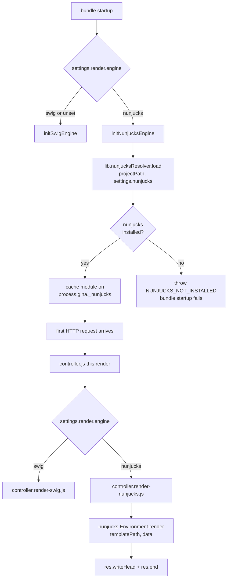

# Nunjucks

New in `0.3.7`. Gina bundles can render HTML with [nunjucks](https://mozilla.github.io/nunjucks/) instead of the default swig engine. The mechanism is **opt-in, per-bundle, and framework-clean**: Gina itself never declares nunjucks as a dependency, so bundles that don't ask for it pay zero cost and never have nunjucks in their runtime.

This page documents the opt-in contract, the dispatch flow, how Gina finds your project's nunjucks install, what fails loud and why, and the list of features that are **deliberately not yet ported** from the swig rendering path.

## When to use

Pick nunjucks over swig if:

- You already have a codebase of nunjucks templates (`.njk`) you want to bring under Gina.
- Your team is more fluent in Jinja2/nunjucks syntax than swig syntax.
- You need a nunjucks-specific feature Gina's swig path doesn't provide (custom async loaders, specific nunjucks extensions, etc.).

Stick with swig if:

- You need full parity with the swig rendering path — several integrations (Inspector dev payload, HTTP/2 stream optimisations, asset cataloguing) are not yet ported. See [Deferred features](#deferred-features) below.
- You're writing a new bundle without prior template history and want the most-polished Gina experience today.

## Opt-in

Two pieces on the bundle side:

**1. Install the package in the project root:**

```bash
npm install nunjucks
```

Gina resolves nunjucks only from `<projectPath>/node_modules/nunjucks/`. The framework's own `node_modules/` is never consulted and does not contain nunjucks.

**2. Set `render.engine` in `config/settings.json`:**

```json
{
  "render":   { "engine": "nunjucks" },
  "nunjucks": {
    "autoescape": true
  }
}
```

Default is `render.engine: "swig"`. Existing bundles that don't set this key see zero change in behaviour.

`nunjucks.autoescape` (default `true`) is passed straight to `new nunjucks.Environment(loader, { autoescape })`. Set to `false` only if you render fully-trusted content and need the raw strings.

## Dispatch flow



The engine decision happens twice — once at bundle startup (for pre-flight engine loading) and once per request (for delegate selection). Both read the same `settings.render.engine` value.

## What gets loaded where

`lib.nunjucksResolver.load()` stashes the resolved module and its metadata on `process.gina`:

| Key | Purpose |
| --- | --- |
| `process.gina._nunjucks` | The loaded nunjucks module. |
| `process.gina._nunjucksDecision` | The decision record — `{ source, version, path, warning }`. |
| `process.gina._nunjucksPackage` | Package name (always `nunjucks` in 0.3.7). |
| `process.gina._nunjucksProjectPath` | Project root that produced the load. |
| `process.gina._nunjucksMtime` | mtime of the project's `package.json` at load time — powers dev-mode hot-swap. |
| `process.gina._nunjucksEnvs` | Per-template-root cache of `nunjucks.Environment` instances. |
| `process.gina._nunjucksEnvsOwner` | Reference to the nunjucks module that owns the cached Environments (invalidates the cache if the module itself is hot-swapped). |

These survive dev-mode controller re-requires (`refreshCoreDependencies()` doesn't touch `process.gina`), so per-request rendering doesn't re-load nunjucks and doesn't rebuild the Environment.

## Sample startup logs

On successful load:

```text
[nunjucks-resolver] using project nunjucks@3.2.4 from /srv/app/node_modules/nunjucks/index.js
```

On failure (bundle refuses to start):

```text
Error: [nunjucks-resolver] nunjucks not available (not-installed); expected at /srv/app/node_modules/nunjucks. Install it in the project root: cd /srv/app && npm install nunjucks
```

`err.code === 'NUNJUCKS_NOT_INSTALLED'` and the full decision record is attached as `err.decision`.

## Dev-mode hot-swap

When `NODE_ENV_IS_DEV=true`, each request call that reaches the resolver probes the project's `package.json` mtime via `fs.statSync`. If the mtime has drifted since the last load (e.g. you just ran `npm install nunjucks@<newer>`), Gina evicts the cached module from `require.cache` and re-loads — the next request picks up the new version without a bundle restart.

The `nunjucks.Environment`'s own template cache is disabled in dev mode too (`FileSystemLoader({ noCache: true })`), so edits to `.njk` files take effect immediately.

Production bundles short-circuit the mtime probe entirely — load-once semantics are preserved.

## Templates

`nunjucks.FileSystemLoader` is rooted at your bundle's `templates/html` directory (same location swig uses). Native nunjucks composition works out of the box:

```twig
{# templates/html/layout.njk #}
<!doctype html>
<html>
  <head><title>{{ page.title }}</title></head>
  <body></body>
</html>
```

```twig
{# templates/html/home.njk #}


  <h1>Hello, {{ user.name|capitalize }}!</h1>

```

`self.render({ user: { name: 'anya' } })` in a controller action then renders `home.njk` with the data merged into the page context.

## Registering custom filters

Gina's built-in swig filters (`getWebroot`, `nl2br`, etc.) are **not automatically ported** to nunjucks. Register your own via `env.addFilter()`. In an MVP bundle, the simplest place is in your controller or a shared module:

```javascript
// In a controller action, once per process:
var nunjucks = getContext('gina')._nunjucks; // or: require('gina').nunjucksResolver.get()
nunjucks.configure();                         // ensures default env exists
nunjucks.env.addFilter('upper', function (s) { return String(s).toUpperCase(); });
```

A cleaner integration (filter registration at bundle startup via a config hook) is planned for a follow-up.

## Deferred features

The 0.3.7 release is a **minimum viable MVP**. Several features that the swig rendering path provides are deliberately not yet ported — they're documented in `controller.render-nunjucks.js`'s header comment so nothing is hidden:

| Feature | Status | Workaround |
| --- | --- | --- |
| Inspector `__ginaData` dev payload | **Shipped in `0.3.7-alpha.2`** | — |
| HTTP/2 `stream.respond()` direct path | **Shipped in `0.3.7-alpha.2`** | — |
| Error-page template routing | **Shipped in `0.3.7-alpha.2`** | — |
| Early Hints 103 auto-send for CSS/JS preloads | **Deferred** | Manually call `self.setEarlyHints(linkHeader)` in the action if needed. |
| Static HTML cache (`cache` key in `routing.json`) | **Deferred** | Every request re-renders even when the route has `cache` configured. |
| `setResources` asset cataloguing / `<gina>` layout placeholders | **Deferred** | Wire your own `<link>` / `<script>` tags into templates. |
| Gina's built-in swig filters | **Not ported** | Register equivalents via `env.addFilter()`. |

Each remaining deferred item is a focused follow-up session when the gap bites.

## Safety contract (negative invariants)

Three rules are enforced by source-inspection tests in `test/lib/render-engine-dispatch.test.js`:

1. `framework/v*/package.json` **never** declares nunjucks in any field (`dependencies`, `devDependencies`, `peerDependencies`, `optionalDependencies`).
2. `controller.render-nunjucks.js` **never** calls `require('nunjucks')` directly — it always goes through `lib.nunjucksResolver.get()`, so the detection path and cache are single-sourced.
3. `controller.js` dispatch defaults to `"swig"` — a future release accidentally flipping the default would silently break every existing bundle that hasn't installed nunjucks.

## Troubleshooting

**Bundle won't start with `NUNJUCKS_NOT_INSTALLED`** — the bundle has `render.engine: "nunjucks"` but the project doesn't have nunjucks installed. Either `npm install nunjucks` in the project root, or revert the setting to `"swig"`.

**`get() called before load() succeeded`** — indicates a startup-path bug: something tried to render before `initNunjucksEngine` ran, or the bundle's `render.engine` flipped after startup. Restart the bundle.

**Template not found** — error message shows both the relative template path we looked up and the absolute root the `FileSystemLoader` is scanning. Double-check `templates/html/<your-file>.njk` exists and the extension matches what `routing.json` declares (`data.page.view.ext`).

**Filter not recognised** — Gina's swig filters aren't registered on the nunjucks engine. Add your own via `env.addFilter()`.

## Precedents

- `0.3.7-alpha.2` (2026-04-22) — `lib/nunjucks-resolver` primitive shipped in commit `0eacab84`.
- `0.3.7-alpha.2` (2026-04-22) — `controller.render-nunjucks.js` MVP + dispatch shipped in commit `3128e729`.
