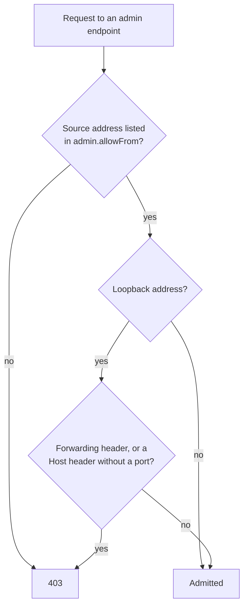

# app.json

Declares the bundle's identity and wires it to the rest of the project.
Every bundle must have an `app.json` in its `config/` directory. It is the first file the framework reads when loading a bundle, and it determines the bundle name, version, proxy connections to other bundles, and any application-level constants accessible via `getConfig()`.

```
src/<bundle>/config/app.json
```

---

## Minimal example

```json title="src/frontend/config/app.json"
{
  "name": "frontend",
  "version": "1.0.0"
}
```

That is enough for gina to recognise the bundle and start it.

---

## Fields

### `name`

**Type:** `string` · **Required**

The bundle identifier. Must match the directory name under `src/`.

```json
{
  "name": "frontend"
}
```

### `version`

**Type:** `string` · **Required**

The bundle version. Used in release manifests and build output. Follows
semver conventions but the framework does not enforce a format.

```json
{
  "version": "2.1.0"
}
```

### `proxy`

**Type:** `object` · **Optional**

Declares which other bundles this bundle can communicate with. Each key is a
local alias you choose; the value is a connection descriptor object.

```json title="src/dashboard/config/app.json"
{
  "name": "dashboard",
  "version": "1.0.0",
  "proxy": {
    "coreapi": {
      "hostname": "coreapi@myproject",
      "port"    : "coreapi@myproject",
      "path"    : "/api",
      "ca"      : "~/.gina/certificates/scopes/${scope}/${rootDomain}/ca.pem",
      "requestTimeout" : "30s"
    },
    "auth": {
      "hostname": "auth@myproject",
      "port"    : "auth@myproject",
      "path"    : "/auth",
      "ca"      : "~/.gina/certificates/scopes/${scope}/${rootDomain}/ca.pem"
    }
  }
}
```

| Field | Type | Description |
|---|---|---|
| `hostname` | `"bundle@project"` | Target bundle identifier. The framework resolves the actual hostname from the project's port registry at runtime |
| `port` | `"bundle@project"` | Same reference — resolved to the bundle's registered port |
| `path` | string | Base URL path prefix for requests sent to this proxy target |
| `ca` | string | Path to the CA certificate for TLS verification. Supports [path template variables](./index.md#path-template-variables) |
| `requestTimeout` | string | Per-request timeout for outgoing sub-requests to this proxy target (e.g. `"30s"`, `"5s"`). Optional — defaults to `10s` if omitted |
| `rejectUnauthorized` | boolean | Set to `false` to disable TLS certificate verification. Dev only — see [env overlay](#environment-overlay) |

The `bundle@project` notation tells the framework to look up the actual address from
`~/.gina/${version}/ports.json` at startup. This means proxy targets always reflect
the current port allocation without hardcoding addresses.

### `admin`

**Type:** `object` · **Optional**

Decides who may call the bundle's built-in admin endpoints: `/_gina/info`,
`/_gina/cache/stats`, `/_gina/cache/clear`, `/_gina/storage/*`, `/_gina/release/*` and
`/_gina/maintenance`. They expose the process's state and can change it — close the
site for maintenance, flush the cache, run a storage garbage collection — so they
answer only the network addresses listed here.

```json title="src/frontend/config/app.json"
{
  "name": "frontend",
  "version": "1.0.0",
  "admin": {
    "allowFrom": ["127.0.0.1", "::1"]
  }
}
```

| Field | Type | Default | Description |
|---|---|---|---|
| `allowFrom` | string[] | `["127.0.0.1", "::1"]` | Addresses allowed to call the admin endpoints. Any other caller gets `403`. An empty array `[]` denies everyone |

The address checked is the one the connection comes from: gina never trusts
`X-Forwarded-For`, which any client can set. An IPv4 entry also matches its
IPv6-mapped form (`::ffff:127.0.0.1`).

#### Loopback admits direct callers only

A reverse proxy running on the bundle's own host connects from loopback too. Since
0.7.1 a loopback entry admits a caller only when it connects **directly**: a request
from `127.0.0.1` or `::1` that carries a forwarding header (`X-Forwarded-*`,
`Forwarded`) or a `Host` header without a port is treated as relayed by such a proxy
and refused with `403`. The first refusal is logged once per process.



From the machine or the pod running the bundle, call the bundle's own port —
`curl http://127.0.0.1:<port>/_gina/maintenance`, or the `gina` CLI — and nothing
changes. To let a proxy on **another** host through, list that proxy's address: an
explicitly listed non-loopback address still admits what it relays.

Two limits to know:

- A proxy that forwards the `Host` header **with its port** and adds no forwarding
  header cannot be told apart from a direct client, so it is still admitted. Do not
  route `/_gina/` to the public: block it at your edge, in any letter case and
  anywhere in the path.
- A bundle bound directly to port 80 or 443 receives a `Host` header without a port
  from every direct client, because clients omit a default port. Set
  `server.proxy.requireForwardedHeaders: true` in its
  [`settings.json`](/reference/settings): only forwarding headers then mark a request
  as proxied.

The admin endpoints also answer their **exact** path only: `/_gina/info`,
`/_gina/cache/*` and `/_gina/maintenance` at the root or under the bundle's own
webroot, `/_gina/storage/*` and `/_gina/release/*` at the root — all in lower case.
A nested path, the endpoint path inside a query string, another letter case or an
empty leading segment reaches none of them.

`/_gina/metrics` has its own list, `metrics.allowFrom`, with the same loopback rule —
see [Observability](/guides/observability#security--ip-allowlist).

### `*` — application constants

**Type:** any · **Optional**

Any additional key you add to `app.json` becomes an application constant accessible
via `getConfig()` throughout the bundle.

```json title="src/coreapi/config/app.json"
{
  "name": "coreapi",
  "version": "3.1.0",
  "defaultAlertTimeout": 15,
  "supportEmail": "support@example.com",
  "documentTypes": ["estimate", "invoice", "creditNote"]
}
```

```js
// In a controller or middleware:
var appConf = self.getConfig('app');
var timeout = appConf.defaultAlertTimeout;  // 15
var email   = appConf.supportEmail;          // "support@example.com"
```

Keep application-wide constants here rather than scattering them across the codebase.

---

## Environment overlay

Create `app.dev.json` alongside `app.json` for dev-only overrides. Values in the
dev file win over the base file when `NODE_ENV=dev`.

The most common use case is disabling TLS verification on internal proxy connections
in local development, where self-signed certificates are common.

```json title="src/dashboard/config/app.dev.json"
{
  "proxy": {
    "coreapi": {
      "rejectUnauthorized": false,
      "ca": "~/.gina/certificates/scopes/${scope}/${host}/certificate.combined.pem"
    },
    "auth": {
      "rejectUnauthorized": false,
      "ca": "~/.gina/certificates/scopes/${scope}/${host}/certificate.combined.pem"
    }
  }
}
```

Only the declared keys are overridden. The base `app.json` supplies `hostname`, `port`,
`path`, and `requestTimeout` unchanged. `rejectUnauthorized` defaults to `true` in production.

---

## Extended example

```json title="src/dashboard/config/app.json"
{
  "name": "dashboard",
  "version": "1.0.0",
  "proxy": {
    "coreapi": {
      "hostname": "coreapi@myproject",
      "port"    : "coreapi@myproject",
      "path"    : "/api",
      "ca"      : "~/.gina/certificates/scopes/${scope}/${rootDomain}/ca.pem",
      "requestTimeout" : "30s"
    },
    "auth": {
      "hostname": "auth@myproject",
      "port"    : "auth@myproject",
      "path"    : "/auth",
      "ca"      : "~/.gina/certificates/scopes/${scope}/${rootDomain}/ca.pem"
    }
  },
  "uploadMaxSizeMB": 8,
  "featureFlags": {
    "betaExporter": false
  }
}
```
