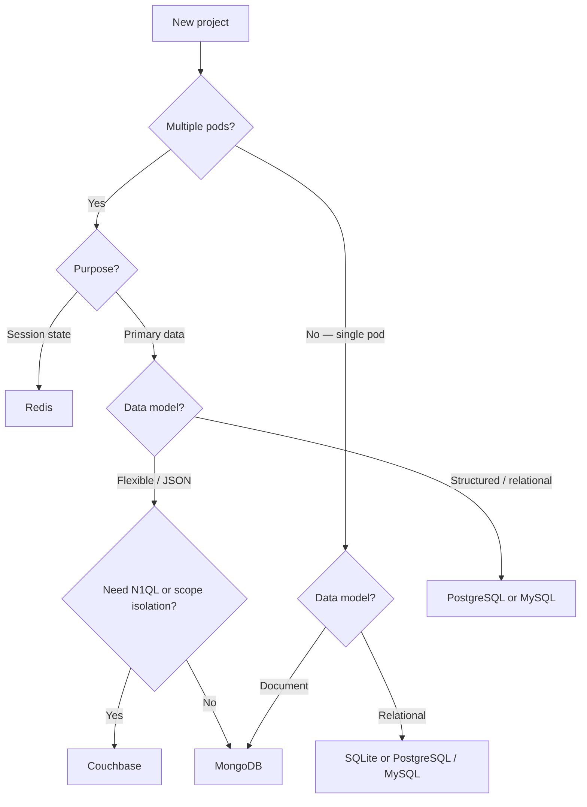

import Tabs from '@theme/Tabs';
import TabItem from '@theme/TabItem';

# connectors.json

`connectors.json` declares the database connections available to a bundle's model layer.
Each key in the file is a **connector name** — the model layer uses that name to acquire
a live connection at runtime. The connector type is determined by the `protocol` field
(Couchbase, MongoDB) or the `connector` field (Redis, SQLite, MySQL, PostgreSQL, AI).

```
src/<bundle>/config/connectors.json
```

Multiple connectors can coexist in the same file and are each independently available
to any model in the bundle.

:::tip Manage connectors from the CLI
The [`connector:list`](/cli/cli-connector#connectorlist) command lists every connector across your projects with driver install status, and [`connector:add`](/cli/cli-connector#connectoradd) writes new entries to `shared/config/connectors.json` or a bundle-scoped `connectors.json` with the correct shape.
:::

---

## Supported connectors

| Connector | Type | Primary use | Distributed | Status |
|---|---|---|---|---|
| [Couchbase](#couchbase) | Document store (N1QL) | Primary application data | ✅ Yes — multi-node cluster, automatic failover | ✅ Available (v2 · v3 · v4) |
| [MongoDB](#mongodb) | Document store | Primary application data | ✅ Yes — replica sets, sharding | ✅ Available |
| [MySQL / MariaDB](#mysql) | Relational | Primary application data | ⚠️ Partial — single server by default; Galera Cluster or managed service for multi-node | ✅ Available (v0.3.0) |
| [PostgreSQL](#postgresql) | Relational | Primary application data | ⚠️ Partial — single server by default; Patroni or managed service for multi-node | ✅ Available (v0.3.0) |
| [Redis](#redis) | Key-value store | Session store | ✅ Yes — Redis Cluster / Sentinel; designed for shared multi-pod state | ✅ Available |
| [SQLite](#sqlite) | Embedded relational | Session store — dev, staging | ❌ No — file-based, single-process only | ✅ Available (Node ≥ 22.5) |
| [AI / LLM](#ai) | LLM provider | Generative AI in controllers | — Stateless API calls | ✅ Available (v0.3.0) |
| ScyllaDB | Wide-column | High-throughput application data | ✅ Yes — distributed by design | Planned — 0.4.0 |

---

## Choosing the right connector

### Start with the deployment model

The single most important question before picking a connector is whether your application
will run on more than one process or pod. SQLite is a file — two processes writing to it
simultaneously will corrupt data. Everything else in the table supports concurrent access.



### By project type

**Simple REST API or web app — starting out**
Use **PostgreSQL** (or MySQL if your team already knows it). Relational, widely understood,
straightforward schema migrations. Move to a distributed setup later with Patroni or a
managed cloud service when you need it.

**Multi-tenant SaaS or environment-scoped data**
Use **Couchbase**. Gina's scope system was designed around Couchbase's N1QL — every entity
query automatically filters by `_scope`, giving you hard data isolation between `local`,
`beta`, and `production` environments in a shared cluster without schema duplication.

**High-traffic app with flexible data shapes**
Use **MongoDB** for primary data. Document model, horizontal scaling via replica sets and
sharding, no schema migrations for evolving data structures.

**Session state in a multi-pod / K8s deployment**
Use **Redis**. It is the only session store that works correctly when multiple pods handle
requests from the same user. SQLite sessions are local to the pod that wrote them —
requests routed to a different pod will appear logged out.

**Local development or low-traffic staging**
Use **SQLite**. Zero setup, no server process, no credentials. Switch to PostgreSQL or
Redis for production with only a `connectors.json` change — no application code changes.

**AI-powered features**
Use the **AI connector** alongside any data connector. It is stateless and does not replace
a database — it adds LLM calls to controllers. Start with `ollama://` locally (no API key,
no cost) and switch to a cloud provider by updating `connectors.json`.

### Session store decision

| Situation | Recommended |
|---|---|
| Single pod, local dev | SQLite — zero setup |
| Single pod, production | SQLite — fine if you never scale horizontally |
| Multiple pods / K8s | Redis — shared state across all pods |
| Already using Redis for caching | Redis — reuse the same instance |

### Quick comparison — relational connectors

| | SQLite | MySQL | PostgreSQL |
|---|---|---|---|
| Setup | None (file) | Server + credentials | Server + credentials |
| Multi-pod | ❌ No | ✅ Yes | ✅ Yes |
| JSON column support | Limited | Yes (5.7+) | Yes (JSONB) |
| Full-text search | Basic | Yes | Yes (tsvector) |
| Recommended for | Dev / staging | Teams familiar with MySQL | Greenfield / production |

---

## Data connectors

Data connectors back the model layer directly — entities read and write through them
using Gina's ORM. Declare them under any key name; the framework resolves the connector
type from the `protocol` value.

### Couchbase

Gina ships with built-in connectors for Couchbase SDK v2, v3, and v4. The correct
version is selected automatically based on the `couchbase` npm package installed in your
project. All SDK versions share the same `connectors.json` schema.

Use Couchbase when your application requires N1QL queries, document-level scope
isolation across environments, or multi-node cluster failover.

<Tabs>
  <TabItem value="single" label="Single node">

```json title="src/api/config/connectors.json"
{
  "couchbase": {
    "protocol" : "couchbase://",
    "host"     : "db1.example.com",
    "database" : "myapp",
    "username" : "appuser",
    "password"  : "secret",
    "ping"     : "2m",
    "scope"    : "production"
  }
}
```

  </TabItem>
  <TabItem value="cluster" label="Cluster">

Pass a comma-separated list of node addresses. The SDK uses all nodes for load
balancing and automatic failover.

```json title="src/api/config/connectors.json"
{
  "couchbase": {
    "protocol" : "couchbase://",
    "host"     : "db1.example.com,db2.example.com,db3.example.com",
    "database" : "myapp",
    "username" : "appuser",
    "password"  : "secret",
    "ping"     : "2m"
  }
}
```

  </TabItem>
  <TabItem value="tls" label="TLS">

Use `couchbases://` (with a trailing `s`) to enable TLS on the connection. Required
for Couchbase Cloud and Capella deployments.

```json title="src/api/config/connectors.json"
{
  "couchbase": {
    "protocol" : "couchbases://",
    "host"     : "cb.xxxxx.cloud.couchbase.com",
    "database" : "myapp",
    "username" : "appuser",
    "password"  : "${COUCHBASE_PASSWORD}",
    "ping"     : "2m"
  }
}
```

  </TabItem>
</Tabs>

**Field reference**

| Field | Type | Description |
|---|---|---|
| `protocol` | `"couchbase://"` \| `"couchbases://"` | `couchbase://` for unencrypted, `couchbases://` for TLS |
| `host` | string | Cluster node address(es). Comma-separated for multi-node clusters |
| `database` | string | Couchbase bucket name |
| `username` | string | Couchbase RBAC username |
| `password` | string | RBAC password. Supports `${ENV_VAR}` substitution |
| `ping` | string | Interval to verify cluster connectivity (e.g. `"2m"`, `"30s"`) |
| `scope` | string | Data isolation scope stamped on every document at insert time and used to filter N1QL queries. Falls back to `process.env.NODE_SCOPE` when omitted. See [Scopes — data isolation](../concepts/scopes#scopes-and-data-isolation) |

---

### MongoDB

Gina's MongoDB connector supports both self-hosted and Atlas deployments. Use
`mongodb+srv://` for Atlas and DNS-seeded connection strings.

```json title="src/api/config/connectors.json"
{
  "mongodb": {
    "protocol" : "mongodb://",
    "host"     : "127.0.0.1:27017",
    "database" : "myapp"
  }
}
```

**Field reference**

| Field | Type | Description |
|---|---|---|
| `protocol` | `"mongodb://"` \| `"mongodb+srv://"` | Use `mongodb+srv://` for Atlas and DNS seedlist connections |
| `host` | string | Host and port for self-hosted, or Atlas cluster hostname for SRV |
| `database` | string | Database name |

---

### MySQL

Gina's MySQL connector uses a `mysql2` connection pool. Install `mysql2` in your project:

```bash
npm install mysql2
```

<Tabs>
  <TabItem value="basic" label="Basic">

```json title="src/api/config/connectors.json"
{
  "mydb": {
    "connector"      : "mysql",
    "host"           : "127.0.0.1",
    "port"           : 3306,
    "database"       : "mydb",
    "username"       : "root",
    "password"       : "${MYSQL_PASSWORD}",
    "connectionLimit": 10
  }
}
```

  </TabItem>
  <TabItem value="ssl" label="TLS / SSL">

```json title="src/api/config/connectors.json"
{
  "mydb": {
    "connector"      : "mysql",
    "host"           : "db.example.com",
    "port"           : 3306,
    "database"       : "mydb",
    "username"       : "appuser",
    "password"       : "${MYSQL_PASSWORD}",
    "connectionLimit": 20,
    "ssl"            : { "rejectUnauthorized": true }
  }
}
```

  </TabItem>
</Tabs>

**Field reference**

| Field | Type | Default | Description |
|---|---|---|---|
| `connector` | `"mysql"` | — | Selects the MySQL connector |
| `host` | string | `"127.0.0.1"` | MySQL server host |
| `port` | number | `3306` | MySQL server port |
| `database` | string | — | MySQL database name. Also names the model directory (`models/<database>/`) |
| `username` | string | — | MySQL user |
| `password` | string | `""` | MySQL password. Supports `${ENV_VAR}` substitution |
| `connectionLimit` | number | `10` | Maximum number of connections in the pool |
| `ssl` | object | — | SSL options passed directly to `mysql2`. See [mysql2 SSL docs](https://github.com/sidorares/node-mysql2#ssl-options) |

---

### PostgreSQL

Gina's PostgreSQL connector uses a `pg` connection pool. Install `pg` in your project:

```bash
npm install pg
```

<Tabs>
  <TabItem value="basic" label="Basic">

```json title="src/api/config/connectors.json"
{
  "mydb": {
    "connector"        : "postgresql",
    "host"             : "127.0.0.1",
    "port"             : 5432,
    "database"         : "mydb",
    "username"         : "postgres",
    "password"         : "${PGPASSWORD}",
    "connectionLimit"  : 10
  }
}
```

  </TabItem>
  <TabItem value="ssl" label="TLS / SSL">

```json title="src/api/config/connectors.json"
{
  "mydb": {
    "connector"        : "postgresql",
    "host"             : "db.example.com",
    "port"             : 5432,
    "database"         : "mydb",
    "username"         : "appuser",
    "password"         : "${PGPASSWORD}",
    "connectionLimit"  : 20,
    "idleTimeout"      : 30000,
    "connectionTimeout": 2000,
    "ssl"              : { "rejectUnauthorized": true }
  }
}
```

  </TabItem>
</Tabs>

**Field reference**

| Field | Type | Default | Description |
|---|---|---|---|
| `connector` | `"postgresql"` | — | Selects the PostgreSQL connector |
| `host` | string | `"127.0.0.1"` | PostgreSQL server host |
| `port` | number | `5432` | PostgreSQL server port |
| `database` | string | — | PostgreSQL database name. Also names the model directory (`models/<database>/`) |
| `username` | string | — | PostgreSQL user |
| `password` | string | `""` | PostgreSQL password. Supports `${ENV_VAR}` substitution |
| `connectionLimit` | number | `10` | Maximum pool size (`pg.Pool` `max`) |
| `idleTimeout` | number | `30000` | Milliseconds before an idle connection is closed (`idleTimeoutMillis`) |
| `connectionTimeout` | number | `2000` | Milliseconds to wait for a connection before timing out (`connectionTimeoutMillis`) |
| `ssl` | object | — | SSL options passed directly to `pg`. See [node-postgres SSL docs](https://node-postgres.com/features/ssl) |

---

## AI / LLM connectors {#ai}

The AI connector exposes any LLM provider through `getModel()` in controllers.
Unlike ORM connectors, it does not use entity files or SQL — `getModel()` returns
an AI interface with a `.complete(messages, options)` method directly.

See the **[AI connector guide](/guides/ai)** for full usage, all provider tabs, and
controller examples. Field reference below.

```json title="src/api/config/connectors.json"
{
  "claude": {
    "connector" : "ai",
    "protocol"  : "anthropic://",
    "apiKey"    : "${ANTHROPIC_API_KEY}",
    "model"     : "claude-opus-4-6"
  },
  "deepseek": {
    "connector" : "ai",
    "protocol"  : "deepseek://",
    "apiKey"    : "${DEEPSEEK_API_KEY}",
    "model"     : "deepseek-chat"
  },
  "local": {
    "connector" : "ai",
    "protocol"  : "ollama://",
    "model"     : "mimo"
  }
}
```

**Supported protocols**

| Protocol | SDK | Auto base URL |
|---|---|---|
| `anthropic://` | `@anthropic-ai/sdk` | `https://api.anthropic.com` |
| `openai://` | `openai` | `https://api.openai.com/v1` |
| `deepseek://` | `openai` | `https://api.deepseek.com/v1` |
| `qwen://` | `openai` | `https://dashscope.aliyuncs.com/compatible-mode/v1` |
| `groq://` | `openai` | `https://api.groq.com/openai/v1` |
| `mistral://` | `openai` | `https://api.mistral.ai/v1` |
| `gemini://` | `openai` | `https://generativelanguage.googleapis.com/v1beta/openai/` |
| `xai://` | `openai` | `https://api.x.ai/v1` |
| `perplexity://` | `openai` | `https://api.perplexity.ai` |
| `ollama://` | `openai` | `http://localhost:11434/v1` |
| `openai://` + `baseURL` | `openai` | your custom URL |

**Field reference**

| Field | Type | Description |
|---|---|---|
| `connector` | `"ai"` | Selects the AI connector |
| `protocol` | string | Provider protocol — determines SDK and default base URL |
| `apiKey` | string | API key. Supports `${ENV_VAR}` substitution. Omit for local Ollama |
| `model` | string | Default model identifier used when `.complete()` is called without `options.model` |
| `baseURL` | string | Override the provider's default base URL. Use for custom Ollama ports, corporate proxies, or unlisted OpenAI-compatible endpoints |

---

## Session store connectors

Session store connectors back Gina's session layer. They do not expose an ORM and are
not used directly by model entities. Choose one based on your deployment topology.

### Redis

Redis is the recommended session store for **multi-pod and Kubernetes deployments**.
It provides a shared, persistent session layer across all replicas, surviving pod
restarts and rolling deployments.

:::note Valkey compatibility
[Valkey](https://valkey.io/) (the Linux Foundation fork of Redis, BSD-licensed) is
**wire-compatible** with Redis 7.2. The `ioredis` client connects to Valkey
transparently — no connector change or config change needed. Point `host`/`port` at your
Valkey instance and it works as-is.
:::

Requires `ioredis` installed in your project:

```bash
npm install ioredis
```

See the [Sessions guide](../guides/sessions#configuring-the-store) for wiring instructions.

<Tabs>
  <TabItem value="standalone" label="Standalone">

```json title="src/api/config/connectors.json"
{
  "myRedis": {
    "connector": "redis",
    "host"     : "127.0.0.1",
    "port"     : 6379,
    "password" : "",
    "ttl"      : 86400,
    "prefix"   : "sess:"
  }
}
```

  </TabItem>
  <TabItem value="cluster" label="Cluster">

```json title="src/api/config/connectors.json"
{
  "myRedis": {
    "connector": "redis",
    "cluster"  : [
      { "host": "node1.redis.internal", "port": 6379 },
      { "host": "node2.redis.internal", "port": 6379 }
    ],
    "password" : "${REDIS_PASSWORD}",
    "tls"      : true,
    "ttl"      : 86400
  }
}
```

`tls: true` is required for Upstash, AWS ElastiCache, and Google Cloud Memorystore.

  </TabItem>
</Tabs>

**Field reference**

| Field | Type | Default | Description |
|---|---|---|---|
| `connector` | `"redis"` | — | Selects the Redis connector |
| `host` | string | `"127.0.0.1"` | Redis host (standalone mode only) |
| `port` | number | `6379` | Redis port (standalone mode only) |
| `db` | number | `0` | Redis DB index |
| `password` | string | — | `AUTH` password. Supports `${ENV_VAR}` substitution |
| `tls` | boolean | `false` | Enable TLS. Required for Upstash, ElastiCache, and Cloud Memorystore |
| `cluster` | array | — | Cluster nodes `[{ host, port }, ...]`. When present, standalone `host` and `port` are ignored |
| `ttl` | number | `86400` | Session TTL in seconds |
| `prefix` | string | `"sess:"` | Key prefix in Redis |

---

### SQLite

SQLite is the recommended session store for **development, staging, and single-pod
production**. It uses the Node.js built-in `node:sqlite` module — zero npm dependencies.
Requires Node.js ≥ 22.5.0.

See the [Sessions guide](../guides/sessions#configuring-the-store) for wiring instructions.

<Tabs>
  <TabItem value="memory" label="In-memory (dev)">

Sessions are stored in process memory. Fast, zero setup, and automatically cleared on
server restart — ideal for local development.

```json title="src/api/config/connectors.json"
{
  "myDb": {
    "connector": "sqlite",
    "database" : ":memory:",
    "ttl"      : 86400
  }
}
```

  </TabItem>
  <TabItem value="file" label="File-based (staging / production)">

Sessions are persisted to disk and survive server restarts. Use for staging and
single-pod production where a shared Redis instance is not available.

```json title="src/api/config/connectors.json"
{
  "myDb": {
    "connector"      : "sqlite",
    "database"       : "/app/data/sessions.db",
    "ttl"            : 86400,
    "prefix"         : "sess:",
    "cleanupInterval": 900
  }
}
```

  </TabItem>
</Tabs>

**Field reference**

| Field | Type | Default | Description |
|---|---|---|---|
| `connector` | `"sqlite"` | — | Selects the SQLite connector |
| `database` | string | `~/.gina/${shortVersion}/sessions-${bundle}.db` | Path to the SQLite file, or `":memory:"` for a volatile in-process store |
| `ttl` | number | `86400` | Session TTL in seconds |
| `prefix` | string | `"sess:"` | Key prefix stored in the sessions table |
| `cleanupInterval` | number | `900` | Seconds between background purges of expired sessions. Set `0` to disable |

---

## Using multiple connectors

A bundle can declare any number of connectors. Each key is independently available to
every model in the bundle.

```json title="src/api/config/connectors.json"
{
  "couchbase": {
    "protocol" : "couchbase://",
    "host"     : "db1.example.com",
    "database" : "primary",
    "username" : "appuser",
    "password"  : "secret"
  },
  "mongodb": {
    "protocol" : "mongodb://",
    "host"     : "127.0.0.1:27017",
    "database" : "analytics"
  }
}
```

---

## Driver version pinning

*New in 0.3.7-alpha.3*

Each connector entry accepts an optional `version` field carrying a semver range that pins the underlying driver npm package:

```json title="src/api/config/connectors.json"
{
  "myRedis": {
    "connector" : "redis",
    "host"      : "127.0.0.1",
    "port"      : 6379,
    "version"   : "^5.0.0"
  }
}
```

The `version` field is informational at runtime — the driver that actually loads is whichever version was installed by `npm install` at the project root. It is consumed by two tools:

- [`connector:list`](/cli/cli-connector#connectorlist) reports the pin in the driver-info column and raises a `[ !! ]` warning when two bundles pin the same driver at different versions (npm resolves one version per project, so the first `npm install` wins).
- [`connector:add`](/cli/cli-connector#connectoradd) uses the pin to print the exact `npm install <pkg>@"<range>"` command after writing the entry. Set it with `--driver-version=<range>`.

Drivers without a pin fall back to the framework's `peerDependencies` range.

---

## Environment overlay

Use `connectors.${env}.json` to override specific fields for a given environment without
duplicating the full config. The `${env}` segment must match `NODE_ENV`.

```json title="src/api/config/connectors.dev.json"
{
  "couchbase": {
    "host"    : "127.0.0.1",
    "database": "myapp_dev",
    "ping"    : "5m"
  }
}
```

Only the declared keys are overridden — the base `connectors.json` supplies all other
fields unchanged.

---

## Credentials and secrets

:::caution Never commit credentials to version control
Use environment variables or a secrets manager to inject passwords at runtime.
Reference them using `${ENV_VAR}` syntax in any string field. If the file contains
literal passwords, add it to `.gitignore` and distribute it out of band — secrets
manager, deployment pipeline, or manual copy per environment.
:::
