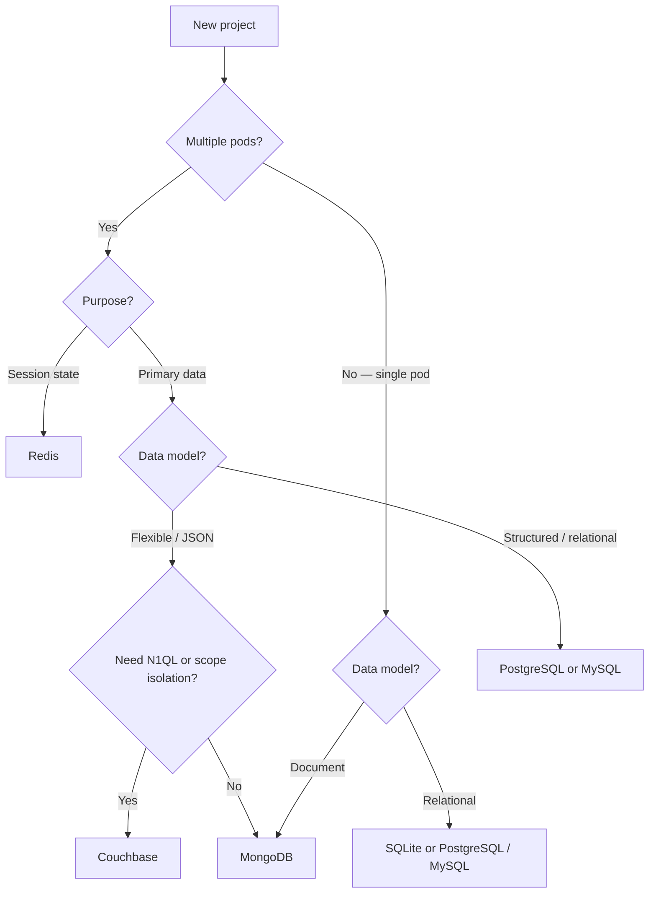

import Tabs from '@theme/Tabs';
import TabItem from '@theme/TabItem';

# connectors.json

`connectors.json` declares the database connections available to a bundle's model layer.
Each key in the file is a **connector name** — the model layer uses that name to acquire
a live connection at runtime. The connector type is determined by the `protocol` field
(Couchbase, MongoDB) or the `connector` field (Redis, SQLite, MySQL, PostgreSQL, AI).

```
src/<bundle>/config/connectors.json
```

Multiple connectors can coexist in the same file and are each independently available
to any model in the bundle.

:::tip Manage connectors from the CLI
The [`connector:list`](/cli/cli-connector#connectorlist) command lists every connector across your projects with driver install status, and [`connector:add`](/cli/cli-connector#connectoradd) writes new entries to `shared/config/connectors.json` or a bundle-scoped `connectors.json` with the correct shape.
:::

---

## Supported connectors

| Connector | Type | Primary use | Distributed | Status |
|---|---|---|---|---|
| [Couchbase](#couchbase) | Document store (N1QL) | Primary application data | ✅ Yes — multi-node cluster, automatic failover | ✅ Available (v3 · v4) |
| [MongoDB](#mongodb) | Document store | Primary application data | ✅ Yes — replica sets, sharding | ✅ Available |
| [MySQL / MariaDB](#mysql) | Relational | Primary application data | ⚠️ Partial — single server by default; Galera Cluster or managed service for multi-node | ✅ Available (v0.3.0) |
| [PostgreSQL](#postgresql) | Relational | Primary application data | ⚠️ Partial — single server by default; Patroni or managed service for multi-node | ✅ Available (v0.3.0) |
| [Redis](#redis) | Key-value store | Session store | ✅ Yes — Redis Cluster / Sentinel; designed for shared multi-pod state | ✅ Available |
| [SQLite](#sqlite-data-connector) | Embedded relational | Application data & sessions — dev, staging, single-pod | ❌ No — file-based, single-process only | ✅ Available (Node ≥ 22.5) |
| [AI / LLM](#ai) | LLM provider | Generative AI in controllers | — Stateless API calls | ✅ Available (v0.3.0) |
| [ScyllaDB / Cassandra](/data/scylladb-orm) | Wide-column | High-throughput application data | ✅ Yes — distributed by design | ✅ Available |
| [DuckDB](/data/duckdb-analytics) | Embedded analytical (columnar / OLAP) | In-process analytics & reporting | ❌ No — embedded file; single writer across processes (read-only sharing supported) | ✅ Available (v0.6.1) |

---

## Choosing the right connector

### Start with the deployment model

The single most important question before picking a connector is whether your application
will run on more than one process or pod. SQLite is a file — two processes writing to it
simultaneously will corrupt data. Everything else in the table supports concurrent access.


```mermaid
flowchart TD
    A[New project] --> B{Multiple pods?}
    B -->|Yes| C{Purpose?}
    B -->|No — single pod| D{Data model?}
    C -->|Session state| E[Redis]
    C -->|Primary data| F{Data model?}
    F -->|Flexible / JSON| G{Need N1QL or scope isolation?}
    F -->|Structured / relational| H[PostgreSQL or MySQL]
    G -->|Yes| I[Couchbase]
    G -->|No| J[MongoDB]
    D -->|Relational| K[SQLite or PostgreSQL / MySQL]
    D -->|Document| J
```

### By project type

**Simple REST API or web app — starting out**
Use **PostgreSQL** (or MySQL if your team already knows it). Relational, widely understood,
straightforward schema migrations. Move to a distributed setup later with Patroni or a
managed cloud service when you need it.

**Multi-tenant SaaS or environment-scoped data**
Use **Couchbase**. Gina's scope system was designed around Couchbase's N1QL — every entity
query automatically filters by `_scope`, giving you hard data isolation between `local`,
`beta`, and `production` environments in a shared cluster without schema duplication.

**High-traffic app with flexible data shapes**
Use **MongoDB** for primary data. Document model, horizontal scaling via replica sets and
sharding, no schema migrations for evolving data structures.

**Session state in a multi-pod / K8s deployment**
Use **Redis**. It is the only session store that works correctly when multiple pods handle
requests from the same user. SQLite sessions are local to the pod that wrote them —
requests routed to a different pod will appear logged out.

**Local development or low-traffic staging**
Use **SQLite**. Zero setup, no server process, no credentials. Switch to PostgreSQL or
Redis for production with only a `connectors.json` change — no application code changes.

**AI-powered features**
Use the **AI connector** alongside any data connector. It is stateless and does not replace
a database — it adds LLM calls to controllers. Start with `ollama://` locally (no API key,
no cost) and switch to a cloud provider by updating `connectors.json`.

### Session store decision

| Situation | Recommended |
|---|---|
| Single pod, local dev | SQLite — zero setup |
| Single pod, production | SQLite — fine if you never scale horizontally |
| Multiple pods / K8s | Redis — shared state across all pods |
| Already using Redis for caching | Redis — reuse the same instance |
| Already running Couchbase | Couchbase — server-side per-document expiry |
| Already running MongoDB | MongoDB — expiry reaped by a TTL index |
| Already running ScyllaDB / Cassandra | ScyllaDB — native CQL `USING TTL` |

### Quick comparison — relational connectors

| | SQLite | MySQL | PostgreSQL |
|---|---|---|---|
| Setup | None (file) | Server + credentials | Server + credentials |
| Multi-pod | ❌ No | ✅ Yes | ✅ Yes |
| JSON column support | Limited | Yes (5.7+) | Yes (JSONB) |
| Full-text search | Basic | Yes | Yes (tsvector) |
| Recommended for | Dev / staging | Teams familiar with MySQL | Greenfield / production |

---

## Data connectors

Data connectors back the model layer directly — entities read and write through them
using Gina's ORM. Declare them under any key name; the framework resolves the connector
type from the entry's `connector` field, falling back to the key name when
it names a built-in connector type.

### Couchbase

Gina ships with built-in connectors for Couchbase SDK v3 and v4. The correct
version is selected automatically based on the `couchbase` npm package installed in your
project. Both SDK versions share the same `connectors.json` schema.

Use Couchbase when your application requires N1QL queries, document-level scope
isolation across environments, or multi-node cluster failover.

<Tabs>
  <TabItem value="single" label="Single node">

```json title="src/api/config/connectors.json"
{
  "couchbase": {
    "protocol" : "couchbase://",
    "host"     : "db1.example.com",
    "database" : "myapp",
    "username" : "appuser",
    "password"  : "secret",
    "ping"     : "2m",
    "scope"    : "production"
  }
}
```

  </TabItem>
  <TabItem value="cluster" label="Cluster">

Pass a comma-separated list of node addresses. The SDK uses all nodes for load
balancing and automatic failover.

```json title="src/api/config/connectors.json"
{
  "couchbase": {
    "protocol" : "couchbase://",
    "host"     : "db1.example.com,db2.example.com,db3.example.com",
    "database" : "myapp",
    "username" : "appuser",
    "password"  : "secret",
    "ping"     : "2m"
  }
}
```

  </TabItem>
  <TabItem value="tls" label="TLS">

Use `couchbases://` (with a trailing `s`) to enable TLS on the connection. Required
for Couchbase Cloud and Capella deployments.

```json title="src/api/config/connectors.json"
{
  "couchbase": {
    "protocol" : "couchbases://",
    "host"     : "cb.xxxxx.cloud.couchbase.com",
    "database" : "myapp",
    "username" : "appuser",
    "password"  : "${COUCHBASE_PASSWORD}",
    "ping"     : "2m"
  }
}
```

  </TabItem>
</Tabs>

**Field reference**

| Field | Type | Description |
|---|---|---|
| `protocol` | `"couchbase://"` \| `"couchbases://"` | `couchbase://` for unencrypted, `couchbases://` for TLS |
| `host` | string | Cluster node address(es). Comma-separated for multi-node clusters |
| `database` | string | Couchbase bucket name |
| `username` | string | Couchbase RBAC username |
| `password` | string | RBAC password. Supports `${ENV_VAR}` substitution |
| `ping` | string | Interval to verify cluster connectivity (e.g. `"2m"`, `"30s"`) |
| `scope` | string | Data isolation scope stamped on every document at insert time and used to filter N1QL queries. Falls back to `process.env.NODE_SCOPE` when omitted. See [Scopes — data isolation](../concepts/scopes#scopes-and-data-isolation) |

---

### MongoDB

Gina's MongoDB connector wraps the official `mongodb` driver and supports
both self-hosted (single node, replica set) and Atlas deployments. Install
the driver in your project:

```bash
npm install mongodb
```

The connector accepts either a fully-formed `uri` (preferred when set) OR
decomposed fields. Use `uri` for Atlas (`mongodb+srv://`) or replica-set
connection strings; use decomposed fields for simple single-host setups.

<Tabs>
  <TabItem value="uri" label="URI (Atlas / replica set)">

```json title="src/api/config/connectors.json"
{
  "primary": {
    "connector": "mongodb",
    "uri":       "mongodb+srv://<user>:<pass>@cluster0.example.net/myapp?authSource=admin",
    "database":  "myapp"
  }
}
```

  </TabItem>
  <TabItem value="decomposed" label="Decomposed (self-hosted)">

```json title="src/api/config/connectors.json"
{
  "primary": {
    "connector":  "mongodb",
    "host":       "127.0.0.1",
    "port":       27017,
    "database":   "myapp",
    "username":   "appuser",
    "password":   "${MONGO_PASSWORD}",
    "authSource": "admin"
  }
}
```

  </TabItem>
</Tabs>

**Field reference**

| Field | Type | Default | Description |
|---|---|---|---|
| `connector` | `"mongodb"` | — | Selects the MongoDB connector |
| `uri` | string | — | Full connection string. Preferred when set; takes priority over decomposed fields |
| `host` | string | `"127.0.0.1"` | Server host (decomposed mode only) |
| `port` | number | `27017` | Server port (decomposed mode only) |
| `database` | string | — | Database name. Also names the model directory (`models/<database>/`) |
| `username` | string | — | Auth user. URL-encoded automatically when assembling the URI |
| `password` | string | — | Auth password. Supports `${ENV_VAR}` substitution. URL-encoded automatically |
| `authSource` | string | — | Auth database, when different from `database` |
| `replicaSet` | string | — | Replica set name |
| `ssl` | boolean \| object | — | `true` to enable TLS, or an object whose keys are passed through to the driver as `tlsOptions` |

For the full ORM workflow — JSON pipeline files at
`models/<db>/pipelines/<Entity>/*.json`, JSDoc-style `@param`/`@return`
annotations, BSON type casting, and the eleven supported operations
(`findOne` / `find` / `aggregate` / `countDocuments` / `insertOne` /
`insertMany` / `updateOne` / `updateMany` / `replaceOne` / `deleteOne` /
`deleteMany`) — see the [MongoDB ORM guide](/data/connectors-mongodb).

The same connector also backs the **MongoDB session store** — TTL index
auto-created on first `set()`, with `expiresAt > now` filtering on reads to
cover the 60-second TTL-monitor lag. See the
[Sessions guide — MongoDB tab](/guides/sessions#configuring-the-store).

---

### MySQL

Gina's MySQL connector uses a `mysql2` connection pool. Install `mysql2` in your project:

```bash
npm install mysql2
```

<Tabs>
  <TabItem value="basic" label="Basic">

```json title="src/api/config/connectors.json"
{
  "mydb": {
    "connector"      : "mysql",
    "host"           : "127.0.0.1",
    "port"           : 3306,
    "database"       : "mydb",
    "username"       : "root",
    "password"       : "${MYSQL_PASSWORD}",
    "connectionLimit": 10
  }
}
```

  </TabItem>
  <TabItem value="ssl" label="TLS / SSL">

```json title="src/api/config/connectors.json"
{
  "mydb": {
    "connector"      : "mysql",
    "host"           : "db.example.com",
    "port"           : 3306,
    "database"       : "mydb",
    "username"       : "appuser",
    "password"       : "${MYSQL_PASSWORD}",
    "connectionLimit": 20,
    "ssl"            : { "rejectUnauthorized": true }
  }
}
```

  </TabItem>
</Tabs>

**Field reference**

| Field | Type | Default | Description |
|---|---|---|---|
| `connector` | `"mysql"` | — | Selects the MySQL connector |
| `host` | string | `"127.0.0.1"` | MySQL server host |
| `port` | number | `3306` | MySQL server port |
| `database` | string | — | MySQL database name. Also names the model directory (`models/<database>/`) |
| `username` | string | — | MySQL user |
| `password` | string | `""` | MySQL password. Supports `${ENV_VAR}` substitution |
| `connectionLimit` | number | `10` | Maximum number of connections in the pool |
| `ssl` | object | — | SSL options passed directly to `mysql2`. See [mysql2 SSL docs](https://github.com/sidorares/node-mysql2#ssl-options) |

For the full ORM workflow — entity classes, SQL files with `?` placeholders,
`@param`/`@return` annotations, pooling and transactions — see the
[MySQL ORM guide](/data/mysql-orm).

---

### PostgreSQL

Gina's PostgreSQL connector uses a `pg` connection pool. Install `pg` in your project:

```bash
npm install pg
```

<Tabs>
  <TabItem value="basic" label="Basic">

```json title="src/api/config/connectors.json"
{
  "mydb": {
    "connector"        : "postgresql",
    "host"             : "127.0.0.1",
    "port"             : 5432,
    "database"         : "mydb",
    "username"         : "postgres",
    "password"         : "${PGPASSWORD}",
    "connectionLimit"  : 10
  }
}
```

  </TabItem>
  <TabItem value="ssl" label="TLS / SSL">

```json title="src/api/config/connectors.json"
{
  "mydb": {
    "connector"        : "postgresql",
    "host"             : "db.example.com",
    "port"             : 5432,
    "database"         : "mydb",
    "username"         : "appuser",
    "password"         : "${PGPASSWORD}",
    "connectionLimit"  : 20,
    "idleTimeout"      : 30000,
    "connectionTimeout": 2000,
    "ssl"              : { "rejectUnauthorized": true }
  }
}
```

  </TabItem>
</Tabs>

**Field reference**

| Field | Type | Default | Description |
|---|---|---|---|
| `connector` | `"postgresql"` | — | Selects the PostgreSQL connector |
| `host` | string | `"127.0.0.1"` | PostgreSQL server host |
| `port` | number | `5432` | PostgreSQL server port |
| `database` | string | — | PostgreSQL database name. Also names the model directory (`models/<database>/`) |
| `username` | string | — | PostgreSQL user |
| `password` | string | `""` | PostgreSQL password. Supports `${ENV_VAR}` substitution |
| `connectionLimit` | number | `10` | Maximum pool size (`pg.Pool` `max`) |
| `idleTimeout` | number | `30000` | Milliseconds before an idle connection is closed (`idleTimeoutMillis`) |
| `connectionTimeout` | number | `2000` | Milliseconds to wait for a connection before timing out (`connectionTimeoutMillis`) |
| `ssl` | object | — | SSL options passed directly to `pg`. See [node-postgres SSL docs](https://node-postgres.com/features/ssl) |

For the full ORM workflow — entity classes, SQL files with `$1`, `$2`, …
placeholders, `@param`/`@return` annotations, pool tuning and transactions —
see the [PostgreSQL ORM guide](/data/postgresql-orm).

---

### SQLite {#sqlite-data-connector}

Gina's SQLite data connector uses the Node.js built-in `node:sqlite` module — zero npm
dependencies. Requires Node.js ≥ 22.5.0.

Use SQLite for local development, staging, and single-pod production data. It is an
embedded file (one process at a time), so it cannot be shared across pods — but it
needs no server, no credentials, and no setup, and the entity/ORM layer over it is
the same one the other relational connectors use.

```json title="src/api/config/connectors.json"
{
  "mydb": {
    "connector": "sqlite",
    "database" : "mydb"
  }
}
```

With only `database` set, the file lives in the gina home directory at
`~/.gina/<database>.sqlite` — outside your project, and not under version
control. Add a `file` key to place it explicitly:

```json title="src/api/config/connectors.json"
{
  "mydb": {
    "connector": "sqlite",
    "database" : "mydb",
    "file"     : "/app/data/mydb.sqlite"
  }
}
```

**Field reference**

| Field | Type | Default | Description |
|---|---|---|---|
| `connector` | `"sqlite"` | — | Selects the SQLite connector |
| `database` | string | — | Database name — a logical name, never a path. Also names the model directory (`models/<database>/`) and, when `file` is absent, the default file location |
| `file` | string | `~/.gina/<database>.sqlite` | Path to the SQLite database file. Use `":memory:"` for an ephemeral in-process database |

Entities and `.sql` query files work over SQLite exactly like the other relational
connectors — `?` positional placeholders, `@param` casting, `@return` shapes — with
statements pre-compiled at startup via `conn.prepare()`. That boot-time compile means
your tables must exist **before** the bundle starts: a statement naming a missing
table fails to compile, and the failure is remembered for the life of the process.
For the full ORM workflow, see the [SQLite ORM guide](/data/sqlite-orm); the
[Link Shortener tutorial](/tutorials/link-shortener) is a complete walkthrough,
including a schema-migration script.

The same connector also backs the **SQLite session store** — see the
[session store section below](#sqlite). Note the two roles read the config
differently: in a `session` entry, `database` is the SQLite file path itself
(or `":memory:"`), while in a data entry `database` is the model/database name
and the optional `file` key carries the path.

---

## AI / LLM connectors {#ai}

The AI connector exposes any LLM provider through `getModel()` in controllers.
Unlike ORM connectors, it does not use entity files or SQL — `getModel()` returns
an AI interface with a `.complete(messages, options)` method directly.

See the **[AI connector guide](/guides/ai)** for full usage, all provider tabs, and
controller examples. Field reference below.

```json title="src/api/config/connectors.json"
{
  "claude": {
    "connector" : "ai",
    "protocol"  : "anthropic://",
    "apiKey"    : "${ANTHROPIC_API_KEY}",
    "model"     : "claude-opus-4-6"
  },
  "deepseek": {
    "connector" : "ai",
    "protocol"  : "deepseek://",
    "apiKey"    : "${DEEPSEEK_API_KEY}",
    "model"     : "deepseek-chat"
  },
  "local": {
    "connector" : "ai",
    "protocol"  : "ollama://",
    "model"     : "mimo"
  }
}
```

**Supported protocols**

| Protocol | SDK | Auto base URL |
|---|---|---|
| `anthropic://` | `@anthropic-ai/sdk` | `https://api.anthropic.com` |
| `openai://` | `openai` | `https://api.openai.com/v1` |
| `deepseek://` | `openai` | `https://api.deepseek.com/v1` |
| `qwen://` | `openai` | `https://dashscope.aliyuncs.com/compatible-mode/v1` |
| `groq://` | `openai` | `https://api.groq.com/openai/v1` |
| `mistral://` | `openai` | `https://api.mistral.ai/v1` |
| `gemini://` | `openai` | `https://generativelanguage.googleapis.com/v1beta/openai/` |
| `xai://` | `openai` | `https://api.x.ai/v1` |
| `perplexity://` | `openai` | `https://api.perplexity.ai` |
| `ollama://` | `openai` | `http://localhost:11434/v1` |
| `openai://` + `baseURL` | `openai` | your custom URL |

**Field reference**

| Field | Type | Description |
|---|---|---|
| `connector` | `"ai"` | Selects the AI connector |
| `protocol` | string | Provider protocol — determines SDK and default base URL |
| `apiKey` | string | API key. Supports `${ENV_VAR}` substitution. Omit for local Ollama |
| `model` | string | Default model identifier used when `.complete()` is called without `options.model` |
| `baseURL` | string | Override the provider's default base URL. Use for custom Ollama ports, corporate proxies, or unlisted OpenAI-compatible endpoints |

---

## Session store connectors

Session store connectors back Gina's session layer. This section documents each store
in its **session role only** — a `session` entry is not used by model entities, and it
is independent of any data-connector entry pointing at the same store. The stores
themselves are not session-only: of the five below, Redis is the only one without an
ORM. SQLite ([above](#sqlite-data-connector)), Couchbase, MongoDB and ScyllaDB are
all full data connectors with their own entity/ORM layer. Choose one based on your
deployment topology.
The entry must be named `session` — the `SessionStore` factory resolves it from
`express-session`'s function name, which is read-only (see the
[Sessions guide](../guides/sessions#configuring-the-store)).

**Redis** and **SQLite** are the recommended defaults and are documented first;
**Couchbase**, **MongoDB** and **ScyllaDB** follow, for teams already running one of
those datastores who would rather not add a second one just for sessions. All five
back the same `express-session` interface, so the choice is operational, not functional.

### Redis

Redis is the recommended session store for **multi-pod and Kubernetes deployments**.
It provides a shared, persistent session layer across all replicas, surviving pod
restarts and rolling deployments.

:::note Valkey compatibility
[Valkey](https://valkey.io/) (the Linux Foundation fork of Redis, BSD-licensed) is
**wire-compatible** with Redis 7.2. The `ioredis` client connects to Valkey
transparently — no connector change or config change needed. Point `host`/`port` at your
Valkey instance and it works as-is.
:::

Requires `ioredis` installed in your project:

```bash
npm install ioredis
```

See the [Sessions guide](../guides/sessions#configuring-the-store) for wiring instructions.

<Tabs>
  <TabItem value="standalone" label="Standalone">

```json title="src/api/config/connectors.json"
{
  "session": {
    "connector": "redis",
    "host"     : "127.0.0.1",
    "port"     : 6379,
    "password" : "",
    "ttl"      : 86400,
    "prefix"   : "sess:"
  }
}
```

  </TabItem>
  <TabItem value="cluster" label="Cluster">

```json title="src/api/config/connectors.json"
{
  "session": {
    "connector": "redis",
    "cluster"  : [
      { "host": "node1.redis.internal", "port": 6379 },
      { "host": "node2.redis.internal", "port": 6379 }
    ],
    "password" : "${REDIS_PASSWORD}",
    "tls"      : true,
    "ttl"      : 86400
  }
}
```

`tls: true` is required for Upstash, AWS ElastiCache, and Google Cloud Memorystore.

  </TabItem>
</Tabs>

**Field reference**

| Field | Type | Default | Description |
|---|---|---|---|
| `connector` | `"redis"` | — | Selects the Redis connector |
| `host` | string | `"127.0.0.1"` | Redis host (standalone mode only) |
| `port` | number | `6379` | Redis port (standalone mode only) |
| `db` | number | `0` | Redis DB index |
| `password` | string | — | `AUTH` password. Supports `${ENV_VAR}` substitution |
| `tls` | boolean | `false` | Enable TLS. Required for Upstash, ElastiCache, and Cloud Memorystore |
| `cluster` | array | — | Cluster nodes `[{ host, port }, ...]`. When present, standalone `host` and `port` are ignored |
| `ttl` | number | (cookie `maxAge` / 1000, then `86400`) | Session TTL in seconds |
| `prefix` | string | `"sess:"` | Key prefix in Redis |

---

### SQLite

SQLite is the recommended session store for **development, staging, and single-pod
production**. It uses the Node.js built-in `node:sqlite` module — zero npm dependencies.
Requires Node.js ≥ 22.5.0.

See the [Sessions guide](../guides/sessions#configuring-the-store) for wiring instructions.

<Tabs>
  <TabItem value="memory" label="In-memory (dev)">

Sessions are stored in process memory. Fast, zero setup, and automatically cleared on
server restart — ideal for local development.

```json title="src/api/config/connectors.json"
{
  "session": {
    "connector": "sqlite",
    "database" : ":memory:",
    "ttl"      : 86400
  }
}
```

  </TabItem>
  <TabItem value="file" label="File-based (staging / production)">

Sessions are persisted to disk and survive server restarts. Use for staging and
single-pod production where a shared Redis instance is not available.

```json title="src/api/config/connectors.json"
{
  "session": {
    "connector"      : "sqlite",
    "database"       : "/app/data/sessions.db",
    "ttl"            : 86400,
    "prefix"         : "sess:",
    "cleanupInterval": 900
  }
}
```

  </TabItem>
</Tabs>

**Field reference**

| Field | Type | Default | Description |
|---|---|---|---|
| `connector` | `"sqlite"` | — | Selects the SQLite connector |
| `database` | string | `~/.gina/${shortVersion}/sessions-${bundle}.db` | Path to the SQLite file, or `":memory:"` for a volatile in-process store |
| `ttl` | number | (cookie `maxAge` / 1000, then `86400`) | Session TTL in seconds |
| `prefix` | string | `"sess:"` | Key prefix stored in the sessions table |
| `cleanupInterval` | number | `900` | Seconds between background purges of expired sessions. Set `0` to disable |

---

### Couchbase {#couchbase-session-store}

Choose Couchbase when you **already run a Couchbase cluster** and want sessions to
live alongside it. Expiry is handled server-side by Couchbase itself, per document.

Requires the `couchbase` SDK installed in your project:

```bash
npm install couchbase@^4
```

The pinned major decides which store implementation loads: the connector reads
`dependencies.couchbase` from your project's `package.json` and selects the SDK v3 or
v4 store. With no pin it defaults to **v3**; SDK v2 and older are refused at load with
an explicit upgrade message.

:::warning Configured differently from every other session store
Redis, SQLite, MongoDB and ScyllaDB all configure themselves *from* the
`connectors.json` entry. Couchbase splits the job in two: the entry configures the
**model layer**, which opens the bucket at boot, and the store receives that
already-open handle through its **required `db` constructor option**. A `ttl` or
`prefix` key placed in the `connectors.json` entry is **silently ignored** — this
store reads nothing from that file.
:::

```json title="src/api/config/connectors.json"
{
  "session": {
    "connector": "couchbase",
    "protocol" : "couchbase://",
    "host"     : "127.0.0.1",
    "database" : "sessions",
    "username" : "appuser",
    "password" : "${COUCHBASE_PASSWORD}"
  }
}
```

**Connection fields** — read by the model layer, not by the store:

| Field | Type | Default | Description |
|---|---|---|---|
| `connector` | `"couchbase"` | — | Selects the Couchbase connector |
| `protocol` | string | `"couchbase://"` | Use `couchbases://` for TLS (Capella, Couchbase Cloud) |
| `host` | string | — | Cluster hostname(s), comma-separated for multi-node |
| `database` | string | — | Bucket name. The field is `database` — **not** `bucket` |
| `username` | string | — | Bucket / RBAC user |
| `password` | string | — | RBAC password. Supports `${ENV_VAR}` substitution |

**Store options** — passed to the `CouchbaseStore` constructor:

| Option | Type | Default | Description |
|---|---|---|---|
| `db` | object | — (**required**) | The open bucket for the `session` entry: `getModel('session').getConnection()`. Construction throws if absent or not a bucket handle |
| `ttl` | number | (cookie `maxAge` / 1000, then `86400`) | Expiry in seconds, stamped per document via Couchbase's `expiry` |
| `prefix` | string | `"sess:"` | Document key prefix, combined with the session id (`sess:<sid>`) |
| `connectionTimeout` | number | `10000` | Connect-time timeout in ms |
| `operationTimeout` | number | `10000` | Per-operation timeout in ms |

See the [Couchbase ORM guide](../data/couchbase-orm) for the bucket-handle wiring and
the TTL strategy, and the [Sessions guide](../guides/sessions#configuring-the-store) for
the surrounding `express-session` setup.

---

### MongoDB {#mongodb-session-store}

Choose MongoDB when you **already run MongoDB** and want a shared, persistent session
layer without introducing Redis. Expired sessions are reaped by a TTL index.

Requires the `mongodb` driver installed in your project:

```bash
npm install mongodb
```

See the [Sessions guide](../guides/sessions#configuring-the-store) for wiring instructions.

<Tabs>
  <TabItem value="uri" label="Connection URI (recommended)">

```json title="src/api/config/connectors.json"
{
  "session": {
    "connector" : "mongodb",
    "uri"       : "${MONGODB_URI}",
    "database"  : "app",
    "collection": "sessions",
    "ttl"       : 86400
  }
}
```

A `mongodb+srv://` URI works as-is — use it for Atlas and any SRV-discovered replica set.

  </TabItem>
  <TabItem value="fields" label="Decomposed fields">

```json title="src/api/config/connectors.json"
{
  "session": {
    "connector" : "mongodb",
    "host"      : "127.0.0.1",
    "port"      : 27017,
    "database"  : "app",
    "username"  : "appuser",
    "password"  : "${MONGODB_PASSWORD}",
    "authSource": "admin",
    "collection": "sessions",
    "ttl"       : 86400
  }
}
```

  </TabItem>
</Tabs>

**Field reference**

| Field | Type | Default | Description |
|---|---|---|---|
| `connector` | `"mongodb"` | — | Selects the MongoDB connector |
| `uri` | string | — | Full `mongodb://` or `mongodb+srv://` URI. When present, the decomposed host/port/auth fields are not used |
| `host` | string | `"127.0.0.1"` | Host (used when `uri` is absent) |
| `port` | number | `27017` | Port (used when `uri` is absent) |
| `database` | string | — (**required**) | Database name. Construction throws without it — including when `uri` is supplied, so set it in both cases |
| `username` | string | — | Auth username |
| `password` | string | — | Auth password. Supports `${ENV_VAR}` substitution |
| `authSource` | string | — | Authentication database, typically `"admin"` |
| `replicaSet` | string | — | Replica set name |
| `ssl` | boolean \| object | — | TLS configuration |
| `collection` | string | `"sessions"` | Collection holding the session documents |
| `ttl` | number | (cookie `maxAge` / 1000, then `86400`) | Session TTL in seconds |

Every field above may also be passed directly to the `MongodbStore` constructor, which
takes precedence over the `connectors.json` entry. See the
[MongoDB connector guide](../data/connectors-mongodb).

---

### ScyllaDB {#scylladb-session-store}

Choose ScyllaDB (or Cassandra) when you **already run a CQL cluster** and want sessions
distributed across it. Expiry uses CQL's native `USING TTL`, so rows self-remove.

Requires the `cassandra-driver` installed in your project:

```bash
npm install cassandra-driver
```

See the [Sessions guide](../guides/sessions#configuring-the-store) for wiring instructions.

<Tabs>
  <TabItem value="cluster" label="Contact points (cluster)">

```json title="src/api/config/connectors.json"
{
  "session": {
    "connector"      : "scylladb",
    "contactPoints"  : ["node1.scylla.internal", "node2.scylla.internal"],
    "localDataCenter": "datacenter1",
    "keyspace"       : "app",
    "username"       : "appuser",
    "password"       : "${SCYLLA_PASSWORD}",
    "table"          : "sessions",
    "ttl"            : 86400
  }
}
```

  </TabItem>
  <TabItem value="single" label="Single host (dev)">

```json title="src/api/config/connectors.json"
{
  "session": {
    "connector": "scylladb",
    "host"     : "127.0.0.1",
    "port"     : 9042,
    "keyspace" : "app",
    "table"    : "sessions",
    "ttl"      : 86400
  }
}
```

  </TabItem>
</Tabs>

**Field reference**

| Field | Type | Default | Description |
|---|---|---|---|
| `connector` | `"scylladb"` | — | Selects the ScyllaDB connector |
| `contactPoints` | array \| string | — | Cluster contact points, as an array or a comma-separated string. When present, `host` and `port` are not used |
| `host` | string | — | Single host (used when `contactPoints` is absent). With neither set, the store falls back to `127.0.0.1:9042` |
| `port` | number | `9042` | CQL port |
| `localDataCenter` | string | `"datacenter1"` | Data center name passed to the driver |
| `keyspace` | string | (falls back to `database`) | CQL keyspace holding the sessions table |
| `username` | string | — | Auth username |
| `password` | string | — | Auth password. Supports `${ENV_VAR}` substitution |
| `credentials` | object | — | `{ username, password }` — an alternative to the flat pair above |
| `ssl` | object | — | `sslOptions` passed through to the driver |
| `table` | string | `"sessions"` | Table holding the session rows |
| `ttl` | number | (cookie `maxAge` / 1000, then `86400`) | Session TTL in seconds, applied as CQL `USING TTL` |

Every field above may also be passed directly to the `ScylladbStore` constructor, which
takes precedence over the `connectors.json` entry. See the
[ScyllaDB ORM guide](../data/scylladb-orm).

---

## Using multiple connectors

A bundle can declare any number of connectors. Each key is independently available to
every model in the bundle.

```json title="src/api/config/connectors.json"
{
  "couchbase": {
    "protocol" : "couchbase://",
    "host"     : "db1.example.com",
    "database" : "primary",
    "username" : "appuser",
    "password"  : "secret"
  },
  "mongodb": {
    "protocol" : "mongodb://",
    "host"     : "127.0.0.1:27017",
    "database" : "analytics"
  }
}
```

---

## Reaching the underlying driver handle

Data-connector entities expose `getConnection()`, which returns the live
connection the connector holds. What that connection *is* differs by connector —
and for two of them it sits a level *below* where driver-level features (chiefly
multi-document / multi-row transactions) actually live, so those two add a
dedicated accessor:

| Connector | `getConnection()` returns | Driver-level access |
|---|---|---|
| MySQL / PostgreSQL / SQLite | the driver pool / database handle | `getConnection()` **is** the driver handle — use it directly |
| ScyllaDB | the `cassandra-driver` `Client` | `getConnection()` **is** the driver handle — use it directly |
| Couchbase | the bucket / scope (a *narrower* handle) | `getCluster()` resolves the SDK `Cluster`, one level up |
| MongoDB | the `Db` (a *narrower* handle) | `getClient()` resolves the `MongoClient`, one level up |

For the SQL connectors and ScyllaDB, `getConnection()` already hands you the
driver handle, so there is nothing extra to reach — start a transaction (or any
driver-level operation) on it directly. Couchbase and MongoDB are the only two
whose `getConnection()` returns a narrower handle than transactions need, so they
add `getCluster()` / `getClient()` to resolve the level above without reaching
into private internals. See [Accessing the underlying SDK Cluster](/data/couchbase-orm#accessing-the-underlying-sdk-cluster)
and [Accessing the underlying MongoClient](/data/connectors-mongodb#accessing-the-underlying-mongoclient).

---

## Driver version pinning

*New in 0.3.7-alpha.3*

Each connector entry accepts an optional `version` field carrying a semver range that pins the underlying driver npm package:

```json title="src/api/config/connectors.json"
{
  "myRedis": {
    "connector" : "redis",
    "host"      : "127.0.0.1",
    "port"      : 6379,
    "version"   : "^5.0.0"
  }
}
```

The `version` field is informational at runtime — the driver that actually loads is whichever version was installed by `npm install` at the project root. It is consumed by two tools:

- [`connector:list`](/cli/cli-connector#connectorlist) reports the pin in the driver-info column and raises a `[ !! ]` warning when two bundles pin the same driver at different versions (npm resolves one version per project, so the first `npm install` wins).
- [`connector:add`](/cli/cli-connector#connectoradd) uses the pin to print the exact `npm install <pkg>@"<range>"` command after writing the entry. Set it with `--driver-version=<range>`.

Drivers without a pin fall back to the range already declared in the project's own `package.json` (if any), then to the framework's connector registry — the built-in range table that `connector:list` / `connector:add` read.

---

## Environment overlay

Use `connectors.${env}.json` to override specific fields for a given environment without
duplicating the full config. The `${env}` segment must match `NODE_ENV`.

```json title="src/api/config/connectors.dev.json"
{
  "couchbase": {
    "host"    : "127.0.0.1",
    "database": "myapp_dev",
    "ping"    : "5m"
  }
}
```

Only the declared keys are overridden — the base `connectors.json` supplies all other
fields unchanged.

---

## Credentials and secrets

:::caution Never commit credentials to version control
Use environment variables or a secrets manager to inject passwords at runtime.
Reference them using `${ENV_VAR}` syntax in any string field. If the file contains
literal passwords, add it to `.gitignore` and distribute it out of band — secrets
manager, deployment pipeline, or manual copy per environment.
:::
