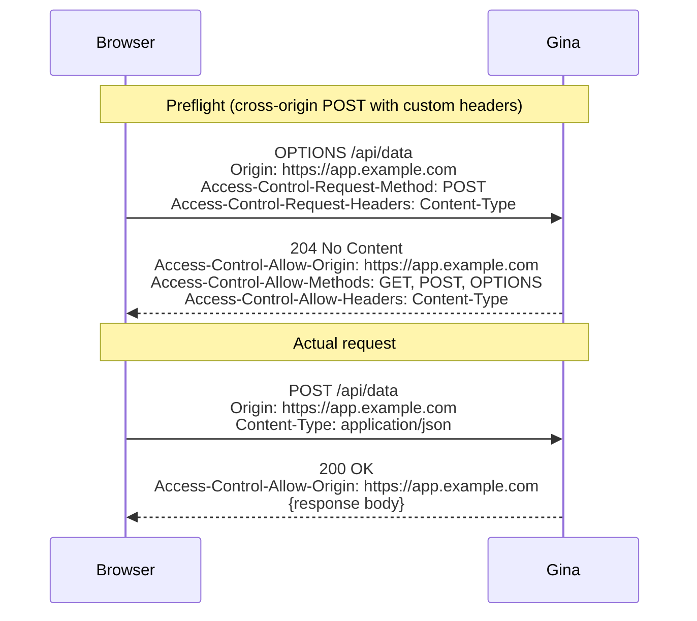

# settings.json

Controls how the bundle's HTTP server runs: engine, protocol, locale, file uploads,
and caching. Several companion files extend the same settings tree for credentials,
CORS, and per-environment cache toggles.

```
src/<bundle>/config/
├── settings.json                       ← server, locale, upload, cache
├── settings.server.json                ← webroot, CORS (server-side only)
├── settings.server.credentials.json    ← TLS certificate paths
├── settings.server.cache.${env}.json    ← cache on/off per environment
└── settings.server.resolvers.json      ← DNS resolvers per scope
```

All `settings*.json` files in the `config/` directory are merged into a single
settings tree at startup. See the [load order](./index.md#load-order) for how
section names are derived from filenames.

---

## settings.json

The primary server settings file.

```json title="src/frontend/config/settings.json"
{
  "server": {
    "engine"   : "isaac",
    "protocol" : "http/2.0",
    "scheme"   : "https",
    "address"  : "0.0.0.0"
  },
  "region": {
    "culture"  : "en_CM",
    "isoShort" : "en",
    "date"     : "dd/mm/yyyy",
    "timeZone" : "Africa/Douala"
  },
  "locale": {
    "region"              : "en_CM",
    "preferedLanguages"   : ["en-CM", "en"],
    "firstDayOfWeek"      : 1,
    "calendar"            : "gregorian",
    "24HourTimeFormat"    : true
  },
  "cache": {
    "enable": false
  }
}
```

### `server`

| Field | Type | Default | Description |
|---|---|---|---|
| `engine` | `"isaac"` | `"isaac"` | HTTP server engine. `"isaac"` is the built-in HTTP/2 engine |
| `protocol` | `"http/2.0"` \| `"http/1.1"` | `"http/2.0"` | Wire protocol |
| `scheme` | `"https"` \| `"http"` | `"https"` | URL scheme |
| `address` | string | `"0.0.0.0"` | Bind address. Use `"127.0.0.1"` for IPv4-only or `"::"` for IPv6-only |
| `allowHTTP1` | boolean | `true` | Accept HTTP/1.1 connections on the HTTP/2 server |
| `keepAliveTimeout` | string | `"5s"` | Keep-alive socket timeout (e.g. `"5s"`, `"30s"`) |
| `headersTimeout` | string | `"5500ms"` | Headers timeout — must be greater than `keepAliveTimeout` |
| `backlog` | number | `511` | Connection queue length |

### `region`

Per-bundle region block, seeded by `gina bundle:add` from your machine's locale.
`region.culture` is the bundle's **default request culture** — step 4 of the
[locale negotiation](../guides/i18n#locale-negotiation--reqculture) chain that
sets `req.culture` on every request.

```json
{
  "region": {
    "culture"  : "fr_FR",
    "isoShort" : "fr",
    "date"     : "dd/mm/yyyy",
    "timeZone" : "Europe/Paris"
  }
}
```

| Field | Type | Default | Description |
|---|---|---|---|
| `culture` | string | resolved at `bundle:add` | Default culture for per-request locale negotiation, as `lang` or `lang_COUNTRY` (e.g. `"fr"`, `"fr_FR"`; hyphenated `"fr-FR"` is accepted and normalised to underscore form). Consulted after the URL prefix, the locale cookie (`i18n.cookieName`, default `gina_culture`), and `Accept-Language`, and before the `GINA_CULTURE` env var |
| `isoShort` | string | resolved at `bundle:add` | ISO 639-1 language code (2 letters, e.g. `"en"`, `"fr"`). *Since 0.5.16* also the locale-database **fallback language**: when a request's culture has no entry in the loaded region set, locale resolution falls back to this language (the legacy `shortCode` key is still honoured for hand-authored configs; `en` is the final default) |
| `date` | string | resolved at `bundle:add` | Date display format (e.g. `"mm/dd/yyyy"`, `"dd/mm/yyyy"`, `"yyyy/mm/dd"`) |
| `timeZone` | string | resolved at `bundle:add` | IANA timezone identifier (e.g. `"Europe/Paris"`). Applied to the bundle process (`process.env.TZ`) at startup |

:::note `region` is not `locale`
`region.culture` sets the bundle's default **request culture** for locale
negotiation. The [`locale`](#locale) block below is the **formatting** surface
(dates, currency, measurement units) enriched from the machine locale at config
load — setting `locale.region` does **not** change the request culture.
:::

### `locale`

Locale settings are used by the i18n layer, date/number formatting, and currency display.
The bundle's default **request culture** is not set here — that is the top-level
[`region.culture`](#region) key above; `locale.region` is a region code used for
formatting defaults.

| Field | Type | Default | Description |
|---|---|---|---|
| `region` | string | `"EN"` | Locale code. Format: `"lang_COUNTRY"` (e.g. `"en_CM"`, `"fr_CM"`, `"fr_FR"`) |
| `preferedLanguages` | string[] | `["en-CM", "en"]` | Accepted-Language preference order |
| `firstDayOfWeek` | `0`–`6` | `1` | `0` = Sunday, `1` = Monday |
| `calendar` | string | `"gregorian"` | Calendar system |
| `24HourTimeFormat` | boolean | `true` | Use 24-hour time format |
| `temperature` | string | `"celsius"` | `"celsius"` or `"fahrenheit"` |
| `measurementUnits` | string | `"metric"` | `"metric"` or `"imperial"` |

### `cache`

Master switch for route-level response caching. Per-route `cache` fields in
`routing.json` are ignored when caching is disabled here.

```json
{
  "cache": {
    "type"   : "memory",
    "enable" : true,
    "path"   : "/var/cache/myproject",
    "ttl"    : 3600,
    "sliding": false,
    "maxAge" : 86400
  }
}
```

| Field | Type | Default | Description |
|---|---|---|---|
| `enable` | boolean | `false` | Master on/off switch |
| `type` | `"memory"` \| `"fs"` | `"memory"` | Bundle-wide default storage backend; routes inherit it when they set `cache` but omit `type`. A per-route `cache.type` always wins |
| `path` | string | — | Directory for `fs`-type cached files |
| `ttl` | number (seconds) | — | Default TTL when a route's `cache` config does not set one |
| `sliding` | boolean | `false` | Bundle-wide sliding-window default; routes inherit it when they omit `sliding` |
| `maxAge` | number (seconds) | — | Bundle-wide absolute lifetime ceiling; routes inherit it when they omit `maxAge`. Only meaningful when `sliding` is `true` |

See the [Caching guide](../guides/caching) for the full per-route field reference.

### `upload`

Configures multipart file uploads via [`@rhinostone/busboy`](https://github.com/gina-io/busboy) (a maintained fork of `busboy`).
Upload groups must be declared here before the upload endpoints in `routing.json`
can accept files.

```json
{
  "upload": {
    "encoding"            : "utf8",
    "maxFieldsSize"       : "2MB",
    "maxFields"           : 1000,
    "autoTmpCleanupTimeout": false,
    "groups": {
      "avatar": {
        "path"              : "${tmpPath}",
        "allowedExtensions" : ["jpg", "jpeg", "png", "webp"],
        "isMultipleAllowed" : false,
        "maxFieldsSize"     : "512K"
      }
    }
  }
}
```

| Field | Type | Default | Description |
|---|---|---|---|
| `encoding` | string | `"utf8"` | Upload encoding |
| `maxFieldsSize` | string | `"2MB"` | Global max upload size. Per-group override takes precedence |
| `maxFields` | number | `1000` | Max number of files when `isMultipleAllowed: true` |
| `autoTmpCleanupTimeout` | string \| `false` | `false` | Auto-delete tmp files after this duration (e.g. `"10m"`, `"1h"`). Set `false` to disable |
| `groups` | object | — | Named upload groups. At least one group required to enable uploads |

**Group fields:**

| Field | Type | Default | Description |
|---|---|---|---|
| `path` | string | — | Destination directory. Supports `${tmpPath}` |
| `allowedExtensions` | string[] \| `"*"` | — | Allowed file extensions. `"*"` accepts everything |
| `isMultipleAllowed` | boolean | `false` | Allow multiple files per upload |
| `maxFieldsSize` | string | global | Per-group size override (e.g. `"8MB"`, `"512K"`) |
| `filePrefix` | string | — | Prefix added to the saved filename |
| `subFolder` | string | — | Subfolder within `path`. Supports `:paramName` substitution |

### WebSocket — `engine.io`

Enable WebSocket support by adding an `engine.io` block.

```json
{
  "engine.io": {
    "port"            : 8888,
    "transports"      : ["polling", "websocket"],
    "pingInterval"    : 5000,
    "pingTimeout"     : 45000,
    "upgradeTimeout"  : 5000
  }
}
```

| Field | Type | Default | Description |
|---|---|---|---|
| `port` | number | `8888` | WebSocket listener port |
| `transports` | string[] | — | Allowed transports: `"polling"`, `"websocket"` |
| `pingInterval` | number (ms) | — | How often the server pings connected clients |
| `pingTimeout` | number (ms) | — | Time before a silent client is disconnected |
| `upgradeTimeout` | number (ms) | — | Time allowed for transport upgrade |

### `csrf`

Configures the optional `gina.plugins.Csrf()` middleware (signed double-submit
token + Origin/Referer pre-filter). Only consulted when the bundle registers
the plugin. See the [CSRF guide](../guides/csrf) for the full reference.

```json
{
  "csrf": {
    "secret":         "${secret:GINA_CSRF_SECRET}",
    "cookieName":     "gina-csrf-token",
    "headerName":     "X-Gina-CSRF-Token",
    "fieldName":      "_csrf",
    "rotate":         "per-session",
    "safeMethods":    ["GET", "HEAD", "OPTIONS"],
    "allowedOrigins": ["https://example.com"]
  }
}
```

| Field | Type | Default | Description |
|---|---|---|---|
| `secret` | string | — | HMAC secret used to sign and verify CSRF tokens. Accepts a `${secret:KEY}` [placeholder](../guides/secrets) that resolves from `process.env[KEY]` at config-load time. Falls back to `process.env.GINA_CSRF_SECRET` when absent. The factory throws at bundle startup when none of the three sources (`opts.secret` > `settings.csrf.secret` > env var) resolves to a non-empty value |
| `cookieName` | string | `"gina-csrf-token"` | Name of the signed token cookie issued on safe-method requests |
| `headerName` | string | `"X-Gina-CSRF-Token"` | Request header the middleware reads on mutating requests (POST / PUT / PATCH / DELETE) |
| `fieldName` | string | `"_csrf"` | Form field the middleware accepts as a fallback when the header is absent |
| `rotate` | string | `"per-session"` | Token rotation policy. `"per-session"` issues one token per session lifetime |
| `safeMethods` | string[] | `["GET", "HEAD", "OPTIONS"]` | HTTP methods that pass through without verification |
| `allowedOrigins` | string[] | `[<bundleHostname>]` | Allowlist for the Origin / Referer pre-filter. When empty or unset, defaults to a single-entry list with the bundle's own auto-derived hostname (`scheme://host[:port]`). Set explicitly for multi-domain bundles |

**Secret precedence** (highest wins):

1. `opts.secret` passed to `gina.plugins.Csrf({ secret: ... })` — test override
2. `settings.csrf.secret` — placeholder-resolved at config-load time
3. `process.env.GINA_CSRF_SECRET` — back-compat fallback for bundles that adopted CSRF in `0.3.7`

:::tip Generate a strong secret
```bash
openssl rand -base64 64
```
Set the resulting value in `env.json` (`{ "dev": { "GINA_CSRF_SECRET": "<paste>" } }`)
or pass it directly via the deployment platform's secret-injection mechanism.
:::

### `auth`

Route-authorization settings, consulted when a `routing.json` rule opts in with
`param.requireAuth`, `param.roles`, or `param.policy`. See the
[Route authorization guide](../guides/route-authorization) for the full model.

```json
{
  "auth": {
    "loginRoute": null
  }
}
```

| Field | Type | Default | Description |
|---|---|---|---|
| `loginRoute` | string | `null` | Rule name or absolute path a browser navigation is redirected to when it hits a `requireAuth` route without an authenticated session. A rule name (`"login"`) resolves to that rule's served URL; an absolute path (`"/login"`) is used verbatim. When `null`, unauthenticated browser requests get a `401` instead of a redirect (fail-closed). XHR requests always get the `401`, never a redirect. The bounce is always a non-cacheable `302`. A non-string value, or a rule name the bundle does not declare, refuses to boot |

### `audit`

Configures the append-only audit trail — a user-attributed record of "who did
what to which record when", kept separate from application logging (it has its
own store and never rides the logger sinks). Consulted only when `enabled` is
`true`; when the trail is on, route-authorization denials are recorded
automatically. See the [Audit trail guide](../guides/audit-trail) for the
record schema and backends.

```json
{
  "audit": {
    "enabled":  false,
    "file":     null,
    "actorKey": "id",
    "events":   { "authz": true }
  }
}
```

| Field | Type | Default | Description |
|---|---|---|---|
| `enabled` | boolean | `false` | Master switch. Strictly boolean — any other type (a truthy `"true"`, `1`) refuses to boot, so a compliance control can never be silently OFF |
| `file` | string | `null` | JSONL destination for the default file backend. `null` ⇒ `<project>/logs/audit-<bundle>-<env>.jsonl` (the resolved path is logged at boot). A relative path resolves against the project root, never the process cwd. An empty string refuses to boot |
| `store` | string | `null` | Advanced: a `connectors.json` entry name, resolved through a store dispatcher instead of the file backend. No connector ships an audit-store implementation yet, so setting this today refuses the boot rather than falling back silently. Mutually exclusive with `file` |
| `actorKey` | string | `"id"` | Which `session.user` field is snapshotted as the record's actor key. Records keep only that key plus a copy of `user.roles` — never the whole user object. An empty string refuses to boot |
| `events.authz` | boolean | `true` | Framework auto-events: record every route-authorization denial as an `authz.denied` record. On whenever `enabled` is `true`; set `false` to opt out |

:::note Boot config
`auth` and `audit` are read once at bundle startup — a change to either needs a
bundle restart (like `routing.json`, `connectors.json`, and the rest of
`settings.json`).
:::

### `render`

Selects the template engine `self.render(data)` dispatches to for this bundle.
See the [Templating overview](/templating) for the engine comparison and the
[Views guide](/guides/views) for the rendering workflow.

```json
{
  "render": {
    "engine": "nunjucks"
  }
}
```

| Field | Type | Default | Description |
|---|---|---|---|
| `engine` | string | `"swig"` | Render-delegate selection. `"nunjucks"` dispatches to the Nunjucks delegate — a project-side opt-in: the bundle fails loud at startup with `NUNJUCKS_NOT_INSTALLED` when the project hasn't `npm install`ed nunjucks. Any other value (including the default `"swig"`) renders through the Swig-family delegate |

:::note Twig, Jinja2, and Django are not `render.engine` values
Those syntaxes are swig-core frontends selected through `settings.swig.package`
(e.g. `"@rhinostone/swig-twig"`) with `render.engine` left at its `"swig"`
default — see the [Templating overview](/templating) for the per-engine
configuration.
:::

### `swig`

Configures the Swig template engine. `settings.swig.package` selects the
swig-core frontend (see the note above); `settings.swig.autoescape` controls
HTML output escaping.

```json
{
  "swig": {
    "autoescape": true
  }
}
```

| Field | Type | Default | Description |
|---|---|---|---|
| `autoescape` | boolean | `false` | HTML-escape Swig variable output (`{{ x }}`) as an XSS defense. **Off by default** in gina — `{{ userInput }}` renders raw unless you set this to `true`. A non-boolean value fails the bundle at startup. |

:::warning Swig output is not auto-escaped by default in gina
Unlike standalone `@rhinostone/swig` (which auto-escapes by default) and unlike
Nunjucks in gina (`settings.nunjucks.autoescape` defaults to `true`), gina
renders Swig variable output **raw** by default. Set
`settings.swig.autoescape: true` to enable escaping, or escape explicitly with
the `e` / `escape` filter. Never render untrusted input through Swig without one
of these.
:::

### `template`

Configures the optional per-engine **async template loader** (shipped in
`0.4.6`). The loader block lives at `template.<engine>.loader`, with
`<engine>` one of `swig` / `nunjucks` (matching the bundle's `render.engine`).
When the block is absent the bundle keeps the default filesystem template
path. The [Async Template Loaders guide](/templating/async-loaders) is the
authoritative reference for loader behaviour — caching, http resilience, and
the security model.

```json
{
  "template": {
    "swig": {
      "loader": {
        "type": "http",
        "origin": "https://cdn.example.com",
        "basePath": "/templates",
        "ttl": 60,
        "revalidate": false,
        "cache": false
      }
    }
  }
}
```

| Field | Type | Default | Description |
|---|---|---|---|
| `loader.type` | string | — | Required when a `loader` block is present. One of `"memory"` (inline `identifier → source` map) or `"http"` (templates fetched from an HTTP(S) origin). Any other value fails the bundle at startup |
| `loader.cache` | boolean | `false` | Opt-in compiled-template reuse across requests (set exactly `true`). Always disabled in development so template edits are picked up live |
| `loader.templates` | object | — | `memory` only, required — flat map of template identifier to source string |
| `loader.origin` | string | — | `http` only, required — `scheme://host[:port]` of the template origin. Must be `http` or `https`, with no path component |
| `loader.basePath` | string | `""` | `http` only — path prefix that template identifiers resolve under, root-relative |
| `loader.ttl` | number | `60` | `http` only — source-cache TTL in seconds (absolute from fetch). `0` caches until evicted |
| `loader.revalidate` | boolean | `false` | `http` only — when `true`, a cache hit issues a conditional `GET` (`If-None-Match`) and serves the cached source on `304`, refreshing the TTL |

:::note Fail-fast validation
The loader config is validated at bundle startup — a bad shape (unknown
`type`, missing `templates` / `origin`) terminates the boot rather than
failing on the first render. No network probe is made at startup; http fetch
failures at render time follow the resilience rules described in the
[guide](/templating/async-loaders).
:::

---

## settings.server.json {#settingsserverjson}

Server-side-only overrides. These values are available on the server and not
exposed to templates or client-side code.

```json title="src/frontend/config/settings.server.json"
{
  "server": {
    "webroot"            : "/frontend",
    "webrootAutoredirect": true
  }
}
```

| Field | Type | Default | Description |
|---|---|---|---|
| `server.webroot` | string | `"/"` | URL prefix prepended to every route. `/frontend` makes `GET /home` accessible at `/frontend/home` |
| `server.webrootAutoredirect` | boolean | `true` | Redirect `GET /frontend` → `GET /frontend/` automatically. Set to `false` when webroot is `"/"` |

### CORS headers {#cors}

Add CORS headers under `server.response.header` in `settings.server.json`:

```json title="src/api/config/settings.server.json"
{
  "server": {
    "response": {
      "header": {
        "access-control-allow-origin": "${api}@${myproject}, https://checkout.stripe.com",
        "access-control-allow-methods": "GET, POST, OPTIONS",
        "access-control-allow-headers": "Content-Type, Authorization, X-Requested-With",
        "access-control-allow-credentials": true,
        "vary": "Origin"
      }
    }
  }
}
```

| Header | Type | Default | Description |
|---|---|---|---|
| `access-control-allow-origin` | string | Reflects own hostname (same-origin only) | Comma-separated list of allowed origins. Supports `${bundle}@${project}` placeholders (see below). Cross-origin requests are blocked when the origin is not listed |
| `access-control-allow-methods` | string | `"GET, POST, HEAD"` | HTTP methods the client may use on cross-origin requests |
| `access-control-allow-headers` | string | — | Headers the client may send. Add `Content-Type` for JSON APIs, `Authorization` for token-based auth |
| `access-control-allow-credentials` | boolean | — | Set to `true` to allow cookies and credentials on cross-origin requests |
| `vary` | string | — | Set to `"Origin"` when allowing multiple specific origins, so caches serve the correct header per origin |

**Default behavior (no CORS config):** Gina reflects the requesting origin only for
same-origin requests. Cross-origin requests receive no `Access-Control-Allow-Origin`
header — browsers block them. This is a secure default.

**Preflight handling:** `OPTIONS` requests with an `Access-Control-Request-Method`
header are detected automatically. Gina responds with `204 No Content` and the
configured CORS headers — no controller action executes. The
[controller guide](/guides/controller) notes that `OPTIONS` never reaches a
controller action.

**The `${bundle}@${project}` placeholder:** References another bundle's hostname at
runtime. `${api}@${myproject}` resolves to `http://localhost:3100` (or the production
URL depending on the environment). Use this for inter-bundle CORS instead of
hardcoding hostnames:

```json
"access-control-allow-origin": "${frontend}@${myproject}, ${admin}@${myproject}"
```

You can also append an environment: `${api}@${myproject}/prod`.

:::tip
Gina never sends `Access-Control-Allow-Origin: *` — it always resolves to a specific
origin. When multiple origins are configured, only the one matching the current
request is returned. This is the correct behavior per the CORS specification.
:::



---

## settings.server.credentials.json {#settingsservercredentialsjson}

TLS certificate and private key paths. These values are merged under
`server.credentials` and are only ever read by the server process — never
sent to the client.

```json title="src/frontend/config/settings.server.credentials.json"
{
  "server": {
    "credentials": {
      "privateKey"  : "/etc/ssl/${scope}/${host}/private.key",
      "certificate" : "/etc/ssl/${scope}/${host}/certificate.crt",
      "ca"          : "/etc/ssl/${scope}/${host}/ca_bundle.crt",
      "allowHTTP1"  : true
    }
  }
}
```

| Field | Type | Description |
|---|---|---|
| `privateKey` | string | Path to the private key file. Supports [path template variables](./index.md#path-template-variables) |
| `certificate` | string | Path to the certificate (or chained certificate) file |
| `ca` | string | Path to the CA bundle file |
| `allowHTTP1` | boolean | Accept HTTP/1.1 on the same port. Required for non-HTTP/2 clients |

:::note
Path template variables such as `${scope}`, `${host}`, and `${rootDomain}` are
particularly useful here since certificate paths typically vary by environment
and domain. See [path template variables](./index.md#path-template-variables) for
the full list.
:::

:::caution Add to `.gitignore`
`settings.server.credentials.json` reveals your server topology — certificate paths
expose hostnames, scope names, and directory structure that differ between environments
and should not be committed. Add it to `.gitignore` and distribute it out of band
(secrets manager, deployment pipeline, or manual copy per environment).
:::

---

## settings.server.cache.${env}.json {#settingsservercacheenvjson}

Overrides the `server.cache` block for a specific environment. The most common
use is to disable caching locally while keeping it active in production.

The `${env}` in the filename must match `NODE_ENV` for the file to take effect.
When the env does not match, the file is parsed but its section key resolves to
`server.cache.${env}` — an unused key — so it has no impact.

```json title="src/frontend/config/settings.server.cache.dev.json"
{
  "enable": false,
  "ttl"   : 3600
}
```

```json title="src/frontend/config/settings.server.cache.prod.json"
{
  "enable": true,
  "ttl"   : 7200
}
```

With both files present, running with `NODE_ENV=dev` disables caching; running
with `NODE_ENV=prod` enables it with a 2-hour TTL. The base `settings.json`
`cache` block acts as the fallback for any other environment.

---

## settings.server.resolvers.json {#settingsserverresolversjson}

Configures DNS resolvers per scope. Useful in containerised deployments where
cluster-internal DNS differs from public DNS.

```json title="src/frontend/config/settings.server.resolvers.json"
{
  "server": {
    "resolvers": {
      "local"      : ["127.0.0.1", "1.1.1.1"],
      "beta"       : ["10.244.0.10", "1.1.1.1"],
      "production" : ["10.244.0.10", "1.1.1.1"]
    }
  }
}
```

Each key is a scope name; the value is an ordered array of DNS server addresses.
Scopes are declared with `gina scope:add`. See [Scopes](../concepts/scopes).
