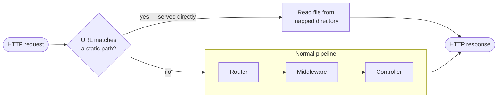
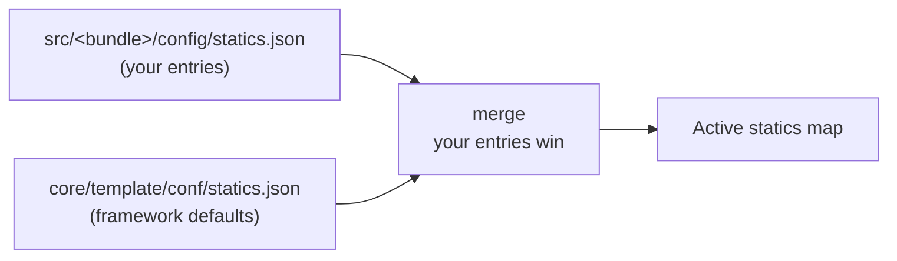
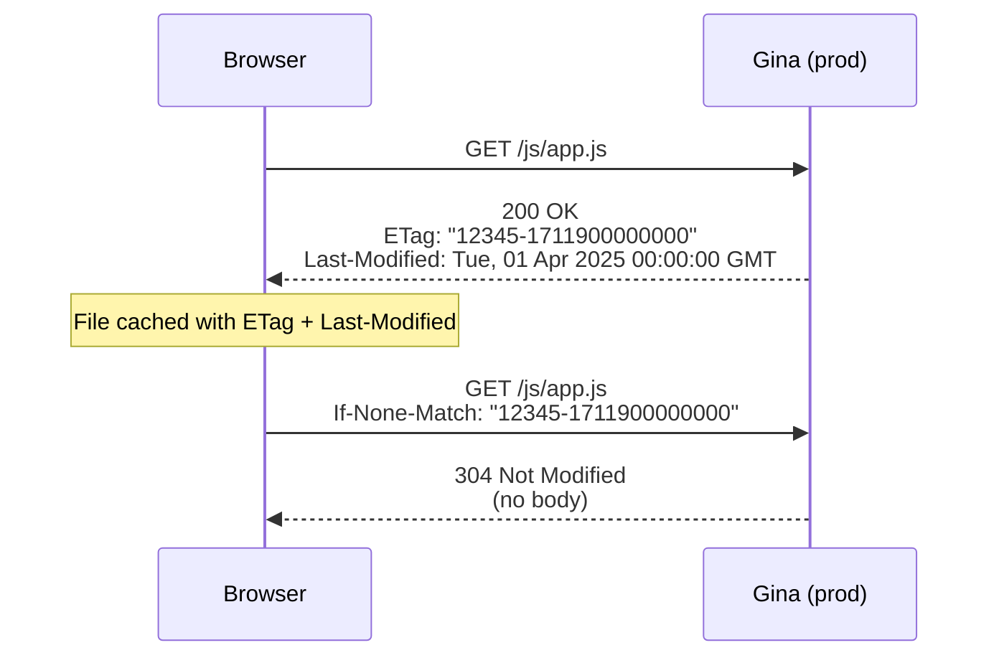

# statics.json

Maps URL paths to filesystem directories so the server knows where to find static assets (CSS, images, JavaScript, font files, etc.). Requests matching a declared static path bypass the router and controller entirely, and the file is served directly from the mapped directory.

```
src/<bundle>/config/statics.json
```

---

## How it works

Each entry in `statics.json` is a `"url-path": "filesystem-path"` pair.
When a request arrives for a URL that starts with a declared path, the file is
read directly from the mapped directory — **bypassing the router and controller entirely**.



The lookup is prefix-based: `"css"` in `statics.json` matches any request whose
URL starts with `/css/`, regardless of the filename.

---

## Minimal example

```json title="src/frontend/config/statics.json"
{
  "css" : "${bundlePath}/public/css",
  "js"  : "${bundlePath}/public/js",
  "img" : "${bundlePath}/public/img"
}
```

`GET /css/main.css` → serves `${bundlePath}/public/css/main.css`.
`GET /js/app.js` → serves `${bundlePath}/public/js/app.js`.

[Path template variables](./index.md#path-template-variables) like `${bundlePath}`
are substituted at startup.

The empty-string key `""` maps the bundle root URL — useful for top-level files:

```json
{
  "": "${publicPath}"
}
```

`GET /favicon.ico` → served from `${publicPath}/favicon.ico`.

---

## Fields

| Key | Value | Description |
|---|---|---|
| any URL path string | filesystem path string | Maps `/<key>/` requests to the given directory |
| `""` (empty string) | filesystem path string | Maps the bundle root URL (used for `favicon.ico`, `robots.txt`, etc.) |

URL path keys do **not** need a leading or trailing slash — the framework normalises
them at startup.

---

## Framework defaults

The framework merges a baseline below your `statics.json`. Your entries always win
when the same key appears in both.



| Key | Resolves to | Purpose |
|---|---|---|
| `html` | `${templatesPath}/html` | Template HTML files |
| `sass` | `${templatesPath}/sass` | SASS source files |
| `handlers` | `${handlersPath}` | Client-side JS handlers |
| `css/vendor/gina` | `${gina}/framework/v${version}/core/asset/plugin/dist/vendor/gina/css` | Gina's built-in CSS |
| `js/vendor/gina` | `${gina}/framework/v${version}/core/asset/plugin/dist/vendor/gina/js` | Gina's built-in JS |
| `""` | `${publicPath}` | Bundle public directory |

You never need to declare these yourself unless you want to override one.

---

## Cross-bundle static sharing

To serve assets from another bundle (e.g. sharing a design system's CSS into an
`auth` bundle), point the value at that bundle's directory directly.

```json title="src/auth/config/statics.json"
{
  "css"        : "${bundlePath}/public/css",
  "js"         : "${bundlePath}/public/js",
  "shared/css" : "/absolute/path/to/dashboard/public/css"
}
```

`GET /shared/css/theme.css` → served from the dashboard's CSS directory.

To share across **all** bundles without duplication, use `shared/config/statics.json`:

```json title="shared/config/statics.json"
{
  "js/vendor": "${bundlePath}/../../shared/public/vendor/js"
}
```

---

## Caching behaviour

The static file server sends different cache headers depending on the environment.

### Production (`NODE_ENV_IS_DEV` not set)

Every static response includes `ETag` and `Last-Modified` headers. Subsequent requests
from the browser are answered with **304 Not Modified** when the file has not changed —
saving bandwidth and reducing latency for returning visitors.



**ETag format** — `"<size>-<mtime>"` (size in bytes, mtime in milliseconds). This is a
strong identity check: any change to the file produces a new ETag.

**Precedence** — `If-None-Match` (ETag) is checked first. `If-Modified-Since` is only
evaluated when `If-None-Match` is absent.

### Dev mode (`NODE_ENV_IS_DEV=true`)

All static responses carry `cache-control: no-cache, no-store, must-revalidate` —
the browser never caches and always fetches fresh. This ensures that file edits are
reflected immediately without a hard-reload.

For `.js` and `.css` files that have a corresponding `.map` file, the `X-SourceMap`
header is also set so browser DevTools can load the source map.

### Summary

| Environment | Headers sent | Browser behaviour |
|---|---|---|
| Production | `ETag`, `Last-Modified` | 304 on unchanged files |
| Dev | `cache-control: no-cache, no-store, must-revalidate` + `X-SourceMap` (JS/CSS only) | Always re-fetches |

---

## Extended example

```json title="src/dashboard/config/statics.json"
{
  "css"       : "${bundlePath}/public/css",
  "js"        : "${bundlePath}/public/js",
  "img"       : "${bundlePath}/public/img",
  "js/vendor" : "${bundlePath}/public/vendor/js",
  "fonts"     : "${bundlePath}/public/fonts",
  "downloads" : "${tmpPath}/downloads"
}
```
