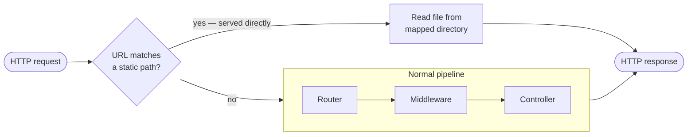
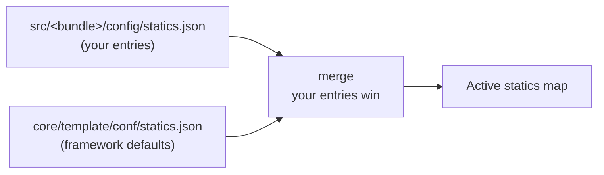
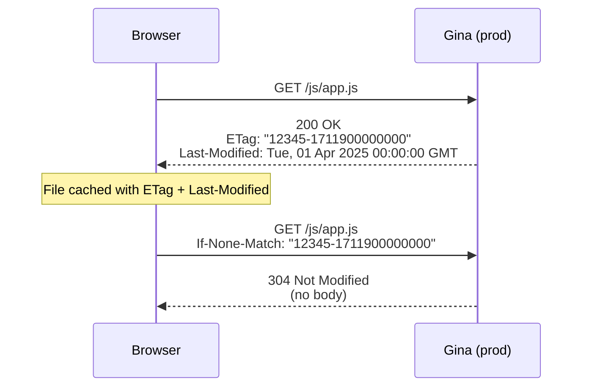
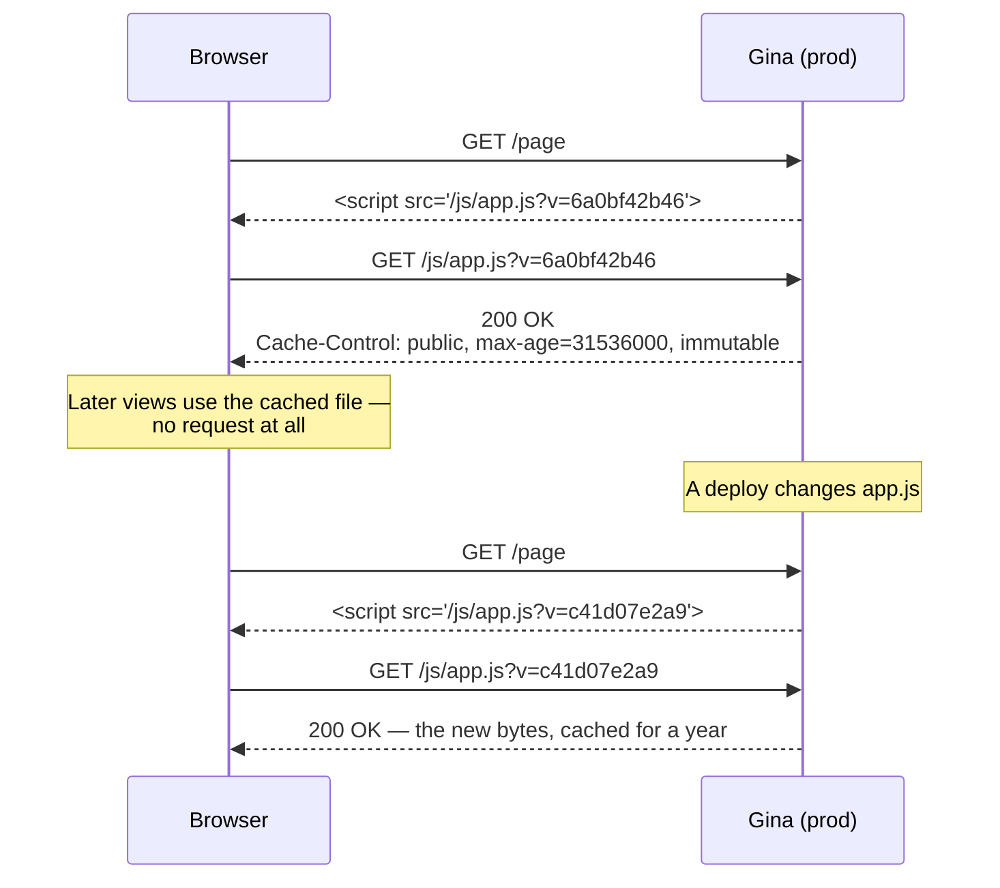

# statics.json

Maps URL paths to filesystem directories so the server knows where to find static assets (CSS, images, JavaScript, font files, etc.). Requests matching a declared static path bypass the router and controller entirely, and the file is served directly from the mapped directory.

```
src/<bundle>/config/statics.json
```

---

## How it works

Each entry in `statics.json` is a `"url-path": "filesystem-path"` pair.
When a request arrives for a URL that starts with a declared path, the file is
read directly from the mapped directory — **bypassing the router and controller entirely**.


```mermaid
flowchart LR
    A(["HTTP request"]) --> B{"URL matches\na static path?"}

    B -- "yes — served directly" --> C["Read file from\nmapped directory"]
    C --> D(["HTTP response"])

    B -- "no" --> E
    subgraph E["Normal pipeline"]
        direction LR
        E1["Router"] --> E2["Middleware"] --> E3["Controller"]
    end
    E --> D
```

The lookup is prefix-based: `"css"` in `statics.json` matches any request whose
URL starts with `/css/`, regardless of the filename.

---

## Minimal example

```json title="src/frontend/config/statics.json"
{
  "css" : "${bundlePath}/public/css",
  "js"  : "${bundlePath}/public/js",
  "img" : "${bundlePath}/public/img"
}
```

`GET /css/main.css` → serves `${bundlePath}/public/css/main.css`.
`GET /js/app.js` → serves `${bundlePath}/public/js/app.js`.

[Path template variables](./index.md#path-template-variables) like `${bundlePath}`
are substituted at startup.

The empty-string key `""` maps the bundle root URL — useful for top-level files:

```json
{
  "": "${publicPath}"
}
```

`GET /favicon.ico` → served from `${publicPath}/favicon.ico`.

---

## Fields

| Key | Value | Description |
|---|---|---|
| any URL path string | filesystem path string | Maps `/<key>/` requests to the given directory |
| `""` (empty string) | filesystem path string | Maps the bundle root URL (used for `favicon.ico`, `robots.txt`, etc.) |

URL path keys do **not** need a leading or trailing slash — the framework normalises
them at startup.

---

## Framework defaults

The framework merges a baseline below your `statics.json`. Your entries always win
when the same key appears in both.


```mermaid
flowchart LR
    A["src/&lt;bundle&gt;/config/statics.json\n(your entries)"] --> M["merge\nyour entries win"]
    B["core/template/conf/statics.json\n(framework defaults)"] --> M
    M --> C["Active statics map"]
```

| Key | Resolves to | Purpose |
|---|---|---|
| `html` | `${templatesPath}/html` | Template HTML files |
| `sass` | `${templatesPath}/sass` | SASS source files |
| `handlers` | `${handlersPath}` | Client-side JS handlers |
| `css/vendor/gina` | `${gina}/framework/v${version}/core/asset/plugin/dist/vendor/gina/css` | Gina's built-in CSS |
| `js/vendor/gina` | `${gina}/framework/v${version}/core/asset/plugin/dist/vendor/gina/js` | Gina's built-in JS |
| `""` | `${publicPath}` | Bundle public directory |

You never need to declare these yourself unless you want to override one.

---

## Cross-bundle static sharing

To serve assets from another bundle (e.g. sharing a design system's CSS into an
`auth` bundle), point the value at that bundle's directory directly.

```json title="src/auth/config/statics.json"
{
  "css"        : "${bundlePath}/public/css",
  "js"         : "${bundlePath}/public/js",
  "shared/css" : "/absolute/path/to/dashboard/public/css"
}
```

`GET /shared/css/theme.css` → served from the dashboard's CSS directory.

To share across **all** bundles without duplication, use `shared/config/statics.json`:

```json title="shared/config/statics.json"
{
  "js/vendor": "${bundlePath}/../../shared/public/vendor/js"
}
```

---

## Caching behaviour

The static file server sends different cache headers depending on the environment.

### Production (`NODE_ENV_IS_DEV` not set)

Every static response includes `ETag` and `Last-Modified` headers. Subsequent requests
from the browser are answered with **304 Not Modified** when the file has not changed —
saving bandwidth and reducing latency for returning visitors.


```mermaid
sequenceDiagram
    participant B as Browser
    participant G as Gina (prod)

    B->>G: GET /js/app.js
    G-->>B: 200 OK<br/>ETag: "12345-1711900000000"<br/>Last-Modified: Tue, 01 Apr 2025 00:00:00 GMT

    Note over B: File cached with ETag + Last-Modified

    B->>G: GET /js/app.js<br/>If-None-Match: "12345-1711900000000"
    G-->>B: 304 Not Modified<br/>(no body)
```

**ETag format** — `"<size>-<mtime>"` (size in bytes, mtime in milliseconds). This is a
strong identity check: any change to the file produces a new ETag.

**Precedence** — `If-None-Match` (ETag) is checked first. `If-Modified-Since` is only
evaluated when `If-None-Match` is absent.

### Dev mode (`NODE_ENV_IS_DEV=true`)

All static responses carry `cache-control: no-cache, no-store, must-revalidate` —
the browser never caches and always fetches fresh. This ensures that file edits are
reflected immediately without a hard-reload.

For `.js` and `.css` files that have a corresponding `.map` file, the `X-SourceMap`
header is also set so browser DevTools can load the source map.

### Versioned asset URLs

*New in 0.7.2.* In production, the `<link>` and `<script>` tags gina writes for
the stylesheets and scripts declared in [`templates.json`](/reference/templates)
carry a **content token**: `?v=` followed by the first 10 hexadecimal characters
of the file's SHA-384 (`&v=` when the URL already has a query string). The token
changes only when the file's bytes change, so a browser can keep the file for a
year, and a deploy that changes a file changes its URL — the next page names the
new one.

```html
<script defer type="text/javascript" src="/js/vendor/gina/gina.min.js?v=e602d1b9ee" data-gina-routing-v="1f3c5a7b9d"></script>
<link href="/css/app.css?v=99bf1f0781" rel="stylesheet" type="text/css">
```


```mermaid
sequenceDiagram
    participant B as Browser
    participant G as Gina (prod)

    B->>G: GET /page
    G-->>B: <script src="/js/app.js?v=6a0bf42b46">
    B->>G: GET /js/app.js?v=6a0bf42b46
    G-->>B: 200 OK<br/>Cache-Control: public, max-age=31536000, immutable
    Note over B: Later views use the cached file —<br/>no request at all
    Note over G: A deploy changes app.js
    B->>G: GET /page
    G-->>B: <script src="/js/app.js?v=c41d07e2a9">
    B->>G: GET /js/app.js?v=c41d07e2a9
    G-->>B: 200 OK — the new bytes, cached for a year
```

For a static file gina serves itself, the token decides the cache header:

| Request | Response |
|---|---|
| `?v=` naming the file's current bytes | `200` + `Cache-Control: public, max-age=31536000, immutable` |
| `?v=` with any other 10-hex token — a page rendered before a deploy, an old link | `200` + `Cache-Control: no-cache` + `ETag`: the browser revalidates, and never keeps stale bytes for a year |
| No `v`, or a `v` that is not a 10-hex token (your own `?v=2`) | Unchanged: `ETag` + `Last-Modified`, no `Cache-Control` |

A revalidation of a versioned URL (`If-None-Match`) is answered `304` as before;
over HTTP/2, the `304` for the current token repeats
`Cache-Control: public, max-age=31536000, immutable`. The HTTP/2 preload
hints — the `link` response header and `103 Early Hints` — name the same
versioned URLs as the tags, so no asset is fetched twice.

**The routing table.** The client fetches `/_gina/assets/routing.json` on every
page load. Gina's own `<script>` tag carries the table's token in
`data-gina-routing-v`, the client appends it, and the server answers
`max-age=31536000, immutable` (`private` behind a proxy, `public` otherwise)
for the token of the table it serves. A routing change mints a new token; a
restart with the same routes keeps it. A page the browser has cached keeps
using the table it was rendered with until the page itself expires.

**What is not versioned** — these keep their plain URLs:

- a `javascripts` entry marked `isExternalPlugin` (gina splices it into the
  layout it compiles, which the render cache can keep for a long time);
- a render without a layout (`isWithoutLayout` — a popin body, a fragment);
- tags you write by hand in a layout, and the images and fonts your CSS
  references;
- a file gina cannot find on disk (an external URL, a missing file) or one
  larger than 8 MiB;
- every page in dev mode, where statics are served `no-store` anyway;
- a bundle that sets `"assetVersioningEnabled": false` in
  `templates.json > _common`.

**Precompressed files.** Over HTTP/1.1, gina serves `app.js.br` or `app.js.gz`
instead of `app.js` when the browser accepts that encoding and the file exists.
Under a matching token the compressed file is served `immutable` only when it is
not older than `app.js`, compared in whole seconds (compression tools that keep
their source's timestamp truncate it); an older one is served `no-cache`, since
it may predate the current source. Regenerate compressed files whenever you
rebuild their source.

**Serving statics from nginx.** Gina compares the token with the bytes before it
answers `immutable`; a front server cannot. Key the cache header on the token's
shape instead:

```nginx
map $arg_v $gina_asset_cache {
    ~^[0-9a-f]{10}$  "public, max-age=31536000, immutable";
    default          "no-cache";
}

server {
    # ...
    location ~* \.(?:js|css)$ {
        root /var/www/myproject/public;   # nginx finds the file; the query is ignored
        add_header Cache-Control $gina_asset_cache;
    }
}
```

nginx inherits `add_header` directives only into a block that declares none of
its own, so repeat inside this `location` any header your `server` block adds —
security headers, for example.

Two preconditions, because nginx cannot check a token:

1. **nginx must serve the bytes gina hashed.** True when the static files are
   deployed with the same release as the running bundle. On a stack where the
   files nginx serves can lag behind the code — a development setup that copies
   assets separately — a stale copy would be cached for a year under a fresh
   token: leave the rule out there.
2. **Precompressed files (`gzip_static`, `brotli_static`) must be rebuilt with
   their source.**

**Rebuilding assets without a restart.** Tokens follow the file (each is cached
and re-validated against the file's size and modification time), so a rebuilt
asset gets its new token on the next render. Pages already stored by the
[render cache](/guides/caching) keep the tokens they were rendered with — their
assets are revalidated instead of cached for a year — until you flush that cache
or restart, as for [Subresource Integrity](/reference/templates#subresource-integrity-srienabled).

### Summary

| Environment | Headers sent | Browser behaviour |
|---|---|---|
| Production | `ETag`, `Last-Modified` | 304 on unchanged files |
| Production, versioned URL (`?v=` + the file's current token) | `Cache-Control: public, max-age=31536000, immutable`, `ETag`, `Last-Modified` | No request until the URL changes |
| Dev | `cache-control: no-cache, no-store, must-revalidate` + `X-SourceMap` (JS/CSS only) | Always re-fetches |

---

## Extended example

```json title="src/dashboard/config/statics.json"
{
  "css"       : "${bundlePath}/public/css",
  "js"        : "${bundlePath}/public/js",
  "img"       : "${bundlePath}/public/img",
  "js/vendor" : "${bundlePath}/public/vendor/js",
  "fonts"     : "${bundlePath}/public/fonts",
  "downloads" : "${tmpPath}/downloads"
}
```
