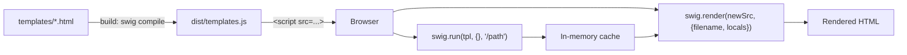

# Browser Usage

Most of Swig works in the browser the same way it does in Node. The only exception: **Swig cannot read files by path from the browser** — the filesystem loader throws if `fs` is unavailable.

If a template uses `` or ``, Swig must already have `./myfile.html` in its cache. The idiomatic flow is to pre-compile every template at build time and prime the cache before rendering.



## Pre-compile + prime + render

1. **Compile each template into a JS file.** `--method-name` assigns a name to the exported function.

   ```bash
   swig compile myfile.html --method-name=myfile > myfile.js
   ```

2. **Load Swig and the compiled template in the page.**

   ```html
   <script src="swig.min.js"></script>
   <script src="myfile.js"></script>
   ```

3. **Prime Swig's cache.** `swig.run(tpl, locals, filepath)` evaluates the template and registers it under `filepath`.

   ```html
   <script>
     swig.run(myfile, {}, '/myfile.html');
   </script>
   ```

4. **Render a template that extends the primed file.**

   ```html
   <script>
     var tpl = '' +
               '{{ stuff }}';
     var out = swig.render(tpl, {
       filename: '/tpl',
       locals: { stuff: 'awesome' }
     });
     document.querySelector('#foo').innerHTML = out;
   </script>
   ```

## AOT bundle — many templates at once

For projects with more than a handful of templates, use `swig compile --recursive` to emit one module instead of one file per template. Added in v1.6.0.

```bash
swig compile --recursive ./views --ext=.html -o ./dist/templates.js
```

Prime the cache from the bundle at startup:

```js
var templates = require('./dist/templates.js');
Object.keys(templates).forEach(function (key) {
  swig.cache[key] = templates[key];
});
```

See [CLI — AOT bundle](./cli#aot-bundle--compile-a-directory) for the full flag reference and caveats.

## Memory loader instead of pre-compilation

If you prefer to ship raw template source to the browser, wire up a memory loader:

```js
swig.setDefaults({ loader: swig.loaders.memory({
  'layout.html': '<!doctype html>…',
  'page.html':   '…'
})});

document.body.innerHTML = swig.renderFile('page.html', { title: 'Hi' });
```

See [Loaders — memory](./loaders#swigloadersmemory) for the full contract.

## Getting the bundled build

The repository produces two files under `dist/`:

| File | Purpose |
| --- | --- |
| `dist/swig.js` | Development bundle. Browserified; includes full source for debugging. |
| `dist/swig.min.js` | Production bundle. Terser-minified + source-mapped. |

Build locally:

```bash
make build
```

Consuming via a bundler (Webpack, Rollup, esbuild, Vite) — `require('@rhinostone/swig')` should just work; the `main` entry resolves to `lib/swig.js`, and the filesystem loader guards itself for browser targets.

## Gotchas

- **The filesystem loader throws in the browser.** Always set a custom loader (memory or pre-compiled cache) before the first render. Ideally call `swig.setDefaults({ loader: swig.loaders.memory({}) })` at module init time.
- **`swig run` is not a sandbox.** The function body is evaluated. Do not hand it untrusted input — see [Security](./security#swig-run-is-not-a-sandbox).
- **Cache persistence.** The in-memory cache lives on the Swig instance. Reloading the page resets it. If you hot-reload the bundle, call [`swig.invalidateCache()`](./api#invalidatecache) before re-priming to avoid stale entries.

## Gina's browser build

Gina vendors the `swig-client` browser build at `framework/v*/core/deps/swig-client/swig.js`. It is byte-identical to `dist/swig.js` from this repository at release time. The banner reads `"Swig v2.0.0"` (the client-shim version); the real library version lives inside as `exports.version = "1.5.0"`.
