# Extending Swig

Every Swig instance owns its own set of filters, tags, and extensions — registrations on the default instance are not visible on an instance constructed via `new swig.Swig()`, and vice versa.

```mermaid
flowchart TD
  INST[Swig instance] --> FILT[filters map]
  INST --> TAGS[tags map]
  INST --> EXT[extensions map]
  FILT -->|"{{ x&#124;myFilter }}"| TOKEN[FILTER token]
  TAGS -->|"{% myTag %}"| PARSE[parse handler]
  PARSE --> COMPILE[compile handler]
  COMPILE --> OUT[JS source fragment]
  EXT -->|"_ext&#91;name&#93;"| RUNTIME[Runtime helper]
```



## Custom filters

A filter is a plain function `(input, ...args) => transformedValue`.

```js
swig.setFilter('shout', function (input) {
  return String(input).toUpperCase() + '!';
});

// {{ "hello"|shout }}  => HELLO!
```

### Bypassing autoescape

Mark a filter `safe` to opt out of the final autoescape pass. Use this only when the filter's output is trusted HTML.

```js
function badge(input) {
  return '<span class="badge">' + escapeHtml(input) + '</span>';
}
badge.safe = true;

swig.setFilter('badge', badge);
```

If you forget `.safe = true` on a filter that already contains HTML, the output will be double-escaped. If you add it incorrectly, you create an XSS vector — see [Security](./security#autoescape-is-the-only-default-xss-protection).

### Recursing into arrays and objects

Most built-ins use `iterateFilter` so that `{{ names|upper }}` works for an array of strings. Your filter can opt in:

```js
var iterateFilter = require('@rhinostone/swig/lib/filters').iterateFilter;

function exclamate(input) {
  var out = iterateFilter.apply(exclamate, arguments);
  if (out !== undefined) return out;
  return String(input) + '!';
}

swig.setFilter('exclamate', exclamate);
```

Returning `undefined` from `iterateFilter` means "input is scalar — handle it directly".

## Custom tags

A tag module exports up to four members:

```js
exports.parse   = function (str, line, parser, types, stack, opts, swig) { … return true; };
exports.compile = function (compiler, args, content, parents, options, blockName) { … return 'js source'; };
exports.ends    = true;   // requires 
exports.block   = true;   // allowed outside  when extending
```

Register the tag:

```js
var myTag = require('./my-tag');
swig.setTag('mytag', myTag.parse, myTag.compile, myTag.ends, myTag.block);
```

### parse — called at parse time

Called once per tag occurrence.

| Param | Purpose |
| --- | --- |
| `str` | Raw string of the tag's arguments (text between the tag name and `%}`). |
| `line` | Source line number — for error messages. |
| `parser` | A `TokenParser` pre-built over the lexer tokens of the tag args. `autoescape` is `false` here. |
| `types` | Token type enum (exported from `lib/lexer.js`). |
| `stack` | Currently open tags (used for `end<name>` handling). |
| `opts` | The Swig options object. |
| `swig` | The Swig instance. Use `swig.options.loader.resolve/load` to reach external templates. |

Register per-token handlers with `parser.on(TYPE, fn)`. Returning `false` from the callback suppresses the default handler for that token type. Return `true` from `parse` to signal success — anything falsy throws "Unexpected tag".

```js
exports.parse = function (str, line, parser, types) {
  parser.on(types.STRING, function (token) {
    this.out.push(token.match);
    return false; // we handled it
  });
  return true;
};
```

### compile — called at compile time

Returns a JS source string that is spliced into the compiled function body.

| Param | Purpose |
| --- | --- |
| `compiler` | Reference to `parser.compile` — call it to recurse into `content`. |
| `args` | JS-source fragments emitted by `parse` (what ended up in `parser.out`). |
| `content` | Child tokens between the opening tag and `end<name>` — empty when `ends = false`. |
| `parents` | Parent template chain (for `block` / `parent` resolution). |
| `options` | The Swig options. |
| `blockName` | Name of the enclosing ``, if any. |

Emitted code has access to these locals in its scope:

| Name | Purpose |
| --- | --- |
| `_swig` | The Swig instance. |
| `_ctx` | The render context (locals). |
| `_filters` | Filter registry. |
| `_utils` | `each`, `isArray`, `keys`, … |
| `_ext` | Extension registry (see [setExtension](./api#setextension)). |
| `_fn` | No-op fallback for missing function calls. |
| `_output` | The accumulating output string. Append to it with `_output += …`. |

```js
exports.compile = function (compiler, args) {
  return '_output += _ext.translate(' + args[0] + ');';
};
```

### ends

| Value | Behavior |
| --- | --- |
| `true` | `` must have a matching ``. Content between becomes the `content` param. |
| `false` | Tag has no body (e.g. ``). |

### blockLevel

When a template uses ``, most of the child's top-level content is discarded — only `` overrides and tags marked `blockLevel: true` survive. Set `blockLevel = true` on tags that declare context (like `set`, `import`) so they remain effective in extending templates.

### Safety checklist for new tags

If your tag writes to `_ctx.*` or consumes VAR / FUNCTION / STRING tokens, apply the same guards as the built-ins:

- Swallowed VAR tokens bypass the default `parseVar` — add your own `_dangerousProps` check. Reserved names: `__proto__`, `constructor`, `prototype`.
- Identifiers from user input must never reach emitted source verbatim — confine them to `_ctx.<ident>` lookups or `JSON.stringify` them.
- Emitted code that declares variables must use `var` inside an IIFE — bare assignments leak to the page globals.

See [Security — General hardening guidelines](./security#general-hardening-guidelines) for the full checklist.

## Extensions

`setExtension(name, object)` puts `object` at `swig.extensions[name]`. Inside compiled templates, it is reachable as `_ext[name]`. Use this as the runtime entry point for helper code invoked from custom tags.

```js
swig.setExtension('i18n', {
  translate: function (key) { return i18n.t(key); },
  pluralize: function (key, count) { return i18n.p(key, count); }
});

// In a custom tag's compile():
//   return '_output += _ext.i18n.translate(' + args[0] + ');';
```

Like filters and tags, extensions are **per-instance**. Register them on every instance that needs them.

## Token types

When writing tag parse handlers, `types` is the enum from `lib/lexer.js`:

| Value | Name | Purpose |
| --- | --- | --- |
| `0` | `WHITESPACE` | Skipped in TokenParser. |
| `1` | `STRING` | String literal. |
| `2` | `FILTER` | `\|name(args)`. |
| `3` | `FILTEREMPTY` | `\|name` with no args. |
| `4` | `FUNCTION` | Function call with args. |
| `5` | `FUNCTIONEMPTY` | Function call, no args. |
| `6` / `7` | `PARENOPEN` / `PARENCLOSE` | `(` / `)`. |
| `8` | `COMMA` | Arg separator. |
| `9` | `VAR` | Identifier. |
| `10` | `NUMBER` | Numeric literal. |
| `11` | `OPERATOR` | `+ - * / %`. |
| `12` / `13` | `BRACKETOPEN` / `BRACKETCLOSE` | `[` / `]`. |
| `14` | `DOTKEY` | `.key` accessor. |
| `15` | `ARRAYOPEN` | `[` at start of array literal. |
| `17` / `18` | `CURLYOPEN` / `CURLYCLOSE` | `{` / `}` (object literal). |
| `19` | `COLON` | `:` inside object literal. |
| `20` | `COMPARATOR` | `== != === !== < > <= >= in`. |
| `21` | `LOGIC` | `&& \|\| and or`. |
| `22` | `NOT` | `! not`. |
| `23` | `BOOL` | `true false`. |
| `24` | `ASSIGNMENT` | `= += -= …`. |
| `100` | `UNKNOWN` | Fallthrough. |

`parser.on(types.VAR, fn)` subscribes to VAR tokens in the tag's argument stream. `parser.on('*', fn)` matches every token; `'start'` / `'end'` fire at stream boundaries.
