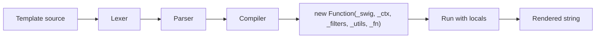

# Swig

Swig is the default HTML template engine shipped with Gina. Its syntax is **inspired by Jinja2 and Django** — variables are wrapped in `{{ … }}`, logic tags in ``, and layout inheritance happens through `` / `` — but it is **not drop-in compatible** with either. If you are porting templates from a Jinja2 or Django project, read the [Migration Guide](./migration) first.

Gina vendors the browser build of [`@rhinostone/swig`](https://github.com/gina-io/swig) under `framework/v*/core/deps/swig-client/`. This section documents that fork directly — installing it standalone, the template syntax, the full API, and how to extend it with custom tags, filters, and loaders.

## About this fork

The upstream project ([`paularmstrong/swig`](https://github.com/paularmstrong/swig)) is abandoned. `@rhinostone/swig` is the maintained fork that Gina depends on. Security patches (including [CVE-2023-25345](./security)) land here first, then are ported into Gina's vendored copy.

- **Package:** `@rhinostone/swig` on npm
- **License:** MIT
- **Version:** `1.6.0` — the current recommended version for production use.
- **Source:** [github.com/gina-io/swig](https://github.com/gina-io/swig)
- **Engine:** Node.js ≥ 12, all major browsers

## Pipeline at a glance

Swig is a single-pass engine: source text is tokenized, parsed into a tree, compiled to a JavaScript function body, wrapped in `new Function(...)`, then invoked with a locals context to produce the final string. Compiled templates are cached by filename.

## Where to go next

- **[Getting Started](./getting-started)** — install the package, render your first template, wire it up to Express.
- **[Template Syntax](./syntax)** — variables, filters, tags, comments, whitespace control, template inheritance.
- **[Tags](./tags)** — reference for the 15 built-in tags (`if`, `for`, `block`, `extends`, `include`, `macro`, `set`, …).
- **[Filters](./filters)** — reference for the 26 built-in filters (`date`, `escape`, `join`, `title`, `upper`, …).
- **[API](./api)** — programmatic API: `render`, `compile`, `renderFile`, `setFilter`, `setTag`, `setExtension`, `setDefaults`, etc.
- **[Template Loaders](./loaders)** — filesystem loader, in-memory loader, and the contract for writing a custom loader.
- **[Extending Swig](./extending)** — how to add your own tags, filters, and extensions.
- **[CLI](./cli)** — the `swig` command-line tool (compile / render / run).
- **[Browser Usage](./browser)** — running Swig in the browser, pre-compiling templates for the client.
- **[Security](./security)** — CVE advisories, the security model, and guidance for consumers.
- **[Migration Guide](./migration)** — porting templates from Jinja2 or Django: what transfers cleanly, what breaks at parse time, and workaround patterns.

## Gina integration

When using Swig inside a Gina bundle you don't call the Swig API directly — the framework does it for you via `self.render(data)` in a controller action. See the [Views guide](/guides/views) and [templates.json reference](/reference/templates) for the Gina-specific integration. This section documents Swig itself, which is also useful when:

- Writing a custom loader or extension that plugs into Gina's rendering pipeline.
- Debugging a template error — understanding what code the Swig parser generates clarifies the call stack.
- Using `@rhinostone/swig` outside of Gina (e.g. a standalone Express app, a CLI pre-compile step).
