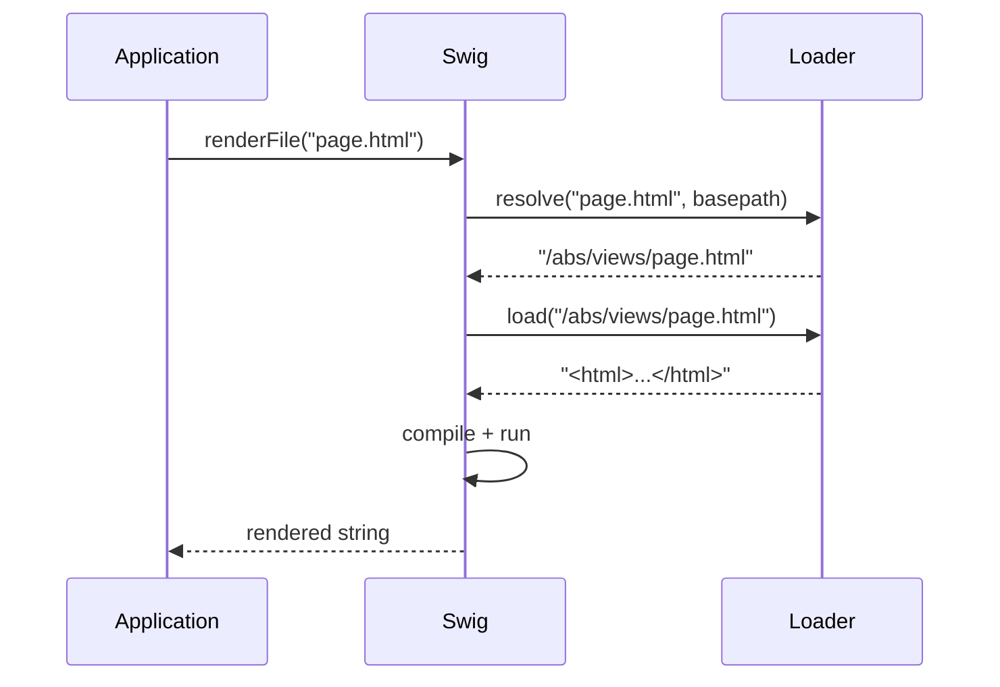

# Template Loaders

A loader bridges a template identifier (a filename, a URL, a Memcached key, …) to its actual source string. Swig calls into the loader in two places:



Every loader must expose **both**:

```js
{
  resolve: function (to, from)   { /* → absolute identifier string */ },
  load:    function (id, cb?)    { /* → source (sync) or cb(err, src) (async) */ }
}
```

Passing a loader object without both methods throws at `setDefaults` / constructor time.

---

## swig.loaders.fs

```js
swig.loaders.fs(basepath, encoding)
```

Filesystem loader. Wraps `fs.readFile` (or `fs.readFileSync` in sync mode).

| Arg | Type | Default | Description |
| --- | --- | --- | --- |
| `basepath` | string | — | Root directory. When set, every `resolve(to, from)` uses `basepath` instead of `path.dirname(from)`. |
| `encoding` | string | `'utf8'` | File encoding. |

```js
// Default — resolves relative to the including template
swig.setDefaults({ loader: swig.loaders.fs() });

// Fixed root
swig.setDefaults({ loader: swig.loaders.fs(__dirname + '/views') });
```

The filesystem loader is unavailable in the browser build — it throws on load if `fs` is missing.

---

## swig.loaders.memory

```js
swig.loaders.memory(mapping, basepath)
```

In-memory loader. Serves templates from a pre-built `{ name: source }` map.

| Arg | Type | Default | Description |
| --- | --- | --- | --- |
| `mapping` | object | — | Template name → source string. |
| `basepath` | string | `'/'` | Used by `resolve` when no `from` is passed. |

```js
swig.setDefaults({ loader: swig.loaders.memory({
  layout: '<html><body></body></html>',
  page:   'Hi'
})});

swig.renderFile('page');
```

Lookups also try the name without a leading `/` — `resolve` returns a path that the memory loader then strips. `/layout` and `layout` both work.

---

## Custom loaders

```js
function myLoader(endpoint, opts) {
  return {
    resolve: function (to, from) {
      // Return a stable, comparable string. Used as cache key AND
      // circular-extends guard — must be a pure function of its args.
      return /* absolute identifier */;
    },
    load: function (id, cb) {
      if (cb) {
        fetchAsync(id, function (err, src) { cb(err, src); });
        return;
      }
      return fetchSync(id);
    }
  };
}

swig.setDefaults({ loader: myLoader('https://…') });
```

### Sync vs async

Swig's core pipeline is synchronous. `render`, `compile`, and `precompile` invoke `loader.load(id)` without a callback and expect a string return. Only `renderFile` / `compileFile` accept a callback from the caller.

If your loader is **async-only**, you can only call the `*File` variants. `` / `` / `` fall through the sync `load(id)` path during compilation — they cannot be satisfied by an async-only loader.

### Determinism

The circular-extends guard compares resolved filenames against a set:

```js
// From getParents() in lib/swig.js
if (parentFiles.indexOf(parentFile) !== -1) {
  throw new Error('Illegal circular extends of "' + parentFile + '".');
}
```

`resolve(to, from)` must return the same string on every call for the same arguments. Timestamp-suffixes, case rewrites, or stateful rewrites break the guard — templates either infinite-loop or "flicker" false positives depending on cache mode.

### Cache keys

Compiled templates are cached under the string returned by `resolve`. Two implications:

- Calls to `resolve` that return the same string share the same compiled function. This is what makes `` cheap.
- Changing a loader's `basepath` does not invalidate existing cache entries. Call [`swig.invalidateCache()`](./api#invalidatecache) immediately after swapping in a new loader.

### Browser loaders

The filesystem loader is unavailable in the browser build. Pre-compile your templates with the [CLI](./cli) or ship a memory loader:

```js
swig.setDefaults({ loader: swig.loaders.memory(precompiledMap) });
```

See [Browser Usage](./browser) for the full workflow.

---

## Testing a loader

Two quick checks catch most regressions:

1. **`resolve` is pure** — `expect(loader.resolve(a, b)).to.eql(loader.resolve(a, b))`.
2. **Missing-template path** — `load` should throw (sync) or `cb(err)` (async) with a descriptive message. "Unable to find template X" is the idiomatic wording.

The built-in suites (`tests/loaders.test.js` in the repo) cover both loaders and serve as reference implementations.
