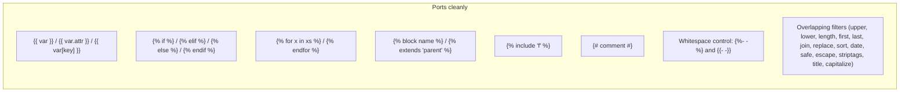

# Migrating from Jinja2 or Django

Swig is **Jinja2/Django-inspired**, not drop-in compatible with either. Marker shapes, filter syntax, inheritance, and most tag names line up — but concrete constructs do break on paste, especially `is`-tests from Jinja2 and `forloop.*` from Django. This page lists every gap we are aware of, with workarounds.

## What ports cleanly (both directions)



The markers `{{ }}`, ``, `{# #}` match all three engines. Filter chaining with `|` works the same way. Comments cannot be nested in any of them. Template inheritance is single-parent in all three.

**Surprise:** Swig **does** support Jinja2-style whitespace control (``, `{{- ... -}}`, `{#- ... -#}`) — see [Template Syntax § Whitespace control](./syntax#whitespace-control). This was not always the case historically; if a reference says otherwise, it is stale.

## From Jinja2 → Swig

### Parse-time blockers

These fail with `Unexpected tag` or `Unable to parse …` at compile time.

| Jinja2 | Swig equivalent | Notes |
| --- | --- | --- |
| `` | `` or `` | Swig has **no `is` operator** and no tests. |
| `` | `` | Same — no `is`. |
| `` | Custom filter or pre-compute in locals | Register a filter: `swig.setFilter('isIterable', fn)`. |
| `` | `` | Swig's comparator is `in` only — `not in` is not a single token. |
| `{{ a // b }}` | `{{ (a / b)\|int }}` (define `int` filter) or `{{ Math.floor(a / b) }}` | Integer division is not lexed. Math object is reachable as a global. |
| `{{ a ** b }}` | `{{ Math.pow(a, b) }}` | Power operator is not lexed. |
| `body` | `` | Swig only supports the one-liner form. |
| `` | `` then `{{ ns.macro1() }}` | Swig has no `from ... import`. |
| `...` | `` (no scoping) | Swig has no `with` tag. `set` assigns to the shared context. |
| `{{ super() }}` | `` | Swig uses a dedicated tag, not a function call. |

### Macros

Swig macros are simpler than Jinja2's.

```swig

  <input name="{{ name }}" type="{{ type }}">

```

| Jinja2 feature | Swig support |
| --- | --- |
| Positional args | Yes |
| **Default values** (``) | **No.** Macro args are bare identifiers. Handle defaults inside the body: `{{ x }}1`. |
| `**kwargs` / `varargs` | No. |
| `caller()` block passing | No. |
| Nested `` inside `` | Untested; avoid. |

### Missing filters

Swig ships **26 filters** vs. Jinja2's ~50. The following Jinja2 filters are absent — register them via [`swig.setFilter`](./extending#custom-filters) or inline with an ``:

```text
abs  attr  batch  center  default  dictsort  filesizeformat  float  forceescape
format  groupby (case mismatch — Swig has groupBy)  indent  int  items
list  map  max  min  pprint  random  round  select  selectattr  slice
string  sum  tojson  trim  truncate  urlize  wordcount  wordwrap  xmlattr
```

Common workarounds:

```swig
{# default → if/else #}
{{ x }}{# Jinja2: {{ x|default('N/A') }} #}
{# Swig — either register a 'default' filter, or: #}
{{ x }}N/A

{# tojson → json #}
{{ data|json }}         {# Swig's name #}
{{ data|tojson }}       {# Jinja2's name — does not work #}

{# truncate → register, or use substr + concat #}
{{ s.substr(0, 80) }}…  {# if s is a JS string #}
```

If an application leans heavily on Jinja2 filters, porting the filter library once (via `setFilter`) is cheaper than refactoring every template.

### Missing globals and helpers

Jinja2 gives you `range()`, `dict()`, `lipsum()`, `cycler`, `joiner`, `namespace` out of the box. Swig does not. Pass what you need through `locals`:

```js
swig.renderFile('page.html', {
  range: function (n) { var a = []; for (var i = 0; i < n; i++) a.push(i); return a; }
});
```

```swig
…
```

## From Django → Swig

### Parse-time blockers

| Django | Swig equivalent |
| --- | --- |
| `{{ x\|filter:"arg" }}` | `{{ x\|filter("arg") }}` — parens, not colon. |
| `` | Same — but note Django's `not in` works; Swig's does not (see above). |
| `{{ block.super }}` | `` |
| `...` | `` |
| `` | `{{ a }}{{ b }}{{ c }}` |
| `` | Pre-compute in controller; pass the grouped structure as a local. Swig has a `groupBy` **filter** that covers the simple case. |
| `` | Use `loop.index` and a modulo: `{{ classes[loop.index0 % classes.length] }}`. |
| `` | Pass `now` through locals, or use `{{ new Date()\|date(...) }}`. |
| `` / `` / `` / `` / `` / `` / `` | Django-only. No equivalent — either pre-compute or register a custom tag. |

### `forloop.*` → `loop.*`

Django's loop variables all live under `forloop`; Swig (like Jinja2) uses `loop`.

| Django | Swig |
| --- | --- |
| `forloop.counter` | `loop.index` |
| `forloop.counter0` | `loop.index0` |
| `forloop.revcounter` | `loop.revindex` |
| `forloop.revcounter0` | `loop.revindex0` |
| `forloop.first` | `loop.first` |
| `forloop.last` | `loop.last` |
| `forloop.parentloop` | *Not supported.* Capture into a local before entering the inner loop: `{{ outer.index }}…`. |

A project-wide find/replace of `forloop.` → `loop.` handles the common cases; `parentloop` needs case-by-case attention.

### Method calls need parens

Django resolves `x.method` by trying dict lookup, attribute access, then zero-arg method call automatically. Swig does **not** — methods must be invoked explicitly.

```swig
{# Django #}
{{ user.get_absolute_url }}

{# Swig #}
{{ user.get_absolute_url() }}
```

This is a common source of silent failures: Django's version returns the URL, Swig's version emits `function() { ... }` (or blank, because functions bypass autoescape). Audit every `.method` access during migration.

### Math in `{{ }}`

Django templates do not allow arithmetic in `{{ }}`; you use `|add:` or compute in the view. Swig allows `+ - * / %` directly:

```swig
{{ price * 0.9 }}          {# valid in Swig, not in Django #}
{{ price|add:"-10" }}      {# Django idiom #}
```

Migration direction matters: **Django → Swig** means Django idioms (`|add:`) break and need to become arithmetic or a Swig filter; **Swig → Django** means arithmetic expressions are illegal and must move into the view.

## Filter parity table

Swig ships these 26 filters. The **Jinja2** and **Django** columns show whether the same-named filter exists in each; ✱ marks a name collision where semantics differ.

| Swig | Jinja2 | Django |
| --- | --- | --- |
| `addslashes` | — | ✅ |
| `capitalize` | ✅ | ✅ |
| `date` | — | ✅ (both use PHP-style format strings — mostly compatible, but Django's set omits a few characters Swig accepts and vice-versa; spot-check format strings during migration) |
| `escape` / `e` | ✅ | ✅ |
| `first` | ✅ | ✅ |
| `groupBy` | `groupby` (camelCase vs lowercase) ✱ | — |
| `join` | ✅ | ✅ |
| `json` / `json_encode` | `tojson` (different name) | — |
| `last` | ✅ | ✅ |
| `length` | ✅ | ✅ |
| `lower` | ✅ | ✅ |
| `raw` | — | — (Swig-specific; equivalent to `safe`) |
| `replace` | ✅ | — |
| `reverse` | ✅ | — |
| `safe` | ✅ | ✅ |
| `sort` | ✅ | `dictsort` (dicts only — Django has no general-purpose sort filter) ✱ |
| `striptags` | `striptags` | `striptags` |
| `title` | ✅ | `title` |
| `uniq` | `unique` (name differs) | — |
| `upper` | ✅ | ✅ |
| `url_encode` | `urlencode` (no underscore) | `urlencode` |
| `url_decode` | — | — |

Always prefer Swig's names in Swig templates; the parser rejects unknown filter names at parse time, which makes drift obvious.

## Operators

Swig's comparator set is **wider** than either Jinja2 or Django — it accepts JavaScript strict equality and aliases for `<`, `>`, etc.

```text
==  !=  ===  !==  <  >  <=  >=  in
and  or  not  &&  ||  !
gt  gte  lt  lte   ← Swig-only word aliases for <, <=, >, >=
```

Missing from Jinja2 that Swig also omits: `is`, `is not`, `not in`.
Missing from Jinja2 that Swig **keeps**: strict equality `===`/`!==` (JS-native).

## Autoescape parity

All three engines autoescape `{{ … }}` by default. Opt-out mechanisms differ:

| Engine | Per-value opt-out | Region opt-out |
| --- | --- | --- |
| **Swig** | `{{ x\|safe }}` | `…` |
| **Jinja2** | `{{ x\|safe }}` | `…` |
| **Django** | `{{ x\|safe }}` | `…` (note: `off`, not `false`) |

Swig additionally **bypasses autoescape for function-call output** (e.g. `{{ formatDate(x) }}` is not escaped). Neither Jinja2 nor Django do this. See [Security — autoescape](./security#autoescape-is-the-only-default-xss-protection) for why, and the guardrails around it.

## Migration checklist

Use this as a per-template review pass:

1. **Search for `is ` and `is not `** — replace each with the closest `===` / `!==` / `!` equivalent, or a custom filter.
2. **Search for `not in`** — wrap as `not (x in xs)`.
3. **Search for `forloop.`** (Django only) — replace with `loop.`.
4. **Search for `block.super` / `super()`** — replace with ``.
5. **Search for `|filter:"arg"`** (Django only) — rewrite as `|filter("arg")`.
6. **Search for ``** — rewrite with `` and scope-check.
7. **Search for ``** — rewrite as `` + `ns.name`.
8. **Search for `.<method>` without parens** (Django only) — add `()` on every method call.
9. **Search for filters** — audit against the filter parity table above; register missing ones via [`setFilter`](./extending#custom-filters).
10. **Search for `//` and `**`** — rewrite using `Math.floor` / `Math.pow` or a filter.
11. **Run the full test suite** — Swig fails loudly at parse time for unknown tags/filters, so most gaps surface on first render rather than silently.

## See also

- [Template Syntax](./syntax) — the full Swig grammar.
- [Tags reference](./tags) — every built-in tag Swig ships.
- [Filters reference](./filters) — every built-in filter Swig ships.
- [Extending Swig](./extending) — registering custom tags and filters to fill migration gaps.
- [Security](./security) — autoescape model and the `__proto__` blocklist (CVE-2023-25345).
