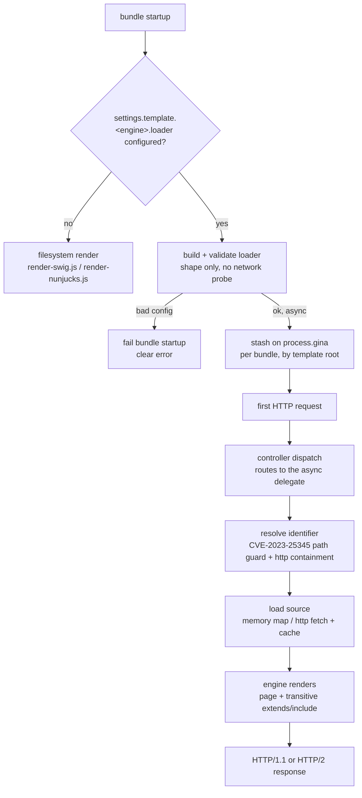

import Tabs from '@theme/Tabs';
import TabItem from '@theme/TabItem';

# Async Template Loaders

New in `0.4.6`. By default a Gina bundle renders templates from its
`templates/html` directory on disk. An **async template loader** lets a bundle
resolve templates from a custom backend instead — a remote HTTP(S) origin, a
CDN, object storage, or an in-memory map — fetched at render time. You configure
it per bundle via `settings.template.<engine>.loader`, and it works for **both**
the swig and nunjucks render paths.

Bundles that don't configure a loader render from the filesystem exactly as
before — the feature is fully opt-in, and the default path is byte-for-byte
unchanged.

## When to use

- Templates are published to a **CDN or object store** and shared across bundles or environments.
- A **headless CMS** returns template source over HTTP.
- You want a **self-contained** bundle with a small inline template set (tests, examples, a single-file demo).

If your templates live on disk next to the bundle, you don't need a loader — the
default filesystem path is simpler and faster.

## Configuration

The loader config follows the same convention as `connectors.json`: a named
built-in `type` plus type-specific flat keys. It lives under the engine you've
selected with [`render.engine`](/templating) — `template.swig.loader` for swig
(the default), `template.nunjucks.loader` for nunjucks. The shape is identical
for both engines; only the engine key differs.

Two built-ins ship in `0.4.6`: **`memory`** (inline templates, no I/O) and
**`http`** (fetch over HTTP/HTTPS).

### memory — inline templates

A flat `identifier → source` map. No network, no filesystem. The page template
**and** its transitive `` / `` chain all resolve from
the map.

<Tabs groupId="templating-engine">
<TabItem value="swig" label="Swig" default>

```json
{
  "render": { "engine": "swig" },
  "template": {
    "swig": {
      "loader": {
        "type": "memory",
        "templates": {
          "layout.html": "<!doctype html><html><head><title>{{ page.data.title }}</title></head><body></body></html>",
          "home.html": "<h1>{{ page.data.title }}</h1>"
        }
      }
    }
  }
}
```

</TabItem>
<TabItem value="nunjucks" label="Nunjucks">

```json
{
  "render": { "engine": "nunjucks" },
  "template": {
    "nunjucks": {
      "loader": {
        "type": "memory",
        "templates": {
          "layout.njk": "<!doctype html><html><head><title>{{ page.data.title }}</title></head><body></body></html>",
          "home.njk": "<h1>{{ page.data.title }}</h1>"
        }
      }
    }
  }
}
```

The nunjucks loader additionally requires nunjucks to be installed in the project
(`npm install nunjucks`) — see the [Nunjucks](/templating/nunjucks) page for the
opt-in contract.

</TabItem>
</Tabs>

### http — fetch over HTTP(S)

Fetches each template (and its transitive `extends` / `include` chain) from
`origin + basePath + <identifier>`. A **source cache** keyed by resolved URL
collapses repeated fetches.

<Tabs groupId="templating-engine">
<TabItem value="swig" label="Swig" default>

```json
{
  "render": { "engine": "swig" },
  "template": {
    "swig": {
      "loader": {
        "type": "http",
        "origin": "https://cdn.example.com",
        "basePath": "/templates",
        "ttl": 60,
        "revalidate": false
      }
    }
  }
}
```

</TabItem>
<TabItem value="nunjucks" label="Nunjucks">

```json
{
  "render": { "engine": "nunjucks" },
  "template": {
    "nunjucks": {
      "loader": {
        "type": "http",
        "origin": "https://cdn.example.com",
        "basePath": "/templates",
        "ttl": 60,
        "revalidate": false
      }
    }
  }
}
```

</TabItem>
</Tabs>

| Key | Type | Default | Description |
| --- | --- | --- | --- |
| `origin` | string | **required** | `scheme://host[:port]` of the template origin — `http` or `https`, no path. |
| `basePath` | string | `""` | Path prefix that template identifiers resolve under, root-relative. |
| `ttl` | number | `60` | Source-cache TTL in seconds (absolute from fetch). `0` caches until evicted. |
| `revalidate` | boolean | `false` | When `true`, a cache hit issues a conditional `GET` (`If-None-Match`) and serves cached source on a `304`, refreshing the TTL. |

`revalidate` is off by default so a cache hit costs no round-trip — ideal for
immutable, CDN-published templates. Turn it on for a live CMS whose origin emits
`ETag` headers and whose templates change in place.

## Dispatch flow



The engine resolves the page template and every nested `extends` / `include` /
`import` through the loader, so an entire template tree can live off-disk.

## Security

A loader sits between your bundle and a backend you may not fully control, so
Gina applies guards on every resolve:

- **Path-traversal guard (CVE-2023-25345).** Every identifier the engine resolves
  — the page, and each transitive `extends` / `include` / `import` — is checked:
  an identifier containing a `..` segment or an absolute path is **rejected
  before the loader fetches anything**. The guard runs on the whole dependency
  chain, not just the first hop.
- **HTTP origin containment.** The `http` loader additionally verifies each
  resolved URL stays under the configured `origin + basePath`. A template that
  resolves to a different origin (for example an absolute `http://elsewhere/x`)
  is rejected.
- **Host allowlist and TLS are your responsibility.** Gina fetches from whatever
  `origin` you configure and trusts the transport. Point `origin` only at hosts
  you control or trust, prefer `https://`, and treat template source from a
  remote backend as you would any remote code — a compromised origin can serve a
  template that runs in your render context. For the engine-level
  template-injection guards (the `{{ __proto__ }}` / `constructor` class), see
  the swig [security model](/templating/swig/security).

## Fail-fast on bad config

A misconfigured loader **fails bundle startup** rather than silently falling back
to the filesystem — the fallback can't serve off-disk templates, which is the
whole point of the feature. "Validate" means config **shape** only: an unknown
`type`, a missing required key, or a malformed `origin` aborts startup with a
clear message. The loader never reaches the backend at boot, so a flaky or
unreachable origin is a **render-time** concern, not a startup failure.

## Defaults and compatibility

A bundle with no `template.<engine>.loader` renders from `templates/html` on disk
exactly as before. Existing bundles are unaffected — there is no migration step
and no behaviour change unless you opt in.
