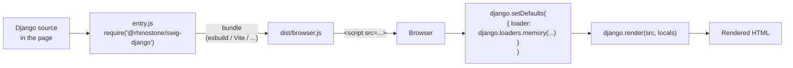

# Django in the Browser

`@rhinostone/swig-django` runs in the browser the same way `@rhinostone/swig` does — memory loader only, no `fs` access, identical autoescape and CVE-2023-25345 guard perimeter inherited from `@rhinostone/swig-core`. The package does not ship a pre-built browser bundle; consumers bundle through their own toolchain (esbuild, Vite, Webpack, Rollup).

This page covers the Django-specific bits: how to bundle, how to install the peer-dependency pair, and a minimal first-template example using Django syntax. For the shared-engine flow — AOT pre-compile + prime + render, memory-loader idiom, cache semantics, `swig run` warnings — see [Swig Browser Usage](../swig/browser). It applies verbatim because both frontends lower to the same `swig-core` backend.

## Architecture



Same flow as native swig, with two deltas:

- The entry point is `@rhinostone/swig-django` instead of `@rhinostone/swig`.
- Your bundler resolves both `@rhinostone/swig-django` and its peer `@rhinostone/swig-core`.

## Install

```bash
npm install @rhinostone/swig-django
```

`@rhinostone/swig-django`'s `peerDependencies` pin `@rhinostone/swig-core` to the **exact matching version** (no caret) — the lockstep release cadence keeps frontends and the core engine moving together. Install at the same version; mixing across releases is not supported.

```json
// package.json — example consumer (use the version you installed)
{
  "dependencies": {
    "@rhinostone/swig-core": "<same version as swig-django>",
    "@rhinostone/swig-django": "<latest>"
  }
}
```

`@rhinostone/swig-core` resolves automatically via npm's peer-dep handling on a fresh install — declaring it in `dependencies` is optional but makes the lockstep pin explicit for audit tools.

## Bundle with esbuild

Minimal recipe. Two things to wire up:

- `fs` is stubbed to an empty object (the filesystem loader at `@rhinostone/swig-core/lib/loaders/filesystem.js` guards itself when `fs.readFileSync` is missing, so an empty stub is enough to make it a no-op in the browser).
- `path` is aliased to [`path-browserify`](https://www.npmjs.com/package/path-browserify) because the shared loader normalises paths.

This mirrors the native-swig build recipe at [gina-io/swig/Makefile:61-62](https://github.com/gina-io/swig/blob/develop/Makefile#L61-L62).

```js
// entry.js
var django = require('@rhinostone/swig-django');

django.setDefaults({
  loader: django.loaders.memory({
    'greeting.django': 'Hello {{ name|upper }}!'
  })
});

window.django = django;
```

```js
// stubs/fs.js — empty stub, turns the filesystem loader into a no-op
module.exports = {};
```

```js
// build.js
require('esbuild').build({
  entryPoints: ['entry.js'],
  bundle: true,
  format: 'iife',
  outfile: 'dist/browser.js',
  alias: {
    fs: './stubs/fs.js',
    path: 'path-browserify'
  },
  minify: true,
  sourcemap: true
}).catch(function (err) { console.error(err); process.exit(1); });
```

```bash
node build.js
```

Load it with a `<script>` tag:

```html
<!doctype html>
<html>
  <body>
    <div id="out"></div>
    <script src="dist/browser.js"></script>
    <script>
      var out = window.django.render('Hello {{ name|upper }}!', {
        locals: { name: 'world' }
      });
      document.querySelector('#out').textContent = out;
      // → "Hello WORLD!"
    </script>
  </body>
</html>
```

**Other bundlers follow the same shape.** [Vite](https://vitejs.dev/) and [Rollup](https://rollupjs.org/) use `resolve.alias` (Vite) or the [`@rollup/plugin-alias`](https://www.npmjs.com/package/@rollup/plugin-alias) plugin. [Webpack](https://webpack.js.org/) uses `resolve.alias` + `resolve.fallback: { fs: false }`. The requirement is always: stub `fs`, alias `path`.

## Extends + include

For templates using `` or ``, prime the memory loader with every referenced file before rendering:

```js
django.setDefaults({
  loader: django.loaders.memory({
    'layout.django': '<!doctype html><title>{{ title }}</title>',
    'page.django':   'Hello {{ name|upper }}!'
  })
});

django.renderFile('page.django', { title: 'Hi', name: 'world' });
// → "<!doctype html><title>Hi</title>Hello WORLD!"
```

The loader contract is identical across frontends — see [Loaders](../swig/loaders).

## AOT pre-compilation

If bundle size or cold-render latency matters, pre-compile Django templates to plain JavaScript at build time, ship only the runtime (the compiled `_output += …` functions) to the browser, and skip the parser entirely. The flow is identical to native swig's — see [Swig Browser Usage → Pre-compile + prime + render](../swig/browser#pre-compile--prime--render). The compiled output is the same shape regardless of which frontend produced it, because both lower to `swig-core` IR before codegen.

## Bundle size

A minified browser bundle of `@rhinostone/swig-django` plus its transitive `@rhinostone/swig-core` dependency weighs approximately **94 KB minified** (~30 KB gzipped) via esbuild `--minify --format=iife` — measured against an entry point that imports the default Django instance, wires up a memory loader, and exposes it on `window.django`. It is a touch smaller than the Jinja2 flavor (Django has no `is`-test catalog and no macro/import/from tags).

For perf-critical paths, prefer AOT pre-compilation (previous section) — the runtime footprint drops substantially because the lexer and parser are not shipped.

## Security model

`@rhinostone/swig-django` inherits every security guarantee of `@rhinostone/swig-core`:

- **Autoescape is on by default.** HTML entities are escaped on every `{{ … }}` output unless the expression is explicitly marked `safe` (built-in filter) or produced by a user filter declaring `.safe = true`.
- **CVE-2023-25345 `_dangerousProps` guards.** `__proto__`, `constructor`, and `prototype` are rejected at parse time in every context that writes to `_ctx`: dotted access, bracket-notation with string literals, `` loop variables, `` assignments, and `` context. The variable resolver re-checks at runtime as defence in depth. The guards are frontend-agnostic — native swig, Twig, Jinja2, and Django all run them.
- **Template source is trusted.** Same model as Django itself, Python Jinja2, and Twig. Never pass user-controlled strings directly to `django.render(source, locals)`; keep locals data-only. There is no sandboxed-rendering mode — see [Non-Goals](./non-goals#wont-support-security).

See [Security — the parser is the boundary](../swig/security#the-parser-is-the-boundary) for the full story.

## Gotchas

- **Filesystem loader throws in the browser.** Always call `django.setDefaults({ loader: django.loaders.memory({}) })` at module init time — before any render.
- **Peer-dependency pinning.** `@rhinostone/swig-core` and `@rhinostone/swig-django` must be installed at the **exact same version** — they release in lockstep. Bundlers that rely on npm's `node_modules/@rhinostone/swig-core` symlink (as in a workspace dev checkout) can mask a missing `dependencies` declaration. Verify by bundling against a fresh `node_modules`.
- **Cache persistence.** The compiled-template cache lives on the Django instance — reset on page reload. Hot-reload consumers should call `django.invalidateCache()` before re-priming.
- **`swig run` is not a sandbox.** Same warning as the native frontend — the function body is `eval`'d. Never hand user-controlled strings to it.
