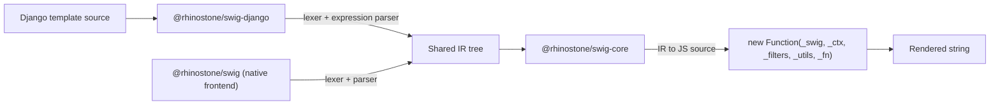

# Django Frontend

`@rhinostone/swig-django` is a **Django Template Language frontend** on top of the shared `@rhinostone/swig-core` engine. It lets you render templates written in [Django Template Language (DTL) syntax](https://docs.djangoproject.com/en/stable/ref/templates/language/) from Node.js — with the same security model, IR backend, and compilation pipeline that powers `@rhinostone/swig`, `@rhinostone/swig-twig`, and `@rhinostone/swig-jinja2`.

It releases in lockstep with `@rhinostone/swig`, `@rhinostone/swig-twig`, `@rhinostone/swig-jinja2`, and `@rhinostone/swig-core` — all five packages share the same version number on every cut.

It renders **real Django templates**: the colon-filter syntax (`{{ value|date:"Y-m-d" }}`), `True`/`False`/`None` literals, the `forloop.*` context, dotted-path variable resolution with auto-calling of callable leaves (`{{ user.get_full_name }}`), numeric index access (`{{ items.0 }}`), and the template-inheritance model are all there. The expression grammar is a **lenient superset** of DTL — it also accepts a few non-Django forms (arithmetic, parentheses) that real templates never use, which is harmless. The tag and filter catalogs are subsets: the framework-coupled tags (``, ``, ``, …) are out of scope because they need the Django framework runtime. Syntax that is not supported throws at parse time rather than silently misbehaving. See [Parity](./parity), [Migrating from Django](./migration), and [Non-Goals](./non-goals).

## Architecture



Every frontend (native swig, swig-twig, swig-jinja2, swig-django) lowers its surface syntax into the same IR shape. The backend — code generation, autoescape injection, CVE-2023-25345 `__proto__` guards, `new Function(...)` wrapping — lives in `swig-core` and is shared across all frontends. A Django template and a native swig template with equivalent semantics produce byte-identical compiled JavaScript.

Two small, opt-in-flag-gated additions to `swig-core` back the Django-specific bits, both inert for the other frontends: a configurable loop-context name + field aliases (so `for` exposes `forloop.counter` instead of `loop.index`), and a runtime variable resolver (so `{{ obj.method }}` auto-calls a callable leaf and `{{ list.0 }}` resolves a numeric index). Both are absent unless the Django parser sets the flag, which is why native/swig-twig/swig-jinja2 stay byte-identical.

## Install

```bash
npm install @rhinostone/swig-django
```

`@rhinostone/swig-core` is declared as a peer dependency with an exact version pin matching the installed `@rhinostone/swig-django`. The lockstep release cadence keeps the five packages on matching versions — npm installs the right core automatically; do not override it.

## Your first template

```js
var django = require('@rhinostone/swig-django');

var out = django.render('Hello {{ name|upper }}!', {
  locals: { name: 'World' }
});
// → "Hello WORLD!"
```

The module exports a **default singleton instance** — same pattern as `@rhinostone/swig`. `render`, `compile`, `renderFile`, `setFilter`, `setTag`, `setExtension`, and `setDefaults` are all attached to it.

A more Django-flavoured example, exercising colon-filters, the `forloop` context, and auto-called attributes:

```js
var django = require('@rhinostone/swig-django');

var out = django.render(
  '{{ forloop.counter }}. {{ u.get_label }} ({{ u.joined|date:"Y-m-d" }})\n',
  {
    locals: {
      users: [
        { get_label: function () { return 'Ada'; }, joined: new Date(2020, 0, 1) },
        { get_label: function () { return 'Linus'; }, joined: new Date(2021, 5, 15) }
      ]
    }
  }
);
// → "1. Ada (2020-01-01)\n2. Linus (2021-06-15)\n"
```

`u.get_label` is a JavaScript function, so the resolver calls it with no arguments and renders the result — the same `{{ user.get_full_name }}` idiom you write in Django.

## Isolated instances

Use `new django.Django(opts)` when you need a Django instance with its own cache, tags, filters, and extensions — for example, when rendering tenant-scoped templates with different autoescape settings or custom filter libraries.

```js
var django = require('@rhinostone/swig-django');

var admin = new django.Django({ autoescape: false });
admin.setFilter('monospace', function (input) {
  return '<code>' + input + '</code>';
});

admin.render('{{ label|monospace }}', { locals: { label: 'READ-ME' } });
// → "<code>READ-ME</code>"
```

Instances are fully isolated — filters, tags, and extensions registered on `admin` are invisible to the default singleton and to any other instance. This matches the isolation contract documented in the [swig API reference](../swig/api).

## Express integration

`@rhinostone/swig-django` ships with the same Express adapter as `@rhinostone/swig`:

```js
var express = require('express');
var django = require('@rhinostone/swig-django');
var app = express();

app.engine('django', django.__express);
app.set('view engine', 'django');
app.set('views', __dirname + '/views');

app.get('/', function (req, res) { res.render('index', { title: 'Hi' }); });
```

Templates are loaded through the filesystem loader by default. Switch to the memory loader for tests or browser usage:

```js
django.setDefaults({
  loader: django.loaders.memory({
    'index.django': 'Hello {{ title }}!'
  })
});
```

See [Loaders](../swig/loaders) for the full contract — it is identical across frontends.

## Browser usage

`@rhinostone/swig-django` runs in the browser through your own bundler (esbuild, Vite, Webpack, Rollup) — see [Django in the Browser](./browser) for the recipe and bundle-size measurements. Memory loader only, no `fs` access, autoescape + CVE-2023-25345 guards inherited from `@rhinostone/swig-core`.

## Relationship to `@rhinostone/swig`

| | `@rhinostone/swig` | `@rhinostone/swig-django` |
| --- | --- | --- |
| Syntax dialect | Native swig (Jinja2/Django-ish) | Django Template Language (lenient superset) |
| Engine backend | `@rhinostone/swig-core` | `@rhinostone/swig-core` |
| CVE-2023-25345 guards | Yes | Yes |
| Autoescape defaults | `true` (HTML) | `true` (HTML) |
| `new Function(...)` sandbox | Yes | Yes |
| Loader contract | Shared | Shared |
| Cache contract | Shared | Shared |
| `setFilter` / `setTag` / `setExtension` | Yes | Yes |
| Filter argument syntax | `name(arg)` | `name:arg` (Django colon-filters) |
| Loop context | `loop.index` | `forloop.counter` |
| Variable resolution | Dot-path | Dot-path + auto-call + numeric index |
| `is` operator | — | Identity comparison (not Jinja2-style tests) |
| Tag set | 15 built-ins | 12 built-ins (see [Parity](./parity)) |
| Filter set | 26 built-ins | 42 built-ins (see [Parity](./parity)) |

Use **native swig** if you have existing swig templates. Use **swig-django** if you have templates written against Django Template Language and want to keep them close to portable. Both share the same engine, so switching frontends is a parser-level choice — not a runtime or security-model choice.

## Where to go next

- **[Parity](./parity)** — operators, tags, filters, and the `is` operator, each grounded in the shipped source.
- **[Non-Goals](./non-goals)** — Django features that throw at parse time, need the framework runtime, or are deferred.
- **[Migrating from Django](./migration)** — behavioural differences when porting real Django templates.
- **[Django in the Browser](./browser)** — bundling recipe and bundle-size measurements.
