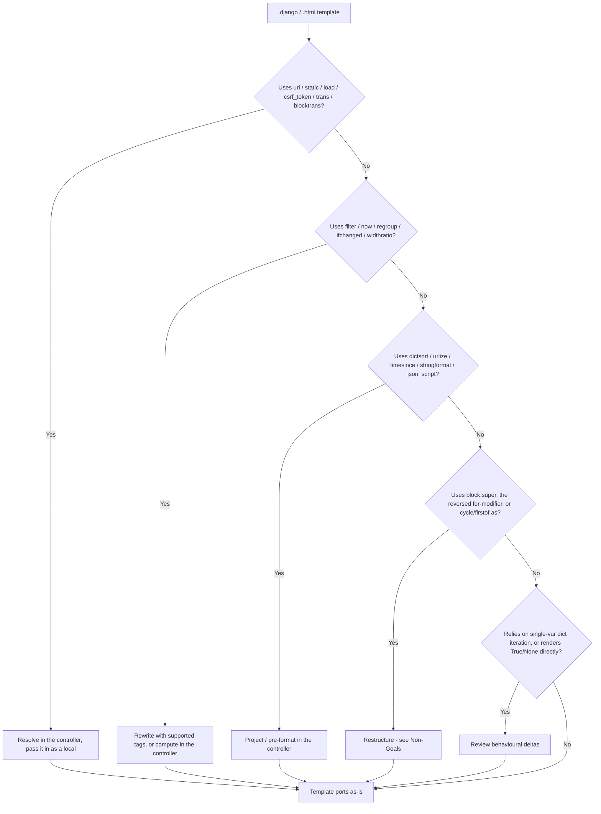

# Migrating from Django

This guide is for teams with existing [Django](https://docs.djangoproject.com/en/stable/ref/templates/language/) templates who want to render them under Node.js via `@rhinostone/swig-django`.

**Short version:** the *syntax* ports almost untouched. Colon-filters (`{{ x|date:"Y-m-d" }}`), `True`/`False`/`None`, the `forloop.*` context, dotted-path auto-calling (`{{ user.get_full_name }}` — no parens), numeric index (`{{ items.0 }}`), ``, and the `` / `` / `` inheritance model all work as written. The gaps are about **framework integration**, not syntax: tags like ``, ``, ``, and `` need the Django framework runtime, which a standalone template engine doesn't have — you resolve those in the controller and pass the result in as locals.

## Porting checklist



Walk the tree top-to-bottom for each template. The [Non-Goals](./non-goals) page has the complete list of parse-time rejections with error messages.

## The main task: framework tags move to the controller

Real Django templates lean on the framework. These tags need Django's URL resolver, app registry, staticfiles, request, or i18n catalogs — none of which a standalone engine provides. They throw `Unexpected tag "<name>"` at parse time. Resolve the value where you have the framework and pass it in as a local:

```django
{# Django #}
<a href="">{{ user.name }}</a>

<form>…</form>
<h1></h1>
```

```django
{# swig-django — resolve in the controller, render plain data #}
<a href="{{ profileUrl }}">{{ user.name }}</a>

<form>{{ csrfField }}…</form>
<h1>{{ welcomeText }}</h1>
```

```js
django.renderFile('page.django', {
  profileUrl: reverse('profile', user.id),   // your router
  logoUrl:    asset('logo.png'),             // your asset pipeline
  csrfField:  res.locals.csrfField,          // your CSRF middleware
  welcomeText: t('Welcome')                  // your i18n
});
```

If you embed swig-django in a framework (such as [Gina](/templating)), that framework typically registers these as project-level [custom tags](../swig/extending#custom-tags) or injects them as locals, so templates keep the ``-style calls. Standalone, the controller owns them. See [Non-Goals → Framework infrastructure](./non-goals#framework-infrastructure).

## What ports cleanly

Straight copy-paste — no changes needed:

- `{{ var }}`, `{{ var.attr.method }}` (callable leaves auto-call, no parens), `{{ items.0 }}` (numeric index), `{{ matrix.1.2 }}`
- Colon-filters and chains — `{{ value|date:"Y-m-d" }}`, `{{ name|truncatewords:3|upper }}`, `{{ x|default:"—" }}`
- `` / `` / `` / `` with `and` / `or` / `not` / `in` / `==` / `is None`
- `` with `forloop.counter` / `counter0` / `revcounter` / `first` / `last` / `parentloop`, and the `` fallback
- ``, ``, `` — the pseudo-methods work without parens, exactly as in Django
- `` with `` overrides (multi-level chains too)
- `` including `with key=value` context and trailing `only`
- `…` (space-separated pairs) and `` (legacy form)
- `` / ``, ``, ``, ``
- ``, ``
- The filter catalog — all 42 built-ins were cross-checked against Django 5.2 (see [Parity → Filters](./parity#filters))

## Semantic differences

### Dict iteration

Django auto-calls `.items` / `.keys` / `.values` (no parens), and so does swig-django — `` ports as-is. Two deltas:

- **Single-variable iteration yields values, not keys.** `` iterates the dict's **values** here (Django iterates keys). Use `` if you want keys.
- **A single loop variable on `.items` isn't supported** — `` throws; use two variables ``.

```django
{{ k }} = {{ v }}   {# ports as-is #}
{{ key }}             {# ports as-is #}
```

### `default` filter

`{{ missing|default:"x" }}` substitutes when the value is falsy — the same as Django. A missing variable also arrives as `""` after engine coercion, so `default` fires on it too; real falsy values like `0` are handled the same way Django handles them.

### `date` / `time` codes

Django's `date` filter uses [PHP-inspired format characters](https://docs.djangoproject.com/en/stable/ref/templates/builtins/#date), and so does swig-core's shared formatter — so the common codes map directly:

```django
{{ published|date:"Y-m-d" }}        {# 2026-06-07 — ports as-is #}
{{ published|date:"D, d M Y" }}     {# Sun, 07 Jun 2026 — ports as-is #}
```

The **Django-only** codes — `N` (AP-style month), `P` (12-hour time with "midnight"/"noon"), `f` (minutes only when nonzero), `T` / `e` / `I` (timezone), `u` (microseconds) — are **not** supported (the shared formatter is PHP-faithful, and PHP has no equivalents). With no settings system, a bare `{{ d|date }}` defaults to `'F j, Y'` and `{{ t|time }}` to `'g:i A'`. Locale-aware month/day names are not plumbed through — pre-format on the controller side if you need them.

### `{{ True }}` / `{{ False }}` / `{{ None }}` rendered directly

These lower to JavaScript values, so a bare `{{ True }}` renders `"true"` (Django: `"True"`) and `{{ None }}` renders `""` (Django: `"None"`). This rarely matters — these literals are used in conditions (``, ``), where they behave correctly. Only direct output differs.

### Deferred filters and tags

- The ``, ``, ``, ``, and `` tags are not yet implemented — rewrite with supported tags or compute in the controller. See [Non-Goals → Deferred](./non-goals#deferred).
- The `dictsort` / `dictsortreversed`, `stringformat`, `random`, `urlize` / `urlizetrunc`, `timesince` / `timeuntil`, `unordered_list`, `json_script`, `truncatechars_html` / `truncatewords_html`, `safeseq`, and `pprint` filters are deferred — project or pre-format in the controller.
- `length_is` was **removed** from Django in 5.1 — use ``.

### `{{ block.super }}`

Block override works, but rendering the parent block's content inside an override (`{{ block.super }}`) is not yet wired. Restructure so the shared content lives in the parent block and the override fully replaces it, or [open an issue](https://github.com/gina-io/swig/issues).

## Runtime model

Django renders inside CPython with the full Python runtime. swig-django compiles each template to a JavaScript function and runs it under `new Function(...)` — **the runtime is the JS runtime**, with its own coercion and iteration rules.

Practical consequences:

- **Auto-call uses JavaScript functions.** `{{ user.get_full_name }}` calls `user.get_full_name()` when it is a JS function — the same idiom as Django. The `alters_data` and `do_not_call_in_templates` opt-outs are honoured as **properties on the function** (`fn.alters_data = true`), mirroring Django's method attributes.
- **Iteration is over enumerable own properties.** `` yields `Object.keys(obj)` order — insertion order for string keys in modern engines.
- **Stringification uses `String(x)`.** Objects without a custom `toString` render `"[object Object]"` rather than Python's `repr`. `null` / `undefined` render `""` (engine coercion).
- **No Python descriptors / properties.** A Django model property exposed via `@property` becomes a plain field or a JS function in the data you pass in — shape your locals accordingly.

## Shared backend guarantees

Everything below is inherited from `@rhinostone/swig-core` and behaves identically across all frontends (native swig, swig-twig, swig-jinja2, swig-django):

- **CVE-2023-25345 guards.** `__proto__`, `constructor`, and `prototype` are rejected at parse time in variable output, dot access, bracket access (string literals), and all context-writing tags (`for`, `with`, `include`). The variable resolver also re-checks at runtime. See [Security — known advisories](../swig/security#known-advisories).
- **Autoescape injection.** The final `e` filter is appended automatically to every variable output unless the chain ends in a `.safe = true` filter.
- **Isolation.** Tags, filters, and extensions registered on one instance are invisible to others. See [swig API — isolated instances](../swig/api#swig).
- **Cache semantics.** Compiled functions are keyed by the loader-resolved filename. See [Loaders](../swig/loaders).

## When to stay on Django

If you need any of the following, Django itself is still the right tool:

- The framework tags as first-class template features — ``, ``, `` / `` with gettext catalogs, `` for custom tag libraries.
- The ``, ``, ``, `` tags, or the `dictsort` / `urlize` / `timesince` filter family, without rewriting them controller-side.
- Server-rendered forms with `` wired through Django middleware.
- A model layer where templates traverse `@property` descriptors and related managers directly.

swig-django is designed for teams rendering Django-syntax templates from Node.js — typically a migration off Python, or a mixed Python/Node stack that wants a single template dialect with the framework concerns handled in the controller.

## Reporting a porting gap

If a template that works under Django parses cleanly in swig-django but produces different output (and it isn't one of the documented behavioural differences above), that is a bug — please [open an issue on `gina-io/swig`](https://github.com/gina-io/swig/issues) with the smallest reproducer you can distil. Parse-time rejections you think should be supported are also welcome — make the case against the [Non-Goals](./non-goals) rationale.
