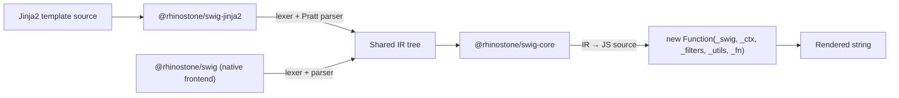

# Jinja2 Frontend

`@rhinostone/swig-jinja2` is a **Jinja2-flavored frontend** on top of the shared `@rhinostone/swig-core` engine. It lets you render templates written in [Python Jinja2 syntax](https://jinja.palletsprojects.com/en/stable/templates/) from Node.js — with the same security model, IR backend, and compilation pipeline that powers `@rhinostone/swig` and `@rhinostone/swig-twig`.

It releases in lockstep with `@rhinostone/swig`, `@rhinostone/swig-twig`, and `@rhinostone/swig-core` — all four packages share the same version number on every cut.

It is a **near-subset** of Python Jinja2: everything it accepts compiles to the same IR as the native `swig` frontend and runs under the same `new Function(...)` sandbox boundary. Syntax that it does not support (or that is explicitly out of scope) throws at parse time rather than silently misbehaving. A handful of behaviours diverge intentionally where the JavaScript runtime differs from CPython — see [Parity](./parity) and [Migrating from Python Jinja2](./migration). Features that throw are catalogued in [Non-Goals](./non-goals).

## Architecture



Every frontend (native swig, swig-twig, swig-jinja2, future Django) lowers its surface syntax into the same IR shape. The backend — code generation, autoescape injection, CVE-2023-25345 `__proto__` guards, `new Function(...)` wrapping — lives in `swig-core` and is shared across all frontends. This means a Jinja2 template and a native swig template with equivalent semantics produce byte-identical compiled JavaScript.

## Install

```bash
npm install @rhinostone/swig-jinja2
```

`@rhinostone/swig-core` is declared as a peer dependency with an exact version pin matching the installed `@rhinostone/swig-jinja2`. The lockstep release cadence keeps the four packages on matching versions — npm installs the right core automatically; do not override it.

## Your first template

```js
var jinja2 = require('@rhinostone/swig-jinja2');

var out = jinja2.render('Hello {{ name|upper }}!', {
  locals: { name: 'World' }
});
// → "Hello WORLD!"
```

The module exports a **default singleton instance** — same pattern as `@rhinostone/swig`. `render`, `compile`, `renderFile`, `setFilter`, `setTag`, `setExtension`, and `setDefaults` are all attached to it.

## Isolated instances

Use `new jinja2.Jinja2(opts)` when you need a Jinja2 instance with its own cache, tags, filters, and extensions — for example, when rendering tenant-scoped templates with different autoescape settings or custom filter libraries.

```js
var jinja2 = require('@rhinostone/swig-jinja2');

var admin = new jinja2.Jinja2({ autoescape: false });
admin.setFilter('monospace', function (input) {
  return '<code>' + input + '</code>';
});

admin.render('{{ label|monospace }}', { locals: { label: 'READ-ME' } });
// → "<code>READ-ME</code>"
```

Instances are fully isolated — filters, tags, and extensions registered on `admin` are invisible to the default singleton and to any other instance. This matches the isolation contract documented in the [swig API reference](../swig/api).

## Express integration

`@rhinostone/swig-jinja2` ships with the same Express adapter as `@rhinostone/swig`:

```js
var express = require('express');
var jinja2 = require('@rhinostone/swig-jinja2');
var app = express();

app.engine('jinja2', jinja2.__express);
app.set('view engine', 'jinja2');
app.set('views', __dirname + '/views');

app.get('/', function (req, res) { res.render('index', { title: 'Hi' }); });
```

Templates are loaded through the filesystem loader by default. Switch to the memory loader for tests or browser usage:

```js
jinja2.setDefaults({
  loader: jinja2.loaders.memory({
    'index.jinja2': 'Hello {{ title }}!'
  })
});
```

See [Loaders](../swig/loaders) for the full contract — it is identical across frontends.

## Browser usage

`@rhinostone/swig-jinja2` runs in the browser through your own bundler (esbuild, Vite, Webpack, Rollup) — see [Jinja2 in the Browser](./browser) for the recipe and bundle-size measurements. Memory loader only, no `fs` access, autoescape + CVE-2023-25345 guards inherited from `@rhinostone/swig-core`.

## Relationship to `@rhinostone/swig`

| | `@rhinostone/swig` | `@rhinostone/swig-jinja2` |
| --- | --- | --- |
| Syntax dialect | Native swig (Jinja2-ish) | Python Jinja2 (near-subset) |
| Engine backend | `@rhinostone/swig-core` | `@rhinostone/swig-core` |
| CVE-2023-25345 guards | Yes | Yes |
| Autoescape defaults | `true` (HTML) | `true` (HTML) |
| `new Function(...)` sandbox | Yes | Yes |
| Loader contract | Shared | Shared |
| Cache contract | Shared | Shared |
| `setFilter` / `setTag` / `setExtension` | Yes | Yes |
| Tag set | 15 built-ins | 13 built-ins (see [Parity](./parity)) |
| Filter set | 26 built-ins | 39 built-ins (see [Parity](./parity)) |
| Is-tests | — | 16 (`defined`, `undefined`, `none`, `even`, `odd`, `divisibleby`, `iterable`, `mapping`, `sequence`, `string`, `number`, `boolean`, `callable`, `lower`, `upper`, `sameas`) |

Use **native swig** if you have existing Jinja2-inspired templates written for swig. Use **swig-jinja2** if you have templates written against Python Jinja2 syntax and want to keep them close to portable. Both share the same engine, so switching frontends is a parser-level choice — not a runtime or security-model choice.

## Where to go next

- **[Parity](./parity)** — operators, tags, filters, and is-tests, each grounded in the shipped source.
- **[Non-Goals](./non-goals)** — Jinja2 features that throw at parse time or are deferred.
- **[Migrating from Python Jinja2](./migration)** — behavioural differences when porting real Jinja2 templates.
- **[Jinja2 in the Browser](./browser)** — bundling recipe and bundle-size measurements.
