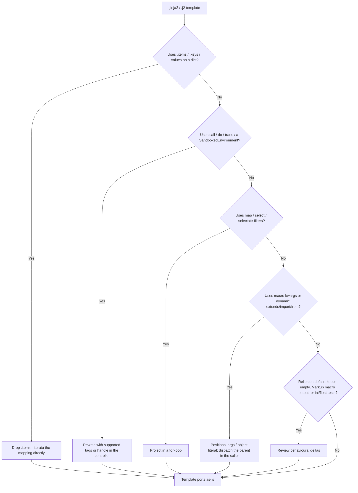

# Migrating from Python Jinja2

This guide is for teams with existing Jinja2 templates written against [Python Jinja2](https://jinja.palletsprojects.com/en/stable/templates/) who want to render them under Node.js via `@rhinostone/swig-jinja2`.

**Short version:** most Jinja2 templates port with small edits. The operator set, tag set, filter set, and inheritance model are deliberately the same shape. The gaps concentrate in three areas — dict iteration (`.items()`), filter/tag coverage, and the JavaScript runtime model — all covered below.

## Porting checklist



Walk the tree top-to-bottom for each template. The [Non-Goals](./non-goals) page has the complete list of parse-time rejections with error messages.

## The one change almost every template needs: `.items()`

Python Jinja2 iterates a dict's pairs with `.items()` (and its keys/values with `.keys()`/`.values()`):

```jinja2
{# Python Jinja2 #}
{{ k }}={{ v }}
```

In `@rhinostone/swig-jinja2` a mapping is a plain JavaScript object with **no `.items()` / `.keys()` / `.values()` methods**. Those calls return nothing, so the loop renders **empty** — a silent gap, not an error. Iterate the mapping directly instead:

```jinja2
{# @rhinostone/swig-jinja2 #}
{{ k }}={{ v }}
```

For sorted iteration, use the `dictsort` filter and index each pair:

```jinja2
{{ pair[0] }}={{ pair[1] }}
```

## What ports cleanly

Straight copy-paste — no changes needed:

- `{{ var }}`, `{{ var.path.to.field }}`, `{{ array[0] }}`, slices `{{ seq[1:3] }}`, `{{ seq[::-1] }}`
- `{{ a + b }}`, `{{ a * b }}`, `{{ a ** b }}`, `{{ a // b }}`, `{{ a ~ b }}` (string concat)
- `{{ a if cond else b }}` (inline conditional, with or without the `else` arm)
- `` / `` / `` / ``
- `` with the `loop.*` variables (`loop.index`, `loop.index0`, `loop.first`, `loop.last`, `loop.length`) and the empty-fallback ``
- `` including body form `…`
- `` with `` overrides (multi-level chains too)
- `` including `with context` / `without context` / `ignore missing`
- ``, ``, ``
- `…`, `…`, `…`, `…`
- `is defined`, `is undefined`, `is none`, `is even`, `is odd`, `is divisibleby(n)`, `is iterable`, `is mapping`, `is sequence`, `is string`, `is number`, `is boolean`, `is callable`, `is lower`, `is upper`
- The filter catalog — all 39 built-ins were cross-checked against Jinja2 3.x (see [Parity → Filters](./parity#filters))

## Semantic differences

### `replace` filter

Unlike the Twig flavor (which uses an object map), `@rhinostone/swig-jinja2`'s `replace` **matches Python Jinja2 exactly** — literal positional `replace(old, new, count)`:

```jinja2
{{ "Hello World"|replace("Hello", "Goodbye") }}  {# → Goodbye World #}
{{ "aaa"|replace("a", "b", 2) }}                  {# → bba #}
```

Ports as-is.

### `default` filter

Python Jinja2's `default` only substitutes when the value is **undefined** (pass `true` as the second argument to also catch other falsy values). In swig-jinja2, a missing variable arrives as `""` after engine coercion, so `default` also fires on the empty string:

```jinja2
{{ missing|default("x") }}   {# → x  (both engines) #}
{{ ""|default("x") }}        {# Jinja2 → "" ; swig-jinja2 → "x" #}
{{ 0|default("x") }}         {# → 0  (both: real falsy preserved) #}
{{ 0|default("x", true) }}   {# → x  (boolean arg catches any falsy) #}
```

### Macros

Positional calls and parameter defaults port unchanged. Two differences:

- **Keyword-argument calls do not port** — `{{ field(name="x") }}` throws. See [Non-Goals — macro kwargs](./non-goals#macro-kwargs) for the object-literal rewrite.
- **Macro output is autoescaped.** Python Jinja2 returns a `Markup` object from a macro (not re-escaped); swig-jinja2 autoescapes macro output like any other `{{ … }}`. If a macro intentionally emits HTML, wrap the call in `|safe`.

### Operators: `+` vs `~`

Python's `+` raises `TypeError` on mixed number/string operands; Jinja2 templates therefore use `~` for concatenation. swig-jinja2's `+` follows JavaScript and coerces (`{{ 1 + "x" }}` → `"1x"`). This means a template that *accidentally* relied on the `TypeError` won't surface the bug — prefer `~` for intentional string concatenation, exactly as in upstream Jinja2.

### Tests: `integer` / `float`

JavaScript has a single `number` type, so `is integer` and `is float` are not registered and evaluate to `false`. Replace both with `is number`. Likewise `is sequence` is `true` for arrays and strings but not mappings (a mapping is `is mapping`).

### `round`

swig-jinja2 rounds on the decimal value (`42.55|round(1)` → `42.6`); CPython rounds on the float representation (`→ 42.5`). Results can differ in the last place for values that are not exactly representable in binary floating point.

### `date`

Jinja2 core has **no** `date` filter (Flask/extensions add one). swig-jinja2 ships a `date` filter using PHP-style format tokens from `@rhinostone/swig-core` (e.g. `"Y-m-d H:i:s"`), shared with the native and Twig flavors — not Python `strftime` directives. Locale-aware names are not plumbed through; pre-format on the controller side if you need them.

### Missing filters and globals

- The `map` / `select` / `reject` / `selectattr` / `rejectattr` filter family is not implemented — project in a `` loop instead. See [Non-Goals](./non-goals#filters-not-yet-supported).
- Jinja2's global functions (`range`, `dict`, `cycler`, `joiner`, `lipsum`, `namespace`) are not exposed. For counted loops, pass an array in locals or write a literal ``.

## Runtime model

Python Jinja2 runs inside CPython with the full Python runtime reachable (dict methods, `__getitem__`, generators, etc.). swig-jinja2 compiles each template to a JavaScript function and runs it under `new Function(...)` — **the runtime is the JS runtime**, with its own coercion and iteration rules.

Practical consequences:

- **No dict methods.** `mapping.items()` / `.keys()` / `.values()` are absent (see the section above). Iterate the mapping directly, or use `dictsort` / `list`.
- **Object method calls require JS functions.** `{{ user.name() }}` works when `user.name` is a JS function — there is no Python descriptor protocol.
- **Iteration is over enumerable own properties.** `` yields `Object.keys(obj)` order — insertion order for string keys in modern engines.
- **Stringification uses `String(x)`.** Objects without a custom `toString` render as `"[object Object]"` rather than the Python `repr`. `null` / `undefined` render as `""` (engine coercion).

## Shared backend guarantees

Everything below is inherited from `@rhinostone/swig-core` and behaves identically across all frontends (native swig, swig-twig, swig-jinja2, future Django):

- **CVE-2023-25345 guards.** `__proto__`, `constructor`, and `prototype` are rejected at parse time in variable output, dot access, bracket access (string literals), and all context-writing tags (`set`, `for`, `macro`, `import`, `from`). See [Security — known advisories](../swig/security#known-advisories).
- **Autoescape injection.** The final `e` filter is appended automatically to every variable output unless the chain ends in a `.safe = true` filter.
- **Isolation.** Tags, filters, and extensions registered on one instance are invisible to others. See [swig API — isolated instances](../swig/api#swig).
- **Cache semantics.** Compiled functions are keyed by the loader-resolved filename. See [Loaders](../swig/loaders).

## When to stay on Python Jinja2

If you need any of the following, Python Jinja2 is still the right tool:

- A `SandboxedEnvironment` for partially-trusted template source.
- i18n via `` / gettext integration.
- The `map` / `select` / `selectattr` filter pipeline, or macro keyword arguments / `` blocks.
- Async rendering with async filters (`enable_async`) — swig-jinja2 has async *loaders* via `renderFileAsync`, but not async filters.
- Python-specific filters and globals (`pprint`, `xmlattr`, `range`, `namespace`, …).

swig-jinja2 is designed for teams rendering Jinja2-syntax templates from Node.js — typically as part of a migration off Python, or for a mixed Python/Node stack that wants a single template dialect.

## Reporting a porting gap

If a template that works under Python Jinja2 parses cleanly in swig-jinja2 but produces different output (and it isn't one of the documented behavioural differences above), that is a bug — please [open an issue on `gina-io/swig`](https://github.com/gina-io/swig/issues) with the smallest reproducer you can distil. Parse-time rejections you think should be supported are also welcome — make the case against the [Non-Goals](./non-goals) rationale.
