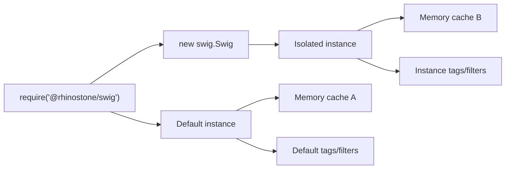

# API

Swig exposes a single module export (`require('@rhinostone/swig')`) that doubles as the **default instance**. For isolated environments (separate cache, tags, filters), construct a fresh instance with [`new swig.Swig(opts)`](#swig).



## Options

The `SwigOpts` object is accepted by `setDefaults`, the constructor, and most per-call methods. Every key is optional.

| Key | Type | Default | Purpose |
| --- | --- | --- | --- |
| `autoescape` | `boolean \| string` | `true` | Auto-apply the `e` filter to variable output. Passing a string (`'js'`, `'html'`) forwards as the escape type. |
| `varControls` | `[string, string]` | `['{{', '}}']` | Open/close for variable expressions. |
| `tagControls` | `[string, string]` | `['']` | Open/close for tag statements. |
| `cmtControls` | `[string, string]` | `['{#', '#}']` | Open/close for comments. |
| `locals` | `object` | `{}` | Default context merged under per-call locals. |
| `cache` | `'memory' \| false \| { get, set }` | `'memory'` | Compiled-template cache. |
| `loader` | `{ resolve, load }` | `swig.loaders.fs()` | Template loader — see [Loaders](./loaders). |

`varControls`, `tagControls`, and `cmtControls` must each be a 2-element array of distinct strings ≥ 2 characters. Custom caches must expose both `get` and `set`. Custom loaders must expose both `resolve` and `load`. Violations throw at `setDefaults` / constructor time.

---

## version

```js
swig.version  // → "2.4.0"
```

The current package version.

---

## setDefaults

```js
swig.setDefaults(options)
```

Merge `options` into the default instance's configuration. Useful at application startup:

```js
swig.setDefaults({
  cache: false,
  loader: swig.loaders.fs(__dirname + '/views')
});
```

Per-call options passed to [`render`](#render) / [`compile`](#compile) override defaults for that call.

---

## setDefaultTZOffset

```js
swig.setDefaultTZOffset(offset)
```

Set the timezone offset (in minutes) used by the [`date`](./filters#date) filter when no explicit offset is passed.

```js
swig.setDefaultTZOffset(-480); // PST
```

---

## Swig

```js
new swig.Swig(opts)
```

Construct an isolated Swig instance. The new instance does not share cache, tags, filters, or extensions with the default instance (or with any other custom instance).

```js
var blogSwig = new swig.Swig({
  loader: swig.loaders.fs(__dirname + '/blog-views'),
  autoescape: false
});

blogSwig.renderFile('post.html', { title: '…' });
```

Use this when you need two rendering configurations in the same process — for example, one bundle with `autoescape: true` for HTML and another with `autoescape: false` for email/text.

---

## render

```js
swig.render(source, options)
```

Compile `source` and render it in one step. Returns the output string.

| Arg | Type | Description |
| --- | --- | --- |
| `source` | string | Template source. |
| `options` | [`SwigOpts`](#options) | Per-call options. `options.locals` is the render context. `options.filename` is used for the cache key and error messages. |

```js
swig.render('Hello, {{ name }}!', { locals: { name: 'World' } });
// => "Hello, World!"
```

---

## renderFile

```js
swig.renderFile(pathName, locals, cb?)
```

Load + compile + render a file. Express-compatible when used as `app.engine('html', swig.renderFile)`.

| Arg | Type | Description |
| --- | --- | --- |
| `pathName` | string | Path handed to the active loader's `resolve`. |
| `locals` | object | Render context. |
| `cb` | `(err, output) => void` | Optional. Async mode when provided; synchronous return otherwise. |

```js
// Sync
var html = swig.renderFile('/views/page.html', { title: 'Home' });

// Async (sync-cb form against a sync or dual-mode loader)
swig.renderFile('/views/page.html', { title: 'Home' }, function (err, html) {
  if (err) throw err;
  res.send(html);
});
```

### Async-loader cb dispatch

_Available since `v2.2.0`._

When the active loader sets `loader.async === true`, the cb form of `renderFile` routes through the async-codegen path automatically — pre-walking the dependency graph through `loader.load(id, cb)`, then rendering against an in-memory wrapper. No call-site change is required; opt-in is via the loader flag.

```js
var asyncLoader = {
  async: true,                                       // ← opt-in flag
  resolve: function (to, from) { return '/' + to; },
  load:    function (id, cb)   { fetchAsync(id, cb); }
};

swig.setDefaults({ loader: asyncLoader });

swig.renderFile('page.html', { name: 'World' }, function (err, html) {
  if (err) throw err;
  res.send(html);
});
```

Dispatch is **explicit-flag only** — `load.length` is not consulted, so the built-in dual-mode `swig.loaders.fs()` and `swig.loaders.memory()` (which accept both sync and cb forms) keep their existing sync-cb path.

Template paths inside ``, ``, and `` must be string literals — dynamic paths surface as `Pre-walked map missing path: "<id>"`. See [Loaders — Static-path requirement](./loaders#static-path-requirement).

---

## renderFileAsync

```js
swig.renderFileAsync(pathName, locals, cb)
```

_Added in `v2.1.0`. **Soft-deprecated in `v2.2.0`**; will be removed in `v3.0`._

:::warning Deprecated since 2.2.0
New code should use [`renderFile(path, locals, cb)`](#renderfile) on a loader that sets `loader.async === true` — the cb-form dispatches to the same async-codegen path automatically. See [Async-loader cb dispatch](#async-loader-cb-dispatch) above.

The deprecation is JSDoc-only — no runtime warning is emitted (avoids Express log spam). Existing `renderFileAsync` calls keep working through the `v2.x` line.
:::

Load + compile + render a file via an async-only loader (S3, Redis, CDN, `fetch`-backed). Pre-walks the template's `` / `` / `` chain asynchronously through the loader's `load(id, cb)` arm, then runs the existing sync render pipeline against an in-memory wrapper. Use this when your loader has no sync `load()` arm — `renderFile` (sync-cb form against a dual-mode loader) cannot resolve nested templates against an async-only loader. See [Async loaders](./loaders#async-loaders) for the full mechanism.

| Arg | Type | Description |
| --- | --- | --- |
| `pathName` | string | Path handed to the active loader's `resolve`. |
| `locals` | object | Render context. Pass the callback as the second argument to omit. |
| `cb` | `(err, output) => void` | Node-style callback. **Required** — `renderFileAsync` returns `undefined`. |

```js
swig.setDefaults({ loader: myAsyncLoader });

swig.renderFileAsync('page.html', { name: 'World' }, function (err, html) {
  if (err) throw err;
  res.send(html);
});
```

Template paths inside ``, ``, and `` must be string literals — dynamic paths surface as `Pre-walked map missing path: "<id>"`. See [Loaders — Static-path requirement](./loaders#static-path-requirement).

---

## compile

```js
swig.compile(source, options)
```

Compile `source` and return a renderable closure bound to the locals context.

```js
var tpl = swig.compile('Hello, {{ name }}!');
tpl({ name: 'World' });  // => "Hello, World!"
```

Use this when you need to compile once and render many times with different contexts.

---

## compileFile

```js
swig.compileFile(pathName, options, cb?)
```

Load + compile a file. Returns a renderable closure. Async when a callback is provided.

```js
var tpl = swig.compileFile('/views/page.html');
tpl({ title: 'Home' });
```

Compiled templates are cached by the loader's resolved filename when `options.cache !== false`.

### Async codegen

_Available since `v2.2.0`._

Pass `{ codegenMode: 'async' }` to opt the compiled body into the async-codegen path. The returned compiled function yields a `Promise<{output, exports}>` instead of a string — async filters, dynamic `` paths, and async-only loaders are all reachable from this shape. Use against a loader that sets `loader.async === true`.

```js
swig.compileFile('page.html', { codegenMode: 'async' }, function (err, fn) {
  if (err) throw err;
  fn({ name: 'World' }).then(function (result) {
    console.log(result.output);   // → rendered string
    // result.exports holds any top-level macros exposed by the template
  });
});
```

The `exports` field is what async `` / `` consult when binding macros across templates.

---

## compileFileAsync

```js
swig.compileFileAsync(pathName, options, cb)
```

_Added in `v2.1.0`. **Soft-deprecated in `v2.2.0`**; will be removed in `v3.0`._

:::warning Deprecated since 2.2.0
New code should use [`compileFile(path, { codegenMode: 'async' }, cb)`](#async-codegen) on a loader that sets `loader.async === true`. The returned compiled function yields a `Promise<{output, exports}>` instead of a string — the call site changes, so migration is not a drop-in rename. See [Async codegen](#async-codegen) above for the new shape.

The deprecation is JSDoc-only — no runtime warning is emitted. Existing `compileFileAsync` calls keep working through the `v2.x` line.
:::

Load + compile a file via an async-only loader. Returns (via `cb`) a renderable closure that captures the pre-walked memory map, so subsequent calls render synchronously without re-running the dependency walk. Use this when your loader has no sync `load()` arm — `compileFile` (sync-cb form against a dual-mode loader) cannot resolve nested templates against an async-only loader. See [Async loaders](./loaders#async-loaders) for the full mechanism.

| Arg | Type | Description |
| --- | --- | --- |
| `pathName` | string | Path handed to the active loader's `resolve`. |
| `options` | object | Compilation options. Pass the callback as the second argument to omit. |
| `cb` | `(err, fn) => void` | Node-style callback receiving the compiled function. |

```js
swig.compileFileAsync('greeting.html', {}, function (err, fn) {
  if (err) throw err;
  console.log(fn({ name: 'world' }));  // → "Hello, world!"
  console.log(fn({ name: 'mars' }));   // → "Hello, mars!"
});
```

Subsequent runtime ``s inside the compiled template resolve against the captured memory map — no further loader access.

---

## precompile

```js
swig.precompile(source, options)
// → { tpl: Function, tokens: Array }
```

Compile `source` and return the raw compiled `Function` + token tree without binding it to a locals context. Use this when you need to serialize compiled output (e.g. for the [CLI](./cli) `compile` command or the [browser build](./browser)).

`tpl.toString()` prints the generated JavaScript — a useful debugging hook.

---

## parseFile

```js
swig.parseFile(pathName, options)
```

Load and parse a file into the intermediate token tree. Mostly used internally by `compileFile`. Useful when inspecting the parse tree for custom tooling.

---

## run

```js
swig.run(tpl, locals, filepath?)
```

Run a pre-compiled `tpl` function against a locals context. Used by the [`swig run`](./cli) CLI command to execute a cached template without re-compiling.

```js
var src = fs.readFileSync('./cache/index.js', 'utf8');
var tpl = eval(src); // tpl is the exported function
var out = swig.run(tpl, { title: 'Home' }, '/views/index.html');
```

Do not pass untrusted input to `run` — see [Security](./security#swig-run-is-not-a-sandbox).

---

## setFilter

```js
swig.setFilter(name, fn)
```

Register a filter function on this instance.

```js
swig.setFilter('shout', function (input) {
  return String(input).toUpperCase() + '!';
});
```

Mark a filter `fn.safe = true` to bypass autoescape. See [Extending Swig — Custom Filters](./extending#custom-filters).

---

## setTag

```js
swig.setTag(name, parse, compile, ends, blockLevel)
```

Register a custom tag.

| Arg | Type | Description |
| --- | --- | --- |
| `name` | string | Tag name. |
| `parse` | `function` | Parse-time handler. |
| `compile` | `function` | Compile-time handler, returns a JS source fragment. |
| `ends` | boolean | `true` if the tag needs ``. |
| `blockLevel` | boolean | `true` if the tag is valid outside `` when extending. |

Details in [Extending Swig — Custom Tags](./extending#custom-tags).

---

## setExtension

```js
swig.setExtension(name, object)
```

Expose an arbitrary object at `_ext[name]` inside compiled template code. Extensions let custom tags call into external runtime code.

```js
swig.setExtension('translate', function (key) { return i18n.t(key); });

// In a custom tag's compile():
//   return '_output += _ext.translate(' + args[0] + ');';
```

---

## invalidateCache

```js
swig.invalidateCache()
```

Clear the in-memory cache. Only meaningful when `cache === 'memory'`. Call after changing a loader's `basepath`, reloading templates from disk in a watcher, or swapping in a new `loader`.

---

## loaders

`swig.loaders` exposes the built-in loader factories:

- `swig.loaders.fs([basepath, encoding])`
- `swig.loaders.memory(mapping[, basepath])`

See the full [Loaders reference](./loaders).

---

## Compiled template shape

Every compiled template is a function of the form:

```js
function (_swig, _ctx, _filters, _utils, _fn) {
  var _ext = _swig.extensions,
      _output = "";
  // ... generated code ...
  return _output;
}
```

When writing a custom tag's `compile`, emit JS that reads from `_ctx`, writes to `_output`, and may call `_filters[name](…)`, `_utils.*`, `_ext[name]`, or the fallback no-op `_fn`. Do not rename these local names — every tag depends on them.

## Caching

- **`cache: 'memory'`** — templates are stored by the loader's resolved filename. The default.
- **`cache: false`** — templates are recompiled on every call. Useful during development; **do not** ship to production.
- **Custom cache** — pass an object with `get(key)` and `set(key, value)`. Keys are resolved filenames from the loader.

```js
swig.setDefaults({
  cache: {
    get: function (key) { return redis.getSync(key); },
    set: function (key, val) { redis.set(key, val); }
  }
});
```

The cache key is the loader's `resolve()` output. If your loader's `resolve` is not deterministic, circular-extends detection fails — see [Loaders — Determinism](./loaders#determinism).
