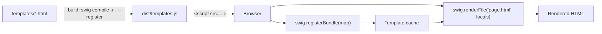

# Browser Usage

Most of Swig works in the browser the same way it does in Node. The only exception: **Swig cannot read files by path from the browser** — the filesystem loader throws if `fs` is unavailable.

If a template uses `` at render time, Swig must find that template in its cache or through a loader. The idiomatic flow: pre-compile every template at build time into a self-registering bundle, load it, render.



## Pre-compile + register + render

1. **Compile each template into a JS file.** `--method-name` assigns a name to the exported function.

   ```bash
   swig compile partials/nav.html --method-name=nav > nav.js
   ```

2. **Load Swig and the compiled template in the page.**

   ```html
   <script src="swig.min.js"></script>
   <script src="nav.js"></script>
   ```

3. **Register the template.** [`swig.register(path, fn)`](./api#register) — added in v2.8.0 — stores it under the loader-resolved path, wrapped in the call shape `include` expects. Registered partials may use variables, filters, and extensions freely.

   ```html
   <script>
     swig.register('partials/nav.html', nav);
   </script>
   ```

4. **Render a template that includes it.**

   ```html
   <script>
     var out = swig.render('', {
       filename: '/page.html',
       locals: { user: 'Jane' }
     });
     document.querySelector('#foo').innerHTML = out;
   </script>
   ```

## Self-registering AOT bundle — many templates at once

For projects with more than a handful of templates, compile the whole directory into one bundle. With `--register` (added in v2.8.0) the bundle registers itself against the global `swig` as soon as the script loads — no wiring code:

```bash
cd ./views && swig compile -r . --register -o ../dist/templates.js
```

```html
<script src="swig.min.js"></script>
<script src="templates.js"></script>
<script>
  document.body.innerHTML = swig.renderFile('page.html', { title: 'Hi' });
</script>
```

Run the compile from the template root (`-r .`) so the include paths baked into each compiled template line up with the bundle's registration keys. The bundle still exports the plain `{ "<rel-path>": fn }` map, so Node-side or bundler consumers can register it explicitly:

```js
swig.registerBundle(require('./dist/templates.js'));
```

See [CLI — AOT bundle](./cli#aot-bundle--compile-a-directory) for the full flag reference and caveats.

## Strict CSP — the runtime-only build

The full bundle compiles templates through `new Function`, so pages using it need `'unsafe-eval'` in their `script-src` Content-Security-Policy — even when every template was pre-compiled, because a cache miss falls through to the compiler.

`dist/swig.runtime.min.js` (added in v2.8.0, ~21 KB minified vs ~81 KB for the full bundle) removes the compiler entirely: no parser ships, the artifact contains zero `new Function`, and any compiling call (`render` on a source string, `compile`, `precompile`) throws a clear "runtime-only build has no compiler" error instead. Pair it with a `--register` bundle for a fully CSP-clean pipeline:

```html
<script src="swig.runtime.min.js"></script>
<script src="templates.js"></script>
<script>
  document.body.innerHTML = swig.renderFile('page.html', { title: 'Hi' });
</script>
```

The runtime build exposes `register`, `registerBundle`, `run`, `compileFile`, `renderFile`, `setFilter`, `setExtension`, `setDefaults`, `setDefaultTZOffset`, and `invalidateCache`, plus a `Swig` constructor for isolated instances. Its default loader is a memory loader rooted at `/`, so include lookups flatten to root-relative keys — exactly the keys a `--register` bundle carries. It is also reachable in Node as `require('@rhinostone/swig/runtime')`.

## Extends in the browser

`` resolves at **compile time**: an AOT-compiled template arrives with its parent chain already flattened into the compiled function, so extending between your build-time templates needs nothing at runtime.

To compile *new* source in the browser that extends a parent, the parent's **source** must be reachable through a loader — use the memory loader below. A registered pre-compiled function cannot serve as an extends parent (the compiled function carries no parse tree for the compiler to merge blocks into).

## Memory loader instead of pre-compilation

If you prefer to ship raw template source to the browser, wire up a memory loader:

```js
swig.setDefaults({ loader: swig.loaders.memory({
  'layout.html': '<!doctype html>…',
  'page.html':   '…'
})});

document.body.innerHTML = swig.renderFile('page.html', { title: 'Hi' });
```

This path compiles in the browser, so it needs the full bundle (and `'unsafe-eval'` under a strict CSP). See [Loaders — memory](./loaders#swigloadersmemory) for the full contract.

## Getting the bundled build

The repository produces four files under `dist/`:

| File | Purpose |
| --- | --- |
| `dist/swig.js` | Full development bundle — parser + runtime, full source for debugging. |
| `dist/swig.min.js` | Full production bundle. Terser-minified + source-mapped. |
| `dist/swig.runtime.js` | Runtime-only development bundle — executes registered pre-compiled templates; no parser, no `new Function`. Added in v2.8.0. |
| `dist/swig.runtime.min.js` | Runtime-only production bundle (~21 KB minified). Safe under a strict CSP without `'unsafe-eval'`. Added in v2.8.0. |

Build locally:

```bash
make build
```

Consuming via a bundler (Webpack, Rollup, esbuild, Vite) — `require('@rhinostone/swig')` should just work; the `main` entry resolves to `lib/swig.js`, and the filesystem loader guards itself for browser targets. The runtime-only module is `require('@rhinostone/swig/runtime')`.

## Gotchas

- **The filesystem loader throws in the browser.** With the full bundle, set a custom loader (memory, or rely on registered templates) before the first render. The runtime-only build already defaults to a memory loader rooted at `/`.
- **Prefer `register` over priming the cache by hand.** Earlier versions of this page recommended `swig.run(tpl, {}, path)` or writing `swig.cache[key]` directly. As of v2.8.0 `run`'s priming stores the same wrapper under the same resolved key that [`register`](./api#register) uses, so it works — but it still renders the template once as a side effect just to register it. Writing `swig.cache[key]` yourself remains wrong: it stores the raw compiled function rather than the call shape `include` lookups use, so an included partial that touches variables or filters crashes, and an extends parent primed that way renders nothing. Use [`register`](./api#register) / [`registerBundle`](./api#registerbundle).
- **Name include targets from the bundle root.** The runtime build's default loader is rooted at `/`, and a basepath ignores the including template's own directory — so a partial nested at `partials/nav.html` must still refer to its own targets from the root (``), not as siblings (``). A path that climbs out of the root (`../shared/foot.html`) is rejected with a clear error rather than silently resolving to a different template.
- **A registered template cannot be an `` parent.** Registration stores an executable function, not a parse tree, so a layout has to remain reachable through the loader for a child compiled in the browser to extend it. Ahead-of-time compilation already inlines `extends` and `import`, so a template compiled by the CLI carries its layout with it and this only affects source compiled at runtime.
- **`swig run` is not a sandbox.** The function body is evaluated. Do not hand it untrusted input — see [Security](./security#swig-run-is-not-a-sandbox).
- **Cache persistence.** The in-memory cache lives on the Swig instance. Reloading the page resets it. If you hot-reload a template bundle, call [`swig.invalidateCache()`](./api#invalidatecache) before re-registering to avoid stale entries.
