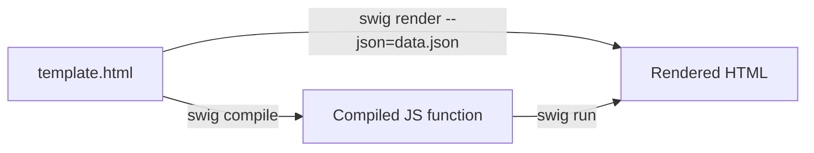

# CLI

The `swig` CLI compiles, renders, and runs templates from the command line. It is installed as a global binary when you `npm install --global @rhinostone/swig` (or `npm link` from the repo).

## Installation

```bash
npm install --global @rhinostone/swig
```

Verify:

```bash
swig --version
# => 1.6.0
```

## Subcommands

```bash
swig compile [file…] [options]         # Compile to a JS function, write to stdout or --output
swig compile --recursive <dir> [opts]  # Compile every template under <dir> into a single AOT bundle module
swig render  [file…] [options]         # Compile + render with a locals context
swig run     [file…] [options]         # Execute a pre-compiled template file
```



## Options

| Flag | Alias | Default | Purpose |
| --- | --- | --- | --- |
| `--version` | `-v` | — | Print the package version. |
| `--output <dir>` | `-o` | `stdout` | Output directory or file. |
| `--help` | `-h` | — | Show the help screen. |
| `--json <file>` | `-j` | — | Locals context as a JSON file. |
| `--context <file>` | `-c` | — | Locals context as a CommonJS module. Only used when `--json` is absent. |
| `--minify` | `-m` | — | Minify compiled output with `terser`. |
| `--recursive <dir>` | `-r` | — | Compile every template under `<dir>` into a single CommonJS bundle. Added in v1.6.0. Conflicts with positional file arguments, `--method-name`, `--wrap-start`, `--wrap-end`. |
| `--ext <list>` | — | — | Comma-separated file extensions to include when using `--recursive` (e.g. `.html,.swig`). Added in v1.6.0. Defaults to no filter. |
| `--filters <file>` | — | — | CommonJS module of custom filters. Each export becomes a filter. |
| `--tags <file>` | — | — | CommonJS module of custom tags. Each export must have `parse`, `compile`, optional `ends`, `block`. |
| `--options <file>` | — | — | CommonJS module of options — passed to `swig.setDefaults`. |
| `--wrap-start <str>` | — | `"var tpl = "` | Prefix for `compile` output. |
| `--wrap-end <str>` | — | `";"` | Suffix for `compile` output. |
| `--method-name <name>` | — | `"tpl"` | Shorthand for `--wrap-start="var <name> = "`. Cannot combine with `--wrap-start`. |

## Examples

Render a single file to stdout:

```bash
swig render ./index.html --json=./data.json
```

Compile and cache a template, minified:

```bash
swig compile ./index.html -m > ./cache/index.js
```

Run a previously compiled template:

```bash
swig run ./cache/index.js
```

Render with a CommonJS context (useful when the context depends on runtime code):

```bash
swig render ./index.html --context=./locals.js
```

Make the compiled output an AMD module:

```bash
swig compile ./index.html \
  --wrap-start="define(function () { return " \
  --wrap-end="; });"
```

Compile with a custom filter and tag set:

```bash
swig compile ./page.html \
  --filters=./my-filters.js \
  --tags=./my-tags.js \
  --options=./swig-options.js
```

## Pre-compiling for the browser

The CLI's primary browser use-case is compiling templates at build time so the browser loads only the compiled JS — see [Browser Usage](./browser) for the full workflow.

```bash
swig compile myfile.html --method-name=myfile > myfile.js
```

## AOT bundle — compile a directory

For projects with more than a handful of templates, `--recursive` walks a directory and emits one CommonJS module of `{ "<rel-path>": fn, ... }`. Added in v1.6.0.

```bash
swig compile --recursive ./views --ext=.html,.swig -o ./dist/templates.js
```

The emitted bundle looks like:

```js
module.exports = {
  "index.html": function (_swig, _ctx, _filters, _utils, _fn) { /* … */ },
  "partials/header.html": function (_swig, _ctx, _filters, _utils, _fn) { /* … */ }
  // …
};
```

Prime Swig's cache from the bundle at startup so `extends` / `include` / `import` resolve against the compiled functions:

```js
var swig = require('@rhinostone/swig');
var templates = require('./dist/templates.js');

Object.keys(templates).forEach(function (key) {
  swig.cache[key] = templates[key];
});
```

:::note
`--recursive` is incompatible with positional file arguments, `--method-name`, `--wrap-start`, and `--wrap-end` — the CLI exits with an error if any of those are combined with `-r`.
:::

:::caution
`extends` / `include` / `import` still resolve at render time through the consumer's loader. The AOT bundle compiles each template in isolation — it does not inline parent templates or includes. Your loader must return a resolved key that matches the bundle's map (typically the relative path you passed to `--recursive`).
:::

## Security notes

- `swig run` evaluates the contents of the template file via `eval`. **Never pass untrusted input to `swig run`.** See [Security](./security#swig-run-is-not-a-sandbox).
- `--context`, `--filters`, `--tags`, and `--options` all `require()` the file you point them at — running them executes the module. The CLI is a developer tool; all inputs are assumed to come from the local user.

## Exit codes

| Code | Meaning |
| --- | --- |
| `0` | Success. |
| non-zero | Parse error, missing file, or unknown option. |
