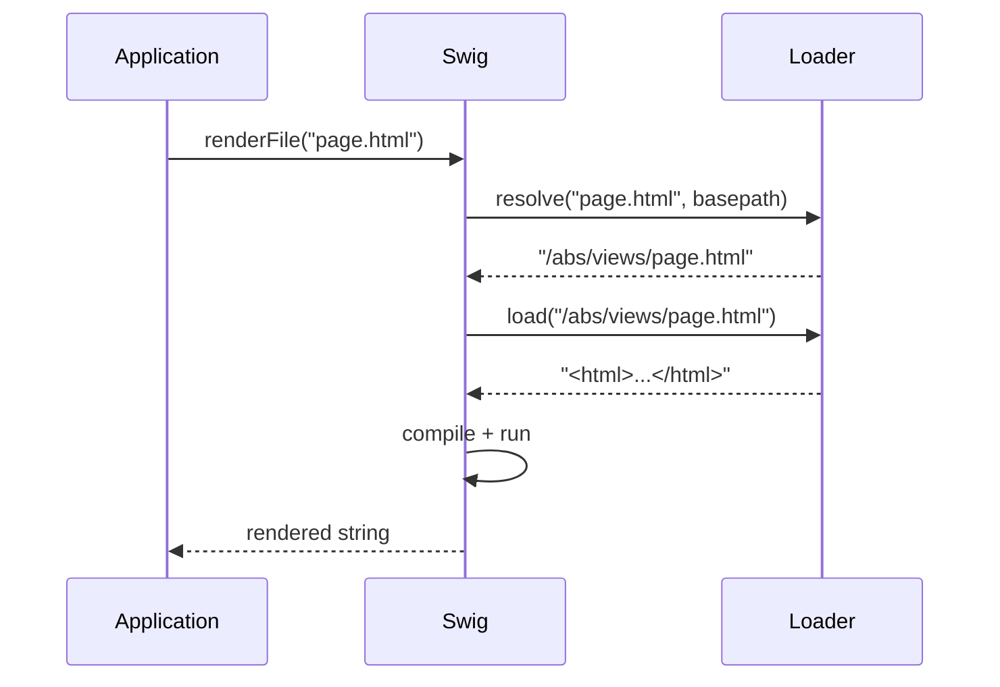

# Template Loaders

A loader bridges a template identifier (a filename, a URL, a Memcached key, …) to its actual source string. Swig calls into the loader in two places:



Every loader must expose **both**:

```js
{
  resolve: function (to, from)   { /* → absolute identifier string */ },
  load:    function (id, cb?)    { /* → source (sync) or cb(err, src) (async) */ }
}
```

Passing a loader object without both methods throws at `setDefaults` / constructor time.

---

## swig.loaders.fs

```js
swig.loaders.fs(basepath, encoding)
```

Filesystem loader. Wraps `fs.readFile` (or `fs.readFileSync` in sync mode).

| Arg | Type | Default | Description |
| --- | --- | --- | --- |
| `basepath` | string | — | Root directory. When set, every `resolve(to, from)` uses `basepath` instead of `path.dirname(from)`. |
| `encoding` | string | `'utf8'` | File encoding. |

```js
// Default — resolves relative to the including template
swig.setDefaults({ loader: swig.loaders.fs() });

// Fixed root
swig.setDefaults({ loader: swig.loaders.fs(__dirname + '/views') });
```

The filesystem loader is unavailable in the browser build — it throws on load if `fs` is missing.

---

## swig.loaders.memory

```js
swig.loaders.memory(mapping, basepath)
```

In-memory loader. Serves templates from a pre-built `{ name: source }` map.

| Arg | Type | Default | Description |
| --- | --- | --- | --- |
| `mapping` | object | — | Template name → source string. |
| `basepath` | string | `'/'` | Used by `resolve` when no `from` is passed. |

```js
swig.setDefaults({ loader: swig.loaders.memory({
  layout: '<html><body></body></html>',
  page:   'Hi'
})});

swig.renderFile('page');
```

Lookups also try the name without a leading `/` — `resolve` returns a path that the memory loader then strips. `/layout` and `layout` both work.

---

## Custom loaders

```js
function myLoader(endpoint, opts) {
  return {
    resolve: function (to, from) {
      // Return a stable, comparable string. Used as cache key AND
      // circular-extends guard — must be a pure function of its args.
      return /* absolute identifier */;
    },
    load: function (id, cb) {
      if (cb) {
        fetchAsync(id, function (err, src) { cb(err, src); });
        return;
      }
      return fetchSync(id);
    }
  };
}

swig.setDefaults({ loader: myLoader('https://…') });
```

### Sync vs async loaders

Swig's core compile pipeline is synchronous. `render`, `compile`, and `precompile` invoke `loader.load(id)` without a callback and expect a string return. `renderFile` / `compileFile` accept a caller-side callback, but they still resolve nested ``, ``, and `` through the sync `load(id)` path during compilation — so they cannot be satisfied by an async-only loader (S3, Redis, CDN, `fetch`-backed) either.

For async-only loaders, use the [`renderFileAsync`](./api#renderfileasync) and [`compileFileAsync`](./api#compilefileasync) entry points added in `2.1.0` — see [Async loaders](#async-loaders) below.

### Determinism

The circular-extends guard compares resolved filenames against a set:

```js
// From getParents() in lib/swig.js
if (parentFiles.indexOf(parentFile) !== -1) {
  throw new Error('Illegal circular extends of "' + parentFile + '".');
}
```

`resolve(to, from)` must return the same string on every call for the same arguments. Timestamp-suffixes, case rewrites, or stateful rewrites break the guard — templates either infinite-loop or "flicker" false positives depending on cache mode.

### Cache keys

Compiled templates are cached under the string returned by `resolve`. Two implications:

- Calls to `resolve` that return the same string share the same compiled function. This is what makes `` cheap.
- Changing a loader's `basepath` does not invalidate existing cache entries. Call [`swig.invalidateCache()`](./api#invalidatecache) immediately after swapping in a new loader.

### Browser loaders

The filesystem loader is unavailable in the browser build. Pre-compile your templates with the [CLI](./cli) or ship a memory loader:

```js
swig.setDefaults({ loader: swig.loaders.memory(precompiledMap) });
```

See [Browser Usage](./browser) for the full workflow.

---

## Async loaders

When your templates live behind an asynchronous source — S3, Redis, a CDN, an HTTP endpoint — neither `renderFile` / `compileFile` (with a callback) nor the core sync `render` / `compile` will cover the case. ``, ``, and `` inside a template fall through to the sync `load(id)` path during compilation, and an async-only loader has no sync arm to return from.

Added in `2.1.0`, [`renderFileAsync(path, locals, cb)`](./api#renderfileasync) and [`compileFileAsync(path, options, cb)`](./api#compilefileasync) close that gap. They pre-walk the template's dependency graph asynchronously through the user loader's `load(id, cb)` arm, populate an in-memory map keyed by resolved path, then run the existing sync pipeline against a memory wrapper for the duration of the call.

### Static-path requirement

The pre-walker text-scans each loaded template for static ``, ``, and `` targets (plus `` in `@rhinostone/swig-twig`). **String literals only** — dynamic paths surface at render time as:

```text
Error: Pre-walked map missing path: "/some/template"
```

Use a string-literal parent (or an `` chain that selects one of N literal parents) when targeting an async-only loader. Full async-parse support for dynamic paths is tracked separately.

### Example — fetch-backed loader

```js
var swig = require('@rhinostone/swig');

function fetchBackedLoader(endpoint) {
  return {
    resolve: function (to, from) {
      if (to.charAt(0) === '/') { return to; }
      return '/' + to;
    },
    load: function (id, cb) {
      fetch(endpoint + id)
        .then(function (res) { return res.text(); })
        .then(function (src) { cb(null, src); })
        .catch(cb);
    }
  };
}

var instance = new swig.Swig({
  loader: fetchBackedLoader('https://cdn.example.com/views')
});

instance.renderFileAsync('page.html', { name: 'World' }, function (err, html) {
  if (err) { return console.error(err); }
  console.log(html);
});
```

`compileFileAsync` returns a renderable closure that captures the pre-walked map, so subsequent calls render synchronously without a fresh network round-trip:

```js
instance.compileFileAsync('greeting.html', {}, function (err, fn) {
  if (err) { return console.error(err); }
  fn({ name: 'world' });  // → "Hello, world!"
  fn({ name: 'mars' });   // → "Hello, mars!"
});
```

### Caveat — don't reassign `loader` mid-flight

The async entry points isolate themselves by transactionally swapping `instance.options.loader` to a memory wrapper for the duration of each sync render, then restoring the original. Safe under JS event-loop semantics because the sync render never yields, so concurrent `renderFileAsync` calls don't interleave their render phases.

Do **not** reassign `instance.options.loader` from outside while an async render is pending — the value at the time the async call started is what will be restored when the call completes, overwriting any intervening assignment.

### Twig flavor

`@rhinostone/swig-twig` exposes the same `renderFileAsync(path, locals, cb)` and `compileFileAsync(path, options, cb)` on both the default singleton and any `new twig.Twig({…})` instance. The Twig pre-walker additionally scans `` — the keyword Twig uses to import individual macros — so macro libraries imported via `from` are pre-resolved alongside `extends` / `include` / `import` targets.

---

## Testing a loader

Two quick checks catch most regressions:

1. **`resolve` is pure** — `expect(loader.resolve(a, b)).to.eql(loader.resolve(a, b))`.
2. **Missing-template path** — `load` should throw (sync) or `cb(err)` (async) with a descriptive message. "Unable to find template X" is the idiomatic wording.

The built-in suites (`tests/loaders.test.js` in the repo) cover both loaders and serve as reference implementations.
