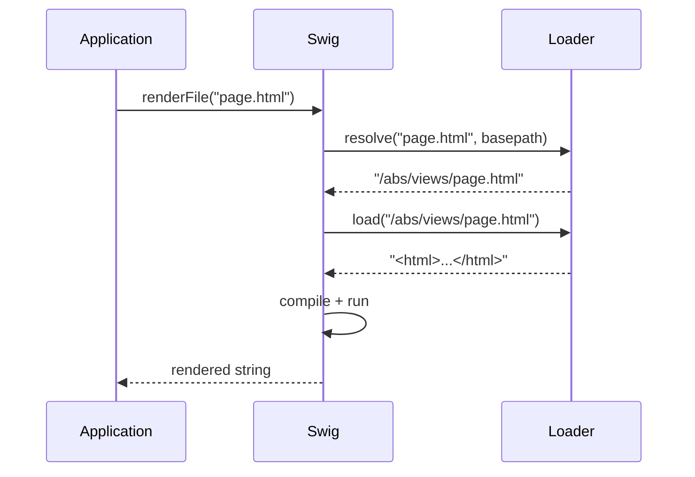

# Template Loaders

A loader bridges a template identifier (a filename, a URL, a Memcached key, …) to its actual source string. Swig calls into the loader in two places:



Every loader must expose **both**:

```js
{
  resolve: function (to, from)   { /* → absolute identifier string */ },
  load:    function (id, cb?)    { /* → source (sync) or cb(err, src) (async) */ }
}
```

Passing a loader object without both methods throws at `setDefaults` / constructor time.

---

## swig.loaders.fs

```js
swig.loaders.fs(basepath, encoding)
```

Filesystem loader. Wraps `fs.readFile` (or `fs.readFileSync` in sync mode).

| Arg | Type | Default | Description |
| --- | --- | --- | --- |
| `basepath` | string | — | Root directory. When set, every `resolve(to, from)` uses `basepath` instead of `path.dirname(from)`. |
| `encoding` | string | `'utf8'` | File encoding. |

```js
// Default — resolves relative to the including template
swig.setDefaults({ loader: swig.loaders.fs() });

// Fixed root
swig.setDefaults({ loader: swig.loaders.fs(__dirname + '/views') });
```

The filesystem loader is unavailable in the browser build — it throws on load if `fs` is missing.

---

## swig.loaders.memory

```js
swig.loaders.memory(mapping, basepath)
```

In-memory loader. Serves templates from a pre-built `{ name: source }` map.

| Arg | Type | Default | Description |
| --- | --- | --- | --- |
| `mapping` | object | — | Template name → source string. |
| `basepath` | string | `'/'` | Used by `resolve` when no `from` is passed. |

```js
swig.setDefaults({ loader: swig.loaders.memory({
  layout: '<html><body></body></html>',
  page:   'Hi'
})});

swig.renderFile('page');
```

Lookups also try the name without a leading `/` — `resolve` returns a path that the memory loader then strips. `/layout` and `layout` both work.

---

## Custom loaders

```js
function myLoader(endpoint, opts) {
  return {
    resolve: function (to, from) {
      // Return a stable, comparable string. Used as cache key AND
      // circular-extends guard — must be a pure function of its args.
      return /* absolute identifier */;
    },
    load: function (id, cb) {
      if (cb) {
        fetchAsync(id, function (err, src) { cb(err, src); });
        return;
      }
      return fetchSync(id);
    }
  };
}

swig.setDefaults({ loader: myLoader('https://…') });
```

### Sync vs async loaders

Swig's core compile pipeline is synchronous. `render`, `compile`, and `precompile` invoke `loader.load(id)` without a callback and expect a string return. The cb form of `renderFile` / `compileFile` accepts a caller-side callback, but against a dual-mode or sync loader it still resolves nested ``, ``, and `` through the sync `load(id)` path during compilation — so a loader whose `load` arm cannot return synchronously needs a different entry point.

For async-only loaders (S3, Redis, CDN, `fetch`-backed), set `loader.async === true` on the loader object and use the cb form of [`renderFile`](./api#renderfile) or [`compileFile`](./api#compilefile) — the dispatch routes through the async-codegen path automatically, pre-walking the dependency graph through the loader's `load(id, cb)` arm before rendering. Available since `v2.2.0`; see [Async loaders](#async-loaders) below.

The `v2.1.0` entry points [`renderFileAsync`](./api#renderfileasync) and [`compileFileAsync`](./api#compilefileasync) remain available for users still on `2.1.0` but are soft-deprecated in `2.2.0` in favor of the unified dispatch. New code should target the `renderFile` / `compileFile` cb path.

### Determinism

The circular-extends guard compares resolved filenames against a set:

```js
// From getParents() in lib/swig.js
if (parentFiles.indexOf(parentFile) !== -1) {
  throw new Error('Illegal circular extends of "' + parentFile + '".');
}
```

`resolve(to, from)` must return the same string on every call for the same arguments. Timestamp-suffixes, case rewrites, or stateful rewrites break the guard — templates either infinite-loop or "flicker" false positives depending on cache mode.

### Cache keys

Compiled templates are cached under the string returned by `resolve`. Two implications:

- Calls to `resolve` that return the same string share the same compiled function. This is what makes `` cheap.
- Changing a loader's `basepath` does not invalidate existing cache entries. Call [`swig.invalidateCache()`](./api#invalidatecache) immediately after swapping in a new loader.

### Browser loaders

The filesystem loader is unavailable in the browser build. Pre-compile your templates with the [CLI](./cli) or ship a memory loader:

```js
swig.setDefaults({ loader: swig.loaders.memory(precompiledMap) });
```

See [Browser Usage](./browser) for the full workflow.

---

## Async loaders

When your templates live behind an asynchronous source — S3, Redis, a CDN, an HTTP endpoint — the sync arm of `load` is unreachable. Without it, neither the core sync `render` / `compile` nor the sync-cb form of `renderFile` / `compileFile` against a dual-mode loader can resolve nested ``, ``, or `` during compilation.

Available since `v2.2.0`, the cb form of [`renderFile(path, locals, cb)`](./api#renderfile) and [`compileFile(path, { codegenMode: 'async' }, cb)`](./api#async-codegen) closes the gap. Set `loader.async === true` on the loader object and the dispatch automatically routes through the async-codegen path: the compiled body is an `AsyncFunction`, and each nested template (the `extends` parent, an `include`, an `import` / `from` source) is resolved **at render time** through the user loader's `load(id, cb)` arm via `_swig.getTemplate(path)`, awaiting each as it is reached.

Dispatch is **explicit-flag only** — `load.length` is not consulted. The built-in dual-mode loaders (`swig.loaders.fs()` and `swig.loaders.memory()`) keep their existing sync-cb path. Opt-in is per-loader via the `async: true` flag.

### Dynamic paths

Because each nested template is resolved at render time, the cb dispatch handles **dynamic** `` and `` paths — the path expression is evaluated against the locals and the template fetched on demand. `` / `` still require string-literal paths (a dynamic path throws at parse time — see each flavor's Non-Goals). The legacy pre-walker entry-points (below) are static-only for all of these tags.

### Example — fetch-backed loader

The forward-looking shape — `renderFile` cb dispatch (available since `v2.2.0`):

```js
var swig = require('@rhinostone/swig');

function fetchBackedLoader(endpoint) {
  return {
    async: true,                                     // ← opt-in flag
    resolve: function (to, from) {
      if (to.charAt(0) === '/') { return to; }
      return '/' + to;
    },
    load: function (id, cb) {
      fetch(endpoint + id)
        .then(function (res) { return res.text(); })
        .then(function (src) { cb(null, src); })
        .catch(cb);
    }
  };
}

var instance = new swig.Swig({
  loader: fetchBackedLoader('https://cdn.example.com/views')
});

instance.renderFile('page.html', { name: 'World' }, function (err, html) {
  if (err) { return console.error(err); }
  console.log(html);
});
```

`compileFile` with `{ codegenMode: 'async' }` returns a renderable closure whose call yields a `Promise<{output, exports}>` — compile once, render many times without a fresh network round-trip:

```js
instance.compileFile('greeting.html', { codegenMode: 'async' }, function (err, fn) {
  if (err) { return console.error(err); }
  fn({ name: 'world' }).then(function (r) { console.log(r.output); });
  fn({ name: 'mars'  }).then(function (r) { console.log(r.output); });
});
```

The compiled function's return shape (`Promise<{output, exports}>`) differs from the sync-cb form's compiled function (returns a string synchronously). Migrating from `compileFileAsync` requires updating each call site to await the promise and read `.output`.

### Caveat — don't reassign `loader` mid-flight

The async dispatch isolates itself by transactionally swapping `instance.options.loader` to a memory wrapper for the duration of each sync render, then restoring the original. Safe under JS event-loop semantics because the sync render never yields, so concurrent calls don't interleave their render phases.

Do **not** reassign `instance.options.loader` from outside while an async render is pending — the value at the time the async call started is what will be restored when the call completes, overwriting any intervening assignment. (Same caveat applies whether you're on the `v2.2.0` dispatch path or the legacy `v2.1.0` entry-points below.)

### Twig flavor

`@rhinostone/swig-twig` exposes the same `renderFile` cb dispatch + `compileFile { codegenMode: 'async' }` shapes on both the default singleton and any `new twig.Twig({…})` instance, including Twig's `` — the keyword Twig uses to import individual macros — resolved at render time alongside `extends` / `include` / `import` like the other flavors.

### Legacy `v2.1.0` entry-points

For users still on `@rhinostone/swig@2.1.0`, the `renderFileAsync(path, locals, cb)` / `compileFileAsync(path, options, cb)` methods cover the same async-loader case via a different mechanism — a static **pre-walker** that text-scans each template for string-literal `` / `` / `` targets (plus `` in `@rhinostone/swig-twig`), builds an in-memory map, then runs the sync pipeline against it. Dynamic paths are **not** supported on this legacy path — they surface as `Error: Pre-walked map missing path: "<id>"`. Both methods are **soft-deprecated in `v2.2.0`** (JSDoc-only — no runtime warning) and will be removed in `v3.0`; new code should target the `renderFile` / `compileFile` cb path described above.

Same loader from the example, called via the legacy entry-point:

```js
instance.renderFileAsync('page.html', { name: 'World' }, function (err, html) {
  if (err) { return console.error(err); }
  console.log(html);
});
```

See the API reference for the full per-method documentation: [`renderFileAsync`](./api#renderfileasync), [`compileFileAsync`](./api#compilefileasync).

---

## Testing a loader

Two quick checks catch most regressions:

1. **`resolve` is pure** — `expect(loader.resolve(a, b)).to.eql(loader.resolve(a, b))`.
2. **Missing-template path** — `load` should throw (sync) or `cb(err)` (async) with a descriptive message. "Unable to find template X" is the idiomatic wording.

The built-in suites (`tests/loaders.test.js` in the repo) cover both loaders and serve as reference implementations.
