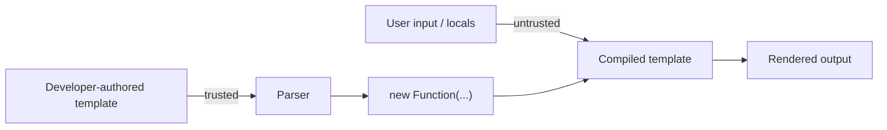

# Security

Swig compiles template source into executable JavaScript via `new Function(...)`. The attack surface is small but high-impact — the parser is the sandbox boundary, and any weakness in it is remote code execution.

This fork (`@rhinostone/swig`) exists partly so security fixes can land without waiting on upstream (which is abandoned).

## Security model

Swig treats **template source as trusted code** and **template context (locals) as untrusted data**. This is the same model as Django templates, Jinja2, Twig, and most server-side template engines.

### Consequences

- **Server-side template injection (SSTI) is game over.** If an attacker can inject arbitrary template source, they can call global functions (e.g. `{{ Function("return process")() }}`). This is not a vulnerability in Swig — it is a vulnerability in the application that allows user input into template source.
- **The `_dangerousProps` blocklist is defense-in-depth** against context-mediated prototype pollution. It prevents accidental abuse through `_ctx.__proto__` / `_ctx.constructor` paths, not targeted attacks by an author who already controls the source.
- **`new Function(...)` is the compilation mechanism, not a sandbox.** Compiled templates run with full access to JavaScript globals (`Function`, `Object`, `Array`, `Date`, `JSON`, …). Restricting those would break legitimate templates.

## Known advisories

### CVE-2021-44906 — `minimist` prototype pollution (transitive)

**Affected:** `swig@1.4.2` and earlier.

**Root cause:** `swig` depended on `optimist ~0.6`, which pinned `minimist ~0.0.1` — any `minimist < 1.2.6` is vulnerable to prototype pollution via `--__proto__.key value` argv. Reachable through `bin/swig.js`.

**Fixed in:** `@rhinostone/swig@1.4.5` — `optimist` was replaced with `yargs@3`, which has no `minimist` dependency. The vulnerable transitive edge no longer exists.

### CVE-2023-25345 — directory traversal / arbitrary file read {#cve-2023-25345}

**Affected:** `@rhinostone/swig` through `2.7.0` — and the shared `@rhinostone/swig-core` loader, so every flavor (Twig, Jinja2, Django). Inherited from upstream `swig ≤ 1.4.2`. CWE-22, CVSS 7.5 (`CVSS:3.1/AV:N/AC:L/PR:N/UI:N/S:U/C:H/I:N/A:N`).

**Root cause:** the filesystem loader's `resolve(to, from)` joined the requested path to the root without confining the result to it. An `` / `` / `` path that traversed upward (`../../../etc/passwd`) escaped the configured `basepath` and read an arbitrary file into the render. The genuinely dangerous form needs only untrusted **data**, not untrusted template source — `` where `userVar` comes from `locals`.

**Fixed in `2.7.1`:** with a `basepath` set, `resolve()` now rejects any path that resolves outside the root (a `path.sep`-anchored prefix check, so a `/views-secret` sibling cannot bypass `/views`). **`2.7.2`** then resolved the `basepath` to an absolute path before the check, so a *relative* basepath works — `2.7.1` wrongly rejected every in-root path when `basepath` was relative. Templates that intentionally read outside the root opt out with the third loader argument, [`swig.loaders.fs(basepath, encoding, allowOutsideRoot)`](./loaders#swigloadersfs). **Upgrade to `≥ 2.7.2`.** No-`basepath` mode is unconfined — the secure posture is to set a `basepath`.

## Prototype-chain hardening (`__proto__` / `constructor` / `prototype`) {#prototype-chain-hardening}

Independently of the CVE above, Swig blocks template expressions from reaching the prototype chain through `_ctx` access. *(Earlier releases of this fork tracked this hardening under the CVE-2023-25345 label; that was a mislabel — the authoritative CVE-2023-25345 is the file-read traversal documented above. The guards below are real defense-in-depth, not that CVE.)*

**Root cause it addresses:** template source that reaches the prototype chain through `_ctx` access (`__proto__`, `constructor`, `prototype`) can escape into the surrounding JavaScript runtime. The canonical exploit is `{{ constructor.constructor("return process")() }}` — the lexer emits a single VAR token, the parser generates `_ctx.constructor.constructor` (which is `Function`), and the template then calls it with arbitrary code.

**Added in two phases:**

| Phase | Version | Coverage |
| --- | --- | --- |
| Phase 1 | `1.4.4` | Dot-notation and direct-name access in `parseVar` + DOTKEY handler + `set` tag. |
| Phase 2 | `1.5.0` | Bracket-notation in variable output and `set`; reserved names blocked in `for` loop variables, `macro` names, and `import` aliases. |

### What the guards protect against

| Vector | Guard | Severity if unpatched |
| --- | --- | --- |
| `{{ __proto__ }}` / `{{ constructor }}` | `parseVar` `_dangerousProps` check | High — RCE via `constructor.constructor(...)` |
| `{{ foo.__proto__ }}` | DOTKEY `_dangerousProps` check | Medium — info leak, potential RCE via chaining |
| `{{ foo["__proto__"] }}` | STRING-in-BRACKETOPEN check | Medium — info leak |
| `` | `set.js` VAR handler | High — prototype pollution of `_ctx` |
| `` | `set.js` STRING handler | High — prototype pollution of `_ctx.foo` |
| `` | `for.js` VAR handler | High — per-iteration pollution of `_ctx` |
| `` | `macro.js` FUNCTION handler | Medium — overwrites `_ctx.__proto__` with a function |
| `` | `import.js` VAR handler | Medium — overwrites `_ctx.__proto__` with a namespace |

### What the guards do NOT protect against

| Vector | Why not | Risk |
| --- | --- | --- |
| `{{ foo[varname] }}` where `varname` resolves to `"__proto__"` at runtime | Would require a runtime wrapper and add overhead to every bracket access. | Low — info leak only, not RCE. |
| `{{ foo["__pr" + "oto__"] }}` | Result only known at runtime. | Low — same as above. |
| `{{ Function("return process")() }}` | Template source is trusted; globals are available by design. | N/A — SSTI is game over for any template engine. |
| `{{ eval("code") }}` | Same as above. | N/A — by design. |
| Prototype pollution via a locals object with an own `__proto__` property | `for…in` + `hasOwnProperty` iterates own properties; JSON-parsed objects can carry `__proto__` as own property. | Low — only affects that template's `_ctx`; does not pollute `Object.prototype`. |

## General hardening guidelines

### The parser is the boundary

Everything that reaches `new Function(body)` becomes trusted JavaScript. Two rules for anyone touching the emitted source:

- **String tokens are JSON-escaped** into `_output += "…";`. Do not weaken this escaping. The escape chain is `.replace(/\\/g, '\\\\').replace(/\n|\r/g, '\\n').replace(/"/g, '\\"')`.
- **Identifiers from user input must never reach emitted source verbatim.** Confine them to `_ctx.<ident>` lookups (`<ident>` is already a lexer-validated VAR token) or `JSON.stringify` them.

### Tags that write to `_ctx.*` must validate identifiers

Any tag whose `compile` emits `_ctx.<name> = …` must check `<name>` against `_dangerousProps` in its `parse` handler. Built-ins that do this:

- `set` — checks VAR, DOTKEY, and STRING (in bracket position).
- `for` — checks VAR tokens (loop variable + key).
- `macro` — checks FUNCTION / FUNCTIONEMPTY tokens (macro name).
- `import` — checks VAR tokens (alias name).

New tags that assign to `_ctx.*` **must include the same guard**. Copy the pattern from [`for.js`](https://github.com/gina-io/swig/blob/develop/lib/tags/for.js) (simplest example).

### Tags that swallow tokens bypass `parseVar`

When a tag calls `parser.on(types.VAR, fn)` and the callback returns falsy, the default `parseVar` handler never runs — any check inside `parseVar` is invisible to that tag. Tags that do this: `set`, `for`, `import`, `macro`. Each has its own copy of the `_dangerousProps` check. If you add a new guard in `parseVar`, audit every tag that intercepts tokens — they need their own copy.

### `swig run` is not a sandbox

[`swig run`](./cli) literally calls `eval(str)` on the generated template source. Never pass untrusted template input to `swig run`. It is a developer tool for round-tripping pre-compiled templates, not a rendering primitive.

### Autoescape is the only default XSS protection

With `autoescape: true` (the default), every `{{ … }}` is piped through the `e` filter automatically. A filter **wrongly** marked `.safe = true` bypasses this — double-check any new `.safe` annotation.

Shipping `.safe`: `safe`, `raw`, `escape` / `e`, `json` / `json_encode`, `url_encode`, `url_decode`.

`autoescape: false` disables escaping globally. Any consumer setting this is asserting they control template source entirely.

### `cache: 'memory'` is not a trust boundary

The in-memory cache is keyed by the loader's resolved filename. Templates compiled for one user's context can be served to another user if the cache key collides — this is a feature (cross-request template reuse) but it means:

- Do not include per-request secrets in the loader's `resolve()` output.
- Do not bake per-user data into `precompile` output — keep per-request data in the `locals` context, which is re-bound on every render.

## `eval` / `new Function` inventory

Full dynamic-code-execution surface:

| Location | Usage | Risk |
| --- | --- | --- |
| `lib/swig.js` | `new Function('_swig','_ctx','_filters','_utils','_fn', body)` | By design. `body` is built by the parser from the parsed token tree. |
| `bin/swig.js` (`swig run`) | `eval(str)` | Developer tool. `str` is the pre-compiled template file. |
| `bin/swig.js` (`swig run`) | `eval(argv['method-name'])` | Evaluates the method name from `--method-name`. If an attacker controls CLI args, they already have shell access. |

No other `eval` or `new Function` usage exists in the codebase.

## Reporting

Security issues for `@rhinostone/swig` go to the [gina-io/swig issue tracker](https://github.com/gina-io/swig/issues) — private disclosure first if the bug is live. Upstream (`paularmstrong/swig`) is unmaintained and should not be treated as a reporting channel.

