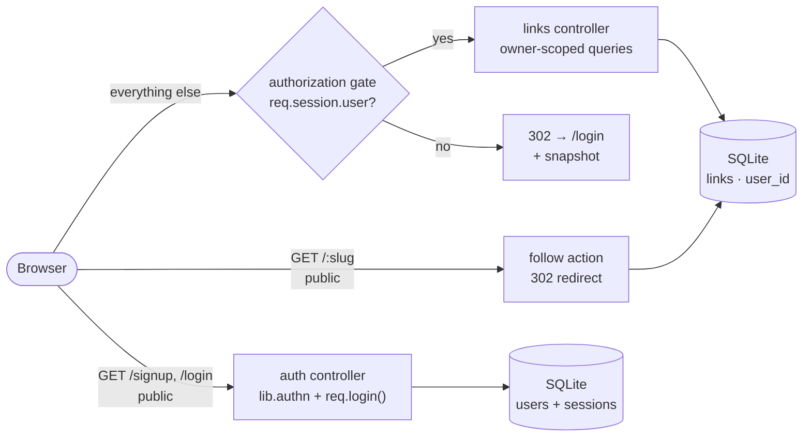
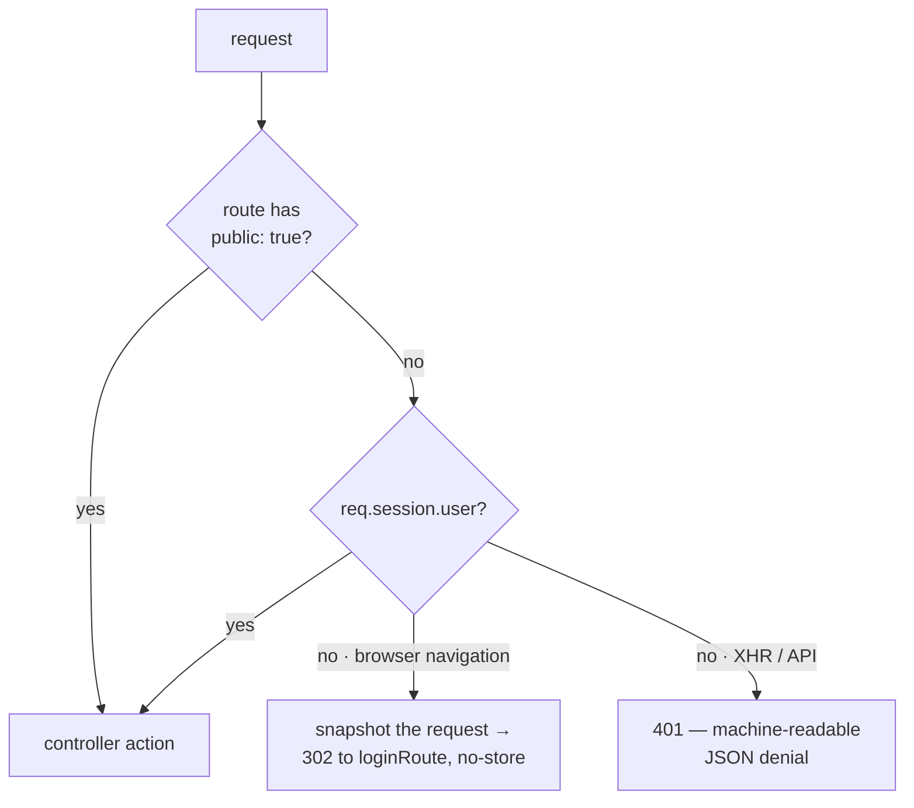

# Going to Production

The [Link Shortener](/tutorials/link-shortener) works — but it trusts everyone. Anyone can create links, anyone can read anyone's stats, everything travels over cleartext HTTP, and the logs are colored text no log collector can parse. In this tutorial you'll take that same project production-grade: user accounts, per-user data isolation, deny-by-default authorization, HTTPS with HTTP/2, structured JSON logs, and a container deployment that shuts down gracefully.

**What you'll learn:**
- Hash and verify passwords with `lib.authn` (scrypt, PHC strings, password policy)
- Brake credential stuffing with account lockout — and why it must survive dev-mode hot-reload
- Bind a session with `req.login()` — and carry the deep-link snapshot across its rotation
- Invert a bundle's authorization posture with `auth.requireAuthByDefault` and `param.public`
- Isolate each user's rows with an ordinary bound query argument
- Serve HTTP/2 over TLS with `gina protocol:set` and a local certificate
- Emit one JSON log line per event with `GINA_LOG_FORMAT=json`
- Ship the bundle as a container with `gina-init` + `gina-container`

**Time:** ~60 minutes · **Node.js:** 22.5+ · **Gina:** 0.6.0+

:::info Download the finished project
<svg xmlns="http://www.w3.org/2000/svg" width="16" height="16" viewBox="0 0 24 24" fill="none" stroke="var(--ifm-link-color)" strokeWidth="2" strokeLinecap="round" strokeLinejoin="round" style={{verticalAlign: '-3px', marginRight: '4px'}}><path d="M21 15v4a2 2 0 0 1-2 2H5a2 2 0 0 1-2-2v-4"/><polyline points="7 10 12 15 17 10"/><line x1="12" y1="15" x2="12" y2="3"/></svg> [**going-to-production.zip**](/downloads/tutorials/going-to-production.zip) — extract and run:

```bash
cd shortener
```

```bash
gina project:add @shortener
```

```bash
gina bundle:add api @shortener --import
```

```bash
npm install
```

```bash
node scripts/migrate.js
```

The project ships with HTTPS + HTTP/2 already enabled, so create a local certificate before the first start (step 7 explains what this does):

```bash
mkdir -p ~/.gina/certificates/scopes/local/localhost && cd ~/.gina/certificates/scopes/local/localhost && openssl req -x509 -newkey rsa:2048 -nodes -sha256 -subj "/CN=localhost" -keyout private.key -out certificate.crt && cp certificate.crt ca_bundle.crt && cd -
```

```bash
gina bundle:start api @shortener
```
:::

:::note Where you must start from
This tutorial **continues the Link Shortener project**. Either complete that tutorial first, or download its finished source ([link-shortener.zip](/downloads/tutorials/link-shortener.zip)) and set it up per its *Download the finished project* steps. There is no separate checkpoint repository — the intermediate tutorial's zip **is** the checkpoint.
:::

---

## What you'll build



The public surface shrinks to three things: the signup and login pages, and the short-link redirect itself — a short link must work for everyone. Every other route is gated by default: an unauthenticated browser navigation is bounced to `/login` (with a snapshot of where it was heading), and an unauthenticated API call gets a machine-readable `401`. Behind the gate, every query is scoped to the signed-in user.

---

## 1. Where you're starting from

The finished Link Shortener has one bundle (`api`), one entity (`link`), four routes, and two pages. This tutorial adds:

| Area | What's added |
|---|---|
| Data | a `users` table, and a `user_id` column on `links` |
| Sessions | `express-session` + the framework's hardened Session plugin, SQLite-backed |
| Auth | signup / login / logout with `lib.authn` — hashing, policy, lockout |
| Authorization | `auth.requireAuthByDefault` — deny by default, `public: true` exemptions |
| Transport | HTTPS + HTTP/2 via `gina protocol:set` |
| Logs | one JSON line per event, with a per-request `requestId` |
| Deployment | a Dockerfile on `gina-init` + `gina-container`, and a K8s excerpt |

All commands below run from the project root (`shortener/`).

---

## 2. Users own their links

Per-user isolation in a SQL store is not magic — it is a column and a `WHERE` clause. Every link gains an owner, and every query behind the gate binds the signed-in user's id as an ordinary parameter.

### The `user` entity

```bash
mkdir -p src/api/models/shortener/entities src/api/models/shortener/sql/user
```

```js title="src/api/models/shortener/entities/user.js"
/**
 * User entity.
 * SQL methods are loaded automatically from models/shortener/sql/user/.
 */
function UserEntity() {
    var self = this;
}

module.exports = UserEntity;
```

**`setup.sql`** — the accounts table. The password column stores a complete PHC string (`$scrypt$ln=17,r=8,p=1$…`), so the hash parameters travel with each record and can be raised later without a flag day:

```sql title="src/api/models/shortener/sql/user/setup.sql"
CREATE TABLE IF NOT EXISTS users (
    id            INTEGER PRIMARY KEY AUTOINCREMENT,
    email         TEXT    NOT NULL UNIQUE,
    password_hash TEXT    NOT NULL,
    created       TEXT    NOT NULL
)
```

**`insert.sql`**, **`findByEmail.sql`**, **`updatePasswordHash.sql`**:

```sql title="src/api/models/shortener/sql/user/insert.sql"
/*
 * @param {string} ?
 * @param {string} ?
 * @param {string} ?
 */
INSERT INTO users (email, password_hash, created) VALUES (?, ?, ?)
```

```sql title="src/api/models/shortener/sql/user/findByEmail.sql"
/*
 * @param  {string} ?
 * @return {object}
 */
SELECT id, email, password_hash AS passwordHash, created FROM users WHERE email = ?
```

```sql title="src/api/models/shortener/sql/user/updatePasswordHash.sql"
/*
 * @param {string} ?
 * @param {number} ?
 */
UPDATE users SET password_hash = ? WHERE id = ?
```

### The `link` entity learns about owners

Update **`setup.sql`** so a fresh install creates the column, and **`insert.sql`** to record the owner:

```sql title="src/api/models/shortener/sql/link/setup.sql"
CREATE TABLE IF NOT EXISTS links (
    id      INTEGER PRIMARY KEY AUTOINCREMENT,
    slug    TEXT    NOT NULL UNIQUE,
    url     TEXT    NOT NULL,
    hits    INTEGER NOT NULL DEFAULT 0,
    created TEXT    NOT NULL,
    user_id INTEGER
)
```

```sql title="src/api/models/shortener/sql/link/insert.sql"
/*
 * @param {string} ?
 * @param {string} ?
 * @param {string} ?
 * @param {number} ?
 */
INSERT INTO links (slug, url, created, user_id) VALUES (?, ?, ?, ?)
```

Two new owner-scoped queries. `@return {array}` makes Gina call `stmt.all()` — all rows:

```sql title="src/api/models/shortener/sql/link/listByUser.sql"
/*
 * @param  {number} ?
 * @return {array}
 */
SELECT id, slug, url, hits, created FROM links WHERE user_id = ? ORDER BY id DESC
```

```sql title="src/api/models/shortener/sql/link/findBySlugForUser.sql"
/*
 * @param  {string} ?
 * @param  {number} ?
 * @return {object}
 */
SELECT id, slug, url, hits, created FROM links WHERE slug = ? AND user_id = ?
```

`findBySlug.sql` and `incrementHits.sql` stay exactly as they were — the public redirect must keep working for links whoever owns them.

:::note `_scope` is deployment isolation, not user isolation
Gina injects a `_scope` property on every entity, resolved from `NODE_SCOPE` — that is the `local` / `staging` / `production` **deployment** axis, and the `$scope` placeholder it feeds is substituted when the query files are *loaded*, once per process. It structurally cannot carry a per-request user id. Per-user isolation is always what you see above: a bound argument. See [Models & entities](/guides/models) for the full scope story per connector.
:::

### The migration grows an upgrade path

`CREATE TABLE IF NOT EXISTS` will not alter an existing table — a database created by the intermediate tutorial has no `user_id` column. The migration now applies both schemas, then adds the column when it is missing:

```js title="scripts/migrate.js"
/**
 * One-off schema migration — run before starting the bundle.
 *
 * Applies both setup.sql files (links + users), then upgrades a database
 * created by the Link Shortener tutorial: the links table gains a user_id
 * column so every short link can belong to an account. Safe to re-run —
 * the statements are CREATE TABLE IF NOT EXISTS and the ALTER only runs
 * when the column is missing.
 *
 * Usage:
 *   node scripts/migrate.js                  # default database location
 *   node scripts/migrate.js /path/to/db.sqlite
 */
var fs           = require('fs');
var os           = require('os');
var path         = require('path');
var DatabaseSync = require('node:sqlite').DatabaseSync;

// Matches the connector's default: <gina home>/<database>.sqlite
var DEFAULT_DB  = path.join(os.homedir(), '.gina', 'shortener.sqlite');
var SQL_DIR     = path.join(__dirname, '..', 'src', 'api', 'models', 'shortener', 'sql');
var LINK_SCHEMA = path.join(SQL_DIR, 'link', 'setup.sql');
var USER_SCHEMA = path.join(SQL_DIR, 'user', 'setup.sql');

var dbFile = process.argv[2] || DEFAULT_DB;
var db     = new DatabaseSync(dbFile);

db.exec(fs.readFileSync(LINK_SCHEMA, 'utf8'));
db.exec(fs.readFileSync(USER_SCHEMA, 'utf8'));

// Upgrade path: a links table created by the intermediate tutorial has no
// user_id column, and CREATE TABLE IF NOT EXISTS will not add one.
var columns   = db.prepare("SELECT name FROM pragma_table_info('links')").all();
var hasUserId = false;
for (var i = 0; i < columns.length; i++) {
    if (columns[i].name === 'user_id') { hasUserId = true; break; }
}
if (!hasUserId) {
    db.exec('ALTER TABLE links ADD COLUMN user_id INTEGER');
    console.log('upgraded: links.user_id column added');
}

db.close();

console.log('schema applied to ' + dbFile);
```

Run it now:

```bash
node scripts/migrate.js
```

```
upgraded: links.user_id column added
schema applied to /Users/you/.gina/shortener.sqlite
```

Links created before the upgrade keep a `NULL` owner — they still redirect (the public path never looks at `user_id`), but no dashboard lists them.

---

## 3. Sessions

Authentication needs somewhere to live between requests. Gina wraps [`express-session`](/guides/sessions) — a project dependency, not a framework one:

```bash
npm install express-session
```

### Declare the session store

The SQLite session store uses the built-in `node:sqlite` — zero extra dependencies, and the store creates its own table. Add a second entry to `connectors.json`:

```json title="src/api/config/connectors.json"
{
  "$schema": "https://gina.io/schema/connectors.json",
  "shortener": {
    "connector": "sqlite",
    "database": "shortener"
  },
  "session": {
    "connector": "sqlite"
  }
}
```

:::warning The entry must be named `session`
The `SessionStore` factory resolves its connector entry from `express-session`'s own function name — which is `session` and cannot be changed. Any other key throws `[SessionStore] Could not be loaded` at boot. With no `database` key, the store file defaults to `~/.gina/0.6/sessions-api.db`, and the record TTL follows the session cookie's `maxAge`.
:::

### Wire the middleware

Open `src/api/index.js` — the bundle entry the scaffold created — and replace it. The `gina.plugins.Session` wrapper injects the hardened cookie defaults (`sameSite: "lax"`, `httpOnly: true`, `secure: "auto"`) before `express-session` sees them; anything you set explicitly still wins:

```js title="src/api/index.js"
/**
 * Api bundle
 *
 * */
var api          = require('gina');
var lib          = api.lib;
// The Session plugin wraps express-session, injecting the hardened cookie
// defaults (sameSite: "lax", httpOnly: true, secure: "auto") before
// express-session sees them — cookie values you set here always win.
// See: https://gina.io/docs/guides/sessions
var session      = api.plugins.Session(require('express-session'));
var SessionStore = lib.SessionStore;

api.onInitialize(function(event, app) {
    // Resolves the "session" entry in connectors.json → the SqliteStore class.
    // The entry MUST be named "session" — the factory reads the name off
    // express-session's own function name, which cannot be changed.
    var SqliteStore = new SessionStore(session);

    app.use(session({
        secret           : process.env.SESSION_SECRET || 'dev-only-change-me'
      , resave           : false
      , saveUninitialized: false
      , store            : new SqliteStore()
      , rolling          : true                   // idle window refreshes on activity
      , cookie           : { maxAge: 86400000 }   // 1 day idle cap
      , absoluteTimeout  : 28800000               // 8 h hard cap since login
    }));

    // then notify the server that the startup sequence can be resumed
    event.emit('complete', app); // this is important !
});

// Catch unhandled errors
api.onError(function(err, req, res, next){
    console.error('[ BOOTSTRAP ] <api> fatal error: ' + err.message + '\nstack:\n'+ err.stack);
    next(err);
});

api.start();
```

Two clocks bound each session: the **idle** cap (`cookie.maxAge`, refreshed on activity because `rolling: true`) and the **absolute** cap (`absoluteTimeout` — 8 hours after login, active or not, the session dies). The absolute cap is what stops a stolen session id being kept warm forever — see [Session lifetime](/guides/sessions#session-lifetime).

The secret must come from the environment in production. Generate one:

```bash
node -e "console.log(require('crypto').randomBytes(64).toString('hex'))"
```

---

## 4. Sign up and log in

All of the dangerous-to-hand-roll primitives come from [`lib.authn`](/guides/authentication): memory-hard scrypt hashing, a constant-time verify, a password policy, an account-lockout engine. What stays yours is the user record, the routes, and the forms.

### The auth controller — state that survives reloads

Create `src/api/controllers/controller.auth.js`. The module head holds two pieces of process-wide state, and *where* they live matters:

```js title="src/api/controllers/controller.auth.js (module head)"
var authn = require('gina').lib.authn;
var db    = getModel('shortener');

// Dev-mode hot-reload re-requires controller modules, so plain module-level
// state resets between requests (and each reload would mint a new lockout
// engine, leaking its sweep timer). Anchor process-wide state on `global`:
// it survives reloads, and still resets on a real restart.
if (!global.__shortenerAuth) {
    global.__shortenerAuth = {
        // The credential-stuffing brake. Defaults are PCI-DSS §8.3.4: lock
        // after 10 failures, for 30 minutes. The key is user-supplied (an
        // email), so it MUST be normalised — without this, Ada@x.com and
        // ada@x.com are two separate counters and an attacker gets the full
        // threshold once per spelling.
        lockout: authn.createLockout({
            normalizeKey: function(key) { return String(key || '').trim().toLowerCase(); }
        })
        // dummyVerify's cost reference — minted once, just below.
      , referenceHash: null
    };
    // Every hash this app stores is minted at current defaults, so the
    // unknown-account branch always costs the same as a real verify — a
    // login that answers faster for unknown emails than known ones is a
    // user-enumeration oracle.
    authn.hashPassword('reference-cost-probe', function(err, hash) {
        if (!err) { global.__shortenerAuth.referenceHash = hash; }
    });
}
var lockout = global.__shortenerAuth.lockout;

// ?error=<code> → human message rendered by the form pages
var LOGIN_ERRORS = {
    invalid : 'Invalid email or password.'
  , locked  : 'Too many failed attempts. Try again in 30 minutes.'
};
var SIGNUP_ERRORS = {
    email  : 'A valid email address is required.'
  , policy : 'Password rejected: use at least 12 characters, and avoid your email address.'
  , exists : 'An account with this email already exists.'
};
```

:::caution Module-level state does not survive dev-mode hot-reload
In dev mode Gina re-requires controller modules, so a plain `var lockout = createLockout(…)` at module level is a **fresh counter on every request** — ten wrong passwords would never add up to a lock. Anchoring it on `global` (guarded, so it is created once) is the framework's documented idiom for state that must survive reloads. In a built production bundle modules load once, but this shape is correct in both modes.
:::

### The actions

The GET actions render the forms, mapping the `?error=` code the POST actions redirect back with — the classic POST-redirect-GET shape, so a browser refresh never resubmits credentials:

```js title="src/api/controllers/controller.auth.js (continued)"
/**
 * AuthController — sign-up, login and logout.
 */
function ApiAuthController() {
    var self = this;

    /**
     * GET /signup — render the sign-up form.
     *
     * @param {object} req
     * @param {object} res
     */
    this.signupPage = function(req, res) {
        var code = (req.get && req.get.error) ? req.get.error : null;
        self.render({ error: SIGNUP_ERRORS[code] || null });
    };

    /**
     * GET /login — render the login form.
     *
     * @param {object} req
     * @param {object} res
     */
    this.loginPage = function(req, res) {
        var code = (req.get && req.get.error) ? req.get.error : null;
        self.render({ error: LOGIN_ERRORS[code] || null });
    };

    /**
     * POST /signup — create the account, then sign the visitor straight in.
     * Expects { email, password } from the form body.
     *
     * @param {object} req
     * @param {object} res
     */
    this.signup = async function(req, res) {
        var email    = (req.post && req.post.email)    ? String(req.post.email).trim().toLowerCase() : '';
        var password = (req.post && req.post.password) ? String(req.post.password) : '';

        if (!/^[^@\s]+@[^@\s]+\.[^@\s]+$/.test(email)) {
            return self.redirect('/signup?error=email');
        }

        // Policy first — synchronous, and cheap compared to the hash.
        var check = authn.validatePasswordPolicy(password, { deny: [ email ] });
        if (!check.valid) {
            return self.redirect('/signup?error=policy');
        }

        var existing = await db.user.findByEmail(email);
        if (existing) {
            return self.redirect('/signup?error=exists');
        }

        authn.hashPassword(password, async function(err, hash) {
            if (err) {
                // Under load the hashing queue sheds with AUTHN_QUEUE_FULL —
                // a 503, not a 500: the caller should retry, nothing is broken.
                return self.throwError(res, (err.code === 'AUTHN_QUEUE_FULL') ? 503 : 500, err);
            }
            // The router's async safety net only covers the action's own
            // promise — inside a callback, guard the awaits yourself.
            try {
                await db.user.insert(email, hash, new Date().toISOString());
                var user = await db.user.findByEmail(email);

                // req.login() rotates the session, destroying everything in the
                // pre-login record — including the gate's haltedRequest snapshot.
                // Read it before the call, re-set it inside the callback.
                var halted = (req.session && req.session.haltedRequest) ? req.session.haltedRequest : null;

                req.login({ id: user.id, email: user.email }, function(loginErr) {
                    if (loginErr) { return self.throwError(res, 500, loginErr); }
                    if (halted) {
                        req.session.haltedRequest = halted;
                        return self.resumeRequest();
                    }
                    self.redirect('/');
                });
            } catch (dbErr) {
                self.throwError(res, 500, dbErr);
            }
        });
    };

    /**
     * POST /login — verify credentials, then bind the session.
     * The lockout check comes BEFORE any key derivation: a hash costs
     * ~100 ms of memory-hard work, and letting a locked account reach it
     * would turn the login route into an amplifier.
     *
     * @param {object} req
     * @param {object} res
     */
    this.login = function(req, res) {
        var email    = (req.post && req.post.email)    ? String(req.post.email).trim().toLowerCase() : '';
        var password = (req.post && req.post.password) ? String(req.post.password) : '';

        lockout.check(email, async function(err, state) {
            if (err) { return self.throwError(res, 500, err); }
            if (state.locked) {
                return self.redirect('/login?error=locked');
            }

            try {
                var user = await db.user.findByEmail(email);

                // Unknown account — spend the same work, then deny identically.
                if (!user) {
                    return authn.dummyVerify(password, { like: global.__shortenerAuth.referenceHash }, function(dummyErr) {
                        if (dummyErr) { return self.throwError(res, 503, dummyErr); }
                        self.redirect('/login?error=invalid');
                    });
                }

                authn.verifyPassword(password, user.passwordHash, function(verifyErr, ok) {
                    if (verifyErr) {
                        return self.throwError(res, (verifyErr.code === 'AUTHN_QUEUE_FULL') ? 503 : 500, verifyErr);
                    }
                    if (!ok) {
                        return lockout.recordFailure(email, function() {
                            self.redirect('/login?error=invalid');
                        });
                    }

                    lockout.recordSuccess(email, function() {
                        // The one moment the plaintext is in hand — upgrade a
                        // stale hash minted under older parameters.
                        if (authn.needsRehash(user.passwordHash)) {
                            authn.hashPassword(password, function(rehashErr, fresh) {
                                if (!rehashErr) {
                                    db.user.updatePasswordHash(fresh, user.id)
                                        .catch(function(e) { console.warn('rehash failed: ' + e.message); });
                                }
                            });
                        }

                        // req.login() rotates the session id BEFORE binding the
                        // user — the session-fixation defense. Rotation destroys
                        // the pre-login record, INCLUDING the authorization
                        // gate's haltedRequest snapshot — so read the snapshot
                        // first and re-set it inside the callback.
                        var halted = (req.session && req.session.haltedRequest) ? req.session.haltedRequest : null;

                        req.login({ id: user.id, email: user.email }, function(loginErr) {
                            if (loginErr) { return self.throwError(res, 500, loginErr); }

                            // Replay where the visitor was heading, or fall back
                            // to the dashboard.
                            if (halted) {
                                req.session.haltedRequest = halted;
                                return self.resumeRequest();
                            }
                            self.redirect('/');
                        });
                    });
                });
            } catch (dbErr) {
                self.throwError(res, 500, dbErr);
            }
        });
    };

    /**
     * POST /logout — clear the session user AND destroy the stored record.
     *
     * @param {object} req
     * @param {object} res
     */
    this.logout = function(req, res) {
        req.logout(function(err) {
            if (err) { return self.throwError(res, 500, err); }
            self.redirect('/login');
        });
    };
}

module.exports = ApiAuthController;
```

**Key patterns:**

| Pattern | What it does |
|---|---|
| `lockout.check` → *then* verify | The brake runs before the ~100 ms KDF — a locked account never costs you the hash. |
| `dummyVerify(pw, { like: referenceHash }, …)` | Unknown accounts spend the same work as real ones, at the same cost your stored hashes use — no timing oracle. |
| `AUTHN_QUEUE_FULL` → `503` on **both** branches | Load shedding must look identical on the known- and unknown-account paths, or saturation itself becomes the enumeration signal. |
| `needsRehash` → re-hash on login | Raise hash parameters later and the store migrates itself, one login at a time — no password resets. |
| `req.login(user, cb)` | Rotates the session id *before* binding `req.session.user` — the session-fixation defense. The callback is required. |
| snapshot carry-across | Rotation destroys the pre-login session, so the gate's `haltedRequest` is read before `req.login()` and re-set inside the callback, then `resumeRequest()` replays it. |
| `async function` as a callback | The router only catches rejections from the action's own promise — inside `hashPassword`'s callback, the `await`s get their own `try`/`catch`. |

### Routes

Replace `src/api/config/routing.json`. The five new routes carry `"public": true` — they must be reachable by visitors who are, by definition, not signed in yet. The next section is what makes that marker mean something:

```json title="src/api/config/routing.json"
{
  "$schema": "https://gina.io/schema/routing.json",
  "home": {
    "namespace": "links",
    "url": "/",
    "method": "GET",
    "param": { "control": "index" }
  },
  "shorten": {
    "namespace": "links",
    "url": "/shorten",
    "method": "POST",
    "param": { "control": "shorten" }
  },
  "stats": {
    "namespace": "links",
    "url": "/:slug/stats",
    "method": "GET",
    "requirements": { "slug": "/^[A-Za-z0-9]{6}$/" },
    "param": { "control": "stats", "slug": ":slug" }
  },
  "signup": {
    "namespace": "auth",
    "url": "/signup",
    "method": "GET",
    "param": { "control": "signupPage", "public": true }
  },
  "signup-submit": {
    "namespace": "auth",
    "url": "/signup",
    "method": "POST",
    "param": { "control": "signup", "public": true }
  },
  "login": {
    "namespace": "auth",
    "url": "/login",
    "method": "GET",
    "param": { "control": "loginPage", "public": true }
  },
  "login-submit": {
    "namespace": "auth",
    "url": "/login",
    "method": "POST",
    "param": { "control": "login", "public": true }
  },
  "logout": {
    "namespace": "auth",
    "url": "/logout",
    "method": "POST",
    "param": { "control": "logout" }
  },
  "redirect": {
    "namespace": "links",
    "url": "/:slug",
    "method": "GET",
    "requirements": { "slug": "/^[A-Za-z0-9]{6}$/" },
    "param": { "control": "follow", "code": 302, "slug": ":slug", "public": true }
  }
}
```

Things to notice:

- **`namespace: "auth"`** — the five auth routes dispatch to `controllers/controller.auth.js`, exactly as `links` routes dispatch to `controller.links.js`.
- **No `code` on the POST routes.** A redirect issued from a POST action is method-switching, and Gina answers it with a **`303 See Other`** automatically — the browser re-requests the target as a GET. The explicit `"code": 302` stays only on the GET `redirect` route, where `self.redirect()` would otherwise default to a cacheable `301`.
- **`logout` is *not* public** — only a signed-in session has anything to log out of, so the default gate is exactly right.
- **`GET /signup` and `POST /signup` are two routes on one URL** — same for `/login`. The method is part of the route.

### The forms

Plain HTML forms — no JavaScript. A full-page POST lets the framework's resume flow drive navigation with ordinary redirects:

```bash
mkdir -p src/api/templates/html/auth
```

```html title="src/api/templates/html/auth/login.html"





<style>
  body { font-family: system-ui, sans-serif; max-width: 420px; margin: 4rem auto; padding: 0 1rem; }
  h1   { font-size: 1.5rem; margin-bottom: 1.5rem; }
  form { display: flex; flex-direction: column; gap: .75rem; }
  input { padding: .5rem .75rem; border: 1px solid #ccc; border-radius: 4px; font-size: 1rem; }
  button { padding: .5rem 1.25rem; background: #0066cc; color: #fff; border: none; border-radius: 4px; font-size: 1rem; cursor: pointer; }
  button:hover { background: #0052a3; }
  .error { color: #c00; margin-top: 1rem; }
  .alt { margin-top: 1.5rem; }
</style>

<h1>Sign in</h1>

<form method="post" action="/login">
  <input type="email" name="email" placeholder="you@example.com" autocomplete="username" required>
  <input type="password" name="password" placeholder="Password" autocomplete="current-password" required>
  <button type="submit">Sign in</button>
</form>

<p class="error">{{ data.error }}</p>

<p class="alt">No account yet? <a href="/signup">Create one</a>.</p>

```

`signup.html` is its mirror: heading *Create your account*, `action="/signup"`, `autocomplete="new-password"` and `minlength="12"` on the password input (matching the policy default — length beats symbol soup, per NIST), and a hint line. Both files are in the downloadable project.

---

## 5. Lock it down — deny by default

So far every route is still open unless a controller checks the session itself. Invert the posture once, in `src/api/config/settings.json`:

```json title="src/api/config/settings.json"
{
    "$schema": "https://gina.io/schema/settings.json",
    "region": {
        "culture": "en_CM",
        "isoShort": "en",
        "date": "dd/mm/yyyy",
        "timeZone": "Africa/Douala"
    },
    "auth": {
        "requireAuthByDefault": true,
        "loginRoute": "login"
    }
}
```

With `auth.requireAuthByDefault: true`, a route that declares no authorization key is **gated** rather than open, and only `param.public: true` opts one back out. What the gate checks is `req.session.user` — exactly what `req.login()` bound in the previous section:



Two different denials, on purpose. A **browser navigation** is bounced to `loginRoute` with a `302` (and `Cache-Control: no-store`, so no client ever caches the bounce) — after the gate first snapshots the request into `req.session.haltedRequest`, which is what the login action's `resumeRequest()` replays. An **XHR or API call** always gets the machine-readable `401` — an XHR follows redirects transparently and would otherwise receive the login *page* as its response body.

:::warning The boot refuses contradictory configurations
Three mistakes this mode makes possible are caught at startup, fatally: a login route the mode would gate (it would bounce to itself — an infinite redirect locking out every visitor, which is why `login` carries `public: true`); `public: true` on a route that also declares an explicit gate key (`requireAuth` / `roles` / `policy`); and a gated route that also declares `cache` — the render cache is read *before* the gate and its key carries no user identity, so a cached gated route would replay one user's page to everyone. Read the boot output: it reports how many routes the mode just gated.
:::

Routes can also be gated individually and more precisely — `param.requireAuth: true`, `param.roles: ["admin"]`, `param.policy: "ownsRecord"` — with roles matched against `req.session.user.roles` and policies as plain synchronous functions in `<bundle>/policies/`. This project doesn't need them yet; see [Route authorization](/guides/route-authorization) when you do.

Restart to apply (`routing.json`, `settings.json` and `connectors.json` all load at boot):

```bash
gina bundle:restart api @shortener
```

---

## 6. Own your rows

Now the links controller can *trust* `req.session.user` — the gate guarantees it exists for every non-public route. Replace `src/api/controllers/controller.links.js`:

```js title="src/api/controllers/controller.links.js"
var db    = getModel('shortener');
var CHARS = 'ABCDEFGHIJKLMNOPQRSTUVWXYZabcdefghijklmnopqrstuvwxyz0123456789';

// Six-character route paths live in the same /:slug space as short links —
// never mint a slug that an exact route would shadow.
var RESERVED = ['signup', 'logout'];

/**
 * Generates a random 6-character alphanumeric slug.
 * @returns {string}
 */
function generateSlug() {
    var slug = '';
    for (var i = 0; i < 6; i++) {
        slug += CHARS.charAt(Math.floor(Math.random() * CHARS.length));
    }
    return slug;
}

/**
 * LinksController — handles all URL shortener routes.
 */
function ApiLinksController() {
    var self = this;

    /**
     * GET / — the dashboard: shorten form + the signed-in user's links.
     * Gated by auth.requireAuthByDefault, so req.session.user is always
     * set by the time this action runs.
     *
     * @param {object} req
     * @param {object} res
     */
    this.index = async function(req, res) {
        var links = await db.link.listByUser(req.session.user.id);
        self.render({ links: links, email: req.session.user.email });
    };

    /**
     * POST /shorten — create a new short link owned by the signed-in user.
     * Expects { url } in the request body.
     * Returns { slug, short_url } as JSON.
     *
     * @param {object} req
     * @param {object} res
     */
    this.shorten = async function(req, res) {
        var url = (req.post && req.post.url) ? req.post.url.trim() : '';

        if (!url || !/^https?:\/\/.+/i.test(url)) {
            return self.renderJSON({
                status : 400,
                error  : 'A valid http:// or https:// URL is required.'
            });
        }

        // Generate a unique slug — retry on the rare collision, and never
        // mint one of the reserved route words.
        var slug     = generateSlug();
        var existing = await db.link.findBySlug(slug);
        while (existing || RESERVED.indexOf(slug) > -1) {
            slug     = generateSlug();
            existing = await db.link.findBySlug(slug);
        }

        await db.link.insert(slug, url, new Date().toISOString(), req.session.user.id);

        var hostname = self.getConfig().hostname;

        self.renderJSON({
            slug      : slug
          , short_url : hostname + '/' + slug
        });
    };

    /**
     * GET /:slug — redirect to the original URL (302). PUBLIC: a short
     * link must work for everyone, signed in or not.
     * Increments the hit counter before redirecting.
     * Returns 404 JSON if the slug is unknown.
     *
     * @param {object} req
     * @param {object} res
     */
    this.follow = async function(req, res) {
        var slug = req.params.slug;
        var link = await db.link.findBySlug(slug);

        if (!link) {
            return self.renderJSON({
                status : 404,
                error  : 'Short link not found.'
            });
        }

        await db.link.incrementHits(slug);
        self.redirect(link.url);
    };

    /**
     * GET /:slug/stats — the hit-counter page, owner-only.
     * A slug owned by someone else answers the same 404 as a missing one —
     * a 403 would confirm to a stranger that the slug exists.
     *
     * @param {object} req
     * @param {object} res
     */
    this.stats = async function(req, res) {
        var slug = req.params.slug;
        var link = await db.link.findBySlugForUser(slug, req.session.user.id);

        if (!link) {
            return self.renderJSON({
                status : 404,
                error  : 'Short link not found.'
            });
        }

        self.render({ link: link });
    };
}

module.exports = ApiLinksController;
```

Three decisions worth pausing on:

- **`stats` answers `404`, not `403`, for someone else's slug.** A `403` would confirm to a stranger that the slug exists. Existing-but-not-yours and not-existing must be indistinguishable.
- **`RESERVED` slugs.** `/signup` and `/logout` are six alphanumeric characters — the same shape as a slug. The exact routes win the match, so a minted slug `signup` would be an unreachable short link. One guard in the mint loop closes a bug you would otherwise meet once a few million links from now.
- **`follow` still uses `findBySlug`** — ownership never restricts the redirect.

### The dashboard template

`home.html` becomes a real dashboard: a header with the signed-in email and a logout button (a one-button form — logout is a POST), and the user's links under the shorten form. The shorten form and its `fetch()` script are unchanged from the intermediate tutorial. The additions:

```html title="src/api/templates/html/links/home.html (additions)"
<header>
  <span>{{ data.email }}</span>
  <form method="post" action="/logout"><button type="submit">Sign out</button></form>
</header>

<h1>Shorten a URL</h1>

<!-- … the shorten form, #result and #error divs from the intermediate tutorial … -->

<h2>Your links</h2>


<table>
  <tr><th>Short link</th><th>Destination</th><th>Hits</th></tr>
  
  <tr>
    <td><a href="/{{ link.slug }}" target="_blank">/{{ link.slug }}</a></td>
    <td class="dest"><a href="{{ link.url }}" target="_blank" rel="noopener">{{ link.url }}</a></td>
    <td><a href="/{{ link.slug }}/stats">{{ link.hits }}</a></td>
  </tr>
  
</table>

<p class="empty">Nothing yet — shorten your first URL above.</p>

```

The complete file — with the styles for the header and table — is in the downloadable project.

Restart, then take the round trip: visit `http://localhost:<port>/` and you are bounced to the login page; create an account; you land back on `/`; shorten a URL; open a private window and visit `/<slug>/stats` — you are bounced to login, and signing in drops you **on the stats page**, not the dashboard. That last hop is `pauseRequest` → `resumeRequest` doing its job.

---

## 7. HTTPS and HTTP/2

Gina's built-in server engine, Isaac, speaks [HTTP/2 natively](/guides/http2-native) — it activates with TLS, negotiated per connection via ALPN, with automatic HTTP/1.1 fallback on the same port.

### A local certificate

Gina reads credentials from a per-scope, per-hostname directory. For local development, a self-signed certificate is fine — the bundle's host is `localhost` (from `env.json`):

```bash
mkdir -p ~/.gina/certificates/scopes/local/localhost
cd ~/.gina/certificates/scopes/local/localhost
openssl req -x509 -newkey rsa:2048 -nodes -sha256 -subj "/CN=localhost" \
  -keyout private.key -out certificate.crt
cp certificate.crt ca_bundle.crt
cd -
```

The three filenames — `private.key`, `certificate.crt`, `ca_bundle.crt` — are what the bundle's default credential paths point at (`settings.json > server.credentials`, prefilled with `${GINA_HOMEDIR}/certificates/scopes/${scope}/${host}/…` placeholders). For a self-signed certificate, the certificate is its own chain — hence the `cp`. For a real deployment, place a CA-issued set in the `production` scope directory instead — see [HTTPS & HTTP/2](/guides/https).

### Flip the protocol

```bash
gina protocol:set api @shortener --protocol=http/2.0 --scheme=https
```

```
Protocol updated with success for bundle api ;)
You need to restart your bunlde
```

This writes the choice into the bundle's `settings.json`:

```json
"server": {
    "protocol": "http/2.0",
    "scheme": "https",
    "allowHTTP1": true
}
```

:::note `protocol:set` rewrites `settings.json`
The CLI re-serializes the file, so any `//` comments you added by hand are dropped. Your keys — the `auth` block included — are preserved.
:::

Each protocol/scheme pair has its own port. Read the HTTPS one:

```bash
gina port:list api @shortener
```

```
[ http/1.1 ]
    http 3106  api dev)
    https 3107  api dev)
[ http/2.0 ]
    https 3108  api dev)
```

(Your port numbers will differ.) Restart, and verify the negotiated protocol with curl — `-k` accepts the self-signed certificate:

```bash
gina bundle:restart api @shortener
```

```bash
curl -sSkv --http2 https://localhost:3108/login -o /dev/null 2>&1 | grep ALPN
```

```
* ALPN: curl offers h2,http/1.1
* ALPN: server accepted h2
```

An HTTP/1.1-only client falls back on the same port (`curl --http1.1 …` answers `HTTP/1.1 200`) — that is `allowHTTP1: true` at work. Your browser will warn about the self-signed certificate once; accept it for `localhost`.

One quiet improvement comes free: the Session plugin's `secure: "auto"` cookie default now resolves to a real `Secure` flag — sign in over HTTPS and the `Set-Cookie` reads `HttpOnly; Secure; SameSite=Lax`. The cookie hardening you configured in section 3 was waiting for the transport to catch up.

:::note Behind a TLS-terminating proxy
If TLS ends at your ingress or load balancer, run the bundle as cleartext HTTP/2 instead (`--scheme=http`, "h2c") and acknowledge the topology with `server.allowInsecure: true` — the boot warns otherwise. See [h2c — cleartext HTTP/2](/guides/https#h2c--cleartext-http2).
:::

---

## 8. Structured logs

A production log line is read by a collector, not a human. One environment variable switches Gina's logger to newline-delimited JSON:

```bash
GINA_LOG_FORMAT=json gina bundle:start api @shortener
```

Every line becomes one JSON object — this is a real request from this project:

```json
{"ts":"2026-08-14T22:35:18.365Z","level":"info","bundle":"api@shortener","message":"GET [302] /login ","group":"api@shortener","msg":"GET [302] /login ","requestId":"bfe4f591-21d1-4fea-abb5-6a4a2c56b0e8","durationMs":10}
```

`bundle` + `message` are the canonical keys (`group` + `msg` are back-compat aliases). In JSON mode, request-scoped lines additionally carry `requestId` and `durationMs` — and the `requestId` honours an inbound `X-Request-Id` header and is echoed back on the response, so an id minted at your proxy flows through every log line the request touches.

In a container, prefer `GINA_LOG_STDOUT=true` — same JSON, and it also skips the log-tail transport that has no listener inside a container. The [Logging guide](/guides/logging) covers levels, files, and the resolution order.

---

## 9. Ship it in a container

`gina bundle:start` is built for a workstation: it detaches the bundle and talks to a daemon. A container wants the opposite — one foreground process that owns PID 1's fate. Gina ships two binaries for exactly this, covered in depth in [K8s and Docker](/guides/k8s-docker):

| Binary | Role |
|---|---|
| `gina-init` | Bootstraps `~/.gina/` from environment variables — no daemon, idempotent |
| `gina-container` | Starts **one** bundle in the foreground, forwards `SIGTERM`, exits with the bundle's code |

### The Dockerfile

The build-time-bootstrap pattern from the guide, adapted to this project:

```dockerfile title="Dockerfile"
FROM node:22-slim

# Install gina globally
RUN npm install -g gina

# Copy project sources + install project deps (express-session)
COPY . /app
WORKDIR /app
RUN npm install --omit=dev

# Bootstrap ~/.gina/ — runs once at build time, no socket server required.
ENV GINA_PROJECT_NAME=shortener \
    GINA_BUNDLES=api \
    GINA_PROJECT_PATH=/app \
    GINA_DEF_PROTOCOL=http/2.0 \
    GINA_DEF_SCHEME=https \
    GINA_PORT_START=3100

RUN gina-init

# Create the database schema inside the image
RUN node scripts/migrate.js

EXPOSE 3100

CMD ["gina-container", "api", "@shortener"]
```

Build and run, mounting your certificates (the container's gina home is `/root/.gina`) and injecting the secret — secrets ride the environment, never the image:

```bash
docker build -t shortener-api .
```

```bash
docker run -d -p 3100:3100 \
  -e SESSION_SECRET="$(node -e "console.log(require('crypto').randomBytes(64).toString('hex'))")" \
  -e GINA_LOG_STDOUT=true \
  -v ~/.gina/certificates:/root/.gina/certificates:ro \
  shortener-api
```

Then `curl -sk --http2 https://localhost:3100/login` answers over HTTP/2, and `docker logs` shows one JSON line per event.

Stopping the container is where `gina-container` earns its place: `docker stop` sends `SIGTERM`, the launcher forwards it to the bundle, in-flight requests drain, and the process exits `143` within the grace period — no dropped requests, no `SIGKILL`.

:::tip `gina image:build` — the one-command alternative
On a Linux host with [buildah](https://buildah.io) (or any host reachable over ssh with `GINA_CONTAINER_HOST=ssh://…`), Gina can synthesize the Containerfile and build the image itself, straight from the project's registered state — including an in-image `bundle:build` for a true production release tree:

```bash
gina image:build api @shortener --env=prod --tag=shortener/api:prod
gina image:run shortener/api:prod
```

`--emit` prints the synthesized Containerfile without building — worth reading once to see what a generated image contains. The hand-written Dockerfile above works with plain Docker/Podman on every OS, which is why this tutorial walks that path.
:::

### Kubernetes, in one excerpt

The full Pod spec, ConfigMap and probe wiring live in the [K8s and Docker guide](/guides/k8s-docker) — what matters for *this* project is the shutdown alignment, the secret, and the liveness probe:

```yaml title="deployment.yaml (excerpt)"
spec:
  terminationGracePeriodSeconds: 30
  containers:
    - name: api
      image: myregistry/shortener-api:latest
      ports:
        - containerPort: 3100
      env:
        - name: GINA_LOG_STDOUT
          value: "true"
        # Keep below terminationGracePeriodSeconds so the launcher itself
        # has time to exit after the bundle finishes draining.
        - name: GINA_SHUTDOWN_TIMEOUT
          value: "25000"
        - name: SESSION_SECRET
          valueFrom:
            secretKeyRef:
              name: shortener-secrets
              key: session-secret
      livenessProbe:
        httpGet:
          path: /_gina/health/check
          port: 3100
          scheme: HTTPS
      lifecycle:
        preStop:
          exec:
            command: ["/bin/sh", "-c", "sleep 3"]
```

`/_gina/health/check` is Gina's built-in liveness endpoint — always on, deliberately ungated (it exposes no process state, and kubelet probes originate off-loopback). One production note before you scale `replicas` past 1: the SQLite session store is per-pod — switch the `session` connector entry to [Redis](/guides/sessions#configuring-the-store) so a session survives landing on a different replica.

---

## Try it

1. **Visit `/` signed out** — you are bounced to `/login` (a `302` with `Cache-Control: no-store`; the request is snapshotted).
2. **Create an account** — a password under 12 characters bounces back with the policy message; a good one signs you straight in.
3. **Shorten a URL** — it appears under *Your links* with a hit count of 0.
4. **Open the short link from a private window** — the redirect works signed-out; the hit count climbs.
5. **Open `/<slug>/stats` from that private window** — bounced to login; sign in as a **different** account and you get the JSON `404`: another user's slug and a missing slug are indistinguishable.
6. **Sign in as the owner from the bounce** — you land on the stats page itself, not the dashboard: the snapshot replay.
7. **Get a password wrong ten times** — the eleventh attempt answers *Too many failed attempts*, and so does the **correct** password until the lock lifts (30 minutes, or restart while developing). Try `Ada@…` vs `ada@…` — same counter.
8. **`curl -sSkv --http2 https://localhost:<port>/login`** — ALPN negotiates `h2`; with `--http1.1` the same port still answers.
9. **Read the logs** — one JSON object per line, `requestId` tying a request's lines together.
10. **`docker stop` the container** — it exits `143` after draining, inside the grace period.

---

## What you learned

| Concept | Where it appears |
|---|---|
| scrypt password hashing, PHC strings | `authn.hashPassword` / `verifyPassword` in `controller.auth.js` |
| Password policy | `validatePasswordPolicy` with a `deny` list — length over composition |
| Enumeration defense | `dummyVerify({ like: referenceHash })` on the unknown-account branch |
| Account lockout | `createLockout` + `normalizeKey` — checked *before* the KDF |
| State vs hot-reload | the `global.__shortenerAuth` anchor — module state resets per request in dev |
| Session binding + rotation | `req.login()` — and carrying `haltedRequest` across the rotation |
| Deep-link replay | gate snapshot → `resumeRequest()` after login |
| Deny-by-default | `auth.requireAuthByDefault` + `param.public` + `loginRoute` |
| Browser vs API denial | 302 login bounce (no-store) vs machine-readable 401 |
| Per-user isolation | `user_id` as a bound argument; owner-miss answers 404, never 403 |
| Schema evolution | `migrate.js` — `pragma_table_info` + `ALTER TABLE` upgrade path |
| HTTP/2 + ALPN | `gina protocol:set` + the certificate triple; HTTP/1.1 fallback on one port |
| Hardened cookies | `secure: "auto"` becoming `Secure` the moment HTTPS is real |
| Structured logs | `GINA_LOG_FORMAT=json` / `GINA_LOG_STDOUT=true`, `requestId` propagation |
| Graceful containers | `gina-init` + `gina-container`, SIGTERM drain, exit 143 |

---

## Next steps

| What | Where |
|---|---|
| Add a second factor — TOTP enrolment, QR provisioning, replay defense | [Authentication → Two-factor](/guides/authentication#two-factor--totp) |
| Gate an admin area with roles, or record ownership with a policy | [Route authorization](/guides/route-authorization) |
| Add CSRF protection to the forms | [CSRF](/guides/csrf) |
| Scale past one replica — Redis sessions | [Sessions → Configuring the store](/guides/sessions#configuring-the-store) |
| Expose Prometheus metrics from the bundle | [Observability](/guides/observability) |
| Rebuild-and-restart a stale production release automatically | [Release watch](/guides/release-watch) |
| Store user uploads through the storage layer (0.6.7+) | [Object storage](/guides/storage) |
