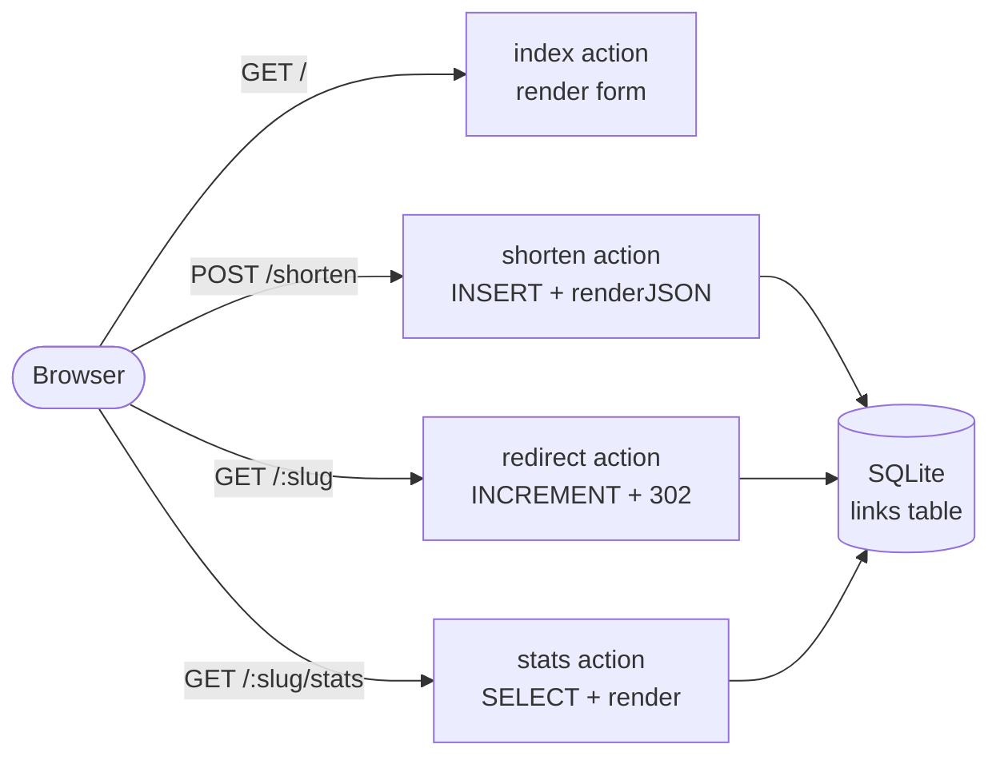

# Link Shortener

In this tutorial you'll build a working URL shortener. A visitor pastes a long URL into a form, gets back a short `/abc123` link, and every click increments a hit counter they can inspect on a stats page.

**What you'll learn:**
- Declare a SQLite ORM connector in `connectors.json`
- Write entity SQL files and call them from `async` controller actions
- Mix `render()` (HTML views) and `renderJSON()` in the same bundle
- Use `self.redirect()` for a 302 HTTP redirect
- Protect a wildcard route with `requirements`

**Time:** ~30 minutes · **Node.js:** 22.5+ · **Gina:** 0.3.0+

:::info Download the finished project
[**link-shortener.zip**](/downloads/tutorials/link-shortener.zip) — extract and run `gina bundle:start api @shortener`.
:::

---

## What you'll build



The project has one bundle (`api`) with four routes, one entity (`link`), and two HTML views.

---

## Project layout

Once complete, your file tree will look like this:

```
shortener/
  src/
    api/
      config/
        app.json
        connectors.json          ← SQLite connector declaration
        routing.json             ← 4 routes
      controllers/
        controller.links.js      ← all 4 actions
      models/
        shortener/               ← matches connectors.json key
          entities/
            link.js              ← entity class (minimal)
          sql/
            link/                ← methods compiled at startup
              setup.sql          ← CREATE TABLE IF NOT EXISTS
              insert.sql         ← INSERT new short link
              findBySlug.sql     ← SELECT by slug
              incrementHits.sql  ← UPDATE hits + 1
      templates/                   ← created by gina view:add (step 6)
        html/
          content/
            links/               ← matches controller namespace
              home.html          ← form page  (matches route "home")
              stats.html         ← stats page (matches route "stats")
          layouts/
            main.html            ← base layout (created by view:add)
      public/                    ← static assets (created by view:add)
```

---

## 1. Create the project

```bash
mkdir shortener
cd shortener
gina project:add @shortener
gina bundle:add api @shortener
```

Then open `env.json` and change the `dev` hostname to `localhost`:

```json title="env.json"
{
  "dev": {
    "api": {
      "hostname": "localhost"
    }
  }
}
```

Check the auto-assigned port:

```bash
gina port:list api @shortener
```

The output shows the port Gina allocated for the `api` bundle (e.g. `3100`). You'll use it in the browser at the end.

---

## 2. Configure the SQLite connector

Open `src/api/config/connectors.json` and replace its contents:

```json title="src/api/config/connectors.json"
{
  "$schema": "https://gina.io/schema/connectors.json",
  "shortener": {
    "connector": "sqlite",
    "database": "shortener"
  }
}
```

The key `"shortener"` is the model name you'll pass to `getModel()` in the controller. Gina stores the database file at `~/.gina/<version>/shortener.sqlite` by default.

:::note Node.js built-in
The SQLite connector uses `node:sqlite` (built-in since Node.js 22.5.0) — no `npm install` required.
:::

---

## 3. Define routes

Open `src/api/config/routing.json` and replace its contents:

```json title="src/api/config/routing.json"
{
  "$schema": "https://gina.io/schema/routing.json",
  "home": {
    "namespace": "links",
    "url": "/",
    "method": "GET",
    "param": { "control": "index" }
  },
  "shorten": {
    "namespace": "links",
    "url": "/shorten",
    "method": "POST",
    "param": { "control": "shorten" }
  },
  "stats": {
    "namespace": "links",
    "url": "/:slug/stats",
    "method": "GET",
    "requirements": { "slug": "^[A-Za-z0-9]{6}$" },
    "param": { "control": "stats", "slug": ":slug" }
  },
  "redirect": {
    "namespace": "links",
    "url": "/:slug",
    "method": "GET",
    "requirements": { "slug": "^[A-Za-z0-9]{6}$" },
    "param": { "control": "redirect", "code": 302, "slug": ":slug" }
  }
}
```

A few things to notice:

- **`namespace: "links"`** — tells Gina to load `controllers/controller.links.js` for all four routes.
- **`param.control`** — the action method to call on the controller.
- **`"slug": ":slug"`** in the `param` block of `stats` and `redirect` — required so the router binds the matched URL segment to `req.params.slug` (and `req.get.slug`). Without this entry, `fitsWithRequirements` returns `false` even when the regex matches and the routes return 404.
- **`requirements`** — a regex guard on `:slug`. Only 6-character alphanumeric strings match; anything else (e.g. `/favicon.ico`) falls through to 404 without hitting your controller.
- **`stats` before `redirect`** — good practice: put the more specific two-segment path (`/:slug/stats`) before the one-segment wildcard (`/:slug`), even though Gina's radix trie handles ordering correctly.
- **`"code": 302`** in the redirect route's `param` block — Gina's `self.redirect()` reads `req.routing.param.code` as the HTTP status code, defaulting to 301. Setting it to `302` here means the browser won't cache the redirect permanently, which is correct for a link shortener (destinations can change).

---

## 4. Create the entity

### Entity class

Create the directory and file:

```bash
mkdir -p src/api/models/shortener/entities
```

```js title="src/api/models/shortener/entities/link.js"
/**
 * Link entity.
 * SQL methods are loaded automatically from models/shortener/sql/link/.
 */
function LinkEntity() {
    var self = this;
}

module.exports = LinkEntity;
```

The class body can stay empty — Gina discovers all methods from the SQL files at startup and attaches them to the prototype.

### SQL files

Create the SQL directory:

```bash
mkdir -p src/api/models/shortener/sql/link
```

**`setup.sql`** — creates the table once if it doesn't exist:

```sql title="src/api/models/shortener/sql/link/setup.sql"
CREATE TABLE IF NOT EXISTS links (
    id      INTEGER PRIMARY KEY AUTOINCREMENT,
    slug    TEXT    NOT NULL UNIQUE,
    url     TEXT    NOT NULL,
    hits    INTEGER NOT NULL DEFAULT 0,
    created TEXT    NOT NULL
)
```

**`insert.sql`** — stores a new short link:

```sql title="src/api/models/shortener/sql/link/insert.sql"
/*
 * @param {string} ?
 * @param {string} ?
 * @param {string} ?
 */
INSERT INTO links (slug, url, created) VALUES (?, ?, ?)
```

**`findBySlug.sql`** — looks up a link by its short slug:

```sql title="src/api/models/shortener/sql/link/findBySlug.sql"
/*
 * @param  {string} ?
 * @return {object}
 */
SELECT id, slug, url, hits, created FROM links WHERE slug = ?
```

`@return {object}` tells Gina to call `stmt.get()` — returns the first matching row as a plain object, or `null` if not found.

**`incrementHits.sql`** — increments the hit counter:

```sql title="src/api/models/shortener/sql/link/incrementHits.sql"
/*
 * @param {string} ?
 */
UPDATE links SET hits = hits + 1 WHERE slug = ?
```

:::tip SQL naming
The SQL subdirectory name (`link/`) must match the entity filename (`link.js`) — case-insensitively. The `.sql` filename becomes the method name on the entity instance (e.g. `findBySlug.sql` → `db.link.findBySlug()`).
:::

---

## 5. Build the controller

Create `src/api/controllers/controller.links.js`:

```js title="src/api/controllers/controller.links.js"
var db    = getModel('shortener');
var CHARS = 'ABCDEFGHIJKLMNOPQRSTUVWXYZabcdefghijklmnopqrstuvwxyz0123456789';

// Schema is created once per process on the first request that needs it.
var _schemaReady = false;

/**
 * Ensures the links table exists. Idempotent — safe to call on every request,
 * but the flag short-circuits after the first successful run.
 */
async function ensureSchema() {
    if (_schemaReady) return;
    await db.link.setup();
    _schemaReady = true;
}

/**
 * Generates a random 6-character alphanumeric slug.
 * @returns {string}
 */
function generateSlug() {
    var slug = '';
    for (var i = 0; i < 6; i++) {
        slug += CHARS.charAt(Math.floor(Math.random() * CHARS.length));
    }
    return slug;
}

/**
 * LinksController — handles all URL shortener routes.
 */
function ApiLinksController() {
    var self = this;

    /**
     * GET / — render the shorten form.
     *
     * @param {object} req
     * @param {object} res
     */
    this.index = async function(req, res) {
        await ensureSchema();
        self.render({});
    };

    /**
     * POST /shorten — create a new short link.
     * Expects { url } in the request body.
     * Returns { slug, short_url } as JSON.
     *
     * @param {object} req
     * @param {object} res
     */
    this.shorten = async function(req, res) {
        await ensureSchema();

        var url = (req.post && req.post.url) ? req.post.url.trim() : '';

        if (!url || !/^https?:\/\/.+/i.test(url)) {
            return self.renderJSON({ error: 'A valid http:// or https:// URL is required.' }, 400);
        }

        // Generate a unique slug — retry on the rare collision.
        var slug     = generateSlug();
        var existing = await db.link.findBySlug(slug);
        while (existing) {
            slug     = generateSlug();
            existing = await db.link.findBySlug(slug);
        }

        await db.link.insert(slug, url, new Date().toISOString());

        var appConf  = self.getConfig('app');
        var hostname = appConf.hostname || ('http://localhost:' + appConf.port);

        self.renderJSON({
            slug:      slug,
            short_url: hostname + '/' + slug
        });
    };

    /**
     * GET /:slug — redirect to the original URL (302).
     * Increments the hit counter before redirecting.
     * Returns 404 JSON if the slug is unknown.
     *
     * @param {object} req
     * @param {object} res
     */
    this.redirect = async function(req, res) {
        await ensureSchema();

        var slug = req.params.slug;
        var link = await db.link.findBySlug(slug);

        if (!link) {
            return self.renderJSON({ error: 'Short link not found.' }, 404);
        }

        await db.link.incrementHits(slug);
        self.redirect(link.url);
    };

    /**
     * GET /:slug/stats — render the hit-counter page.
     * Returns 404 JSON if the slug is unknown.
     *
     * @param {object} req
     * @param {object} res
     */
    this.stats = async function(req, res) {
        await ensureSchema();

        var slug = req.params.slug;
        var link = await db.link.findBySlug(slug);

        if (!link) {
            return self.renderJSON({ error: 'Short link not found.' }, 404);
        }

        self.render({ link: link });
    };
}

module.exports = ApiLinksController;
```

**Key patterns:**

| Pattern | What it does |
|---|---|
| `var db = getModel('shortener')` | Binds the model once at module level; safe because modules are cached. |
| `await ensureSchema()` | Lazily creates the table on the first request; `_schemaReady` prevents repeat calls. |
| `await db.link.findBySlug(slug)` | Returns a row object or `null` — no `.onComplete()` needed for ORM entity methods. |
| `self.redirect(link.url)` | Issues the 302 using the status code declared in `routing.json` (`"code": 302`). |
| `self.renderJSON({...}, 400)` | Sends a JSON error with the given HTTP status. |

:::caution `self.redirect` vs action name
The `this.redirect` action you define and the `self.redirect()` framework method are two different things. Inside the `redirect` action, call `self.redirect(url)` (the SuperController method) to issue the HTTP redirect.
:::

---

## 6. Add views

Scaffold the view layer — templates directory, base layout, and default content page:

```bash
gina view:add api @shortener
```

Then create the namespace subdirectory for the `links` routes:

```bash
mkdir -p src/api/templates/html/content/links
```

Gina resolves templates from `templates/html/content/<namespace>/<route-name>.html`. With `routeNameAsFilenameEnabled: true` (the default in `templates.json`), the filename must match the **route key** from `routing.json` — `home` and `stats` in this project.

### Form page

```html title="src/api/templates/html/content/links/home.html"



<style>
  body { font-family: system-ui, sans-serif; max-width: 600px; margin: 4rem auto; padding: 0 1rem; }
  h1   { font-size: 1.5rem; margin-bottom: 1.5rem; }
  form { display: flex; gap: .5rem; }
  input[type="url"] { flex: 1; padding: .5rem .75rem; border: 1px solid #ccc; border-radius: 4px; font-size: 1rem; }
  button { padding: .5rem 1.25rem; background: #0066cc; color: #fff; border: none; border-radius: 4px; font-size: 1rem; cursor: pointer; }
  button:hover { background: #0052a3; }
  #result { margin-top: 1.5rem; display: none; }
  #result a { font-size: 1.1rem; color: #0066cc; }
  .error { color: #c00; margin-top: 1rem; }
</style>

<h1>Shorten a URL</h1>

<form id="shorten-form">
  <input type="url" id="url-input" placeholder="https://example.com/very/long/url" required>
  <button type="submit">Shorten</button>
</form>

<div id="result"></div>
<div id="error" class="error"></div>

<script>
document.getElementById('shorten-form').addEventListener('submit', async function(e) {
    e.preventDefault();
    var url    = document.getElementById('url-input').value;
    var result = document.getElementById('result');
    var error  = document.getElementById('error');

    result.style.display = 'none';
    error.textContent    = '';

    try {
        var res  = await fetch('/shorten', {
            method:  'POST',
            headers: { 'Content-Type': 'application/json' },
            body:    JSON.stringify({ url: url })
        });
        var data = await res.json();

        if (!res.ok) {
            error.textContent = data.error || 'Something went wrong.';
            return;
        }

        result.innerHTML    = 'Short link: <a href="/' + data.slug + '" target="_blank">'
                            + data.short_url + '</a>'
                            + ' &nbsp;·&nbsp; <a href="/' + data.slug + '/stats">stats</a>';
        result.style.display = 'block';
    } catch (err) {
        error.textContent = 'Request failed. Is the bundle running?';
    }
});
</script>

```

### Stats page

```html title="src/api/templates/html/content/links/stats.html"





<style>
  body { font-family: system-ui, sans-serif; max-width: 600px; margin: 4rem auto; padding: 0 1rem; }
  h1   { font-size: 1.5rem; }
  table { border-collapse: collapse; width: 100%; margin-top: 1.5rem; }
  td    { padding: .5rem .75rem; border-bottom: 1px solid #eee; }
  td:first-child { color: #666; width: 40%; }
  a { color: #0066cc; }
</style>

<h1>Stats for /{{ data.link.slug }}</h1>

<table>
  <tr><td>Original URL</td>  <td><a href="{{ data.link.url }}" target="_blank" rel="noopener">{{ data.link.url }}</a></td></tr>
  <tr><td>Short link</td>    <td><a href="/{{ data.link.slug }}">/{{ data.link.slug }}</a></td></tr>
  <tr><td>Hits</td>          <td><strong>{{ data.link.hits }}</strong></td></tr>
  <tr><td>Created</td>       <td>{{ data.link.created }}</td></tr>
</table>

<p style="margin-top:2rem"><a href="/">← Shorten another URL</a></p>

```

The data passed to `self.render({ link: link })` is available as `page.data` in every Swig template. The `` alias at the top is a Gina convention (matches the boilerplate) that keeps template expressions concise.

---

## 7. Start the bundle

```bash
gina bundle:start api @shortener
```

You should see the framework log confirm that the SQLite connector loaded and the four routes are registered. Open your browser at `http://localhost:<port>` (replace `<port>` with the value from `gina port:list`).

:::warning Webroot must be `/`
A link shortener needs clean short links like `/abc123`, not `/api/abc123`. When `api` is the **first** (and only) bundle in a project, `gina bundle:add` automatically sets `webroot` to `/` in `src/api/config/settings.server.json`. Verify it reads `"webroot": "/"` before starting.

If you add the `api` bundle to a project that already has other bundles, the default webroot will be `/api`. In that case open `src/api/config/settings.server.json` and change `"webroot": "/api"` to `"webroot": "/"` manually, then update the fetch URL in `home.html` if needed.
:::

:::info Dev-mode note
In dev mode Gina reloads the controller on every request. The `_schemaReady` flag therefore resets each time, so `ensureSchema()` runs `setup()` on every request. This is safe — `CREATE TABLE IF NOT EXISTS` is idempotent — but it adds a small overhead. In production the module is loaded once and the flag persists. If you want the optimisation in dev mode too, store the flag as `global._schemaReady`.
:::

---

## Try it

1. **Shorten a URL** — paste any `https://` URL into the form and click *Shorten*. You'll get back a `/abc123` link.
2. **Click the short link** — your browser follows the 302 redirect to the original URL.
3. **Check the stats** — click the *stats* link next to your short URL. The hit counter shows how many times the link was visited.
4. **Test the 404** — visit `/xxxxxx` (a slug that doesn't exist). You'll get `{"error":"Short link not found."}` back as JSON.

---

## What you learned

| Concept | Where it appears |
|---|---|
| SQLite ORM connector | `connectors.json` → `"connector": "sqlite"` |
| Entity SQL files | `models/shortener/sql/link/*.sql` |
| SQL return type annotation | `@return {object}` on `findBySlug.sql` |
| `async` controller actions | every action in `controller.links.js` |
| `await db.link.method()` | direct Promise — no `.onComplete()` needed |
| `render()` vs `renderJSON()` | HTML form and stats vs JSON API response |
| `self.redirect(url)` | 302 redirect in the redirect action |
| Route `requirements` | regex guard on `:slug` to protect the wildcard |
| Static `param.code` | sets the redirect HTTP status code from `routing.json` |

---

## Next steps

| What | Where |
|---|---|
| Add a custom domain column and a `GET /admin` listing page | Extend this project — try `getAll.sql` and a new action |
| Understand the full entity event model | [Models & entities](/guides/models) |
| Add authentication to the `/admin` route | [Middleware](/guides/middleware) |
| Stream LLM responses from a controller | [AI connector](/guides/ai) |
