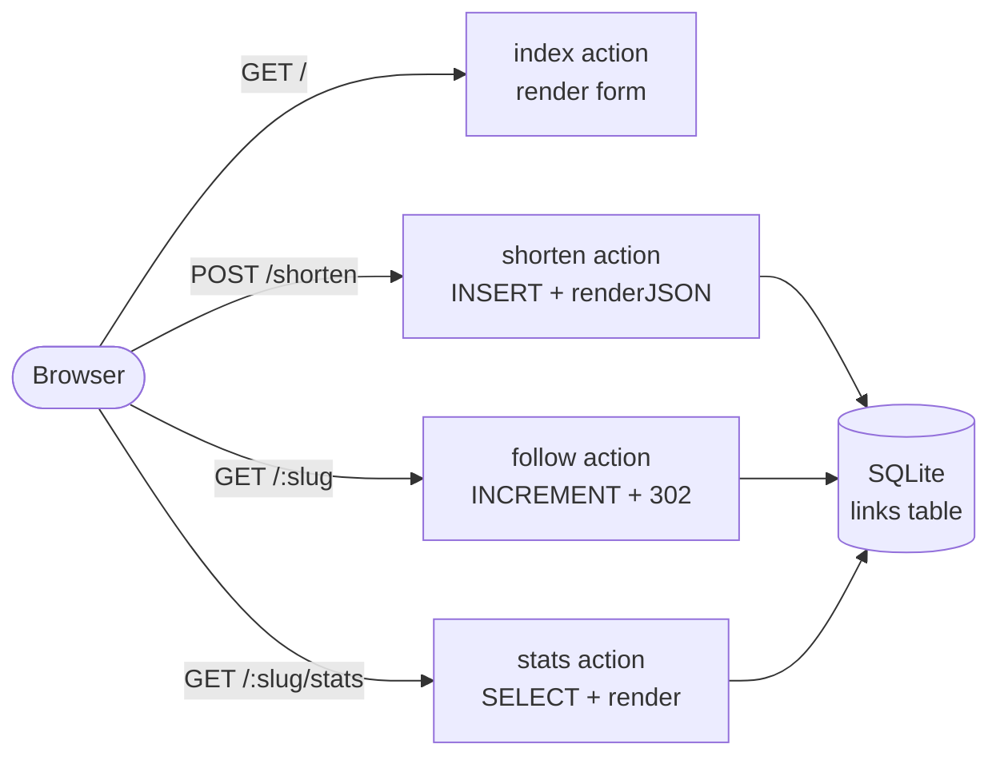

# Link Shortener

In this tutorial you'll build a working URL shortener. A visitor pastes a long URL into a form, gets back a short `/abc123` link, and every click increments a hit counter they can inspect on a stats page.

**What you'll learn:**
- Declare a SQLite ORM connector in `connectors.json`
- Write entity SQL files and call them from `async` controller actions
- Mix `render()` (HTML views) and `renderJSON()` in the same bundle
- Use `self.redirect()` for a 302 HTTP redirect
- Protect a wildcard route with `requirements`

**Time:** ~30 minutes · **Node.js:** 22.5+ · **Gina:** 0.3.0+

:::info Download the finished project
<svg xmlns="http://www.w3.org/2000/svg" width="16" height="16" viewBox="0 0 24 24" fill="none" stroke="var(--ifm-link-color)" strokeWidth="2" strokeLinecap="round" strokeLinejoin="round" style={{verticalAlign: '-3px', marginRight: '4px'}}><path d="M21 15v4a2 2 0 0 1-2 2H5a2 2 0 0 1-2-2v-4"/><polyline points="7 10 12 15 17 10"/><line x1="12" y1="15" x2="12" y2="3"/></svg> [**link-shortener.zip**](/downloads/tutorials/link-shortener.zip) — extract and run:

```bash
cd shortener
```

```bash
gina project:add @shortener
```

```bash
gina bundle:add api @shortener --import
```

```bash
node scripts/migrate.js
```

```bash
gina bundle:start api @shortener
```
:::

---

## What you'll build


```mermaid
flowchart LR
    A([Browser]) -->|GET /| B["index action<br/>render form"]
    A -->|POST /shorten| C["shorten action<br/>INSERT + renderJSON"]
    A -->|GET /:slug| D["follow action<br/>INCREMENT + 302"]
    A -->|GET /:slug/stats| E["stats action<br/>SELECT + render"]
    C --> DB[("SQLite<br/>links table")]
    D --> DB
    E --> DB
```

The project has one bundle (`api`) with four routes, one entity (`link`), and two HTML views.

---

## Project layout

Once complete, your file tree will look like this:

```
shortener/
  src/
    api/
      config/
        app.json
        connectors.json          ← SQLite connector declaration
        routing.json             ← 4 routes
      controllers/
        controller.links.js      ← all 4 actions
      models/
        shortener/               ← matches connectors.json key
          entities/
            link.js              ← entity class (minimal)
          sql/
            link/                ← methods compiled at startup
              setup.sql          ← CREATE TABLE IF NOT EXISTS
              insert.sql         ← INSERT new short link
              findBySlug.sql     ← SELECT by slug
              incrementHits.sql  ← UPDATE hits + 1
      templates/                   ← created by gina view:add (step 6)
        html/
          links/                 ← matches the route namespace
            home.html            ← form page  (matches route "home")
            stats.html           ← stats page (matches route "stats")
          layouts/
            main.html            ← base layout (created by view:add)
      public/                    ← static assets (created by view:add)
  scripts/
    migrate.js                 ← creates the table (run once, before first start)
```

---

## 1. Create the project

```bash
mkdir shortener
cd shortener
gina project:add @shortener
gina bundle:add api @shortener
```

Then open `env.json` and change the `dev` host to `localhost`:

```json title="env.json"
{
  "api": {
    "dev": {
      "host": "localhost"
    }
  }
}
```

Check the auto-assigned port:

```bash
gina port:list api @shortener
```

The output shows the port Gina allocated for the `api` bundle (e.g. `3100`). You'll use it in the browser at the end.

---

## 2. Configure the SQLite connector

Open `src/api/config/connectors.json` and replace its contents:

```json title="src/api/config/connectors.json"
{
  "$schema": "https://gina.io/schema/connectors.json",
  "shortener": {
    "connector": "sqlite",
    "database": "shortener"
  }
}
```

The key `"shortener"` is the model name you'll pass to `getModel()` in the controller. It also names the `models/` subdirectory the entity and its SQL live in.

Gina stores the database file at `~/.gina/shortener.sqlite` — that is `<gina home>/<database>.sqlite`, and the gina home directory is **not** versioned. Add a `"file"` key if you would rather keep the database somewhere else:

```json
"shortener": {
  "connector": "sqlite",
  "database": "shortener",
  "file": "/absolute/path/to/shortener.sqlite"
}
```

:::note Node.js built-in
The SQLite connector uses `node:sqlite` (built-in since Node.js 22.5.0) — no `npm install` required.
:::

---

## 3. Define routes

Open `src/api/config/routing.json` and replace its contents:

```json title="src/api/config/routing.json"
{
  "$schema": "https://gina.io/schema/routing.json",
  "home": {
    "namespace": "links",
    "url": "/",
    "method": "GET",
    "param": { "control": "index" }
  },
  "shorten": {
    "namespace": "links",
    "url": "/shorten",
    "method": "POST",
    "param": { "control": "shorten" }
  },
  "stats": {
    "namespace": "links",
    "url": "/:slug/stats",
    "method": "GET",
    "requirements": { "slug": "/^[A-Za-z0-9]{6}$/" },
    "param": { "control": "stats", "slug": ":slug" }
  },
  "redirect": {
    "namespace": "links",
    "url": "/:slug",
    "method": "GET",
    "requirements": { "slug": "/^[A-Za-z0-9]{6}$/" },
    "param": { "control": "follow", "code": 302, "slug": ":slug" }
  }
}
```

A few things to notice:

- **`namespace: "links"`** — tells Gina to load `controllers/controller.links.js` for all four routes.
- **`param.control`** — the action method to call on the controller.
- **`"slug": ":slug"`** in the `param` block of `stats` and `redirect` — required so `fitsWithRequirements` binds the matched URL segment to `req.params.slug`. Without this entry, `fitsWithRequirements` returns `false` even when the regex matches and the routes return 404.
- **`requirements`** — a regex guard on `:slug`, wrapped in `/` delimiters (e.g. `/^pattern$/`). Only 6-character alphanumeric strings match; anything else (e.g. `/favicon.ico`) falls through to 404 without hitting your controller.
- **`stats` before `redirect`** — good practice: put the more specific two-segment path (`/:slug/stats`) before the one-segment wildcard (`/:slug`), even though Gina's radix trie handles ordering correctly.
- **`"code": 302`** in the redirect route's `param` block — Gina's `self.redirect()` reads `req.routing.param.code` as the HTTP status code, defaulting to 301. Setting it to `302` here means the browser won't cache the redirect permanently, which is correct for a link shortener (destinations can change).

---

## 4. Create the entity and its table

### Entity class

Create the directory and file:

```bash
mkdir -p src/api/models/shortener/entities
```

```js title="src/api/models/shortener/entities/link.js"
/**
 * Link entity.
 * SQL methods are loaded automatically from models/shortener/sql/link/.
 */
function LinkEntity() {
    var self = this;
}

module.exports = LinkEntity;
```

The class body can stay empty — Gina discovers all methods from the SQL files at startup and attaches them to the prototype.

### SQL files

Create the SQL directory:

```bash
mkdir -p src/api/models/shortener/sql/link
```

**`setup.sql`** — creates the table once if it doesn't exist:

```sql title="src/api/models/shortener/sql/link/setup.sql"
CREATE TABLE IF NOT EXISTS links (
    id      INTEGER PRIMARY KEY AUTOINCREMENT,
    slug    TEXT    NOT NULL UNIQUE,
    url     TEXT    NOT NULL,
    hits    INTEGER NOT NULL DEFAULT 0,
    created TEXT    NOT NULL
)
```

**`insert.sql`** — stores a new short link:

```sql title="src/api/models/shortener/sql/link/insert.sql"
/*
 * @param {string} ?
 * @param {string} ?
 * @param {string} ?
 */
INSERT INTO links (slug, url, created) VALUES (?, ?, ?)
```

**`findBySlug.sql`** — looks up a link by its short slug:

```sql title="src/api/models/shortener/sql/link/findBySlug.sql"
/*
 * @param  {string} ?
 * @return {object}
 */
SELECT id, slug, url, hits, created FROM links WHERE slug = ?
```

`@return {object}` tells Gina to call `stmt.get()` — returns the first matching row as a plain object, or `null` if not found.

**`incrementHits.sql`** — increments the hit counter:

```sql title="src/api/models/shortener/sql/link/incrementHits.sql"
/*
 * @param {string} ?
 */
UPDATE links SET hits = hits + 1 WHERE slug = ?
```

:::tip SQL naming
The SQL subdirectory name (`link/`) must match the entity filename (`link.js`) — case-insensitively. The `.sql` filename becomes the method name on the entity instance (e.g. `findBySlug.sql` → `db.link.findBySlug()`).
:::

### Create the table

The SQLite connector does not create your tables — you run the DDL yourself, **before the bundle starts**.

:::warning The schema must exist before boot
The connector compiles every `.sql` file with `conn.prepare()` while the bundle boots. A statement naming a table that does not exist yet fails to compile, and that failure is remembered for the life of the process — so `insert` and `findBySlug` would keep throwing `no such table: links` even after something created the table later. Creating it from a controller action is too late; only a restart would clear it.

This is why `setup.sql` is run by the migration script below rather than from an action.
:::

Create the script:

```bash
mkdir -p scripts
```

```js title="scripts/migrate.js"
/**
 * One-off schema migration — run before starting the bundle.
 *
 * Reads the same setup.sql the entity ships, so the schema has a single source
 * of truth. Safe to re-run: the statement is CREATE TABLE IF NOT EXISTS.
 *
 * Usage:
 *   node scripts/migrate.js                  # default database location
 *   node scripts/migrate.js /path/to/db.sqlite
 */
var fs           = require('fs');
var os           = require('os');
var path         = require('path');
var DatabaseSync = require('node:sqlite').DatabaseSync;

// Matches the connector's default: <gina home>/<database>.sqlite
var DEFAULT_DB = path.join(os.homedir(), '.gina', 'shortener.sqlite');
var SCHEMA     = path.join(__dirname, '..', 'src', 'api', 'models', 'shortener', 'sql', 'link', 'setup.sql');

var dbFile = process.argv[2] || DEFAULT_DB;
var db     = new DatabaseSync(dbFile);

db.exec(fs.readFileSync(SCHEMA, 'utf8'));
db.close();

console.log('schema applied to ' + dbFile);
```

Run it once:

```bash
node scripts/migrate.js
```

```
schema applied to /Users/you/.gina/shortener.sqlite
```

Re-run it any time you change `setup.sql` — but note that `CREATE TABLE IF NOT EXISTS` will not alter an existing table. To pick up a column change, delete the database file and run the migration again.

---

## 5. Build the controller

Create `src/api/controllers/controller.links.js`:

```js title="src/api/controllers/controller.links.js"
var db    = getModel('shortener');
var CHARS = 'ABCDEFGHIJKLMNOPQRSTUVWXYZabcdefghijklmnopqrstuvwxyz0123456789';

/**
 * Generates a random 6-character alphanumeric slug.
 * @returns {string}
 */
function generateSlug() {
    var slug = '';
    for (var i = 0; i < 6; i++) {
        slug += CHARS.charAt(Math.floor(Math.random() * CHARS.length));
    }
    return slug;
}

/**
 * LinksController — handles all URL shortener routes.
 */
function ApiLinksController() {
    var self = this;

    /**
     * GET / — render the shorten form.
     *
     * @param {object} req
     * @param {object} res
     */
    this.index = function(req, res) {
        self.render({});
    };

    /**
     * POST /shorten — create a new short link.
     * Expects { url } in the request body.
     * Returns { slug, short_url } as JSON.
     *
     * @param {object} req
     * @param {object} res
     */
    this.shorten = async function(req, res) {
        var url = (req.post && req.post.url) ? req.post.url.trim() : '';

        if (!url || !/^https?:\/\/.+/i.test(url)) {
            return self.renderJSON({
                status : 400,
                error  : 'A valid http:// or https:// URL is required.'
            });
        }

        // Generate a unique slug — retry on the rare collision.
        var slug     = generateSlug();
        var existing = await db.link.findBySlug(slug);
        while (existing) {
            slug     = generateSlug();
            existing = await db.link.findBySlug(slug);
        }

        await db.link.insert(slug, url, new Date().toISOString());

        var hostname = self.getConfig().hostname;

        self.renderJSON({
            slug      : slug
          , short_url : hostname + '/' + slug
        });
    };

    /**
     * GET /:slug — redirect to the original URL (302).
     * Increments the hit counter before redirecting.
     * Returns 404 JSON if the slug is unknown.
     *
     * @param {object} req
     * @param {object} res
     */
    this.follow = async function(req, res) {
        var slug = req.params.slug;
        var link = await db.link.findBySlug(slug);

        if (!link) {
            return self.renderJSON({
                status : 404,
                error  : 'Short link not found.'
            });
        }

        await db.link.incrementHits(slug);
        self.redirect(link.url);
    };

    /**
     * GET /:slug/stats — render the hit-counter page.
     * Returns 404 JSON if the slug is unknown.
     *
     * @param {object} req
     * @param {object} res
     */
    this.stats = async function(req, res) {
        var slug = req.params.slug;
        var link = await db.link.findBySlug(slug);

        if (!link) {
            return self.renderJSON({
                status : 404,
                error  : 'Short link not found.'
            });
        }

        self.render({ link: link });
    };
}

module.exports = ApiLinksController;
```

**Key patterns:**

| Pattern | What it does |
|---|---|
| `var db = getModel('shortener')` | Binds the model once at module level; safe because modules are cached. |
| `await db.link.findBySlug(slug)` | Returns a row object or `null` — no `.onComplete()` needed for ORM entity methods. |
| `self.redirect(link.url)` | Issues the 302 using the status code declared in `routing.json` (`"code": 302`). |
| `self.renderJSON({ status: 400, … })` | `renderJSON()` takes **one** argument. The HTTP status comes from a `status` key inside the payload — there is no second parameter. |
| `self.getConfig().hostname` | The bundle's configured origin (`scheme://host:port`, from `env.json` + the assigned port) — the canonical base for stored short links, independent of whatever `Host` header a client sent. |

:::caution Never name an action after a SuperController method
The action is called `follow`, not `redirect`, and that is deliberate. Your actions are assigned onto the controller instance (`this.follow = …`), which is the **same object** `self` points at — so `this.redirect = …` would overwrite the inherited `self.redirect()` method. `self.redirect(link.url)` would then re-enter your own action with a string in place of `req`, and the request would die on `Cannot read properties of undefined (reading 'slug')`.

The same applies to every other SuperController method: `render`, `renderJSON`, `renderStream`, `throwError`, `store`, `push`, `query`. Name actions after what they do to your domain (`follow`, `shorten`, `stats`), not after framework verbs.
:::

---

## 6. Add views

Scaffold the view layer — templates directory, base layout, and default content page:

```bash
gina view:add api @shortener
```

Then create the namespace subdirectory for the `links` routes:

```bash
mkdir -p src/api/templates/html/links
```

Gina resolves templates from `templates/html/<namespace>/<route-name>.html` — the directory is the route's **namespace**, so `links` here. With `routeNameAsFilenameEnabled: true` (the default in `templates.json`), the filename must match the **route key** from `routing.json` — `home` and `stats` in this project.

:::note Why not `content/`?
`gina view:add` scaffolds a `templates/html/content/` directory because the default route it creates uses the `content` namespace. That directory is not a fixed wrapper — your templates go under a directory named after *your* namespace. Putting them in `templates/html/content/links/` makes the lookup fail with `could not open …/templates/html/links/home.html` and the page returns a 500.
:::

### Form page

```html title="src/api/templates/html/links/home.html"



<style>
  body { font-family: system-ui, sans-serif; max-width: 600px; margin: 4rem auto; padding: 0 1rem; }
  h1   { font-size: 1.5rem; margin-bottom: 1.5rem; }
  form { display: flex; gap: .5rem; }
  input[type="url"] { flex: 1; padding: .5rem .75rem; border: 1px solid #ccc; border-radius: 4px; font-size: 1rem; }
  button { padding: .5rem 1.25rem; background: #0066cc; color: #fff; border: none; border-radius: 4px; font-size: 1rem; cursor: pointer; }
  button:hover { background: #0052a3; }
  #result { margin-top: 1.5rem; display: none; }
  #result a { font-size: 1.1rem; color: #0066cc; }
  .error { color: #c00; margin-top: 1rem; }
</style>

<h1>Shorten a URL</h1>

<form id="shorten-form">
  <input type="url" id="url-input" placeholder="https://example.com/very/long/url" required>
  <button type="submit">Shorten</button>
</form>

<div id="result"></div>
<div id="error" class="error"></div>

<script>
document.getElementById('shorten-form').addEventListener('submit', async function(e) {
    e.preventDefault();
    var url    = document.getElementById('url-input').value;
    var result = document.getElementById('result');
    var error  = document.getElementById('error');

    result.style.display = 'none';
    error.textContent    = '';

    try {
        var res  = await fetch('/shorten', {
            method:  'POST',
            headers: { 'Content-Type': 'application/json' },
            body:    JSON.stringify({ url: url })
        });
        var data = await res.json();

        if (!res.ok) {
            error.textContent = data.error || 'Something went wrong.';
            return;
        }

        result.innerHTML    = 'Short link: <a href="/' + data.slug + '" target="_blank">'
                            + data.short_url + '</a>'
                            + ' &nbsp;·&nbsp; <a href="/' + data.slug + '/stats">stats</a>';
        result.style.display = 'block';
    } catch (err) {
        error.textContent = 'Request failed. Is the bundle running?';
    }
});
</script>

```

### Stats page

```html title="src/api/templates/html/links/stats.html"





<style>
  body { font-family: system-ui, sans-serif; max-width: 600px; margin: 4rem auto; padding: 0 1rem; }
  h1   { font-size: 1.5rem; }
  table { border-collapse: collapse; width: 100%; margin-top: 1.5rem; }
  td    { padding: .5rem .75rem; border-bottom: 1px solid #eee; }
  td:first-child { color: #666; width: 40%; }
  a { color: #0066cc; }
</style>

<h1>Stats for /{{ data.link.slug }}</h1>

<table>
  <tr><td>Original URL</td>  <td><a href="{{ data.link.url }}" target="_blank" rel="noopener">{{ data.link.url }}</a></td></tr>
  <tr><td>Short link</td>    <td><a href="/{{ data.link.slug }}">/{{ data.link.slug }}</a></td></tr>
  <tr><td>Hits</td>          <td><strong>{{ data.link.hits }}</strong></td></tr>
  <tr><td>Created</td>       <td>{{ data.link.created }}</td></tr>
</table>

<p style="margin-top:2rem"><a href="/">← Shorten another URL</a></p>

```

The data passed to `self.render({ link: link })` is available as `page.data` in every [Swig](/templating/swig) template. The `` alias at the top is a Gina convention (matches the boilerplate) that keeps template expressions concise.

---

## 7. Start the bundle

Make sure the migration from step 4 has already run — the connector compiles its SQL at boot, so the table has to exist first:

```bash
node scripts/migrate.js
```

```bash
gina bundle:start api @shortener
```

You should see the framework log confirm that the SQLite connector loaded and the four routes are registered. Open your browser at `http://localhost:<port>` (replace `<port>` with the value from `gina port:list`).

:::warning Webroot must be `/`
A link shortener needs clean short links like `/abc123`, not `/api/abc123`. When `api` is the **first** (and only) bundle in a project, `gina bundle:add` automatically sets `webroot` to `/` in `src/api/config/settings.server.json`. Verify it reads `"webroot": "/"` before starting.

If you add the `api` bundle to a project that already has other bundles, the default webroot will be `/api`. In that case open `src/api/config/settings.server.json` and change `"webroot": "/api"` to `"webroot": "/"` manually, then update the fetch URL in `home.html` if needed.
:::

:::info Did the migration run?
If the log shows `Failed to prepare statement: no such table: links`, the bundle booted against a database with no schema. Stop the bundle, run `node scripts/migrate.js`, and start it again — the connector only compiles its statements at boot, so restarting is what picks the table up.
:::

---

## Try it

1. **Shorten a URL** — paste any `https://` URL into the form and click *Shorten*. You'll get back a `/abc123` link.
2. **Click the short link** — your browser follows the 302 redirect to the original URL.
3. **Check the stats** — click the *stats* link next to your short URL. The hit counter shows how many times the link was visited.
4. **Test the 404** — visit `/xxxxxx` (a slug that doesn't exist). You'll get an HTTP **404** carrying `{"status":404,"error":"Short link not found."}` as JSON. The `status` key is what set the response code — it stays in the body, which is why the form's JavaScript can read `data.error` after checking `res.ok`.

---

## What you learned

| Concept | Where it appears |
|---|---|
| SQLite ORM connector | `connectors.json` → `"connector": "sqlite"` |
| Entity SQL files | `models/shortener/sql/link/*.sql` |
| SQL return type annotation | `@return {object}` on `findBySlug.sql` |
| Pre-boot schema migration | `scripts/migrate.js` — statements are compiled at boot, so the table must exist first |
| `async` controller actions | `shorten`, `follow` and `stats` in `controller.links.js` |
| `await db.link.method()` | direct Promise — no `.onComplete()` needed |
| `render()` vs `renderJSON()` | HTML form and stats vs JSON API response |
| JSON error status | a `status` key inside the `renderJSON()` payload — not a second argument |
| `self.redirect(url)` | 302 redirect in the `follow` action — never name an action after a SuperController method |
| Route `requirements` | regex guard on `:slug` to protect the wildcard |
| Static `param.code` | sets the redirect HTTP status code from `routing.json` |

---

## Next steps

| What | Where |
|---|---|
| Add a custom domain column and a `GET /admin` listing page | Extend this project — try `getAll.sql` and a new action |
| Understand the full entity event model | [Models & entities](/guides/models) |
| Add authentication to the `/admin` route | [Middleware](/guides/middleware) |
| Stream LLM responses from a controller | [AI connector](/guides/ai) |
