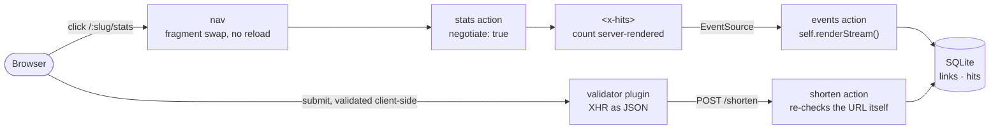
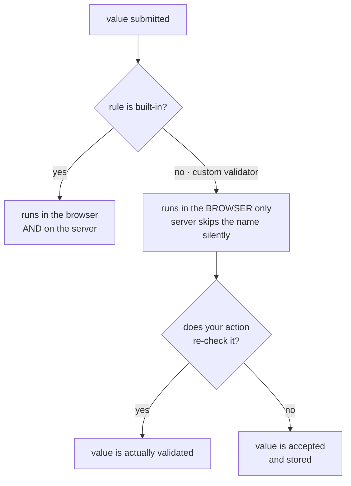

# Make It Interactive

[Going to Production](/tutorials/going-to-production) left you with a shortener that is safe but silent. Every interaction is a full page load, the one piece of interactivity — the shorten form — is forty lines of hand-rolled `fetch` you now own forever, and the hit counter on the stats page is only ever as fresh as the last time someone pressed reload. In this tutorial you hand all of that to the framework: Gina validates and submits the form, a rule you write yourself gives the field live feedback, a hit counter holds an open connection to the server, and clicking between pages swaps content instead of reloading the document.

**What you'll learn:**
- Replace a hand-rolled `fetch` submit with a rule-bound form — and change nothing on the server
- Write a custom validation rule at `forms/validators/<name>/main.js`, and read its message from the catalog
- See exactly where client-side validation stops being a guarantee — and prove it
- Push server state to an open page with `self.renderStream()` and an async generator
- Build a component whose lifecycle *is* its connection's lifecycle, with the count still server-rendered for crawlers
- Turn full page loads into content swaps with `negotiate: true` and `data-gina-nav`

**Time:** ~45 minutes · **Node.js:** 22.5+ · **Gina:** 0.6.3+

:::info Download the finished project
<svg xmlns="http://www.w3.org/2000/svg" width="16" height="16" viewBox="0 0 24 24" fill="none" stroke="var(--ifm-link-color)" strokeWidth="2" strokeLinecap="round" strokeLinejoin="round" style={{verticalAlign: '-3px', marginRight: '4px'}}><path d="M21 15v4a2 2 0 0 1-2 2H5a2 2 0 0 1-2-2v-4"/><polyline points="7 10 12 15 17 10"/><line x1="12" y1="15" x2="12" y2="3"/></svg> [**make-it-interactive.zip**](/downloads/tutorials/make-it-interactive.zip) — extract and run:

```bash
cd shortener
```

```bash
gina project:add @shortener
```

```bash
gina bundle:add api @shortener --import
```

```bash
npm install
```

```bash
node scripts/migrate.js
```

The project keeps the previous tutorial's HTTPS + HTTP/2 setup, so create a local certificate before the first start if you do not have one already:

```bash
mkdir -p ~/.gina/certificates/scopes/local/localhost && cd ~/.gina/certificates/scopes/local/localhost && openssl req -x509 -newkey rsa:2048 -nodes -sha256 -subj "/CN=localhost" -keyout private.key -out certificate.crt && cp certificate.crt ca_bundle.crt && cd -
```

```bash
gina bundle:start api @shortener
```
:::

:::note Where you must start from
This tutorial **continues Going to Production**. Either complete that tutorial first, or download its finished source ([going-to-production.zip](/downloads/tutorials/going-to-production.zip)) and set it up per its *Download the finished project* steps. Everything here builds on the accounts, sessions and deny-by-default authorization it left in place.
:::

## What you'll build



Four independent changes, each usable on its own. The form keeps working with JavaScript disabled because it is still a real `<form>` with an `action`. The counter is still in the HTML a crawler reads, because the server renders it and the component only keeps it current. And the navigation is still ordinary links — a fragment swap is an optimisation the browser is free to ignore.

---

## 1. Where you're starting from

Open `src/api/templates/html/links/home.html` in the project you are continuing. The shorten form looks like this:

```html title="src/api/templates/html/links/home.html (as you left it)"
<form id="shorten-form">
  <input type="url" id="url-input" placeholder="https://example.com/very/long/url" required>
  <button type="submit">Shorten</button>
</form>
```

and below it, a script that cancels the native submit, serialises the field by hand, posts it, branches on `res.ok`, paints the result with `innerHTML`, and wraps the lot in a `try/catch` for the network. It works. It is also the part of the project you will keep maintaining forever: every field you add has to be read, validated and serialised by hand, and none of that logic is shared with the server.

Gina already ships the machinery for this. What follows replaces that script with two event handlers — and, notably, **touches nothing in the controller**.

---

## 2. Let Gina own the form

### Declare the rules

Validation rules live in JSON, one file per rule set, under the bundle's `forms/rules/` directory. Create it:

```json title="src/api/forms/rules/shorten.json"
{
    "url": {
        "isRequired": true
    }
}
```

Each top-level key is a **field name** — it matches the `name` attribute of an input, not its `id`. The rule set is named after the file, so this one is `shorten`.

### Bind the form

Now point the form at that rule set and give the input a `name`:

```html title="src/api/templates/html/links/home.html (the form)"
<form id="shorten-form"
      action="/shorten" method="post"
      data-gina-form-rule="shorten"
      data-gina-form-event-on-submit-success="onShortened"
      data-gina-form-event-on-submit-error="onShortenError">
  <input type="url" name="url" id="url-input"
         data-gina-form-field-label="URL"
         placeholder="https://example.com/very/long/url">
  <button type="submit">Shorten</button>
</form>
```

Five things changed, and each one earns its place:

- **`action` and `method`** — the form is now a real form. Gina reads `action` to know where to send the fields.
- **`data-gina-form-rule="shorten"`** — binds this form to the rule set. This is also the opt-in: forms without it are left alone.
- **`name="url"`** — how the field is matched to its rule, and the key it is sent under.
- **`data-gina-form-field-label="URL"`** — the human name used in messages.
- **`required` is gone** — `isRequired` in the rule set now owns that check, and it can say something better than the browser's built-in bubble.

:::warning `method` is not optional
Leave `method` off and the submit goes out as a **GET**, with the fields in the query string and no CSRF token header. And do **not** add an `enctype`: the validator sends a JSON body, an explicit `enctype` overrides the content-type header while the body stays JSON, and the server then tries to URL-decode it. `action` + `method="post"`, nothing else.
:::

### React to the answer

Delete the whole `fetch` block and put these two functions in its place — the names are the ones the form's `data-gina-form-event-on-submit-*` attributes point at:

```html title="src/api/templates/html/links/home.html (the script, replacing the fetch block)"
<script>
// Gina owns the submit now: it validates the form, cancels the native submit and
// sends the fields to the form's `action` over XHR as JSON. All that is left is
// reacting to the answer.
window.onShortened = function (event, data) {
    var result = document.getElementById('result');

    document.getElementById('error').textContent = '';
    result.textContent = '';

    var short = document.createElement('a');
    short.href        = '/' + data.slug;
    short.target      = '_blank';
    short.textContent = data.short_url;

    var stats = document.createElement('a');
    stats.href        = '/' + data.slug + '/stats';
    stats.textContent = 'stats';

    result.appendChild(document.createTextNode('Short link: '));
    result.appendChild(short);
    result.appendChild(document.createTextNode(' · '));
    result.appendChild(stats);
    result.style.display = 'block';
};

window.onShortenError = function (event, data) {
    document.getElementById('result').style.display = 'none';
    document.getElementById('error').textContent = (data && data.transportError)
        ? 'We could not reach the server. Check your connection.'
        : ((data && data.error) || 'Something went wrong.');
};
</script>
```

Note the result is built with `createElement` and `textContent` rather than a string of HTML. `data.short_url` contains a URL the user typed; `textContent` treats it as text, which is what it is.

Restart the bundle and shorten something. It works exactly as before — and **the `shorten` action was not touched**. The validator posts `application/json` to the form's `action`, which is precisely what the action already read.

:::tip The validator switches itself on
You did not register a plugin. Declaring any rule file makes the page's rules payload non-empty, and the client validator boots on that. Which also means the moment *one* rule file exists, the validator is present on every page of the bundle — so binding is opt-in per form, as above, and a form without `data-gina-form-rule` (your login and signup forms) keeps its plain native submit.
:::

---

## 3. A rule of your own — and where trust actually lives

`isRequired` is one of about twenty built-in rules. There is no built-in URL rule, and that is a good thing to run into, because the shortener needs something the browser cannot express for it.

The input is `type="url"`, so the browser already rejects `not-a-url`. But it **accepts** `ftp://example.com/file.zip` and `mailto:someone@example.com` — both are well-formed absolute URLs. Your shortener only ever issues an HTTP redirect, so those are useless to it. That is the gap a custom rule fills.

### Write the validator

A custom rule is a single file whose **directory name becomes the rule name**:

```js title="src/api/forms/validators/isUrl/main.js"
/**
 * isUrl — the value must be an absolute http:// or https:// URL.
 *
 * Gina ships no URL rule, so this is a project-defined one. The file is a bare
 * function expression: Gina reads it from disk when the bundle starts and
 * registers it as a chainable rule named after this directory — `isUrl`.
 *
 * Inside, `self`, `local` and `replace` are the validation engine, handed to
 * every custom validator. `this` is the field being checked.
 */
function () {
    var errors  = self[this.name]['errors'] || {};
    var value   = this.value;
    var isValid = true;

    // An empty value is isRequired's business. Bypass it, or a required field
    // left blank reports two messages for one mistake. Strictly '' — a JSON
    // body's 0 or false must not coerce their way into this bypass.
    if (value !== '') {
        // Type-guard before the regex: a JSON body can put a number, a boolean
        // or an array on this field, and a throw here would abort the whole
        // validation pass, not just this rule.
        isValid = typeof value === 'string' && /^https?:\/\/[^\s]+$/i.test(value);
    }

    if (!isValid) {
        // local.errorLabels is the message catalog. Read it — never hardcode a
        // literal here: Gina seeds this key with its default only when the app
        // has NOT supplied one, so a `_validator.isUrl` catalog entry (or a
        // gina.validator.setErrorLabels({isUrl}) key) must be allowed to win.
        errors['isUrl'] = replace(this['error'] || local.errorLabels['isUrl'], this, 'isUrl');
    } else {
        delete errors['isUrl'];
    }

    // Keep .valid consistent with an isRequired error that is still standing.
    this.valid = isValid && !errors['isRequired'];

    if (errors.count() > 0) {
        this['errors'] = errors;
    }

    return self[this['name']];
}
```

Four rules about the shape of that file:

- **The directory name is the rule name.** `forms/validators/isUrl/main.js` registers `isUrl`. The filename must be `main.js`, and nothing else in the directory is loaded — no `package.json`, no helpers.
- **It is a bare function expression.** No `module.exports`, no arrow function. Gina wraps the file's text in parentheses and evaluates it, and it injects the engine (`self`, `local`, `replace`) immediately after the function's own `) {`.
- **Keep parentheses-then-brace out of the leading comment.** Because the injection lands after the *first* `) {` in the file, a comment containing that sequence would receive the engine instead of your function body.
- **Return the field** (`return self[this['name']]`) so the rule can be chained after another.

### Wire it into the rule set

```json title="src/api/forms/rules/shorten.json"
{
    "url": {
        "isRequired": true,
        "isUrl": true
    }
}
```

`true` passes a single `true` argument to the rule. Order matters: `isRequired` comes first, so an empty field reports one message rather than two.

### Give it a message

A custom rule's default message is *Condition not satisfied*, which tells a visitor nothing. The validator above reads the catalog, so put the real message there:

```json title="src/api/locales/en.json"
{
    "_validator": {
        "isUrl": "A valid http:// or https:// URL is required"
    }
}
```

Keys under `_validator` are looked up by rule name, for built-in and custom rules alike, per culture — see [Internationalisation](/guides/i18n). Restart, type `ftp://example.com/file.zip`, and the field is marked invalid with your message while the browser itself had no objection.

:::tip Your rule is a real file in devtools
Gina appends a `sourceURL` when it evaluates the validator, so `isUrl.js` appears as its own source in the browser's debugger. You can set a breakpoint in it.
:::

### The part that matters: this is not a server-side guarantee



The same engine runs on both sides, so a **built-in** rule behaves identically in the browser and on the server. A **custom** validator does not: the server-side registration path is not wired, and the engine then skips a rule name it does not recognise without a word of warning. Your `isUrl` gives live feedback and nothing more.

Which is why the `shorten` action has always re-checked the URL itself:

```js title="src/api/controllers/controller.links.js (already there — do not remove it)"
        if (!url || !/^https?:\/\/.+/i.test(url)) {
            return self.renderJSON({
                status : 400,
                error  : 'A valid http:// or https:// URL is required.'
            });
        }
```

That is not duplication to tidy away. It is the only check a request has to get past.

:::caution Prove it to yourself, once
Comment out those four lines, restart, and post straight to the route, bypassing the browser entirely:

```bash
curl -sk --http2 -b cookies.txt -H 'Content-Type: application/json' -X POST https://localhost:<port>/shorten --data '{"url":"not-a-url"}'
```

You get `200`, a slug, and a row in the database. Put the check back. Anything a custom validator enforces, your action must enforce again — or express the constraint with built-in rules, which do run on both sides.
:::

---

## 4. A live counter, as a component

The stats page shows a hit count that was true when the page was rendered. Let's have the server push changes to it for as long as the page is open.

### Stream from the action

Add one action to the links controller. There is no routing key that makes a route "a stream" — this is an ordinary `GET` whose action happens to answer with `self.renderStream()`:

```js title="src/api/controllers/controller.links.js (additions)"
    /**
     * SSE — stream this link's hit count for as long as the page is open.
     */
    this.events = async function(req, res) {
        var slug = req.params.slug;
        var link = await db.link.findBySlugForUser(slug, req.session.user.id);

        if (!link) {
            return self.renderJSON({
                status : 404,
                error  : 'Short link not found.'
            });
        }

        var last = link.hits;

        async function* ticks() {
            // One frame immediately, so a client that reconnects resynchronises
            // instead of showing a stale number until the next change.
            yield JSON.stringify({ hits: last });

            for (var i = 0; i < 300; i++) {
                await new Promise(function(resolve) { setTimeout(resolve, 2000); });

                var fresh = await db.link.findBySlugForUser(slug, req.session.user.id);

                // The link was deleted, or stopped being this user's: end the
                // stream rather than leaking its existence either way.
                if (!fresh) {
                    return;
                }

                if (fresh.hits !== last) {
                    last = fresh.hits;
                    yield JSON.stringify({ hits: last });
                }
            }
        }

        self.renderStream(ticks());
    };
```

Three deliberate details. The generator **yields one frame immediately**, so a client that reconnects resynchronises rather than showing a stale number until the next change. It queries with `findBySlugForUser`, so the authorization you built in the previous tutorial applies to every tick, not just the first. And it **ends after a bounded number of iterations** rather than looping forever — a stream is a held connection, and something has to decide when it is over.

### Route it

```json title="src/api/config/routing.json (additions)"
  "link-events": {
    "namespace": "links",
    "url": "/:slug/events",
    "method": "GET",
    "requirements": {
      "slug": "/^[A-Za-z0-9]{6}$/"
    },
    "param": {
      "control": "events",
      "slug": ":slug"
    }
  },
```

Nothing marks it `public`, so `auth.requireAuthByDefault` gates it exactly like every other route here.

### Render the markup — count included

The component's markup is a partial, and it carries the count the server already knows:

```html title="src/api/templates/html/includes/x-hits.html"
{#
  The designer surface for <x-hits>. The count the server already knows is
  rendered here, so it is in the HTML a crawler reads and a reader without
  JavaScript sees. public/js/components/x-hits.js only keeps it current.
#}
<x-hits data-x-hits='{ "url": "/{{ data.link.slug }}/events" }'>
    <strong data-role="count">{{ data.link.hits }}</strong>
    <small data-role="status" hidden></small>
</x-hits>
```

and the stats page includes it in place of the bare number:

```html title="src/api/templates/html/links/stats.html (the Hits row)"
  <tr><td>Hits</td>          <td></td></tr>
```

:::warning `` resolves from the templates root
`stats.html` lives in `links/`, but the include path is `./includes/x-hits.html` — resolution starts at `templates/html/`, exactly as it does in `layouts/main.html`. Writing `./../includes/x-hits.html` because the file is one directory down throws a template-resolution error and renders a 500 with an incident reference.
:::

### The component

```js title="src/api/public/js/components/x-hits.js"
/**
 * <x-hits> — a live hit counter.
 *
 * Behaviour-only class for the server-rendered markup in
 * templates/html/includes/x-hits.html. The count that matters for SEO and for
 * a reader with JavaScript disabled is already in the HTML the server sent;
 * this class only keeps it current.
 */
(function () {
    'use strict';

    class XHits extends HTMLElement {

        connectedCallback() {
            var config = {};

            try {
                config = JSON.parse(this.getAttribute('data-x-hits') || '{}');
            } catch (err) {
                config = {};
            }

            this._count  = this.querySelector('[data-role="count"]');
            this._status = this.querySelector('[data-role="status"]');

            if (!config.url) {
                return;
            }

            var self = this;

            this._source = new EventSource(config.url);

            this._source.addEventListener('open', function () {
                self._setStatus('live');
            });

            this._source.addEventListener('message', function (event) {
                var payload;

                try {
                    payload = JSON.parse(event.data);
                } catch (err) {
                    return;
                }

                if (payload && typeof payload.hits !== 'undefined') {
                    // textContent, never innerHTML — the value is data, not markup.
                    self._count.textContent = String(payload.hits);
                    self.dispatchEvent(new CustomEvent('x-hits:changed', {
                        detail   : { hits: payload.hits },
                        bubbles  : true,
                        composed : true
                    }));
                }
            });

            this._source.addEventListener('error', function () {
                // EventSource reconnects on its own; say so rather than looking broken.
                self._setStatus('reconnecting…');
            });
        }

        disconnectedCallback() {
            // An orphaned EventSource reconnects forever. The stream never
            // outlives the markup it feeds.
            if (this._source) {
                this._source.close();
                this._source = null;
            }

            this._setStatus('');
        }

        _setStatus(text) {
            if (!this._status) {
                return;
            }

            this._status.textContent = text;
            this._status.hidden      = (text === '');
        }
    }

    customElements.define('x-hits', XHits);
}());
```

This is a plain custom element — no framework runtime, no build step. The important property is that **the lifecycle is the connection's lifecycle**: the stream opens in `connectedCallback` and closes in `disconnectedCallback`, and there is deliberately **no "already bound" guard** on the open. A component that is removed and re-inserted — which is exactly what the next section makes happen — must open a fresh stream, and those two callbacks are the only place that can be known. An `EventSource` left behind by a removed element reconnects forever.

### Declare the script

```json title="src/api/config/templates.json (the _common javascripts)"
        "javascripts": [
            "/handlers/main.js",
            // client-side component (markup: templates/html/includes/x-hits.html)
            "/js/components/x-hits.js"
        ]
```

Restart, open a stats page, and hit the short link from another window. The number moves, with no reload and no polling.

:::note Why `_common`, and not just the stats page
Declared assets render into the **layout's** `<head>`. The next section introduces fragment responses, which have no layout — so **no script tag ever travels in a fragment**. Anything a page needs after a swap must already be on the page from the first paint, which means `_common`. Putting `x-hits.js` here is load-bearing, not tidiness.
:::

---

## 5. Navigate without reloading

Clicking *stats* still throws the whole document away and builds a new one. Three small changes turn those clicks into content swaps.

### Opt the routes in

```json title="src/api/config/routing.json (the two page routes)"
  "home": {
    "namespace": "links",
    "url": "/",
    "method": "GET",
    "negotiate": true,
    "param": {
      "control": "index"
    }
  },
```

and the same `"negotiate": true` on `stats`. Note it is a **top-level key on the route, not inside `param`**. A negotiable route answers two shapes from one action: the full page for a normal navigation, and a layoutless fragment when the request asks for one.

The redirect route `/:slug` deliberately stays non-negotiable — it is a redirect off-site, not a page.

### Mark the swap region

```html title="src/api/templates/html/layouts/main.html (the content block)"
                <main data-gina-nav>
                    
                        <p>If you view this message you didn’t define a <strong>content</strong> block in your template.</p>
                    
                </main>
```

One attribute. It wraps **only** the content block — everything outside it (the header, the sign-out form) survives the swap untouched.

### Keep the title honest

A fragment has no `<title>`, so tell nav what the title should become:

```html title="src/api/templates/html/links/home.html and links/stats.html (the h1s)"
<h1 data-gina-nav-title="Shorten a URL — Shortener">Shorten a URL</h1>
```

```html title="src/api/templates/html/links/stats.html (the h1)"
<h1 data-gina-nav-title="Stats for /{{ data.link.slug }} — Shortener">Stats for /{{ data.link.slug }}</h1>
```

Restart and click between the dashboard and a stats page. The document is never rebuilt — and `<x-hits>` tears its stream down when it leaves and opens a fresh one when it comes back, which is the whole reason its `connectedCallback` carries no guard.

:::note An expired session still lands on the real login page
`negotiate` composes with the deny-by-default authorization from the previous tutorial: an unauthenticated **fragment** request gets the same `302 → /login` with `Cache-Control: no-store` as a full page load. Per the navigation contract a non-2xx answer degrades to an ordinary navigation, so a visitor whose session expired mid-session lands on the actual login page instead of having a login form swapped into the content region.
:::

:::tip No rebuild needed while developing
In dev mode the framework serves its client bundle directly, so nav activates on a restart. The re-bake caution in the [client navigation guide](/guides/client-navigation) applies to built releases, not to your dev loop.
:::

---

## Try it

1. **Submit the form empty** — `isRequired` reports it, and nothing is sent.
2. **Type `ftp://example.com/file.zip`** — the browser has no objection to it, and your `isUrl` rule rejects it with the message from `locales/en.json`. Watch the submit control: it is gated as soon as the field settles, and the message is painted when you try to submit.
3. **Type a real `https://` URL** — it submits, and `onShortened` paints the short link.
4. **Comment out the re-check in the `shorten` action and `curl` a bad URL at the route** — `200`, and a row in the database. Put it back. That is the trust boundary, not a theory.
5. **Open a stats page and hit the short link from a private window** — the counter moves on its own, and the status reads *live*.
6. **Click back to the dashboard and then into stats again** — the document is not rebuilt (`document.title` changes, nothing flashes), and the counter still moves: that is a *second* stream, opened by `connectedCallback` on re-insertion.
7. **Watch the network panel while you do it** — one `GET /<slug>/events` per visit to the stats page, and none while you are away.
8. **Disable JavaScript and reload a stats page** — the hit count is still there, because the server rendered it.

---

## What you learned

| Concept | Where it appears |
|---|---|
| Rule sets in JSON | `forms/rules/shorten.json` — keys are field `name`s, the file is the rule-set name |
| Binding a form | `data-gina-form-rule` — the opt-in; unbound forms keep their native submit |
| Submit is a real form | `action` + `method="post"`; no `enctype`, or the JSON body gets URL-decoded |
| Reacting to the answer | `data-gina-form-event-on-submit-success` / `-error` handlers |
| A custom rule | `forms/validators/<name>/main.js` — directory names the rule, bare function expression |
| The injected engine | `self`, `local`, `replace` spliced in after the function's own `) {` |
| Rule hygiene | empty-value bypass so `isRequired` owns it; type-guard before touching a string |
| Messages from the catalog | `local.errorLabels[rule]` + a `_validator.<rule>` entry, never a hardcoded literal |
| **The trust boundary** | custom rules are browser-only and skipped silently server-side — the action re-checks |
| Server push | `self.renderStream()` over an async generator; an immediate first frame for resync |
| Authorization per tick | `findBySlugForUser` inside the loop, not just before it |
| Component lifecycle | `connectedCallback` opens the stream, `disconnectedCallback` closes it — no guard |
| SEO-first components | the count is server-rendered; the class only keeps it current |
| `textContent`, not `innerHTML` | for both the stream payload and the submitted URL |
| Fragment navigation | `negotiate: true` (top level) + `data-gina-nav` + `data-gina-nav-title` |
| Assets and fragments | no script travels in a fragment, so navigable pages need `_common.javascripts` |

---

## Next steps

| What | Where |
|---|---|
| Let two components talk to each other, or take part in a form | [Client components](/guides/client-components#communicating-between-components) |
| Swap with a WebSocket instead of SSE — note a `method: "ws"` route is **not** covered by `requireAuthByDefault`, and the boot only warns | [Client components → Live connections](/guides/client-components#live-connections) |
| Prefetch on hover, or drive a swap yourself | [Client navigation → Programmatic API](/guides/client-navigation#programmatic-api) |
| Translate your rule's message for another culture | [Internationalisation](/guides/i18n) |
| Chain rules, or write a terminal one | [Validation rules → Chaining and ordering](/reference/validation-rules#chaining-and-ordering) |
| Add CSRF protection to the forms | [CSRF](/guides/csrf) |
| Show the validation state in a popin instead of inline | [Plugins → popin](/guides/client-components#components-in-popins-and-xhr-injected-content) |
