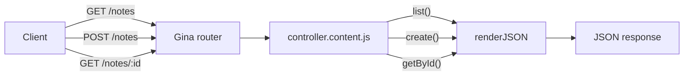

# Notes API

In this tutorial you will build a simple REST API for creating and listing notes. There is no database — notes live in memory and reset on restart. That keeps the focus on the two core skills every Gina developer needs first: **defining routes** and **writing controller actions**.

**What you'll learn:**

- Add routes to `routing.json`
- Write controller action methods
- Read URL parameters with `req.params`
- Read a POST body with `req.post`
- Return JSON with `self.renderJSON()`
- Return errors with `self.throwError()`

---

## What you'll build

Three endpoints, no external dependencies:

| Method | URL | Action |
| --- | --- | --- |
| `GET` | `/notes` | List all notes |
| `POST` | `/notes` | Create a note |
| `GET` | `/notes/:id` | Get one note by id |



---

## Step 1 — Scaffold

```bash
mkdir notes-api && cd notes-api
gina project:add @notes-api
gina bundle:add api @notes-api
```

Open `notes-api/env.json` and set the `dev` hostname to `localhost` (see [First Project](/getting-started/first-project#env-json-and-hostnames)).

The two files you will edit:

```
notes-api/
└── src/
    └── api/
        ├── config/
        │   └── routing.json              ← Step 2
        └── controllers/
            └── controller.content.js     ← Step 3
```

---

## Step 2 — Define the routes

Open `src/api/config/routing.json` and replace its contents with:

```json
{
  "list-notes": {
    "method": "GET",
    "url": "/notes",
    "param": { "control": "list" }
  },
  "create-note": {
    "method": "POST",
    "url": "/notes",
    "param": { "control": "create" }
  },
  "get-note": {
    "method": "GET",
    "url": "/notes/:id",
    "param": { "control": "getById" }
  }
}
```

Each key is the route name. `"param": { "control": "list" }` tells the router to call the `list()` method on `controller.content.js`.

---

## Step 3 — Write the controller

Open `src/api/controllers/controller.content.js` and replace its contents with:

```js
var SuperController = require('../../../core/controller/controller');

// In-memory store — resets on bundle restart.
// See Models & entities when you are ready for a real database.
var notes  = [];
var nextId = 1;

function Controller() {}
Controller = inherits(Controller, SuperController);

// GET /notes
Controller.prototype.list = function(req, res, next) {
    var self = this;
    self.renderJSON({ notes: notes, total: notes.length });
};

// POST /notes
Controller.prototype.create = function(req, res, next) {
    var self = this;
    var text = req.post.text;

    if (!text) {
        self.throwError(res, 400, '"text" is required');
        return;
    }

    var note = {
        id:        nextId++,
        text:      text,
        createdAt: new Date().toISOString()
    };
    notes.push(note);
    self.renderJSON({ note: note });
};

// GET /notes/:id
Controller.prototype.getById = function(req, res, next) {
    var self = this;
    var id   = Number(req.params.id);
    var note = notes.find(function(n) { return n.id === id; });

    if (!note) {
        self.throwError(res, 404, 'Note not found');
        return;
    }
    self.renderJSON({ note: note });
};

module.exports = Controller;
```

**Key patterns used:**

| Expression | What it reads |
| --- | --- |
| `req.post.text` | Field `text` from a JSON or form-encoded POST body |
| `req.params.id` | `:id` segment from the URL |
| `self.renderJSON(data)` | Serialize `data` as JSON, send `200 OK` |
| `self.throwError(res, code, msg)` | Send an error response — always `return` immediately after |

---

## Step 4 — Start and test

```bash
gina bundle:start api @notes-api
```

**List notes (empty):**

```bash
curl http://localhost:3100/notes
# → {"notes":[],"total":0}
```

**Create a note:**

```bash
curl -X POST http://localhost:3100/notes \
  -H "Content-Type: application/json" \
  -d '{"text": "Call Mama Nguyen"}'
# → {"note":{"id":1,"text":"Call Mama Nguyen","createdAt":"..."}}
```

**Create a second note:**

```bash
curl -X POST http://localhost:3100/notes \
  -H "Content-Type: application/json" \
  -d '{"text": "Buy groundnut oil at Marché Mokolo"}'
```

**List again:**

```bash
curl http://localhost:3100/notes
# → {"notes":[{"id":1,...},{"id":2,...}],"total":2}
```

**Get by id:**

```bash
curl http://localhost:3100/notes/1
# → {"note":{"id":1,"text":"Call Mama Nguyen","createdAt":"..."}}
```

**Missing note:**

```bash
curl http://localhost:3100/notes/99
# → {"error":"Note not found"}
```

**Missing `text` field:**

```bash
curl -X POST http://localhost:3100/notes \
  -H "Content-Type: application/json" \
  -d '{}'
# → {"error":"\"text\" is required"}
```

---

## What's next?

You now know the full round-trip for a Gina JSON API. A few natural next steps:

- **Add a `DELETE /notes/:id` route** and a `delete()` action to practise what you just learned — all the tools are already there.
- **Persist notes to a real database** — see [Models & entities](/guides/models) then follow the [Link Shortener tutorial](/tutorials/link-shortener) which uses SQLite ORM, async actions, and HTML views.
- **Add HTML views** to the same bundle — see [Views & Templates](/guides/views).
- **Build a mobile-ready backend** — see the [Mobile Backend guide](/guides/mobile-backend).
