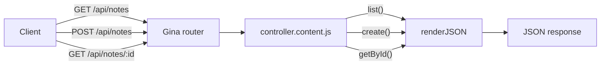

# Notes API

In this tutorial you will build a simple REST API for creating and listing notes. There is no database — notes live in memory and reset on bundle restart. That keeps the focus on the two core skills every Gina developer needs first: **defining routes** and **writing controller actions**.

**What you'll learn:**

- Add routes to `routing.json`
- Write controller action methods
- Read URL parameters with `req.params`
- Read a POST body with `req.post`
- Return JSON with `self.renderJSON()`
- Return errors with `self.throwError()`

:::info Download the finished project
<svg xmlns="http://www.w3.org/2000/svg" width="16" height="16" viewBox="0 0 24 24" fill="none" stroke="var(--ifm-link-color)" strokeWidth="2" strokeLinecap="round" strokeLinejoin="round" style={{verticalAlign: '-3px', marginRight: '4px'}}><path d="M21 15v4a2 2 0 0 1-2 2H5a2 2 0 0 1-2-2v-4"/><polyline points="7 10 12 15 17 10"/><line x1="12" y1="15" x2="12" y2="3"/></svg> [**notes-api.zip**](/downloads/tutorials/notes-api.zip) — extract and run:

```bash
cd notes
```

```bash
gina project:add @notes
```

```bash
gina bundle:add api @notes --import
```

```bash
gina bundle:start api @notes
```
:::

---

## What you'll build

Three endpoints, no external dependencies:

| Method | URL | Action |
| --- | --- | --- |
| `GET` | `/api/notes` | List all notes |
| `POST` | `/api/notes` | Create a note |
| `GET` | `/api/notes/:id` | Get one note by id |



---

## Step 1 — Scaffold

```bash
mkdir notes && cd notes
```

```bash
gina project:add @notes
```

```bash
gina bundle:add api @notes
```

Open `notes/env.json` and confirm the `dev` hostname is set to `localhost` (see [First Project](/getting-started/first-project#envjson-and-hostnames)).

The two files you will edit:

```
notes/
└── src/
    └── api/
        ├── config/
        │   └── routing.json              ← Step 2
        └── controllers/
            └── controller.content.js     ← Step 3
```

:::info Webroot
`gina bundle:add` sets the default webroot to `/api` in `src/api/config/settings.server.json`. Your routes will be served under `http://localhost:3100/api/…`. If you want bare `/notes` URLs, change `"webroot"` to `"/"` in that file before starting.
:::

---

## Step 2 — Define the routes

Open `src/api/config/routing.json` and replace its contents with:

```json
{
  "list-notes": {
    "namespace": "content",
    "method": "GET",
    "url": "/notes",
    "param": { "control": "list" }
  },
  "create-note": {
    "namespace": "content",
    "method": "POST",
    "url": "/notes",
    "param": { "control": "create" }
  },
  "get-note": {
    "namespace": "content",
    "method": "GET",
    "url": "/notes/:id",
    "param": { "control": "getById", "id": ":id" }
  }
}
```

**Key points:**

| Field | Purpose |
| --- | --- |
| `"namespace": "content"` | Routes to `controller.content.js` (required — without it the router looks in `controller.js`) |
| `"param": { "control": "list" }` | Calls the `list()` method |
| `"param": { "id": ":id" }` | Binds the `:id` URL segment to `req.params.id` |

---

## Step 3 — Write the controller

Open `src/api/controllers/controller.content.js` and replace its contents with:

```js
// In-memory store — resets on bundle restart.
// Dev mode reloads the controller module on each request for hot-reloading;
// attaching the store to `global` keeps it alive across those reloads within
// the same bundle process.
if (!global.__notesStore) {
    global.__notesStore = { notes: [], nextId: 1 };
}
var store = global.__notesStore;

function ApiContentController() {
    var self = this;

    // GET /api/notes
    this.list = function(req, res) {
        self.renderJSON({ notes: store.notes, total: store.notes.length });
    };

    // POST /api/notes
    this.create = function(req, res) {
        var text = req.post.text;

        if (!text) {
            self.throwError(res, 400, '"text" is required');
            return;
        }

        var note = {
            id        : store.nextId++
          , text      : text
          , createdAt : new Date().toISOString()
        };
        store.notes.push(note);
        self.renderJSON({ note: note });
    };

    // GET /api/notes/:id
    this.getById = function(req, res) {
        var id   = Number(req.params.id);
        var note = store.notes.find(function(n) { return n.id === id; });

        if (!note) {
            self.throwError(res, 404, 'Note not found');
            return;
        }
        self.renderJSON({ note: note });
    };
}

module.exports = ApiContentController;
```

**Key patterns used:**

| Expression | What it reads |
| --- | --- |
| `req.post.text` | Field `text` from a JSON or form-encoded POST body |
| `req.params.id` | `:id` segment from the URL |
| `self.renderJSON(data)` | Serialize `data` as JSON, send `200 OK` |
| `self.throwError(res, code, msg)` | Send an error response — always `return` immediately after |

:::info Dev mode and in-memory state
In `dev` (the default env), Gina reloads the controller module on every request to pick up code changes. Plain module-level `var notes = []` would reset on each request. Attaching state to `global` keeps it alive for the lifetime of the bundle process while still resetting on `gina bundle:restart`. See [Dev mode caching](/guides/caching) for details.
:::

---

## Step 4 — Start and test

```bash
gina bundle:start api @notes
```

**List notes (empty):**

```bash
curl http://localhost:3100/api/notes
# → {"notes":[],"total":0}
```

**Create a note:**

```bash
curl -X POST http://localhost:3100/api/notes \
  -H "Content-Type: application/json" \
  -d '{"text": "Call Mama Nguyen"}'
# → {"note":{"id":1,"text":"Call Mama Nguyen","createdAt":"..."}}
```

**Create a second note:**

```bash
curl -X POST http://localhost:3100/api/notes \
  -H "Content-Type: application/json" \
  -d '{"text": "Buy groundnut oil at Marché Mokolo"}'
```

**List again:**

```bash
curl http://localhost:3100/api/notes
# → {"notes":[{"id":1,...},{"id":2,...}],"total":2}
```

**Get by id:**

```bash
curl http://localhost:3100/api/notes/1
# → {"note":{"id":1,"text":"Call Mama Nguyen","createdAt":"..."}}
```

**Missing note:**

```bash
curl http://localhost:3100/api/notes/99
# → {"status":404,"error":"Not Found","message":"Note not found"}
```

**Missing `text` field:**

```bash
curl -X POST http://localhost:3100/api/notes \
  -H "Content-Type: application/json" \
  -d '{}'
# → {"status":400,"error":"Bad Request","message":"\"text\" is required"}
```

---

## What's next?

You now know the full round-trip for a Gina JSON API. A few natural next steps:

- **Add a `DELETE /api/notes/:id` route** and a `delete()` action to practise what you just learned — all the tools are already there.
- **Persist notes to a real database** — see [Models & entities](/guides/models) then follow the [Link Shortener tutorial](/tutorials/link-shortener) which uses SQLite ORM, async actions, and HTML views.
- **Add HTML views** to the same bundle — see [Views & Templates](/guides/views).
- **Build a mobile-ready backend** — see the [Mobile Backend guide](/guides/mobile-backend).
